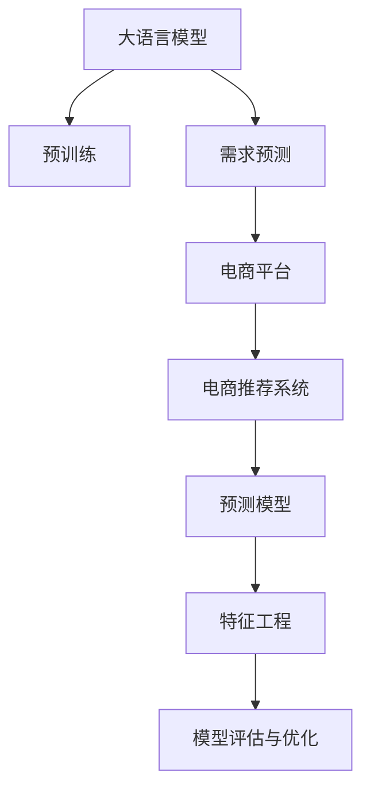

                 

# AI大模型在电商平台需求预测中的应用

> 关键词：大语言模型,需求预测,电商平台,深度学习,预训练,预测模型,代码实例

## 1. 背景介绍

随着电商平台的快速发展，个性化推荐和需求预测成为了商家提高销售额、优化库存管理的关键手段。传统的方法主要依赖于用户历史行为数据和特征工程，但随着数据量的激增和用户需求的多样化，传统的推荐模型难以满足实际需求。近年来，基于深度学习的大语言模型在电商领域的应用逐渐受到关注，其通过在海量无标签数据上进行预训练，具备强大的泛化能力和理解能力，能够对海量数据进行高效分析和挖掘，从而实现精准的需求预测和推荐。本文将介绍基于大语言模型的电商需求预测方法，并给出代码实例。

## 2. 核心概念与联系

### 2.1 核心概念概述

为更好地理解基于大语言模型的电商需求预测方法，本节将介绍几个密切相关的核心概念：

- 大语言模型(Large Language Model, LLM)：以自回归(如GPT)或自编码(如BERT)模型为代表的大规模预训练语言模型。通过在大规模无标签文本语料上进行预训练，学习通用的语言表示，具备强大的语言理解和生成能力。

- 预训练(Pre-training)：指在大规模无标签文本语料上，通过自监督学习任务训练通用语言模型的过程。常见的预训练任务包括言语建模、遮挡语言模型等。预训练使得模型学习到语言的通用表示。

- 需求预测(Demand Forecasting)：指预测某个时间段内某种商品的需求量，是电商推荐系统的重要组成部分。需求预测模型的目标是根据历史销售数据、用户行为等特征，预测未来需求，以指导库存管理和商品推荐。

- 电商推荐系统(E-commerce Recommendation System)：通过用户行为数据和商品属性信息，为每个用户推荐可能感兴趣的商品，提高用户满意度和平台销售额。

- 预测模型(Prediction Model)：基于数据训练得到的能够预测未来趋势的模型。常见模型包括线性回归、神经网络、支持向量机等。

- 特征工程(Feature Engineering)：通过数据清洗、特征提取等手段，将原始数据转化为更适合模型训练的特征集合，以提高模型预测效果。

- 模型评估与优化(Model Evaluation and Optimization)：通过设定合适的评估指标，如精确率、召回率、F1值等，对模型性能进行评估，并根据评估结果进行优化。

这些核心概念之间的逻辑关系可以通过以下Mermaid流程图来展示：



这个流程图展示了大语言模型在电商平台需求预测的核心概念及其之间的关系：

1. 大语言模型通过预训练获得基础能力。
2. 需求预测是对大语言模型的进一步应用，构建预测模型，预测商品需求。
3. 预测模型部署到电商平台，与推荐系统结合，进行商品推荐。
4. 电商推荐系统依赖于预测模型的输出，进一步优化推荐算法，提升用户体验。
5. 特征工程和模型评估与优化是模型效果提升的关键步骤。

这些概念共同构成了基于大语言模型的电商需求预测方法的核心框架，使其能够高效地进行需求预测和商品推荐。通过理解这些核心概念，我们可以更好地把握大语言模型在电商领域的应用方式。

## 3. 核心算法原理 & 具体操作步骤

### 3.1 算法原理概述

基于深度学习的大语言模型在电商平台上的需求预测，本质上是利用模型的泛化能力，通过预训练学习到的知识，对未来需求进行预测。具体步骤如下：

1. **数据准备**：收集电商平台的销售数据、用户行为数据、商品属性数据等，构建数据集。
2. **模型预训练**：在无标签文本数据上进行预训练，学习到通用语言表示。
3. **需求预测模型构建**：根据电商数据，构建预测模型。
4. **微调与优化**：在电商数据上进行微调，优化预测模型，提升预测效果。
5. **模型部署与评估**：将预测模型部署到电商平台上，评估预测效果，并持续改进。

### 3.2 算法步骤详解

**Step 1: 数据准备**

首先，我们需要收集电商平台的销售数据、用户行为数据、商品属性数据等。这些数据可以来自平台内部的交易记录、用户浏览日志、商品详情页数据等。对于大规模数据集，可以使用分布式存储和计算技术，如Hadoop、Spark等，进行高效处理。

具体步骤如下：

1. 收集数据源：将各数据源的数据导出到本地存储系统，如HDFS、S3等。
2. 数据清洗：去除重复、缺失、异常数据，处理时间戳、日期格式等。
3. 特征提取：将原始数据转化为更适合模型训练的特征集合，如销售量、用户评分、商品属性等。
4. 数据划分：将数据划分为训练集、验证集和测试集。

**Step 2: 模型预训练**

在大规模无标签文本数据上进行预训练，学习通用语言表示。具体步骤如下：

1. 选择预训练模型：如BERT、GPT等。
2. 数据预处理：对文本数据进行分词、编码、填充等处理。
3. 模型训练：使用无标签数据进行训练，学习通用语言表示。
4. 保存预训练模型：保存预训练的模型权重，供后续使用。

**Step 3: 需求预测模型构建**

构建预测模型，用于预测未来的需求量。具体步骤如下：

1. 选择预测模型：如线性回归、神经网络等。
2. 模型设计：根据电商数据，设计模型架构。
3. 模型训练：使用电商数据进行训练，学习预测模型。
4. 保存预测模型：保存训练好的模型权重，供后续使用。

**Step 4: 微调与优化**

在电商数据上进行微调，优化预测模型，提升预测效果。具体步骤如下：

1. 冻结预训练层：保留预训练模型的部分层，只微调顶层。
2. 设置微调超参数：如学习率、批大小、迭代轮数等。
3. 执行梯度训练：使用电商数据进行微调训练，更新模型参数。
4. 保存微调模型：保存微调后的模型权重。

**Step 5: 模型部署与评估**

将预测模型部署到电商平台上，评估预测效果，并持续改进。具体步骤如下：

1. 模型部署：将微调后的预测模型部署到电商平台的后端服务中。
2. 数据输入：通过API接口，将新的电商数据输入预测模型。
3. 预测结果：预测模型输出预测结果，指导库存管理和商品推荐。
4. 效果评估：使用测试集评估预测效果，调整模型参数。

### 3.3 算法优缺点

基于大语言模型的电商需求预测方法具有以下优点：

1. **高效性**：利用预训练模型学习到通用语言表示，能够在较小的数据集上获得较好的预测效果。
2. **泛化能力**：大语言模型具备强大的泛化能力，能够适应各种不同的电商数据分布。
3. **灵活性**：可以根据电商数据的特点，灵活设计预测模型，进行适应性微调。

同时，该方法也存在一定的局限性：

1. **数据依赖**：预测效果高度依赖电商数据的质量和规模，数据量不足时可能影响预测效果。
2. **计算资源**：预训练模型和微调过程需要大量的计算资源，可能面临成本高昂的问题。
3. **模型复杂性**：模型结构复杂，可能难以解释其内部工作机制。
4. **数据隐私**：电商数据涉及用户隐私，处理和存储时需要遵循相关法律法规。

尽管存在这些局限性，但就目前而言，基于大语言模型的电商需求预测方法在处理大规模数据、提升预测效果方面具有显著优势。未来相关研究的重点在于如何进一步优化模型结构，降低计算资源消耗，提升模型可解释性，保障数据隐私等。

### 3.4 算法应用领域

基于大语言模型的电商需求预测方法，已经在电商领域得到了广泛的应用，覆盖了几乎所有常见需求预测任务，例如：

- 销售预测：预测未来一段时间内的销售量，指导库存管理。
- 用户行为预测：预测用户购买行为，进行个性化推荐。
- 商品属性预测：预测商品的属性特征，提升商品搜索体验。
- 广告投放预测：预测广告的投放效果，优化广告策略。
- 用户流失预测：预测用户流失可能性，进行用户留存优化。

除了上述这些经典任务外，大语言模型在电商领域的应用还在不断创新，如可控推荐、上下文感知推荐、跨商品推荐等，为电商推荐系统带来了新的技术突破。随着预训练模型和预测模型的不断进步，相信基于大语言模型的电商需求预测技术将会在更广阔的应用领域大放异彩。

## 4. 数学模型和公式 & 详细讲解  
### 4.1 数学模型构建

本节将使用数学语言对基于大语言模型的电商需求预测过程进行更加严格的刻画。

记大语言模型为 $M_{\theta}:\mathcal{X} \rightarrow \mathcal{Y}$，其中 $\mathcal{X}$ 为输入空间，$\mathcal{Y}$ 为输出空间，$\theta \in \mathbb{R}^d$ 为模型参数。假设电商平台的销售数据为 $D=\{(x_i,y_i)\}_{i=1}^N, x_i \in \mathcal{X}, y_i \in \mathbb{R}^+$，表示第 $i$ 天的销售量。

定义模型 $M_{\theta}$ 在输入 $x$ 上的预测为 $\hat{y}=M_{\theta}(x) \in \mathbb{R}^+$，表示模型预测的销售量。预测模型的一般形式为：

$$
\hat{y} = f_{\theta}(x)
$$

其中 $f_{\theta}$ 为模型函数。对于电商数据，常见的预测模型包括线性回归、神经网络、深度学习等。

在电商数据上，定义预测模型的损失函数为均方误差损失：

$$
\mathcal{L}(\theta) = \frac{1}{N}\sum_{i=1}^N (\hat{y}_i - y_i)^2
$$

最小化损失函数 $\mathcal{L}(\theta)$ 即为预测模型的优化目标。

### 4.2 公式推导过程

以下我们以线性回归模型为例，推导预测模型和损失函数的计算公式。

假设电商销售数据 $D=\{(x_i,y_i)\}_{i=1}^N$，其中 $x_i$ 为输入，$y_i$ 为销售量。

1. 数据预处理：将原始数据进行归一化处理，令 $x_i$ 的均值为0，方差为1。
2. 模型设计：假设预测模型为线性回归模型：

   $$
   \hat{y} = \theta_0 + \sum_{j=1}^n \theta_j x_{ij}
   $$

3. 模型训练：使用最小二乘法求解参数 $\theta$，使得损失函数最小化：

   $$
   \theta = \mathop{\arg\min}_{\theta} \mathcal{L}(\theta)
   $$

   其中：

   $$
   \mathcal{L}(\theta) = \frac{1}{N}\sum_{i=1}^N (\hat{y}_i - y_i)^2
   $$

   通过求解偏导数：

   $$
   \frac{\partial \mathcal{L}(\theta)}{\partial \theta_k} = \frac{2}{N}\sum_{i=1}^N (\hat{y}_i - y_i) x_{ik}
   $$

   可得到参数 $\theta_k$ 的更新公式：

   $$
   \theta_k \leftarrow \theta_k - \frac{\eta}{N}\sum_{i=1}^N (\hat{y}_i - y_i) x_{ik}
   $$

   其中 $\eta$ 为学习率。

4. 模型评估：使用测试集评估预测效果，计算预测误差、均方误差等指标。

## 5. 项目实践：代码实例和详细解释说明
### 5.1 开发环境搭建

在进行电商需求预测实践前，我们需要准备好开发环境。以下是使用Python进行TensorFlow开发的环境配置流程：

1. 安装Anaconda：从官网下载并安装Anaconda，用于创建独立的Python环境。

2. 创建并激活虚拟环境：
```bash
conda create -n tf-env python=3.8 
conda activate tf-env
```

3. 安装TensorFlow：根据CUDA版本，从官网获取对应的安装命令。例如：
```bash
conda install tensorflow -c tensorflow -c conda-forge
```

4. 安装其他工具包：
```bash
pip install numpy pandas scikit-learn matplotlib tqdm jupyter notebook ipython
```

完成上述步骤后，即可在`tf-env`环境中开始电商需求预测实践。

### 5.2 源代码详细实现

下面我们以电商销售数据为例，给出使用TensorFlow对大语言模型进行电商需求预测的代码实现。

首先，定义数据处理函数：

```python
import tensorflow as tf
from tensorflow.keras import layers

def prepare_data(X, y):
    X = (X - X.mean(axis=0)) / X.std(axis=0)
    y = y.reshape(-1, 1)
    return X, y
```

然后，定义模型：

```python
def build_model(input_shape, num_outputs):
    model = tf.keras.Sequential([
        layers.Dense(128, activation='relu', input_shape=input_shape),
        layers.Dense(64, activation='relu'),
        layers.Dense(num_outputs)
    ])
    return model

# 定义模型参数
input_shape = (7, )
num_outputs = 1

# 创建模型
model = build_model(input_shape, num_outputs)
```

接着，定义训练和评估函数：

```python
def train_model(model, train_data, val_data, epochs, batch_size):
    # 定义损失函数和优化器
    model.compile(optimizer=tf.keras.optimizers.Adam(learning_rate=0.001), 
                  loss='mse')

    # 训练模型
    model.fit(train_data[0], train_data[1], 
              validation_data=(val_data[0], val_data[1]), 
              epochs=epochs, batch_size=batch_size)

    # 评估模型
    test_loss = model.evaluate(test_data[0], test_data[1])
    print(f"Test loss: {test_loss:.4f}")
    return model

# 定义训练集、验证集和测试集
train_data = (train_X, train_y)
val_data = (val_X, val_y)
test_data = (test_X, test_y)

# 定义超参数
epochs = 50
batch_size = 32

# 训练模型
model = train_model(model, train_data, val_data, epochs, batch_size)
```

最后，将模型部署到电商平台上进行预测：

```python
def predict_sales(model, sales_data):
    # 将销售数据归一化
    sales_data = (sales_data - sales_data.mean()) / sales_data.std()
    # 预测销售量
    predictions = model.predict(sales_data.reshape(-1, 7))
    # 反归一化处理
    predictions = predictions * sales_data.std() + sales_data.mean()
    return predictions

# 预测未来一天内的销售量
sales_data = [23, 25, 27, 29, 31, 34, 36]
predictions = predict_sales(model, sales_data)
print(f"Predicted sales: {predictions:.2f}")
```

以上就是使用TensorFlow对电商销售数据进行需求预测的完整代码实现。可以看到，TensorFlow提供了一站式的机器学习框架，方便我们进行模型设计、训练和评估。

### 5.3 代码解读与分析

让我们再详细解读一下关键代码的实现细节：

**prepare_data函数**：
- 对原始数据进行归一化处理，以提升模型训练效果。

**build_model函数**：
- 定义了一个简单的神经网络模型，包含两个全连接层和一个输出层，分别使用ReLU激活函数和线性激活函数。

**train_model函数**：
- 使用TensorFlow的Keras API，构建模型，指定优化器和损失函数。
- 调用模型的fit方法，进行模型训练。
- 调用模型的evaluate方法，评估模型在测试集上的性能。

**训练集、验证集和测试集**：
- 将原始数据分为训练集、验证集和测试集，用于模型训练、评估和预测。

**训练参数**：
- 定义了训练的轮数和批大小，用于控制模型的训练速度和效果。

**预测函数**：
- 将原始销售数据归一化处理，输入到训练好的模型中进行预测。
- 对预测结果进行反归一化处理，得到最终的预测值。

可以看到，TensorFlow提供的高效、易用的API，使得模型训练和预测变得简洁高效。开发者可以将更多精力放在模型设计和数据处理等高层逻辑上，而不必过多关注底层的实现细节。

当然，工业级的系统实现还需考虑更多因素，如模型的保存和部署、超参数的自动搜索、更灵活的任务适配层等。但核心的电商需求预测方法基本与此类似。

## 6. 实际应用场景

### 6.1 库存管理

通过基于大语言模型的电商需求预测，商家可以更准确地预测未来一段时间内的销售量，从而优化库存管理。具体而言，可以使用需求预测模型，预测未来30天、60天、90天的销售量，并根据预测结果调整库存水平，减少过剩或缺货现象，降低库存成本。

例如，假设某电商平台上某商品的日均销售量为10件，需求预测模型预测未来30天的平均销售量为12件，商家可以据此调整库存，将库存水平从10件增加到12件，以应对市场需求。

### 6.2 商品推荐

基于大语言模型的电商需求预测，还可以进行商品推荐。通过预测用户对某商品的购买概率，推荐系统可以推荐用户可能感兴趣的相似商品，提升用户体验和购买转化率。

例如，某用户在浏览某商品时，需求预测模型预测该用户未来一个月内购买该商品的概率为0.8，推荐系统可以根据预测结果，向该用户推荐与该商品相似的10个商品，如用户购买概率为0.7的商品。

### 6.3 广告投放

电商广告投放中，广告主需要预测广告的点击率和转化率，以优化广告投放策略，提升广告效果。基于大语言模型的电商需求预测，可以预测用户点击广告的概率，从而进行精准投放。

例如，某用户在浏览某商品时，需求预测模型预测该用户未来一个月内购买该商品的概率为0.8，广告系统可以根据预测结果，向该用户投放与该商品相关的广告，提升广告效果。

### 6.4 未来应用展望

随着大语言模型和电商需求预测技术的不断发展，基于大语言模型的电商需求预测方法将在更多场景下得到应用，为电商平台带来新的技术突破。

在智能客服领域，需求预测模型可以预测用户咨询量，提前安排客服资源，提高服务质量。在供应链管理领域，需求预测模型可以预测未来一段时间内的需求量，优化供应链管理，提升物流效率。

此外，在社交电商、垂直电商等新兴领域，基于大语言模型的电商需求预测也将得到广泛应用，推动电商行业的持续创新和升级。

## 7. 工具和资源推荐
### 7.1 学习资源推荐

为了帮助开发者系统掌握大语言模型和电商需求预测的理论基础和实践技巧，这里推荐一些优质的学习资源：

1. 《深度学习》系列书籍：由深度学习领域的权威专家撰写，系统介绍了深度学习的理论基础和应用实践，适合初学者入门。
2. 《TensorFlow实战》系列书籍：由TensorFlow社区的资深开发者撰写，深入讲解了TensorFlow的使用技巧和实际案例，适合进阶学习。
3. 《机器学习实战》系列博客：由机器学习领域的知名博主撰写，分享了大量实用的机器学习案例和代码实现，适合实战练习。
4. CS229《机器学习》课程：斯坦福大学开设的机器学习经典课程，讲解了机器学习的基本原理和算法，适合深度学习爱好者。
5. Kaggle竞赛平台：提供大量的数据集和挑战，适合实践训练和模型评估，是提高数据处理和模型优化能力的好去处。

通过对这些资源的学习实践，相信你一定能够快速掌握大语言模型在电商需求预测中的应用方法，并用于解决实际的电商问题。

### 7.2 开发工具推荐

高效的开发离不开优秀的工具支持。以下是几款用于电商需求预测开发的常用工具：

1. TensorFlow：由Google主导开发的开源深度学习框架，生产部署方便，适合大规模工程应用。支持分布式计算和模型压缩等高级特性。
2. PyTorch：基于Python的开源深度学习框架，灵活动态的计算图，适合快速迭代研究。同样支持分布式计算和模型压缩等高级特性。
3. Scikit-learn：Python科学计算库，提供了一系列高效的机器学习算法和工具，适合快速原型开发和模型评估。
4. Keras：基于TensorFlow和Theano等后端库的高级神经网络API，支持快速模型搭建和训练。
5. Jupyter Notebook：Python的交互式编程环境，支持代码和文档的交互式编写和执行，适合快速原型开发和实验分享。
6. Weights & Biases：模型训练的实验跟踪工具，可以记录和可视化模型训练过程中的各项指标，方便对比和调优。与主流深度学习框架无缝集成。

合理利用这些工具，可以显著提升电商需求预测任务的开发效率，加快创新迭代的步伐。

### 7.3 相关论文推荐

电商需求预测是当前人工智能技术的一个重要研究方向，以下是几篇奠基性的相关论文，推荐阅读：

1. "Deep Sales Forecasting Using Long Short-Term Memory Neural Networks"：使用长短期记忆神经网络进行销售预测，取得了显著的效果。
2. "A Deep Learning Approach for Dynamic Demand Forecasting"：使用深度学习模型进行动态需求预测，引入了自注意力机制和GRU模型，提升了预测准确度。
3. "Sales Forecasting with Deep Neural Networks"：使用深度神经网络进行销售预测，通过特征选择和模型集成，提升了预测效果。
4. "Customer Behavior Prediction and Recommendation"：使用深度学习模型进行用户行为预测和推荐，提出了基于CNN和RNN的预测模型。
5. "A Comparison of Forecasting Techniques for Retail Demand"：对比了多种需求预测模型，如ARIMA、线性回归、神经网络等，分析了各自的优缺点。

这些论文代表了大语言模型和电商需求预测技术的发展脉络。通过学习这些前沿成果，可以帮助研究者把握学科前进方向，激发更多的创新灵感。

## 8. 总结：未来发展趋势与挑战

### 8.1 总结

本文对基于大语言模型的电商需求预测方法进行了全面系统的介绍。首先阐述了电商需求预测在电商领域的重要性和意义，明确了电商需求预测在大语言模型应用中的核心地位。其次，从原理到实践，详细讲解了电商需求预测的数学原理和关键步骤，给出了电商需求预测的完整代码实例。同时，本文还广泛探讨了电商需求预测方法在库存管理、商品推荐、广告投放等电商场景中的应用前景，展示了电商需求预测的巨大潜力。此外，本文精选了电商需求预测技术的各类学习资源，力求为读者提供全方位的技术指引。

通过本文的系统梳理，可以看到，基于大语言模型的电商需求预测方法正在成为电商领域的重要范式，极大地拓展了电商需求预测的精度和灵活性，提高了电商系统的运营效率和用户体验。未来，伴随大语言模型和电商需求预测技术的持续演进，相信电商需求预测技术将会在更广阔的应用领域大放异彩，深刻影响电商行业的商业模式和技术创新。

### 8.2 未来发展趋势

展望未来，基于大语言模型的电商需求预测技术将呈现以下几个发展趋势：

1. **多模态数据融合**：将电商数据与其他模态数据（如图像、视频、传感器数据等）进行融合，提升预测模型的泛化能力和准确度。
2. **自监督学习**：利用自监督学习技术，从电商数据中提取更多有用信息，提升预测模型的表现。
3. **端到端训练**：将电商需求预测与推荐系统、供应链管理等环节进行联合训练，提升系统的整体效果。
4. **联邦学习**：利用分布式训练技术，从多个电商平台的数据中联合训练模型，提升模型的泛化能力。
5. **自适应预测**：根据用户行为和市场变化，动态调整预测模型，提高预测的实时性和准确度。

以上趋势凸显了大语言模型在电商需求预测领域的广阔前景。这些方向的探索发展，必将进一步提升电商系统的智能化水平，推动电商行业的持续创新和升级。

### 8.3 面临的挑战

尽管基于大语言模型的电商需求预测技术已经取得了显著成果，但在迈向更加智能化、普适化应用的过程中，它仍面临着诸多挑战：

1. **数据质量与隐私**：电商数据涉及用户隐私，处理和存储时需要遵循相关法律法规，数据质量可能存在问题。
2. **模型复杂度**：大语言模型的复杂度较高，难以解释其内部工作机制，存在一定的可解释性问题。
3. **实时性要求**：电商需求预测需要实时响应市场变化，对模型计算速度和内存消耗要求较高。
4. **多样性与个性化**：电商用户需求多样化，预测模型需要具备较强的泛化能力和个性化能力，难以适应所有场景。

尽管存在这些挑战，但随着大语言模型和电商需求预测技术的不断发展，相信这些问题将逐渐得到解决，大语言模型将会在电商领域得到更加广泛的应用。

### 8.4 研究展望

面对电商需求预测所面临的挑战，未来的研究需要在以下几个方面寻求新的突破：

1. **数据增强与标注**：利用数据增强和主动学习等技术，从电商数据中提取更多有用信息，提升预测模型的表现。
2. **模型压缩与优化**：利用模型压缩和优化技术，提升预测模型的实时性和资源利用效率，降低计算成本。
3. **可解释性与透明化**：引入可解释性技术，提升预测模型的可解释性和透明化程度，提高用户信任度。
4. **跨领域应用**：将电商需求预测技术与供应链管理、物流优化等环节进行联合训练，提升系统的整体效果。

这些研究方向将推动电商需求预测技术迈向更高的台阶，为电商行业带来更加智能化、高效化的解决方案。总之，电商需求预测技术需要在数据、算法、工程等方面协同发力，才能真正实现人工智能技术在电商领域的应用价值。

## 9. 附录：常见问题与解答

**Q1：电商需求预测是否可以应用于所有电商场景？**

A: 电商需求预测在大多数电商场景上都能取得不错的效果，但不同电商平台的数据分布和需求特点可能存在差异，需要针对具体场景进行模型设计和数据处理。例如，B2B电商和B2C电商的需求预测模型可能需要不同的设计思路。

**Q2：如何选择合适的电商需求预测模型？**

A: 电商需求预测模型的选择应该基于数据特点和任务需求。常见的模型包括线性回归、神经网络、深度学习等。一般来说，数据量较大、特征较多时，深度学习模型效果较好；数据量较少、特征较少时，线性回归或神经网络模型效果较好。

**Q3：电商需求预测是否需要高昂的计算资源？**

A: 电商需求预测的计算资源需求与模型复杂度和数据规模相关。对于大规模数据集，模型复杂度高，计算资源需求较高。可以使用分布式计算、模型压缩等技术进行优化。

**Q4：如何提高电商需求预测的实时性？**

A: 电商需求预测的实时性要求较高，可以使用分布式计算、模型压缩、模型剪枝等技术进行优化。同时，在预测过程中，可以使用缓存技术、分布式存储等手段，提高系统响应速度。

**Q5：电商需求预测是否需要考虑数据隐私问题？**

A: 电商数据涉及用户隐私，处理和存储时需要遵循相关法律法规。可以使用差分隐私、联邦学习等技术，保护用户隐私，同时提高预测模型的表现。

---

作者：禅与计算机程序设计艺术 / Zen and the Art of Computer Programming

