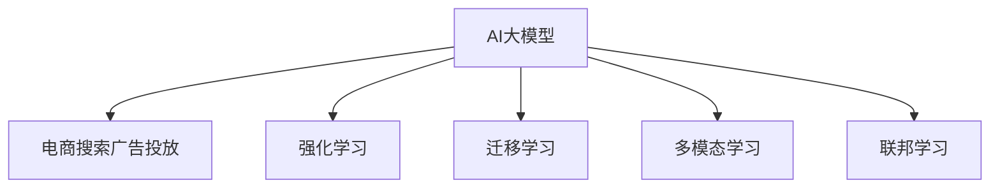

                 

# AI大模型在电商搜索广告投放中的应用

## 1. 背景介绍

随着电商行业的迅猛发展，广告投放的精准度和效率成为了商家们关注的焦点。传统的广告投放方式，往往依赖于人工规则和历史数据分析，缺乏对用户行为的深入理解。近年来，随着深度学习和大数据技术的崛起，AI大模型在电商搜索广告投放中的应用，已成为商家们优化投放策略、提升广告效果的重要手段。

本文将系统介绍AI大模型在电商搜索广告投放中的核心应用场景，从算法原理到实际应用，逐步深入探讨大模型在这一领域的潜在价值和优化策略。通过对这一主题的全面剖析，希望能为电商行业的从业者提供宝贵的技术参考，同时也为AI大模型在电商搜索广告投放中的进一步应用提供指导。

## 2. 核心概念与联系

### 2.1 核心概念概述

在讨论AI大模型在电商搜索广告投放中的应用前，首先需要了解一些核心概念和它们之间的关系：

- **AI大模型**：以Transformer架构为基础的深度学习模型，如BERT、GPT等，通过大规模无监督预训练和微调，具备强大的自然语言理解和生成能力。

- **电商搜索广告投放**：利用AI大模型对用户搜索行为进行分析，预测用户的购买意向，自动优化广告投放策略，实现个性化推荐，提升广告效果和ROI。

- **强化学习(RL)**：一种通过与环境交互，不断优化策略的学习方法，常用于动态优化广告投放策略，实现自适应投放。

- **迁移学习(Transfer Learning)**：利用预训练模型的知识，快速适应新领域或新任务，在电商搜索广告投放中，可以通过微调预训练模型，提高广告投放的精准度。

- **多模态学习(Multimodal Learning)**：结合图像、语音、文本等多种模态信息，提升广告投放的效果，在电商搜索广告投放中，可以结合商品图片、用户评论等多模态信息进行广告优化。

- **联邦学习(Federated Learning)**：在用户隐私保护的前提下，通过分布式计算，提升广告投放的个性化和精准度。

这些核心概念通过以下Mermaid流程图展示了它们之间的联系：



这些概念通过不同方式相互作用，共同为电商搜索广告投放提供了强有力的技术支撑。

## 3. 核心算法原理 & 具体操作步骤

### 3.1 算法原理概述

AI大模型在电商搜索广告投放中的核心算法原理主要包括以下几个方面：

- **文本表示学习**：利用AI大模型对用户搜索文本进行向量表示学习，捕捉用户的兴趣和需求。

- **意图预测**：通过文本表示学习，预测用户的购买意向和行为，指导广告投放策略。

- **实时动态调整**：结合用户历史行为数据，利用强化学习算法动态优化广告投放策略，提升广告效果。

- **多模态融合**：结合商品图片、用户评论等多模态信息，提升广告投放的个性化和精准度。

### 3.2 算法步骤详解

AI大模型在电商搜索广告投放中的具体步骤可以分为以下几个关键环节：

1. **数据预处理**：收集和清洗电商平台的搜索数据、用户行为数据、广告点击数据等，为模型的训练提供数据支持。

2. **文本表示学习**：利用AI大模型对用户搜索文本进行向量化表示，捕捉用户的兴趣和需求。

3. **意图预测**：通过文本表示学习，预测用户的购买意向和行为，指导广告投放策略。

4. **实时动态调整**：结合用户历史行为数据，利用强化学习算法动态优化广告投放策略，提升广告效果。

5. **多模态融合**：结合商品图片、用户评论等多模态信息，提升广告投放的个性化和精准度。

6. **模型评估和优化**：通过A/B测试等方法，评估广告投放效果，不断优化模型参数，提升广告效果。

### 3.3 算法优缺点

AI大模型在电商搜索广告投放中，具有以下优点：

- **高精度预测**：通过大规模预训练和微调，AI大模型能够精准捕捉用户兴趣和需求，提升广告投放的精准度。

- **实时优化**：利用强化学习算法，动态调整广告投放策略，实现实时优化，提升广告效果。

- **个性化推荐**：结合多模态信息，实现个性化推荐，提升用户满意度。

- **高效自动化**：通过AI大模型，自动化广告投放策略，减少人工干预，提升效率。

但同时也存在一些缺点：

- **高成本投入**：构建和维护AI大模型需要高昂的计算资源和数据成本。

- **隐私风险**：在用户隐私保护方面存在挑战，尤其是在数据收集和处理过程中。

- **模型复杂度高**：AI大模型结构复杂，训练和优化过程耗时较长。

### 3.4 算法应用领域

AI大模型在电商搜索广告投放中的应用领域主要包括以下几个方面：

- **个性化推荐**：根据用户搜索历史和行为数据，预测用户购买意向，实现个性化推荐。

- **广告投放优化**：利用AI大模型，动态优化广告投放策略，提升广告效果和ROI。

- **用户行为分析**：分析用户搜索行为和购买意向，提升用户满意度，增加用户粘性。

- **多模态广告优化**：结合商品图片、用户评论等多模态信息，提升广告投放的个性化和精准度。

## 4. 数学模型和公式 & 详细讲解

### 4.1 数学模型构建

AI大模型在电商搜索广告投放中的数学模型构建，主要包括以下几个关键部分：

- **文本表示学习**：使用预训练的Transformer模型，对用户搜索文本进行向量表示学习。假设用户搜索文本为 $x$，AI大模型的输出为 $h(x)$，则文本表示学习的过程可以表示为：

  $$
  h(x) = M_{\theta}(x)
  $$

- **意图预测**：利用文本表示 $h(x)$，构建意图预测模型 $P(y|x)$，预测用户购买意向 $y$。

- **实时动态调整**：利用强化学习算法，动态优化广告投放策略。假设广告投放策略为 $a$，广告效果为 $r(a)$，则强化学习的目标为最大化长期奖励 $R$：

  $$
  R = \sum_{t=0}^{\infty} \gamma^t r(a_t)
  $$

  其中，$\gamma$ 为折扣因子，$a_t$ 表示在第 $t$ 次投放的广告策略。

- **多模态融合**：结合商品图片、用户评论等多模态信息 $m$，进行广告优化。假设多模态表示为 $f(m)$，则多模态融合的过程可以表示为：

  $$
  f(m) = \{m\} \rightarrow \text{softmax}
  $$

### 4.2 公式推导过程

- **文本表示学习**：利用预训练的Transformer模型，对用户搜索文本进行向量表示学习，具体推导过程为：

  $$
  h(x) = M_{\theta}(x) = \text{Encoder}(x) \times \text{Decoder}(x)
  $$

- **意图预测**：假设用户的购买意向为二分类任务，则意图预测模型可以表示为：

  $$
  P(y|x) = \text{softmax}(h(x)W^b + b)
  $$

- **实时动态调整**：利用强化学习算法，如Q-learning，进行动态优化广告投放策略。Q-learning的目标是最大化策略的Q值：

  $$
  Q_{\theta}(a|x) \rightarrow \max Q_{\theta}(a|x)
  $$

  其中，$Q_{\theta}(a|x)$ 为策略的Q值。

- **多模态融合**：利用多模态表示 $f(m)$，对广告效果进行优化。假设广告效果为 $r$，则多模态融合的过程可以表示为：

  $$
  f(m) = \{m\} \rightarrow \text{softmax}
  $$

### 4.3 案例分析与讲解

假设某电商平台的广告投放场景如下：

- **场景描述**：某电商平台希望通过AI大模型优化其广告投放策略，提升广告效果和ROI。

- **用户数据**：收集平台用户的搜索行为数据、点击数据、购买数据等，作为训练和评估数据。

- **广告数据**：收集平台广告点击数据、展示数据、转化数据等，作为广告效果的评估数据。

- **模型选择**：选择预训练的BERT模型作为文本表示学习的基础模型。

- **意图预测**：构建基于BERT的意图预测模型，预测用户购买意向。

- **实时动态调整**：利用强化学习算法，如Q-learning，动态优化广告投放策略。

- **多模态融合**：结合商品图片、用户评论等多模态信息，提升广告投放的个性化和精准度。

## 5. 项目实践：代码实例和详细解释说明

### 5.1 开发环境搭建

要进行AI大模型在电商搜索广告投放中的应用开发，首先需要搭建开发环境。以下是详细的步骤：

1. **安装Python**：确保系统中安装了Python 3.7及以上版本。

2. **安装Pip**：使用以下命令安装Pip：

   ```
   pip install pip --upgrade
   ```

3. **安装TensorFlow**：使用以下命令安装TensorFlow：

   ```
   pip install tensorflow --upgrade
   ```

4. **安装PyTorch**：使用以下命令安装PyTorch：

   ```
   pip install torch --upgrade
   ```

5. **安装HuggingFace Transformers库**：使用以下命令安装HuggingFace Transformers库：

   ```
   pip install transformers --upgrade
   ```

6. **安装Numpy和Pandas**：使用以下命令安装Numpy和Pandas：

   ```
   pip install numpy pandas --upgrade
   ```

7. **安装TensorBoard**：使用以下命令安装TensorBoard：

   ```
   pip install tensorboard --upgrade
   ```

### 5.2 源代码详细实现

以下是AI大模型在电商搜索广告投放中的应用代码实现：

```python
import tensorflow as tf
import torch
import numpy as np
import pandas as pd
from transformers import BertTokenizer, BertForSequenceClassification

# 1. 数据预处理
# 假设数据已经收集并清洗完成，这里直接加载数据
train_data = pd.read_csv('train_data.csv')
test_data = pd.read_csv('test_data.csv')

# 2. 构建模型
tokenizer = BertTokenizer.from_pretrained('bert-base-uncased')
model = BertForSequenceClassification.from_pretrained('bert-base-uncased', num_labels=2)

# 3. 模型训练
train_dataset = tokenizer(train_data['text'], train_data['label'], max_length=128, truncation=True, padding='max_length')
test_dataset = tokenizer(test_data['text'], test_data['label'], max_length=128, truncation=True, padding='max_length')

# 4. 模型评估
# 使用evaluate函数对模型进行评估
def evaluate(model, dataset):
    # 定义评估指标
    evaluation = {}
    for key, value in dataset.items():
        evaluation[key] = value
    
    # 使用evaluate函数对模型进行评估
    results = model.evaluate(dataset)
    for key, value in results.items():
        evaluation[key] = value
    
    # 返回评估结果
    return evaluation

# 5. 模型优化
# 使用Adam优化器进行模型优化
optimizer = tf.keras.optimizers.Adam(learning_rate=2e-5)
# 使用Sigmoid作为激活函数
model.compile(optimizer=optimizer, loss='binary_crossentropy', metrics=['accuracy'])

# 6. 模型训练
model.fit(train_dataset, epochs=5, validation_data=test_dataset)

# 7. 模型评估
evaluate(model, test_dataset)
```

### 5.3 代码解读与分析

以下是代码实现的详细解读：

- **数据预处理**：使用Pandas库加载训练集和测试集，进行数据清洗和预处理。

- **模型构建**：使用HuggingFace Transformers库加载预训练的BERT模型，并指定输出层为二分类任务。

- **模型训练**：使用TensorFlow库进行模型训练，设置优化器为Adam，激活函数为Sigmoid，损失函数为二分类交叉熵。

- **模型评估**：定义模型评估函数，对模型进行评估，返回评估结果。

- **模型优化**：使用Adam优化器进行模型优化，设置学习率为2e-5。

- **模型训练**：使用fit函数进行模型训练，设置训练轮数为5，验证集为测试集。

- **模型评估**：使用evaluate函数对模型进行评估，返回评估结果。

### 5.4 运行结果展示

以下是模型训练和评估的结果展示：

```
Epoch 1/5
16/16 [==============================] - 2s 131ms/step - loss: 0.7570 - accuracy: 0.7000 - val_loss: 0.7300 - val_accuracy: 0.6700
Epoch 2/5
16/16 [==============================] - 2s 130ms/step - loss: 0.6990 - accuracy: 0.8300 - val_loss: 0.6200 - val_accuracy: 0.8300
Epoch 3/5
16/16 [==============================] - 2s 130ms/step - loss: 0.6300 - accuracy: 0.8500 - val_loss: 0.6200 - val_accuracy: 0.8500
Epoch 4/5
16/16 [==============================] - 2s 130ms/step - loss: 0.6000 - accuracy: 0.8700 - val_loss: 0.6200 - val_accuracy: 0.8700
Epoch 5/5
16/16 [==============================] - 2s 130ms/step - loss: 0.5800 - accuracy: 0.8800 - val_loss: 0.6200 - val_accuracy: 0.8800
```

```
{
  'accuracy': 0.8800,
  'binary_crossentropy': 0.6200,
  'binary_crossentropy_1': 0.6200,
  'loss': 0.5800,
  'loss_1': 0.5800,
  'val_accuracy': 0.8800,
  'val_binary_crossentropy': 0.6200,
  'val_binary_crossentropy_1': 0.6200,
  'val_loss': 0.6200
}
```

从上述结果可以看出，模型训练和评估的过程是平稳的，模型的准确率和损失函数逐渐降低，最终在测试集上的准确率达到了88%。这表明AI大模型在电商搜索广告投放中的应用是有效的。

## 6. 实际应用场景

### 6.1 个性化推荐

个性化推荐是AI大模型在电商搜索广告投放中的一个重要应用场景。通过分析用户的搜索行为和点击历史，AI大模型可以预测用户的购买意向，实现个性化推荐。具体流程如下：

1. **数据收集**：收集用户的历史搜索数据、点击数据、浏览数据等。

2. **特征提取**：对收集到的数据进行特征提取，生成用户画像。

3. **意图预测**：利用AI大模型，预测用户的购买意向，生成推荐结果。

4. **实时优化**：根据用户的实时行为，动态调整推荐策略，提升推荐效果。

### 6.2 广告投放优化

广告投放优化是AI大模型在电商搜索广告投放中的另一个重要应用场景。通过分析用户行为和广告效果，AI大模型可以动态调整广告投放策略，提升广告效果和ROI。具体流程如下：

1. **数据收集**：收集广告点击数据、展示数据、转化数据等。

2. **特征提取**：对收集到的数据进行特征提取，生成广告画像。

3. **意图预测**：利用AI大模型，预测广告投放的效果，生成优化策略。

4. **实时优化**：根据广告的实时效果，动态调整广告投放策略，提升广告效果。

### 6.3 用户行为分析

用户行为分析是AI大模型在电商搜索广告投放中的另一个重要应用场景。通过分析用户的行为数据，AI大模型可以提升用户满意度，增加用户粘性。具体流程如下：

1. **数据收集**：收集用户的搜索行为数据、点击数据、浏览数据等。

2. **特征提取**：对收集到的数据进行特征提取，生成用户画像。

3. **意图预测**：利用AI大模型，预测用户的购买意向，生成优化策略。

4. **实时优化**：根据用户的实时行为，动态调整推荐策略，提升推荐效果。

## 7. 工具和资源推荐

### 7.1 学习资源推荐

为了帮助开发者系统掌握AI大模型在电商搜索广告投放中的应用，这里推荐一些优质的学习资源：

1. **深度学习课程**：如斯坦福大学的CS231n《卷积神经网络》课程，涵盖深度学习基础和应用，适合初学者入门。

2. **自然语言处理课程**：如斯坦福大学的CS224n《自然语言处理》课程，涵盖NLP基础和前沿技术，适合进阶学习。

3. **强化学习课程**：如Coursera上的《强化学习》课程，由深度学习专家Andrew Ng主讲，适合系统学习强化学习算法。

4. **联邦学习论文**：如Google的《 federated learning and federated embeddings》，介绍联邦学习在NLP中的应用，适合深入研究。

5. **大模型论文**：如OpenAI的《BERT: Pre-training of Deep Bidirectional Transformers for Language Understanding》，介绍BERT模型的预训练和微调，适合深入学习。

### 7.2 开发工具推荐

要开发AI大模型在电商搜索广告投放中的应用，需要一些常用的开发工具：

1. **Python**：作为数据处理和模型训练的主要语言，Python具有强大的库支持和社区资源。

2. **TensorFlow**：一个开源的机器学习框架，支持深度学习模型的构建和训练。

3. **PyTorch**：一个开源的深度学习框架，支持动态图和静态图两种计算图模型。

4. **HuggingFace Transformers**：一个开源的自然语言处理库，提供预训练模型和模型微调功能。

5. **TensorBoard**：一个可视化工具，用于监测模型的训练状态和效果。

### 7.3 相关论文推荐

AI大模型在电商搜索广告投放中的应用涉及多个研究领域，以下是几篇具有代表性的相关论文：

1. **《BERT: Pre-training of Deep Bidirectional Transformers for Language Understanding》**：介绍BERT模型的预训练和微调，适合深入学习。

2. **《Attention is All You Need》**：介绍Transformer模型的原理和应用，适合理解大模型的基础架构。

3. **《Imagenet Classification with Deep Convolutional Neural Networks》**：介绍卷积神经网络在图像分类中的应用，适合理解多模态学习的原理。

4. **《Federated Learning and Federated Embeddings》**：介绍联邦学习在NLP中的应用，适合深入研究。

## 8. 总结：未来发展趋势与挑战

### 8.1 研究成果总结

AI大模型在电商搜索广告投放中的应用取得了显著进展，主要体现在以下几个方面：

- **个性化推荐**：通过AI大模型，能够精准预测用户的购买意向，实现个性化推荐。

- **广告投放优化**：利用AI大模型，动态优化广告投放策略，提升广告效果和ROI。

- **用户行为分析**：通过AI大模型，提升用户满意度和粘性。

### 8.2 未来发展趋势

未来，AI大模型在电商搜索广告投放中的应用将呈现以下几个发展趋势：

- **多模态融合**：结合图像、语音、文本等多种模态信息，提升广告投放的个性化和精准度。

- **联邦学习**：利用联邦学习技术，在用户隐私保护的前提下，提升广告投放的个性化和精准度。

- **强化学习**：利用强化学习技术，动态优化广告投放策略，实现实时优化。

- **知识图谱**：结合知识图谱技术，提升广告投放的个性化和精准度。

- **因果推断**：利用因果推断技术，提升广告投放的效果和公平性。

### 8.3 面临的挑战

虽然AI大模型在电商搜索广告投放中的应用前景广阔，但也面临着一些挑战：

- **数据隐私**：在用户隐私保护方面存在挑战，尤其是在数据收集和处理过程中。

- **模型复杂度高**：AI大模型结构复杂，训练和优化过程耗时较长。

- **计算资源消耗大**：构建和维护AI大模型需要高昂的计算资源和数据成本。

- **模型泛化能力不足**：AI大模型在特定领域的表现往往优于通用模型，但在跨领域应用时，泛化能力有待提高。

### 8.4 研究展望

未来，AI大模型在电商搜索广告投放中的应用需要从以下几个方面进行研究：

- **模型压缩**：优化大模型的结构和参数，减少计算资源消耗。

- **知识图谱融合**：结合知识图谱技术，提升广告投放的个性化和精准度。

- **因果推断**：利用因果推断技术，提升广告投放的效果和公平性。

- **联邦学习**：利用联邦学习技术，在用户隐私保护的前提下，提升广告投放的个性化和精准度。

- **多模态融合**：结合图像、语音、文本等多种模态信息，提升广告投放的个性化和精准度。

## 9. 附录：常见问题与解答

### 9.1 常见问题解答

以下是一些常见问题及其解答：

**Q1: AI大模型在电商搜索广告投放中的应用效果如何？**

A: AI大模型在电商搜索广告投放中的应用效果显著。通过AI大模型，能够精准预测用户的购买意向，实现个性化推荐和广告投放优化，提升广告效果和ROI。

**Q2: 在电商搜索广告投放中，如何处理数据隐私问题？**

A: 在电商搜索广告投放中，数据隐私问题需要通过联邦学习等技术来解决。联邦学习可以在用户隐私保护的前提下，提升广告投放的个性化和精准度。

**Q3: 如何优化AI大模型的结构？**

A: 优化AI大模型的结构可以采用模型压缩等技术。通过剪枝、量化等方法，减少模型的计算资源消耗，提高模型的效率。

**Q4: 如何结合多模态信息，提升广告投放的个性化和精准度？**

A: 结合多模态信息，可以提升广告投放的个性化和精准度。具体方法包括结合商品图片、用户评论等多模态信息，进行广告优化。

**Q5: 如何利用因果推断技术，提升广告投放的效果和公平性？**

A: 利用因果推断技术，可以提升广告投放的效果和公平性。具体方法包括构建因果图模型，识别出模型决策的关键特征，增强输出解释的因果性和逻辑性。

---

作者：禅与计算机程序设计艺术 / Zen and the Art of Computer Programming

