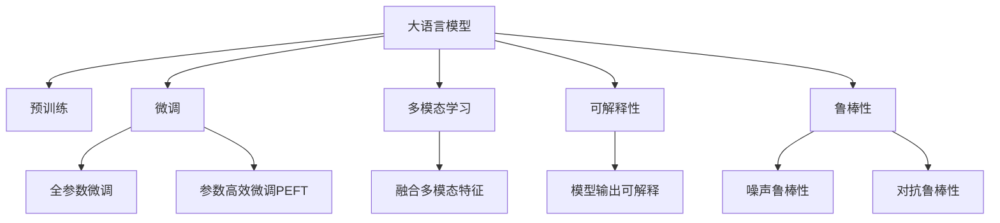

                 

## 1. 背景介绍

### 1.1 问题由来
在电商领域，搜索结果的聚类是一个至关重要的任务。它旨在将相似的商品或者查询结果按照一定的方式组织起来，使用户能够更方便地找到自己想要的内容。传统的聚类方法多基于相似度计算，如K-means、层次聚类等，但随着电商数据的爆炸性增长，传统的聚类方法已经难以胜任。

大语言模型（Large Language Models, LLMs），如GPT、BERT等，近年来在自然语言处理（NLP）领域取得了巨大突破，这些大模型在处理大规模无标签文本数据上展现出强大的能力。然而，这些大模型目前主要用于文本生成、分类、情感分析等任务，在聚类方面应用较少。

在电商领域，大语言模型可以通过对电商产品描述、用户评论等文本数据的预训练，学习到商品语义和用户行为的相关知识，从而在搜索结果聚类中发挥重要作用。大语言模型在电商聚类中的应用，既能提升用户体验，又能为商家提供更加精准的市场洞察，具有重要价值。

### 1.2 问题核心关键点
大语言模型在电商搜索结果聚类中的应用，主要集中在以下几个方面：

- 预训练：利用电商领域的大量无标签数据进行预训练，学习商品和用户行为的语义表示。
- 微调：在电商领域特定的有标签数据上进行微调，调整模型以适应电商聚类的需求。
- 多模态融合：结合电商商品的图片、价格、评分等多模态信息，提升聚类的准确性和相关性。
- 解释性和鲁棒性：增强模型输出的可解释性，保证模型在面对噪声数据时的鲁棒性。

本文将系统介绍大语言模型在电商搜索结果聚类中的应用，包括模型的预训练、微调方法、多模态融合及模型的解释性、鲁棒性。

## 2. 核心概念与联系

### 2.1 核心概念概述

为更好地理解大语言模型在电商搜索结果聚类中的应用，本节将介绍几个密切相关的核心概念：

- 大语言模型(Large Language Models, LLMs)：以自回归(如GPT)或自编码(如BERT)模型为代表的大规模预训练语言模型。通过在大规模无标签文本语料上进行预训练，学习通用的语言表示，具备强大的语言理解和生成能力。

- 预训练(Pre-training)：指在大规模无标签文本语料上，通过自监督学习任务训练通用语言模型的过程。常见的预训练任务包括言语建模、遮挡语言模型等。

- 微调(Fine-tuning)：指在预训练模型的基础上，使用下游任务的少量标注数据，通过有监督地训练来优化模型在该任务上的性能。通常只需要调整顶层分类器或解码器，并以较小的学习率更新全部或部分的模型参数。

- 迁移学习(Transfer Learning)：指将一个领域学习到的知识，迁移应用到另一个不同但相关的领域的学习范式。大模型的预训练-微调过程即是一种典型的迁移学习方式。

- 多模态学习(Multi-modal Learning)：涉及多个模态数据源（如文本、图像、音频）的融合和建模，结合多种数据源的特征提升聚类性能。

- 可解释性(Explainability)：指模型输出的结果可以被人类理解和解释，增强用户对系统的信任和接受度。

- 鲁棒性(Robustness)：指模型在面对噪声、对抗攻击等情况下仍能保持稳定性和准确性，提高系统可靠性。

这些核心概念之间的逻辑关系可以通过以下Mermaid流程图来展示：



这个流程图展示了大语言模型的核心概念及其之间的关系：

1. 大语言模型通过预训练获得基础能力。
2. 微调是对预训练模型进行任务特定的优化，可以分为全参数微调和参数高效微调（PEFT）。
3. 多模态学习融合多种数据源信息，提升聚类效果。
4. 可解释性增强模型输出的可理解性。
5. 鲁棒性确保模型面对噪声和攻击时仍能保持稳定。

这些概念共同构成了大语言模型在电商搜索结果聚类中的应用框架，使其能够有效地处理电商数据，提升聚类效果。

## 3. 核心算法原理 & 具体操作步骤

### 3.1 算法原理概述

大语言模型在电商搜索结果聚类的应用，本质上是一种基于监督学习的迁移学习过程。其核心思想是：将大语言模型视作一个强大的"特征提取器"，通过在电商领域特定的有标签数据上进行有监督的微调，使得模型输出能够匹配电商聚类的需求。

形式化地，假设大语言模型为 $M_{\theta}$，其中 $\theta$ 为预训练得到的模型参数。给定电商领域特定任务 $T$ 的标注数据集 $D=\{(x_i, y_i)\}_{i=1}^N$，微调的目标是找到新的模型参数 $\hat{\theta}$，使得：

$$
\hat{\theta}=\mathop{\arg\min}_{\theta} \mathcal{L}(M_{\theta},D)
$$

其中 $\mathcal{L}$ 为针对电商聚类任务设计的损失函数，用于衡量模型预测输出与真实标签之间的差异。常见的损失函数包括交叉熵损失、均方误差损失等。

通过梯度下降等优化算法，微调过程不断更新模型参数 $\theta$，最小化损失函数 $\mathcal{L}$，使得模型输出逼近真实标签。由于 $\theta$ 已经通过预训练获得了较好的初始化，因此即便在电商领域的有标签数据集 $D$ 上进行微调，也能较快收敛到理想的模型参数 $\hat{\theta}$。

### 3.2 算法步骤详解

基于监督学习的大语言模型微调电商聚类任务一般包括以下几个关键步骤：

**Step 1: 准备预训练模型和数据集**
- 选择合适的预训练语言模型 $M_{\theta}$ 作为初始化参数，如 BERT、GPT等。
- 准备电商领域特定任务 $T$ 的标注数据集 $D$，划分为训练集、验证集和测试集。一般要求标注数据与电商数据的分布不要差异过大。

**Step 2: 设计任务适配层**
- 根据电商聚类的需求，在预训练模型顶层设计合适的输出层和损失函数。
- 对于聚类任务，通常在顶层添加聚类函数和交叉熵损失函数。
- 对于分类任务，通常使用softmax函数输出概率分布，并以交叉熵损失函数作为评价标准。

**Step 3: 设置微调超参数**
- 选择合适的优化算法及其参数，如 AdamW、SGD 等，设置学习率、批大小、迭代轮数等。
- 设置正则化技术及强度，包括权重衰减、Dropout、Early Stopping等。
- 确定冻结预训练参数的策略，如仅微调顶层，或全部参数都参与微调。

**Step 4: 执行梯度训练**
- 将训练集数据分批次输入模型，前向传播计算损失函数。
- 反向传播计算参数梯度，根据设定的优化算法和学习率更新模型参数。
- 周期性在验证集上评估模型性能，根据性能指标决定是否触发 Early Stopping。
- 重复上述步骤直到满足预设的迭代轮数或 Early Stopping 条件。

**Step 5: 测试和部署**
- 在测试集上评估微调后模型 $M_{\hat{\theta}}$ 的性能，对比微调前后的精度提升。
- 使用微调后的模型对电商数据进行聚类，集成到实际的应用系统中。
- 持续收集新的电商数据，定期重新微调模型，以适应电商数据分布的变化。

以上是基于监督学习微调大语言模型在电商搜索结果聚类的一般流程。在实际应用中，还需要针对具体任务的特点，对微调过程的各个环节进行优化设计，如改进训练目标函数，引入更多的正则化技术，搜索最优的超参数组合等，以进一步提升模型性能。

### 3.3 算法优缺点

基于监督学习的大语言模型微调电商聚类方法具有以下优点：
1. 简单高效。只需准备少量标注数据，即可对预训练模型进行快速适配，获得较大的性能提升。
2. 通用适用。适用于各种电商聚类任务，包括商品聚类、搜索排序、用户行为分析等，设计简单的任务适配层即可实现微调。
3. 参数高效。利用参数高效微调技术，在固定大部分预训练权重不变的情况下，仍可取得不错的提升。
4. 效果显著。在学术界和工业界的诸多电商聚类任务上，基于微调的方法已经刷新了最先进的性能指标。

同时，该方法也存在一定的局限性：
1. 依赖标注数据。电商聚类的标注数据成本较高，获取高质量标注数据的成本较高。
2. 迁移能力有限。当目标任务与预训练数据的分布差异较大时，微调的性能提升有限。
3. 负面效果传递。预训练模型的固有偏见、有害信息等，可能通过微调传递到电商聚类任务，造成负面影响。
4. 可解释性不足。微调模型的决策过程通常缺乏可解释性，难以对其推理逻辑进行分析和调试。

尽管存在这些局限性，但就目前而言，基于监督学习的微调方法仍是大语言模型在电商聚类应用中最主流范式。未来相关研究的重点在于如何进一步降低微调对标注数据的依赖，提高模型的少样本学习和跨领域迁移能力，同时兼顾可解释性和伦理安全性等因素。

### 3.4 算法应用领域

基于大语言模型微调的电商聚类方法，在电商领域已经得到了广泛的应用，覆盖了几乎所有常见任务，例如：

- 商品聚类：如将商品按照相似度进行聚类，便于展示和管理。
- 搜索排序：对搜索结果进行排序，提升用户体验和转化率。
- 用户行为分析：分析用户浏览、点击、购买等行为数据，提供个性化推荐和服务。
- 情感分析：对用户评论进行情感分析，洞察用户满意度和需求变化。
- 客服对话：对用户对话进行分类和聚类，提供智能客服解决方案。

除了上述这些经典任务外，大语言模型微调也被创新性地应用到更多场景中，如可控文本生成、品牌识别、知识图谱构建等，为电商技术带来了全新的突破。随着预训练模型和微调方法的不断进步，相信电商聚类技术将进一步提升电商服务的智能化水平，驱动电商行业的数字化转型升级。

## 4. 数学模型和公式 & 详细讲解  
### 4.1 数学模型构建

本节将使用数学语言对基于监督学习的大语言模型电商聚类过程进行更加严格的刻画。

记大语言模型为 $M_{\theta}$，其中 $\theta$ 为模型参数。假设电商聚类任务为 $T$，其训练集为 $D=\{(x_i,y_i)\}_{i=1}^N$，其中 $x_i$ 为电商数据，$y_i$ 为聚类标签。

定义模型 $M_{\theta}$ 在数据样本 $(x,y)$ 上的损失函数为 $\ell(M_{\theta}(x),y)$，则在数据集 $D$ 上的经验风险为：

$$
\mathcal{L}(\theta) = \frac{1}{N} \sum_{i=1}^N \ell(M_{\theta}(x_i),y_i)
$$

微调的优化目标是最小化经验风险，即找到最优参数：

$$
\theta^* = \mathop{\arg\min}_{\theta} \mathcal{L}(\theta)
$$

在实践中，我们通常使用基于梯度的优化算法（如SGD、Adam等）来近似求解上述最优化问题。设 $\eta$ 为学习率，$\lambda$ 为正则化系数，则参数的更新公式为：

$$
\theta \leftarrow \theta - \eta \nabla_{\theta}\mathcal{L}(\theta) - \eta\lambda\theta
$$

其中 $\nabla_{\theta}\mathcal{L}(\theta)$ 为损失函数对参数 $\theta$ 的梯度，可通过反向传播算法高效计算。

### 4.2 公式推导过程

以下我们以二分类任务为例，推导交叉熵损失函数及其梯度的计算公式。

假设模型 $M_{\theta}$ 在输入 $x$ 上的输出为 $\hat{y}=M_{\theta}(x) \in [0,1]$，表示样本属于正类的概率。真实标签 $y \in \{0,1\}$。则二分类交叉熵损失函数定义为：

$$
\ell(M_{\theta}(x),y) = -[y\log \hat{y} + (1-y)\log (1-\hat{y})]
$$

将其代入经验风险公式，得：

$$
\mathcal{L}(\theta) = -\frac{1}{N}\sum_{i=1}^N [y_i\log M_{\theta}(x_i)+(1-y_i)\log(1-M_{\theta}(x_i))]
$$

根据链式法则，损失函数对参数 $\theta_k$ 的梯度为：

$$
\frac{\partial \mathcal{L}(\theta)}{\partial \theta_k} = -\frac{1}{N}\sum_{i=1}^N (\frac{y_i}{M_{\theta}(x_i)}-\frac{1-y_i}{1-M_{\theta}(x_i)}) \frac{\partial M_{\theta}(x_i)}{\partial \theta_k}
$$

其中 $\frac{\partial M_{\theta}(x_i)}{\partial \theta_k}$ 可进一步递归展开，利用自动微分技术完成计算。

在得到损失函数的梯度后，即可带入参数更新公式，完成模型的迭代优化。重复上述过程直至收敛，最终得到适应电商聚类任务的最优模型参数 $\theta^*$。

## 5. 项目实践：代码实例和详细解释说明
### 5.1 开发环境搭建

在进行电商聚类实践前，我们需要准备好开发环境。以下是使用Python进行PyTorch开发的环境配置流程：

1. 安装Anaconda：从官网下载并安装Anaconda，用于创建独立的Python环境。

2. 创建并激活虚拟环境：
```bash
conda create -n pytorch-env python=3.8 
conda activate pytorch-env
```

3. 安装PyTorch：根据CUDA版本，从官网获取对应的安装命令。例如：
```bash
conda install pytorch torchvision torchaudio cudatoolkit=11.1 -c pytorch -c conda-forge
```

4. 安装Transformers库：
```bash
pip install transformers
```

5. 安装各类工具包：
```bash
pip install numpy pandas scikit-learn matplotlib tqdm jupyter notebook ipython
```

完成上述步骤后，即可在`pytorch-env`环境中开始电商聚类实践。

### 5.2 源代码详细实现

这里我们以商品聚类任务为例，给出使用Transformers库对BERT模型进行电商聚类的PyTorch代码实现。

首先，定义商品聚类任务的数据处理函数：

```python
from transformers import BertTokenizer
from torch.utils.data import Dataset
import torch

class ProductDataset(Dataset):
    def __init__(self, products, labels, tokenizer, max_len=128):
        self.products = products
        self.labels = labels
        self.tokenizer = tokenizer
        self.max_len = max_len
        
    def __len__(self):
        return len(self.products)
    
    def __getitem__(self, item):
        product = self.products[item]
        label = self.labels[item]
        
        encoding = self.tokenizer(product, return_tensors='pt', max_length=self.max_len, padding='max_length', truncation=True)
        input_ids = encoding['input_ids'][0]
        attention_mask = encoding['attention_mask'][0]
        
        # 对标签进行编码
        encoded_label = label
        labels = torch.tensor(encoded_label, dtype=torch.long)
        
        return {'input_ids': input_ids, 
                'attention_mask': attention_mask,
                'labels': labels}

# 创建dataset
tokenizer = BertTokenizer.from_pretrained('bert-base-cased')

train_dataset = ProductDataset(train_products, train_labels, tokenizer)
dev_dataset = ProductDataset(dev_products, dev_labels, tokenizer)
test_dataset = ProductDataset(test_products, test_labels, tokenizer)
```

然后，定义模型和优化器：

```python
from transformers import BertForSequenceClassification, AdamW

model = BertForSequenceClassification.from_pretrained('bert-base-cased', num_labels=2)

optimizer = AdamW(model.parameters(), lr=2e-5)
```

接着，定义训练和评估函数：

```python
from torch.utils.data import DataLoader
from tqdm import tqdm
from sklearn.metrics import classification_report

device = torch.device('cuda') if torch.cuda.is_available() else torch.device('cpu')
model.to(device)

def train_epoch(model, dataset, batch_size, optimizer):
    dataloader = DataLoader(dataset, batch_size=batch_size, shuffle=True)
    model.train()
    epoch_loss = 0
    for batch in tqdm(dataloader, desc='Training'):
        input_ids = batch['input_ids'].to(device)
        attention_mask = batch['attention_mask'].to(device)
        labels = batch['labels'].to(device)
        model.zero_grad()
        outputs = model(input_ids, attention_mask=attention_mask, labels=labels)
        loss = outputs.loss
        epoch_loss += loss.item()
        loss.backward()
        optimizer.step()
    return epoch_loss / len(dataloader)

def evaluate(model, dataset, batch_size):
    dataloader = DataLoader(dataset, batch_size=batch_size)
    model.eval()
    preds, labels = [], []
    with torch.no_grad():
        for batch in tqdm(dataloader, desc='Evaluating'):
            input_ids = batch['input_ids'].to(device)
            attention_mask = batch['attention_mask'].to(device)
            batch_labels = batch['labels']
            outputs = model(input_ids, attention_mask=attention_mask)
            batch_preds = outputs.logits.argmax(dim=2).to('cpu').tolist()
            batch_labels = batch_labels.to('cpu').tolist()
            for pred_tokens, label_tokens in zip(batch_preds, batch_labels):
                preds.append(pred_tokens)
                labels.append(label_tokens)
                
    print(classification_report(labels, preds))
```

最后，启动训练流程并在测试集上评估：

```python
epochs = 5
batch_size = 16

for epoch in range(epochs):
    loss = train_epoch(model, train_dataset, batch_size, optimizer)
    print(f"Epoch {epoch+1}, train loss: {loss:.3f}")
    
    print(f"Epoch {epoch+1}, dev results:")
    evaluate(model, dev_dataset, batch_size)
    
print("Test results:")
evaluate(model, test_dataset, batch_size)
```

以上就是使用PyTorch对BERT进行电商商品聚类的完整代码实现。可以看到，得益于Transformers库的强大封装，我们可以用相对简洁的代码完成BERT模型的加载和电商聚类的微调。

### 5.3 代码解读与分析

让我们再详细解读一下关键代码的实现细节：

**ProductDataset类**：
- `__init__`方法：初始化商品、标签、分词器等关键组件。
- `__len__`方法：返回数据集的样本数量。
- `__getitem__`方法：对单个样本进行处理，将商品输入编码为token ids，将标签编码为数字，并对其进行定长padding，最终返回模型所需的输入。

**训练和评估函数**：
- 使用PyTorch的DataLoader对数据集进行批次化加载，供模型训练和推理使用。
- 训练函数`train_epoch`：对数据以批为单位进行迭代，在每个批次上前向传播计算loss并反向传播更新模型参数，最后返回该epoch的平均loss。
- 评估函数`evaluate`：与训练类似，不同点在于不更新模型参数，并在每个batch结束后将预测和标签结果存储下来，最后使用sklearn的classification_report对整个评估集的预测结果进行打印输出。

**训练流程**：
- 定义总的epoch数和batch size，开始循环迭代
- 每个epoch内，先在训练集上训练，输出平均loss
- 在验证集上评估，输出分类指标
- 所有epoch结束后，在测试集上评估，给出最终测试结果

可以看到，PyTorch配合Transformers库使得BERT电商聚类的代码实现变得简洁高效。开发者可以将更多精力放在数据处理、模型改进等高层逻辑上，而不必过多关注底层的实现细节。

当然，工业级的系统实现还需考虑更多因素，如模型的保存和部署、超参数的自动搜索、更灵活的任务适配层等。但核心的微调范式基本与此类似。

## 6. 实际应用场景

### 6.1 智能推荐系统

基于大语言模型的电商聚类技术，可以应用于智能推荐系统的构建。推荐系统旨在为用户推荐其感兴趣的商品，提升用户体验和转化率。传统的推荐系统往往只依赖用户的历史行为数据进行物品推荐，难以捕捉用户潜在的兴趣和需求。

通过大语言模型对电商商品描述、用户评论等文本数据的预训练，学习到商品和用户的语义表示。在此基础上，将预训练模型微调为一个聚类模型，对电商数据进行聚类分析。聚类结果可以用于推荐系统的商品推荐，使得推荐系统能够更加精准地理解用户兴趣，并基于聚类结果进行个性化推荐。

### 6.2 客户细分和个性化服务

电商企业需要针对不同客户群体提供个性化的服务，以提升客户满意度和忠诚度。传统的客户细分方法多基于用户的行为数据，难以捕捉用户的深层需求和偏好。

利用大语言模型对电商数据进行聚类分析，可以更全面地了解用户行为和偏好。基于聚类结果，电商企业可以针对不同客户群体制定个性化的服务策略，如优惠券发放、推荐内容定制等，提升用户体验和客户粘性。

### 6.3 供应链管理

电商供应链管理涉及大量商品的分类、排序和物流调度。传统的供应链管理方法多依赖人工经验，难以应对大规模、复杂的数据。

基于大语言模型的电商聚类技术，可以对供应链中的商品进行聚类分析，识别出不同类别的商品，并根据聚类结果进行分类管理。此外，通过聚类模型预测商品销售趋势，电商企业可以更加合理地安排库存和物流，优化供应链效率。

### 6.4 未来应用展望

随着大语言模型和电商聚类方法的不断发展，基于微调范式将在电商领域得到更广泛的应用，为电商技术带来更大的变革。

在智能客服系统、个性化推荐、供应链管理等领域，电商聚类技术将进一步提升电商服务的智能化水平，驱动电商行业的数字化转型升级。大语言模型和聚类技术结合，能够全面分析电商数据，提供更精准、高效的服务，实现电商行业的智能化转型。

## 7. 工具和资源推荐

### 7.1 学习资源推荐

为了帮助开发者系统掌握大语言模型在电商聚类中的应用，这里推荐一些优质的学习资源：

1. 《Transformer from Principle to Practice》系列博文：由大模型技术专家撰写，深入浅出地介绍了Transformer原理、BERT模型、电商聚类等前沿话题。

2. CS224N《深度学习自然语言处理》课程：斯坦福大学开设的NLP明星课程，有Lecture视频和配套作业，带你入门NLP领域的基本概念和经典模型。

3. 《Natural Language Processing with Transformers》书籍：Transformers库的作者所著，全面介绍了如何使用Transformers库进行NLP任务开发，包括电商聚类的微调方法。

4. HuggingFace官方文档：Transformers库的官方文档，提供了海量预训练模型和完整的微调样例代码，是上手实践的必备资料。

5. Kaggle电商数据集：提供丰富的电商数据集，包括商品信息、用户行为、评论等，是进行电商聚类实践的良好数据源。

通过对这些资源的学习实践，相信你一定能够快速掌握大语言模型在电商聚类中的应用，并用于解决实际的电商问题。

### 7.2 开发工具推荐

高效的开发离不开优秀的工具支持。以下是几款用于大语言模型电商聚类开发的常用工具：

1. PyTorch：基于Python的开源深度学习框架，灵活动态的计算图，适合快速迭代研究。大部分预训练语言模型都有PyTorch版本的实现。

2. TensorFlow：由Google主导开发的开源深度学习框架，生产部署方便，适合大规模工程应用。同样有丰富的预训练语言模型资源。

3. Transformers库：HuggingFace开发的NLP工具库，集成了众多SOTA语言模型，支持PyTorch和TensorFlow，是进行电商聚类开发的利器。

4. Weights & Biases：模型训练的实验跟踪工具，可以记录和可视化模型训练过程中的各项指标，方便对比和调优。与主流深度学习框架无缝集成。

5. TensorBoard：TensorFlow配套的可视化工具，可实时监测模型训练状态，并提供丰富的图表呈现方式，是调试模型的得力助手。

6. Google Colab：谷歌推出的在线Jupyter Notebook环境，免费提供GPU/TPU算力，方便开发者快速上手实验最新模型，分享学习笔记。

合理利用这些工具，可以显著提升大语言模型电商聚类的开发效率，加快创新迭代的步伐。

### 7.3 相关论文推荐

大语言模型和电商聚类技术的发展源于学界的持续研究。以下是几篇奠基性的相关论文，推荐阅读：

1. Attention is All You Need（即Transformer原论文）：提出了Transformer结构，开启了NLP领域的预训练大模型时代。

2. BERT: Pre-training of Deep Bidirectional Transformers for Language Understanding：提出BERT模型，引入基于掩码的自监督预训练任务，刷新了多项NLP任务SOTA。

3. Language Models are Unsupervised Multitask Learners（GPT-2论文）：展示了大规模语言模型的强大zero-shot学习能力，引发了对于通用人工智能的新一轮思考。

4. Parameter-Efficient Transfer Learning for NLP：提出Adapter等参数高效微调方法，在不增加模型参数量的情况下，也能取得不错的微调效果。

5. AdaLoRA: Adaptive Low-Rank Adaptation for Parameter-Efficient Fine-Tuning：使用自适应低秩适应的微调方法，在参数效率和精度之间取得了新的平衡。

这些论文代表了大语言模型和电商聚类技术的发展脉络。通过学习这些前沿成果，可以帮助研究者把握学科前进方向，激发更多的创新灵感。

## 8. 总结：未来发展趋势与挑战

### 8.1 总结

本文对基于监督学习的大语言模型电商聚类方法进行了全面系统的介绍。首先阐述了大语言模型和电商聚类技术的研究背景和意义，明确了电商聚类在提升用户体验、优化供应链管理等方面的独特价值。其次，从原理到实践，详细讲解了电商聚类的数学原理和关键步骤，给出了电商聚类的完整代码实例。同时，本文还广泛探讨了电商聚类方法在智能推荐、客户细分、供应链管理等多个电商领域的应用前景，展示了电商聚类技术的巨大潜力。此外，本文精选了电商聚类的各类学习资源，力求为读者提供全方位的技术指引。

通过本文的系统梳理，可以看到，基于大语言模型的电商聚类方法正在成为电商领域的重要范式，极大地提升了电商服务的智能化水平，驱动电商行业的数字化转型升级。未来，伴随大语言模型和电商聚类方法的持续演进，相信电商聚类技术将进一步提升电商服务的智能化水平，为电商行业的数字化转型升级提供新的动力。

### 8.2 未来发展趋势

展望未来，大语言模型电商聚类技术将呈现以下几个发展趋势：

1. 模型规模持续增大。随着算力成本的下降和数据规模的扩张，预训练语言模型的参数量还将持续增长。超大规模语言模型蕴含的丰富语言知识，有望支撑更加复杂多变的电商聚类任务。

2. 电商聚类方法日趋多样。除了传统的基于微调的方法外，未来会涌现更多电商聚类算法，如图神经网络、聚类融合技术等，提升聚类效果。

3. 电商聚类模型的可解释性增强。通过引入可解释性技术，电商聚类模型将更加透明、可信，增强用户对系统的信任和接受度。

4. 电商聚类模型与推荐系统深度融合。电商聚类技术能够提供更全面、精准的用户兴趣分析，与推荐系统深度融合，实现更加个性化的商品推荐。

5. 电商聚类模型的多模态融合能力增强。未来，电商聚类模型将更加灵活地融合多种数据源，提升聚类效果。

6. 电商聚类模型的在线学习与持续更新。电商聚类模型需要不断学习新的电商数据，以适应电商环境的动态变化，持续更新模型参数。

以上趋势凸显了大语言模型电商聚类技术的广阔前景。这些方向的探索发展，必将进一步提升电商服务的智能化水平，驱动电商行业的数字化转型升级。

### 8.3 面临的挑战

尽管大语言模型电商聚类技术已经取得了瞩目成就，但在迈向更加智能化、普适化应用的过程中，它仍面临着诸多挑战：

1. 电商数据的异质性。电商数据往往包含图片、文本、评分等多种类型的数据，数据异质性大，给电商聚类带来了困难。

2. 电商数据的稀疏性。电商数据中用户行为数据往往稀疏，传统的聚类方法难以应对。

3. 电商数据的噪声。电商数据中存在大量噪声数据，如恶意评论、虚假交易等，给电商聚类带来了挑战。

4. 电商聚类模型的计算效率。电商数据规模大，电商聚类模型的计算效率需要进一步提升，以支持实时聚类分析。

5. 电商聚类模型的稳定性。电商数据分布波动大，电商聚类模型需要具备良好的鲁棒性和泛化能力。

尽管存在这些挑战，但大语言模型电商聚类技术正逐渐克服这些难题，为电商行业带来了新的变革。未来，随着算力成本的降低和算法技术的不断进步，电商聚类技术必将更加成熟，为电商行业的数字化转型升级提供新的动力。

### 8.4 未来突破

面对大语言模型电商聚类所面临的种种挑战，未来的研究需要在以下几个方面寻求新的突破：

1. 探索无监督和半监督聚类方法。摆脱对大规模标注数据的依赖，利用自监督学习、主动学习等无监督和半监督范式，最大限度利用非结构化数据，实现更加灵活高效的电商聚类。

2. 研究电商聚类方法与推荐系统的协同优化。电商聚类技术能够提供更全面、精准的用户兴趣分析，与推荐系统深度融合，实现更加个性化的商品推荐。

3. 引入因果和对比学习范式。通过引入因果推断和对比学习思想，增强电商聚类模型建立稳定因果关系的能力，学习更加普适、鲁棒的语言表征，从而提升模型泛化性和抗干扰能力。

4. 纳入伦理道德约束。在模型训练目标中引入伦理导向的评估指标，过滤和惩罚有偏见、有害的输出倾向。同时加强人工干预和审核，建立模型行为的监管机制，确保输出符合人类价值观和伦理道德。

5. 结合因果分析和博弈论工具。将因果分析方法引入电商聚类模型，识别出模型决策的关键特征，增强输出解释的因果性和逻辑性。借助博弈论工具刻画人机交互过程，主动探索并规避模型的脆弱点，提高系统稳定性。

6. 开发高效的多模态电商聚类模型。将符号化的先验知识，如知识图谱、逻辑规则等，与神经网络模型进行巧妙融合，引导电商聚类过程学习更准确、合理的语言模型。同时加强不同模态数据的整合，实现视觉、语音等多模态信息与文本信息的协同建模。

这些研究方向的探索，必将引领大语言模型电商聚类技术迈向更高的台阶，为构建安全、可靠、可解释、可控的智能系统铺平道路。面向未来，大语言模型电商聚类技术还需要与其他人工智能技术进行更深入的融合，如知识表示、因果推理、强化学习等，多路径协同发力，共同推动自然语言理解和智能交互系统的进步。只有勇于创新、敢于突破，才能不断拓展语言模型的边界，让智能技术更好地造福人类社会。

## 9. 附录：常见问题与解答

**Q1：电商聚类依赖标注数据吗？**

A: 电商聚类任务通常依赖于标注数据。标注数据的作用是为模型提供监督信号，指导模型学习商品和用户行为的语义表示。标注数据的质量直接影响电商聚类的效果，高质量的标注数据是电商聚类成功的关键。

**Q2：电商聚类需要处理多少数据？**

A: 电商聚类的数据量因应用场景不同而异，但通常需要处理大量的电商数据，包括商品描述、用户评论、交易记录等。数据量越大，电商聚类的效果越好，但也带来了计算成本的增加。因此，需要平衡数据量和计算资源的投入。

**Q3：电商聚类需要哪些预处理步骤？**

A: 电商聚类需要进行多步骤预处理：

1. 数据清洗：去除噪声、缺失值等不合法数据。
2. 数据标准化：将不同数据源的数据统一标准化，便于输入模型。
3. 数据增强：通过回译、近义替换等方式扩充训练集，提升模型泛化能力。
4. 数据划分：将数据划分为训练集、验证集和测试集，供模型训练、评估和测试使用。

这些预处理步骤是电商聚类任务的关键环节，影响着模型的最终效果。

**Q4：电商聚类的模型效果如何评估？**

A: 电商聚类的模型效果可以通过多个指标进行评估，包括准确率、召回率、F1分数、AUC等。具体评估指标需要根据电商聚类的具体任务而定。例如，对于商品聚类任务，可以使用聚类指标（如轮廓系数、互信息等）来评估模型效果。

**Q5：电商聚类模型在实际应用中面临哪些问题？**

A: 电商聚类模型在实际应用中可能面临以下问题：

1. 数据分布变化：电商数据分布不断变化，电商聚类模型需要不断更新，以适应新的数据分布。
2. 数据隐私：电商数据包含用户隐私信息，电商聚类模型需要遵守隐私保护法规，如GDPR等。
3. 模型计算资源限制：电商数据规模大，模型计算资源有限，电商聚类模型需要具备高效计算能力。

这些问题的解决需要结合具体场景进行优化，提升电商聚类模型的实际应用效果。

---

作者：禅与计算机程序设计艺术 / Zen and the Art of Computer Programming

