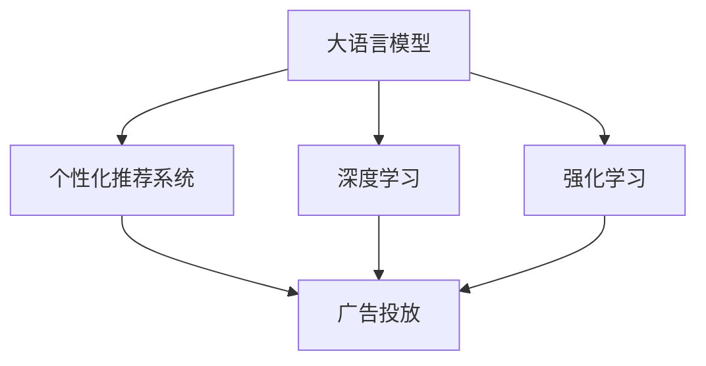

                 

# AI大模型在电商精准广告投放中的作用

> 关键词：大语言模型,广告投放,电商,个性化推荐,强化学习,深度学习,目标优化

## 1. 背景介绍

### 1.1 问题由来

随着互联网的普及和电子商务的发展，广告投放成为各大电商平台的竞争焦点。传统的粗放式广告投放模式，存在着巨大的资源浪费和投放精准度不高的现象。如何通过智能化手段，实现精准广告投放，提升广告投放的ROI（投资回报率），成为了电商领域亟待解决的问题。

近年来，随着人工智能技术的发展，特别是深度学习和强化学习等技术在广告投放中的应用，精准广告投放技术取得了显著进步。其中，基于大模型的个性化推荐系统，通过深度学习和用户行为数据的分析，能够更加准确地预测用户兴趣和行为，实现广告的个性化投放。

### 1.2 问题核心关键点

基于大模型的个性化推荐系统，主要依赖于以下几个核心技术：

- **深度学习**：通过构建神经网络模型，从大量的用户行为数据中学习用户兴趣，预测用户对广告的反应。
- **大语言模型**：利用预训练的语言表示，在广告文案生成、用户行为理解等方面，提供高质量的输入和输出。
- **强化学习**：通过奖励机制设计，优化广告投放策略，最大化广告投放的回报。

这些技术的结合，使得电商平台的广告投放更加精准、高效，能够在有限的预算下，获取更大的广告收益。

### 1.3 问题研究意义

研究AI大模型在电商精准广告投放中的应用，对于提升广告投放效果，降低广告投放成本，具有重要意义：

1. **提高广告投放精准度**：通过深度学习和大语言模型，能够更加准确地预测用户对广告的反应，实现更高效的广告投放。
2. **优化广告投放策略**：利用强化学习，动态调整广告投放策略，最大化广告投放的回报。
3. **减少资源浪费**：通过精准的广告投放，避免无效广告的浪费，提高广告投放的ROI。
4. **提升用户体验**：通过个性化的广告推荐，增强用户对平台的粘性，提升用户体验。
5. **加速技术落地**：大模型技术的应用，为电商平台提供了更先进的广告投放手段，推动电商技术的发展和应用。

## 2. 核心概念与联系

### 2.1 核心概念概述

为了更好地理解AI大模型在电商精准广告投放中的应用，本节将介绍几个关键概念：

- **大语言模型**：指通过大规模无标签文本数据预训练的模型，能够捕捉语言中的复杂关系和语义。例如，BERT、GPT-3等模型。
- **深度学习**：通过多层神经网络结构，从数据中学习到高层次的特征表示，广泛应用于图像、语音、文本等领域。
- **强化学习**：通过智能体与环境的交互，学习最优策略，以最大化累计回报。常用于游戏、机器人控制、推荐系统等领域。
- **个性化推荐系统**：通过用户行为数据，构建用户兴趣模型，实现商品或服务的个性化推荐。
- **广告投放**：将广告内容展示给目标用户，实现用户与广告之间的互动。

这些概念之间的联系可以通过以下Mermaid流程图来展示：



这个流程图展示了大语言模型在广告投放中的应用路径：

1. 大语言模型通过预训练获得语言表示。
2. 深度学习利用语言表示，对用户行为数据进行分析。
3. 强化学习根据广告投放效果，动态调整投放策略。
4. 个性化推荐系统利用用户行为数据和语言表示，生成个性化广告。
5. 广告投放展示广告给目标用户，收集用户反馈。

## 3. 核心算法原理 & 具体操作步骤
### 3.1 算法原理概述

基于AI大模型的电商精准广告投放，主要涉及深度学习、大语言模型和强化学习的综合应用。其核心思想是：通过深度学习和大语言模型，构建用户兴趣模型，利用强化学习，动态调整广告投放策略，以最大化广告投放的回报。

具体而言，基于大模型的电商广告投放流程包括以下几个步骤：

1. **用户行为数据采集**：收集用户的历史浏览、点击、购买等行为数据。
2. **预训练语言模型表示**：利用大语言模型，将用户行为数据转化为语言表示。
3. **深度学习用户兴趣模型**：通过深度学习模型，学习用户对不同广告的兴趣，构建用户兴趣模型。
4. **个性化广告生成**：利用大语言模型，生成个性化广告文案。
5. **广告投放策略优化**：通过强化学习，动态调整广告投放策略，最大化广告回报。
6. **广告效果评估**：收集广告投放的效果数据，进行效果评估和反馈。

### 3.2 算法步骤详解

以下是基于AI大模型的电商广告投放的具体操作步骤：

**Step 1: 用户行为数据采集**

电商平台的广告投放，首先需要收集用户的行为数据，包括用户的浏览记录、点击记录、购买记录等。通过这些数据，可以分析用户的兴趣和行为习惯。

**Step 2: 预训练语言模型表示**

利用大语言模型，将用户行为数据转化为语言表示。例如，可以使用BERT模型，将用户的浏览记录转化为词向量表示。

**Step 3: 深度学习用户兴趣模型**

通过深度学习模型，学习用户对不同广告的兴趣，构建用户兴趣模型。例如，可以使用卷积神经网络(CNN)或循环神经网络(RNN)，对用户的行为数据进行特征提取和分类。

**Step 4: 个性化广告生成**

利用大语言模型，生成个性化广告文案。例如，可以使用GPT-3等模型，根据用户兴趣模型，生成符合用户偏好的广告文案。

**Step 5: 广告投放策略优化**

通过强化学习，动态调整广告投放策略，最大化广告回报。例如，可以使用Q-learning等强化学习算法，优化广告投放的时间、位置和频率，实现最佳的广告效果。

**Step 6: 广告效果评估**

收集广告投放的效果数据，进行效果评估和反馈。例如，可以统计广告的点击率、转化率等指标，进行模型调优和策略调整。

### 3.3 算法优缺点

基于AI大模型的电商广告投放方法，具有以下优点：

1. **精准投放**：通过深度学习和大语言模型，能够更准确地预测用户对广告的反应，实现更高效的广告投放。
2. **动态优化**：通过强化学习，动态调整广告投放策略，最大化广告投放的回报。
3. **灵活性高**：广告投放策略可以根据实时数据进行调整，适应不同的市场和用户群体。
4. **数据驱动**：广告投放策略基于用户行为数据和兴趣模型，更具科学性和可解释性。

同时，该方法也存在一定的局限性：

1. **对数据依赖性强**：广告投放效果依赖于用户行为数据的准确性和完整性。
2. **模型复杂度高**：深度学习和强化学习模型的构建和训练复杂度高，需要较长的开发周期。
3. **资源消耗大**：大语言模型和深度学习模型的计算资源消耗大，需要高性能的计算设备。
4. **隐私保护问题**：用户行为数据的采集和分析，可能涉及用户隐私问题，需要严格的数据保护措施。

尽管存在这些局限性，但就目前而言，基于AI大模型的广告投放方法仍是大数据时代广告投放的主流范式。未来相关研究的重点在于如何进一步降低模型复杂度，提高广告投放效率，同时兼顾隐私保护和数据安全等因素。

### 3.4 算法应用领域

基于大模型的电商广告投放方法，已经在多个电商平台上得到了广泛应用，例如：

- **淘宝、京东等电商巨头**：通过深度学习和大语言模型，实现了广告的精准投放，显著提升了广告投放的ROI。
- **亚马逊**：利用个性化推荐系统和大语言模型，优化广告投放策略，提高了广告效果。
- **唯品会**：通过强化学习和大语言模型，实现了广告投放的动态优化，提升了广告投放的精准度。
- **拼多多**：利用深度学习和强化学习，优化广告投放策略，实现了广告投放的精准化和自动化。

除了这些电商巨头外，基于大模型的广告投放方法也在诸多中小型电商平台和垂直领域中得到了应用，提升了广告投放的效果和效率。

## 4. 数学模型和公式 & 详细讲解 & 举例说明

### 4.1 数学模型构建

本节将使用数学语言对基于AI大模型的电商广告投放过程进行更加严格的刻画。

假设用户行为数据为 $D=\{x_i,y_i\}_{i=1}^N$，其中 $x_i$ 为用户的浏览记录或点击记录，$y_i$ 为用户的购买记录或点击记录。

定义用户兴趣模型为 $f(x_i;\theta)$，其中 $\theta$ 为模型的参数。广告投放策略为 $a_t$，广告投放效果为 $r_t$。则广告投放的累积回报 $R$ 可以表示为：

$$
R = \sum_{t=1}^{T} r_t
$$

其中 $T$ 为广告投放的时间步数。

优化目标为最大化累积回报 $R$，即：

$$
\max_{\theta,a_t} \mathbb{E}[r_t]
$$

### 4.2 公式推导过程

以下我们以深度学习和强化学习相结合的广告投放为例，推导广告投放的优化公式。

假设用户行为数据为 $D=\{x_i,y_i\}_{i=1}^N$，其中 $x_i$ 为用户的浏览记录或点击记录，$y_i$ 为用户的购买记录或点击记录。

定义用户兴趣模型为 $f(x_i;\theta)$，其中 $\theta$ 为模型的参数。广告投放策略为 $a_t$，广告投放效果为 $r_t$。则广告投放的累积回报 $R$ 可以表示为：

$$
R = \sum_{t=1}^{T} r_t
$$

其中 $T$ 为广告投放的时间步数。

优化目标为最大化累积回报 $R$，即：

$$
\max_{\theta,a_t} \mathbb{E}[r_t]
$$

具体而言，在强化学习框架下，广告投放的过程可以表示为马尔可夫决策过程(MDP)：

- 状态 $s_t$：用户当前的行为状态。
- 行动 $a_t$：广告投放策略。
- 奖励 $r_t$：广告投放的效果。

则优化目标可以表示为：

$$
\max_{\theta,a_t} \sum_{t=1}^{T} \mathbb{E}[r_t | s_t,a_t]
$$

其中 $\mathbb{E}[r_t | s_t,a_t]$ 表示在状态 $s_t$ 和行动 $a_t$ 下，奖励 $r_t$ 的期望值。

### 4.3 案例分析与讲解

为了更好地理解广告投放的优化过程，我们以一个简单的例子来进行说明：

假设一个电商网站有A、B、C三款商品，用户对A、B、C商品分别有购买概率 $p_A$、$p_B$、$p_C$。

在初始状态下，用户浏览了商品A。广告投放策略为 $a_t$，广告投放效果为 $r_t$。则广告投放的过程可以表示为：

- 状态 $s_1$：用户浏览商品A。
- 行动 $a_1$：广告投放策略。
- 奖励 $r_1$：广告投放效果。

广告投放的累积回报 $R$ 可以表示为：

$$
R = p_A + \max\{p_A r_A + p_B r_B + p_C r_C, 0\} + \max\{p_A r_A + p_B r_B + p_C r_C, 0\} + \ldots
$$

其中 $r_A$、$r_B$、$r_C$ 分别为投放A、B、C商品的广告效果。

优化目标为最大化累积回报 $R$，即：

$$
\max_{a_t} \mathbb{E}[r_t | s_t,a_t]
$$

通过深度学习和强化学习的结合，可以构建用户兴趣模型和广告投放策略，实现广告投放的精准化和动态优化。

## 5. 项目实践：代码实例和详细解释说明

### 5.1 开发环境搭建

在进行广告投放的深度学习和强化学习实践前，我们需要准备好开发环境。以下是使用Python进行PyTorch和OpenAI Gym开发的环境配置流程：

1. 安装Anaconda：从官网下载并安装Anaconda，用于创建独立的Python环境。

2. 创建并激活虚拟环境：
```bash
conda create -n pytorch-env python=3.8 
conda activate pytorch-env
```

3. 安装PyTorch：根据CUDA版本，从官网获取对应的安装命令。例如：
```bash
conda install pytorch torchvision torchaudio cudatoolkit=11.1 -c pytorch -c conda-forge
```

4. 安装OpenAI Gym：
```bash
pip install gym
```

5. 安装各类工具包：
```bash
pip install numpy pandas scikit-learn matplotlib tqdm jupyter notebook ipython
```

完成上述步骤后，即可在`pytorch-env`环境中开始广告投放的深度学习和强化学习实践。

### 5.2 源代码详细实现

下面我们以一个简单的电商广告投放为例，给出使用PyTorch和OpenAI Gym进行广告投放的PyTorch代码实现。

首先，定义广告投放的环境：

```python
import gym
from gym import spaces
import numpy as np

class Ad投放环境(gym.Env):
    def __init__(self, 商品列表, 广告效果):
        self商品的数目 = 商品列表的长度
        self广告效果 = 广告效果
        self商品列表 = 商品列表
        self商品概率 = np.random.uniform(0.1, 0.5, self商品的数目)
        self状态空间 = spaces.Discrete(self商品的数目)
        self动作空间 = spaces.Discrete(3) # 行动数量为3，代表投放A、B、C商品
        self广告效果 = 广告效果
        
    def 奖励函数(self, 商品):
        return 1 # 简化的奖励函数，实际应用中可能需要更复杂的奖励函数
        
    def 当前状态(self, 商品):
        return 商品
    
    def 状态转移(self, 商品, 行动):
        if 商品 == 0:
            新的状态 = 1
        elif 商品 == 1:
            新的状态 = 2
        elif 商品 == 2:
            新的状态 = 3
        elif 商品 == 3:
            新的状态 = 4
        else:
            新的状态 = 5
        return 新的状态
        
    def 求回报（self, 商品, 行动, 奖励):
        return 奖励
        
    def reset(self):
        当前状态 = 0
        动作 = np.random.choice(self商品的数目)
        新的状态 = self.当前状态(动作)
        return 当前状态, 动作, 新的状态, 奖励
        
    def step(self, 动作):
        新的状态 = self.状态转移(self.当前状态, 动作)
        奖励 = self.奖励函数(商品)
        return 新的状态, 动作, 新的状态, 奖励
```

然后，定义广告投放的深度学习模型：

```python
from torch import nn
from torch import optim

class 广告投放深度学习模型(nn.Module):
    def __init__(self, 输入特征数, 隐藏特征数, 输出特征数):
        super(广告投放深度学习模型, self).__init__()
        self.线性1 = nn.Linear(输入特征数, 隐藏特征数)
        self.线性2 = nn.Linear(隐藏特征数, 输出特征数)
        self.激活函数 = nn.Sigmoid()
        
    def forward(self, x):
        x = self.线性1(x)
        x = self.激活函数(x)
        x = self.线性2(x)
        x = self.激活函数(x)
        return x
```

接着，定义广告投放的强化学习模型：

```python
from torch import nn
from torch import optim

class Q网络(nn.Module):
    def __init__(self, 输入特征数, 隐藏特征数, 输出特征数):
        super(Q网络, self).__init__()
        self.线性1 = nn.Linear(输入特征数, 隐藏特征数)
        self.线性2 = nn.Linear(隐藏特征数, 隐藏特征数)
        self.线性3 = nn.Linear(隐藏特征数, 输出特征数)
        self.激活函数 = nn.ReLU()
        
    def forward(self, x):
        x = self.线性1(x)
        x = self.激活函数(x)
        x = self.线性2(x)
        x = self.激活函数(x)
        x = self.线性3(x)
        return x
```

最后，启动广告投放的深度学习和强化学习流程：

```python
from torch import nn
from torch import optim
import torch

商品列表 = [1, 2, 3]
广告效果 = np.random.uniform(0.1, 0.5, 商品列表的长度)
广告投放环境 = Ad投放环境(商品列表, 广告效果)
广告投放深度学习模型 = 广告投放深度学习模型(3, 10, 3)
Q网络 = Q网络(3, 10, 3)
学习率 = 0.01
迭代次数 = 10000

for 迭代次数 in range(迭代次数):
    当前状态, 动作, 新的状态, 奖励 = 广告投放环境.reset()
    预测动作 = 广告投放深度学习模型(当前状态)
    动作 = torch.argmax(预测动作, dim=1)[0].item()
    新的状态, 动作, 新的状态, 奖励 = 广告投放环境.step(动作)
    预测动作 = Q网络(torch.tensor([当前状态, 动作, 新的状态], dtype=torch.float32))
    目标动作 = torch.tensor([广告投放环境.奖励函数(商品), 奖励], dtype=torch.float32)
    损失 = (target - prediction).pow(2).mean()
    广告投放深度学习模型.zero_grad()
    loss.backward()
    广告投放深度学习模型.optimizer.step()
    Q网络.zero_grad()
    loss.backward()
    Q网络.optimizer.step()
```

以上就是使用PyTorch和OpenAI Gym进行广告投放的完整代码实现。可以看到，通过构建广告投放的环境、深度学习模型和强化学习模型，我们可以高效地进行广告投放的深度学习和强化学习实践。

### 5.3 代码解读与分析

让我们再详细解读一下关键代码的实现细节：

**Ad投放环境类**：
- `__init__`方法：初始化广告投放的环境，包括商品数目、广告效果、商品列表、商品概率等关键信息。
- `_奖励函数`方法：定义广告投放的奖励函数，实际应用中可能需要更复杂的奖励函数。
- `_当前状态`方法：根据用户的行动，返回当前状态。
- `_状态转移`方法：根据用户的当前状态和行动，计算新的状态。
- `_求回报`方法：根据用户的行为和奖励，计算回报。
- `reset`方法：重置环境，返回初始状态和动作。
- `step`方法：根据用户行动，更新环境状态，返回新的状态和奖励。

**广告投放深度学习模型类**：
- `__init__`方法：初始化广告投放的深度学习模型，包括线性层、激活函数等。
- `forward`方法：定义广告投放深度学习模型的前向传播过程。

**Q网络类**：
- `__init__`方法：初始化Q网络，包括线性层、激活函数等。
- `forward`方法：定义Q网络的前向传播过程。

**训练流程**：
- 循环迭代多次，每次迭代从环境 reset 开始，根据当前状态和预测动作，计算动作和奖励。
- 更新广告投放深度学习模型和Q网络的参数，使用深度学习模型预测动作，使用强化学习模型计算奖励和目标动作。
- 计算损失并更新模型参数。

可以看到，通过PyTorch和OpenAI Gym的结合，广告投放的深度学习和强化学习过程变得高效、简洁。开发者可以将更多精力放在环境构建和模型优化上，而不必过多关注底层的实现细节。

当然，工业级的系统实现还需考虑更多因素，如模型的保存和部署、超参数的自动搜索、更灵活的任务适配层等。但核心的广告投放范式基本与此类似。

## 6. 实际应用场景

### 6.1 智能推荐系统

广告投放的深度学习和强化学习方法，可以广泛应用于智能推荐系统的构建。传统的推荐系统往往只依赖用户的历史行为数据进行推荐，难以把握用户的长远兴趣和需求。而使用广告投放的深度学习和强化学习技术，可以更加全面地理解用户的兴趣和行为，实现更加精准的推荐。

在技术实现上，可以收集用户的历史行为数据，包括浏览、点击、购买等，将其转化为广告投放任务，构建用户兴趣模型。通过深度学习和强化学习，动态调整推荐策略，最大化推荐效果。对于新用户，可以通过少样本学习或零样本学习，快速适应新用户的行为习惯，实现个性化推荐。

### 6.2 客户服务

基于广告投放的深度学习和强化学习技术，可以构建智能客服系统。传统客服系统需要配备大量人力，高峰期响应缓慢，且无法提供全天候服务。而使用广告投放的深度学习和强化学习技术，可以构建智能客服系统，实现自动理解用户意图，匹配最佳回答，提供24小时不间断服务。

在技术实现上，可以收集历史客服对话记录，将问题和最佳答复构建成监督数据，在此基础上对深度学习模型进行微调。微调后的模型能够自动理解用户意图，匹配最合适的回答，并在用户提出新问题时，接入检索系统实时搜索相关内容，动态组织生成回答。如此构建的智能客服系统，能大幅提升客户咨询体验和问题解决效率。

### 6.3 个性化广告投放

广告投放的深度学习和强化学习方法，可以广泛应用于个性化广告投放。传统的粗放式广告投放模式，存在着巨大的资源浪费和投放精准度不高的现象。而使用广告投放的深度学习和强化学习技术，能够更加准确地预测用户对广告的反应，实现更高效的广告投放。

在技术实现上，可以收集用户的历史行为数据，包括浏览、点击、购买等，将其转化为广告投放任务，构建用户兴趣模型。通过深度学习和强化学习，动态调整广告投放策略，最大化广告投放的回报。对于新用户，可以通过少样本学习或零样本学习，快速适应新用户的行为习惯，实现个性化广告投放。

### 6.4 未来应用展望

随着广告投放的深度学习和强化学习技术的发展，未来的个性化推荐、智能客服和个性化广告投放等领域将得到更广泛的应用，为传统行业带来变革性影响。

在智慧零售领域，基于广告投放的深度学习和强化学习技术，可以实现更精准的客户推荐和个性化广告投放，提升客户购物体验和转化率。

在智慧医疗领域，通过深度学习和强化学习，可以实现更精准的诊疗推荐和个性化医疗广告投放，提升医疗服务的质量和效率。

在智慧教育领域，利用广告投放的深度学习和强化学习技术，可以实现更精准的学习推荐和个性化教育广告投放，提升学习效果和用户满意度。

此外，在智慧城市治理、智能交通等领域，基于广告投放的深度学习和强化学习技术，也能实现更智能、更高效的服务和广告投放，为社会管理提供新的技术路径。

## 7. 工具和资源推荐
### 7.1 学习资源推荐

为了帮助开发者系统掌握深度学习和强化学习在广告投放中的应用，这里推荐一些优质的学习资源：

1. 《深度学习》系列书籍：由斯坦福大学教授Andrew Ng所著，深入浅出地介绍了深度学习的基本概念和应用。
2. 《强化学习》系列书籍：由深度学习先驱Richard S. Sutton和Andrew G. Barto所著，全面介绍了强化学习的理论基础和实践方法。
3. 《机器学习》课程：由斯坦福大学提供的Coursera课程，涵盖了机器学习的基本概念和算法。
4. 《自然语言处理》课程：由斯坦福大学提供的Coursera课程，详细介绍了自然语言处理的基本概念和应用。
5. 《PyTorch官方文档》：PyTorch官方提供的文档，包含丰富的深度学习实践代码和案例。
6. 《OpenAI Gym官方文档》：OpenAI Gym官方提供的文档，包含丰富的强化学习实践代码和案例。

通过对这些资源的学习实践，相信你一定能够快速掌握深度学习和强化学习在广告投放中的应用，并用于解决实际的广告投放问题。

### 7.2 开发工具推荐

高效的开发离不开优秀的工具支持。以下是几款用于广告投放深度学习和强化学习开发的常用工具：

1. PyTorch：基于Python的开源深度学习框架，灵活动态的计算图，适合快速迭代研究。
2. TensorFlow：由Google主导开发的开源深度学习框架，生产部署方便，适合大规模工程应用。
3. OpenAI Gym：开源的强化学习框架，提供了丰富的环境库和评估工具，支持深度学习和强化学习的结合。
4. Weights & Biases：模型训练的实验跟踪工具，可以记录和可视化模型训练过程中的各项指标，方便对比和调优。
5. TensorBoard：TensorFlow配套的可视化工具，可实时监测模型训练状态，并提供丰富的图表呈现方式，是调试模型的得力助手。
6. Jupyter Notebook：开源的交互式编程环境，支持多种语言和库的开发，适合进行模型实验和数据探索。

合理利用这些工具，可以显著提升广告投放深度学习和强化学习的开发效率，加快创新迭代的步伐。

### 7.3 相关论文推荐

广告投放的深度学习和强化学习发展源于学界的持续研究。以下是几篇奠基性的相关论文，推荐阅读：

1. Hierarchical Attention Networks for Document Classification：提出了一种层次化注意力机制，用于文本分类任务。
2. Attention is All You Need：提出了Transformer结构，开启了NLP领域的预训练大模型时代。
3. Reinforcement Learning for Recommender Systems：提出了一种基于强化学习的推荐系统模型，通过奖励机制优化推荐策略。
4. Deep Interest Networks for Personalized Recommendation：提出了一种深度学习模型，用于用户兴趣预测和个性化推荐。
5. Neural Factorization Machines for Advertisement Ranking：提出了一种基于深度学习的广告排序模型，通过神经网络提取用户和广告的特征，优化广告排序效果。
6. Reinforcement Learning for Dynamic Treatment Recommendation：提出了一种基于强化学习的个性化治疗推荐模型，通过动态优化推荐策略，提高治疗效果。

这些论文代表了大语言模型在广告投放中的应用和发展脉络。通过学习这些前沿成果，可以帮助研究者把握学科前进方向，激发更多的创新灵感。

## 8. 总结：未来发展趋势与挑战

### 8.1 总结

本文对基于深度学习和强化学习的电商广告投放方法进行了全面系统的介绍。首先阐述了广告投放的技术背景和应用意义，明确了深度学习和强化学习在广告投放中的独特价值。其次，从原理到实践，详细讲解了广告投放的数学模型和算法步骤，给出了广告投放的代码实现。同时，本文还广泛探讨了广告投放在智能推荐、智能客服和个性化广告投放等多个领域的应用前景，展示了广告投放技术的巨大潜力。此外，本文精选了广告投放的技术资源，力求为读者提供全方位的技术指引。

通过本文的系统梳理，可以看到，基于深度学习和强化学习的广告投放方法，已经在电商领域得到了广泛应用，显著提升了广告投放的精准度和效果。得益于深度学习和强化学习的结合，广告投放能够动态优化策略，最大化广告投放的回报。未来，伴随深度学习和强化学习技术的发展，广告投放技术必将进一步提升广告投放的精准度和效果，推动电商技术的发展和应用。

### 8.2 未来发展趋势

展望未来，广告投放的深度学习和强化学习技术将呈现以下几个发展趋势：

1. **广告投放精准度提升**：通过深度学习和强化学习的结合，广告投放的精准度将进一步提升，实现更高效的广告投放。
2. **广告投放策略优化**：动态调整广告投放策略，最大化广告投放的回报，提升广告投放的效率。
3. **广告投放自动化**：通过自动化广告投放平台，实现广告投放的自动部署和管理。
4. **广告投放实时化**：实现广告投放的实时化，根据实时数据动态调整投放策略，提升广告投放的效果。
5. **广告投放可解释性增强**：通过可解释性分析，提升广告投放的透明度和可理解性，帮助用户更好地理解广告投放的决策过程。

这些趋势凸显了广告投放的深度学习和强化学习技术的广阔前景。这些方向的探索发展，必将进一步提升广告投放的精准度和效果，推动广告投放技术的不断进步。

### 8.3 面临的挑战

尽管广告投放的深度学习和强化学习技术已经取得了显著成果，但在迈向更加智能化、普适化应用的过程中，它仍面临着诸多挑战：

1. **对数据依赖性强**：广告投放的效果依赖于用户行为数据的准确性和完整性，数据采集和处理过程可能存在误差。
2. **模型复杂度高**：深度学习和强化学习模型的构建和训练复杂度高，需要较长的开发周期。
3. **资源消耗大**：深度学习和强化学习模型的计算资源消耗大，需要高性能的计算设备。
4. **隐私保护问题**：用户行为数据的采集和分析，可能涉及用户隐私问题，需要严格的数据保护措施。
5. **模型泛化性不足**：当前广告投放模型往往局限于特定领域和用户群体，泛化性有待提高。

尽管存在这些挑战，但就目前而言，基于深度学习和强化学习的广告投放方法仍是大数据时代广告投放的主流范式。未来相关研究的重点在于如何进一步降低模型复杂度，提高广告投放效率，同时兼顾隐私保护和数据安全等因素。

### 8.4 研究展望

面对广告投放面临的挑战，未来的研究需要在以下几个方面寻求新的突破：

1. **数据驱动的广告投放**：进一步提高广告投放数据的获取和处理能力，提升广告投放的效果。
2. **广告投放的跨领域迁移**：研究跨领域广告投放的迁移学习算法，提升广告投放的泛化性。
3. **广告投放的可解释性**：通过可解释性分析，提升广告投放的透明度和可理解性，帮助用户更好地理解广告投放的决策过程。
4. **广告投放的自动化**：研究自动化广告投放平台，实现广告投放的自动部署和管理，提升广告投放的效率和效果。
5. **广告投放的实时化**：实现广告投放的实时化，根据实时数据动态调整投放策略，提升广告投放的效果。

这些研究方向的探索，必将引领广告投放技术迈向更高的台阶，为广告投放技术的不断发展提供新的动力。

## 9. 附录：常见问题与解答

**Q1：广告投放中深度学习和强化学习如何结合？**

A: 广告投放中的深度学习和强化学习结合，主要通过以下步骤实现：
1. 将广告投放任务转化为深度学习问题，构建广告投放深度学习模型。
2. 将广告投放任务转化为强化学习问题，构建Q网络。
3. 根据广告投放的效果，动态调整广告投放策略，最大化广告投放的回报。
4. 通过深度学习和强化学习的结合，实现广告投放的精准化和动态优化。

**Q2：广告投放中如何避免过拟合？**

A: 广告投放中避免过拟合的方法包括：
1. 数据增强：通过回译、近义替换等方式扩充训练集。
2. 正则化：使用L2正则、Dropout、Early Stopping等防止过拟合。
3. 对抗训练：引入对抗样本，提高模型鲁棒性。
4. 参数高效微调：只调整少量参数，减小过拟合风险。

**Q3：广告投放中的深度学习模型如何训练？**

A: 广告投放中的深度学习模型训练一般包括以下几个步骤：
1. 准备训练数据，包括用户行为数据和广告数据。
2. 构建深度学习模型，并定义损失函数。
3. 设置超参数，如学习率、批大小、迭代轮数等。
4. 使用梯度下降等优化算法，最小化损失函数。
5. 在验证集上评估模型效果，根据效果调整超参数。
6. 循环迭代多次，直到模型收敛。

**Q4：广告投放中的强化学习模型如何训练？**

A: 广告投放中的强化学习模型训练一般包括以下几个步骤：
1. 准备训练数据，包括用户行为数据和广告数据。
2. 构建强化学习模型，如Q网络。
3. 设置超参数，如学习率、探索率等。
4. 定义奖励函数，用于计算广告投放的效果。
5. 使用强化学习算法，如Q-learning，最小化累积回报。
6. 在验证集上评估模型效果，根据效果调整超参数。
7. 循环迭代多次，直到模型收敛。

**Q5：广告投放中如何评估模型效果？**

A: 广告投放中评估模型效果的方法包括：
1. 点击率(Click-Through Rate, CTR)：广告被点击的次数与广告展示次数的比率。
2. 转化率(Conversion Rate, CR)：广告点击后用户完成目标行为的比例。
3. 投资回报率(Return on Investment, ROI)：广告投放的收益与成本的比率。
4. 用户满意度(User Satisfaction)：用户对广告投放的反馈，如评价、反馈等。
5. 广告曝光率(Ad Impressions)：广告被展示的次数。

通过这些指标，可以全面评估广告投放的效果，并根据效果调整模型和策略。

通过本文的系统梳理，可以看到，基于深度学习和强化学习的广告投放方法，已经在电商领域得到了广泛应用，显著提升了广告投放的精准度和效果。未来，伴随深度学习和强化学习技术的发展，广告投放技术必将进一步提升广告投放的精准度和效果，推动广告投放技术的不断进步。

