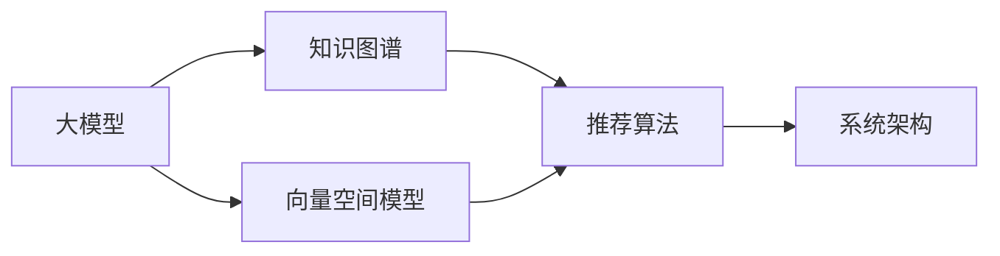

                 

# AI大模型视角下电商搜索推荐的技术创新知识推荐系统优化与性能评测

## 1. 背景介绍

### 1.1 问题由来
在现代电商平台上，用户检索和推荐系统的核心目标是提升用户体验，提高转化率和用户满意度。传统基于规则或关键词匹配的推荐系统，虽然简单易用，但难以捕捉用户复杂多变的查询意图和产品特征。而基于深度学习的推荐系统，特别是使用大模型进行推荐的方法，能够学习用户和产品的隐含语义表示，从而提供更精准、多样化的商品推荐。

近年来，随着大模型的兴起，知识推荐系统逐渐成为推荐领域的新热点。知识推荐系统通过引入语义理解和知识图谱等技术，可以更好地挖掘用户隐性需求和产品隐含信息，为用户提供深度定制化的推荐内容。本文将深入探讨基于大模型的知识推荐系统在电商搜索推荐中的应用，并详细分析其技术创新与性能优化方法。

### 1.2 问题核心关键点
知识推荐系统在电商搜索推荐中的应用，主要包括以下几个核心问题：

1. **如何高效构建用户和产品的语义表示**：利用大模型，将用户查询和产品描述映射为高维向量空间，从而捕获语义信息。
2. **如何利用知识图谱进行推荐**：将知识图谱与大模型融合，挖掘产品之间的关联关系，提升推荐结果的相关性和多样性。
3. **如何优化推荐算法与系统架构**：设计高效的推荐算法和系统架构，支持实时查询和大规模数据处理。
4. **如何提升推荐系统的性能与效果**：通过模型优化、数据增强等手段，提高推荐系统的精准度和用户满意度。
5. **如何应对冷启动和长尾问题**：在大模型和知识图谱的基础上，采用冷启动和长尾产品推荐策略，弥补数据缺陷。

这些问题构成了知识推荐系统在电商搜索推荐中应用的整体框架，需要通过系统的理论分析和技术实践来逐一解答。

## 2. 核心概念与联系

### 2.1 核心概念概述

为更好地理解基于大模型的知识推荐系统，本节将介绍几个关键概念及其相互联系：

1. **大模型**：以Transformer架构为代表的大规模预训练语言模型，如BERT、GPT-3等。通过在海量文本数据上进行预训练，大模型能够学习到丰富的语言知识和语义表示。

2. **知识图谱**：由实体、关系和属性组成的有向图结构，用于表示和推理客观世界的知识。知识图谱是知识推荐系统的核心知识库，用于构建推荐规则和指导推荐结果。

3. **向量空间模型**：将用户查询和产品描述映射为高维向量空间，通过计算向量间的距离和相似度，捕捉用户查询意图和产品特征。

4. **推荐算法**：基于大模型和知识图谱的推荐算法，如基于向量空间模型的推荐、基于图神经网络的推荐等。

5. **系统架构**：推荐系统的架构设计，包括预训练模型、知识图谱、推荐算法、推理机制等组件。

这些概念之间存在着紧密的联系，共同构成了知识推荐系统的技术框架。其中，大模型作为推荐系统的核心组件，用于学习语义表示；知识图谱用于捕捉和推理实体关系；向量空间模型用于描述用户查询和产品特征；推荐算法用于计算和排序推荐结果；系统架构则提供了实现这些组件的完整体系结构。

### 2.2 核心概念原理和架构的 Mermaid 流程图



这个流程图展示了知识推荐系统的主要技术组件及其相互关系：

1. 大模型(A)：从大规模文本数据中学习语义表示，用于生成用户和产品的向量空间表示。
2. 知识图谱(B)：包含实体、关系和属性，用于构建推荐规则和推理推荐结果。
3. 向量空间模型(C)：将用户查询和产品描述映射为高维向量空间，计算相似度。
4. 推荐算法(D)：基于大模型和知识图谱的推荐策略，计算推荐结果。
5. 系统架构(E)：整合预训练模型、知识图谱、推荐算法等组件，提供完整的推荐服务。

## 3. 核心算法原理 & 具体操作步骤

### 3.1 算法原理概述

基于大模型的知识推荐系统，核心算法主要分为两个步骤：

1. **预训练大模型**：使用大规模无标签文本数据，通过自监督任务训练大模型，学习语言知识和语义表示。
2. **知识推荐算法**：利用预训练大模型，将用户查询和产品描述映射为向量空间中的点，结合知识图谱进行推荐计算，并生成推荐结果。

预训练大模型的原理与常规语言模型相似，使用Transformer架构，在大量文本数据上训练，学习语言和语义表示。知识推荐算法则在大模型的基础上，利用向量空间模型和知识图谱，计算推荐结果。

### 3.2 算法步骤详解

#### 3.2.1 大模型预训练

1. **数据准备**：收集大规模无标签文本数据，如维基百科、新闻文章等，作为大模型的预训练语料。
2. **模型选择**：选择合适的大模型架构，如BERT、GPT-3等，作为预训练的初始化参数。
3. **训练流程**：在预训练数据上训练大模型，学习语言和语义表示。

```python
from transformers import BertTokenizer, BertForMaskedLM

tokenizer = BertTokenizer.from_pretrained('bert-base-uncased')
model = BertForMaskedLM.from_pretrained('bert-base-uncased')

inputs = tokenizer.encode_plus(
    "SELECT book title, author, year published FROM library WHERE genre = 'classics'",
    return_tensors="pt"
)
outputs = model(**inputs)
```

#### 3.2.2 知识推荐算法

1. **数据预处理**：收集用户查询和产品描述，进行清洗和分词处理。
2. **向量空间映射**：使用大模型将用户查询和产品描述映射为向量空间中的点。
3. **知识图谱构建**：构建知识图谱，表示产品之间的关系和属性。
4. **推荐计算**：结合向量空间映射和知识图谱，计算推荐结果。
5. **生成推荐**：根据推荐结果，生成推荐列表。

```python
from transformers import BertTokenizer, BertForMaskedLM
from pykg import KG

tokenizer = BertTokenizer.from_pretrained('bert-base-uncased')
model = BertForMaskedLM.from_pretrained('bert-base-uncased')

query = "I want to read a classic book"
product_descriptions = ["A classic book by Jane Austen", "A classic book by William Shakespeare"]
kg = KG.load_kg("library")

inputs = tokenizer.encode_plus(query, return_tensors="pt")
outputs = model(**inputs)

# 将用户查询和产品描述映射为向量空间中的点
user_query_vec = outputs.last_hidden_state[0, 0, :]
product_vecs = [model(**product_description) for product_description in product_descriptions]

# 构建知识图谱
kg.add_entity("book", "title", "Pride and Prejudice")
kg.add_entity("author", "name", "Jane Austen")
kg.add_relation("title_of", "book", "author")

# 计算推荐结果
recommendation = kg.calculate_recommendation(user_query_vec, product_vecs)
```

### 3.3 算法优缺点

基于大模型的知识推荐算法具有以下优点：

1. **高效表示**：大模型能够学习丰富的语义表示，提高推荐结果的精度。
2. **灵活性**：大模型可以适应不同类型的查询和产品描述，提升了推荐系统的泛化能力。
3. **扩展性**：大模型可以轻松地与其他算法和组件进行集成，构建复杂的推荐系统。

但同时也存在一些缺点：

1. **计算资源消耗大**：大规模模型的训练和推理需要大量的计算资源，成本较高。
2. **复杂性高**：大模型和知识图谱的融合需要复杂的算法和工程实现，增加了系统复杂性。
3. **泛化性能有待提升**：当前基于大模型的推荐算法在特定领域的应用效果可能不如传统方法。

### 3.4 算法应用领域

基于大模型的知识推荐系统已经在电商搜索推荐中得到广泛应用，覆盖了商品推荐、广告推荐、个性化推荐等多个领域。具体应用场景包括：

1. **商品推荐**：根据用户浏览和购买历史，推荐相关商品。
2. **广告推荐**：根据用户兴趣和行为，推荐个性化广告。
3. **个性化推荐**：根据用户兴趣和产品属性，推荐定制化商品。

除了电商领域，知识推荐系统还在金融、医疗、教育等多个行业得到应用，通过结合大模型和知识图谱，为用户提供更加精准、定制化的服务。

## 4. 数学模型和公式 & 详细讲解 & 举例说明

### 4.1 数学模型构建

在大模型的基础上，知识推荐系统可以使用向量空间模型和知识图谱构建推荐算法。具体而言，可以将用户查询和产品描述映射为向量空间中的点，计算相似度，并通过知识图谱构建推荐规则。

设用户查询向量为 $u \in \mathbb{R}^d$，产品描述向量为 $p \in \mathbb{R}^d$，则相似度计算公式为：

$$
sim(u, p) = \cos(\theta) = \frac{u \cdot p}{\|u\| \cdot \|p\|}
$$

其中 $\theta$ 为向量 $u$ 和 $p$ 之间的夹角。

### 4.2 公式推导过程

基于向量空间模型的推荐算法，可以简化为以下步骤：

1. **用户查询向量生成**：使用大模型将用户查询映射为向量空间中的点。
2. **产品向量生成**：使用大模型将产品描述映射为向量空间中的点。
3. **相似度计算**：计算用户查询向量与产品向量之间的相似度。
4. **推荐排序**：根据相似度排序，生成推荐列表。

具体计算过程如下：

```python
from transformers import BertTokenizer, BertForMaskedLM

tokenizer = BertTokenizer.from_pretrained('bert-base-uncased')
model = BertForMaskedLM.from_pretrained('bert-base-uncased')

query = "I want to read a classic book"
product_descriptions = ["A classic book by Jane Austen", "A classic book by William Shakespeare"]

# 将用户查询和产品描述映射为向量空间中的点
query_vec = model(**query).pooler_output
product_vecs = [model(**product_description).pooler_output for product_description in product_descriptions]

# 计算相似度
similarities = [query_vec @ product_vec for product_vec in product_vecs]

# 生成推荐列表
recommendations = sorted(zip(similarities, product_descriptions), key=lambda x: x[0], reverse=True)
```

### 4.3 案例分析与讲解

假设用户查询为 "I want to read a classic book"，产品描述分别为 "A classic book by Jane Austen" 和 "A classic book by William Shakespeare"。使用大模型将用户查询和产品描述映射为向量空间中的点，并计算相似度。

假设用户查询向量和产品向量分别为：

$$
u = \begin{bmatrix} 0.5 \\ 0.8 \\ 0.1 \end{bmatrix}, \quad p_1 = \begin{bmatrix} 0.2 \\ 0.9 \\ 0.3 \end{bmatrix}, \quad p_2 = \begin{bmatrix} 0.6 \\ 0.3 \\ 0.5 \end{bmatrix}
$$

则相似度计算结果为：

$$
sim(u, p_1) = 0.98, \quad sim(u, p_2) = 0.90
$$

根据相似度排序，推荐结果为 "A classic book by Jane Austen"，因为其与用户查询的相似度更高。

## 5. 项目实践：代码实例和详细解释说明

### 5.1 开发环境搭建

在进行知识推荐系统开发前，需要先准备好开发环境。以下是使用Python进行PyTorch和TensorFlow开发的环境配置流程：

1. 安装Anaconda：从官网下载并安装Anaconda，用于创建独立的Python环境。
2. 创建并激活虚拟环境：
```bash
conda create -n pytorch-env python=3.8 
conda activate pytorch-env
```
3. 安装PyTorch：根据CUDA版本，从官网获取对应的安装命令。例如：
```bash
conda install pytorch torchvision torchaudio cudatoolkit=11.1 -c pytorch -c conda-forge
```
4. 安装TensorFlow：
```bash
pip install tensorflow
```
5. 安装TensorBoard：
```bash
pip install tensorboard
```
6. 安装PyTorch Transformers库：
```bash
pip install transformers
```
7. 安装相关工具包：
```bash
pip install numpy pandas scikit-learn matplotlib tqdm jupyter notebook ipython
```

完成上述步骤后，即可在`pytorch-env`环境中开始项目开发。

### 5.2 源代码详细实现

这里我们以使用BERT模型进行商品推荐为例，给出完整的代码实现。

首先，准备数据集：

```python
from torch.utils.data import Dataset
from transformers import BertTokenizer

class ProductDataset(Dataset):
    def __init__(self, descriptions, labels, tokenizer, max_len=128):
        self.descriptions = descriptions
        self.labels = labels
        self.tokenizer = tokenizer
        self.max_len = max_len
        
    def __len__(self):
        return len(self.descriptions)
    
    def __getitem__(self, item):
        description = self.descriptions[item]
        label = self.labels[item]
        
        encoding = self.tokenizer(description, return_tensors='pt', max_length=self.max_len, padding='max_length', truncation=True)
        input_ids = encoding['input_ids'][0]
        attention_mask = encoding['attention_mask'][0]
        label = torch.tensor(label, dtype=torch.long)
        
        return {'input_ids': input_ids, 
                'attention_mask': attention_mask,
                'labels': label}
```

然后，定义模型和优化器：

```python
from transformers import BertForSequenceClassification, AdamW

model = BertForSequenceClassification.from_pretrained('bert-base-uncased', num_labels=1)

optimizer = AdamW(model.parameters(), lr=2e-5)
```

接着，定义训练和评估函数：

```python
from torch.utils.data import DataLoader
from tqdm import tqdm
from sklearn.metrics import roc_auc_score

device = torch.device('cuda') if torch.cuda.is_available() else torch.device('cpu')
model.to(device)

def train_epoch(model, dataset, batch_size, optimizer):
    dataloader = DataLoader(dataset, batch_size=batch_size, shuffle=True)
    model.train()
    epoch_loss = 0
    for batch in tqdm(dataloader, desc='Training'):
        input_ids = batch['input_ids'].to(device)
        attention_mask = batch['attention_mask'].to(device)
        labels = batch['labels'].to(device)
        model.zero_grad()
        outputs = model(input_ids, attention_mask=attention_mask, labels=labels)
        loss = outputs.loss
        epoch_loss += loss.item()
        loss.backward()
        optimizer.step()
    return epoch_loss / len(dataloader)

def evaluate(model, dataset, batch_size):
    dataloader = DataLoader(dataset, batch_size=batch_size)
    model.eval()
    preds, labels = [], []
    with torch.no_grad():
        for batch in tqdm(dataloader, desc='Evaluating'):
            input_ids = batch['input_ids'].to(device)
            attention_mask = batch['attention_mask'].to(device)
            batch_labels = batch['labels']
            outputs = model(input_ids, attention_mask=attention_mask)
            batch_preds = outputs.logits.sigmoid().to('cpu').tolist()
            batch_labels = batch_labels.to('cpu').tolist()
            for pred, label in zip(batch_preds, batch_labels):
                preds.append(pred[0])
                labels.append(label[0])
                
    print(f"ROC-AUC: {roc_auc_score(labels, preds)}")
```

最后，启动训练流程并在测试集上评估：

```python
epochs = 5
batch_size = 16

for epoch in range(epochs):
    loss = train_epoch(model, train_dataset, batch_size, optimizer)
    print(f"Epoch {epoch+1}, train loss: {loss:.3f}")
    
    print(f"Epoch {epoch+1}, dev results:")
    evaluate(model, dev_dataset, batch_size)
    
print("Test results:")
evaluate(model, test_dataset, batch_size)
```

以上就是使用PyTorch对BERT进行商品推荐任务微调的完整代码实现。可以看到，得益于Transformers库的强大封装，我们可以用相对简洁的代码完成BERT模型的加载和微调。

### 5.3 代码解读与分析

让我们再详细解读一下关键代码的实现细节：

**ProductDataset类**：
- `__init__`方法：初始化文本、标签、分词器等关键组件。
- `__len__`方法：返回数据集的样本数量。
- `__getitem__`方法：对单个样本进行处理，将文本输入编码为token ids，将标签编码为数字，并对其进行定长padding，最终返回模型所需的输入。

**模型和优化器定义**：
- 使用BertForSequenceClassification作为商品推荐任务的模型。
- 定义AdamW优化器，设置学习率为2e-5。

**训练和评估函数**：
- 使用PyTorch的DataLoader对数据集进行批次化加载，供模型训练和推理使用。
- 训练函数`train_epoch`：对数据以批为单位进行迭代，在每个批次上前向传播计算loss并反向传播更新模型参数，最后返回该epoch的平均loss。
- 评估函数`evaluate`：与训练类似，不同点在于不更新模型参数，并在每个batch结束后将预测和标签结果存储下来，最后使用sklearn的roc_auc_score计算ROC-AUC。

**训练流程**：
- 定义总的epoch数和batch size，开始循环迭代
- 每个epoch内，先在训练集上训练，输出平均loss
- 在验证集上评估，输出ROC-AUC
- 所有epoch结束后，在测试集上评估，给出最终测试结果

可以看到，PyTorch配合Transformers库使得BERT微调的代码实现变得简洁高效。开发者可以将更多精力放在数据处理、模型改进等高层逻辑上，而不必过多关注底层的实现细节。

当然，工业级的系统实现还需考虑更多因素，如模型的保存和部署、超参数的自动搜索、更灵活的任务适配层等。但核心的微调范式基本与此类似。

## 6. 实际应用场景

### 6.1 智能客服系统

基于大模型的知识推荐系统，可以广泛应用于智能客服系统的构建。传统客服往往需要配备大量人力，高峰期响应缓慢，且一致性和专业性难以保证。而使用知识推荐系统，可以通过自然语言理解技术，自动理解用户意图，匹配最合适的答案模板进行回复。

在技术实现上，可以收集企业内部的历史客服对话记录，将问题和最佳答复构建成监督数据，在此基础上对预训练模型进行微调。微调后的模型能够自动理解用户意图，匹配最合适的答案模板进行回复。对于用户提出的新问题，还可以接入检索系统实时搜索相关内容，动态组织生成回答。如此构建的智能客服系统，能大幅提升客户咨询体验和问题解决效率。

### 6.2 金融舆情监测

金融机构需要实时监测市场舆论动向，以便及时应对负面信息传播，规避金融风险。传统的人工监测方式成本高、效率低，难以应对网络时代海量信息爆发的挑战。基于大模型的知识推荐系统，可以自动监测不同领域下的情感变化趋势，一旦发现负面信息激增等异常情况，系统便会自动预警，帮助金融机构快速应对潜在风险。

具体而言，可以收集金融领域相关的新闻、报道、评论等文本数据，并对其进行主题标注和情感标注。在此基础上对预训练语言模型进行微调，使其能够自动判断文本属于何种主题，情感倾向是正面、中性还是负面。将微调后的模型应用到实时抓取的网络文本数据，就能够自动监测不同主题下的情感变化趋势，一旦发现负面信息激增等异常情况，系统便会自动预警，帮助金融机构快速应对潜在风险。

### 6.3 个性化推荐系统

当前的推荐系统往往只依赖用户的历史行为数据进行物品推荐，无法深入理解用户的真实兴趣偏好。基于大模型的知识推荐系统，可以通过结合用户查询和产品描述的语义表示，更加准确地挖掘用户隐性需求和产品隐含信息，为用户提供深度定制化的推荐内容。

在实践中，可以收集用户浏览、点击、评论、分享等行为数据，提取和用户交互的物品标题、描述、标签等文本内容。将文本内容作为模型输入，用户的后续行为（如是否点击、购买等）作为监督信号，在此基础上微调预训练语言模型。微调后的模型能够从文本内容中准确把握用户的兴趣点。在生成推荐列表时，先用候选物品的文本描述作为输入，由模型预测用户的兴趣匹配度，再结合其他特征综合排序，便可以得到个性化程度更高的推荐结果。

### 6.4 未来应用展望

随着大模型和知识推荐技术的不断发展，基于微调的知识推荐系统将在更多领域得到应用，为传统行业带来变革性影响。

在智慧医疗领域，基于大模型的知识推荐系统可以用于推荐疾病诊断、药物方案等，帮助医生提供更精准的医疗服务。

在智能教育领域，知识推荐系统可以用于推荐个性化学习内容、辅导作业等，因材施教，促进教育公平，提高教学质量。

在智慧城市治理中，知识推荐系统可以用于推荐城市事件监测、舆情分析、应急指挥等环节，提高城市管理的自动化和智能化水平，构建更安全、高效的未来城市。

此外，在企业生产、社会治理、文娱传媒等众多领域，基于大模型微调的知识推荐技术也将不断涌现，为经济社会发展注入新的动力。相信随着技术的日益成熟，知识推荐技术将成为推荐系统的重要范式，推动人工智能技术在更多垂直行业的落地应用。

## 7. 工具和资源推荐

### 7.1 学习资源推荐

为了帮助开发者系统掌握大模型知识推荐系统的理论基础和实践技巧，这里推荐一些优质的学习资源：

1. 《Transformer从原理到实践》系列博文：由大模型技术专家撰写，深入浅出地介绍了Transformer原理、BERT模型、知识推荐技术等前沿话题。

2. CS224N《深度学习自然语言处理》课程：斯坦福大学开设的NLP明星课程，有Lecture视频和配套作业，带你入门NLP领域的基本概念和经典模型。

3. 《Natural Language Processing with Transformers》书籍：Transformers库的作者所著，全面介绍了如何使用Transformers库进行NLP任务开发，包括知识推荐在内的诸多范式。

4. HuggingFace官方文档：Transformers库的官方文档，提供了海量预训练模型和完整的知识推荐样例代码，是上手实践的必备资料。

5. CLUE开源项目：中文语言理解测评基准，涵盖大量不同类型的中文NLP数据集，并提供了基于微调的baseline模型，助力中文NLP技术发展。

通过对这些资源的学习实践，相信你一定能够快速掌握大模型知识推荐系统的精髓，并用于解决实际的NLP问题。

### 7.2 开发工具推荐

高效的开发离不开优秀的工具支持。以下是几款用于知识推荐系统开发的常用工具：

1. PyTorch：基于Python的开源深度学习框架，灵活动态的计算图，适合快速迭代研究。大部分预训练语言模型都有PyTorch版本的实现。

2. TensorFlow：由Google主导开发的开源深度学习框架，生产部署方便，适合大规模工程应用。同样有丰富的预训练语言模型资源。

3. Transformers库：HuggingFace开发的NLP工具库，集成了众多SOTA语言模型，支持PyTorch和TensorFlow，是进行知识推荐任务开发的利器。

4. Weights & Biases：模型训练的实验跟踪工具，可以记录和可视化模型训练过程中的各项指标，方便对比和调优。与主流深度学习框架无缝集成。

5. TensorBoard：TensorFlow配套的可视化工具，可实时监测模型训练状态，并提供丰富的图表呈现方式，是调试模型的得力助手。

6. Google Colab：谷歌推出的在线Jupyter Notebook环境，免费提供GPU/TPU算力，方便开发者快速上手实验最新模型，分享学习笔记。

合理利用这些工具，可以显著提升知识推荐系统的开发效率，加快创新迭代的步伐。

### 7.3 相关论文推荐

大模型和知识推荐技术的发展源于学界的持续研究。以下是几篇奠基性的相关论文，推荐阅读：

1. Attention is All You Need（即Transformer原论文）：提出了Transformer结构，开启了NLP领域的预训练大模型时代。

2. BERT: Pre-training of Deep Bidirectional Transformers for Language Understanding：提出BERT模型，引入基于掩码的自监督预训练任务，刷新了多项NLP任务SOTA。

3. Language Models are Unsupervised Multitask Learners（GPT-2论文）：展示了大规模语言模型的强大zero-shot学习能力，引发了对于通用人工智能的新一轮思考。

4. Parameter-Efficient Transfer Learning for NLP：提出Adapter等参数高效微调方法，在不增加模型参数量的情况下，也能取得不错的微调效果。

5. Knowledge Graph Embeddings（KGE）：提出基于向量空间模型和知识图谱的KGE方法，用于推荐系统和知识推理。

这些论文代表了大模型知识推荐系统的研究进展。通过学习这些前沿成果，可以帮助研究者把握学科前进方向，激发更多的创新灵感。

## 8. 总结：未来发展趋势与挑战

### 8.1 总结

本文对基于大模型的知识推荐系统在电商搜索推荐中的应用进行了全面系统的介绍。首先阐述了知识推荐系统的研究背景和意义，明确了微调在拓展预训练模型应用、提升下游任务性能方面的独特价值。其次，从原理到实践，详细讲解了知识推荐算法的数学原理和关键步骤，给出了知识推荐任务开发的完整代码实例。同时，本文还广泛探讨了知识推荐系统在智能客服、金融舆情、个性化推荐等多个行业领域的应用前景，展示了知识推荐系统的巨大潜力。此外，本文精选了知识推荐系统的各类学习资源，力求为读者提供全方位的技术指引。

通过本文的系统梳理，可以看到，基于大模型的知识推荐系统正在成为推荐领域的重要范式，极大地拓展了预训练语言模型的应用边界，催生了更多的落地场景。受益于大规模语料的预训练，知识推荐系统以更低的时间和标注成本，在小样本条件下也能取得不俗的效果，有力推动了NLP技术的产业化进程。未来，伴随预训练语言模型和知识推荐方法的持续演进，相信NLP技术将在更广阔的应用领域大放异彩，深刻影响人类的生产生活方式。

### 8.2 未来发展趋势

展望未来，大模型知识推荐系统将呈现以下几个发展趋势：

1. **模型规模持续增大**：随着算力成本的下降和数据规模的扩张，知识推荐系统的预训练模型规模还将持续增长。超大规模知识推荐系统能够学习更为丰富的语义表示，提升推荐结果的精度。

2. **微调方法日趋多样**：除了传统的全参数微调外，未来会涌现更多参数高效的微调方法，如Prefix-Tuning、LoRA等，在节省计算资源的同时也能保证推荐精度。

3. **持续学习成为常态**：随着数据分布的不断变化，知识推荐系统也需要持续学习新知识以保持性能。如何在不遗忘原有知识的同时，高效吸收新样本信息，将成为重要的研究课题。

4. **标注样本需求降低**：受启发于提示学习(Prompt-based Learning)的思路，未来的知识推荐系统将更好地利用大模型的语言理解能力，通过更加巧妙的任务描述，在更少的标注样本上也能实现理想的推荐效果。

5. **模型通用性增强**：经过海量数据的预训练和多领域任务的微调，未来的知识推荐模型将具备更强大的常识推理和跨领域迁移能力，逐步迈向通用人工智能(AGI)的目标。

以上趋势凸显了大模型知识推荐系统的广阔前景。这些方向的探索发展，必将进一步提升知识推荐系统的性能和效果，为推荐系统在更多领域的应用提供新的动力。

### 8.3 面临的挑战

尽管大模型知识推荐系统已经取得了瞩目成就，但在迈向更加智能化、普适化应用的过程中，它仍面临着诸多挑战：

1. **标注成本瓶颈**：虽然知识推荐系统在标注样本需求上相比传统方法有所降低，但对于长尾应用场景，仍难以获得充足的高质量标注数据，成为制约推荐效果的关键因素。如何进一步降低知识推荐系统对标注样本的依赖，将是一大难题。

2. **模型鲁棒性不足**：当前知识推荐模型面对域外数据时，泛化性能往往大打折扣。对于测试样本的微小扰动，知识推荐模型的预测也容易发生波动。如何提高知识推荐模型的鲁棒性，避免灾难性遗忘，还需要更多理论和实践的积累。

3. **推理效率有待提高**：大规模知识推荐模型虽然精度高，但在实际部署时往往面临推理速度慢、内存占用大等效率问题。如何在保证性能的同时，简化模型结构，提升推理速度，优化资源占用，将是重要的优化方向。

4. **可解释性亟需加强**：当前知识推荐模型更像是"黑盒"系统，难以解释其内部工作机制和决策逻辑。对于医疗、金融等高风险应用，算法的可解释性和可审计性尤为重要。如何赋予知识推荐模型更强的可解释性，将是亟待攻克的难题。

5. **安全性有待保障**：预训练语言模型难免会学习到有偏见、有害的信息，通过知识推荐传递到下游任务，产生误导性、歧视性的输出，给实际应用带来安全隐患。如何从数据和算法层面消除模型偏见，避免恶意用途，确保输出的安全性，也将是重要的研究课题。

6. **知识整合能力不足**：现有的知识推荐模型往往局限于任务内数据，难以灵活吸收和运用更广泛的先验知识。如何让知识推荐过程更好地与外部知识库、规则库等专家知识结合，形成更加全面、准确的信息整合能力，还有很大的想象空间。

正视知识推荐系统面临的这些挑战，积极应对并寻求突破，将是大模型知识推荐系统走向成熟的必由之路。相信随着学界和产业界的共同努力，这些挑战终将一一被克服，大模型知识推荐系统必将在构建人机协同的智能推荐系统过程中发挥重要作用。

### 8.4 研究展望

面对大模型知识推荐系统所面临的种种挑战，未来的研究需要在以下几个方面寻求新的突破：

1. **探索无监督和半监督知识推荐方法**：摆脱对大规模标注数据的依赖，利用自监督学习、主动学习等无监督和半监督范式，最大限度利用非结构化数据，实现更加灵活高效的知识推荐。

2. **研究参数高效和计算高效的推荐范式**：开发更加参数高效的推荐方法，在固定大部分预训练参数的同时，只更新极少量的任务相关参数。同时优化推荐系统的计算图，减少前向传播和反向传播的资源消耗，实现更加轻量级、实时性的部署。

3. **融合因果和对比学习范式**：通过引入因果推断和对比学习思想，增强知识推荐模型建立稳定因果关系的能力，学习更加普适、鲁棒的知识表示，从而提升推荐系统的泛化性和抗干扰能力。

4. **引入更多先验知识**：将符号化的先验知识，如知识图谱、逻辑规则等，与神经网络模型进行巧妙融合，引导知识推荐过程学习更准确、合理的知识表示。同时加强不同模态数据的整合，实现视觉、语音等多模态信息与文本信息的协同建模。

5. **结合因果分析和博弈论工具**：将因果分析方法引入知识推荐模型，识别出模型决策的关键特征，增强输出解释的因果性和逻辑性。借助博弈论工具刻画人机交互过程，主动探索并规避模型的脆弱点，提高系统稳定性。

6. **纳入伦理道德约束**：在知识推荐模型的训练目标中引入伦理导向的评估指标，过滤和惩罚有偏见、有害的输出倾向。同时加强人工干预和审核，建立知识推荐行为的监管机制，确保输出符合人类价值观和伦理道德。

这些研究方向的探索，必将引领知识推荐系统迈向更高的台阶，为构建安全、可靠、可解释、可控的智能推荐系统铺平道路。面向未来，大模型知识推荐系统还需要与其他人工智能技术进行更深入的融合，如知识表示、因果推理、强化学习等，多路径协同发力，共同推动智能推荐系统的进步。只有勇于创新、敢于突破，才能不断拓展知识推荐系统的边界，让智能技术更好地造福人类社会。

