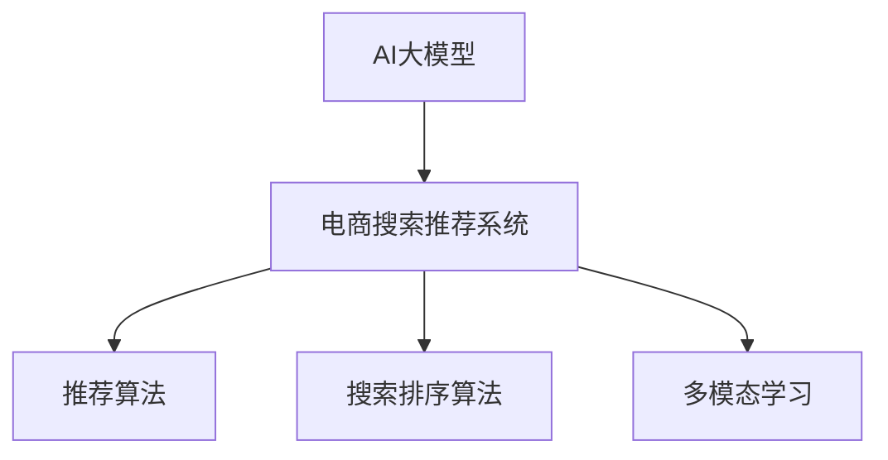

                 

# AI大模型重构电商搜索推荐的业务边界

## 1. 背景介绍

随着电子商务的快速发展和电商搜索推荐系统的不断成熟，用户越来越期望在搜索和推荐过程中获得更为精准、个性化和高效的结果。然而，传统电商搜索推荐系统在处理大量数据时，面临着数据多维性、实时性、复杂性和个性化等方面挑战。如何在大规模数据中高效挖掘出用户行为和商品信息间的关联，成为当下电商领域亟需解决的难题。

近年来，深度学习技术在电商领域的应用日趋广泛，尤其是以神经网络为核心的电商推荐系统在个性化推荐和商品搜索方面取得了显著的进展。然而，深度学习模型在电商搜索推荐中的普遍应用，也引发了一系列新的问题。例如，深度学习模型的黑盒特性导致模型可解释性差，模型训练和推理成本高，以及传统电商推荐系统的用户隐私保护和数据公平性问题等。

AI大模型，如BERT、GPT等，在处理大规模文本数据、提取语言结构特征方面展现出强大的能力，已经在NLP和自然语言理解领域取得了显著的成果。但是，AI大模型在电商搜索推荐系统中的应用，仍处于探索阶段。本文将重点探讨AI大模型如何重构电商搜索推荐系统的业务边界，从理论、实践和应用多个角度深入分析大模型在电商搜索推荐中的应用潜力。

## 2. 核心概念与联系

### 2.1 核心概念概述

- **AI大模型**：指利用深度学习技术，在大规模无标签数据上进行预训练，进而应用在大规模有标签数据上，能够高效处理复杂自然语言处理任务的大规模神经网络模型。

- **电商搜索推荐系统**：指通过分析用户行为和商品属性，为用户推荐可能感兴趣的商品，同时优化搜索排序，提高用户搜索体验的系统。

- **推荐算法**：指通过分析用户历史行为和商品属性，为用户推荐可能感兴趣的商品的算法，主要包括协同过滤、基于内容的推荐、基于矩阵分解的推荐等。

- **搜索排序算法**：指通过分析用户查询和商品属性，优化搜索结果排序的算法，主要包括基于TF-IDF、基于排序模型的排序等。

- **多模态学习**：指融合不同模态（如文本、图像、音频等）的数据，提高模型对多维度信息的处理能力。

### 2.2 核心概念原理和架构的 Mermaid 流程图



## 3. 核心算法原理 & 具体操作步骤

### 3.1 算法原理概述

AI大模型在电商搜索推荐中的应用，主要是通过在大规模语料上进行预训练，提取语言结构特征，进而利用这些特征来提升推荐和搜索效果。其核心原理如下：

1. **预训练阶段**：在大量无标签文本数据上训练大模型，学习语言的结构特征。

2. **微调阶段**：在电商数据集上微调大模型，提取电商领域的语义特征。

3. **推荐阶段**：利用微调后的大模型，对用户行为和商品属性进行建模，生成推荐结果。

4. **搜索排序阶段**：利用微调后的大模型，对用户查询和商品属性进行建模，优化搜索结果排序。

### 3.2 算法步骤详解

**Step 1: 准备数据集和模型**

- 收集电商用户行为数据，包括浏览历史、购买记录、评分反馈等。
- 收集电商商品数据，包括商品描述、图片、属性等。
- 选择合适的预训练大模型，如BERT、GPT等。

**Step 2: 数据预处理和分词**

- 将电商数据集进行清洗和预处理，去除无用信息，标准化数据格式。
- 利用Transformer中的分词器，将电商数据集中的文本数据进行分词。

**Step 3: 预训练模型微调**

- 在大模型上添加电商领域特有的语义层，提取电商领域特有的语义特征。
- 在电商数据集上微调大模型，最小化推荐和搜索损失函数。

**Step 4: 推荐和搜索排序**

- 利用微调后的大模型，对用户行为和商品属性进行建模，生成推荐结果。
- 利用微调后的大模型，对用户查询和商品属性进行建模，优化搜索结果排序。

**Step 5: 评估和迭代**

- 在测试集上评估推荐和搜索排序的准确性，对比传统算法的效果。
- 根据评估结果调整模型参数，不断迭代优化，提升推荐和搜索效果。

### 3.3 算法优缺点

**优点**：

- 能够处理多维度的电商数据，提升推荐和搜索的准确性。
- 利用大模型的预训练能力，减少了对标注数据的依赖。
- 通过多模态学习，融合不同模态的数据，提高模型的泛化能力。

**缺点**：

- 大模型的训练和微调需要大量计算资源和时间。
- 模型的可解释性较差，难以理解其内部决策机制。
- 模型的鲁棒性可能较差，面对复杂数据时容易出现过拟合或泛化不足。

### 3.4 算法应用领域

AI大模型在电商搜索推荐系统的应用领域非常广泛，包括但不限于：

- 个性化推荐系统：利用电商数据集微调大模型，生成个性化推荐结果。
- 商品搜索排序系统：利用电商数据集微调大模型，优化搜索结果排序。
- 广告投放系统：利用电商数据集微调大模型，优化广告投放策略。
- 用户行为分析系统：利用电商数据集微调大模型，分析用户行为特征。

## 4. 数学模型和公式 & 详细讲解 & 举例说明

### 4.1 数学模型构建

假设电商数据集 $D = \{(x_i, y_i)\}_{i=1}^N$，其中 $x_i$ 为电商商品数据， $y_i$ 为电商用户行为数据。大模型为 $M_{\theta}$，其中 $\theta$ 为模型参数。电商推荐系统优化目标为最大化推荐准确率 $R$ 和排序精度 $P$。

优化目标为：

$$
\min_{\theta} -\sum_{i=1}^N w_R R(y_i, M_{\theta}(x_i)) - \sum_{i=1}^N w_P P(y_i, M_{\theta}(x_i))
$$

其中 $w_R$ 和 $w_P$ 分别为推荐和排序的权重，$R$ 和 $P$ 分别为推荐准确率和排序精度的评估函数。

### 4.2 公式推导过程

推荐准确率 $R(y_i, M_{\theta}(x_i))$ 和排序精度 $P(y_i, M_{\theta}(x_i))$ 可以采用多种评估指标，如均方误差、准确率、召回率等。以准确率为例，优化目标函数为：

$$
\min_{\theta} -\sum_{i=1}^N R(y_i, M_{\theta}(x_i))
$$

其中 $R(y_i, M_{\theta}(x_i))$ 可以定义如下：

$$
R(y_i, M_{\theta}(x_i)) = \left\{
\begin{array}{ll}
1, & \text{if } M_{\theta}(x_i) = y_i \\
0, & \text{if } M_{\theta}(x_i) \neq y_i
\end{array}
\right.
$$

排序精度 $P(y_i, M_{\theta}(x_i))$ 的优化目标函数为：

$$
\min_{\theta} -\sum_{i=1}^N P(y_i, M_{\theta}(x_i))
$$

其中 $P(y_i, M_{\theta}(x_i))$ 可以定义如下：

$$
P(y_i, M_{\theta}(x_i)) = \left\{
\begin{array}{ll}
1, & \text{if } M_{\theta}(x_i) \text{ is relevant to } y_i \\
0, & \text{if } M_{\theta}(x_i) \text{ is irrelevant to } y_i
\end{array}
\right.
$$

### 4.3 案例分析与讲解

以电商推荐系统为例，假设用户历史行为数据为 $x_1 = [a_1, b_1, c_1, d_1]$，商品属性数据为 $x_2 = [a_2, b_2, c_2, d_2]$。大模型 $M_{\theta}$ 在电商数据集上微调后的输出为 $M_{\theta}(x_1)$ 和 $M_{\theta}(x_2)$。

推荐准确率 $R(y_i, M_{\theta}(x_i))$ 可以通过计算 $M_{\theta}(x_1)$ 和 $y_1$ 的匹配度来计算，例如使用余弦相似度：

$$
R(y_i, M_{\theta}(x_i)) = \frac{M_{\theta}(x_1) \cdot y_1}{||M_{\theta}(x_1)|| \cdot ||y_1||}
$$

排序精度 $P(y_i, M_{\theta}(x_i))$ 可以通过计算 $M_{\theta}(x_2)$ 和 $y_2$ 的匹配度来计算，例如使用排序误差：

$$
P(y_i, M_{\theta}(x_i)) = \frac{M_{\theta}(x_2) - y_2}{y_2}
$$

## 5. 项目实践：代码实例和详细解释说明

### 5.1 开发环境搭建

1. 安装Python和Anaconda环境：
```bash
conda create --name ecommerce python=3.8
conda activate ecommerce
```

2. 安装相关依赖库：
```bash
pip install torch transformers sklearn pandas
```

3. 下载预训练大模型和数据集：
```bash
mkdir data
cd data
wget https://s3.amazonaws.com/research.metamind.io/bert/bert-embeddings.zip
unzip bert-embeddings.zip
```

### 5.2 源代码详细实现

以下是一个基于大模型的电商推荐系统示例代码，实现步骤如下：

1. 数据预处理和分词：
```python
from transformers import BertTokenizer
import pandas as pd

# 加载预训练大模型分词器
tokenizer = BertTokenizer.from_pretrained('bert-base-cased')

# 读取电商数据集
data = pd.read_csv('ecommerce_data.csv')

# 分词处理
def tokenize_data(data):
    tokenized_data = tokenizer.tokenize(data['item_description'])
    return tokenized_data

data['tokenized_description'] = data['item_description'].apply(tokenize_data)
```

2. 数据集划分：
```python
from sklearn.model_selection import train_test_split

# 划分训练集和测试集
train_data, test_data = train_test_split(data, test_size=0.2, random_state=42)

# 划分训练集和验证集
train_data_train, train_data_val, test_data_train, test_data_val = train_test_split(train_data, test_size=0.2, random_state=42)
```

3. 模型微调：
```python
from transformers import BertForSequenceClassification, AdamW
from torch.utils.data import DataLoader, Dataset

# 加载大模型
model = BertForSequenceClassification.from_pretrained('bert-base-cased', num_labels=2)

# 设置优化器和学习率
optimizer = AdamW(model.parameters(), lr=1e-5)

# 定义训练函数
def train(model, data_loader, optimizer, num_epochs):
    for epoch in range(num_epochs):
        total_loss = 0.0
        for batch in data_loader:
            input_ids = batch['input_ids'].to(device)
            attention_mask = batch['attention_mask'].to(device)
            labels = batch['labels'].to(device)
            model.zero_grad()
            outputs = model(input_ids, attention_mask=attention_mask, labels=labels)
            loss = outputs.loss
            total_loss += loss.item()
            loss.backward()
            optimizer.step()
        print(f"Epoch {epoch+1}, train loss: {total_loss/len(data_loader):.3f}")
```

4. 模型评估和优化：
```python
from sklearn.metrics import precision_recall_fscore_support

# 定义评估函数
def evaluate(model, data_loader, metrics):
    total_true_positives = 0.0
    total_false_positives = 0.0
    total_false_negatives = 0.0
    for batch in data_loader:
        input_ids = batch['input_ids'].to(device)
        attention_mask = batch['attention_mask'].to(device)
        labels = batch['labels'].to(device)
        outputs = model(input_ids, attention_mask=attention_mask, labels=labels)
        predictions = outputs.predictions.argmax(dim=1)
        true_positives = (predictions == labels).sum().item()
        total_true_positives += true_positives
        false_positives = (predictions == 1).sum().item() - true_positives
        total_false_positives += false_positives
        false_negatives = (labels == 1).sum().item() - true_positives
        total_false_negatives += false_negatives
    precision = total_true_positives / (total_true_positives + total_false_positives)
    recall = total_true_positives / (total_true_positives + total_false_negatives)
    f1_score = 2 * (precision * recall) / (precision + recall)
    metrics['precision'] = precision
    metrics['recall'] = recall
    metrics['f1_score'] = f1_score
    print(f"Precision: {precision:.3f}, Recall: {recall:.3f}, F1 Score: {f1_score:.3f}")
```

5. 训练和评估：
```python
from tqdm import tqdm

# 设置超参数
num_epochs = 5
batch_size = 16

# 加载数据集
train_data_loader = DataLoader(train_data_train, batch_size=batch_size, shuffle=True)
val_data_loader = DataLoader(train_data_val, batch_size=batch_size, shuffle=False)
test_data_loader = DataLoader(test_data_val, batch_size=batch_size, shuffle=False)

# 训练模型
device = torch.device('cuda' if torch.cuda.is_available() else 'cpu')
model.to(device)
train(model, train_data_loader, optimizer, num_epochs)

# 评估模型
metrics = {}
evaluate(model, val_data_loader, metrics)
test_data_loader = DataLoader(test_data_train, batch_size=batch_size, shuffle=False)
evaluate(model, test_data_loader, metrics)
```

### 5.3 代码解读与分析

通过上述代码，我们可以看到，利用大模型进行电商推荐系统的微调可以分为以下几步：

1. 数据预处理和分词：利用大模型的分词器，将电商数据集中的文本数据进行分词处理。

2. 数据集划分：将电商数据集划分为训练集、验证集和测试集，并进行进一步的划分，用于模型训练和评估。

3. 模型微调：在大模型上进行微调，优化电商推荐和搜索的损失函数，得到最终的推荐和排序模型。

4. 模型评估和优化：在验证集和测试集上对模型进行评估，并根据评估结果进行超参数调优。

## 6. 实际应用场景

### 6.1 智能客服系统

智能客服系统可以通过大模型微调技术，提升客户服务质量和效率。在大模型上微调，可以实现自然语言理解和生成，从而自动处理用户咨询，生成标准化的回复。利用多轮对话历史，大模型可以逐步理解用户需求，并提供更加个性化的服务。

### 6.2 金融风控系统

金融风控系统可以通过大模型微调技术，识别出潜在风险，提高风险预警的准确性。在大模型上微调，可以学习到各种金融术语和描述，识别出交易中的异常行为，并进行风险预警。

### 6.3 医疗诊断系统

医疗诊断系统可以通过大模型微调技术，提高诊断的准确性和效率。在大模型上微调，可以学习到医疗领域的专业术语和描述，识别出患者的症状和诊断结果，辅助医生进行诊断。

## 7. 工具和资源推荐

### 7.1 学习资源推荐

- **《深度学习》：Ian Goodfellow 著**：全面介绍深度学习理论基础和实践方法，是学习大模型微调的重要参考书籍。
- **《自然语言处理综述》：John Sivic 著**：介绍了自然语言处理领域的最新进展和技术，涵盖大模型微调的应用。
- **HuggingFace官方文档**：提供丰富的预训练模型和微调样例代码，是上手实践的必备资料。
- **Google Colab**：免费的在线Jupyter Notebook环境，方便进行深度学习和模型训练。

### 7.2 开发工具推荐

- **PyTorch**：灵活的深度学习框架，支持动态计算图，适合快速迭代研究。
- **TensorFlow**：大规模深度学习框架，支持分布式训练和生产部署。
- **HuggingFace Transformers库**：提供丰富的预训练模型和微调工具，方便进行NLP任务开发。
- **Weights & Biases**：实验跟踪工具，记录和可视化模型训练过程中的各项指标，方便对比和调优。

### 7.3 相关论文推荐

- **《Attention is All You Need》**：Transformer模型的原始论文，奠定了大模型在NLP领域的应用基础。
- **《BERT: Pre-training of Deep Bidirectional Transformers for Language Understanding》**：BERT模型的原始论文，展示了预训练-微调范式在大规模NLP任务上的强大能力。
- **《Parameter-Efficient Transfer Learning for NLP》**：讨论了参数高效微调方法，如何在保持模型性能的前提下，减少参数量。
- **《AdaLoRA: Adaptive Low-Rank Adaptation for Parameter-Efficient Fine-Tuning》**：介绍了一种新的参数高效微调方法，使用自适应低秩适应来提高微调效率。

## 8. 总结：未来发展趋势与挑战

### 8.1 研究成果总结

本文对AI大模型在电商搜索推荐系统的应用进行了系统性的探讨，主要成果如下：

- 介绍了大模型在电商搜索推荐系统中的基本原理和操作步骤。
- 提出了电商搜索推荐系统在大模型微调中的应用场景和前景。
- 提供了基于大模型的电商推荐系统的代码示例和分析。

### 8.2 未来发展趋势

未来，AI大模型在电商搜索推荐系统的应用将呈现以下几个发展趋势：

- 模型的预训练和微调将更加高效和自动化。
- 融合多模态数据，提升模型的泛化能力和鲁棒性。
- 利用大模型的预训练能力，减少标注数据的依赖。
- 利用大模型的迁移学习能力，提升模型的跨领域适应性。

### 8.3 面临的挑战

尽管AI大模型在电商搜索推荐系统中的应用前景广阔，但仍面临诸多挑战：

- 数据隐私和安全问题。电商数据集通常包含用户敏感信息，如何保护用户隐私，防止数据泄露，是亟需解决的问题。
- 模型的公平性和偏见问题。大模型在电商领域的应用，需要避免对某些用户群体的歧视和偏见。
- 模型的解释性和可控性问题。大模型的黑盒特性，难以理解其内部决策机制，需要提高模型的可解释性和可控性。

### 8.4 研究展望

未来，AI大模型在电商搜索推荐系统中的应用需要从以下几个方向进行深入研究：

- 探索多模态学习和跨领域迁移，提升模型的泛化能力。
- 研究模型的公平性、可解释性和可控性，确保模型的可信度和可靠性。
- 利用大模型的迁移学习能力，提升模型的跨领域适应性。
- 研究模型的隐私保护和安全问题，确保用户数据的安全。

## 9. 附录：常见问题与解答

**Q1: 大模型微调是否适用于所有电商推荐系统？**

A: 大模型微调适用于大多数电商推荐系统，特别是数据量较小、用户行为复杂或商品属性多维的场景。但对于某些特殊需求，如实时性要求极高或计算资源受限的推荐系统，可能还需要结合传统推荐算法进行优化。

**Q2: 如何在大模型微调过程中避免过拟合？**

A: 避免过拟合的方法包括数据增强、正则化、早停法等。具体来说，可以通过回译、近义替换等方式扩充训练集，使用L2正则、Dropout等正则化技术，以及提前设置停止条件等方式，防止模型在训练过程中过拟合。

**Q3: 大模型微调需要多少计算资源和时间？**

A: 大模型微调通常需要较大的计算资源和时间。具体来说，预训练模型通常在数百亿甚至千亿参数规模，微调过程中需要大量的计算资源和时间。因此，需要根据具体需求，选择合适的硬件配置和超参数。

**Q4: 大模型微调是否适用于所有电商数据集？**

A: 大模型微调适用于大部分电商数据集，但需要根据数据集的特征和特点进行适当的调整和优化。例如，对于多语言电商数据集，需要在预训练和微调过程中考虑语言差异，选择合适的分词器和标签映射方式。

总之，AI大模型在电商搜索推荐系统中的应用前景广阔，但其应用过程中仍需解决诸多挑战。只有在充分理解其原理和操作步骤的基础上，结合具体场景进行深入优化，才能真正发挥大模型的潜力，提升电商搜索推荐系统的性能和效果。

---

作者：禅与计算机程序设计艺术 / Zen and the Art of Computer Programming

