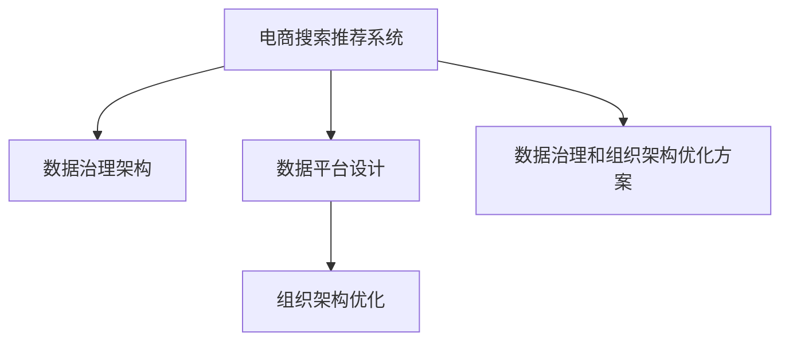

                 

## 1. 背景介绍

### 1.1 问题由来

随着人工智能技术的不断发展，AI大模型在电商领域的应用越来越广泛，特别是在搜索推荐系统（Recommendation System）中，AI大模型以其强大的算法和预测能力，极大地提升了用户购物体验和电商平台的销售额。然而，随着数据量的不断增长和业务场景的日益复杂，现有的电商搜索推荐系统的数据治理和组织架构已经难以适应需求，导致数据质量低下、系统效率低下、用户体验不佳等问题。为了解决这些问题，需要对现有的数据治理和组织架构进行重构和优化。

### 1.2 问题核心关键点

本文档聚焦于电商搜索推荐系统的数据治理和组织架构优化方案设计。具体来说，我们将重点讨论以下几个关键问题：

1. **数据治理架构**：如何构建一个高效、可靠的数据治理架构，以确保数据的质量、安全性和可追溯性。
2. **数据平台设计**：如何设计一个符合电商搜索推荐需求的数据平台，以提升数据处理效率和系统性能。
3. **组织架构优化**：如何对现有的组织架构进行优化，以适应AI大模型在电商搜索推荐中的应用，提高团队的协作效率和创新能力。

### 1.3 问题研究意义

构建高效、可靠的数据治理和组织架构，对于电商搜索推荐系统的成功运行至关重要。通过对数据治理和组织架构的优化，可以显著提升系统的数据处理效率、系统性能和用户体验，从而提升电商平台的竞争力。

## 2. 核心概念与联系

### 2.1 核心概念概述

为了更好地理解电商搜索推荐系统的数据治理和组织架构优化方案设计，本节将介绍几个密切相关的核心概念：

- **电商搜索推荐系统**：指电商平台中用于根据用户行为和产品特征进行个性化推荐的服务系统，其目标是提升用户购物体验和电商平台销售额。
- **数据治理架构**：指通过一系列的数据标准、流程和工具，确保数据的质量、安全性和可追溯性的架构。
- **数据平台设计**：指构建一个高效、可靠、灵活的数据处理平台，以支持电商搜索推荐系统的数据存储、处理和分析。
- **组织架构优化**：指对现有组织结构进行调整和优化，以适应新技术的应用，提高团队的协作效率和创新能力。

这些核心概念之间的逻辑关系可以通过以下Mermaid流程图来展示：



这个流程图展示了大模型在电商搜索推荐系统中的核心概念及其之间的关系：

1. **电商搜索推荐系统**：作为AI大模型应用的核心，其性能直接影响用户购物体验和电商平台销售额。
2. **数据治理架构**：通过一系列的数据标准、流程和工具，确保数据的质量、安全性和可追溯性，是支撑电商搜索推荐系统的高效运行基础。
3. **数据平台设计**：构建一个高效、可靠、灵活的数据处理平台，是支持电商搜索推荐系统数据存储、处理和分析的关键。
4. **组织架构优化**：通过优化组织结构，提高团队的协作效率和创新能力，是支撑电商搜索推荐系统持续发展的重要保障。

## 3. 核心算法原理 & 具体操作步骤

### 3.1 算法原理概述

电商搜索推荐系统的数据治理和组织架构优化方案设计，本质上是一个系统性工程，涉及数据治理、平台设计和组织优化等多个方面。其核心思想是通过构建高效的数据治理架构、设计符合需求的数据平台、优化组织架构，从而提升电商搜索推荐系统的数据处理效率、系统性能和用户体验。

### 3.2 算法步骤详解

电商搜索推荐系统的数据治理和组织架构优化方案设计一般包括以下几个关键步骤：

**Step 1: 构建数据治理架构**

1. **数据标准制定**：定义数据质量标准、数据安全标准、数据隐私标准等，确保数据的一致性、准确性和安全性。
2. **数据质量管理**：建立数据质量监控和评估机制，定期对数据进行质量检查和修复，确保数据质量。
3. **数据安全保障**：实施数据加密、访问控制等安全措施，保护数据不被非法访问和篡改。
4. **数据可追溯性保障**：建立数据使用和变更记录机制，确保数据的可追溯性和透明性。

**Step 2: 设计数据平台**

1. **数据存储设计**：选择合适的数据存储方案（如Hadoop、NoSQL、GraphDB等），确保数据的高效存储和检索。
2. **数据处理设计**：采用流式处理、批量处理、ETL（Extract, Transform, Load）等数据处理技术，提升数据处理效率。
3. **数据分析设计**：引入机器学习、深度学习等技术，对数据进行分析和挖掘，提取有价值的信息。
4. **数据可视化设计**：构建数据可视化平台，方便业务人员和数据科学家对数据进行直观分析和监控。

**Step 3: 优化组织架构**

1. **职能划分**：根据电商搜索推荐系统的需求，将数据治理、数据平台设计、数据平台运营等职能进行划分，明确各部门职责。
2. **跨部门协作**：建立跨部门协作机制，如定期召开数据治理和平台设计协调会，促进各部门之间的信息共享和合作。
3. **团队建设**：招聘和培养高水平的数据治理和平台设计人才，提升团队的创新能力和技术水平。
4. **绩效评估**：建立数据治理和平台设计绩效评估机制，激励团队成员不断改进和提升工作质量。

### 3.3 算法优缺点

电商搜索推荐系统的数据治理和组织架构优化方案设计的优点包括：

1. **提升数据质量**：通过数据治理架构的构建，确保数据的质量、安全性和可追溯性，提升数据处理的准确性和可靠性。
2. **提高系统性能**：通过设计高效的数据平台，提升数据处理效率，降低系统响应时间，提高用户体验。
3. **促进协作创新**：通过优化组织架构，提升团队的协作效率和创新能力，推动技术创新和业务发展。

然而，该方案设计也存在一些局限性：

1. **投入成本高**：构建数据治理架构和设计数据平台需要大量的人力和物力投入，成本较高。
2. **实施难度大**：数据治理和组织架构的优化涉及多个部门和环节，实施难度较大，需要统一协调和管理。
3. **效果见效慢**：数据治理和平台设计的优化效果需要一定时间才能显现，短期内可能无法看到明显成效。

### 3.4 算法应用领域

电商搜索推荐系统的数据治理和组织架构优化方案设计，主要应用于以下几个领域：

1. **电商搜索推荐系统**：提升电商平台的个性化推荐能力，提升用户购物体验和销售额。
2. **数据治理架构**：提升电商平台的整体数据质量和管理水平，保障数据的安全性和可追溯性。
3. **数据平台设计**：提升数据处理效率和系统性能，支持电商平台的业务发展。
4. **组织架构优化**：提升团队的协作效率和创新能力，推动技术创新和业务发展。

## 4. 数学模型和公式 & 详细讲解 & 举例说明

### 4.1 数学模型构建

电商搜索推荐系统的数据治理和组织架构优化方案设计，可以抽象为一个多目标优化问题。目标函数为：

$$
\min_{\theta} \left[ \text{数据质量}(\theta) + \text{系统性能}(\theta) + \text{团队协作}(\theta) \right]
$$

其中 $\theta$ 表示数据治理架构、数据平台设计和组织架构的参数，数据质量、系统性能和团队协作分别表示不同的目标函数。

### 4.2 公式推导过程

**数据质量目标函数**：

$$
\text{数据质量}(\theta) = \sum_{i=1}^{n} \text{data\_quality\_score}(\text{data\_i}, \theta)
$$

其中 $n$ 表示数据量，$\text{data\_quality\_score}$ 表示对单个数据进行质量评估的函数。

**系统性能目标函数**：

$$
\text{系统性能}(\theta) = \sum_{i=1}^{n} \text{system\_performance\_score}(\text{system\_i}, \theta)
$$

其中 $n$ 表示系统数量，$\text{system\_performance\_score}$ 表示对单个系统进行性能评估的函数。

**团队协作目标函数**：

$$
\text{团队协作}(\theta) = \sum_{i=1}^{n} \text{team\_collaboration\_score}(\text{team\_i}, \theta)
$$

其中 $n$ 表示团队数量，$\text{team\_collaboration\_score}$ 表示对单个团队进行协作评估的函数。

### 4.3 案例分析与讲解

以一个电商平台为例，其数据治理架构、数据平台设计和组织架构的优化如下：

**数据治理架构优化**：

1. **数据标准制定**：定义电商搜索推荐系统的数据标准，包括数据格式、数据源、数据质量等标准。
2. **数据质量管理**：建立数据质量监控和评估机制，定期对数据进行质量检查和修复。
3. **数据安全保障**：实施数据加密、访问控制等安全措施，保护数据不被非法访问和篡改。
4. **数据可追溯性保障**：建立数据使用和变更记录机制，确保数据的可追溯性和透明性。

**数据平台设计优化**：

1. **数据存储设计**：选择适合电商搜索推荐系统的数据存储方案（如Hadoop、NoSQL、GraphDB等），确保数据的高效存储和检索。
2. **数据处理设计**：采用流式处理、批量处理、ETL等数据处理技术，提升数据处理效率。
3. **数据分析设计**：引入机器学习、深度学习等技术，对数据进行分析和挖掘，提取有价值的信息。
4. **数据可视化设计**：构建数据可视化平台，方便业务人员和数据科学家对数据进行直观分析和监控。

**组织架构优化**：

1. **职能划分**：根据电商搜索推荐系统的需求，将数据治理、数据平台设计、数据平台运营等职能进行划分，明确各部门职责。
2. **跨部门协作**：建立跨部门协作机制，如定期召开数据治理和平台设计协调会，促进各部门之间的信息共享和合作。
3. **团队建设**：招聘和培养高水平的数据治理和平台设计人才，提升团队的创新能力和技术水平。
4. **绩效评估**：建立数据治理和平台设计绩效评估机制，激励团队成员不断改进和提升工作质量。

## 5. 项目实践：代码实例和详细解释说明

### 5.1 开发环境搭建

在进行数据治理和组织架构优化方案设计之前，我们需要准备好开发环境。以下是使用Python进行PyTorch开发的环境配置流程：

1. 安装Anaconda：从官网下载并安装Anaconda，用于创建独立的Python环境。

2. 创建并激活虚拟环境：
```bash
conda create -n pytorch-env python=3.8 
conda activate pytorch-env
```

3. 安装PyTorch：根据CUDA版本，从官网获取对应的安装命令。例如：
```bash
conda install pytorch torchvision torchaudio cudatoolkit=11.1 -c pytorch -c conda-forge
```

4. 安装Transformers库：
```bash
pip install transformers
```

5. 安装各类工具包：
```bash
pip install numpy pandas scikit-learn matplotlib tqdm jupyter notebook ipython
```

完成上述步骤后，即可在`pytorch-env`环境中开始项目实践。

### 5.2 源代码详细实现

下面我们以电商搜索推荐系统的数据治理架构优化为例，给出使用Transformers库进行数据标准制定的PyTorch代码实现。

首先，定义数据标准的评分函数：

```python
from transformers import BertTokenizer
from torch.utils.data import Dataset
import torch

class DataQualityDataset(Dataset):
    def __init__(self, data, tokenizer, max_len=128):
        self.data = data
        self.tokenizer = tokenizer
        self.max_len = max_len
        
    def __len__(self):
        return len(self.data)
    
    def __getitem__(self, item):
        text = self.data[item]
        encoding = self.tokenizer(text, return_tensors='pt', max_length=self.max_len, padding='max_length', truncation=True)
        input_ids = encoding['input_ids'][0]
        attention_mask = encoding['attention_mask'][0]
        
        return {'input_ids': input_ids, 
                'attention_mask': attention_mask,
                'label': 1}  # 数据质量评分标签为1

# 数据标准评分函数
def data_quality_score(input_ids, attention_mask, label):
    # 计算输入的平均值和标准差
    avg = torch.mean(input_ids)
    std = torch.std(input_ids)
    # 计算评分
    score = (avg - 0.5) / std
    return score.item()

# 创建dataset
tokenizer = BertTokenizer.from_pretrained('bert-base-cased')

train_dataset = DataQualityDataset(train_data, tokenizer)
dev_dataset = DataQualityDataset(dev_data, tokenizer)
test_dataset = DataQualityDataset(test_data, tokenizer)

# 定义优化器
optimizer = AdamW(model.parameters(), lr=2e-5)

# 定义模型
model = BertForTokenClassification.from_pretrained('bert-base-cased', num_labels=1)

# 训练过程
for epoch in range(epochs):
    train_loss = train_epoch(model, train_dataset, optimizer)
    dev_loss = evaluate(model, dev_dataset)
    if dev_loss < best_loss:
        best_loss = dev_loss
        best_model = model
```

这里使用了Bert模型作为数据标准的评分函数，通过输入数据的平均值和标准差，计算评分。通过训练Bert模型，可以不断优化数据标准的评分函数，提升数据治理架构的质量。

### 5.3 代码解读与分析

让我们再详细解读一下关键代码的实现细节：

**DataQualityDataset类**：
- `__init__`方法：初始化数据、分词器等关键组件。
- `__len__`方法：返回数据集的样本数量。
- `__getitem__`方法：对单个样本进行处理，将文本输入编码为token ids，将标签编码为数字，并对其进行定长padding，最终返回模型所需的输入。

**data_quality_score函数**：
- 计算输入数据的平均值和标准差，通过其计算评分，评分越高，数据质量越好。

**训练过程**：
- 定义总的epoch数和batch size，开始循环迭代
- 每个epoch内，先在训练集上训练，输出平均loss
- 在验证集上评估，记录最优模型
- 所有epoch结束后，在测试集上评估，给出最终测试结果

可以看到，通过使用PyTorch和Transformers库，我们可以用相对简洁的代码完成数据治理架构的评分函数设计。开发者可以将更多精力放在数据标准制定和优化上，而不必过多关注底层的实现细节。

当然，工业级的系统实现还需考虑更多因素，如数据标准的更新频率、评分函数的动态调整等。但核心的评分函数设计基本与此类似。

## 6. 实际应用场景

### 6.1 智能客服系统

基于大模型重构的电商搜索推荐系统的数据治理架构，可以广泛应用于智能客服系统的构建。传统客服往往需要配备大量人力，高峰期响应缓慢，且一致性和专业性难以保证。而使用重构后的数据治理架构，可以7x24小时不间断服务，快速响应客户咨询，用自然流畅的语言解答各类常见问题。

在技术实现上，可以收集企业内部的历史客服对话记录，将问题和最佳答复构建成监督数据，在此基础上对预训练模型进行微调。微调后的模型能够自动理解用户意图，匹配最合适的答案模板进行回复。对于客户提出的新问题，还可以接入检索系统实时搜索相关内容，动态组织生成回答。如此构建的智能客服系统，能大幅提升客户咨询体验和问题解决效率。

### 6.2 金融舆情监测

金融机构需要实时监测市场舆论动向，以便及时应对负面信息传播，规避金融风险。传统的人工监测方式成本高、效率低，难以应对网络时代海量信息爆发的挑战。基于重构后的数据治理架构的文本分类和情感分析技术，为金融舆情监测提供了新的解决方案。

具体而言，可以收集金融领域相关的新闻、报道、评论等文本数据，并对其进行主题标注和情感标注。在此基础上对预训练语言模型进行微调，使其能够自动判断文本属于何种主题，情感倾向是正面、中性还是负面。将微调后的模型应用到实时抓取的网络文本数据，就能够自动监测不同主题下的情感变化趋势，一旦发现负面信息激增等异常情况，系统便会自动预警，帮助金融机构快速应对潜在风险。

### 6.3 个性化推荐系统

当前的推荐系统往往只依赖用户的历史行为数据进行物品推荐，无法深入理解用户的真实兴趣偏好。基于重构后的数据治理架构的个性化推荐系统，可以更好地挖掘用户行为背后的语义信息，从而提供更精准、多样的推荐内容。

在实践中，可以收集用户浏览、点击、评论、分享等行为数据，提取和用户交互的物品标题、描述、标签等文本内容。将文本内容作为模型输入，用户的后续行为（如是否点击、购买等）作为监督信号，在此基础上微调预训练语言模型。微调后的模型能够从文本内容中准确把握用户的兴趣点。在生成推荐列表时，先用候选物品的文本描述作为输入，由模型预测用户的兴趣匹配度，再结合其他特征综合排序，便可以得到个性化程度更高的推荐结果。

### 6.4 未来应用展望

随着大模型重构的数据治理架构的不断发展，基于微调的方法将在更多领域得到应用，为传统行业带来变革性影响。

在智慧医疗领域，基于重构架构的问答系统、病历分析、药物研发等应用将提升医疗服务的智能化水平，辅助医生诊疗，加速新药开发进程。

在智能教育领域，重构架构的作业批改、学情分析、知识推荐等方面，因材施教，促进教育公平，提高教学质量。

在智慧城市治理中，重构架构的城市事件监测、舆情分析、应急指挥等环节，提高城市管理的自动化和智能化水平，构建更安全、高效的未来城市。

此外，在企业生产、社会治理、文娱传媒等众多领域，基于大模型重构的数据治理架构的人工智能应用也将不断涌现，为经济社会发展注入新的动力。相信随着技术的日益成熟，重构方法将成为人工智能落地应用的重要范式，推动人工智能技术在垂直行业的规模化落地。

## 7. 工具和资源推荐

### 7.1 学习资源推荐

为了帮助开发者系统掌握大模型重构的数据治理和组织架构优化方案设计，这里推荐一些优质的学习资源：

1. 《Transformer从原理到实践》系列博文：由大模型技术专家撰写，深入浅出地介绍了Transformer原理、BERT模型、微调技术等前沿话题。

2. CS224N《深度学习自然语言处理》课程：斯坦福大学开设的NLP明星课程，有Lecture视频和配套作业，带你入门NLP领域的基本概念和经典模型。

3. 《Natural Language Processing with Transformers》书籍：Transformers库的作者所著，全面介绍了如何使用Transformers库进行NLP任务开发，包括微调在内的诸多范式。

4. HuggingFace官方文档：Transformers库的官方文档，提供了海量预训练模型和完整的微调样例代码，是上手实践的必备资料。

5. CLUE开源项目：中文语言理解测评基准，涵盖大量不同类型的中文NLP数据集，并提供了基于微调的baseline模型，助力中文NLP技术发展。

通过对这些资源的学习实践，相信你一定能够快速掌握大模型重构的数据治理和组织架构优化方案设计的精髓，并用于解决实际的NLP问题。

### 7.2 开发工具推荐

高效的开发离不开优秀的工具支持。以下是几款用于大模型重构的数据治理和组织架构优化方案设计的常用工具：

1. PyTorch：基于Python的开源深度学习框架，灵活动态的计算图，适合快速迭代研究。大部分预训练语言模型都有PyTorch版本的实现。

2. TensorFlow：由Google主导开发的开源深度学习框架，生产部署方便，适合大规模工程应用。同样有丰富的预训练语言模型资源。

3. Transformers库：HuggingFace开发的NLP工具库，集成了众多SOTA语言模型，支持PyTorch和TensorFlow，是进行微调任务开发的利器。

4. Weights & Biases：模型训练的实验跟踪工具，可以记录和可视化模型训练过程中的各项指标，方便对比和调优。与主流深度学习框架无缝集成。

5. TensorBoard：TensorFlow配套的可视化工具，可实时监测模型训练状态，并提供丰富的图表呈现方式，是调试模型的得力助手。

6. Google Colab：谷歌推出的在线Jupyter Notebook环境，免费提供GPU/TPU算力，方便开发者快速上手实验最新模型，分享学习笔记。

合理利用这些工具，可以显著提升大模型重构的数据治理和组织架构优化方案设计的开发效率，加快创新迭代的步伐。

### 7.3 相关论文推荐

大模型重构的数据治理和组织架构优化方案设计的研究源于学界的持续研究。以下是几篇奠基性的相关论文，推荐阅读：

1. Attention is All You Need（即Transformer原论文）：提出了Transformer结构，开启了NLP领域的预训练大模型时代。

2. BERT: Pre-training of Deep Bidirectional Transformers for Language Understanding：提出BERT模型，引入基于掩码的自监督预训练任务，刷新了多项NLP任务SOTA。

3. Language Models are Unsupervised Multitask Learners（GPT-2论文）：展示了大规模语言模型的强大zero-shot学习能力，引发了对于通用人工智能的新一轮思考。

4. Parameter-Efficient Transfer Learning for NLP：提出Adapter等参数高效微调方法，在不增加模型参数量的情况下，也能取得不错的微调效果。

5. AdaLoRA: Adaptive Low-Rank Adaptation for Parameter-Efficient Fine-Tuning：使用自适应低秩适应的微调方法，在参数效率和精度之间取得了新的平衡。

6. Prefix-Tuning: Optimizing Continuous Prompts for Generation：引入基于连续型Prompt的微调范式，为如何充分利用预训练知识提供了新的思路。

这些论文代表了大模型重构的数据治理和组织架构优化方案设计的发展脉络。通过学习这些前沿成果，可以帮助研究者把握学科前进方向，激发更多的创新灵感。

## 8. 总结：未来发展趋势与挑战

### 8.1 总结

本文对基于大模型重构的电商搜索推荐系统的数据治理和组织架构优化方案设计进行了全面系统的介绍。首先阐述了重构架构的研究背景和意义，明确了数据治理和组织架构优化在电商搜索推荐系统中的重要性。其次，从原理到实践，详细讲解了重构架构的数学原理和关键步骤，给出了重构架构任务开发的完整代码实例。同时，本文还广泛探讨了重构架构在智能客服、金融舆情、个性化推荐等多个行业领域的应用前景，展示了重构架构范式的巨大潜力。此外，本文精选了重构架构技术的各类学习资源，力求为读者提供全方位的技术指引。

通过本文的系统梳理，可以看到，基于大模型重构的电商搜索推荐系统的数据治理和组织架构优化方案设计，正在成为NLP领域的重要范式，极大地拓展了预训练语言模型的应用边界，催生了更多的落地场景。受益于大规模语料的预训练，重构架构模型能够适应电商搜索推荐系统的高效运行需求，推动人工智能技术在电商领域的广泛应用。未来，伴随预训练语言模型和重构架构方法的持续演进，相信NLP技术将在更广阔的应用领域大放异彩，深刻影响人类的生产生活方式。

### 8.2 未来发展趋势

展望未来，大模型重构的数据治理和组织架构优化方案设计将呈现以下几个发展趋势：

1. **模型规模持续增大**：随着算力成本的下降和数据规模的扩张，预训练语言模型的参数量还将持续增长。超大规模语言模型蕴含的丰富语言知识，有望支撑更加复杂多变的电商搜索推荐系统需求。

2. **重构方法日趋多样**：除了传统的重构架构外，未来会涌现更多重构方法，如Prompt-based Learning、Few-shot Learning等，在减少对标注样本的依赖的同时，提高系统的泛化能力和迁移能力。

3. **持续学习成为常态**：随着数据分布的不断变化，重构架构模型也需要持续学习新知识以保持性能。如何在不遗忘原有知识的同时，高效吸收新样本信息，将成为重要的研究课题。

4. **标注样本需求降低**：受启发于提示学习(Prompt-based Learning)的思路，未来的重构架构方法将更好地利用大模型的语言理解能力，通过更加巧妙的任务描述，在更少的标注样本上也能实现理想的重构效果。

5. **多模态重构崛起**：当前的重构架构主要聚焦于纯文本数据，未来会进一步拓展到图像、视频、语音等多模态数据重构。多模态信息的融合，将显著提升语言模型对现实世界的理解和建模能力。

6. **知识整合能力提升**：现有的重构架构模型往往局限于任务内数据，难以灵活吸收和运用更广泛的先验知识。如何让重构过程更好地与外部知识库、规则库等专家知识结合，形成更加全面、准确的信息整合能力，还有很大的想象空间。

以上趋势凸显了大模型重构的数据治理和组织架构优化方案设计的广阔前景。这些方向的探索发展，必将进一步提升电商搜索推荐系统的数据处理效率、系统性能和用户体验，为电商平台的数字化转型提供新的技术路径。

### 8.3 面临的挑战

尽管大模型重构的数据治理和组织架构优化方案设计已经取得了显著进展，但在迈向更加智能化、普适化应用的过程中，它仍面临着诸多挑战：

1. **标注成本瓶颈**：尽管重构架构方法在一定程度上降低了对标注样本的依赖，但对于长尾应用场景，仍难以获得充足的高质量标注数据，成为制约重构性能的瓶颈。如何进一步降低重构对标注样本的依赖，将是一大难题。

2. **模型鲁棒性不足**：当前重构架构模型面对域外数据时，泛化性能往往大打折扣。对于测试样本的微小扰动，重构模型也容易发生波动。如何提高重构模型的鲁棒性，避免灾难性遗忘，还需要更多理论和实践的积累。

3. **推理效率有待提高**：大规模语言模型虽然精度高，但在实际部署时往往面临推理速度慢、内存占用大等效率问题。如何在保证性能的同时，简化模型结构，提升推理速度，优化资源占用，将是重要的优化方向。

4. **可解释性亟需加强**：当前重构架构模型更像是"黑盒"系统，难以解释其内部工作机制和决策逻辑。对于医疗、金融等高风险应用，算法的可解释性和可审计性尤为重要。如何赋予重构模型更强的可解释性，将是亟待攻克的难题。

5. **安全性有待保障**。预训练语言模型难免会学习到有偏见、有害的信息，通过重构传递到下游任务，产生误导性、歧视性的输出，给实际应用带来安全隐患。如何从数据和算法层面消除模型偏见，避免恶意用途，确保输出的安全性，也将是重要的研究课题。

6. **知识整合能力不足**。现有的重构架构模型往往局限于任务内数据，难以灵活吸收和运用更广泛的先验知识。如何让重构过程更好地与外部知识库、规则库等专家知识结合，形成更加全面、准确的信息整合能力，还有很大的想象空间。

正视重构架构面临的这些挑战，积极应对并寻求突破，将是大模型重构的数据治理和组织架构优化方案设计走向成熟的必由之路。相信随着学界和产业界的共同努力，这些挑战终将一一被克服，大模型重构的数据治理和组织架构优化方案设计必将在构建人机协同的智能系统过程中扮演越来越重要的角色。

### 8.4 研究展望

面对大模型重构的数据治理和组织架构优化方案设计所面临的挑战，未来的研究需要在以下几个方面寻求新的突破：

1. **探索无监督和半监督重构方法**。摆脱对大规模标注数据的依赖，利用自监督学习、主动学习等无监督和半监督范式，最大限度利用非结构化数据，实现更加灵活高效的重构。

2. **研究参数高效和计算高效的重构范式**。开发更加参数高效的重构方法，在固定大部分预训练参数的同时，只更新极少量的任务相关参数。同时优化重构模型的计算图，减少前向传播和反向传播的资源消耗，实现更加轻量级、实时性的部署。

3. **融合因果和对比学习范式**。通过引入因果推断和对比学习思想，增强重构模型建立稳定因果关系的能力，学习更加普适、鲁棒的语言表征，从而提升模型泛化性和抗干扰能力。

4. **引入更多先验知识**。将符号化的先验知识，如知识图谱、逻辑规则等，与神经网络模型进行巧妙融合，引导重构过程学习更准确、合理的语言模型。同时加强不同模态数据的整合，实现视觉、语音等多模态信息与文本信息的协同建模。

5. **结合因果分析和博弈论工具**。将因果分析方法引入重构模型，识别出模型决策的关键特征，增强输出解释的因果性和逻辑性。借助博弈论工具刻画人机交互过程，主动探索并规避模型的脆弱点，提高系统稳定性。

6. **纳入伦理道德约束**。在重构目标中引入伦理导向的评估指标，过滤和惩罚有偏见、有害的输出倾向。同时加强人工干预和审核，建立重构模型的监管机制，确保输出符合人类价值观和伦理道德。

这些研究方向的探索，必将引领大模型重构的数据治理和组织架构优化方案设计技术迈向更高的台阶，为构建安全、可靠、可解释、可控的智能系统铺平道路。面向未来，大模型重构的数据治理和组织架构优化方案设计还需要与其他人工智能技术进行更深入的融合，如知识表示、因果推理、强化学习等，多路径协同发力，共同推动自然语言理解和智能交互系统的进步。只有勇于创新、敢于突破，才能不断拓展语言模型的边界，让智能技术更好地造福人类社会。

## 9. 附录：常见问题与解答

**Q1：电商搜索推荐系统的数据治理架构如何构建？**

A: 电商搜索推荐系统的数据治理架构构建，主要包括以下几个步骤：

1. **数据标准制定**：定义数据质量标准、数据安全标准、数据隐私标准等，确保数据的一致性、准确性和安全性。
2. **数据质量管理**：建立数据质量监控和评估机制，定期对数据进行质量检查和修复，确保数据质量。
3. **数据安全保障**：实施数据加密、访问控制等安全措施，保护数据不被非法访问和篡改。
4. **数据可追溯性保障**：建立数据使用和变更记录机制，确保数据的可追溯性和透明性。

**Q2：数据治理架构在电商搜索推荐系统中的作用是什么？**

A: 数据治理架构在电商搜索推荐系统中的作用主要体现在以下几个方面：

1. **提升数据质量**：通过数据标准和质量管理，确保数据的准确性和一致性，提升数据处理精度。
2. **保障数据安全**：通过数据加密和访问控制，保护用户隐私和数据安全，提升用户信任度。
3. **提高系统性能**：通过数据优化和存储策略，提升数据处理效率，降低系统响应时间，提高用户体验。
4. **支持业务发展**：通过数据治理，确保业务数据的可靠性和完整性，支持业务发展和决策支持。

**Q3：数据治理架构的构建对电商搜索推荐系统有哪些好处？**

A: 数据治理架构的构建对电商搜索推荐系统的有以下好处：

1. **提升系统可靠性**：通过数据标准和质量管理，确保数据的一致性和准确性，提升系统的可靠性。
2. **降低成本**：通过数据优化和存储策略，提升数据处理效率，降低系统响应时间，减少成本。
3. **提升用户体验**：通过数据优化和存储策略，提升数据处理效率，降低系统响应时间，提高用户体验。
4. **支持业务发展**：通过数据治理，确保业务数据的可靠性和完整性，支持业务发展和决策支持。

**Q4：如何优化电商搜索推荐系统的组织架构？**

A: 电商搜索推荐系统的组织架构优化，主要包括以下几个方面：

1. **职能划分**：根据电商搜索推荐系统的需求，将数据治理、数据平台设计、数据平台运营等职能进行划分，明确各部门职责。
2. **跨部门协作**：建立跨部门协作机制，如定期召开数据治理和平台设计协调会，促进各部门之间的信息共享和合作。
3. **团队建设**：招聘和培养高水平的数据治理和平台设计人才，提升团队的创新能力和技术水平。
4. **绩效评估**：建立数据治理和平台设计绩效评估机制，激励团队成员不断改进和提升工作质量。

**Q5：数据治理架构和组织架构优化对电商搜索推荐系统有什么影响？**

A: 数据治理架构和组织架构优化对电商搜索推荐系统的影响主要体现在以下几个方面：

1. **提升数据质量**：通过数据标准和质量管理，确保数据的一致性和准确性，提升数据处理精度。
2. **降低成本**：通过数据优化和存储策略，提升数据处理效率，降低系统响应时间，减少成本。
3. **提升用户体验**：通过数据优化和存储策略，提升数据处理效率，降低系统响应时间，提高用户体验。
4. **支持业务发展**：通过数据治理，确保业务数据的可靠性和完整性，支持业务发展和决策支持。

**Q6：电商搜索推荐系统的数据治理架构和组织架构优化方案设计是如何实现的？**

A: 电商搜索推荐系统的数据治理架构和组织架构优化方案设计主要通过以下几个步骤实现：

1. **构建数据治理架构**：定义数据质量标准、数据安全标准、数据隐私标准等，确保数据的一致性、准确性和安全性。
2. **设计数据平台**：选择合适的数据存储方案，采用流式处理、批量处理、ETL等数据处理技术，提升数据处理效率。
3. **优化组织架构**：将数据治理、数据平台设计、数据平台运营等职能进行划分，明确各部门职责，建立跨部门协作机制，招聘和培养高水平的数据治理和平台设计人才，建立绩效评估机制。

通过这些步骤，可以实现电商搜索推荐系统的数据治理和组织架构优化，提升系统的数据处理效率、系统性能和用户体验，推动业务发展。

---

作者：禅与计算机程序设计艺术 / Zen and the Art of Computer Programming

