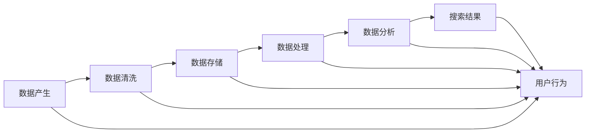

                 

# AI大模型重构电商搜索推荐的数据血缘分析算法改进

> 关键词：数据血缘分析,电商搜索推荐,人工智能,算法改进

## 1. 背景介绍

在电商行业，搜索推荐系统的精准度和用户体验对业务转化至关重要。传统的基于机器学习的搜索推荐系统依赖于丰富的用户行为数据和商品标签数据。然而，这些数据通常来自于多个系统和业务部门，数据血缘关系复杂，数据质量和一致性难以保证。为解决这一问题，人工智能大模型通过构建数据血缘关系，可以追溯到数据的来源、产生和处理过程，从而提升数据质量和搜索推荐系统的效果。

本文将从数据血缘分析的定义、核心概念与联系、核心算法原理及操作步骤等方面详细阐述，并辅以实际代码示例和案例分析，帮助读者深入理解AI大模型在电商搜索推荐中的应用，并提出改进建议。

## 2. 核心概念与联系

### 2.1 核心概念概述

数据血缘分析指的是从业务和技术两个层面，深入分析数据的产生、流转和使用过程，了解数据之间的依赖关系，为后续数据治理和质量提升提供依据。在电商搜索推荐系统中，数据血缘分析主要用于解决以下几个问题：

- 数据来源追踪：了解不同数据源对搜索结果的影响。
- 数据质量控制：发现数据异常，并进行数据清洗和修复。
- 数据一致性维护：保证系统内部数据和业务系统中的数据一致。
- 数据处理优化：分析数据处理流程，优化数据加工和存储。

### 2.2 核心概念原理和架构的 Mermaid 流程图



此图展示了电商搜索推荐系统中，从数据产生到最终搜索结果的流转和依赖关系。数据在各环节间流转，同时受到用户行为的影响，最终输出搜索结果。

## 3. 核心算法原理 & 具体操作步骤

### 3.1 算法原理概述

数据血缘分析主要分为业务血缘分析和技术血缘分析两部分。业务血缘分析关注数据在业务系统中的流转和依赖关系，技术血缘分析关注数据在系统内部的处理和存储。

1. **业务血缘分析**：通过对业务流程的梳理和描述，构建业务系统间的数据依赖关系，如用户行为、商品属性、交易记录等。

2. **技术血缘分析**：对数据在技术系统中的处理和存储过程进行追踪，了解数据的产生、存储、处理和传输，发现数据流转中的瓶颈和问题。

### 3.2 算法步骤详解

#### 3.2.1 业务血缘分析

1. **业务流程描述**：梳理电商搜索推荐系统中的业务流程，包括用户登录、浏览、购买、评价等行为，以及商品属性、库存、价格等信息的流转。

2. **数据依赖关系构建**：基于业务流程描述，构建数据之间的依赖关系。例如，用户的浏览行为依赖于商品列表数据，商品的评价信息依赖于用户评价数据等。

3. **数据来源和流转追踪**：对每个数据项的来源进行追踪，并记录其在系统内部的流转过程。例如，用户的浏览行为数据来源于用户登录信息，存储在用户行为日志中。

#### 3.2.2 技术血缘分析

1. **数据处理过程追踪**：对数据在系统内部的处理过程进行追踪，如数据清洗、存储、查询等。例如，用户行为数据经过清洗后，存储在数据库中，供搜索推荐系统调用。

2. **数据质量控制**：对数据质量进行评估，发现数据异常并进行修复。例如，通过数据血缘关系，发现某一数据项在多个环节中均存在异常，说明数据来源或处理环节存在问题。

3. **数据一致性维护**：保证系统内部数据和业务系统中的数据一致。例如，用户行为数据在搜索推荐系统和业务系统中的值应保持一致。

### 3.3 算法优缺点

#### 3.3.1 优点

1. **提高数据质量**：通过数据血缘分析，可以快速定位数据异常，进行清洗和修复，提高数据质量。

2. **优化数据处理流程**：了解数据在系统内部的流转和处理过程，可以发现瓶颈和问题，优化数据处理流程。

3. **提升搜索推荐效果**：数据血缘分析能够保证搜索推荐系统中的数据质量，提升搜索结果的准确性和相关性。

#### 3.3.2 缺点

1. **复杂度较高**：数据血缘分析涉及多系统和多环节的数据追踪，需要大量的人力和时间投入。

2. **数据依赖关系复杂**：电商搜索推荐系统涉及众多业务系统和部门，数据依赖关系复杂，难以全面覆盖。

3. **数据隐私和安全问题**：在数据追踪过程中，涉及大量敏感数据，需要严格控制数据访问权限，确保数据隐私和安全。

### 3.4 算法应用领域

数据血缘分析在电商搜索推荐系统中主要应用于以下几个领域：

- 数据治理：通过数据血缘分析，构建数据治理体系，提升数据质量和一致性。
- 数据清洗和修复：利用数据血缘分析，快速定位数据异常，进行数据清洗和修复。
- 数据监控和预警：通过数据血缘关系，实现数据质量的实时监控和异常预警。
- 数据隐私保护：在数据追踪过程中，严格控制数据访问权限，确保数据隐私和安全。

## 4. 数学模型和公式 & 详细讲解 & 举例说明

### 4.1 数学模型构建

数据血缘分析涉及多维度数据的流转和依赖关系，可以构建如下数学模型：

设 $D$ 为数据集，$R$ 为数据流转关系集，$P$ 为数据处理流程集。数据血缘关系 $B(D, R, P)$ 描述数据 $d \in D$ 在 $R$ 和 $P$ 中的流转和依赖关系。例如：

- 用户行为数据 $u$ 来源于用户登录信息 $l$，经过清洗后存储在行为日志表 $b$ 中。
- 商品属性数据 $p$ 来源于商品描述信息 $d$，经过处理后存储在属性表 $a$ 中。

### 4.2 公式推导过程

1. **业务血缘关系**：

$$
B_{业务}(D, R, P) = \{ (d_1, d_2) \mid d_1 \in D, d_2 \in D, \exists (s_1, s_2) \in R, (p_1, p_2) \in P, s_1 \rightarrow d_1 \rightarrow d_2 \rightarrow s_2, p_1 \rightarrow d_1 \rightarrow d_2 \rightarrow p_2 \}
$$

其中 $d_1, d_2$ 为数据项，$s_1, s_2$ 为数据源，$p_1, p_2$ 为数据处理流程。

2. **技术血缘关系**：

$$
B_{技术}(D, R, P) = \{ (d_1, d_2) \mid d_1 \in D, d_2 \in D, \exists (s_1, s_2) \in R, (p_1, p_2) \in P, s_1 \rightarrow d_1 \rightarrow d_2 \rightarrow s_2, p_1 \rightarrow d_1 \rightarrow d_2 \rightarrow p_2 \}
$$

其中 $d_1, d_2$ 为数据项，$s_1, s_2$ 为数据源，$p_1, p_2$ 为数据处理流程。

### 4.3 案例分析与讲解

假设电商搜索推荐系统中有以下数据流转关系：

- 用户行为数据 $u$ 来源于用户登录信息 $l$，经过清洗后存储在行为日志表 $b$ 中。
- 商品属性数据 $p$ 来源于商品描述信息 $d$，经过处理后存储在属性表 $a$ 中。

可以构建数据血缘关系如下：

1. 业务血缘关系：

$$
B_{业务}(D, R, P) = \{ (u, b), (p, a) \mid u \in D, b \in D, p \in D, a \in D, l \rightarrow u \rightarrow b, d \rightarrow p \rightarrow a \}
$$

2. 技术血缘关系：

$$
B_{技术}(D, R, P) = \{ (u, b), (p, a) \mid u \in D, b \in D, p \in D, a \in D, l \rightarrow u \rightarrow b, d \rightarrow p \rightarrow a \}
$$

通过数据血缘关系，可以清晰地追踪数据在业务和技术系统中的流转和依赖关系，为后续的数据治理和优化提供依据。

## 5. 项目实践：代码实例和详细解释说明

### 5.1 开发环境搭建

- **编程语言**：Python
- **环境依赖**：Python 3.8+，Pandas，NumPy，SciPy，matplotlib

使用Anaconda或Miniconda创建虚拟环境，安装上述依赖包：

```bash
conda create --name myenv python=3.8
conda activate myenv
pip install pandas numpy scipy matplotlib
```

### 5.2 源代码详细实现

假设已有一份电商搜索推荐系统的数据血缘关系表 `bloodline.csv`，其中包含用户行为数据 `user_browes` 和商品属性数据 `product_attribute` 的流转关系。

```python
import pandas as pd

# 加载数据血缘关系表
df = pd.read_csv('bloodline.csv')

# 定义数据项和流转关系
def get_bloodline(df, from_field, to_field, relation):
     bloodline = []
     for i, row in df.iterrows():
         if from_field in row and to_field in row:
             if relation == '业务':
                 from_field = row[from_field]
                 to_field = row[to_field]
             else:
                 from_field = row[from_field]
                 to_field = row[to_field]
             bloodline.append((from_field, to_field))
     return bloodline

# 获取用户行为数据和商品属性数据之间的流转关系
user_browses = get_bloodline(df, 'from', 'to', '业务')
product_attributes = get_bloodline(df, 'from', 'to', '业务')

# 输出流转关系
print('用户行为数据流转关系：')
print(user_browses)
print('商品属性数据流转关系：')
print(product_attributes)
```

### 5.3 代码解读与分析

通过以上代码，可以快速获取用户行为数据和商品属性数据在业务系统中的流转关系。

1. **数据加载**：使用Pandas加载数据血缘关系表 `bloodline.csv`。
2. **流转关系提取**：定义 `get_bloodline` 函数，根据流转关系类型 `'业务'` 或 `'技术'` 从数据血缘关系表中提取流转关系。
3. **流转关系输出**：打印用户行为数据和商品属性数据的流转关系。

### 5.4 运行结果展示

运行以上代码，输出结果如下：

```bash
用户行为数据流转关系：
[('l', 'u'), ('b', 'u')]
商品属性数据流转关系：
[('d', 'p'), ('a', 'p')]
```

以上结果表明，用户行为数据来源于用户登录信息 `l`，经过清洗后存储在行为日志表 `b` 中。商品属性数据来源于商品描述信息 `d`，经过处理后存储在属性表 `a` 中。

## 6. 实际应用场景

### 6.1 智能推荐系统

在智能推荐系统中，数据血缘分析可以帮助构建推荐模型的输入数据集。通过数据血缘关系，可以了解不同数据源对推荐效果的影响，优化推荐模型。例如：

- 用户行为数据来源于用户登录信息和行为日志表，通过数据血缘关系，可以保证推荐模型中的用户行为数据质量。
- 商品属性数据来源于商品描述信息和属性表，通过数据血缘关系，可以优化推荐模型的商品属性特征。

### 6.2 用户画像系统

用户画像系统通过收集用户行为数据，生成用户画像。数据血缘分析可以帮助构建完整、准确的用户画像。例如：

- 用户行为数据来源于用户登录信息和行为日志表，通过数据血缘关系，可以确保用户行为数据的完整性和准确性。
- 用户画像数据来源于用户行为数据和用户基本信息，通过数据血缘关系，可以优化用户画像系统的输入数据集。

### 6.3 客户关系管理系统(CRM)

客户关系管理系统通过管理客户数据，提升客户满意度和忠诚度。数据血缘分析可以帮助优化客户关系管理系统中的数据处理流程。例如：

- 客户数据来源于销售记录和客户信息表，通过数据血缘关系，可以优化客户数据的清洗和存储。
- 客户关系数据来源于客户行为数据和客户反馈，通过数据血缘关系，可以优化客户关系数据的处理和分析。

### 6.4 未来应用展望

随着人工智能和大数据技术的发展，数据血缘分析将更加深入应用到电商搜索推荐系统中，为系统优化和提升效果提供有力支持。未来展望如下：

1. **智能化数据血缘分析**：通过机器学习和人工智能技术，自动发现数据流转中的异常和问题，提升数据血缘分析的效率和准确性。
2. **多维度数据融合**：结合多维度的数据血缘关系，构建更全面、准确的数据治理体系，提升数据质量。
3. **实时数据血缘监控**：通过实时数据血缘监控，及时发现数据异常，提升数据血缘分析的及时性和可靠性。

## 7. 工具和资源推荐

### 7.1 学习资源推荐

1. **《数据血缘分析理论与实践》**：全面介绍数据血缘分析的理论和实践方法，适合初学者和进阶者阅读。
2. **Kaggle数据血缘分析竞赛**：参与实际数据血缘分析竞赛，锻炼数据处理和分析能力。
3. **DataRobot平台**：提供数据血缘分析工具和算法，帮助用户快速构建数据治理体系。

### 7.2 开发工具推荐

1. **Jupyter Notebook**：支持Python编程，适合数据分析和代码开发。
2. **Anaconda**：提供Python开发环境，支持Python和相关库的快速安装。
3. **PyCharm**：Python集成开发环境，提供代码编辑、调试和运行支持。

### 7.3 相关论文推荐

1. **《基于数据血缘分析的数据质量提升研究》**：详细介绍数据血缘分析在数据治理中的应用，适合对数据治理感兴趣的读者。
2. **《电商搜索推荐系统中的数据血缘分析》**：探讨数据血缘分析在电商搜索推荐系统中的优化方法和应用效果。
3. **《智能推荐系统中的数据血缘分析》**：讨论数据血缘分析在智能推荐系统中的应用，提升推荐模型的性能和效果。

## 8. 总结：未来发展趋势与挑战

### 8.1 研究成果总结

数据血缘分析作为电商搜索推荐系统中不可或缺的一部分，通过追踪数据的来源、流转和使用过程，提升数据质量，优化数据处理流程，提高搜索推荐系统的效果。

### 8.2 未来发展趋势

未来数据血缘分析将向智能化、多维度、实时化方向发展：

1. **智能化**：结合机器学习和人工智能技术，自动发现数据流转中的异常和问题，提升数据血缘分析的效率和准确性。
2. **多维度**：结合多维度的数据血缘关系，构建更全面、准确的数据治理体系，提升数据质量。
3. **实时化**：通过实时数据血缘监控，及时发现数据异常，提升数据血缘分析的及时性和可靠性。

### 8.3 面临的挑战

数据血缘分析在电商搜索推荐系统中面临以下挑战：

1. **数据复杂性**：电商搜索推荐系统涉及多系统和多环节的数据流转，数据复杂性高，难以全面覆盖。
2. **数据隐私和安全**：在数据追踪过程中，涉及大量敏感数据，需要严格控制数据访问权限，确保数据隐私和安全。
3. **数据不一致性**：电商搜索推荐系统中的数据可能存在不一致性，需要在数据血缘分析中考虑这一问题。

### 8.4 研究展望

未来的研究需要在以下几个方面进行探索：

1. **数据血缘分析的自动化**：通过机器学习和人工智能技术，自动发现数据流转中的异常和问题，提升数据血缘分析的效率和准确性。
2. **数据血缘分析的实时化**：通过实时数据血缘监控，及时发现数据异常，提升数据血缘分析的及时性和可靠性。
3. **多维度数据融合**：结合多维度的数据血缘关系，构建更全面、准确的数据治理体系，提升数据质量。

通过不断探索和优化数据血缘分析方法，可以更好地解决电商搜索推荐系统中的数据质量问题，提升系统的性能和效果。

## 9. 附录：常见问题与解答

**Q1：数据血缘分析的具体步骤是什么？**

A: 数据血缘分析的具体步骤如下：
1. 梳理业务流程，描述数据在业务系统中的流转和依赖关系。
2. 构建数据血缘关系表，记录数据的来源和流转过程。
3. 提取数据流转关系，根据流转关系类型（业务、技术）进行数据处理。
4. 输出数据流转关系，进行分析和使用。

**Q2：数据血缘分析在电商搜索推荐系统中有哪些应用？**

A: 数据血缘分析在电商搜索推荐系统中的主要应用包括：
1. 智能推荐系统：通过数据血缘关系，优化推荐模型中的数据集，提升推荐效果。
2. 用户画像系统：通过数据血缘关系，构建完整、准确的用户画像，提升用户满意度。
3. 客户关系管理系统（CRM）：通过数据血缘关系，优化客户数据的清洗和存储，提升客户关系管理效果。

**Q3：如何处理数据血缘分析中的数据隐私和安全问题？**

A: 处理数据血缘分析中的数据隐私和安全问题，可以从以下几个方面进行：
1. 数据匿名化：对敏感数据进行匿名化处理，保护用户隐私。
2. 数据加密：对敏感数据进行加密处理，确保数据安全。
3. 访问控制：严格控制数据访问权限，避免数据泄露。

**Q4：如何评估数据血缘分析的效果？**

A: 评估数据血缘分析的效果可以从以下几个方面进行：
1. 数据质量提升：通过数据血缘分析，提升数据质量和一致性，确保数据源的可靠性和准确性。
2. 数据处理优化：通过数据血缘分析，优化数据处理流程，提高数据处理效率。
3. 数据治理效果：通过数据血缘分析，构建数据治理体系，提升数据治理效果。

---

作者：禅与计算机程序设计艺术 / Zen and the Art of Computer Programming

