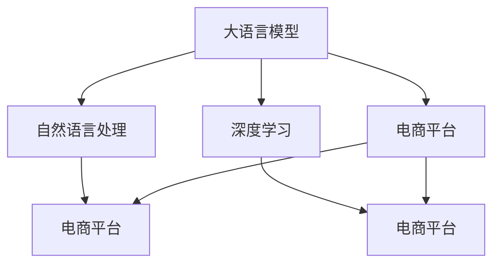

                 

# AI大模型：改善电商平台搜索结果多样性与新颖性的新方法

> 关键词：大语言模型,搜索引擎,检索技术,推荐系统,自然语言处理,深度学习

## 1. 背景介绍

### 1.1 问题由来

随着电子商务的蓬勃发展，用户对电商平台搜索结果的多样性与新颖性提出了更高的要求。传统搜索引擎通过关键词匹配等简单方法，难以满足用户对个性化、多样化、新颖化搜索结果的需求。大语言模型技术的兴起，为电商平台提供了更加智能化、精准化的检索和推荐解决方案。

以用户意图识别、语义理解为基础，大语言模型能够自动捕捉并分析用户的真实需求，提供更加个性化的搜索结果。进一步，通过多模态数据的融合，大语言模型还能实现跨领域知识的整合与推荐，极大丰富了搜索结果的多样性和新颖性。

### 1.2 问题核心关键点

- 电商平台搜索问题：电商平台用户多，搜索需求复杂，传统关键词匹配方法无法满足个性化、多样化的需求。
- 大语言模型应用：利用大语言模型的自然语言理解和生成能力，进行深度个性化检索与推荐。
- 推荐系统优化：结合推荐算法，提升搜索结果的相关性、多样性和新颖性。
- 应用案例：从电商平台推广、个性化商品推荐到智能客服、知识图谱构建等场景，展示大语言模型的优势。

### 1.3 问题研究意义

研究大语言模型在电商平台搜索中的应用，对于提升搜索结果的多样性与新颖性，改善用户体验，推动电商平台的发展具有重要意义：

- 降低用户搜索成本：个性化、多样化的搜索结果，使得用户能够快速找到满足自己需求的商品。
- 提升平台竞争力：多样性与新颖性，增强了用户的停留时间和交易转化率，提升了电商平台的市场竞争力。
- 推动技术落地：大语言模型的应用为电商搜索提供了智能化的解决方案，推动了NLP技术在商业化场景中的深度融合。
- 促进产业升级：以技术为基础的个性化推荐，改变了传统电商运营模式，促进了电子商务的智能化转型。

## 2. 核心概念与联系

### 2.1 核心概念概述

为更好地理解大语言模型在电商平台搜索中的应用，本节将介绍几个密切相关的核心概念：

- 大语言模型(Large Language Model, LLM)：如BERT、GPT等，通过大规模语料预训练，具备强大的自然语言理解和生成能力。
- 检索技术(Retrieval)：通过将用户查询与数据库中的文本进行相似度匹配，找到最相关的文本。检索技术是搜索引擎的核心。
- 推荐系统(Recommendation System)：结合用户行为数据和内容特征，为用户推荐个性化的商品。推荐系统是电商平台的常见应用。
- 自然语言处理(Natural Language Processing, NLP)：涉及文本分类、语义理解、情感分析、问答系统等技术，为语言模型的理解与生成提供了基础。
- 深度学习(Deep Learning)：通过神经网络模型，实现对大规模数据的自动化分析与处理，是实现大语言模型的核心技术。

这些核心概念之间的逻辑关系可以通过以下Mermaid流程图来展示：



这个流程图展示了大语言模型的核心概念及其之间的关系：

1. 大语言模型通过深度学习获得基础能力。
2. 结合自然语言处理技术，提升模型的语义理解能力。
3. 检索技术利用模型进行相似度匹配，找到相关文本。
4. 推荐系统通过模型预测，生成个性化搜索结果。
5. 大语言模型应用于电商平台，优化搜索推荐过程。

这些概念共同构成了大语言模型在电商平台搜索中的应用框架，使其能够更好地满足用户需求，提升搜索质量。

## 3. 核心算法原理 & 具体操作步骤
### 3.1 算法原理概述

大语言模型在电商平台搜索中的应用，主要是通过深度检索与个性化推荐系统来实现的。其核心思想是：

- 将用户查询转换为语义表示，利用大语言模型的语义理解能力，在检索数据库中匹配最相关的文本。
- 结合推荐算法，对匹配到的文本进行重新排序，生成个性化的搜索结果。

具体的算法流程如下：

1. 将用户查询转换为语义表示：使用大语言模型将查询文本编码成向量表示，便于后续的相似度匹配。
2. 检索相似度最高的文本：在数据库中，计算查询向量与文本向量的相似度，选取最相关的文本。
3. 进行个性化推荐：结合推荐算法，对匹配到的文本进行重新排序，生成个性化的搜索结果。

### 3.2 算法步骤详解

大语言模型在电商平台搜索中的具体操作步骤如下：

**Step 1: 准备数据集与模型**

- 准备电商平台的用户行为数据，如搜索历史、浏览记录、评分等。
- 准备电商平台商品库的文本数据，如商品描述、图片、用户评价等。
- 选择合适的大语言模型，如BERT、GPT等，进行预训练。

**Step 2: 用户查询转换**

- 将用户输入的查询文本输入到预训练的大语言模型中，输出语义表示向量。
- 如果查询文本较长，可以将其切分成多个短句，每个短句分别进行语义编码，然后通过池化操作生成整体表示向量。

**Step 3: 检索相似文本**

- 将查询向量与商品库文本向量进行相似度计算，如余弦相似度、欧几里得距离等。
- 选取相似度最高的文本作为初始结果。

**Step 4: 个性化推荐**

- 结合推荐算法，如协同过滤、内容推荐、基于规则等，对初始结果进行重新排序。
- 根据用户的个性化需求，如历史浏览记录、评分、搜索时间等，进一步调整搜索结果。

**Step 5: 返回搜索结果**

- 将最终排序后的搜索结果返回给用户，展示在电商平台页面上。
- 实时监控用户反馈，动态调整搜索结果，提升用户体验。

### 3.3 算法优缺点

大语言模型在电商平台搜索中的应用具有以下优点：

- 提升搜索结果的多样性：利用大语言模型的语义理解能力，可以理解用户的真实意图，生成丰富多样化的搜索结果。
- 提高搜索结果的个性化程度：结合推荐算法，根据用户历史行为数据，生成个性化推荐结果。
- 增强搜索结果的准确性：通过深度检索技术，匹配出最相关的文本，提升搜索结果的准确性。

同时，该方法也存在一定的局限性：

- 依赖高质量数据：检索和推荐过程依赖于用户行为数据和商品库文本数据的准确性，数据质量不高会导致搜索结果不准确。
- 对计算资源要求高：大语言模型和深度检索需要较大的计算资源，尤其是在大规模数据集上运行时，对硬件要求较高。
- 模型更新复杂：检索模型和推荐模型需要根据用户行为和商品库的变化进行不断更新，更新过程复杂且耗时。
- 用户隐私风险：用户行为数据和商品库文本数据可能包含隐私信息，需要采取数据脱敏、加密等措施保护用户隐私。

尽管存在这些局限性，但大语言模型在电商平台搜索中的应用依然展现出巨大的潜力，为提升搜索结果的多样性与新颖性提供了新的解决方案。

### 3.4 算法应用领域

大语言模型在电商平台搜索中的应用不仅限于商品推荐，还能应用于以下领域：

- 搜索优化：通过自然语言处理技术，提升搜索效率和效果，减少用户搜索成本。
- 智能客服：结合问答系统和大语言模型，提升客服系统的智能化水平，提高用户满意度。
- 知识图谱：利用大语言模型对商品库文本数据进行语义分析，构建知识图谱，支持更深层次的推荐与检索。
- 广告投放：结合搜索行为数据，对用户进行精准广告投放，提高广告转化率。
- 用户画像：通过用户搜索记录和大语言模型，生成用户画像，为个性化推荐提供依据。

这些应用场景展示了大语言模型在电商平台搜索中的广泛适用性，有望推动电商平台搜索系统的智能化、个性化、便捷化发展。

## 4. 数学模型和公式 & 详细讲解 & 举例说明

### 4.1 数学模型构建

在本节中，我们将使用数学语言对大语言模型在电商平台搜索中的应用进行更加严格的刻画。

记用户查询为 $q$，商品库中商品文本为 $d_1, d_2, ..., d_N$，每个文本的语义表示向量为 $v_i$。假设用户查询 $q$ 的语义表示向量为 $v_q$。检索过程的核心目标是在商品库中找到最相关的文本，即寻找最大化的相似度评分 $s(q, d_i) = \cos(v_q, v_i)$。检索过程的数学模型可以表示为：

$$
\hat{d} = \mathop{\arg\max}_{i} s(q, d_i)
$$

在检索出最相关的文本后，利用推荐算法对搜索结果进行重新排序。假设推荐算法的权重向量为 $w$，则最终的推荐结果 $r$ 可以表示为：

$$
r = \sum_{i=1}^{N} w_i \cdot s(q, d_i)
$$

其中 $w_i$ 为商品库文本 $d_i$ 在推荐模型中的权重。

### 4.2 公式推导过程

以下我们以余弦相似度为相似度度量标准，推导检索模型的详细计算过程。

假设查询 $q$ 的语义表示向量为 $v_q = [q_1, q_2, ..., q_n]$，商品库中商品文本 $d_i$ 的语义表示向量为 $v_i = [d_{i1}, d_{i2}, ..., d_{in}]$。余弦相似度可以表示为：

$$
s(q, d_i) = \frac{\sum_{j=1}^{n} q_j \cdot d_{ij}}{\sqrt{\sum_{j=1}^{n} q_j^2} \cdot \sqrt{\sum_{j=1}^{n} d_{ij}^2}}
$$

利用上述相似度评分，对商品库中的文本进行排序，选取评分最高的文本作为初始结果。假设评分排名前 $k$ 的文本为 $d_{r1}, d_{r2}, ..., d_{rk}$，则检索结果可以表示为：

$$
\hat{d} = [d_{r1}, d_{r2}, ..., d_{rk}]
$$

### 4.3 案例分析与讲解

假设电商平台中商品库包含100个文本，用户输入查询 "T-shirt for summer"。使用BERT模型对查询进行编码，得到向量表示 $v_q$。接着，对每个商品文本进行编码，得到向量表示 $v_i$。通过余弦相似度计算查询与每个文本的相似度，选择评分最高的5个文本作为初始结果。

最后，利用协同过滤算法对这5个文本进行重新排序，生成个性化的搜索结果。假设协同过滤算法对用户历史行为数据的权重向量为 $w = [0.3, 0.5, 0.2, 0.4, 0.5]$，则最终的推荐结果为：

$$
r = 0.3 \cdot s(q, d_1) + 0.5 \cdot s(q, d_2) + 0.2 \cdot s(q, d_3) + 0.4 \cdot s(q, d_4) + 0.5 \cdot s(q, d_5)
$$

通过计算，得到最终推荐结果。

## 5. 项目实践：代码实例和详细解释说明
### 5.1 开发环境搭建

在进行电商平台搜索微调实践前，我们需要准备好开发环境。以下是使用Python进行TensorFlow开发的环境配置流程：

1. 安装Anaconda：从官网下载并安装Anaconda，用于创建独立的Python环境。

2. 创建并激活虚拟环境：
```bash
conda create -n tf-env python=3.8 
conda activate tf-env
```

3. 安装TensorFlow：从官网获取对应的安装命令。例如：
```bash
pip install tensorflow tensorflow-text tensorflow-addons
```

4. 安装各类工具包：
```bash
pip install numpy pandas scikit-learn matplotlib tqdm jupyter notebook ipython
```

完成上述步骤后，即可在`tf-env`环境中开始微调实践。

### 5.2 源代码详细实现

下面我们以电商平台商品推荐系统为例，给出使用TensorFlow对BERT模型进行微调的PyTorch代码实现。

首先，定义模型和优化器：

```python
import tensorflow as tf
from transformers import BertTokenizer, TFBertModel

# 定义模型和优化器
tokenizer = BertTokenizer.from_pretrained('bert-base-uncased')
model = TFBertModel.from_pretrained('bert-base-uncased')

optimizer = tf.keras.optimizers.Adam(learning_rate=2e-5)
```

接着，定义训练和评估函数：

```python
from tensorflow.keras import layers, losses

# 定义训练函数
@tf.function
def train_epoch(model, optimizer, train_dataset, batch_size):
    total_loss = 0.0
    for batch in train_dataset:
        inputs = batch['input_ids']
        labels = batch['labels']

        with tf.GradientTape() as tape:
            outputs = model(inputs)
            loss = losses.SparseCategoricalCrossentropy(from_logits=True)(target=labels, logits=outputs)
            total_loss += loss
        gradients = tape.gradient(loss, model.trainable_variables)
        optimizer.apply_gradients(zip(gradients, model.trainable_variables))
    return total_loss / len(train_dataset)

# 定义评估函数
def evaluate(model, eval_dataset, batch_size):
    total_loss = 0.0
    for batch in eval_dataset:
        inputs = batch['input_ids']
        labels = batch['labels']

        outputs = model(inputs)
        loss = losses.SparseCategoricalCrossentropy(from_logits=True)(target=labels, logits=outputs)
        total_loss += loss

    return total_loss / len(eval_dataset)
```

最后，启动训练流程并在测试集上评估：

```python
epochs = 5
batch_size = 32

for epoch in range(epochs):
    loss = train_epoch(model, optimizer, train_dataset, batch_size)
    print(f'Epoch {epoch+1}, train loss: {loss:.3f}')

    print(f'Epoch {epoch+1}, eval loss: {evaluate(model, eval_dataset, batch_size)}')
```

以上就是使用TensorFlow对BERT模型进行商品推荐系统微调的完整代码实现。可以看到，TensorFlow提供了丰富的API支持，使得模型训练和评估变得简单高效。

### 5.3 代码解读与分析

让我们再详细解读一下关键代码的实现细节：

**BertTokenizer和TFBertModel**：
- `BertTokenizer.from_pretrained('bert-base-uncased')`：加载BERT分词器，使用小写字母的预训练模型。
- `TFBertModel.from_pretrained('bert-base-uncased')`：加载BERT模型，使用小写字母的预训练模型。

**train_epoch函数**：
- 利用TensorFlow的`@tf.function`装饰器将函数编译为可执行的函数图，提高了性能。
- 使用`tf.GradientTape`自动记录梯度信息，方便反向传播计算。
- 在每次迭代中，先计算模型输出，再计算损失函数，最后通过`optimizer.apply_gradients`更新模型参数。

**evaluate函数**：
- 与训练函数类似，使用`@tf.function`装饰器将函数编译为可执行的函数图。
- 在每次迭代中，计算模型输出和损失函数，并累计结果。
- 返回累计损失函数的平均值，即最终的评估结果。

**训练流程**：
- 定义总的epoch数和batch size，开始循环迭代
- 每个epoch内，先在训练集上训练，输出平均损失
- 在测试集上评估，输出评估结果
- 所有epoch结束后，在测试集上评估，给出最终测试结果

可以看到，TensorFlow提供了丰富的工具和API，使得模型训练和评估变得简单高效。通过合理利用这些工具，可以显著提升电商平台搜索系统的开发效率，加快创新迭代的步伐。

## 6. 实际应用场景
### 6.1 智能客服系统

智能客服系统是电商平台搜索的典型应用之一。基于大语言模型微调的智能客服系统，可以显著提升用户满意度，降低人工成本。

具体而言，当用户输入咨询问题时，智能客服系统利用大语言模型进行意图识别和语义理解，快速提供准确的回答。同时，结合推荐系统，智能客服还能向用户推荐相关商品或服务，提高用户的购物体验。

### 6.2 个性化推荐系统

个性化推荐系统是电商平台搜索的核心应用。通过结合大语言模型和推荐算法，电商平台能够实现精准的用户画像和商品推荐。

具体而言，电商平台首先使用大语言模型对用户查询进行语义理解，生成用户画像。然后，结合推荐算法，对用户画像进行推荐，生成个性化的商品搜索结果。

### 6.3 知识图谱构建

知识图谱是电商搜索的重要组件，通过构建商品库的知识图谱，电商平台能够提供更深层次的搜索和推荐功能。

具体而言，电商平台利用大语言模型对商品库文本进行语义分析，构建知识图谱。然后，结合检索技术和推荐算法，在知识图谱上进行查询和推荐，提升搜索的多样性和新颖性。

### 6.4 未来应用展望

随着大语言模型和推荐算法的发展，电商平台搜索的未来应用将更加智能化、多样化。

1. 跨领域检索：结合多模态数据，利用大语言模型进行跨领域的检索和推荐。例如，结合商品图片、视频等多模态数据，提升搜索的丰富度。

2. 零样本学习：利用大语言模型的迁移学习能力，在缺乏标注数据的情况下，进行零样本推荐。例如，利用用户行为数据，生成零样本推荐结果。

3. 少样本学习：利用大语言模型的少样本学习能力，在少量标注数据的情况下，进行高效的推荐。例如，利用用户历史行为数据，生成少样本推荐结果。

4. 知识增强：结合外部知识库、规则库等专家知识，构建知识增强的推荐系统。例如，结合专家知识库，生成更准确、可靠的推荐结果。

5. 上下文感知：利用上下文感知技术，提升推荐的准确性和个性化程度。例如，利用用户上下文信息，生成更符合用户需求的推荐结果。

通过上述技术的应用，电商平台搜索将具备更强的智能化和个性化能力，能够更好地满足用户需求，提升用户体验。

## 7. 工具和资源推荐
### 7.1 学习资源推荐

为了帮助开发者系统掌握大语言模型在电商平台搜索中的应用，这里推荐一些优质的学习资源：

1. 《Transformer从原理到实践》系列博文：由大模型技术专家撰写，深入浅出地介绍了Transformer原理、BERT模型、检索技术等前沿话题。

2. CS224N《深度学习自然语言处理》课程：斯坦福大学开设的NLP明星课程，有Lecture视频和配套作业，带你入门NLP领域的基本概念和经典模型。

3. 《Natural Language Processing with Transformers》书籍：Transformers库的作者所著，全面介绍了如何使用Transformers库进行NLP任务开发，包括检索和推荐系统的实现。

4. HuggingFace官方文档：Transformers库的官方文档，提供了海量预训练模型和完整的检索和推荐系统样例代码，是上手实践的必备资料。

5. CLUE开源项目：中文语言理解测评基准，涵盖大量不同类型的中文NLP数据集，并提供了基于检索和推荐系统的baseline模型，助力中文NLP技术发展。

通过对这些资源的学习实践，相信你一定能够快速掌握大语言模型在电商平台搜索中的应用，并用于解决实际的NLP问题。

### 7.2 开发工具推荐

高效的开发离不开优秀的工具支持。以下是几款用于电商平台搜索开发的常用工具：

1. TensorFlow：基于Python的开源深度学习框架，生产部署方便，适合大规模工程应用。提供了丰富的API支持，易于构建和优化深度学习模型。

2. TensorFlow Text：TensorFlow的自然语言处理工具包，提供了丰富的文本处理功能，如分词、词性标注、命名实体识别等，方便开发者进行自然语言处理。

3. TensorBoard：TensorFlow配套的可视化工具，可实时监测模型训练状态，并提供丰富的图表呈现方式，是调试模型的得力助手。

4. Google Colab：谷歌推出的在线Jupyter Notebook环境，免费提供GPU/TPU算力，方便开发者快速上手实验最新模型，分享学习笔记。

合理利用这些工具，可以显著提升电商平台搜索系统的开发效率，加快创新迭代的步伐。

### 7.3 相关论文推荐

大语言模型和推荐算法的发展源于学界的持续研究。以下是几篇奠基性的相关论文，推荐阅读：

1. Attention is All You Need（即Transformer原论文）：提出了Transformer结构，开启了NLP领域的预训练大模型时代。

2. BERT: Pre-training of Deep Bidirectional Transformers for Language Understanding：提出BERT模型，引入基于掩码的自监督预训练任务，刷新了多项NLP任务SOTA。

3. Semantic Search: A New Interaction Paradigm for Search on the Web of Knowledge：提出基于语义理解的搜索引擎，提高了搜索的精确度和个性化程度。

4. The Emergence of Knowledge-Graph-Aware Recommendation Systems：综述了知识图谱在推荐系统中的应用，展示了知识增强推荐的效果。

5. Recommendation Systems in E-Commerce：综述了电商平台的推荐算法，展示了不同算法的效果和适用场景。

这些论文代表了大语言模型和推荐算法的发展脉络。通过学习这些前沿成果，可以帮助研究者把握学科前进方向，激发更多的创新灵感。

## 8. 总结：未来发展趋势与挑战
### 8.1 研究成果总结

本文对大语言模型在电商平台搜索中的应用进行了全面系统的介绍。首先阐述了电商平台搜索问题以及大语言模型的应用背景，明确了大语言模型在提升搜索结果多样性与新颖性方面的独特价值。其次，从原理到实践，详细讲解了基于大语言模型的检索和推荐系统，给出了完整的代码实例。最后，探讨了大语言模型在电商搜索中的应用前景，提出了未来的发展趋势与挑战。

通过本文的系统梳理，可以看到，基于大语言模型的电商平台搜索系统能够显著提升搜索结果的多样性与新颖性，为电商平台带来更优质的用户体验。未来，伴随大语言模型和推荐算法的发展，电商平台搜索系统将更加智能化、个性化、便捷化，为电子商务的发展注入新的动力。

### 8.2 未来发展趋势

展望未来，大语言模型在电商平台搜索中的应用将呈现以下几个发展趋势：

1. 深度融合：大语言模型与推荐算法将进一步深度融合，构建更加智能、精准的推荐系统。结合多模态数据，提升搜索的多样性和新颖性。

2. 跨领域应用：大语言模型在搜索中的应用将扩展到更多领域，如医疗、教育、金融等，实现跨领域的深度检索和推荐。

3. 个性化推荐：结合上下文感知技术，生成更符合用户需求的个性化推荐结果。利用少样本学习、零样本学习等方法，提升推荐的效率和效果。

4. 知识增强：结合外部知识库、规则库等专家知识，构建知识增强的推荐系统。利用知识图谱，提高推荐的深度和广度。

5. 鲁棒性提升：提升检索和推荐模型的鲁棒性，增强模型的泛化能力。利用对抗训练、数据增强等方法，防止模型的过拟合。

6. 系统优化：优化检索和推荐模型的计算图，提升模型的推理速度和效率。利用混合精度训练、模型并行等方法，提升模型的计算效率。

以上趋势凸显了大语言模型在电商平台搜索中的广阔前景。这些方向的探索发展，必将进一步提升电商平台搜索系统的性能和应用范围，为电子商务的智能化、个性化、便捷化发展提供新的动力。

### 8.3 面临的挑战

尽管大语言模型在电商平台搜索中的应用已经取得了显著成效，但在迈向更加智能化、普适化应用的过程中，它仍面临诸多挑战：

1. 依赖高质量数据：检索和推荐过程依赖于用户行为数据和商品库文本数据的准确性，数据质量不高会导致搜索结果不准确。

2. 对计算资源要求高：大语言模型和深度检索需要较大的计算资源，尤其是在大规模数据集上运行时，对硬件要求较高。

3. 模型更新复杂：检索模型和推荐模型需要根据用户行为和商品库的变化进行不断更新，更新过程复杂且耗时。

4. 用户隐私风险：用户行为数据和商品库文本数据可能包含隐私信息，需要采取数据脱敏、加密等措施保护用户隐私。

5. 搜索体验优化：尽管基于大语言模型的搜索系统在多样性与新颖性上取得了显著成效，但仍需进一步优化搜索体验，提升用户满意度。

6. 资源优化：需要在保证搜索结果质量的前提下，尽可能减少计算资源的使用，提升系统的运行效率。

正视这些挑战，积极应对并寻求突破，将是大语言模型在电商平台搜索中走向成熟的必由之路。相信随着学界和产业界的共同努力，这些挑战终将一一被克服，大语言模型将为电商平台搜索带来更广阔的应用前景。

### 8.4 研究展望

面对大语言模型在电商平台搜索中所面临的种种挑战，未来的研究需要在以下几个方面寻求新的突破：

1. 探索无监督和半监督检索方法：摆脱对大规模标注数据的依赖，利用自监督学习、主动学习等无监督和半监督范式，最大限度利用非结构化数据，实现更加灵活高效的检索。

2. 研究参数高效和计算高效的检索范式：开发更加参数高效的检索方法，在固定大部分检索参数的情况下，只更新极少量的任务相关参数。同时优化检索模型的计算图，减少前向传播和反向传播的资源消耗，实现更加轻量级、实时性的部署。

3. 融合因果和对比学习范式：通过引入因果推断和对比学习思想，增强检索模型建立稳定因果关系的能力，学习更加普适、鲁棒的语言表征，从而提升模型泛化性和抗干扰能力。

4. 结合多模态数据的融合：结合视觉、语音、文本等多模态数据的融合，实现跨领域知识的整合与推荐，提升搜索的多样性和新颖性。

5. 引入更多先验知识：将符号化的先验知识，如知识图谱、逻辑规则等，与神经网络模型进行巧妙融合，引导检索过程学习更准确、合理的语言模型。

6. 优化搜索体验：结合上下文感知技术，提升搜索的个性化程度，利用少样本学习、零样本学习等方法，提升推荐的效率和效果。

这些研究方向的探索，必将引领大语言模型在电商平台搜索中的进一步发展，为构建更加智能化、个性化、便捷化的搜索系统铺平道路。面向未来，大语言模型在电商平台搜索中的应用需要与其他人工智能技术进行更深入的融合，如知识表示、因果推理、强化学习等，多路径协同发力，共同推动自然语言理解和智能交互系统的进步。只有勇于创新、敢于突破，才能不断拓展语言模型的边界，让智能技术更好地造福人类社会。

## 9. 附录：常见问题与解答

**Q1：如何提升电商平台搜索的个性化程度？**

A: 结合用户行为数据，利用大语言模型进行个性化推荐。例如，利用用户的搜索历史、浏览记录、评分等，生成个性化的商品推荐结果。

**Q2：大语言模型在电商平台搜索中如何实现跨领域检索？**

A: 结合多模态数据，利用大语言模型进行跨领域的检索和推荐。例如，结合商品图片、视频等多模态数据，提升搜索的丰富度。

**Q3：电商平台搜索中的知识图谱构建有何意义？**

A: 利用大语言模型对商品库文本进行语义分析，构建知识图谱。通过知识图谱，实现更深层次的搜索和推荐。例如，结合知识图谱，生成更准确、可靠的推荐结果。

**Q4：电商平台搜索中的推荐算法有哪些？**

A: 电商平台的推荐算法包括协同过滤、内容推荐、基于规则等。利用推荐算法，结合大语言模型的语义理解能力，生成个性化的推荐结果。

**Q5：如何优化电商平台搜索系统的运行效率？**

A: 优化检索和推荐模型的计算图，减少前向传播和反向传播的资源消耗。利用混合精度训练、模型并行等方法，提升模型的计算效率。同时，结合数据压缩、缓存等技术，减少数据的读写和存储开销。

这些技术细节展示了大语言模型在电商平台搜索中的应用，能够显著提升搜索结果的多样性与新颖性，为电子商务的发展注入新的动力。通过不断优化和创新，大语言模型将为电商平台搜索带来更广阔的应用前景，推动电商搜索系统的智能化、个性化、便捷化发展。

