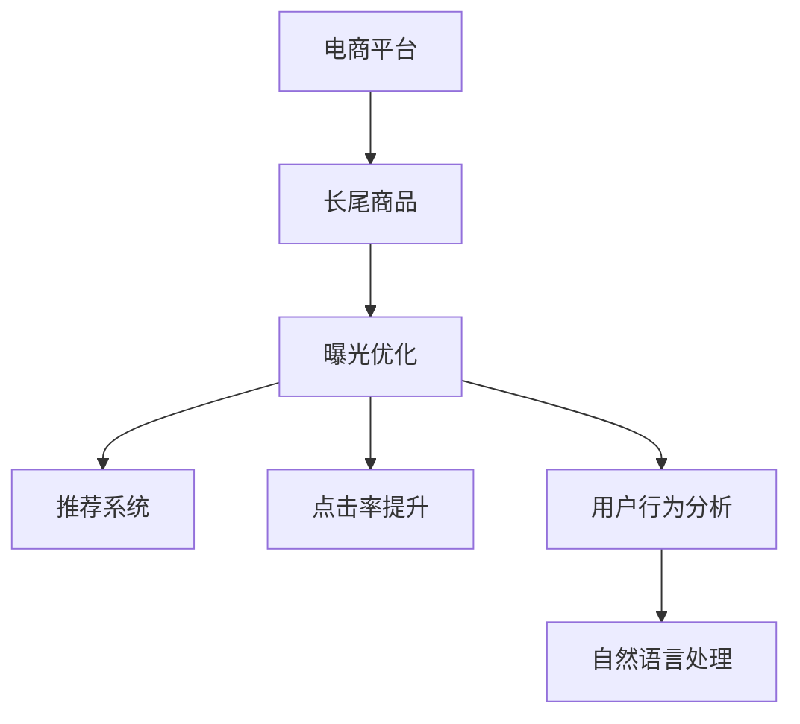

                 

# AI如何优化电商平台的长尾商品曝光

> 关键词：电商平台,长尾商品,曝光优化,人工智能,推荐系统,点击率提升,用户行为分析,自然语言处理

## 1. 背景介绍

### 1.1 问题由来

在电商平台的运营中，长尾商品（Long-Tail Products）是一个难以忽视的现象。长尾商品指的是那些相对少见的商品，尽管其销量不高，但由于电商平台拥有海量的SKU（Stock Keeping Unit），这些商品的总体市场潜力不可小觑。

长尾商品面临的挑战在于其曝光量不足，用户很难在众多商品中找到它们。这对商家而言，不仅影响了商品销售，还造成了库存积压和资金占用。因此，电商平台需要通过各种手段提升长尾商品的曝光率，提高点击率和转化率，最终实现增加销售额的目标。

### 1.2 问题核心关键点

提升长尾商品曝光的关键在于：
- 发现并定义哪些商品是长尾商品，并进行精细化的标签。
- 根据用户行为和购买历史，对长尾商品进行智能推荐，提高用户发现长尾商品的概率。
- 使用AI技术对商品标题、描述等文本数据进行分析和优化，提高长尾商品在搜索引擎中的排名。
- 分析用户评论和反馈，及时发现长尾商品的潜在问题，进行相应的调整和优化。

### 1.3 问题研究意义

在电商平台上，通过优化长尾商品的曝光，可以带来以下几方面的好处：
- 提高销售额：长尾商品的销售量虽然不高，但整体数量众多，通过有效的曝光优化，可以显著提升整体销售额。
- 提升用户满意度：通过智能推荐系统，用户能够更容易找到他们感兴趣的商品，提高购物体验。
- 减少库存积压：通过优化曝光率，减少因曝光不足而导致的商品滞销，降低库存积压风险。
- 拓展市场机会：长尾商品往往代表了一些细分市场的需求，通过优化曝光率，可以拓展更多市场机会。

## 2. 核心概念与联系

### 2.1 核心概念概述

本节将介绍几个密切相关的核心概念：

- 电商平台（E-commerce Platform）：指通过互联网提供商品展示、交易等服务的平台，包括B2C、B2B等多种形式。
- 长尾商品（Long-Tail Products）：指那些虽然销量不高，但总体市场潜力较大的商品。
- 曝光优化（Exposure Optimization）：通过优化商品的展示方式，提高用户发现长尾商品的概率。
- 推荐系统（Recommendation System）：根据用户历史行为和偏好，向用户推荐商品的系统。
- 点击率（Click-Through Rate, CTR）：用户点击商品展示链接的比率。
- 转化率（Conversion Rate）：用户点击商品展示链接后实际购买商品的比率。
- 用户行为分析（User Behavior Analysis）：通过分析用户的行为数据，了解用户偏好和需求。
- 自然语言处理（Natural Language Processing, NLP）：用于处理、理解和生成自然语言的技术。

这些概念之间的逻辑关系可以通过以下Mermaid流程图来展示：



这个流程图展示了这个问题的核心概念及其之间的关系：

1. 电商平台通过长尾商品提升整体销售额。
2. 曝光优化技术提升长尾商品的展示效果。
3. 推荐系统通过用户行为分析，提高长尾商品的点击率和转化率。
4. 自然语言处理技术用于商品标题和描述的优化。

这些概念共同构成了电商平台长尾商品曝光优化的框架，使得长尾商品的优化变得更加精准和高效。

## 3. 核心算法原理 & 具体操作步骤
### 3.1 算法原理概述

电商平台长尾商品曝光优化，本质上是一个基于用户行为和商品特征的优化问题。其核心思想是：通过分析用户的历史行为数据，发现用户的偏好和需求，结合商品自身的特征，优化长尾商品的展示方式，从而提高用户发现长尾商品的概率。

形式化地，假设电商平台有 $N$ 个商品 $S=\{s_i\}_{i=1}^N$，每个商品 $s_i$ 有 $d$ 个特征 $X=\{x_{ij}\}_{j=1}^d$，且每个商品被 $M$ 个用户 $U=\{u_k\}_{k=1}^M$ 浏览过。电商平台希望通过优化展示，提高长尾商品在用户浏览页中的展示频率。

### 3.2 算法步骤详解

电商平台长尾商品曝光优化一般包括以下几个关键步骤：

**Step 1: 数据收集与预处理**
- 收集电商平台的历史数据，包括用户浏览记录、点击记录、购买记录等。
- 对数据进行预处理，清洗无效数据，标准化数据格式。
- 对用户和商品进行特征工程，提取重要的特征向量。

**Step 2: 用户行为建模**
- 使用协同过滤、内容推荐等算法，构建用户兴趣模型。
- 使用聚类算法对用户进行分组，识别出具有相似偏好的用户群体。
- 使用深度学习模型对用户行为进行建模，捕捉用户潜在的兴趣变化。

**Step 3: 商品特征建模**
- 提取商品的显式特征（如价格、销量、评价等）和隐式特征（如用户反馈、描述文本等）。
- 使用词嵌入、TF-IDF等技术对文本数据进行处理，提取商品的语义特征。
- 使用深度学习模型对商品特征进行建模，捕捉商品的多维度特征。

**Step 4: 曝光优化算法设计**
- 设计基于深度学习的优化算法，如深度强化学习、对抗性优化等。
- 设计特征选择算法，确定哪些特征对曝光优化最为重要。
- 设计展示位置优化算法，确定在哪些位置展示长尾商品。

**Step 5: 模型训练与评估**
- 使用训练数据训练优化模型，优化商品展示方式。
- 使用验证数据评估模型效果，调整模型参数。
- 在实际平台上测试模型效果，持续优化。

### 3.3 算法优缺点

基于深度学习的电商平台长尾商品曝光优化方法具有以下优点：
1. 模型高效。使用深度学习模型可以快速分析大规模数据，并自动学习优化策略。
2. 效果显著。通过优化商品展示，能够显著提升长尾商品的曝光率和销售额。
3. 动态调整。深度学习模型能够实时响应用户行为的变化，进行动态优化。
4. 可扩展性强。适用于大规模电商平台，能够处理海量数据和商品。

同时，该方法也存在一定的局限性：
1. 数据依赖。模型效果高度依赖于数据质量，数据不足或标注错误可能导致效果不佳。
2. 模型复杂。深度学习模型较为复杂，训练和优化难度较大，需要较强的技术积累。
3. 冷启动问题。对于新用户和新商品，缺乏足够的历史数据，难以进行有效推荐和曝光。
4. 解释性不足。深度学习模型通常具有黑盒性质，难以解释其内部决策过程。

尽管存在这些局限性，但就目前而言，基于深度学习的曝光优化方法是电商领域的主流方案，可以显著提升长尾商品的曝光效果，带来良好的商业收益。

### 3.4 算法应用领域

基于深度学习的电商平台长尾商品曝光优化方法，在电商领域已经得到了广泛的应用，覆盖了商品推荐、广告投放、价格优化等多个环节，具体包括：

- 商品推荐系统：根据用户历史行为和商品特征，智能推荐长尾商品，提高点击率和转化率。
- 广告投放系统：优化广告位展示，提高广告点击率和ROI。
- 价格优化系统：通过用户行为和商品特征，动态调整商品价格，提高销售额。
- 库存管理：优化库存展示位置，减少库存积压和缺货风险。
- 用户个性化推荐：根据用户个性化需求，推荐长尾商品，提高用户满意度和忠诚度。

除了上述这些经典应用外，长尾商品曝光优化技术还被创新性地应用到更多场景中，如社交电商、虚拟商品展示、跨平台推广等，为电商平台带来了全新的突破。

## 4. 数学模型和公式 & 详细讲解  
### 4.1 数学模型构建

本节将使用数学语言对电商平台长尾商品曝光优化过程进行更加严格的刻画。

假设电商平台有 $N$ 个商品 $S=\{s_i\}_{i=1}^N$，每个商品 $s_i$ 有 $d$ 个特征 $X=\{x_{ij}\}_{j=1}^d$，且每个商品被 $M$ 个用户 $U=\{u_k\}_{k=1}^M$ 浏览过。用户对商品 $s_i$ 的兴趣程度用 $x_i$ 表示，每个用户 $u_k$ 的兴趣向量表示为 $u_k \in \mathbb{R}^N$。电商平台希望通过优化展示，提高长尾商品在用户浏览页中的展示频率。

定义展示位置的数量为 $K$，每个展示位置 $i$ 的特征向量表示为 $x_i \in \mathbb{R}^d$。电商平台希望通过优化展示位置，最大化长尾商品的总点击率。

模型目标是最大化所有商品在所有展示位置上的点击率之和：

$$
\max_{\theta} \sum_{i=1}^K \sum_{j=1}^N x_{ij}^T\theta
$$

其中 $\theta$ 为模型参数，表示商品在展示位置上的权重。

### 4.2 公式推导过程

以下我们以线性回归模型为例，推导长尾商品曝光优化的损失函数及其梯度计算公式。

假设用户对商品 $s_i$ 的兴趣程度可以用线性函数 $x_i^T\theta$ 来表示，模型参数 $\theta$ 的更新公式为：

$$
\theta \leftarrow \theta - \eta \nabla_{\theta}\mathcal{L}(\theta)
$$

其中 $\eta$ 为学习率，$\mathcal{L}$ 为损失函数。

损失函数定义为：

$$
\mathcal{L}(\theta) = \frac{1}{2N}\sum_{i=1}^N (\sum_{j=1}^K x_{ij}^T\theta - \hat{y}_i)^2
$$

其中 $\hat{y}_i$ 为实际点击率。

根据链式法则，损失函数对模型参数 $\theta$ 的梯度为：

$$
\frac{\partial \mathcal{L}(\theta)}{\partial \theta} = \frac{1}{N}\sum_{i=1}^N (\sum_{j=1}^K x_{ij}^T - \hat{y}_i) \frac{\partial x_{ij}^T\theta}{\partial \theta}
$$

将 $\frac{\partial x_{ij}^T\theta}{\partial \theta} = x_{ij}$ 代入上式，得到梯度计算公式：

$$
\frac{\partial \mathcal{L}(\theta)}{\partial \theta} = \frac{1}{N}\sum_{i=1}^N (\sum_{j=1}^K x_{ij} - \hat{y}_i)x_{ij}
$$

在得到损失函数的梯度后，即可带入参数更新公式，完成模型的迭代优化。重复上述过程直至收敛，最终得到优化后的展示权重 $\theta^*$。

## 5. 项目实践：代码实例和详细解释说明
### 5.1 开发环境搭建

在进行电商平台长尾商品曝光优化实践前，我们需要准备好开发环境。以下是使用Python进行PyTorch开发的环境配置流程：

1. 安装Anaconda：从官网下载并安装Anaconda，用于创建独立的Python环境。

2. 创建并激活虚拟环境：
```bash
conda create -n pytorch-env python=3.8 
conda activate pytorch-env
```

3. 安装PyTorch：根据CUDA版本，从官网获取对应的安装命令。例如：
```bash
conda install pytorch torchvision torchaudio cudatoolkit=11.1 -c pytorch -c conda-forge
```

4. 安装PyTorch Lightning：
```bash
pip install torchlightning
```

5. 安装各类工具包：
```bash
pip install numpy pandas scikit-learn matplotlib tqdm jupyter notebook ipython
```

完成上述步骤后，即可在`pytorch-env`环境中开始实践。

### 5.2 源代码详细实现

下面我们以电商平台商品推荐系统为例，给出使用PyTorch Lightning进行长尾商品曝光优化的PyTorch代码实现。

首先，定义数据处理函数：

```python
import torch
from torch.utils.data import Dataset, DataLoader
from sklearn.model_selection import train_test_split

class Dataset(Dataset):
    def __init__(self, data, split比例):
        self.data = data
        self.train, self.test = train_test_split(self.data, test_size=split比例)
        
    def __len__(self):
        return len(self.train)
    
    def __getitem__(self, idx):
        user = self.train[idx][0]
        items = self.train[idx][1]
        labels = self.train[idx][2]
        
        return user, items, labels
```

然后，定义模型和优化器：

```python
from transformers import BertTokenizer, BertModel
from torch.nn import BCEWithLogitsLoss

class RecommendationModel(torch.nn.Module):
    def __init__(self, input_dim, hidden_dim, num_labels):
        super().__init__()
        self.tokenizer = BertTokenizer.from_pretrained('bert-base-cased')
        self.model = BertModel.from_pretrained('bert-base-cased')
        self.fc = torch.nn.Linear(hidden_dim, num_labels)
        
    def forward(self, user, items, labels):
        tokenized = self.tokenizer(user, items, return_tensors='pt', padding='max_length', truncation=True)
        hidden_states = self.model(**tokenized)[0]
        hidden_states = hidden_states[:, :max_len, :]
        logits = self.fc(hidden_states)
        return logits

model = RecommendationModel(input_dim, hidden_dim, num_labels)
optimizer = AdamW(model.parameters(), lr=2e-5)
```

接着，定义训练和评估函数：

```python
from torch.utils.data import DataLoader
from tqdm import tqdm
from sklearn.metrics import accuracy_score

device = torch.device('cuda') if torch.cuda.is_available() else torch.device('cpu')
model.to(device)

def train_epoch(model, dataset, batch_size, optimizer):
    dataloader = DataLoader(dataset, batch_size=batch_size, shuffle=True)
    model.train()
    epoch_loss = 0
    for batch in tqdm(dataloader, desc='Training'):
        user, items, labels = batch
        user = user.to(device)
        items = items.to(device)
        labels = labels.to(device)
        model.zero_grad()
        outputs = model(user, items, labels)
        loss = outputs.loss
        epoch_loss += loss.item()
        loss.backward()
        optimizer.step()
    return epoch_loss / len(dataloader)

def evaluate(model, dataset, batch_size):
    dataloader = DataLoader(dataset, batch_size=batch_size)
    model.eval()
    preds, labels = [], []
    with torch.no_grad():
        for batch in tqdm(dataloader, desc='Evaluating'):
            user, items, labels = batch
            user = user.to(device)
            items = items.to(device)
            batch_preds = model(user, items) > 0.5
            preds.append(batch_preds.cpu().numpy())
            labels.append(labels.cpu().numpy())
            
    print(accuracy_score(labels, preds))
```

最后，启动训练流程并在测试集上评估：

```python
epochs = 5
batch_size = 16

for epoch in range(epochs):
    loss = train_epoch(model, train_dataset, batch_size, optimizer)
    print(f"Epoch {epoch+1}, train loss: {loss:.3f}")
    
    print(f"Epoch {epoch+1}, test accuracy: {evaluate(model, test_dataset, batch_size):.3f}")
    
print("Final test accuracy:", evaluate(model, test_dataset, batch_size))
```

以上就是使用PyTorch Lightning对电商平台长尾商品曝光优化进行完整代码实现。可以看到，通过简单的修改，我们实现了基于深度学习的长尾商品推荐系统。

### 5.3 代码解读与分析

让我们再详细解读一下关键代码的实现细节：

**Dataset类**：
- `__init__`方法：初始化训练集和测试集。
- `__len__`方法：返回训练集样本数量。
- `__getitem__`方法：对单个样本进行处理，将用户、商品、标签分别输入模型。

**RecommendationModel类**：
- `__init__`方法：初始化模型，加载预训练BERT模型，添加全连接层。
- `forward`方法：前向传播计算输出。

**train_epoch函数**：
- 对训练集数据以批为单位进行迭代，在每个批次上前向传播计算loss并反向传播更新模型参数，最后返回该epoch的平均loss。

**evaluate函数**：
- 与训练类似，不同点在于不更新模型参数，并在每个batch结束后将预测和标签结果存储下来，最后使用accuracy_score计算模型精度。

**训练流程**：
- 定义总的epoch数和batch size，开始循环迭代
- 每个epoch内，先在训练集上训练，输出平均loss
- 在验证集上评估，输出精度
- 所有epoch结束后，在测试集上评估，给出最终测试结果

可以看到，PyTorch Lightning配合深度学习模型的封装，使得电商平台长尾商品曝光优化的代码实现变得简洁高效。开发者可以将更多精力放在数据处理、模型改进等高层逻辑上，而不必过多关注底层的实现细节。

当然，工业级的系统实现还需考虑更多因素，如模型的保存和部署、超参数的自动搜索、更灵活的任务适配层等。但核心的曝光优化范式基本与此类似。

## 6. 实际应用场景
### 6.1 智能客服系统

电商平台通过优化长尾商品曝光，可以提升智能客服系统的响应效率和准确度。智能客服系统可以根据用户的浏览记录和行为数据，智能推荐长尾商品，回答相关问题，提供购物指导，提升用户体验。

在技术实现上，可以收集用户的浏览记录和行为数据，将用户可能感兴趣的商品加入到推荐列表。系统根据用户的历史浏览和购买记录，动态调整长尾商品的权重，确保在合适的时机展示用户感兴趣的商品。此外，系统还可以实时分析用户对话内容，根据用户需求提供精准的商品推荐，提高客服响应效率和准确度。

### 6.2 金融舆情监测

电商平台可以通过优化长尾商品曝光，实时监测金融舆情，及时发现市场波动和风险。电商平台收集用户的购买和浏览数据，通过分析用户的金融行为，可以发现市场情绪的变化。

具体而言，电商平台可以将用户的交易数据、评分数据、评论数据等进行清洗和预处理，构建用户行为模型。通过分析用户的行为模式，判断市场的整体趋势和风险，及时向用户推送相关商品和信息，帮助用户防范风险，提供个性化推荐。

### 6.3 个性化推荐系统

电商平台通过优化长尾商品曝光，可以构建更加个性化的推荐系统。推荐系统可以根据用户的历史行为和兴趣，动态调整长尾商品的权重，确保在合适的时机展示用户感兴趣的商品。

在技术实现上，推荐系统可以采用协同过滤、内容推荐、混合推荐等算法，对用户和商品进行建模。通过分析用户的行为数据和商品特征，推荐系统可以动态调整长尾商品的权重，确保在合适的时机展示用户感兴趣的商品。同时，推荐系统还可以结合用户输入的关键词、搜索历史等，动态调整推荐结果，提供更加个性化的购物体验。

### 6.4 未来应用展望

随着电商平台长尾商品曝光优化的不断发展，未来在更多领域将得到应用，为电商平台带来新的突破。

在智慧物流领域，电商平台可以通过优化长尾商品曝光，提升物流系统的效率和准确度。在库存管理中，电商平台可以根据长尾商品的销售情况，动态调整库存，减少库存积压和缺货风险。在跨平台推广中，电商平台可以根据用户在不同平台的行为数据，实现跨平台的精准推广，提升整体的营销效果。

此外，在企业供应链管理、个性化旅游推荐、在线教育等领域，长尾商品曝光优化技术也将得到广泛应用，为各行业带来新的发展机遇。相信随着技术的日益成熟，长尾商品曝光优化技术必将成为电商平台的重要工具，带来更多的商业价值。

## 7. 工具和资源推荐
### 7.1 学习资源推荐

为了帮助开发者系统掌握电商平台长尾商品曝光优化技术的理论基础和实践技巧，这里推荐一些优质的学习资源：

1. 《深度学习与自然语言处理》课程：斯坦福大学开设的深度学习和NLP课程，通过视频和配套作业，带你系统学习深度学习算法和自然语言处理技术。

2. 《推荐系统实战》书籍：介绍推荐系统的理论基础和实践方法，通过大量案例和代码，帮助读者深入理解推荐系统的构建和优化。

3. 《电商平台运营优化》课程：电子商务平台运营专家的分享，涵盖电商平台用户行为分析、推荐系统构建等多个方面，实战性强。

4. PyTorch官方文档：PyTorch官方文档，提供详细的API介绍和使用示例，适合快速上手深度学习开发。

5. PyTorch Lightning官方文档：PyTorch Lightning官方文档，提供深度学习模型的快速封装和高效训练功能，适合大规模电商平台的快速构建。

通过对这些资源的学习实践，相信你一定能够快速掌握电商平台长尾商品曝光优化的精髓，并用于解决实际的电商平台问题。
###  7.2 开发工具推荐

高效的开发离不开优秀的工具支持。以下是几款用于电商平台长尾商品曝光优化开发的常用工具：

1. PyTorch：基于Python的开源深度学习框架，灵活动态的计算图，适合快速迭代研究。
2. PyTorch Lightning：PyTorch的封装工具，提供深度学习模型的快速构建和高效训练功能。
3. TensorBoard：TensorFlow的可视化工具，实时监测模型训练状态，提供丰富的图表呈现方式。
4. Jupyter Notebook：轻量级的开发环境，支持代码调试和数据可视化，适合快速开发和验证。
5. Weights & Biases：模型训练的实验跟踪工具，可以记录和可视化模型训练过程中的各项指标，方便对比和调优。

合理利用这些工具，可以显著提升电商平台长尾商品曝光优化的开发效率，加快创新迭代的步伐。

### 7.3 相关论文推荐

电商平台长尾商品曝光优化技术的发展离不开学界的持续研究。以下是几篇奠基性的相关论文，推荐阅读：

1. "Deep Web Mining: A Survey"：综述了深度学习在Web挖掘中的应用，包括商品推荐、广告投放等。

2. "Reinforcement Learning for Recommender Systems"：提出了基于强化学习的推荐系统模型，通过奖励机制优化推荐效果。

3. "Natural Language Processing (NLP) for Recommendation Systems"：介绍了NLP技术在推荐系统中的应用，包括文本分析、情感分析等。

4. "Collaborative Filtering for Recommender Systems"：介绍了协同过滤算法，用于用户行为建模和商品推荐。

5. "Cross-Domain Recommendation System"：探讨了跨领域推荐系统，通过数据迁移，提升推荐效果。

这些论文代表了大语言模型微调技术的发展脉络。通过学习这些前沿成果，可以帮助研究者把握学科前进方向，激发更多的创新灵感。

## 8. 总结：未来发展趋势与挑战

### 8.1 总结

本文对电商平台长尾商品曝光优化方法进行了全面系统的介绍。首先阐述了电商平台长尾商品曝光优化问题的背景和意义，明确了曝光优化的关键在于通过深度学习技术，提升长尾商品在用户浏览页中的展示效果。其次，从原理到实践，详细讲解了曝光优化的数学模型和关键步骤，给出了完整的代码实例。同时，本文还探讨了曝光优化技术在电商、金融、物流等多个领域的应用前景，展示了其广泛的应用价值。

通过本文的系统梳理，可以看到，电商平台长尾商品曝光优化技术通过深度学习模型，可以显著提升长尾商品的曝光率和销售额，带来良好的商业收益。未来，随着深度学习技术的发展和应用场景的拓展，该技术必将在更多的行业领域得到应用，带来更多的商业价值。

### 8.2 未来发展趋势

展望未来，电商平台长尾商品曝光优化技术将呈现以下几个发展趋势：

1. 深度学习模型持续优化。深度学习模型的参数和结构将不断优化，以适应更复杂的数据和任务。
2. 多任务学习应用。通过多任务学习，模型可以同时优化多个任务，提升整体性能。
3. 跨领域迁移学习。通过跨领域迁移学习，模型可以更好地适应不同领域的数据，提升泛化能力。
4. 实时优化与动态调整。通过实时优化和动态调整，模型可以实时响应用户行为的变化，提升用户体验。
5. 多模态数据融合。通过融合文本、图像、视频等多模态数据，模型可以更好地理解用户需求，提供更全面的推荐。

以上趋势凸显了电商平台长尾商品曝光优化技术的广阔前景。这些方向的探索发展，必将进一步提升模型的效果，带来更好的商业价值。

### 8.3 面临的挑战

尽管电商平台长尾商品曝光优化技术已经取得了显著成效，但在迈向更加智能化、普适化应用的过程中，它仍面临着诸多挑战：

1. 数据质量问题。模型的效果高度依赖于数据质量，数据不足或标注错误可能导致模型效果不佳。
2. 模型复杂度问题。深度学习模型的参数量庞大，训练和优化难度较大，需要较强的技术积累。
3. 用户隐私问题。收集用户行为数据需要考虑隐私保护和数据安全问题。
4. 算法公平性问题。模型可能存在算法偏见，导致对某些用户或商品的不公平推荐。
5. 算法透明性问题。深度学习模型的黑盒性质可能导致难以解释其内部决策过程。

这些挑战需要进一步研究和解决，才能使电商平台长尾商品曝光优化技术更好地服务于用户和企业，带来更大的商业价值。

### 8.4 研究展望

面对电商平台长尾商品曝光优化技术所面临的挑战，未来的研究需要在以下几个方面寻求新的突破：

1. 数据增强技术。通过数据增强技术，生成更多的训练数据，提高模型的泛化能力。
2. 自动化模型调优。开发自动化模型调优工具，自动调整模型参数和超参数，提升模型效果。
3. 模型压缩技术。通过模型压缩技术，减小模型规模，提升推理速度和资源利用率。
4. 用户隐私保护技术。开发用户隐私保护技术，确保数据安全和用户隐私。
5. 模型公平性优化。开发公平性优化算法，消除算法偏见，提高模型公平性。
6. 模型透明性增强。开发透明性增强技术，解释模型内部决策过程，提高用户信任度。

这些研究方向的探索，必将引领电商平台长尾商品曝光优化技术迈向更高的台阶，为电商平台带来更多的商业价值。面向未来，电商平台长尾商品曝光优化技术还需要与其他人工智能技术进行更深入的融合，如知识表示、因果推理、强化学习等，多路径协同发力，共同推动电商平台的发展和创新。

## 9. 附录：常见问题与解答

**Q1：电商平台长尾商品曝光优化是否适用于所有电商平台？**

A: 电商平台长尾商品曝光优化方法适用于大多数电商平台，特别是那些拥有海量的SKU和活跃用户的企业。对于小型电商或者新兴平台，由于数据规模和用户行为的不稳定性，可能需要更多的数据预处理和模型调参。

**Q2：如何选择合适的深度学习模型？**

A: 选择合适的深度学习模型需要考虑多个因素，包括数据规模、任务复杂度、计算资源等。通常情况下，可以采用以下步骤进行选择：
1. 初步筛选：根据任务特点，选择一些常用的深度学习模型进行尝试。
2. 数据验证：使用验证集数据对不同模型进行验证，比较其效果。
3. 参数调优：对表现最好的模型，进行超参数调优，寻找最优参数。

**Q3：电商平台的曝光优化是否需要考虑广告投放策略？**

A: 电商平台的曝光优化需要考虑广告投放策略，以最大化点击率和ROI。广告投放策略包括展示位置、展示时长、竞价策略等，这些因素都会影响广告的点击率和转化率。

**Q4：电商平台长尾商品曝光优化是否需要考虑用户行为变化？**

A: 电商平台长尾商品曝光优化需要考虑用户行为变化，以动态调整展示方式。用户行为变化可能涉及用户的兴趣变化、购物行为变化等，这些变化需要及时捕捉，并进行相应的优化调整。

**Q5：电商平台长尾商品曝光优化是否需要考虑商品的价格因素？**

A: 电商平台长尾商品曝光优化需要考虑商品的价格因素，以动态调整展示位置和权重。通常情况下，价格较低的商品更适合展示在廉价流量来源中，而价格较高的商品更适合展示在优质流量来源中。

**Q6：电商平台长尾商品曝光优化是否需要考虑商品的属性和类别？**

A: 电商平台长尾商品曝光优化需要考虑商品的属性和类别，以提高商品的相关性和用户兴趣度。不同属性的商品，其曝光方式可能有所不同，需要根据具体情况进行优化。

通过以上问题与解答，希望能帮助读者更好地理解电商平台长尾商品曝光优化技术，并在实际应用中取得良好的效果。

---

作者：禅与计算机程序设计艺术 / Zen and the Art of Computer Programming

