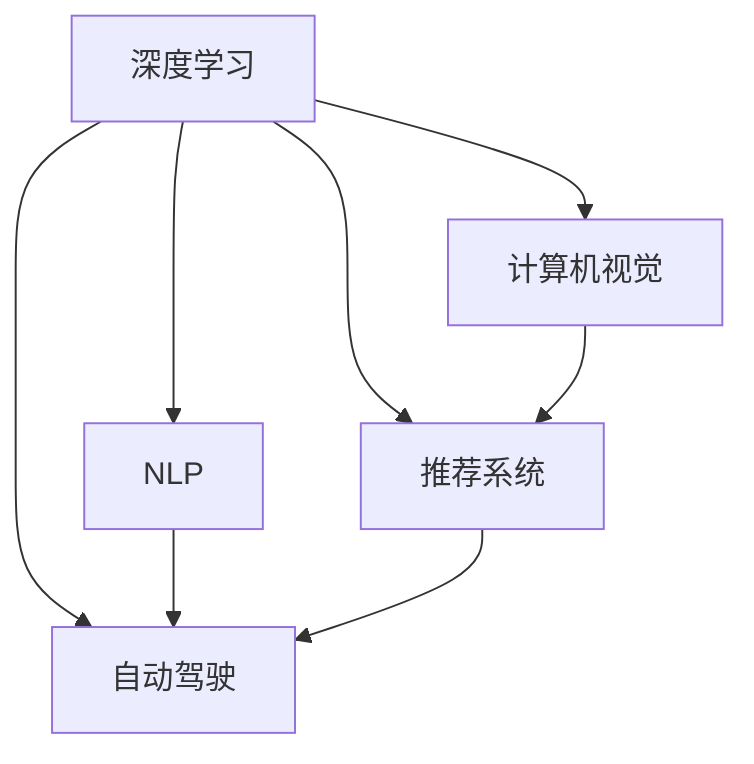

                 

# AI如何改变我们获取和处理信息的方式

在当今信息爆炸的时代，人工智能（AI）正以其独特的优势改变着人们获取和处理信息的方式。从深度学习算法到自然语言处理（NLP），从自动驾驶到机器人学，AI技术正深入各行各业，引发了一波又一波的技术变革和产业革命。本文将深入探讨AI如何改变信息获取和处理的方式，分析其在不同应用场景中的核心概念、算法原理、具体操作步骤及未来发展趋势，旨在为读者提供全面的技术见解。

## 1. 背景介绍

### 1.1 问题由来

随着数字信息技术的飞速发展，人类社会进入了一个前所未有的数据时代。每天产生的海量数据不仅带来了丰富的信息，也给数据的获取、存储、处理和分析带来了巨大的挑战。AI技术的介入，以智能算法和大数据处理能力为依托，正在重新定义信息处理的模式和流程。

从传统的数据挖掘到基于深度学习的自动化信息提取，AI技术让数据处理变得更加高效和精确。人工智能通过模拟人类的认知能力，实现了信息获取和处理的自动化，极大地提升了信息处理的速度和质量。在诸如医疗、金融、教育、交通等诸多领域，AI的应用已经开始对人们的日常工作和生活方式产生深远影响。

### 1.2 问题核心关键点

AI技术在信息处理中的核心作用体现在以下几个方面：

- **自动化**：AI技术能够自动获取、存储和处理数据，大幅度减少人工干预，提高信息处理的效率。
- **智能化**：基于深度学习和机器学习模型，AI能够从大量数据中提取隐含的规律和模式，提供智能化的解决方案。
- **个性化**：利用用户行为数据和偏好信息，AI可以提供个性化的信息推荐和服务，提升用户体验。
- **高效性**：通过并行计算和分布式处理，AI技术能够在短时间内处理海量的数据，提高信息处理的实时性。
- **安全性**：通过加密和隐私保护技术，AI能够确保数据在传输和存储过程中的安全性和隐私性。

这些核心作用使得AI技术在信息获取和处理中具备了无可比拟的优势，正在逐步改变着人们的认知和行为习惯。

## 2. 核心概念与联系

### 2.1 核心概念概述

为更好地理解AI在信息处理中的应用，本节将介绍几个关键概念：

- **深度学习**：一种模拟人脑神经网络结构的机器学习方法，通过多层神经网络对输入数据进行逐层抽象和处理，最终输出预测结果。
- **自然语言处理（NLP）**：利用计算机技术理解和生成人类语言，实现信息在自然语言中的自动获取、理解、生成和交互。
- **计算机视觉**：通过图像和视频等视觉信息进行自动化理解和生成，广泛应用于图像识别、目标检测、人脸识别等领域。
- **推荐系统**：根据用户历史行为和偏好，推荐个性化的产品或内容，优化用户体验，提升转化率。
- **自动驾驶**：通过传感器、计算机视觉和AI技术，实现无人驾驶，提高交通安全和效率。

这些概念之间的联系和相互作用，构成了AI技术在信息处理中的应用框架。

### 2.2 核心概念原理和架构的 Mermaid 流程图



这个流程图展示了深度学习、NLP、计算机视觉、推荐系统和自动驾驶等核心概念之间的联系和相互作用。

- **深度学习**是所有AI应用的基础，通过多层次的特征提取和抽象，为其他技术提供支持。
- **NLP**是连接人类语言和计算机技术的桥梁，使AI能够理解和处理自然语言信息。
- **计算机视觉**利用图像和视频信息，实现自动化视觉理解和生成。
- **推荐系统**基于用户行为数据，实现个性化推荐，提升用户体验。
- **自动驾驶**则将AI技术应用于交通领域，实现无人驾驶，提升交通安全和效率。

## 3. 核心算法原理 & 具体操作步骤

### 3.1 算法原理概述

AI在信息处理中的应用，本质上是通过深度学习和机器学习模型对大量数据进行自动化处理和分析，从而提取规律、生成信息和提供决策支持。以自然语言处理为例，深度学习模型通过对大量文本数据的训练，能够自动理解和生成文本，实现信息处理和交互的自动化。

### 3.2 算法步骤详解

以一个典型的NLP任务为例，基于深度学习的文本分类算法步骤如下：

1. **数据预处理**：将原始文本进行分词、去除停用词、转换为向量表示等预处理操作。
2. **模型训练**：利用训练集数据对深度学习模型进行训练，调整模型参数，使其能够准确预测文本分类。
3. **模型评估**：使用验证集对模型进行评估，调整模型超参数，提升模型性能。
4. **模型应用**：将训练好的模型应用于实际文本数据，进行分类预测，生成处理结果。

### 3.3 算法优缺点

AI技术在信息处理中的应用，具有以下优点：

- **高效性**：利用深度学习和并行计算技术，能够在短时间内处理大量数据，提高信息处理的效率。
- **自动化**：通过自动化算法和模型，减少了人工干预，提高了信息处理的准确性和一致性。
- **智能化**：基于大规模数据训练的深度学习模型，能够从数据中提取隐含的规律和模式，提供智能化的解决方案。

但同时也存在一些局限性：

- **数据依赖性**：AI技术高度依赖于数据质量和数据量，数据不足或质量低下将直接影响模型的性能。
- **可解释性不足**：深度学习模型通常被视为"黑盒"，难以解释其内部工作机制和决策逻辑。
- **计算资源需求高**：AI技术对计算资源的需求较高，特别是对于大规模数据和深度模型的处理，需要高性能的硬件支持。

### 3.4 算法应用领域

AI技术在信息处理中的应用领域广泛，包括但不限于以下几个方面：

- **医疗**：通过AI技术对患者数据进行分析和预测，提供个性化的医疗方案和治疗建议。
- **金融**：利用AI进行市场分析、风险评估和投资决策，提升金融服务的效率和准确性。
- **教育**：基于学生行为数据和偏好信息，提供个性化的学习资源和教学方案。
- **交通**：通过AI技术实现智能交通管理、自动驾驶和交通安全预警。
- **安防**：利用计算机视觉和AI技术进行视频监控、人脸识别和异常行为检测。

## 4. 数学模型和公式 & 详细讲解 & 举例说明

### 4.1 数学模型构建

在AI信息处理中，数学模型通常基于深度学习和机器学习算法构建。以神经网络为例，其基本结构包括输入层、隐藏层和输出层，通过权重和偏置对输入数据进行逐层处理和抽象，最终输出预测结果。

以一个简单的全连接神经网络为例，其数学模型为：

$$ y = \sigma(Wx + b) $$

其中 $x$ 为输入向量，$W$ 为权重矩阵，$b$ 为偏置向量，$\sigma$ 为激活函数，$y$ 为输出向量。

### 4.2 公式推导过程

以神经网络的反向传播算法为例，其基本步骤如下：

1. **前向传播**：将输入数据 $x$ 输入神经网络，通过权重 $W$ 和偏置 $b$ 计算输出 $y$。
2. **计算误差**：将 $y$ 与实际标签 $t$ 进行比较，计算误差 $e$。
3. **反向传播**：利用链式法则，计算误差 $e$ 对权重 $W$ 和偏置 $b$ 的梯度，更新模型参数。

### 4.3 案例分析与讲解

以图像识别任务为例，利用卷积神经网络（CNN）进行图像分类。其基本结构包括卷积层、池化层和全连接层，通过卷积和池化操作提取图像特征，最终通过全连接层进行分类。

CNN的数学模型为：

$$ y = \sigma(W^1\sigma(W^0x + b^0) + b^1) $$

其中 $x$ 为输入图像，$W^0$ 和 $b^0$ 为卷积层参数，$W^1$ 和 $b^1$ 为全连接层参数，$\sigma$ 为激活函数，$y$ 为分类结果。

## 5. 项目实践：代码实例和详细解释说明

### 5.1 开发环境搭建

在进行AI信息处理实践前，我们需要准备好开发环境。以下是使用Python进行TensorFlow开发的环境配置流程：

1. 安装Anaconda：从官网下载并安装Anaconda，用于创建独立的Python环境。

2. 创建并激活虚拟环境：
```bash
conda create -n tf-env python=3.8 
conda activate tf-env
```

3. 安装TensorFlow：根据CUDA版本，从官网获取对应的安装命令。例如：
```bash
conda install tensorflow tensorflow-gpu -c conda-forge
```

4. 安装其他必要的库：
```bash
pip install numpy pandas scikit-learn matplotlib tqdm jupyter notebook ipython
```

完成上述步骤后，即可在`tf-env`环境中开始AI信息处理实践。

### 5.2 源代码详细实现

以下是一个简单的TensorFlow代码示例，用于实现基于深度学习的文本分类任务：

```python
import tensorflow as tf
from tensorflow.keras.datasets import imdb
from tensorflow.keras.preprocessing.sequence import pad_sequences

# 加载IMDB数据集
(x_train, y_train), (x_test, y_test) = imdb.load_data(num_words=10000)

# 对文本数据进行填充和标准化
max_len = 256
x_train = pad_sequences(x_train, maxlen=max_len)
x_test = pad_sequences(x_test, maxlen=max_len)

# 构建模型
model = tf.keras.Sequential([
    tf.keras.layers.Embedding(input_dim=10000, output_dim=16),
    tf.keras.layers.Conv1D(128, 5, activation='relu'),
    tf.keras.layers.GlobalMaxPooling1D(),
    tf.keras.layers.Dense(16, activation='relu'),
    tf.keras.layers.Dense(1, activation='sigmoid')
])

# 编译模型
model.compile(optimizer='adam', loss='binary_crossentropy', metrics=['accuracy'])

# 训练模型
model.fit(x_train, y_train, epochs=5, batch_size=32, validation_data=(x_test, y_test))

# 评估模型
loss, accuracy = model.evaluate(x_test, y_test)
print(f"测试集准确率: {accuracy}")
```

### 5.3 代码解读与分析

让我们再详细解读一下关键代码的实现细节：

- **数据预处理**：使用`imdb.load_data`加载IMDB数据集，通过`pad_sequences`对文本数据进行填充和标准化，确保所有样本输入长度一致。
- **模型构建**：使用`tf.keras.Sequential`构建神经网络模型，包括嵌入层、卷积层、池化层和全连接层。
- **模型编译**：使用`model.compile`指定优化器、损失函数和评估指标，准备进行模型训练。
- **模型训练**：使用`model.fit`对模型进行训练，指定训练轮数和批次大小，同时在验证集上进行评估。
- **模型评估**：使用`model.evaluate`对模型进行评估，输出测试集上的准确率。

通过以上步骤，我们成功实现了基于TensorFlow的文本分类模型。

### 5.4 运行结果展示

在训练完成后，使用`model.evaluate`在测试集上评估模型，可以输出模型在测试集上的准确率和其他评估指标。

## 6. 实际应用场景

### 6.1 智能客服系统

基于AI的智能客服系统已经在许多企业中得到广泛应用。通过NLP技术，系统能够理解用户的语言输入，自动进行问题分类和回答生成。例如，银行客服系统可以通过语音识别技术，将客户的语音转换为文本，然后通过NLP模型自动处理和响应客户的咨询需求。

### 6.2 金融舆情监测

金融行业需要实时监测市场舆情，及时发现和应对负面信息。利用NLP技术，可以自动分析新闻、社交媒体和论坛等公开数据，识别市场趋势和舆情变化，提前预警风险。

### 6.3 个性化推荐系统

在电商、新闻、视频等领域，个性化推荐系统通过用户行为数据和偏好信息，自动生成个性化的产品或内容推荐，提升用户体验和满意度。

### 6.4 未来应用展望

随着AI技术的不断进步，其在信息处理中的应用将更加广泛和深入。未来，AI将能够实现更加智能化的信息获取和处理，提升人类社会的效率和智能化水平。

## 7. 工具和资源推荐

### 7.1 学习资源推荐

为了帮助开发者系统掌握AI在信息处理中的应用，这里推荐一些优质的学习资源：

1. **《深度学习》书籍**：Ian Goodfellow、Yoshua Bengio和Aaron Courville合著的深度学习教材，是学习深度学习理论和算法的经典之作。
2. **CS231n《计算机视觉：基于深度学习的方法》课程**：斯坦福大学开设的计算机视觉课程，介绍了深度学习在计算机视觉中的应用，涵盖了图像分类、目标检测等核心技术。
3. **自然语言处理（NLP）课程**：Coursera和edX等在线平台提供的大量NLP课程，涵盖了NLP的基础知识和前沿技术。
4. **Kaggle竞赛**：Kaggle是数据科学和机器学习竞赛平台，提供了大量真实的NLP任务数据集，有助于实践和提升技能。

通过学习这些资源，相信你一定能够全面掌握AI在信息处理中的应用，并在实际项目中灵活应用。

### 7.2 开发工具推荐

高效的开发离不开优秀的工具支持。以下是几款用于AI信息处理开发的常用工具：

1. **TensorFlow**：由Google主导开发的深度学习框架，功能丰富，支持分布式计算和GPU加速。
2. **PyTorch**：由Facebook开发的高效深度学习框架，灵活易用，支持动态图和静态图模式。
3. **Keras**：高层次的深度学习API，易于上手，支持多种后端框架，包括TensorFlow和PyTorch。
4. **Jupyter Notebook**：开源的交互式计算环境，支持Python、R等多种编程语言，适合数据分析和模型训练。
5. **GitHub**：全球最大的代码托管平台，提供丰富的开源项目和资源，方便学习和共享。

合理利用这些工具，可以显著提升AI信息处理任务的开发效率，加速创新迭代的步伐。

### 7.3 相关论文推荐

AI技术在信息处理中的应用，源于学界的持续研究。以下是几篇奠基性的相关论文，推荐阅读：

1. **ImageNet Classification with Deep Convolutional Neural Networks**：Alex Krizhevsky等人在2012年提出的基于深度卷积神经网络的图像分类方法，开启了计算机视觉领域的深度学习革命。
2. **Attention is All You Need**：谷歌的Vaswani等人在2017年提出的Transformer模型，改变了NLP领域的模型结构，使得模型能够更好地处理长序列数据。
3. **A Survey of Reinforcement Learning for NLP**：Ori Ram等人在2020年综述了强化学习在NLP中的应用，提供了大量案例和最新研究进展。
4. **Generative Adversarial Nets**：Ian Goodfellow等人在2014年提出的生成对抗网络（GAN），为图像生成、语音合成等任务提供了强大的模型支持。

这些论文代表了大规模AI应用的研究方向，通过学习这些前沿成果，可以帮助研究者把握学科前进方向，激发更多的创新灵感。

## 8. 总结：未来发展趋势与挑战

### 8.1 总结

本文对AI在信息处理中的应用进行了全面系统的介绍。首先阐述了AI技术在信息获取和处理中的核心作用，明确了其自动化、智能化、个性化和高效性的独特优势。其次，从原理到实践，详细讲解了深度学习模型的构建和优化，给出了具体的代码实例和详细解释。同时，本文还探讨了AI技术在智能客服、金融舆情、个性化推荐等多个行业领域的应用前景，展示了AI技术的广泛潜力。

通过本文的系统梳理，可以看到，AI技术在信息处理中的应用正在逐步改变人类的工作和生活方式，深刻影响着社会的各个层面。未来，伴随AI技术的持续演进，相信信息获取和处理将更加智能化、高效化和个性化，为人类社会带来更多的便利和可能性。

### 8.2 未来发展趋势

展望未来，AI在信息处理中的应用将呈现以下几个发展趋势：

1. **自动化程度提升**：随着技术的进步，AI将实现更加自动化的信息处理，减少人工干预，提高效率。
2. **智能化水平提升**：基于深度学习和大数据技术，AI将能够从数据中提取更丰富的信息，提供更加智能化和精准的解决方案。
3. **个性化服务增强**：利用用户行为数据和偏好信息，AI将能够提供更加个性化的信息推荐和服务，提升用户体验。
4. **多模态融合**：AI技术将进一步融合图像、视频、语音等多模态信息，实现更加全面和准确的信息处理。
5. **边缘计算普及**：随着5G等通信技术的发展，AI将更加注重边缘计算，实现低延迟、高可靠性的信息处理。
6. **隐私保护强化**：在数据隐私和安全性的要求下，AI将更加注重保护用户隐私，实现安全可靠的信息处理。

以上趋势凸显了AI技术在信息处理中的广阔前景。这些方向的探索发展，将进一步提升AI系统的性能和应用范围，为人类社会带来更多的便利和进步。

### 8.3 面临的挑战

尽管AI技术在信息处理中已经取得了瞩目成就，但在迈向更加智能化、普适化应用的过程中，它仍面临着诸多挑战：

1. **数据依赖性**：AI技术高度依赖于数据质量和数据量，数据不足或质量低下将直接影响模型的性能。
2. **可解释性不足**：深度学习模型通常被视为"黑盒"，难以解释其内部工作机制和决策逻辑。
3. **计算资源需求高**：AI技术对计算资源的需求较高，特别是对于大规模数据和深度模型的处理，需要高性能的硬件支持。
4. **隐私保护**：在数据隐私和安全性的要求下，AI系统需要更加注重保护用户隐私，实现安全可靠的信息处理。
5. **技术复杂性**：AI技术的复杂性增加了开发和部署的难度，需要大量技术储备和团队协作。
6. **伦理道德问题**：AI技术在应用过程中可能面临伦理道德问题，如偏见、歧视等，需要构建完善的监管机制。

这些挑战需要科技界和产业界的共同努力，才能逐步克服，实现AI技术的广泛应用。

### 8.4 研究展望

未来的研究需要在以下几个方面寻求新的突破：

1. **数据增强技术**：探索更多数据增强方法，提高模型的泛化能力和鲁棒性。
2. **模型压缩技术**：开发更加高效的模型压缩技术，减少计算资源消耗，提升模型性能。
3. **联邦学习**：利用联邦学习技术，实现分布式数据处理和模型训练，保护用户隐私。
4. **模型解释性**：开发可解释性强的AI模型，增强模型的透明度和可理解性。
5. **多模态融合**：探索多模态数据的融合方法，提升AI系统的全面性和准确性。
6. **边缘计算**：研究边缘计算技术，实现低延迟、高可靠性的信息处理。
7. **隐私保护**：探索隐私保护技术，实现数据安全可靠的处理。

这些研究方向的探索，将引领AI技术在信息处理中的新一轮突破，为构建安全、可靠、可解释、可控的智能系统铺平道路。

## 9. 附录：常见问题与解答

**Q1：AI技术在信息处理中的应用是否能够完全替代人类？**

A: AI技术在信息处理中的应用可以显著提升效率和准确性，但在某些领域，如艺术创作、情感理解和伦理判断等，仍然需要人类的参与和干预，以确保信息的全面性和准确性。

**Q2：如何应对AI技术在信息处理中的挑战？**

A: 应对AI技术在信息处理中的挑战，需要采取以下措施：
1. 提高数据质量和多样性，增加模型的训练数据量。
2. 开发可解释性强的模型，增强模型的透明度和可理解性。
3. 使用联邦学习技术，保护用户隐私和数据安全。
4. 优化模型压缩和推理加速技术，降低计算资源消耗。
5. 构建完善的监管机制，确保AI技术的伦理和安全。

**Q3：AI技术在信息处理中的应用前景如何？**

A: AI技术在信息处理中的应用前景非常广阔，随着技术的不断进步，AI将能够实现更加智能化的信息获取和处理，提升人类社会的效率和智能化水平。未来，AI技术将广泛应用于医疗、金融、教育、交通等多个领域，带来深远的社会变革。

**Q4：AI技术在信息处理中的限制因素有哪些？**

A: AI技术在信息处理中的限制因素包括：
1. 数据质量和数据量的依赖，数据不足或质量低下将直接影响模型的性能。
2. 计算资源的高需求，特别是对于大规模数据和深度模型的处理。
3. 可解释性不足，深度学习模型通常被视为"黑盒"，难以解释其内部工作机制和决策逻辑。
4. 隐私保护问题，在数据隐私和安全性的要求下，AI系统需要更加注重保护用户隐私。

这些限制因素需要科技界和产业界的共同努力，才能逐步克服，实现AI技术的广泛应用。

---

作者：禅与计算机程序设计艺术 / Zen and the Art of Computer Programming

