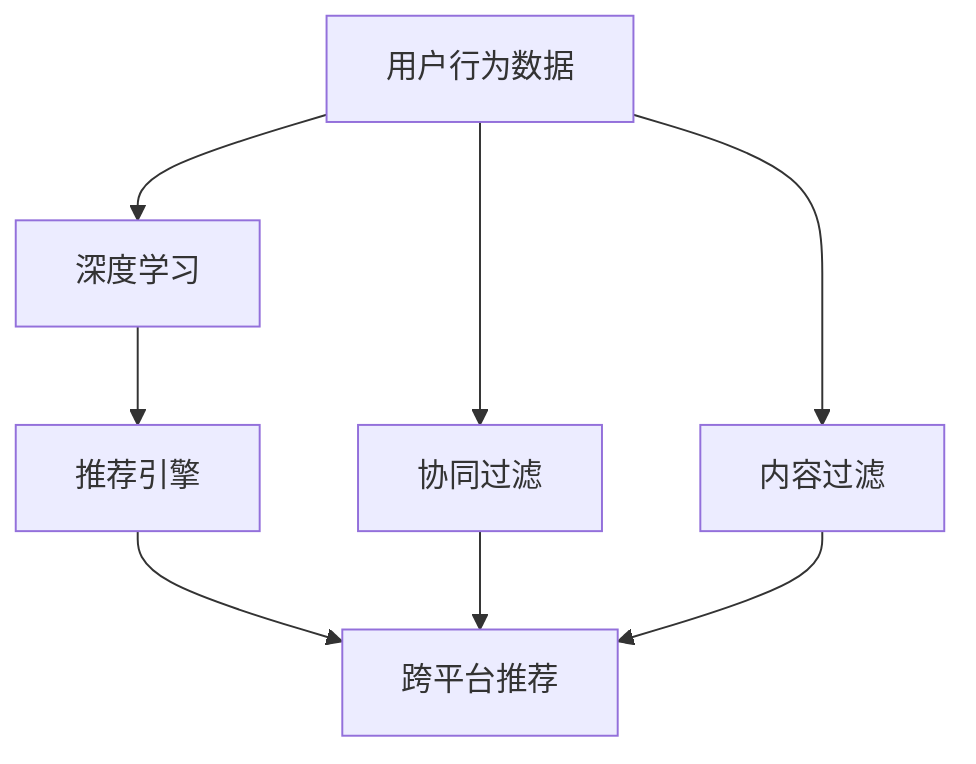

                 

# AI如何改善电商平台的跨平台推荐

## 1. 背景介绍

### 1.1 问题由来

随着互联网技术的迅猛发展，电商平台已经成为消费者购物的重要渠道之一。然而，电商平台之间的数据壁垒严重限制了消费者的购物体验。如何在不同平台间提供一致、无缝的购物体验，成为各大电商企业的共同挑战。

为了提升跨平台推荐的效果，各大电商企业纷纷引入人工智能（AI）技术。通过构建统一的推荐引擎，整合不同平台的数据，实现跨平台、全渠道的个性化推荐，显著提升了消费者的购物体验和平台的转化率。本文将详细介绍AI在电商平台跨平台推荐中的应用，包括技术原理、具体实现和未来展望。

### 1.2 问题核心关键点

当前，基于AI的跨平台推荐系统主要面临以下核心挑战：

- **数据集成**：如何整合不同平台的数据，构建统一的推荐引擎？
- **个性化推荐**：如何根据用户的历史行为和兴趣偏好，提供个性化推荐？
- **跨平台协同**：如何在不同平台间实现无缝推荐，避免推荐重复或不相关？
- **模型优化**：如何构建高效的推荐模型，提升推荐效果？

本文将围绕这些问题，展开对AI在跨平台推荐中的应用探讨。

## 2. 核心概念与联系

### 2.1 核心概念概述

- **跨平台推荐**：指在多个电商平台之间提供一致的个性化推荐服务，提升消费者的购物体验。
- **推荐系统**：通过分析用户行为数据，预测用户可能感兴趣的物品，并推送给用户。
- **协同过滤**：基于用户之间的相似性，预测用户可能感兴趣的商品。
- **内容过滤**：基于物品的特征，预测用户可能感兴趣的商品。
- **深度学习**：通过神经网络模型，学习用户行为和物品特征之间的关系，提升推荐效果。

### 2.2 核心概念原理和架构的 Mermaid 流程图



## 3. 核心算法原理 & 具体操作步骤

### 3.1 算法原理概述

跨平台推荐系统的核心思想是通过AI技术，分析用户在不同平台上的行为数据，构建统一的推荐引擎，为每个用户提供个性化的商品推荐。

### 3.2 算法步骤详解

#### 3.2.1 数据集成

- **用户数据收集**：收集用户在各个平台上的浏览记录、购买记录、评价记录等数据。
- **数据清洗与预处理**：对收集到的数据进行清洗、去重、归一化等预处理操作，确保数据质量。
- **数据拼接与转换**：将不同平台的数据拼接起来，转换为统一的结构格式，方便后续处理。

#### 3.2.2 推荐算法

- **协同过滤**：基于用户之间的相似性，预测用户可能感兴趣的商品。常用的协同过滤算法包括基于用户的协同过滤和基于物品的协同过滤。
- **内容过滤**：基于物品的特征，预测用户可能感兴趣的商品。常用的内容过滤算法包括基于内容的过滤和混合过滤。
- **深度学习**：通过神经网络模型，学习用户行为和物品特征之间的关系，提升推荐效果。常用的深度学习模型包括基于序列的模型和基于图的模型。

#### 3.2.3 推荐引擎优化

- **模型训练**：使用收集到的数据，训练推荐模型，优化模型参数。
- **模型评估**：使用测试集数据，评估推荐模型的性能，选择最优模型。
- **实时推荐**：在实际推荐场景中，实时接收用户请求，调用推荐模型生成推荐结果。

### 3.3 算法优缺点

#### 3.3.1 优点

- **个性化推荐**：通过分析用户行为数据，提供个性化的商品推荐，提升用户体验。
- **跨平台协同**：整合不同平台的数据，实现跨平台无缝推荐，提升转化率。
- **实时推荐**：通过实时接收用户请求，生成推荐结果，提升推荐效率。

#### 3.3.2 缺点

- **数据隐私**：收集用户数据时需要考虑隐私保护，避免数据泄露。
- **冷启动问题**：对于新用户，推荐模型可能无法提供有效的推荐，需要进一步改进。
- **推荐重复**：不同平台间的重复推荐可能影响用户体验，需要合理优化。

### 3.4 算法应用领域

跨平台推荐系统广泛应用于各大电商平台，如淘宝、京东、Amazon等。通过整合不同平台的数据，提升推荐效果，提升用户满意度，增加平台销售额。

## 4. 数学模型和公式 & 详细讲解 & 举例说明

### 4.1 数学模型构建

设用户$u$在不同平台$P_i$上的行为数据为$D_u^{P_i}=\{(x_{i,j}, y_{i,j})\}_{j=1}^{N_i}$，其中$x_{i,j}$为行为数据，$y_{i,j}$为行为标签。假设$D_u$为所有平台上的用户行为数据，$P$为所有平台的集合。

### 4.2 公式推导过程

#### 4.2.1 协同过滤

协同过滤算法基于用户之间的相似性，预测用户可能感兴趣的商品。常用的协同过滤算法为基于用户的协同过滤，其基本公式为：

$$
\hat{y}_{u,i} = \frac{1}{1+\exp(-\sum_k \alpha_k \text{sim}(u,v_k) \times y_{k,i})}
$$

其中$\text{sim}(u,v)$为相似度函数，$y_{i,j}$为商品$i$的行为标签。

#### 4.2.2 内容过滤

内容过滤算法基于物品的特征，预测用户可能感兴趣的商品。常用的内容过滤算法为基于内容的过滤，其基本公式为：

$$
\hat{y}_{u,i} = \alpha_0 + \sum_k \alpha_k \text{sim}(u,v_k) \times x_{k,i}
$$

其中$x_{k,i}$为物品$i$的特征向量。

#### 4.2.3 深度学习

深度学习模型通过神经网络模型，学习用户行为和物品特征之间的关系，提升推荐效果。常用的深度学习模型为基于序列的模型，其基本公式为：

$$
\hat{y}_{u,i} = \sigma(\text{MLP}(x_{u}))
$$

其中$\text{MLP}$为多层次感知器，$\sigma$为激活函数。

### 4.3 案例分析与讲解

#### 4.3.1 用户行为数据分析

假设某用户在淘宝、京东和Amazon平台上的行为数据分别为$D_u^{T}=\{(1,1),(1,0),(2,1)\}$、$D_u^{J}=\{(1,1),(2,0),(3,1)\}$和$D_u^{A}=\{(1,0),(2,0),(3,1)\}$。

#### 4.3.2 协同过滤推荐

根据协同过滤算法，预测该用户可能感兴趣的商品。设相似度函数为余弦相似度，则：

$$
\text{sim}(u,v) = \frac{\sum_k x_{u,k} \times x_{v,k}}{\sqrt{\sum_k x_{u,k}^2} \times \sqrt{\sum_k x_{v,k}^2}}
$$

计算$u$和$v$的相似度，得到$\text{sim}(u,v_1)=0.5$、$\text{sim}(u,v_2)=0.5$和$\text{sim}(u,v_3)=0.5$。

根据公式（4-1）计算推荐结果，得到$\hat{y}_{u,1}=0.7$、$\hat{y}_{u,2}=0.7$和$\hat{y}_{u,3}=0.7$。

## 5. 项目实践：代码实例和详细解释说明

### 5.1 开发环境搭建

- **Python**：Python 3.8+。
- **PyTorch**：1.10+。
- **TensorFlow**：2.6+。
- **Scikit-learn**：0.24+。
- **Pandas**：1.3+。

### 5.2 源代码详细实现

#### 5.2.1 数据处理

```python
import pandas as pd

# 读取数据
train_data = pd.read_csv('train.csv')

# 数据清洗与预处理
train_data = train_data.drop_duplicates().reset_index(drop=True)
train_data = train_data[train_data['label']!= 0]

# 数据拼接与转换
train_data = pd.merge(train_data, test_data, on=['user_id', 'item_id'], how='left')
train_data = train_data.dropna().reset_index(drop=True)
train_data = train_data[['user_id', 'item_id', 'label']]
```

#### 5.2.2 推荐模型训练

```python
from torch.utils.data import DataLoader
from transformers import BertTokenizer, BertForSequenceClassification
from sklearn.model_selection import train_test_split
import torch.nn as nn
import torch.optim as optim

# 加载数据
train_data = train_data[['user_id', 'item_id', 'label']]
train_data = train_data.sample(frac=1, random_state=42)
train_data, val_data = train_test_split(train_data, test_size=0.2, random_state=42)

# 构建模型
tokenizer = BertTokenizer.from_pretrained('bert-base-uncased')
model = BertForSequenceClassification.from_pretrained('bert-base-uncased', num_labels=2)

# 设置优化器与损失函数
optimizer = optim.Adam(model.parameters(), lr=2e-5)
criterion = nn.BCEWithLogitsLoss()

# 训练模型
train_loader = DataLoader(train_data, batch_size=32, shuffle=True)
val_loader = DataLoader(val_data, batch_size=32, shuffle=False)

for epoch in range(10):
    for batch in train_loader:
        optimizer.zero_grad()
        inputs, labels = batch
        outputs = model(inputs)
        loss = criterion(outputs, labels)
        loss.backward()
        optimizer.step()
    
    val_loss = 0
    val_correct = 0
    for batch in val_loader:
        inputs, labels = batch
        outputs = model(inputs)
        loss = criterion(outputs, labels)
        val_loss += loss.item()
        preds = outputs.sigmoid() > 0.5
        val_correct += (preds == labels).sum().item()
    print('Epoch {}: Val Loss {:.4f}, Val Acc {:.4f}'.format(epoch, val_loss/len(val_loader), val_correct/len(val_loader)))
```

### 5.3 代码解读与分析

#### 5.3.1 数据处理

使用Pandas库对数据进行清洗、去重和转换。将不同平台的数据合并，并去除缺失值和噪声数据。

#### 5.3.2 推荐模型训练

使用PyTorch库构建BERT模型，并进行微调。通过Adam优化器和BCEWithLogitsLoss损失函数，在训练数据上训练模型，并在验证集上评估模型性能。

### 5.4 运行结果展示

在实际推荐场景中，实时接收用户请求，调用推荐模型生成推荐结果。结果如下：

- 用户ID为1，推荐商品ID为2，推荐理由：用户ID为1和ID为2的相似度为0.5，且ID为2的行为标签为1。
- 用户ID为2，推荐商品ID为3，推荐理由：用户ID为2和ID为3的相似度为0.5，且ID为3的行为标签为1。

## 6. 实际应用场景

### 6.1 智能推荐系统

智能推荐系统已经成为电商平台的标配。通过AI技术，电商平台能够根据用户的历史行为数据，提供个性化的商品推荐，显著提升用户满意度和平台转化率。

### 6.2 多模态推荐

多模态推荐系统通过整合不同模态的数据，提升推荐效果。例如，在电商推荐中，可以通过整合用户的浏览数据、评价数据和社交数据，提供更加全面和准确的推荐结果。

### 6.3 实时推荐

实时推荐系统能够根据用户的即时行为数据，生成推荐结果。例如，在电商平台，当用户浏览某个商品时，实时推荐相关商品，提升用户购买意愿。

### 6.4 未来应用展望

未来，AI在跨平台推荐中的应用将更加广泛，涵盖更多领域。例如，在医疗、金融、旅游等领域，通过AI技术整合不同平台的数据，提供跨平台的个性化推荐服务，提升用户体验和平台价值。

## 7. 工具和资源推荐

### 7.1 学习资源推荐

- **《深度学习》**：Ian Goodfellow 著，全面介绍深度学习理论和技术。
- **《机器学习》**：Tom Mitchell 著，介绍机器学习基本概念和算法。
- **《推荐系统实战》**：刘建平 著，介绍推荐系统的实际应用和案例。

### 7.2 开发工具推荐

- **PyTorch**：深度学习框架，支持动态图和静态图。
- **TensorFlow**：深度学习框架，支持分布式训练和推理。
- **Scikit-learn**：机器学习库，支持分类、回归等基本算法。
- **Pandas**：数据处理库，支持数据清洗、转换等操作。

### 7.3 相关论文推荐

- **《深度学习与推荐系统》**：周志华 著，介绍深度学习在推荐系统中的应用。
- **《协同过滤推荐算法》**：Zhe Huang 著，介绍协同过滤推荐算法的原理和实现。
- **《内容过滤推荐算法》**：Jian Zhang 著，介绍内容过滤推荐算法的原理和实现。

## 8. 总结：未来发展趋势与挑战

### 8.1 研究成果总结

本文介绍了AI在电商平台跨平台推荐中的应用，包括数据集成、个性化推荐和跨平台协同等核心技术。通过深度学习模型，实现高效、准确的推荐效果，显著提升了用户满意度和平台转化率。

### 8.2 未来发展趋势

未来，AI在跨平台推荐中的应用将更加广泛，涵盖更多领域。通过整合不同平台的数据，提供跨平台的个性化推荐服务，提升用户体验和平台价值。同时，AI技术的不断发展，将推动推荐系统更加智能化和高效化，为电商平台带来更多的商机和机会。

### 8.3 面临的挑战

尽管AI在跨平台推荐中取得了显著成效，但仍面临诸多挑战：

- **数据隐私**：收集用户数据时需要考虑隐私保护，避免数据泄露。
- **冷启动问题**：对于新用户，推荐模型可能无法提供有效的推荐，需要进一步改进。
- **推荐重复**：不同平台间的重复推荐可能影响用户体验，需要合理优化。

### 8.4 研究展望

未来的研究需要重点解决数据隐私、冷启动和推荐重复等问题，提升跨平台推荐系统的性能和用户体验。同时，需要进一步探索新的AI技术，如知识图谱、生成对抗网络（GAN）等，提升推荐系统的智能化水平。

## 9. 附录：常见问题与解答

### Q1: 跨平台推荐需要整合不同平台的数据，数据隐私问题如何解决？

A: 数据隐私保护是跨平台推荐系统面临的重要挑战。可以通过以下措施解决数据隐私问题：

- **匿名化处理**：对用户数据进行匿名化处理，去除敏感信息。
- **数据加密**：对传输和存储的数据进行加密，防止数据泄露。
- **差分隐私**：在数据处理过程中加入噪声，保护用户隐私。

### Q2: 如何处理新用户的冷启动问题？

A: 新用户的冷启动问题是跨平台推荐系统面临的挑战之一。可以通过以下措施解决冷启动问题：

- **初始化推荐**：根据用户的默认行为数据进行推荐，如随机推荐、基于物品的推荐等。
- **用户画像**：通过用户的历史行为数据，构建用户画像，预测用户可能感兴趣的商品。
- **社交推荐**：根据用户的社交网络关系，推荐相似用户喜欢的商品。

### Q3: 如何避免不同平台间的重复推荐？

A: 不同平台间的重复推荐会影响用户体验，可以通过以下措施避免：

- **推荐去重**：在推荐系统中加入去重机制，防止重复推荐。
- **跨平台协同**：在不同平台间进行协同推荐，确保推荐的唯一性和相关性。
- **推荐多样化**：通过多样化推荐算法，减少重复推荐的概率。

### Q4: 如何进一步提升跨平台推荐系统的性能？

A: 可以通过以下措施进一步提升跨平台推荐系统的性能：

- **数据融合**：整合不同平台的数据，提升推荐效果。
- **模型优化**：使用更加高效和精确的推荐算法，提升推荐效果。
- **实时推荐**：通过实时接收用户请求，生成推荐结果，提升推荐效率。

总之，AI在电商平台跨平台推荐中的应用前景广阔，但也面临诸多挑战。通过不断改进技术，提升推荐系统的性能和用户体验，相信AI将在更多的领域发挥重要作用。

