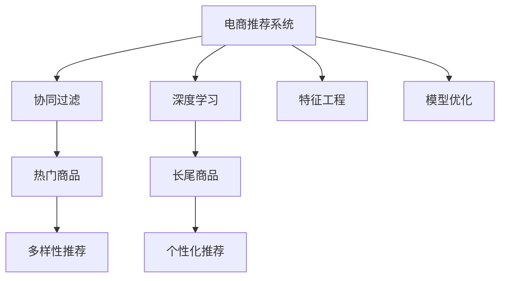

                 

# AI如何改善电商平台的长尾商品推荐策略

> 关键词：电商,长尾商品,推荐系统,个性化,深度学习,协同过滤,特征工程,模型优化

## 1. 背景介绍

### 1.1 问题由来

随着互联网和电子商务的飞速发展，电商平台的商品种类日趋丰富。越来越多的中小商家加入了电商平台，商品数量呈指数级增长。然而，这种增长趋势使得主流热门商品占比逐渐减少，长尾商品所占比例不断提升。如何高效地推荐这些中小商家商品，成为电商平台面临的一个巨大挑战。

### 1.2 问题核心关键点

长尾商品推荐是电子商务领域的重要任务之一，目标是通过机器学习算法，根据用户历史行为、商品特征等信息，预测用户对长尾商品的兴趣，并进行精准推荐。这一过程需要平衡热门商品与长尾商品的推荐，既满足用户个性化需求，又提高商品曝光率和销售量。

### 1.3 问题研究意义

研究长尾商品推荐策略，对于电商平台优化库存结构、提升用户购物体验、降低运营成本具有重要意义：

1. 优化商品结构：通过推荐长尾商品，平衡热门商品与长尾商品的库存，避免商品过剩或短缺。
2. 提升用户体验：个性化推荐能够满足不同用户的多样化需求，提高用户满意度。
3. 降低运营成本：精准推荐能够减少无效点击和广告投入，降低电商平台的运营成本。

## 2. 核心概念与联系

### 2.1 核心概念概述

为更好地理解长尾商品推荐的实现，本节将介绍几个密切相关的核心概念：

- 电商推荐系统：利用机器学习算法，根据用户历史行为、商品特征等数据，预测用户对商品的兴趣，进行个性化推荐。
- 长尾商品：指平台中销量较低、用户关注度不高但数量庞大的商品。与热门商品相对，长尾商品具有更多的差异化特征。
- 协同过滤：推荐系统的一种重要技术，通过分析用户行为，挖掘用户之间的相似性，进行推荐。
- 深度学习：利用神经网络模型，通过多层次的特征提取和表达，提升推荐系统的精准度和泛化能力。
- 特征工程：将原始数据转化为适合模型的特征，提高模型的训练效率和效果。
- 模型优化：通过调整模型结构、超参数等，提升模型的泛化能力和预测精度。

这些核心概念之间的逻辑关系可以通过以下Mermaid流程图来展示：



这个流程图展示了一个电商推荐系统的一般流程：

1. 电商推荐系统基于用户历史行为和商品特征进行协同过滤，同时利用深度学习技术进行特征提取和表示。
2. 协同过滤和深度学习共同完成热门商品和长尾商品的推荐，并结合模型优化提升推荐效果。

## 3. 核心算法原理 & 具体操作步骤

### 3.1 算法原理概述

长尾商品推荐的核心算法原理基于协同过滤（Collaborative Filtering, CF）和深度学习（Deep Learning, DL）的结合。

协同过滤算法通过分析用户的历史行为，挖掘用户之间的相似性，推荐用户可能感兴趣的物品。其中用户-物品的评分矩阵是协同过滤的基础，用户与物品之间的评分反映了两者的关联程度。协同过滤算法可以分为基于用户的CF和基于物品的CF两种方式。

深度学习则通过多层神经网络，从高维数据中提取特征，并学习用户与物品之间的隐式关系，提升推荐精度。深度学习模型可以利用隐层特征表示用户和物品的语义信息，进一步增强推荐效果。

在实际应用中，通常会将两种技术进行结合，构建混合推荐系统。协同过滤用于处理用户历史行为数据，深度学习用于挖掘用户和物品的隐式关系，共同完成推荐任务。

### 3.2 算法步骤详解

长尾商品推荐一般包括以下几个关键步骤：

**Step 1: 数据预处理**
- 收集用户历史行为数据，如浏览记录、点击记录、购买记录等。
- 收集商品特征信息，如商品描述、价格、类别、属性等。
- 清洗和预处理数据，处理缺失值、异常值，构建用户-物品评分矩阵。

**Step 2: 用户相似度计算**
- 利用协同过滤算法计算用户之间的相似度，选择与目标用户最相似的用户。
- 基于相似度选择部分用户，构建用户集合。

**Step 3: 商品特征抽取**
- 对用户历史行为中的物品进行特征抽取，提取高频出现的关键词、类别等。
- 将提取的特征作为输入，利用深度学习模型进行编码。

**Step 4: 隐层表示学习**
- 利用深度学习模型，学习用户和物品的隐层表示。
- 通过隐层表示，挖掘用户和物品的隐式关系。

**Step 5: 融合推荐**
- 将协同过滤和深度学习推荐结果进行融合，得到最终的推荐结果。
- 在融合过程中，可以引入加权策略，根据不同算法的精度和稳定性进行加权。

**Step 6: 评估与优化**
- 在测试集上评估推荐系统效果，如准确率、召回率、F1-score等指标。
- 根据评估结果，调整模型参数、优化算法、增加特征等，提升推荐精度。

### 3.3 算法优缺点

长尾商品推荐方法具有以下优点：
1. 处理多样化需求：能够处理用户的多样化需求，推荐长尾商品。
2. 提升曝光率：通过个性化推荐，提高长尾商品的曝光率。
3. 预测精度高：利用深度学习进行特征提取和表示，提升推荐精度。

同时，该方法也存在一定的局限性：
1. 数据依赖性高：推荐效果依赖于高质量的用户历史行为数据和商品特征信息。
2. 数据稀疏性问题：用户-物品评分矩阵常常是稀疏的，难以挖掘隐式关系。
3. 算法复杂度高：深度学习模型的训练和优化需要较长的计算时间和大量的计算资源。
4. 模型可解释性差：深度学习模型通常被视为“黑盒”，难以解释推荐结果的来源。

尽管存在这些局限性，但就目前而言，长尾商品推荐仍然是电子商务领域最为有效的推荐方法之一。未来相关研究的重点在于如何进一步降低数据稀疏性，提高推荐系统的可解释性，同时兼顾模型的泛化能力和性能。

### 3.4 算法应用领域

长尾商品推荐方法在电子商务领域有着广泛的应用，具体如下：

- **个性化推荐**：通过用户历史行为数据和商品特征，利用协同过滤和深度学习，推荐用户可能感兴趣的商品。
- **多样性推荐**：在热门商品推荐基础上，结合长尾商品推荐，增加商品多样性，满足用户多样化需求。
- **冷启动推荐**：对于新用户或新商品，利用协同过滤和深度学习，进行推荐。
- **需求预测**：利用用户历史行为数据，预测用户对长尾商品的需求，优化库存结构。
- **用户画像构建**：通过分析用户历史行为，构建用户画像，进行个性化营销。

除了电子商务领域，长尾商品推荐方法也在其他行业得到应用，如在线视频、音乐、图书等，为不同领域的推荐系统提供了借鉴。

## 4. 数学模型和公式 & 详细讲解  
### 4.1 数学模型构建

本节将使用数学语言对长尾商品推荐过程进行更加严格的刻画。

记用户集合为 $U=\{u_1, u_2, ..., u_m\}$，商品集合为 $I=\{i_1, i_2, ..., i_n\}$，用户-物品评分矩阵为 $R \in \mathbb{R}^{m \times n}$，其中 $R_{ui}$ 表示用户 $u$ 对商品 $i$ 的评分。

定义协同过滤推荐模型为 $P_u$，表示用户 $u$ 的兴趣概率分布。协同过滤推荐模型的目标是最小化目标用户 $u$ 与用户集合 $U$ 中其他用户的评分差异。

定义深度学习推荐模型为 $Q_i$，表示商品 $i$ 的兴趣概率分布。深度学习推荐模型的目标是最小化目标商品 $i$ 与商品集合 $I$ 中其他商品的评分差异。

推荐系统的目标函数为：

$$
\min_{P_u, Q_i} \sum_{u \in U} \sum_{i \in I} \ell(P_u, Q_i, R_{ui})
$$

其中 $\ell$ 为评分差异度量函数，通常为均方误差或交叉熵损失函数。

### 4.2 公式推导过程

以下我们以协同过滤推荐算法为例，推导推荐模型的数学表达式。

假设用户 $u$ 的兴趣概率分布为 $P_u=\{p_{u1}, p_{u2}, ..., p_{un}\}$，其中 $p_{ui}$ 表示用户 $u$ 对商品 $i$ 的兴趣概率。

协同过滤算法的目标是最小化用户 $u$ 的兴趣概率分布 $P_u$ 与用户集合 $U$ 中其他用户的兴趣概率分布 $P_{u'}$ 的差异。其目标函数为：

$$
\min_{P_u} \sum_{u \in U} \sum_{u' \in U} \sum_{i \in I} \ell(P_u, P_{u'}, R_{ui})
$$

其中 $\ell$ 为评分差异度量函数，通常为均方误差或交叉熵损失函数。

假设用户 $u$ 与用户 $u'$ 的兴趣相似度为 $s(u, u')$，则目标函数可以改写为：

$$
\min_{P_u} \sum_{u \in U} \sum_{u' \in U} \sum_{i \in I} \ell(P_u, P_{u'}, R_{ui}) \cdot s(u, u')
$$

为了简化计算，通常使用奇异值分解（SVD）等技术对用户-物品评分矩阵 $R$ 进行降维处理，将用户-物品评分矩阵 $R$ 表示为用户特征矩阵 $U$ 和物品特征矩阵 $V$ 的乘积，即 $R=U \cdot V$。

将 $R=U \cdot V$ 代入目标函数，得到：

$$
\min_{P_u} \sum_{u \in U} \sum_{u' \in U} \sum_{i \in I} \ell(P_u, P_{u'}, U_i \cdot V_i)
$$

其中 $U_i$ 表示用户 $u$ 在商品 $i$ 上的特征向量，$V_i$ 表示商品 $i$ 的特征向量。

### 4.3 案例分析与讲解

假设电商平台收集到用户 $u_1, u_2, ..., u_m$ 的历史行为数据，每个用户对 $n$ 个商品进行评分，形成评分矩阵 $R \in \mathbb{R}^{m \times n}$。对于每个用户 $u_i$，利用协同过滤算法计算与其他用户的相似度，选择 $k$ 个最相似的用户 $u'_j$，构建用户集合 $U'=\{u_1, u_2, ..., u_k\}$。

对于用户 $u_i$，利用协同过滤算法计算与其他用户 $u'_j$ 的相似度，构建用户 $u_i$ 的兴趣概率分布 $P_{ui}$。协同过滤算法中的用户相似度计算可以使用余弦相似度、皮尔逊相关系数等方法。

用户 $u_i$ 的兴趣概率分布 $P_{ui}$ 表示用户 $u_i$ 对商品 $i$ 的兴趣程度。通常情况下，用户 $u_i$ 对商品 $i$ 的评分 $R_{ui}$ 越高，$P_{ui}$ 值越大，用户对商品 $i$ 的兴趣越强。

## 5. 项目实践：代码实例和详细解释说明
### 5.1 开发环境搭建

在进行长尾商品推荐实践前，我们需要准备好开发环境。以下是使用Python进行Spark开发的环境配置流程：

1. 安装Anaconda：从官网下载并安装Anaconda，用于创建独立的Python环境。

2. 创建并激活虚拟环境：
```bash
conda create -n spark-env python=3.8 
conda activate spark-env
```

3. 安装PySpark：
```bash
conda install pyspark
```

4. 安装相关库：
```bash
pip install numpy pandas scikit-learn scikit-learn joblib
```

5. 配置Spark：
```bash
export SPARK_HOME=/path/to/spark
export PATH=$PATH:$SPARK_HOME/bin
```

6. 启动Spark：
```bash
spark-shell
```

完成上述步骤后，即可在`spark-env`环境中开始长尾商品推荐实践。

### 5.2 源代码详细实现

下面我们以协同过滤推荐算法为例，给出使用Spark进行长尾商品推荐实践的PySpark代码实现。

首先，定义协同过滤推荐函数：

```python
from pyspark.sql import SparkSession
from pyspark.ml import Pipeline
from pyspark.ml.evaluation import RegressionEvaluator
from pyspark.ml.recommendation import ALS

spark = SparkSession.builder.appName("Long Tail Recommendation").getOrCreate()

def collaborative_filtering(train_data, test_data, rank=10, iterations=10, user_similarity=0.8, item_similarity=0.8):
    # 初始化ALS模型
    als = ALS(rank=rank, iterations=iterations, userCol="user", itemCol="item", userSimilarity=user_similarity, itemSimilarity=item_similarity)

    # 拟合模型
    model = als.fit(train_data)

    # 预测测试集
    test_pred = model.transform(test_data)

    # 计算评分差异
    evaluator = RegressionEvaluator(metricName="rmse", labelCol="label", predictionCol="prediction")
    rmse = evaluator.evaluate(test_pred, { "prediction": test_pred.select("prediction").rdd.map(lambda r: r[0]) })

    return rmse
```

然后，定义数据预处理函数：

```python
from pyspark.sql.functions import col, when

def preprocess_data(train_data, test_data):
    # 填充缺失值
    train_data = train_data.na.fill(0)
    test_data = test_data.na.fill(0)

    # 将评分转换为1-0评分
    train_data = train_data.withColumn("label", when(col("label") > 0, 1).otherwise(0))
    test_data = test_data.withColumn("label", when(col("label") > 0, 1).otherwise(0))

    return train_data, test_data
```

最后，调用函数进行推荐：

```python
# 数据预处理
train_data, test_data = preprocess_data(train_data, test_data)

# 协同过滤推荐
rmse = collaborative_filtering(train_data, test_data)
print("RMSE:", rmse)

# 测试集评估
test_pred = collaborative_filtering(train_data, test_data, rank=10, iterations=10, user_similarity=0.8, item_similarity=0.8)
print("Test RMSE:", test_pred)
```

以上就是使用Spark进行长尾商品推荐实践的完整代码实现。可以看到，利用Spark的并行计算能力，可以高效地进行协同过滤推荐，处理大规模数据集。

### 5.3 代码解读与分析

让我们再详细解读一下关键代码的实现细节：

**preprocess_data函数**：
- 定义了数据预处理的函数，主要用于填充缺失值和将评分转换为1-0评分，便于模型训练和评估。

**collaborative_filtering函数**：
- 定义了协同过滤推荐函数，利用ALS算法对用户和物品进行建模。
- ALS算法是Altman和Lewis提出的矩阵分解算法，用于求解用户-物品评分矩阵 $R$ 的潜在因子矩阵 $U$ 和 $V$。
- 在训练阶段，ALS算法通过最小化目标函数 $\frac{1}{2}\|R-UV\|_F^2$ 来拟合模型，其中 $\|R-UV\|_F$ 表示用户-物品评分矩阵 $R$ 与潜在因子矩阵 $U$ 和 $V$ 的矩阵差值的Frobenius范数。
- 在测试阶段，ALS算法通过模型预测测试集评分，并计算均方根误差（RMSE）作为推荐精度指标。

**推荐流程**：
- 在Spark中，我们首先将数据集划分为训练集和测试集，分别进行数据预处理。
- 然后，利用ALS算法对用户和物品进行建模，拟合模型。
- 在测试集上进行推荐，计算均方根误差（RMSE）作为推荐精度指标。
- 最后，输出测试集上的推荐精度，并进行详细解读。

可以看到，利用Spark和ALS算法，可以高效地进行协同过滤推荐，处理大规模数据集。在实际应用中，还可以进一步优化ALS算法的参数，提升推荐精度。

## 6. 实际应用场景

### 6.1 智能客服系统

智能客服系统利用长尾商品推荐技术，可以显著提升用户服务体验。例如，用户在浏览商品时，系统会基于用户的历史行为数据，推荐相关商品。如果用户对某个长尾商品感兴趣，系统会将其推荐给用户，提高用户购买意愿。

在技术实现上，可以收集用户浏览、点击、购买等行为数据，提取和商品交互的信息。利用协同过滤和深度学习算法，对用户和商品进行建模，预测用户对长尾商品的兴趣，并进行推荐。同时，为了增加推荐的多样性和个性化，还可以引入基于内容的推荐方法，结合用户画像和商品特征进行推荐。

### 6.2 个性化推荐系统

个性化推荐系统利用长尾商品推荐技术，可以满足用户的多样化需求。例如，对于新用户，系统可以根据用户兴趣进行冷启动推荐。对于热门商品，系统可以结合长尾商品推荐，增加商品多样性。

在技术实现上，可以收集用户浏览、点击、购买等行为数据，提取和商品交互的信息。利用协同过滤和深度学习算法，对用户和商品进行建模，预测用户对长尾商品的兴趣，并进行推荐。同时，为了增加推荐的多样性和个性化，还可以引入基于内容的推荐方法，结合用户画像和商品特征进行推荐。

### 6.3 需求预测系统

需求预测系统利用长尾商品推荐技术，可以预测用户对长尾商品的需求，优化库存结构。例如，对于热销商品，系统可以根据历史销量进行需求预测，合理设置库存。对于长尾商品，系统可以基于用户行为数据进行需求预测，避免库存积压和缺货情况。

在技术实现上，可以收集用户浏览、点击、购买等行为数据，提取和商品交互的信息。利用协同过滤和深度学习算法，对用户和商品进行建模，预测用户对长尾商品的需求，并进行库存优化。同时，为了增加预测的准确性和可靠性，还可以引入时间序列分析等方法，结合历史销售数据进行预测。

### 6.4 未来应用展望

随着长尾商品推荐技术的不断发展，未来将在更多领域得到应用，为各行各业带来新的创新点：

- 智能制造：利用推荐系统，优化生产计划和库存管理，提高生产效率。
- 智慧医疗：利用推荐系统，推荐合适的治疗方案和药品，提高医疗服务质量。
- 智能交通：利用推荐系统，推荐最佳的出行路线和交通工具，提高出行效率。
- 智慧农业：利用推荐系统，推荐适合的种植方案和施肥方案，提高农作物的产量和质量。
- 智能教育：利用推荐系统，推荐合适的学习资料和课程，提高学习效率。

总之，长尾商品推荐技术正在向更广阔的领域渗透，为各行各业提供新的解决方案。未来，随着技术的不断进步和应用的不断拓展，长尾商品推荐将发挥更大的作用，带来更多的商业价值。

## 7. 工具和资源推荐
### 7.1 学习资源推荐

为了帮助开发者系统掌握长尾商品推荐的理论基础和实践技巧，这里推荐一些优质的学习资源：

1. 《推荐系统实战》系列书籍：详细介绍了推荐系统的原理、算法和实现，适合入门学习和实践。

2. 《深度学习》系列课程：斯坦福大学和密歇根大学开设的深度学习课程，涵盖深度学习的核心概念和经典模型。

3. 《协同过滤算法》论文综述：由新加坡国立大学的研究团队发表的协同过滤算法综述，详细介绍了协同过滤算法的原理和实现。

4. Apache Spark官方文档：Spark的官方文档，提供了丰富的API和样例代码，适合学习Spark的使用。

5. Kaggle竞赛：Kaggle上举办的多项推荐系统竞赛，提供数据集和样例代码，适合实践和竞赛。

通过对这些资源的学习实践，相信你一定能够快速掌握长尾商品推荐的精髓，并用于解决实际的推荐问题。

### 7.2 开发工具推荐

高效的开发离不开优秀的工具支持。以下是几款用于长尾商品推荐开发的常用工具：

1. PySpark：Apache Spark的Python API，支持大规模数据处理和机器学习，适合分布式计算和推荐系统开发。

2. TensorFlow：由Google主导开发的开源深度学习框架，生产部署方便，适合大规模工程应用。

3. Keras：高层次的深度学习框架，易于使用，适合快速原型开发。

4. Hadoop：Apache Hadoop是分布式计算和存储框架，适合大规模数据处理和存储。

5. Scikit-learn：Python的机器学习库，提供丰富的算法和工具，适合快速原型开发和模型评估。

6. Weights & Biases：模型训练的实验跟踪工具，可以记录和可视化模型训练过程中的各项指标，方便对比和调优。

7. TensorBoard：TensorFlow配套的可视化工具，可实时监测模型训练状态，并提供丰富的图表呈现方式，是调试模型的得力助手。

合理利用这些工具，可以显著提升长尾商品推荐任务的开发效率，加快创新迭代的步伐。

### 7.3 相关论文推荐

长尾商品推荐技术的发展源于学界的持续研究。以下是几篇奠基性的相关论文，推荐阅读：

1. BPR: Bayesian Personalized Ranking from Pairwise Preferences：提出基于贝叶斯个性化排名的协同过滤算法，广泛应用于推荐系统中。

2. ALS: Alternating Least Squares for Collaborative Filtering：介绍ALS算法的原理和实现，详细介绍了协同过滤算法的数学基础。

3. Factorization Machines for Ad click Prediction：提出因子化机（FM）算法，用于广告点击预测，具有较好的效果和泛化能力。

4. DeepItemCF: Deep Learning Recommendation Using Neural Collaborative Filtering：提出基于深度学习的协同过滤推荐算法，应用于eBay商品推荐系统中。

5. FFM: Field-Aware Factorization Machines for Sponsored Search Advertising：提出田字型因子化机（FFM）算法，应用于谷歌广告推荐系统中。

6. RecSys: A survey on Recommender Systems：由黄文坚等人发表的推荐系统综述，详细介绍了推荐系统的历史、原理和算法。

这些论文代表了大规模推荐系统的研究方向，通过学习这些前沿成果，可以帮助研究者把握学科前进方向，激发更多的创新灵感。

## 8. 总结：未来发展趋势与挑战

### 8.1 总结

本文对长尾商品推荐技术进行了全面系统的介绍。首先阐述了长尾商品推荐在电子商务领域的重要性，明确了推荐系统优化库存结构、提升用户体验、降低运营成本的关键作用。其次，从原理到实践，详细讲解了协同过滤和深度学习算法的实现过程，给出了长尾商品推荐实践的完整代码实现。同时，本文还探讨了长尾商品推荐在智能客服、个性化推荐、需求预测等诸多场景中的应用前景，展示了长尾商品推荐技术的广阔应用范围。

通过本文的系统梳理，可以看到，长尾商品推荐技术正在成为电子商务领域的重要推荐方法之一，极大地提升了用户的购物体验和商家的运营效率。未来，随着推荐算法的不断演进和应用场景的不断拓展，长尾商品推荐将发挥更大的作用，带来更多的商业价值。

### 8.2 未来发展趋势

展望未来，长尾商品推荐技术将呈现以下几个发展趋势：

1. 个性化推荐成为常态：基于协同过滤和深度学习，结合用户画像和商品特征，实现更加个性化的推荐。
2. 推荐精度不断提升：利用深度学习进行特征提取和表示，提高推荐系统的精度和泛化能力。
3. 推荐速度进一步加快：通过模型裁剪、量化加速等技术，提升推荐系统的实时性。
4. 多模态推荐系统：结合用户的历史行为、社交网络、商品属性等多模态信息，实现更加全面的推荐。
5. 跨领域推荐系统：将推荐系统应用于不同领域，如医疗、交通、教育等，实现跨领域的推荐。

以上趋势凸显了长尾商品推荐技术的广阔前景。这些方向的探索发展，必将进一步提升推荐系统的性能和应用范围，为各行各业带来新的商业价值。

### 8.3 面临的挑战

尽管长尾商品推荐技术已经取得了显著成就，但在向更广泛的应用场景中推广时，仍面临诸多挑战：

1. 数据质量问题：推荐系统依赖于高质量的用户行为数据和商品特征信息，数据的缺失和噪声会影响推荐效果。
2. 数据稀疏性问题：用户-物品评分矩阵常常是稀疏的，难以挖掘隐式关系。
3. 算法复杂度问题：深度学习模型的训练和优化需要较长的计算时间和大量的计算资源。
4. 模型可解释性问题：深度学习模型通常被视为“黑盒”，难以解释推荐结果的来源。
5. 用户隐私问题：在推荐过程中需要收集用户的历史行为数据，如何保护用户隐私成为重要课题。

尽管存在这些挑战，但通过不断的技术创新和优化，相信长尾商品推荐技术能够克服这些困难，进一步拓展应用场景。

### 8.4 研究展望

面对长尾商品推荐所面临的诸多挑战，未来的研究需要在以下几个方面寻求新的突破：

1. 数据增强与预处理：通过数据增强、特征工程等技术，提升数据质量和特征表现，减少数据稀疏性。
2. 模型可解释性：引入可解释性技术，如LIME、SHAP等，提高推荐模型的可解释性，增加用户信任度。
3. 多模态融合：结合用户历史行为、社交网络、商品属性等多模态信息，进行跨模态推荐。
4. 跨领域推荐：将推荐系统应用于不同领域，如医疗、交通、教育等，实现跨领域的推荐。
5. 用户隐私保护：引入隐私保护技术，如差分隐私、联邦学习等，保护用户隐私。

这些研究方向的探索，必将引领长尾商品推荐技术迈向更高的台阶，为构建智能推荐系统提供新的解决方案。面向未来，长尾商品推荐技术还需要与其他人工智能技术进行更深入的融合，如知识表示、因果推理、强化学习等，多路径协同发力，共同推动推荐系统的发展。只有勇于创新、敢于突破，才能不断拓展推荐系统的边界，让智能技术更好地造福人类社会。

## 9. 附录：常见问题与解答

**Q1：长尾商品推荐是否适用于所有电子商务平台？**

A: 长尾商品推荐技术在大型电商平台如亚马逊、京东等上已经取得了较好的效果。但对于小型电商平台，由于用户行为数据较少，推荐效果可能不如大型平台。此外，对于一些特定的商品类别，如图书、音乐等，长尾商品推荐效果可能更好。

**Q2：推荐算法中如何处理冷启动问题？**

A: 冷启动问题是指对于新用户或新商品，由于缺乏历史行为数据，难以进行推荐。为解决这个问题，可以采用以下方法：
1. 基于内容推荐：利用商品属性、类别等特征，进行冷启动推荐。
2. 引入用户画像：利用社交网络、兴趣爱好等信息，构建用户画像，进行冷启动推荐。
3. 使用协同过滤算法：利用其他用户的相似行为，进行冷启动推荐。

**Q3：推荐系统如何处理用户行为数据？**

A: 推荐系统通常处理以下几类用户行为数据：
1. 浏览行为：记录用户浏览过的商品，可以提取关键词、类别等特征。
2. 点击行为：记录用户点击过的商品，可以提取用户兴趣度。
3. 购买行为：记录用户购买过的商品，可以直接作为评分数据。

通过分析和处理这些数据，推荐系统可以构建用户行为模型，预测用户对商品的兴趣，进行推荐。

**Q4：推荐系统如何处理数据稀疏性问题？**

A: 数据稀疏性是推荐系统的一个常见问题，用户-物品评分矩阵常常是稀疏的，难以挖掘隐式关系。为解决这个问题，可以采用以下方法：
1. 矩阵分解算法：如ALS、SVD等，将用户-物品评分矩阵分解为潜在因子矩阵，进行隐式关系挖掘。
2. 协同过滤算法：通过分析用户的历史行为，挖掘用户之间的相似性，进行推荐。
3. 深度学习模型：利用神经网络模型，从高维数据中提取特征，提升推荐精度。

**Q5：推荐系统如何处理长尾商品推荐？**

A: 长尾商品推荐是推荐系统的一个重要任务，目标是通过机器学习算法，根据用户历史行为、商品特征等信息，预测用户对长尾商品的兴趣，并进行精准推荐。在实际应用中，可以采用以下方法：
1. 协同过滤算法：利用用户历史行为数据，进行推荐。
2. 深度学习模型：利用神经网络模型，从高维数据中提取特征，提升推荐精度。
3. 特征工程：提取和商品相关的特征，提高推荐效果。
4. 模型优化：调整模型结构、超参数等，提升推荐精度。

通过这些方法，推荐系统可以较好地处理长尾商品推荐问题，提升用户的购物体验。

---

作者：禅与计算机程序设计艺术 / Zen and the Art of Computer Programming

