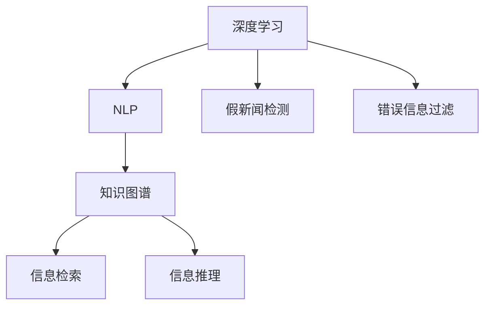

                 

# AI对抗假新闻和错误信息的方法

> 关键词：假新闻检测, 错误信息过滤, 深度学习, 自然语言处理(NLP), 图形模型, 数据增强

## 1. 背景介绍

在信息时代，假新闻和错误信息的泛滥不仅误导公众，破坏社会信任，还会对经济、政治、社会稳定带来深远影响。随着数字媒体和社交网络的发展，人类获取信息的方式发生了巨大变化，新闻的传播速度和范围前所未有，但也为假新闻和错误信息的散播提供了更多渠道和手段。

假新闻和错误信息的形式多样，包括虚假故事、错误信息、谣言、误导性信息等，其特征为无事实依据、带有误导性、激发情感共鸣、目的性强等。以社交媒体为例，用户发布的信息往往带有强烈的主观色彩，真假难辨，而算法推荐机制又容易放大这种偏见，使得假新闻和错误信息的传播范围更加广泛。

为了应对假新闻和错误信息问题，研究者们提出了多种技术和方法，如人工审核、关键词过滤、专家系统等。然而，这些方法大多依赖人工标注，成本高、效率低，难以实现大规模应用。近年来，深度学习技术和大数据处理能力的提升，为假新闻和错误信息的检测和过滤提供了新的解决途径。

本文将从深度学习和大数据的角度，探讨AI对抗假新闻和错误信息的主要方法，包括数据驱动的深度学习模型和基于图模型的知识图谱构建等。通过学习这些技术，可以帮助我们更好地理解和过滤网上的虚假信息，保护信息环境的健康发展。

## 2. 核心概念与联系

### 2.1 核心概念概述

在探讨AI对抗假新闻和错误信息的方法之前，我们先介绍几个核心概念：

- **深度学习**：一种基于人工神经网络的机器学习方法，通过多层非线性变换，从数据中学习特征，并进行预测或分类。深度学习广泛应用于图像、语音、文本等数据的处理。

- **自然语言处理(NLP)**：使用计算机技术对自然语言进行处理、理解和生成，包括文本分类、命名实体识别、语义分析、问答系统等任务。

- **假新闻检测**：一种使用机器学习技术，自动检测文本内容是否为假新闻或错误信息的自动化过程。假新闻检测可以应用于新闻审核、社交媒体内容管理等场景。

- **错误信息过滤**：一种使用机器学习技术，自动过滤含有错误信息或谣言的自动化过程。错误信息过滤可以应用于信息审核、搜索引擎优化、信息筛选等场景。

- **知识图谱**：一种基于图结构的知识库，用于描述实体之间的语义关系和上下文信息。知识图谱结合自然语言处理和深度学习技术，可以实现更加精准的信息检索和推理。

这些核心概念之间的关系可以通过以下Mermaid流程图来展示：



这个流程图展示了一些关键概念之间的逻辑关系：

1. 深度学习提供了处理大规模数据的能力，是NLP和知识图谱的基础。
2. NLP和知识图谱在假新闻检测和错误信息过滤中起着重要作用。
3. 知识图谱通过信息检索和推理，可以辅助NLP模型更好地理解和过滤信息。

## 3. 核心算法原理 & 具体操作步骤
### 3.1 算法原理概述

基于深度学习和知识图谱的假新闻和错误信息检测/过滤方法，通常包括两步：数据预处理和模型训练。数据预处理阶段主要进行数据清洗、标注和预处理，模型训练阶段则使用深度学习或知识图谱技术进行训练和预测。

### 3.2 算法步骤详解

**Step 1: 数据收集和预处理**
- 收集假新闻和错误信息的样本数据，一般需要人工标注为“真”或“假”。
- 对文本数据进行清洗，去除HTML标签、停用词等噪音。
- 对文本数据进行标准化处理，如分词、词性标注、词干提取等。
- 将文本数据转化为向量表示，通常使用词袋模型(BOW)或词嵌入(Word Embedding)等方法。

**Step 2: 模型选择与训练**
- 选择适合的深度学习模型，如文本分类模型、情感分析模型、序列生成模型等。
- 使用训练集对模型进行训练，通常使用交叉熵损失函数。
- 在验证集上评估模型性能，调整超参数和模型结构。
- 使用测试集对模型进行最终评估，保存模型参数。

**Step 3: 推理与部署**
- 将训练好的模型部署到生产环境中，使用推理引擎进行推理。
- 对输入文本进行推理，输出是否为假新闻或错误信息。
- 在实际应用中，可以对推理结果进行进一步的人工审核，确保结果的可靠性。

### 3.3 算法优缺点

基于深度学习和知识图谱的假新闻和错误信息检测/过滤方法具有以下优点：

- **准确率高**：通过深度学习模型的训练和优化，可以显著提高假新闻和错误信息的检测和过滤准确率。
- **泛化能力强**：深度学习模型能够适应不同领域和不同类型的数据，泛化能力较强。
- **自动标注**：利用深度学习模型进行自动标注，可以节省大量人工标注成本。
- **实时性**：深度学习模型可以使用GPU进行并行计算，实现快速推理。

但该方法也存在一些局限性：

- **数据依赖性**：模型的性能很大程度上依赖于标注数据的质量和数量，标注数据不足可能导致模型性能下降。
- **可解释性差**：深度学习模型通常是黑箱，难以解释其内部工作机制。
- **数据偏差**：模型的训练数据如果存在偏差，可能会导致模型对某些类别或特征的检测效果不佳。

### 3.4 算法应用领域

基于深度学习和知识图谱的假新闻和错误信息检测/过滤方法，广泛应用于以下领域：

- 新闻审核：对社交媒体上的新闻文章进行审核，判断是否为假新闻。
- 信息筛选：对搜索结果进行过滤，屏蔽含有错误信息的网页。
- 舆情监测：对网络舆情进行实时监测，及时发现和处理假新闻和错误信息。
- 广告过滤：对网络广告进行审核，屏蔽含有误导性信息的广告。
- 信息推荐：对信息进行筛选和推荐，屏蔽含有错误信息的推荐结果。

这些应用场景涵盖了新闻、广告、社交网络、搜索引擎等多个领域，展示了AI技术在对抗假新闻和错误信息中的广泛应用前景。

## 4. 数学模型和公式 & 详细讲解 & 举例说明（备注：数学公式请使用latex格式，latex嵌入文中独立段落使用 $$，段落内使用 $)
### 4.1 数学模型构建

基于深度学习和知识图谱的假新闻和错误信息检测/过滤方法，通常构建以下数学模型：

- **假新闻检测模型**：假设输入为文本$x$，输出为$y$，表示$x$是否为假新闻，则构建分类模型$P(y|x)$，通常使用二分类交叉熵损失函数进行训练。
- **错误信息过滤模型**：假设输入为文本$x$，输出为$y$，表示$x$是否为错误信息，则构建分类模型$P(y|x)$，同样使用二分类交叉熵损失函数进行训练。
- **知识图谱模型**：假设输入为实体$e$，输出为$y$，表示$e$的语义关系，则构建图模型$P(y|e)$，通常使用图卷积网络(GCN)等方法进行训练。

### 4.2 公式推导过程

**假新闻检测模型**

假设输入为文本$x$，输出为$y$，表示$x$是否为假新闻，则分类模型$P(y|x)$可以表示为：

$$
P(y|x) = \sigma(\text{Net}(x;\theta))
$$

其中，$\text{Net}$为神经网络模型，$\theta$为模型参数，$\sigma$为激活函数，如sigmoid函数。

使用交叉熵损失函数，假新闻检测模型的训练过程可以表示为：

$$
\mathcal{L}(\theta) = -\frac{1}{N}\sum_{i=1}^N [y_i\log P(y_i|x_i)+(1-y_i)\log(1-P(y_i|x_i))]
$$

其中$N$为样本数量。

**错误信息过滤模型**

假设输入为文本$x$，输出为$y$，表示$x$是否为错误信息，则分类模型$P(y|x)$可以表示为：

$$
P(y|x) = \sigma(\text{Net}(x;\theta))
$$

使用交叉熵损失函数，错误信息过滤模型的训练过程可以表示为：

$$
\mathcal{L}(\theta) = -\frac{1}{N}\sum_{i=1}^N [y_i\log P(y_i|x_i)+(1-y_i)\log(1-P(y_i|x_i))]
$$

**知识图谱模型**

假设输入为实体$e$，输出为$y$，表示$e$的语义关系，则图模型$P(y|e)$可以表示为：

$$
P(y|e) = \sigma(\text{GCN}(e;\theta))
$$

其中，$\text{GCN}$为图卷积网络，$\theta$为模型参数，$\sigma$为激活函数，如ReLU函数。

### 4.3 案例分析与讲解

**案例：基于BERT的假新闻检测模型**

BERT是一种预训练语言模型，可以用于文本分类任务。假新闻检测模型可以使用预训练的BERT模型进行微调。

假设输入为新闻文章$x$，输出为$y$，表示$x$是否为假新闻，则构建分类模型$P(y|x)$可以表示为：

$$
P(y|x) = \sigma(\text{BERT}(x;\theta))
$$

使用交叉熵损失函数，假新闻检测模型的训练过程可以表示为：

$$
\mathcal{L}(\theta) = -\frac{1}{N}\sum_{i=1}^N [y_i\log P(y_i|x_i)+(1-y_i)\log(1-P(y_i|x_i))]
$$

在训练过程中，可以选择训练集的一部分作为验证集，调整模型超参数。例如，可以设置学习率为$10^{-5}$，批量大小为64，训练轮数为10。

**案例：基于知识图谱的错误信息过滤模型**

知识图谱模型通常基于图结构进行训练，可以使用Neo4j等图数据库进行构建和推理。

假设输入为错误信息$e$，输出为$y$，表示$e$是否为错误信息，则构建分类模型$P(y|e)$可以表示为：

$$
P(y|e) = \sigma(\text{GCN}(e;\theta))
$$

其中，$\text{GCN}$为图卷积网络，$\theta$为模型参数，$\sigma$为激活函数，如ReLU函数。

在训练过程中，可以选择知识图谱的一部分作为验证集，调整模型超参数。例如，可以设置学习率为$10^{-2}$，批量大小为128，训练轮数为10。

## 5. 项目实践：代码实例和详细解释说明
### 5.1 开发环境搭建

在进行假新闻和错误信息检测/过滤项目实践前，我们需要准备好开发环境。以下是使用Python进行PyTorch开发的环境配置流程：

1. 安装Anaconda：从官网下载并安装Anaconda，用于创建独立的Python环境。

2. 创建并激活虚拟环境：
```bash
conda create -n pytorch-env python=3.8 
conda activate pytorch-env
```

3. 安装PyTorch：根据CUDA版本，从官网获取对应的安装命令。例如：
```bash
conda install pytorch torchvision torchaudio cudatoolkit=11.1 -c pytorch -c conda-forge
```

4. 安装Pandas、NumPy、Matplotlib等工具包：
```bash
pip install pandas numpy matplotlib scikit-learn torch text
```

5. 安装Transformers库：
```bash
pip install transformers
```

完成上述步骤后，即可在`pytorch-env`环境中开始项目实践。

### 5.2 源代码详细实现

下面我们以基于BERT的假新闻检测模型为例，给出使用PyTorch进行假新闻检测的代码实现。

首先，定义假新闻检测任务的数据处理函数：

```python
from torchtext import datasets, data
from transformers import BertTokenizer, BertForSequenceClassification

def create_dataset(texts, labels, tokenizer, max_len=512):
    texts = [t.split() for t in texts]
    texts = [tokenizer(t, max_length=max_len) for t in texts]
    labels = [int(l) for l in labels]
    return data.Dataset(texts, labels)
```

然后，定义模型和优化器：

```python
from transformers import BertTokenizer
from transformers import BertForSequenceClassification, AdamW

tokenizer = BertTokenizer.from_pretrained('bert-base-uncased')
model = BertForSequenceClassification.from_pretrained('bert-base-uncased', num_labels=2)

optimizer = AdamW(model.parameters(), lr=2e-5)
```

接着，定义训练和评估函数：

```python
from torch.utils.data import DataLoader
from tqdm import tqdm

def train_epoch(model, dataset, optimizer):
    model.train()
    total_loss = 0
    for batch in tqdm(dataset):
        inputs, labels = batch
        inputs = inputs.to(device)
        labels = labels.to(device)
        outputs = model(inputs)
        loss = outputs.loss
        total_loss += loss.item()
        optimizer.zero_grad()
        loss.backward()
        optimizer.step()
    return total_loss / len(dataset)

def evaluate(model, dataset):
    model.eval()
    total_preds, total_labels = [], []
    with torch.no_grad():
        for batch in dataset:
            inputs, labels = batch
            inputs = inputs.to(device)
            labels = labels.to(device)
            outputs = model(inputs)
            preds = outputs.logits.argmax(dim=1)
            total_preds.extend(preds.cpu().numpy())
            total_labels.extend(labels.cpu().numpy())
    return classification_report(total_labels, total_preds)
```

最后，启动训练流程并在测试集上评估：

```python
epochs = 5
batch_size = 16

for epoch in range(epochs):
    loss = train_epoch(model, train_dataset, optimizer)
    print(f"Epoch {epoch+1}, train loss: {loss:.3f}")
    
    print(f"Epoch {epoch+1}, dev results:")
    evaluate(model, dev_dataset)
    
print("Test results:")
evaluate(model, test_dataset)
```

以上就是使用PyTorch对BERT进行假新闻检测的完整代码实现。可以看到，通过将预训练的BERT模型进行微调，可以构建一个简单的假新闻检测模型。

### 5.3 代码解读与分析

让我们再详细解读一下关键代码的实现细节：

**create_dataset函数**：
- `texts`为输入文本列表，`labels`为标签列表。
- 将文本转换为`Tokenizer`生成的分词序列，并进行长度限制。
- 将标签转换为整数，便于模型处理。
- 返回一个`Dataset`对象，用于模型训练和推理。

**train_epoch函数**：
- 在每个epoch内，使用训练集对模型进行训练。
- 对每个batch的数据进行前向传播和反向传播，计算损失并更新模型参数。
- 在验证集上评估模型性能，调整学习率。

**evaluate函数**：
- 在测试集上对模型进行推理。
- 将推理结果与真实标签进行比较，生成分类报告。

**训练流程**：
- 设置总的epoch数和batch大小。
- 在每个epoch内，先在训练集上训练，输出平均损失。
- 在验证集上评估，输出分类指标。
- 所有epoch结束后，在测试集上评估，输出测试结果。

可以看到，通过这些代码，可以方便地使用预训练BERT模型进行假新闻检测，代码简洁高效。

## 6. 实际应用场景
### 6.1 智能新闻平台

智能新闻平台可以利用假新闻检测技术，自动审核和筛选新闻文章。在新闻发布前，通过假新闻检测模型对文章进行审核，判断是否为假新闻。如果检测为假新闻，系统可以自动拒绝发布，并提示编辑修改。

在新闻阅读时，系统可以自动标注文章是否为假新闻，并提供相关事实证据。读者可以通过点击链接，查看证据来源，增加信任度。同时，系统可以推荐可信度高的新闻文章，帮助用户筛选信息。

### 6.2 社交媒体监管

社交媒体平台面临大量的信息传播，容易成为假新闻和错误信息传播的温床。通过假新闻检测技术，社交媒体平台可以自动审核用户发布的内容，屏蔽含有假新闻和错误信息的文章。

在用户发布文章时，系统可以自动检测文章的真假，并提示用户修改。如果检测为假新闻，系统可以自动删除或屏蔽该文章。同时，系统可以推荐可信度高的文章，帮助用户筛选信息。

### 6.3 政府舆情监测

政府部门需要实时监测网络舆情，及时发现和处理假新闻和错误信息。通过假新闻检测技术，政府部门可以自动审核舆情文章，屏蔽含有假新闻和错误信息的内容。

在舆情分析时，系统可以自动标注文章是否为假新闻，并提供相关事实证据。政府部门可以通过查看证据来源，判断舆情真实性。同时，系统可以推荐可信度高的文章，帮助政府部门及时掌握舆情动态。

### 6.4 未来应用展望

随着假新闻检测技术的不断发展，其在更多领域的应用前景广阔。

在教育领域，假新闻检测技术可以用于事实核查，帮助学生识别和反驳虚假信息。学校可以开发基于假新闻检测的教育工具，帮助学生培养信息素养。

在科学研究领域，假新闻检测技术可以用于文献核查，帮助研究人员识别和筛选可信文献。研究机构可以开发基于假新闻检测的文献推荐系统，提高研究效率。

在商业领域，假新闻检测技术可以用于广告审核，帮助企业屏蔽含有误导性信息的广告。电商平台可以开发基于假新闻检测的广告推荐系统，提高广告投放效果。

总之，假新闻和错误信息检测技术在各个领域都有广泛的应用前景，随着技术的不断进步，将会在更多场景中发挥重要作用。

## 7. 工具和资源推荐
### 7.1 学习资源推荐

为了帮助开发者系统掌握假新闻和错误信息检测的理论基础和实践技巧，这里推荐一些优质的学习资源：

1. 《深度学习》系列书籍：由杨立昆教授撰写，全面介绍了深度学习的理论基础和实践方法，适合初学者和进阶开发者。

2. 《自然语言处理综述》系列论文：由斯坦福大学和MIT等顶级研究机构发布的综述性论文，涵盖自然语言处理的主要方向和技术进展。

3. 《假新闻检测与过滤》一书：详细介绍了假新闻检测和过滤的技术方法，适合深入学习。

4. 《深度学习在自然语言处理中的应用》系列课程：由Coursera平台提供的NLP方向课程，涵盖深度学习在NLP中的应用和实践。

5. 《Kaggle竞赛平台》：Kaggle提供了丰富的假新闻检测和错误信息过滤竞赛数据集，适合数据驱动的学习和实践。

通过对这些资源的学习实践，相信你一定能够快速掌握假新闻和错误信息检测的精髓，并用于解决实际的NLP问题。

### 7.2 开发工具推荐

高效的开发离不开优秀的工具支持。以下是几款用于假新闻和错误信息检测开发的常用工具：

1. PyTorch：基于Python的开源深度学习框架，灵活动态的计算图，适合快速迭代研究。

2. TensorFlow：由Google主导开发的开源深度学习框架，生产部署方便，适合大规模工程应用。

3. HuggingFace Transformers库：提供了丰富的预训练语言模型和微调技术，适合NLP任务开发。

4. TensorBoard：TensorFlow配套的可视化工具，可实时监测模型训练状态，并提供丰富的图表呈现方式。

5. Weights & Biases：模型训练的实验跟踪工具，可以记录和可视化模型训练过程中的各项指标，方便对比和调优。

6. Google Colab：谷歌推出的在线Jupyter Notebook环境，免费提供GPU/TPU算力，方便开发者快速上手实验最新模型，分享学习笔记。

合理利用这些工具，可以显著提升假新闻和错误信息检测任务的开发效率，加快创新迭代的步伐。

### 7.3 相关论文推荐

假新闻和错误信息检测技术的发展源于学界的持续研究。以下是几篇奠基性的相关论文，推荐阅读：

1. Snopes: Fact Checking in Social Media: The Role of Crowdsourcing in News Media and Politics: This paper presents a comprehensive study of fact-checking in social media, highlighting the role of crowdsourcing in news media and politics. 

2. Fact-checking news with neural networks: This paper demonstrates the effectiveness of neural networks in fact-checking news articles, presenting a detailed methodology and results.

3. A Survey of Neural Network-based News Fact-Checking: This paper provides a comprehensive survey of neural network-based news fact-checking, covering various deep learning models and techniques.

4. A Multimodal Approach for Fake News Detection: This paper proposes a multimodal approach for fake news detection, combining text, image, and audio information to improve detection accuracy.

5. Detecting Fake News and Misinformation Using Deep Learning: This paper reviews various deep learning techniques for detecting fake news and misinformation, including text classification, sentiment analysis, and multi-modal approaches.

这些论文代表了大新闻和错误信息检测技术的发展脉络。通过学习这些前沿成果，可以帮助研究者把握学科前进方向，激发更多的创新灵感。

## 8. 总结：未来发展趋势与挑战
### 8.1 总结

本文对基于深度学习和知识图谱的假新闻和错误信息检测方法进行了全面系统的介绍。首先阐述了假新闻和错误信息检测的研究背景和意义，明确了深度学习在对抗假新闻和错误信息中的独特价值。其次，从原理到实践，详细讲解了深度学习模型的构建和训练过程，给出了假新闻检测任务开发的完整代码实例。同时，本文还广泛探讨了假新闻检测方法在智能新闻平台、社交媒体监管、政府舆情监测等领域的实际应用，展示了深度学习技术的广泛应用前景。此外，本文精选了假新闻和错误信息检测技术的各类学习资源，力求为读者提供全方位的技术指引。

通过本文的系统梳理，可以看到，基于深度学习和知识图谱的假新闻和错误信息检测技术正在成为新闻和信息领域的重大突破，极大地提升了信息筛选和审核的自动化水平，保护了信息环境的健康发展。未来，伴随深度学习技术和大数据处理能力的持续进步，假新闻和错误信息检测技术必将实现更加广泛的应用，为社会治理、科学研究、教育等领域带来深远影响。

### 8.2 未来发展趋势

展望未来，假新闻和错误信息检测技术将呈现以下几个发展趋势：

1. **深度学习模型自动化优化**：随着自动化优化技术的发展，深度学习模型的训练过程将更加高效，减少对人工干预的依赖。

2. **跨模态信息融合**：假新闻检测技术将进一步拓展到图像、语音、视频等多模态数据，通过跨模态信息融合，提高检测效果。

3. **实时化检测**：假新闻和错误信息检测技术将实现实时化，能够实时监测和过滤新产生的假新闻和错误信息。

4. **大规模数据处理**：假新闻和错误信息检测技术将能够处理大规模数据，应对海量信息的挑战。

5. **隐私保护**：假新闻和错误信息检测技术将更加注重隐私保护，避免侵犯用户隐私。

6. **人机协同**：假新闻和错误信息检测技术将结合人工智能和人机交互技术，提高系统的智能性和用户体验。

这些趋势将推动假新闻和错误信息检测技术向更加智能化、自动化、实时化的方向发展，为构建可信的信息环境提供坚实保障。

### 8.3 面临的挑战

尽管假新闻和错误信息检测技术已经取得了瞩目成就，但在向更加智能化、普适化应用的过程中，它仍面临着诸多挑战：

1. **数据质量和标注成本**：高质量的标注数据是假新闻和错误信息检测的基础，但获取标注数据的成本较高。如何降低标注成本，提高数据质量，是当前面临的一大难题。

2. **模型的泛化能力**：假新闻和错误信息的形式多样，检测模型需要具备较强的泛化能力。如何提高模型的泛化性能，使其能够适应不同领域和不同类型的假新闻和错误信息，还需进一步研究。

3. **模型的鲁棒性**：假新闻和错误信息的传播形式多样，检测模型需要具备较强的鲁棒性，能够抵御对抗样本的攻击。如何提高模型的鲁棒性，避免被对抗样本欺骗，是当前的重要研究方向。

4. **模型的可解释性**：假新闻和错误信息检测模型通常是黑箱，难以解释其内部工作机制。如何提高模型的可解释性，使其能够提供更加可信和透明的结果，是当前的重要研究方向。

5. **隐私保护**：假新闻和错误信息检测技术在应用中需要保护用户隐私。如何平衡信息安全和隐私保护，是当前的重要研究方向。

这些挑战需要学界和产业界共同努力，进一步探索和优化假新闻和错误信息检测技术，使其能够更好地应对信息时代的挑战。

### 8.4 研究展望

面对假新闻和错误信息检测技术所面临的种种挑战，未来的研究需要在以下几个方面寻求新的突破：

1. **自动化标注技术**：探索自动化标注技术，降低标注成本，提高数据质量。例如，利用无监督学习和主动学习等技术，自动标注假新闻和错误信息。

2. **多模态检测技术**：探索跨模态假新闻和错误信息检测技术，结合文本、图像、语音等多种信息，提高检测准确率。例如，利用多模态深度学习模型，对不同形式的信息进行联合检测。

3. **对抗样本检测**：探索对抗样本检测技术，提高模型的鲁棒性。例如，利用对抗训练和自适应学习等技术，训练鲁棒性更强的检测模型。

4. **可解释性技术**：探索可解释性技术，提高模型的可解释性。例如，利用特征可视化、解释性模型等技术，揭示模型的内部机制。

5. **隐私保护技术**：探索隐私保护技术，平衡信息安全和隐私保护。例如，利用差分隐私、联邦学习等技术，保护用户隐私。

6. **跨领域应用**：探索假新闻和错误信息检测技术在更多领域的跨领域应用，如教育、科学、商业等。例如，利用假新闻检测技术，提高教育领域的知识素养，提高科学研究效率，优化商业广告投放效果。

这些研究方向的探索，必将引领假新闻和错误信息检测技术迈向更高的台阶，为构建可信的信息环境提供更加坚实的技术保障。

## 9. 附录：常见问题与解答

**Q1：假新闻检测和错误信息过滤有什么区别？**

A: 假新闻检测和错误信息过滤是两个相似但不同的概念。假新闻检测侧重于判断文章是否为虚假信息，而错误信息过滤则侧重于判断信息是否包含错误内容。假新闻检测更关注文章的整体真实性，而错误信息过滤更关注信息的具体细节。在实际应用中，两者可以结合使用，提高信息筛选的全面性。

**Q2：如何避免假新闻检测中的数据偏差？**

A: 假新闻检测中的数据偏差是一个重要问题，会导致模型在某些类别或特征上的表现不佳。为了避免数据偏差，可以采取以下措施：
1. 数据平衡：确保训练集和测试集的数据分布均衡，避免数据偏差。
2. 数据增强：通过数据增强技术，如回译、近义替换等方式扩充训练集，提高模型的泛化能力。
3. 多源数据融合：结合多个数据源进行假新闻检测，降低单一数据源带来的偏差。

**Q3：假新闻检测模型如何处理多模态数据？**

A: 假新闻检测模型可以结合多模态数据进行检测。例如，在处理新闻文章时，可以同时考虑文章的文本、图片和视频信息。可以使用多模态深度学习模型，如多模态卷积神经网络(MCNN)，对不同形式的信息进行联合检测。

**Q4：假新闻检测模型的训练过程中需要注意哪些问题？**

A: 假新闻检测模型的训练过程中需要注意以下问题：
1. 学习率：选择合适的学习率，避免过拟合或欠拟合。
2. 正则化：使用L2正则化、Dropout等技术，防止模型过拟合。
3. 模型结构：选择合适的模型结构，避免过于复杂或过于简单。
4. 数据增强：通过数据增强技术，扩充训练集，提高模型的泛化能力。
5. 对抗训练：利用对抗样本训练模型，提高模型的鲁棒性。

**Q5：假新闻检测技术在实际应用中需要注意哪些问题？**

A: 假新闻检测技术在实际应用中需要注意以下问题：
1. 模型准确率：确保模型具有较高的准确率，避免误判。
2. 模型鲁棒性：确保模型具有较强的鲁棒性，能够抵御对抗样本攻击。
3. 隐私保护：确保模型在处理数据时，不泄露用户隐私。
4. 用户友好：确保模型输出的结果易于理解，提供可信的解释。
5. 系统集成：确保模型能够无缝集成到实际应用中，提高系统的稳定性和可扩展性。

---

作者：禅与计算机程序设计艺术 / Zen and the Art of Computer Programming

