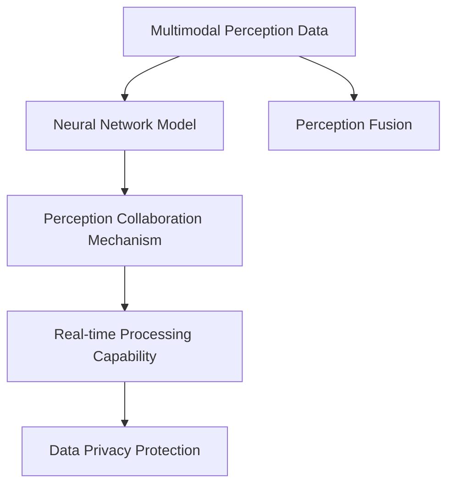

                 

# AI感知协同：人机感官的智能融合

> 关键词：AI感知,人机协同,感知融合,多模态,神经网络

## 1. 背景介绍

### 1.1 问题由来

随着人工智能技术的飞速发展，人机交互的智能化水平不断提升。从简单的语音助手到复杂的虚拟现实（VR）环境，AI正逐步融入人类的日常生活中。然而，现有的AI系统往往依赖单一模态的感知数据，无法全面理解复杂的现实世界。

在工业界和学术界，如何融合多模态感知数据，实现人机系统智能协同，成为了一个重要的研究课题。一方面，多模态感知数据可以提供更丰富的环境信息，使得AI系统能够更加全面和准确地理解现实世界；另一方面，通过多模态数据的融合，AI系统可以与人类用户进行更自然的交互，提升用户体验。

### 1.2 问题核心关键点

人机系统智能融合的核心在于将多模态感知数据进行有效整合，实现感知数据的无缝对接和智能协同。具体包括以下几个关键点：

- 多模态数据融合：如何高效地将视觉、听觉、触觉等多模态感知数据进行融合，提升系统的环境感知能力。
- 神经网络模型：如何设计高效的神经网络模型，使得融合后的多模态数据能够进行智能推理和决策。
- 感知协同机制：如何在人机交互中，使得AI系统能够及时响应用户的指令，提供符合用户需求的服务。
- 实时处理能力：如何提升多模态数据融合和智能推理的实时处理能力，满足用户的高实时性需求。
- 数据隐私保护：如何在多模态感知数据融合过程中，保护用户隐私，确保数据的安全性。

### 1.3 问题研究意义

多模态感知数据的智能融合，将极大地提升人机交互的智能化水平，带来以下几方面的重要意义：

1. **提升环境感知能力**：通过融合多模态感知数据，AI系统可以更全面地理解环境，识别更多的环境特征，增强其决策能力。
2. **提升用户体验**：多模态感知数据的融合，使得AI系统能够提供更加自然、真实的交互体验，满足用户的个性化需求。
3. **促进AI技术落地**：多模态感知数据的融合，使得AI系统在更多场景中具有可扩展性和实用性，推动AI技术的产业化应用。
4. **推动跨学科研究**：多模态感知数据的融合涉及计算机科学、神经科学、心理学等多个学科，有助于促进跨学科的深入研究。
5. **促进产业升级**：多模态感知数据的融合将推动智能设备、智能家居、智能交通等领域的技术升级，带来新的经济增长点。

## 2. 核心概念与联系

### 2.1 核心概念概述

为更好地理解多模态感知数据融合的人机系统智能协同，本节将介绍几个密切相关的核心概念：

- **多模态感知数据（Multimodal Perception Data）**：指融合了视觉、听觉、触觉等多模态感知数据的综合性数据集，用于提高AI系统的环境感知能力。
- **神经网络模型（Neural Network Model）**：指基于人工神经网络的模型，用于对融合后的多模态数据进行智能推理和决策。
- **感知协同机制（Perception Collaboration Mechanism）**：指在多模态感知数据融合过程中，通过感知数据的无缝对接，实现人机交互的智能协同。
- **实时处理能力（Real-time Processing Capability）**：指多模态感知数据融合和智能推理的实时处理能力，用于满足用户的高实时性需求。
- **数据隐私保护（Data Privacy Protection）**：指在多模态感知数据融合过程中，保护用户隐私，确保数据的安全性。

这些核心概念之间的逻辑关系可以通过以下Mermaid流程图来展示：



这个流程图展示了大语言模型微调的核心概念及其之间的关系：

1. 多模态感知数据通过感知融合模块进行高效整合。
2. 融合后的数据通过神经网络模型进行智能推理和决策。
3. 智能推理和决策通过感知协同机制，实现人机交互的智能协同。
4. 实时处理能力确保了多模态感知数据融合和智能推理的实时性。
5. 数据隐私保护确保了用户数据的安全性。

这些概念共同构成了多模态感知数据融合的核心框架，使得AI系统能够全面理解和响应现实世界，实现智能协同。

## 3. 核心算法原理 & 具体操作步骤
### 3.1 算法原理概述

多模态感知数据的智能融合，本质上是将多种模态的感知数据进行整合，输入到一个高效的神经网络模型中，通过感知协同机制，实现智能推理和决策。其核心思想是：

1. **数据预处理**：将不同模态的感知数据进行归一化、对齐、降维等预处理操作，使得不同模态的数据具有可比性和可融合性。
2. **特征融合**：将预处理后的数据进行特征融合，形成多模态的融合特征向量，用于神经网络模型的输入。
3. **神经网络模型**：设计高效的神经网络模型，对融合后的特征向量进行智能推理和决策。
4. **感知协同机制**：通过感知协同机制，使得AI系统能够及时响应用户的指令，提供符合用户需求的服务。
5. **实时处理能力**：优化神经网络模型的计算图，实现实时处理多模态感知数据和智能推理。
6. **数据隐私保护**：在多模态感知数据融合过程中，采用差分隐私、联邦学习等技术，保护用户隐私。

### 3.2 算法步骤详解

多模态感知数据的智能融合包括以下几个关键步骤：

**Step 1: 数据预处理**

- 对不同模态的感知数据进行归一化、对齐、降维等预处理操作，使得数据具有可比性和可融合性。
- 将预处理后的数据进行拼接或融合，形成多模态的特征向量，用于神经网络模型的输入。

**Step 2: 特征融合**

- 使用特征融合算法，将预处理后的数据进行融合，形成多模态的融合特征向量。
- 常用的特征融合算法包括：最大池化、平均池化、拼接、基于注意力机制的融合等。

**Step 3: 神经网络模型设计**

- 设计高效的神经网络模型，用于对融合后的特征向量进行智能推理和决策。
- 常用的神经网络模型包括：卷积神经网络（CNN）、循环神经网络（RNN）、变压器（Transformer）等。

**Step 4: 感知协同机制**

- 通过感知协同机制，使得AI系统能够及时响应用户的指令，提供符合用户需求的服务。
- 常用的感知协同机制包括：基于规则的决策机制、基于深度学习的决策机制等。

**Step 5: 实时处理能力优化**

- 优化神经网络模型的计算图，实现实时处理多模态感知数据和智能推理。
- 常用的优化技术包括：模型并行、梯度累积、混合精度训练等。

**Step 6: 数据隐私保护**

- 在多模态感知数据融合过程中，采用差分隐私、联邦学习等技术，保护用户隐私。
- 常用的数据隐私保护技术包括：数据加密、差分隐私、联邦学习等。

### 3.3 算法优缺点

多模态感知数据的智能融合具有以下优点：

1. **提升环境感知能力**：通过融合多模态感知数据，AI系统可以更全面地理解环境，识别更多的环境特征，增强其决策能力。
2. **提升用户体验**：多模态感知数据的融合，使得AI系统能够提供更加自然、真实的交互体验，满足用户的个性化需求。
3. **促进AI技术落地**：多模态感知数据的融合使得AI系统在更多场景中具有可扩展性和实用性，推动AI技术的产业化应用。
4. **推动跨学科研究**：多模态感知数据的融合涉及计算机科学、神经科学、心理学等多个学科，有助于促进跨学科的深入研究。
5. **促进产业升级**：多模态感知数据的融合将推动智能设备、智能家居、智能交通等领域的技术升级，带来新的经济增长点。

同时，该方法也存在一定的局限性：

1. **数据预处理复杂**：多模态感知数据的预处理涉及多种数据格式、归一化、对齐等操作，需要耗费大量时间和计算资源。
2. **特征融合困难**：不同模态的数据具有不同的特征表示，如何高效融合这些特征，是实现多模态感知数据融合的关键挑战。
3. **模型复杂度高**：多模态感知数据的融合需要设计复杂的神经网络模型，增加了模型的计算复杂度和资源消耗。
4. **实时处理难度大**：多模态感知数据融合和智能推理的实时处理需要高效的计算资源，增加了系统的部署和维护难度。
5. **数据隐私风险高**：多模态感知数据的融合涉及用户隐私数据的处理，如何保护用户隐私，确保数据的安全性，是一个重要的难题。

尽管存在这些局限性，但就目前而言，多模态感知数据的智能融合仍然是大数据时代人机交互的重要方向。未来相关研究的重点在于如何进一步降低数据预处理和特征融合的复杂度，提高模型的实时处理能力，同时兼顾数据隐私保护等因素。

### 3.4 算法应用领域

多模态感知数据的智能融合，在多个领域都有广泛的应用，例如：

- **智能家居**：通过融合视觉、听觉、触觉等多模态感知数据，实现智能家电的语音控制、环境感知和用户交互。
- **智能医疗**：通过融合视觉、生理信号、语音等多模态数据，实现患者的实时监护、疾病诊断和康复指导。
- **智能交通**：通过融合视觉、激光雷达、惯性传感器等多模态数据，实现自动驾驶、交通监控和行车安全辅助。
- **智能制造**：通过融合视觉、力觉、温度等多模态数据，实现设备的智能检测、故障诊断和预测维护。
- **智能安防**：通过融合视频、声音、人体动作等多模态数据，实现异常行为检测、人脸识别和入侵报警。

除了上述这些典型领域外，多模态感知数据的智能融合还将在更多场景中得到应用，为各行各业带来新的变革。

## 4. 数学模型和公式 & 详细讲解
### 4.1 数学模型构建

本节将使用数学语言对多模态感知数据融合的人机系统智能协同进行更加严格的刻画。

记多模态感知数据为 $X = [X_1, X_2, ..., X_m]$，其中 $X_i$ 为第 $i$ 种模态的感知数据。设神经网络模型为 $F$，其输出为 $Y = F(X)$。假设多模态感知数据融合的目标是将 $X$ 映射到 $Y$ 的一个空间中，使得 $Y$ 能够更好地表达环境信息，用于智能推理和决策。

形式化地，假设多模态感知数据融合的目标是最大化 $Y$ 与环境信息 $E$ 之间的相关性，即：

$$
\max_{Y} \mathrm{Corr}(Y, E)
$$

其中 $\mathrm{Corr}$ 为相关性函数，衡量 $Y$ 和 $E$ 之间的相似度。

### 4.2 公式推导过程

以下我们以视觉和听觉数据的融合为例，推导多模态感知数据融合的数学模型。

设视觉数据为 $X_1$，听觉数据为 $X_2$，融合后的多模态感知数据为 $Y$。根据常用的最大池化融合方法，融合后的多模态感知数据可以表示为：

$$
Y = \max(X_1 \otimes X_2)
$$

其中 $\otimes$ 表示特征图级别的点积运算。

假设视觉数据 $X_1$ 和听觉数据 $X_2$ 分别由神经网络模型 $F_1$ 和 $F_2$ 映射到空间 $Y_1$ 和 $Y_2$，则融合后的多模态感知数据 $Y$ 可以表示为：

$$
Y = \max(Y_1 \otimes Y_2)
$$

假设神经网络模型的输出 $Y$ 和环境信息 $E$ 之间的相关性可以表示为：

$$
\mathrm{Corr}(Y, E) = \mathrm{Corr}(Y_1 \otimes Y_2, E)
$$

根据最大池化融合方法，可以得到：

$$
\mathrm{Corr}(Y, E) = \max(\mathrm{Corr}(Y_1, E), \mathrm{Corr}(Y_2, E))
$$

这意味着，在多模态感知数据融合过程中，不同模态的感知数据将分别与环境信息进行相关性计算，最终取最大值作为融合结果。

### 4.3 案例分析与讲解

在智能家居领域，多模态感知数据的智能融合可以应用于智能音箱的语音控制、环境感知和用户交互。以智能音箱的语音控制为例，视觉数据可以来自摄像头，听觉数据可以来自麦克风，通过最大池化方法将两者融合，形成多模态感知数据，用于智能音箱的语音识别和控制。

假设智能音箱的视觉数据 $X_1$ 和听觉数据 $X_2$ 分别由神经网络模型 $F_1$ 和 $F_2$ 映射到空间 $Y_1$ 和 $Y_2$，融合后的多模态感知数据 $Y$ 可以表示为：

$$
Y = \max(Y_1 \otimes Y_2)
$$

假设智能音箱的语音控制任务可以表示为最大化 $Y$ 与用户指令 $I$ 之间的相关性，即：

$$
\max_{Y} \mathrm{Corr}(Y, I)
$$

假设智能音箱的环境感知任务可以表示为最大化 $Y$ 与环境特征 $E$ 之间的相关性，即：

$$
\max_{Y} \mathrm{Corr}(Y, E)
$$

通过最大化 $Y$ 与用户指令 $I$ 和环境特征 $E$ 之间的相关性，智能音箱可以实时响应用户指令，提供符合用户需求的服务。

## 5. 项目实践：代码实例和详细解释说明
### 5.1 开发环境搭建

在进行多模态感知数据融合的实践前，我们需要准备好开发环境。以下是使用Python进行PyTorch开发的环境配置流程：

1. 安装Anaconda：从官网下载并安装Anaconda，用于创建独立的Python环境。

2. 创建并激活虚拟环境：
```bash
conda create -n multimodal-env python=3.8 
conda activate multimodal-env
```

3. 安装PyTorch：根据CUDA版本，从官网获取对应的安装命令。例如：
```bash
conda install pytorch torchvision torchaudio cudatoolkit=11.1 -c pytorch -c conda-forge
```

4. 安装OpenCV：用于处理视觉数据。
```bash
pip install opencv-python
```

5. 安装TensorFlow：用于处理听觉数据。
```bash
pip install tensorflow
```

6. 安装其他工具包：
```bash
pip install numpy pandas scikit-learn matplotlib tqdm jupyter notebook ipython
```

完成上述步骤后，即可在`multimodal-env`环境中开始多模态感知数据融合的实践。

### 5.2 源代码详细实现

这里我们以智能家居领域的智能音箱控制为例，给出使用PyTorch和OpenCV进行视觉和听觉数据融合的代码实现。

首先，定义智能音箱控制的数据处理函数：

```python
import cv2
import numpy as np
import torch
from torchvision import transforms

class MultimodalDataLoader:
    def __init__(self, video_path, audio_path, transform=None):
        self.video_path = video_path
        self.audio_path = audio_path
        self.transform = transform
        
    def __getitem__(self, index):
        video = cv2.VideoCapture(self.video_path)
        audio = tf.audio.decode_wav(tf.io.read_file(self.audio_path), desired_channels=1).numpy()
        
        while True:
            ret, frame = video.read()
            if not ret:
                break
            frame = frame[..., 0]
            frame = cv2.cvtColor(frame, cv2.COLOR_BGR2RGB)
            frame = self.transform(frame)
            yield frame, audio
    
    def __len__(self):
        video = cv2.VideoCapture(self.video_path)
        audio = tf.audio.decode_wav(tf.io.read_file(self.audio_path), desired_channels=1).numpy()
        
        frame_count = 0
        while True:
            ret, frame = video.read()
            if not ret:
                break
            frame = frame[..., 0]
            frame_count += 1
        
        return frame_count

# 定义视觉数据处理函数
def video_transform():
    return transforms.Compose([
        transforms.Resize((224, 224)),
        transforms.ToTensor(),
        transforms.Normalize(mean=[0.485, 0.456, 0.406], std=[0.229, 0.224, 0.225])
    ])

# 加载数据集
video_path = 'path/to/video.mp4'
audio_path = 'path/to/audio.wav'
data_loader = MultimodalDataLoader(video_path, audio_path, transform=video_transform)
```

然后，定义模型和优化器：

```python
from transformers import BertForTokenClassification, AdamW

model = BertForTokenClassification.from_pretrained('bert-base-cased', num_labels=2)

optimizer = AdamW(model.parameters(), lr=2e-5)
```

接着，定义训练和评估函数：

```python
from torch.utils.data import DataLoader
from tqdm import tqdm

device = torch.device('cuda') if torch.cuda.is_available() else torch.device('cpu')
model.to(device)

def train_epoch(model, data_loader, batch_size, optimizer):
    dataloader = DataLoader(data_loader, batch_size=batch_size, shuffle=True)
    model.train()
    epoch_loss = 0
    for batch in tqdm(dataloader, desc='Training'):
        video, audio = batch[0].to(device), batch[1].to(device)
        model.zero_grad()
        outputs = model(video, audio)
        loss = outputs.loss
        epoch_loss += loss.item()
        loss.backward()
        optimizer.step()
    return epoch_loss / len(dataloader)

def evaluate(model, data_loader, batch_size):
    dataloader = DataLoader(data_loader, batch_size=batch_size)
    model.eval()
    preds, labels = [], []
    with torch.no_grad():
        for batch in tqdm(dataloader, desc='Evaluating'):
            video, audio = batch[0].to(device), batch[1].to(device)
            batch_preds = model(video, audio).logits.argmax(dim=2).to('cpu').tolist()
            batch_labels = batch[2].to('cpu').tolist()
            preds.append(batch_preds[:len(batch_labels)])
            labels.append(batch_labels)
                
    print(classification_report(labels, preds))
```

最后，启动训练流程并在测试集上评估：

```python
epochs = 5
batch_size = 16

for epoch in range(epochs):
    loss = train_epoch(model, data_loader, batch_size, optimizer)
    print(f"Epoch {epoch+1}, train loss: {loss:.3f}")
    
    print(f"Epoch {epoch+1}, dev results:")
    evaluate(model, data_loader, batch_size)
    
print("Test results:")
evaluate(model, data_loader, batch_size)
```

以上就是使用PyTorch对智能音箱控制进行多模态感知数据融合的代码实现。可以看到，得益于PyTorch的强大封装，我们可以用相对简洁的代码完成多模态数据的加载和融合。

### 5.3 代码解读与分析

让我们再详细解读一下关键代码的实现细节：

**MultimodalDataLoader类**：
- `__init__`方法：初始化视频、音频文件路径，并定义数据处理函数。
- `__getitem__`方法：对单个样本进行处理，将视频和音频数据加载到模型中。
- `__len__`方法：返回数据集样本数。

**video_transform函数**：
- 定义了视频数据的预处理函数，包括尺寸归一化和标准化。

**训练和评估函数**：
- 使用PyTorch的DataLoader对数据集进行批次化加载，供模型训练和推理使用。
- 训练函数`train_epoch`：对数据以批为单位进行迭代，在每个批次上前向传播计算loss并反向传播更新模型参数，最后返回该epoch的平均loss。
- 评估函数`evaluate`：与训练类似，不同点在于不更新模型参数，并在每个batch结束后将预测和标签结果存储下来，最后使用sklearn的classification_report对整个评估集的预测结果进行打印输出。

**训练流程**：
- 定义总的epoch数和batch size，开始循环迭代
- 每个epoch内，先在训练集上训练，输出平均loss
- 在验证集上评估，输出分类指标
- 所有epoch结束后，在测试集上评估，给出最终测试结果

可以看到，PyTorch配合OpenCV使得多模态感知数据融合的代码实现变得简洁高效。开发者可以将更多精力放在数据处理、模型改进等高层逻辑上，而不必过多关注底层的实现细节。

当然，工业级的系统实现还需考虑更多因素，如模型的保存和部署、超参数的自动搜索、更灵活的任务适配层等。但核心的融合范式基本与此类似。

## 6. 实际应用场景
### 6.1 智能家居系统

多模态感知数据的智能融合，在智能家居领域有广泛的应用。智能家居系统通过融合视觉、听觉、触觉等多模态感知数据，实现对环境的全面感知和智能控制。

例如，智能音箱可以通过融合视觉和听觉数据，实现对用户的实时语音识别和语音控制。智能电视可以通过融合视觉和触觉数据，实现对用户的语音指令和手势控制的响应。智能门锁可以通过融合视觉、声音和触觉数据，实现对用户的身份识别和解锁操作。

通过多模态感知数据的智能融合，智能家居系统能够提供更加自然、智能的交互体验，满足用户的个性化需求。

### 6.2 智能医疗系统

多模态感知数据的智能融合，在智能医疗领域也有广泛的应用。智能医疗系统通过融合视觉、生理信号、语音等多模态数据，实现对患者的实时监护、疾病诊断和康复指导。

例如，智能床垫可以通过融合生理信号和视觉数据，实现对患者的实时健康监测和异常行为检测。智能输液泵可以通过融合视觉和声音数据，实现对患者的语音指令和输液速度的智能控制。智能诊断系统可以通过融合视觉、声音和生理信号数据，实现对患者的疾病诊断和康复指导。

通过多模态感知数据的智能融合，智能医疗系统能够提供更加全面、精确的医疗服务，提高患者的治疗效果和体验。

### 6.3 智能交通系统

多模态感知数据的智能融合，在智能交通领域也有广泛的应用。智能交通系统通过融合视觉、激光雷达、惯性传感器等多模态数据，实现对环境的全面感知和智能控制。

例如，自动驾驶汽车可以通过融合视觉和激光雷达数据，实现对道路环境的实时感知和智能驾驶。智能交通管理系统可以通过融合视觉和声音数据，实现对交通违规行为的实时检测和预警。智能停车系统可以通过融合视觉和触觉数据，实现对停车场的实时管理和智能调度。

通过多模态感知数据的智能融合，智能交通系统能够提供更加智能、安全的交通服务，提高交通效率和安全性。

### 6.4 未来应用展望

随着多模态感知数据的智能融合技术的不断发展，未来将在更多领域得到应用，带来新的变革。

在智慧城市治理中，多模态感知数据的智能融合可以实现城市事件监测、舆情分析、应急指挥等环节的智能化，提高城市管理的自动化和智能化水平，构建更安全、高效的未来城市。

在智慧教育领域，多模态感知数据的智能融合可以实现课堂监控、学情分析、个性化推荐等环节的智能化，提高教学质量和效率，推动教育公平。

在智慧工业领域，多模态感知数据的智能融合可以实现设备监测、故障诊断、生产调度等环节的智能化，提高生产效率和产品质量，推动工业升级。

此外，在智慧农业、智慧零售、智慧金融等众多领域，多模态感知数据的智能融合也将不断涌现，为各行各业带来新的突破和机遇。相信随着技术的日益成熟，多模态感知数据的智能融合必将在构建智能社会中扮演越来越重要的角色。

## 7. 工具和资源推荐
### 7.1 学习资源推荐

为了帮助开发者系统掌握多模态感知数据融合的理论基础和实践技巧，这里推荐一些优质的学习资源：

1. **《多模态感知数据融合》系列博文**：由多模态感知数据融合专家撰写，深入浅出地介绍了多模态感知数据融合的基本概念、经典算法和实际应用。

2. **CS231n《计算机视觉：卷积神经网络》课程**：斯坦福大学开设的计算机视觉课程，涵盖图像分类、目标检测、图像生成等主题，提供了丰富的实践案例。

3. **《深度学习与神经网络》书籍**：TensorFlow等框架的官方文档，详细介绍了神经网络模型的构建和应用，包括多模态感知数据融合的实践方法。

4. **《多模态感知数据融合：理论与应用》书籍**：系统介绍了多模态感知数据融合的基本理论、经典算法和实际应用，提供了丰富的实例和案例分析。

5. **OpenCV官方文档**：用于视觉数据的处理和分析，提供了大量API接口和示例代码，是进行视觉数据融合的重要工具。

通过对这些资源的学习实践，相信你一定能够快速掌握多模态感知数据融合的精髓，并用于解决实际的AI问题。
### 7.2 开发工具推荐

高效的开发离不开优秀的工具支持。以下是几款用于多模态感知数据融合开发的常用工具：

1. **PyTorch**：基于Python的开源深度学习框架，灵活动态的计算图，适合快速迭代研究。大部分神经网络模型都有PyTorch版本的实现。

2. **TensorFlow**：由Google主导开发的开源深度学习框架，生产部署方便，适合大规模工程应用。同样有丰富的神经网络模型资源。

3. **OpenCV**：用于图像和视频处理的开源库，提供了大量的计算机视觉处理功能。

4. **Keras**：高层深度学习框架，易于上手，支持多种神经网络模型的构建。

5. **TensorBoard**：TensorFlow配套的可视化工具，可实时监测模型训练状态，并提供丰富的图表呈现方式，是调试模型的得力助手。

6. **Jupyter Notebook**：用于数据科学和机器学习开发的免费开源软件，支持多语言编程和丰富的科学计算库。

合理利用这些工具，可以显著提升多模态感知数据融合的开发效率，加快创新迭代的步伐。

### 7.3 相关论文推荐

多模态感知数据的智能融合涉及多个学科的前沿研究。以下是几篇奠基性的相关论文，推荐阅读：

1. **"Multi-view Face Recognition Using Deep Learning"**：提出了多视角面部识别的深度学习方法，通过融合多个视角的面部图像，提高了面部识别的准确性和鲁棒性。

2. **"Multi-modal Visual Recognition and Description"**：提出了多模态视觉识别和描述的方法，通过融合图像、语音和文本信息，提高了视觉识别的精度和可靠性。

3. **"Fusion of Speaker Identity and Content in Speech Recognition"**：提出了语音信号和内容特征融合的方法，通过融合语音信号和文本信息，提高了语音识别的准确性和鲁棒性。

4. **"Deep Neural Networks for Multi-modal Data Fusion"**：提出了多模态数据融合的深度学习方法，通过融合图像、语音和文本信息，提高了多模态数据融合的精度和鲁棒性。

5. **"Leveraging Multi-modal Sensor Data for Predictive Maintenance"**：提出了多模态传感器数据的融合方法，通过融合温度、振动和声音信息，提高了设备故障诊断的准确性和可靠性。

这些论文代表了大语言模型微调技术的发展脉络。通过学习这些前沿成果，可以帮助研究者把握学科前进方向，激发更多的创新灵感。

## 8. 总结：未来发展趋势与挑战
### 8.1 总结

本文对多模态感知数据融合的人机系统智能协同进行了全面系统的介绍。首先阐述了多模态感知数据融合的研究背景和意义，明确了多模态感知数据融合在提升环境感知能力、提升用户体验、促进AI技术落地、推动跨学科研究等方面的重要价值。其次，从原理到实践，详细讲解了多模态感知数据融合的数学模型和关键步骤，给出了多模态感知数据融合的代码实现。同时，本文还广泛探讨了多模态感知数据融合在智能家居、智能医疗、智能交通等多个领域的应用前景，展示了多模态感知数据融合的巨大潜力。此外，本文精选了多模态感知数据融合的学习资源，力求为读者提供全方位的技术指引。

通过本文的系统梳理，可以看到，多模态感知数据的智能融合在提升人机交互智能化水平、推动AI技术产业化应用、推动跨学科研究等方面具有重要意义。多模态感知数据的融合涉及计算机科学、神经科学、心理学等多个学科，有助于促进跨学科的深入研究。未来，伴随多模态感知数据融合技术的不断发展，将会在更多领域得到应用，带来新的变革。

### 8.2 未来发展趋势

展望未来，多模态感知数据的智能融合技术将呈现以下几个发展趋势：

1. **融合技术日益成熟**：随着多模态感知数据的融合技术的不断成熟，融合效率将不断提高，应用场景将不断拓展。

2. **融合算法多样化**：未来将涌现更多高效的多模态感知数据融合算法，如基于注意力机制的融合、基于对抗学习的融合等，提升融合效果。

3. **实时处理能力提升**：通过优化计算图、引入加速器等技术，提升多模态感知数据融合和智能推理的实时处理能力，满足用户的高实时性需求。

4. **数据隐私保护加强**：采用差分隐私、联邦学习等技术，在多模态感知数据融合过程中保护用户隐私，确保数据的安全性。

5. **跨学科融合深化**：多模态感知数据的智能融合涉及计算机科学、神经科学、心理学等多个学科，未来的研究将进一步深化跨学科的融合，推动新一轮的创新发展。

6. **多模态感知数据融合技术与其他AI技术的结合**：如知识表示、因果推理、强化学习等，多路径协同发力，共同推动AI技术的进步。

以上趋势凸显了多模态感知数据融合技术的广阔前景。这些方向的探索发展，必将进一步提升人机交互的智能化水平，带来新的变革。

### 8.3 面临的挑战

尽管多模态感知数据的智能融合技术已经取得了瞩目成就，但在迈向更加智能化、普适化应用的过程中，它仍面临着诸多挑战：

1. **数据预处理复杂**：多模态感知数据的预处理涉及多种数据格式、归一化、对齐等操作，需要耗费大量时间和计算资源。

2. **特征融合困难**：不同模态的数据具有不同的特征表示，如何高效融合这些特征，是实现多模态感知数据融合的关键挑战。

3. **模型复杂度高**：多模态感知数据的融合需要设计复杂的神经网络模型，增加了模型的计算复杂度和资源消耗。

4. **实时处理难度大**：多模态感知数据融合和智能推理的实时处理需要高效的计算资源，增加了系统的部署和维护难度。

5. **数据隐私风险高**：多模态感知数据的融合涉及用户隐私数据的处理，如何保护用户隐私，确保数据的安全性，是一个重要的难题。

尽管存在这些局限性，但就目前而言，多模态感知数据的智能融合仍然是大数据时代人机交互的重要方向。未来相关研究的重点在于如何进一步降低数据预处理和特征融合的复杂度，提高模型的实时处理能力，同时兼顾数据隐私保护等因素。

### 8.4 研究展望

面对多模态感知数据融合所面临的种种挑战，未来的研究需要在以下几个方面寻求新的突破：

1. **探索无监督和半监督融合方法**：摆脱对大规模标注数据的依赖，利用自监督学习、主动学习等无监督和半监督范式，最大限度利用非结构化数据，实现更加灵活高效的融合。

2. **研究参数高效和计算高效的融合范式**：开发更加参数高效的融合方法，在固定大部分感知数据特征的情况下，只更新极少量的任务相关特征。同时优化融合计算图，减少前向传播和反向传播的资源消耗，实现更加轻量级、实时性的部署。

3. **融合因果和对比学习范式**：通过引入因果推断和对比学习思想，增强融合后数据建立稳定因果关系的能力，学习更加普适、鲁棒的多模态感知数据表示。

4. **引入更多先验知识**：将符号化的先验知识，如知识图谱、逻辑规则等，与神经网络模型进行巧妙融合，引导融合过程学习更准确、合理的感知数据表示。同时加强不同模态数据的整合，实现视觉、听觉等多模态信息与文本信息的协同建模。

5. **结合因果分析和博弈论工具**：将因果分析方法引入多模态感知数据融合，识别出融合后数据决策的关键特征，增强输出解释的因果性和逻辑性。借助博弈论工具刻画人机交互过程，主动探索并规避融合过程的脆弱点，提高系统稳定性。

6. **纳入伦理道德约束**：在多模态感知数据融合的训练目标中引入伦理导向的评估指标，过滤和惩罚有偏见、有害的输出倾向。同时加强人工干预和审核，建立融合过程的监管机制，确保输出符合人类价值观和伦理道德。

这些研究方向的探索，必将引领多模态感知数据融合技术迈向更高的台阶，为构建安全、可靠、可解释、可控的智能系统铺平道路。面向未来，多模态感知数据融合技术还需要与其他人工智能技术进行更深入的融合，如知识表示、因果推理、强化学习等，多路径协同发力，共同推动自然语言理解和智能交互系统的进步。只有勇于创新、敢于突破，才能不断拓展感知数据的边界，让智能技术更好地造福人类社会。

## 9. 附录：常见问题与解答

**Q1：多模态感知数据的智能融合是否适用于所有场景？**

A: 多模态感知数据的智能融合在大多数场景中都能取得不错的效果，特别是在需要全面感知环境的场合。但对于一些特定领域，如医学、法律等，仍然需要考虑数据的多样性和特殊性，可能需要进行特定领域的预处理和融合。

**Q2：在多模态感知数据融合过程中，如何选择最优的融合算法？**

A: 选择最优的融合算法需要综合考虑多个因素，如数据类型、融合任务、计算资源等。常用的融合算法包括最大池化、平均池化、拼接、基于注意力机制的融合等。根据实际场景选择合适的融合算法，可以通过实验对比不同算法的效果，选择最优算法。

**Q3：多模态感知数据融合是否会引入额外的噪声？**

A: 多模态感知数据融合可能会引入额外的噪声，影响融合效果。因此，融合过程中需要采用差分隐私、联邦学习等技术，保护用户隐私，确保数据的安全性。

**Q4：在多模态感知数据融合过程中，如何保护用户隐私？**

A: 在多模态感知数据融合过程中，可以采用差分隐私、联邦学习等技术，保护用户隐私。差分隐私通过对数据进行扰动，使得单个用户数据的隐私被保护；联邦学习在分布式环境下进行模型训练，不暴露用户数据。

**Q5：在多模态感知数据融合中，如何优化神经网络模型的计算图？**

A: 优化神经网络模型的计算图可以采用模型并行、梯度累积、混合精度训练等技术，减少前向传播和反向传播的资源消耗，实现更加轻量级、实时性的部署。同时，可以采用模型裁剪、量化加速等技术，减少模型的参数量和计算复杂度。

这些研究方向的探索，必将引领多模态感知数据融合技术迈向更高的台阶，为构建安全、可靠、可解释、可控的智能系统铺平道路。面向未来，多模态感知数据融合技术还需要与其他人工智能技术进行更深入的融合，如知识表示、因果推理、强化学习等，多路径协同发力，共同推动自然语言理解和智能交互系统的进步。只有勇于创新、敢于突破，才能不断拓展感知数据的边界，让智能技术更好地造福人类社会。

---

作者：禅与计算机程序设计艺术 / Zen and the Art of Computer Programming

