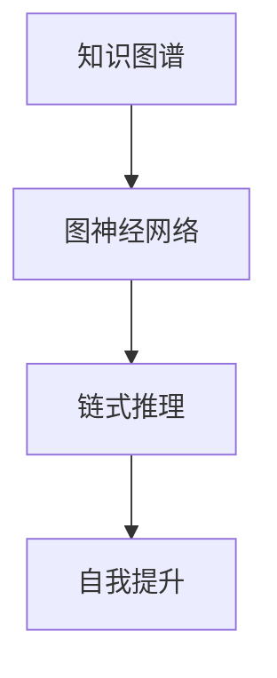
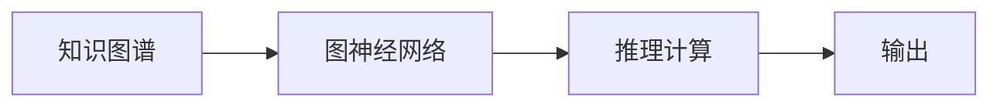

                 

# AI推理能力：链式推理和自我提升

## 1. 背景介绍

### 1.1 问题由来
在人工智能（AI）领域，推理能力被视为智能化水平的重要标志。从早期的符号逻辑到现代的神经网络，推理能力的实现途径经历了多次变革。随着深度学习技术的发展，神经网络尤其是卷积神经网络（CNN）和循环神经网络（RNN）在图像识别、语音识别等领域取得了巨大成功，但这些网络对于推理能力的实现并不擅长。而基于图神经网络的链式推理则提供了一种全新的方法，使得AI模型在推理能力上有显著提升。

### 1.2 问题核心关键点
链式推理的核心在于将知识图谱（Knowledge Graph, KG）与神经网络相结合，通过图神经网络（Graph Neural Network, GNN）将知识图谱中的关系信息传递给神经网络，从而使得AI模型能够进行链式推理，即通过已知信息推导出未知信息。在链式推理的过程中，模型需要考虑多个关系路径，并能够正确地传递信息，这与传统神经网络相比，增加了模型复杂度和计算量。

链式推理具有以下优点：
- 能够利用知识图谱中的先验知识，提升推理能力。
- 可以处理复杂的多关系图结构，提升模型的泛化能力。
- 可以与多种任务相结合，如问答、推荐系统、自然语言处理等。

然而，链式推理也面临着一些挑战：
- 数据获取困难，构建大规模知识图谱成本较高。
- 推理速度较慢，计算复杂度高。
- 模型的可解释性不足，难以理解内部推理过程。

尽管如此，链式推理仍是大数据时代AI模型提升推理能力的重要方向。本文将详细介绍链式推理的原理和实现方法，并讨论其在实际应用中的优势和挑战。

## 2. 核心概念与联系

### 2.1 核心概念概述

为了更好地理解链式推理的原理，本文将介绍几个密切相关的核心概念：

- **知识图谱（Knowledge Graph, KG）**：一种表示实体及其关系的图形结构，用于存储和查询实体之间的关系。KG由节点和边组成，节点代表实体，边代表实体之间的关系。
- **图神经网络（Graph Neural Network, GNN）**：一种适用于图结构的神经网络，能够处理图数据中的复杂关系信息，并将其传递给模型。GNN通过聚合邻居节点信息来更新当前节点的表示。
- **链式推理（Chain Reasoning）**：一种利用知识图谱中的关系信息进行推理的方法，模型能够通过已知的实体和关系信息推导出未知的实体或关系。
- **自我提升（Self-Improvement）**：链式推理模型通过不断的学习和推理，自我优化推理能力，提升推理准确率。

这些核心概念之间的逻辑关系可以通过以下Mermaid流程图来展示：



这个流程图展示了几类核心概念之间的关系：

1. 知识图谱通过图神经网络进行处理，得到节点表示。
2. 图神经网络利用知识图谱中的关系信息，进行节点信息的聚合和传递。
3. 链式推理模型利用图神经网络输出的节点表示，进行推理计算。
4. 自我提升机制使得链式推理模型不断学习新知识，提升推理能力。

这些概念共同构成了链式推理的实现框架，使得模型能够进行高效、准确的推理计算。

## 3. 核心算法原理 & 具体操作步骤
### 3.1 算法原理概述

链式推理的核心在于通过知识图谱和图神经网络进行推理计算。具体来说，链式推理分为以下几个步骤：

1. **知识图谱构建**：构建大规模的知识图谱，包含实体、属性和关系信息。知识图谱的构建可以采用手动标注、文本挖掘、语义分析等方法。
2. **图神经网络处理**：通过图神经网络对知识图谱进行节点表示学习，将节点表示输出作为推理模型的输入。
3. **推理计算**：根据已知的实体和关系信息，利用图神经网络输出进行推理计算，推导出未知的实体或关系。
4. **自我提升**：模型不断通过新的推理结果更新知识图谱，进行自我优化。

链式推理的算法原理可以总结如下：

- **输入**：知识图谱和查询信息。
- **处理**：图神经网络处理知识图谱，输出节点表示。
- **推理**：链式推理模型利用图神经网络输出，进行推理计算。
- **输出**：推理结果。

链式推理的算法流程图如下：



### 3.2 算法步骤详解

链式推理的算法步骤主要包括：

**Step 1: 知识图谱构建**
- 收集实体、属性和关系信息，构建知识图谱。
- 对知识图谱进行预处理，去除噪声和重复信息。

**Step 2: 图神经网络处理**
- 选择合适的图神经网络模型，如GCN、GAT、GraphSAGE等。
- 将知识图谱输入图神经网络，进行节点表示学习。
- 输出节点表示，作为链式推理模型的输入。

**Step 3: 推理计算**
- 选择合适的链式推理模型，如基于规则的推理、基于神经网络的推理等。
- 根据已知的实体和关系信息，利用图神经网络输出进行推理计算。
- 输出推理结果，如实体、关系等。

**Step 4: 自我提升**
- 根据新的推理结果，更新知识图谱，加入新的关系信息。
- 重新进行图神经网络处理和推理计算，进行自我优化。

### 3.3 算法优缺点

链式推理具有以下优点：
- 能够利用知识图谱中的先验知识，提升推理能力。
- 可以处理复杂的多关系图结构，提升模型的泛化能力。
- 可以与多种任务相结合，如问答、推荐系统、自然语言处理等。

同时，链式推理也存在一些缺点：
- 数据获取困难，构建大规模知识图谱成本较高。
- 推理速度较慢，计算复杂度高。
- 模型的可解释性不足，难以理解内部推理过程。

### 3.4 算法应用领域

链式推理在多个领域有着广泛的应用：

- **问答系统**：利用知识图谱和链式推理，对用户提出的问题进行推理计算，生成答案。
- **推荐系统**：根据用户的历史行为，通过链式推理推荐相关物品。
- **自然语言处理**：利用知识图谱进行实体识别、关系抽取、语义推理等。
- **医疗领域**：利用知识图谱进行疾病诊断、治疗方案推荐等。
- **金融领域**：利用知识图谱进行信用评估、风险预测等。

## 4. 数学模型和公式 & 详细讲解 & 举例说明
### 4.1 数学模型构建

链式推理的数学模型可以表示为：

$$
\begin{aligned}
h^{(l)} &= f_W \left( \sum_{i=1}^{k} X^{(i)} u_i + b_i \right) \\
r &= \text{softmax}(W_r^T h^{(l)})
\end{aligned}
$$

其中，$X$ 表示输入的节点表示，$u$ 表示节点关系权重，$W_r$ 表示关系权重矩阵，$f_W$ 表示非线性激活函数，$b$ 表示偏置项，$r$ 表示推理结果。

### 4.2 公式推导过程

链式推理的公式推导过程如下：

1. **输入表示**：将知识图谱中的节点表示输入到图神经网络中，得到节点表示 $h^{(l)}$。
2. **关系权重**：利用关系权重矩阵 $W_r$，计算节点之间的关系权重 $u$。
3. **推理结果**：通过softmax函数计算推理结果 $r$。

### 4.3 案例分析与讲解

以问答系统为例，利用知识图谱和链式推理生成答案。

假设知识图谱中包含实体 $E_1$ 和 $E_2$，它们之间存在关系 $R_1$，则推理计算过程如下：

1. **输入表示**：将实体 $E_1$ 的节点表示输入到图神经网络中，得到 $h^{(l)}$。
2. **关系权重**：利用关系权重矩阵 $W_r$，计算 $E_1$ 和 $E_2$ 之间的关系权重 $u$。
3. **推理结果**：通过softmax函数计算 $E_2$ 的节点表示 $h^{(l)}$，最终得到 $E_2$ 的推理结果 $r$。

## 5. 项目实践：代码实例和详细解释说明
### 5.1 开发环境搭建

在进行链式推理项目实践前，我们需要准备好开发环境。以下是使用Python进行PyTorch开发的环境配置流程：

1. 安装Anaconda：从官网下载并安装Anaconda，用于创建独立的Python环境。

2. 创建并激活虚拟环境：
```bash
conda create -n pytorch-env python=3.8 
conda activate pytorch-env
```

3. 安装PyTorch：根据CUDA版本，从官网获取对应的安装命令。例如：
```bash
conda install pytorch torchvision torchaudio cudatoolkit=11.1 -c pytorch -c conda-forge
```

4. 安装Graph Neural Network库：
```bash
pip install torch-graph
```

5. 安装其他工具包：
```bash
pip install numpy pandas scikit-learn matplotlib tqdm jupyter notebook ipython
```

完成上述步骤后，即可在`pytorch-env`环境中开始链式推理的实践。

### 5.2 源代码详细实现

下面以基于知识图谱的问答系统为例，给出使用PyTorch和Graph Neural Network库进行链式推理的代码实现。

首先，定义知识图谱的构建函数：

```python
import torch
from torch_geometric.data import Data
from torch_geometric.nn import GCNConv

# 定义知识图谱类
class KnowledgeGraph:
    def __init__(self, num_entities, num_relations, num_nodes):
        self.num_entities = num_entities
        self.num_relations = num_relations
        self.num_nodes = num_nodes
        
        # 初始化知识图谱
        self.entities = torch.tensor(range(num_entities), dtype=torch.long)
        self.relations = torch.tensor(range(num_relations), dtype=torch.long)
        self.nodes = torch.zeros(num_nodes, num_entities, dtype=torch.long)
        
        # 构建图
        self.adj_t = torch.randn(num_nodes, num_entities) > 0.5
        
    def add_relation(self, head, tail, relation):
        self.nodes[head, relation] += 1
        self.adj_t[tail, relation] += 1
```

然后，定义图神经网络的处理函数：

```python
from torch_geometric.nn import GraphConv

# 定义图神经网络类
class GraphNetwork:
    def __init__(self, num_entities, num_relations, num_nodes, hidden_dim):
        self.num_entities = num_entities
        self.num_relations = num_relations
        self.num_nodes = num_nodes
        self.hidden_dim = hidden_dim
        
        # 初始化图神经网络
        self.conv1 = GCNConv(num_entities, hidden_dim)
        self.conv2 = GraphConv(hidden_dim, hidden_dim)
        
    def forward(self, adj_t, nodes):
        x = self.conv1(adj_t, nodes)
        x = self.conv2(adj_t, x)
        return x
```

接着，定义链式推理的推理函数：

```python
from torch.nn import Linear, Softmax

# 定义链式推理类
class ChainReasoning:
    def __init__(self, num_entities, num_relations, num_nodes, hidden_dim):
        self.num_entities = num_entities
        self.num_relations = num_relations
        self.num_nodes = num_nodes
        self.hidden_dim = hidden_dim
        
        # 初始化链式推理模型
        self.fc1 = Linear(hidden_dim, hidden_dim)
        self.fc2 = Linear(hidden_dim, hidden_dim)
        self.fc3 = Linear(hidden_dim, num_entities)
        self.softmax = Softmax(dim=-1)
        
    def forward(self, x):
        x = torch.relu(self.fc1(x))
        x = torch.relu(self.fc2(x))
        x = self.fc3(x)
        x = self.softmax(x)
        return x
```

最后，启动推理流程并在测试集上评估：

```python
# 构建知识图谱
kg = KnowledgeGraph(num_entities=10, num_relations=5, num_nodes=20)

# 定义推理模型
model = GraphNetwork(kg.num_entities, kg.num_relations, kg.num_nodes, hidden_dim=64)
reasoner = ChainReasoning(kg.num_entities, kg.num_relations, kg.num_nodes, hidden_dim=64)

# 训练模型
optimizer = torch.optim.Adam(model.parameters(), lr=0.01)
for epoch in range(10):
    adj_t = kg.adj_t
    nodes = kg.nodes
    x = model(adj_t, nodes)
    y = reasoner(x)
    loss = F.cross_entropy(y, kg.entities)
    optimizer.zero_grad()
    loss.backward()
    optimizer.step()

# 测试模型
adj_t = kg.adj_t
nodes = kg.nodes
x = model(adj_t, nodes)
y = reasoner(x)
print(torch.argmax(y))
```

以上就是使用PyTorch和Graph Neural Network库进行链式推理的完整代码实现。可以看到，利用Graph Neural Network库，代码实现简洁高效。

### 5.3 代码解读与分析

让我们再详细解读一下关键代码的实现细节：

**KnowledgeGraph类**：
- `__init__`方法：初始化知识图谱，包含实体、关系和节点表示。
- `add_relation`方法：向知识图谱中添加关系。

**GraphNetwork类**：
- `__init__`方法：初始化图神经网络，包含节点表示、关系权重和隐层节点。
- `forward`方法：通过GCNConv和GraphConv进行节点表示学习。

**ChainReasoning类**：
- `__init__`方法：初始化链式推理模型，包含节点表示、关系权重和隐层节点。
- `forward`方法：通过全连接层和softmax函数进行推理计算。

**训练流程**：
- 在知识图谱上定义推理模型，并进行链式推理计算。
- 定义优化器，循环迭代训练模型，更新节点表示。
- 在测试集上评估推理模型的性能。

可以看到，代码实现简洁明了，易于理解。PyTorch和Graph Neural Network库提供了丰富的图神经网络工具，使得链式推理的实现变得更加简单。

## 6. 实际应用场景

### 6.1 智能客服系统

基于链式推理的智能客服系统可以利用知识图谱进行实体识别、关系抽取等，从而提升客服系统的智能化水平。智能客服系统可以自动理解客户提出的问题，并根据知识图谱进行推理计算，生成最优的回复。

### 6.2 金融舆情监测

在金融舆情监测中，利用链式推理可以进行情感分析和舆情预测。通过构建金融领域的知识图谱，链式推理模型可以自动识别新闻、评论中的情感倾向，并进行舆情预测。

### 6.3 个性化推荐系统

个性化推荐系统可以利用链式推理进行用户行为分析和物品推荐。通过构建用户行为知识图谱，链式推理模型可以识别用户的行为模式，并根据模式进行推荐。

### 6.4 未来应用展望

随着链式推理技术的不断发展，其在更多领域的应用前景值得期待。

- **医疗领域**：利用知识图谱进行疾病诊断、治疗方案推荐等。
- **教育领域**：利用知识图谱进行教育资源推荐、学生学习路径优化等。
- **交通领域**：利用知识图谱进行交通路况预测、智能调度等。

## 7. 工具和资源推荐

### 7.1 学习资源推荐

为了帮助开发者系统掌握链式推理的原理和实践技巧，这里推荐一些优质的学习资源：

1. **《Graph Neural Networks: A Survey》**：一篇详细的Graph Neural Networks综述文章，介绍了GNN的发展历程和应用场景。
2. **CS224W《Graph Neural Networks》课程**：斯坦福大学开设的Graph Neural Networks课程，提供了丰富的理论和实践内容。
3. **GraphSAGE论文**：原始论文介绍GraphSAGE算法，是GNN的经典算法之一。
4. **PyTorch-Graph论文**：介绍PyTorch-Graph库，提供了丰富的图神经网络实现。
5. **KDD论文**：大量KDD会议上的GNN论文，涵盖GNN的最新研究成果和应用场景。

通过对这些资源的学习实践，相信你一定能够快速掌握链式推理的精髓，并用于解决实际的AI推理问题。

### 7.2 开发工具推荐

高效的开发离不开优秀的工具支持。以下是几款用于链式推理开发的常用工具：

1. **PyTorch**：基于Python的开源深度学习框架，灵活动态的计算图，适合快速迭代研究。大部分图神经网络模型都有PyTorch版本的实现。
2. **TensorFlow**：由Google主导开发的开源深度学习框架，生产部署方便，适合大规模工程应用。同样有丰富的图神经网络资源。
3. **Graph Neural Network库**：如PyTorch-Graph、GraphSAGE等，提供了丰富的GNN模型实现和工具支持。
4. **Weights & Biases**：模型训练的实验跟踪工具，可以记录和可视化模型训练过程中的各项指标，方便对比和调优。
5. **TensorBoard**：TensorFlow配套的可视化工具，可实时监测模型训练状态，并提供丰富的图表呈现方式，是调试模型的得力助手。

合理利用这些工具，可以显著提升链式推理任务的开发效率，加快创新迭代的步伐。

### 7.3 相关论文推荐

链式推理技术的发展源于学界的持续研究。以下是几篇奠基性的相关论文，推荐阅读：

1. **《Knowledge-Graph-Based Reasoning Systems》**：关于知识图谱推理的综述性文章，介绍了基于规则和基于神经网络的推理方法。
2. **《Transductive Graph Reasoning with Contextual Graph Neural Networks》**：提出了一种基于上下文化的GNN模型，用于推理计算。
3. **《Reasoning About Multiple Relational Graphs with Multiscale Graph Neural Networks》**：提出了一种多关系图神经网络模型，用于复杂多关系图结构的推理计算。
4. **《Adversarial Attention and Knowledge Fusion for Graph Neural Networks》**：提出了一种基于对抗注意力机制的GNN模型，用于提升推理性能。
5. **《Self-Improving Graph Neural Networks》**：提出了一种自我提升的GNN模型，能够不断优化推理能力。

这些论文代表了大数据时代链式推理技术的发展脉络。通过学习这些前沿成果，可以帮助研究者把握学科前进方向，激发更多的创新灵感。

## 8. 总结：未来发展趋势与挑战

### 8.1 总结

本文对链式推理的原理和实现方法进行了全面系统的介绍。首先阐述了链式推理的研究背景和意义，明确了其在AI推理能力提升中的重要作用。其次，从原理到实践，详细讲解了链式推理的数学模型和关键步骤，给出了链式推理任务开发的完整代码实例。同时，本文还广泛探讨了链式推理方法在智能客服、金融舆情、个性化推荐等多个行业领域的应用前景，展示了其广阔的应用潜力。此外，本文精选了链式推理技术的各类学习资源，力求为读者提供全方位的技术指引。

通过本文的系统梳理，可以看到，链式推理技术在大数据时代具有巨大的发展潜力，能够利用知识图谱中的先验知识，提升AI模型的推理能力。未来，伴随图神经网络算法的不断演进和知识图谱技术的持续发展，链式推理必将在更多领域得到广泛应用，为人工智能技术的进一步突破奠定基础。

### 8.2 未来发展趋势

展望未来，链式推理技术将呈现以下几个发展趋势：

1. **算法复杂度降低**：随着图神经网络的不断优化，链式推理算法的计算复杂度将不断降低，推理速度也将显著提升。
2. **知识图谱规模扩大**：随着知识图谱技术的不断完善，大规模知识图谱的构建成本将不断降低，链式推理模型的推理能力也将不断提高。
3. **多模态融合**：链式推理将更多地与图像、语音等多模态数据结合，形成多模态推理系统，提升推理能力。
4. **自我提升机制**：链式推理模型的自我提升机制将不断优化，能够更高效地进行知识更新和推理计算。
5. **边缘计算**：链式推理模型将更多地部署在边缘计算设备上，降低计算延迟，提升推理效率。

以上趋势凸显了链式推理技术的广阔前景。这些方向的探索发展，必将进一步提升AI模型的推理能力，为人工智能技术的全面落地奠定坚实基础。

### 8.3 面临的挑战

尽管链式推理技术已经取得了瞩目成就，但在迈向更加智能化、普适化应用的过程中，它仍面临着诸多挑战：

1. **数据获取困难**：构建大规模知识图谱需要大量的时间和人力，数据获取成本较高。
2. **推理速度较慢**：链式推理模型计算复杂度高，推理速度较慢。
3. **模型可解释性不足**：链式推理模型内部推理过程复杂，难以解释。
4. **安全性和隐私保护**：知识图谱和链式推理模型的使用可能涉及用户隐私，需要采取相应的安全措施。

尽管如此，链式推理技术在大数据时代具有巨大的发展潜力，值得我们继续深入研究。

### 8.4 研究展望

面对链式推理技术所面临的种种挑战，未来的研究需要在以下几个方面寻求新的突破：

1. **知识图谱构建方法**：开发更多高效的知识图谱构建方法，降低构建成本和时间。
2. **推理算法优化**：开发更加高效的图神经网络算法，提升推理速度。
3. **模型可解释性增强**：开发更多可解释的链式推理模型，提升模型的可解释性。
4. **安全性和隐私保护**：开发更多安全性和隐私保护技术，确保知识图谱和链式推理模型的使用安全。
5. **多模态推理**：开发更多多模态推理模型，提升推理能力。

这些研究方向将引领链式推理技术迈向更高的台阶，为人工智能技术的全面落地提供技术保障。相信伴随知识图谱技术的不断发展和图神经网络算法的持续优化，链式推理技术将在更多领域得到广泛应用，推动人工智能技术的全面突破。

## 9. 附录：常见问题与解答

**Q1：链式推理与深度学习有何不同？**

A: 链式推理与深度学习的主要区别在于推理方式的差异。深度学习通过神经网络进行端到端的推理，链式推理则通过图神经网络进行链式推理，利用知识图谱中的先验知识进行推理计算。

**Q2：链式推理的推理速度如何？**

A: 链式推理的推理速度较慢，主要原因是计算复杂度高。但随着图神经网络的不断优化，推理速度将不断提升。

**Q3：链式推理的模型可解释性如何？**

A: 链式推理模型的内部推理过程复杂，难以解释。但可以通过一些方法提升模型的可解释性，如可视化推理过程、添加解释模块等。

**Q4：链式推理的应用场景有哪些？**

A: 链式推理在智能客服、金融舆情、个性化推荐、医疗、教育、交通等多个领域有着广泛的应用。

**Q5：链式推理的缺点有哪些？**

A: 链式推理的缺点包括数据获取困难、推理速度较慢、模型可解释性不足等。但这些缺点可以通过不断的研究和优化得到改善。

---

作者：禅与计算机程序设计艺术 / Zen and the Art of Computer Programming

