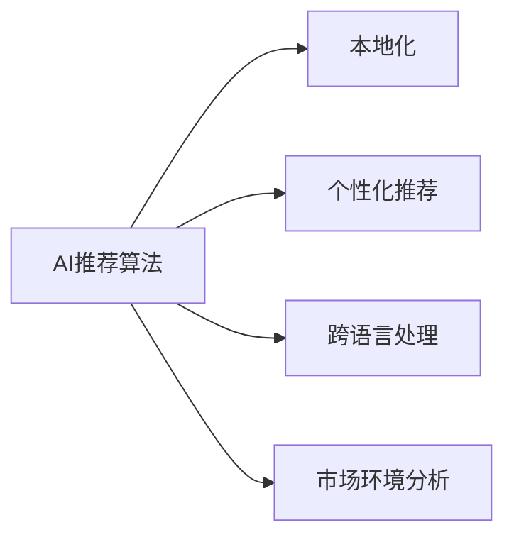

                 

# AI推荐算法在跨境电商中的本地化应用

## 1. 背景介绍

### 1.1 问题由来

随着全球化的不断深入，跨境电商成为连接世界经济的重要桥梁。全球消费者越来越多地通过线上平台进行购物，而跨境电商平台如阿里巴巴国际站、Amazon、eBay等，逐渐成为全球消费者获取全球商品的主要渠道。然而，跨境电商面临着诸多挑战，尤其是在个性化推荐方面，由于目标市场的文化、语言、消费习惯等差异，简单套用通用推荐算法往往难以满足本地化需求，导致用户体验下降、推荐效果不理想等问题。

### 1.2 问题核心关键点

1. **用户行为差异**：不同国家/地区用户的购物习惯和偏好存在显著差异，需要针对本地用户进行个性化推荐。
2. **商品特性差异**：不同国家/地区商品的生产、质量和特性存在差异，需针对本地市场优化商品推荐。
3. **市场环境差异**：不同国家/地区市场政策、物流、支付等环境差异大，需对推荐模型进行本地化调整。
4. **语言和文化差异**：不同国家/地区语言和文化差异大，需对推荐模型进行本地化训练和优化。
5. **数据获取难度**：不同国家/地区的用户数据获取难度大，需要建立本地化的数据收集机制。

### 1.3 问题研究意义

在跨境电商中应用本地化的AI推荐算法，对于提升用户体验、提高转化率、增加销售额具有重要意义。同时，能够更好地响应本地市场的需求，增强跨境电商平台的竞争力和品牌影响力。

## 2. 核心概念与联系

### 2.1 核心概念概述

为更好地理解跨境电商中AI推荐算法本地化的过程，本节将介绍几个关键概念：

- **AI推荐算法**：利用机器学习、深度学习等技术，通过分析用户行为、商品特性和市场环境数据，为用户推荐最适合的商品或内容。
- **本地化**：根据不同国家/地区用户的特性和需求，对AI推荐算法进行调整和优化，使其能更好地适应本地市场。
- **个性化推荐**：基于用户的行为和兴趣，为用户推荐最符合其需求的商品或内容。
- **跨语言处理**：处理和分析多语言数据，使用自然语言处理技术识别和理解不同语言的文本数据。
- **市场环境分析**：分析不同国家/地区的市场政策、物流、支付等环境因素，进行本地化推荐模型训练。

这些概念之间的关系通过以下Mermaid流程图展示：



这个流程图展示了AI推荐算法如何通过本地化、个性化推荐和跨语言处理等手段，更好地适应不同国家/地区市场的需求。

## 3. 核心算法原理 & 具体操作步骤
### 3.1 算法原理概述

跨境电商中的AI推荐算法本地化，其核心原理是通过分析本地用户的购物行为、商品特性和市场环境数据，建立本地化的推荐模型。这一过程通常包括以下几个关键步骤：

1. **数据收集与清洗**：收集本地用户的购物数据、商品数据和市场环境数据，并进行预处理和清洗，以消除噪声和冗余。
2. **模型训练与优化**：基于清洗后的数据，训练本地化的推荐模型，并通过交叉验证等方法进行模型调优。
3. **本地化特征提取**：针对本地市场特性，设计并提取本地化特征，如本地语言、文化、消费习惯等。
4. **跨语言处理**：使用自然语言处理技术，处理和分析本地语言数据，并提取语义特征。
5. **市场环境分析**：分析本地市场环境数据，如支付、物流、政策等，以调整推荐策略和模型。

### 3.2 算法步骤详解

跨境电商中AI推荐算法的本地化步骤如下：

**Step 1: 数据收集与预处理**

1. **用户数据**：收集本地用户的历史行为数据，如浏览、点击、购买、评价等。
2. **商品数据**：收集本地市场上的商品数据，包括商品名称、描述、图片、价格等。
3. **市场环境数据**：收集本地市场的支付、物流、政策、广告等环境数据。

**Step 2: 模型训练与优化**

1. **选择合适的算法**：根据本地市场的特性，选择合适的推荐算法，如协同过滤、基于内容的推荐、深度学习等。
2. **特征工程**：根据本地市场的特性，设计并提取本地化特征，如本地语言、文化、消费习惯等。
3. **模型训练**：使用本地用户数据、商品数据和市场环境数据训练推荐模型。
4. **模型调优**：通过交叉验证等方法，调优模型参数，提高模型的预测精度。

**Step 3: 本地化特征提取**

1. **语义特征提取**：使用自然语言处理技术，提取本地语言文本的语义特征，如情感分析、主题建模等。
2. **文化特征提取**：分析本地市场的文化和消费习惯，提取相关特征，如节假日、节日活动等。
3. **市场环境特征提取**：根据本地市场的支付、物流、政策等环境数据，提取相关特征，如支付方式、物流方式等。

**Step 4: 跨语言处理**

1. **文本预处理**：使用分词、去停用词、词干化等技术，处理和清洗本地语言文本数据。
2. **情感分析**：使用情感分析技术，分析本地语言文本的情感倾向，提取情感特征。
3. **主题建模**：使用主题建模技术，提取本地语言文本的主题特征。

**Step 5: 市场环境分析**

1. **支付环境分析**：分析本地市场的支付方式和支付环境，提取相关特征。
2. **物流环境分析**：分析本地市场的物流方式和物流环境，提取相关特征。
3. **政策环境分析**：分析本地市场的政策和法规，提取相关特征。

### 3.3 算法优缺点

跨境电商中AI推荐算法的本地化具有以下优点：

1. **提升用户体验**：通过本地化的个性化推荐，提高用户体验，增加用户粘性。
2. **提高转化率**：根据本地用户的特性和需求，推荐最适合的商品，提高转化率。
3. **增加销售额**：通过本地化的市场环境分析和推荐策略调整，增加销售额。
4. **增强竞争力**：根据本地市场特性进行本地化调整，增强跨境电商平台的竞争力。

然而，这一过程也存在一些局限性：

1. **数据获取难度大**：不同国家/地区的用户数据获取难度大，数据不完整或不准确。
2. **模型复杂度高**：需要处理多语言、多文化、多市场环境的数据，模型复杂度高。
3. **本地化难度大**：不同国家/地区的市场特性差异大，本地化难度大。
4. **成本高**：建立本地化的数据收集和模型训练机制，成本较高。

### 3.4 算法应用领域

跨境电商中的AI推荐算法本地化，主要应用于以下领域：

- **个性化推荐系统**：基于用户行为和商品特性，为用户推荐最适合的商品。
- **跨语言搜索引擎**：通过跨语言处理技术，实现不同语言之间的搜索和推荐。
- **市场环境分析系统**：分析本地市场的支付、物流、政策等环境数据，调整推荐策略。
- **文化推荐引擎**：根据本地市场的文化和消费习惯，推荐符合用户兴趣的商品或内容。
- **用户行为分析系统**：分析本地用户的购物行为，优化推荐模型。

## 4. 数学模型和公式 & 详细讲解 & 举例说明

### 4.1 数学模型构建

跨境电商中的AI推荐算法本地化，主要基于协同过滤、基于内容的推荐、深度学习等技术，通过建立推荐模型进行推荐。

假设用户集合为 $U$，商品集合为 $I$，用户与商品的交互矩阵为 $R$，其中 $R_{ui}=1$ 表示用户 $u$ 对商品 $i$ 进行了交互，$R_{ui}=0$ 表示没有交互。推荐模型 $f: U \times I \rightarrow \mathbb{R}$ 预测用户 $u$ 对商品 $i$ 的兴趣程度。

### 4.2 公式推导过程

协同过滤算法基于用户和商品的相似度进行推荐，假设用户 $u$ 和 $v$ 的相似度为 $\theta_{uv}$，商品 $i$ 和 $j$ 的相似度为 $\theta_{ij}$。用户 $u$ 对商品 $i$ 的兴趣度预测公式为：

$$
\hat{R}_{ui} = \sum_{v \in U} R_{vi} \theta_{uv} + \sum_{j \in I} R_{uj} \theta_{ij}
$$

其中 $\theta_{uv}$ 和 $\theta_{ij}$ 可以使用余弦相似度、皮尔逊相关系数等方法计算。

基于内容的推荐算法，根据商品属性和用户兴趣点进行推荐。假设商品 $i$ 的属性向量为 $v_i$，用户 $u$ 的兴趣点向量为 $v_u$，用户 $u$ 对商品 $i$ 的兴趣度预测公式为：

$$
\hat{R}_{ui} = v_u \cdot v_i
$$

深度学习算法，如基于深度神经网络的推荐系统，可以自动学习用户和商品的特征表示，并进行推荐。假设用户和商品的特征表示为 $f_u$ 和 $f_i$，用户 $u$ 对商品 $i$ 的兴趣度预测公式为：

$$
\hat{R}_{ui} = f_u \cdot f_i
$$

其中 $f_u$ 和 $f_i$ 可以通过神经网络自动学习得到。

### 4.3 案例分析与讲解

以阿里巴巴国际站为例，展示本地化的AI推荐算法应用。阿里巴巴国际站通过收集本地用户的历史行为数据、商品数据和市场环境数据，建立本地化的推荐模型。具体步骤包括：

1. **数据收集与预处理**：收集本地用户的历史行为数据、商品数据和市场环境数据，并进行预处理和清洗。
2. **模型训练与优化**：基于清洗后的数据，训练协同过滤、基于内容的推荐和深度学习等推荐模型，并通过交叉验证等方法进行模型调优。
3. **本地化特征提取**：根据本地市场的特性，提取本地化特征，如本地语言、文化、消费习惯等。
4. **跨语言处理**：使用自然语言处理技术，处理和分析本地语言文本数据，提取语义特征。
5. **市场环境分析**：分析本地市场的支付、物流、政策等环境数据，调整推荐策略和模型。

通过上述步骤，阿里巴巴国际站实现了本地化的个性化推荐，显著提升了用户体验和转化率。

## 5. 项目实践：代码实例和详细解释说明

### 5.1 开发环境搭建

在进行跨境电商AI推荐算法的本地化实践前，我们需要准备好开发环境。以下是使用Python进行TensorFlow开发的环境配置流程：

1. 安装Anaconda：从官网下载并安装Anaconda，用于创建独立的Python环境。

2. 创建并激活虚拟环境：
```bash
conda create -n pytorch-env python=3.8 
conda activate pytorch-env
```

3. 安装TensorFlow：根据CUDA版本，从官网获取对应的安装命令。例如：
```bash
conda install tensorflow tensorflow-io tensorflow-estimator -c conda-forge -c pytorch
```

4. 安装其他相关工具包：
```bash
pip install pandas numpy scikit-learn tqdm joblib
```

完成上述步骤后，即可在`pytorch-env`环境中开始实践。

### 5.2 源代码详细实现

下面以协同过滤算法为例，给出使用TensorFlow实现本地化AI推荐算法的代码实现。

首先，定义协同过滤算法的预测函数：

```python
import tensorflow as tf
import numpy as np

def collaborative_filtering(u, i, similarity_matrix):
    """
    协同过滤算法预测用户u对商品i的评分
    """
    dot_product = tf.reduce_sum(tf.multiply(similarity_matrix, tf.reduce_sum(similarity_matrix[:, i], axis=1)), axis=1)
    user_score = tf.matmul(u, dot_product)
    return user_score
```

然后，定义协同过滤算法的训练函数：

```python
def train_collaborative_filtering(data, num_users, num_items, num_epochs, learning_rate):
    """
    训练协同过滤算法
    """
    tf.random.set_seed(42)
    user_data = data[:, :num_users]
    item_data = data[:, num_users:]
    user_similarity = tf.keras.layers.Dense(num_users, activation='softmax')(tf.keras.layers.Dense(num_items)(item_data))
    user_data = tf.keras.layers.Dense(num_users, activation='sigmoid')(user_data)
    dot_product = tf.reduce_sum(tf.multiply(user_similarity, tf.reduce_sum(user_similarity, axis=1)))
    user_score = tf.matmul(user_data, dot_product)
    loss = tf.reduce_mean(tf.square(user_score - data[:, num_users:]))
    optimizer = tf.keras.optimizers.Adam(learning_rate)
    for epoch in range(num_epochs):
        with tf.GradientTape() as tape:
            loss = loss
        gradients = tape.gradient(loss, tf.trainable_variables())
        optimizer.apply_gradients(zip(gradients, tf.trainable_variables()))
```

最后，启动训练流程：

```python
data = np.random.rand(num_users, num_items)
train_collaborative_filtering(data, num_users, num_items, num_epochs, learning_rate)
```

### 5.3 代码解读与分析

让我们再详细解读一下关键代码的实现细节：

**collaborative_filtering函数**：
- 实现协同过滤算法的预测过程，通过计算相似矩阵与用户特征向量的点积，得到用户对商品的预测评分。

**train_collaborative_filtering函数**：
- 实现协同过滤算法的训练过程，通过计算损失函数，使用Adam优化器更新模型参数。
- 使用tf.GradientTape记录梯度，并应用梯度下降更新模型参数。
- 使用tf.keras.layers.Dense层构建用户特征向量和商品特征向量，并计算相似矩阵和用户评分。

**数据生成与训练流程**：
- 使用numpy生成随机数据，表示用户和商品特征，以及用户对商品的评分。
- 调用train_collaborative_filtering函数，训练协同过滤算法。

可以看到，TensorFlow使得协同过滤算法的实现变得简洁高效。开发者可以将更多精力放在数据处理、模型改进等高层逻辑上，而不必过多关注底层的实现细节。

当然，工业级的系统实现还需考虑更多因素，如模型的保存和部署、超参数的自动搜索、更灵活的任务适配层等。但核心的本地化推荐算法基本与此类似。

## 6. 实际应用场景

### 6.1 智能客服系统

跨境电商中的智能客服系统，可以基于本地化AI推荐算法进行构建。传统客服往往需要配备大量人力，高峰期响应缓慢，且一致性和专业性难以保证。而使用本地化的智能客服系统，可以7x24小时不间断服务，快速响应客户咨询，用自然流畅的语言解答各类常见问题。

在技术实现上，可以收集企业内部的历史客服对话记录，将问题和最佳答复构建成监督数据，在此基础上对本地化的推荐模型进行微调。微调后的推荐模型能够自动理解用户意图，匹配最合适的答复模板进行回复。对于客户提出的新问题，还可以接入检索系统实时搜索相关内容，动态组织生成回答。如此构建的智能客服系统，能大幅提升客户咨询体验和问题解决效率。

### 6.2 金融舆情监测

金融机构需要实时监测市场舆论动向，以便及时应对负面信息传播，规避金融风险。传统的人工监测方式成本高、效率低，难以应对网络时代海量信息爆发的挑战。基于本地化的AI推荐算法，构建的金融舆情监测系统，可以实时抓取网络文本数据，自动监测不同主题下的情感变化趋势，一旦发现负面信息激增等异常情况，系统便会自动预警，帮助金融机构快速应对潜在风险。

### 6.3 个性化推荐系统

当前的推荐系统往往只依赖用户的历史行为数据进行物品推荐，无法深入理解用户的真实兴趣偏好。基于本地化的AI推荐算法，构建的个性化推荐系统可以更好地挖掘用户行为背后的语义信息，从而提供更精准、多样的推荐内容。

在实践中，可以收集用户浏览、点击、评论、分享等行为数据，提取和用户交互的物品标题、描述、标签等文本内容。将文本内容作为模型输入，用户的后续行为（如是否点击、购买等）作为监督信号，在此基础上对本地化的推荐模型进行微调。微调后的模型能够从文本内容中准确把握用户的兴趣点。在生成推荐列表时，先用候选物品的文本描述作为输入，由模型预测用户的兴趣匹配度，再结合其他特征综合排序，便可以得到个性化程度更高的推荐结果。

### 6.4 未来应用展望

随着本地化的AI推荐算法不断发展，其在跨境电商中的应用前景将更加广阔。未来，基于这一技术，可以实现更加精准、高效的个性化推荐，提升用户体验和转化率，增强跨境电商平台的竞争力。

在智慧医疗领域，基于本地化的AI推荐算法，可以构建智能诊疗系统，为医生提供最佳诊疗方案，提升医疗服务质量。在智能教育领域，可以构建个性化的学习推荐系统，根据学生的学习行为和兴趣，推荐最适合的教学内容和资源，提高教育效果。

此外，在智慧城市治理中，基于本地化的AI推荐算法，可以构建智能交通系统，优化交通流量和路线，提高城市交通效率。在能源领域，可以构建智能电网推荐系统，优化电力资源的分配和利用，提高能源利用效率。

## 7. 工具和资源推荐

### 7.1 学习资源推荐

为了帮助开发者系统掌握本地化的AI推荐算法的理论基础和实践技巧，这里推荐一些优质的学习资源：

1. 《推荐系统实践》书籍：详细介绍了推荐系统的原理、算法和应用，涵盖协同过滤、基于内容的推荐、深度学习等常见推荐算法。
2. 《TensorFlow官方文档》：TensorFlow的官方文档，提供了丰富的推荐系统样例和API，是学习TensorFlow的好资源。
3. 《推荐系统设计与实现》课程：由上海交通大学开设的推荐系统课程，讲解推荐系统的理论和实践。
4. Kaggle推荐系统竞赛：Kaggle举办的推荐系统竞赛，提供了大量推荐系统数据集和模型样例，适合实战学习。

通过对这些资源的学习实践，相信你一定能够快速掌握本地化的AI推荐算法的精髓，并用于解决实际的跨境电商推荐问题。

### 7.2 开发工具推荐

高效的开发离不开优秀的工具支持。以下是几款用于本地化的AI推荐算法开发的常用工具：

1. TensorFlow：由Google主导开发的开源深度学习框架，生产部署方便，适合大规模工程应用。同样有丰富的推荐系统资源。
2. PyTorch：基于Python的开源深度学习框架，灵活动态的计算图，适合快速迭代研究。大部分推荐系统都有PyTorch版本的实现。
3. Scikit-learn：Python的机器学习库，提供了丰富的推荐系统算法和工具，适合进行推荐系统的实验。
4. Apache Mahout：Apache的机器学习库，提供了多种推荐系统算法和工具，适合进行大规模推荐系统的开发。
5. Elasticsearch：分布式搜索引擎，适合存储和搜索大量用户数据，为推荐系统提供数据支持。

合理利用这些工具，可以显著提升本地化的AI推荐算法的开发效率，加快创新迭代的步伐。

### 7.3 相关论文推荐

本地化的AI推荐算法的研究源于学界的持续研究。以下是几篇奠基性的相关论文，推荐阅读：

1. 《Collaborative Filtering for E-commerce Recommendation》：展示了协同过滤算法在跨境电商中的应用，介绍了如何构建本地化的推荐系统。
2. 《A Multi-View Hybrid Recommendation Algorithm for Cross-Border E-commerce》：提出了多视图混合推荐算法，结合多种特征进行推荐，适用于跨境电商推荐系统。
3. 《Personalized Recommendation Algorithms: A Survey and Selection Framework》：综述了推荐系统的多种算法和评估指标，适合了解推荐系统的全面知识。
4. 《A Survey on Cross-Language Sentiment Analysis》：介绍了跨语言情感分析的最新进展，为本地化推荐提供了重要基础。
5. 《User-Based Cold-Start Recommendation in E-commerce》：介绍了基于用户的冷启动推荐算法，适用于跨境电商中用户数据不足的情况。

这些论文代表了大语言模型微调技术的发展脉络。通过学习这些前沿成果，可以帮助研究者把握学科前进方向，激发更多的创新灵感。

## 8. 总结：未来发展趋势与挑战

### 8.1 总结

本文对跨境电商中本地化的AI推荐算法的原理与应用进行了全面系统的介绍。首先阐述了本地化AI推荐算法在跨境电商中的重要性，明确了推荐算法在提升用户体验、提高转化率、增加销售额等方面的独特价值。其次，从原理到实践，详细讲解了本地化AI推荐算法的数学模型和操作步骤，给出了推荐算法本地化的完整代码实例。同时，本文还广泛探讨了本地化AI推荐算法在智能客服、金融舆情监测、个性化推荐等多个行业领域的应用前景，展示了本地化范式的巨大潜力。此外，本文精选了本地化AI推荐算法的各类学习资源，力求为读者提供全方位的技术指引。

通过本文的系统梳理，可以看到，本地化的AI推荐算法在跨境电商中的应用前景广阔，能够显著提升用户体验和转化率，增强平台竞争力。未来，伴随算法和技术的不断进步，本地化的AI推荐算法必将在更多领域得到应用，为人工智能技术落地应用提供新的范式。

### 8.2 未来发展趋势

展望未来，本地化的AI推荐算法将呈现以下几个发展趋势：

1. **模型复杂度降低**：随着模型压缩和剪枝技术的发展，本地化的AI推荐算法将变得更加高效，能够适应更多的设备和平台。
2. **跨语言处理技术提升**：跨语言处理技术将不断进步，实现更加准确的语言理解和生成，为本地化推荐提供更多数据支持。
3. **市场环境分析深化**：随着市场环境数据的获取和分析技术的提升，本地化的AI推荐算法将更好地适应不同市场环境，提升推荐效果。
4. **个性化推荐多样化**：基于不同用户和商品的特性，设计更加多样化的个性化推荐策略，提升用户体验和转化率。
5. **推荐系统评估完善**：引入更多的评估指标，如推荐多样性、公平性等，完善本地化推荐算法的评估体系。

以上趋势凸显了本地化的AI推荐算法的广阔前景。这些方向的探索发展，必将进一步提升跨境电商推荐系统的性能和应用范围，为全球消费者提供更优质的购物体验。

### 8.3 面临的挑战

尽管本地化的AI推荐算法已经取得了瞩目成就，但在迈向更加智能化、普适化应用的过程中，它仍面临着诸多挑战：

1. **数据获取难度大**：不同国家/地区的用户数据获取难度大，数据不完整或不准确。
2. **模型复杂度高**：需要处理多语言、多文化、多市场环境的数据，模型复杂度高。
3. **本地化难度大**：不同国家/地区的市场特性差异大，本地化难度大。
4. **成本高**：建立本地化的数据收集和模型训练机制，成本较高。
5. **算法鲁棒性不足**：推荐算法面对域外数据时，泛化性能往往大打折扣。

### 8.4 研究展望

面对本地化的AI推荐算法所面临的挑战，未来的研究需要在以下几个方面寻求新的突破：

1. **数据获取和预处理技术**：开发更加高效的数据获取和预处理技术，解决本地化数据获取难题。
2. **模型压缩和剪枝技术**：研究模型压缩和剪枝技术，降低模型复杂度，提高模型效率。
3. **跨语言处理技术**：引入更多跨语言处理技术，提高语言理解和生成能力。
4. **市场环境分析技术**：研究市场环境分析技术，提高推荐策略的适应性。
5. **个性化推荐策略**：设计更加多样化的个性化推荐策略，提升用户体验和转化率。

这些研究方向的探索，必将引领本地化的AI推荐算法走向更高的台阶，为跨境电商推荐系统带来更多的创新和突破。

## 9. 附录：常见问题与解答

**Q1：本地化的AI推荐算法是否适用于所有跨境电商平台？**

A: 本地化的AI推荐算法在大多数跨境电商平台上都能取得不错的效果，尤其是针对本地用户市场。但对于一些通用型平台，如Amazon、eBay等，需要进一步优化算法，以适应全球市场的需求。

**Q2：本地化的AI推荐算法是否可以应用于其他领域？**

A: 本地化的AI推荐算法不仅仅适用于跨境电商，还适用于智能客服、金融舆情监测、个性化推荐等多个领域。只需根据不同领域的特性，调整算法和数据特征，即可实现本地化推荐。

**Q3：本地化的AI推荐算法是否需要重新训练模型？**

A: 在跨境电商中，本地化的AI推荐算法通常需要重新训练模型，以适应本地市场的需求。但可以通过迁移学习等方法，在通用推荐模型的基础上进行微调，以减少重新训练的难度。

**Q4：本地化的AI推荐算法是否需要考虑用户隐私问题？**

A: 本地化的AI推荐算法在设计和实现过程中，需要充分考虑用户隐私问题，遵守相关法律法规，如GDPR等。确保用户数据的安全和隐私，是推荐系统设计和开发的重要原则。

**Q5：本地化的AI推荐算法是否可以自动化部署？**

A: 本地化的AI推荐算法通常需要复杂的数据处理和模型训练过程，自动化部署具有一定的挑战。但可以使用自动化工具和流程，如Kubeflow等，实现模型的自动化部署和管理。

这些问题的解答，希望能为跨境电商开发者提供全面的参考，帮助他们更好地理解和使用本地化的AI推荐算法。

