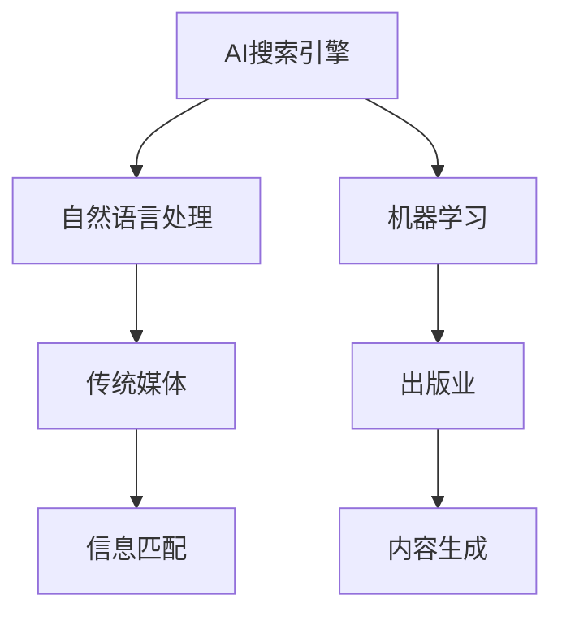

                 

# AI搜索引擎对传统媒体和出版业的影响

> 关键词：AI搜索引擎,传统媒体,出版业,影响,技术革新

## 1. 背景介绍

### 1.1 问题由来
随着互联网技术的飞速发展，人们获取信息的方式发生了巨大变化。传统的报纸、杂志、书籍等传统媒体和出版物面临数字化转型的挑战。与此同时，搜索引擎技术的发展也日新月异，通过自然语言处理(NLP)、机器学习等先进技术，搜索引擎能够更加精准地匹配用户查询，提供了更为丰富、多元的信息获取渠道。

搜索引擎技术的不断进步，正逐步渗透到传统媒体和出版业，对其进行深度影响。一方面，搜索引擎提供了新的流量来源，另一方面，也使得传统媒体和出版业需要借助AI技术进行数字化转型，提升自身的竞争力。

### 1.2 问题核心关键点
本文聚焦于AI搜索引擎对传统媒体和出版业的影响，重点探讨以下几个核心问题：

1. AI搜索引擎的原理与技术架构
2. 搜索引擎在传统媒体和出版业中的应用场景
3. 传统媒体和出版业如何利用AI搜索引擎提升竞争力
4. 搜索引擎技术对传统媒体和出版业的挑战与机遇

## 2. 核心概念与联系

### 2.1 核心概念概述

为了深入理解AI搜索引擎对传统媒体和出版业的影响，本节将介绍几个关键概念：

- AI搜索引擎(AI Search Engine)：一种基于人工智能技术，能够自动分析和理解用户查询需求，提供更为精准搜索结果的搜索引擎。常见的AI搜索引擎包括Google、Bing、百度等。
- 传统媒体(Traditional Media)：指纸质媒体、电视、广播等通过传统方式发布和传播信息的方式。如报纸、杂志、电视节目等。
- 出版业(Publishing Industry)：指以图书、期刊、报纸等出版物的编辑、出版、发行为主的行业。
- 自然语言处理(NLP)：一种涉及计算机科学、人工智能和语言学的交叉学科，旨在使计算机能够理解、处理和生成自然语言。
- 机器学习(Machine Learning)：一种让计算机通过数据学习，提高算法性能的自动化技术。

这些核心概念之间的关系可以通过以下Mermaid流程图来展示：



这个流程图展示了一个典型的搜索引擎工作流程，以及其与传统媒体和出版业的关系：

1. AI搜索引擎首先利用自然语言处理技术，理解用户的查询需求。
2. 然后，搜索引擎通过机器学习算法，优化搜索结果，提高匹配的准确性。
3. 最后，搜索引擎将搜索结果反馈给用户，同时索引和匹配传统媒体和出版业的内容。

## 3. 核心算法原理 & 具体操作步骤
### 3.1 算法原理概述

AI搜索引擎的核心原理包括以下几个关键部分：

- 自然语言处理(NLP)：将用户查询转化为计算机能够理解的向量表示。
- 语义分析：通过词向量、句法树等技术，对查询和文档进行语义分析，判断其相关性。
- 机器学习：利用有监督或无监督的机器学习算法，优化搜索结果排序和匹配策略。
- 知识图谱：构建和维护大规模的知识图谱，增强搜索结果的丰富性和准确性。

通过这些技术的综合应用，AI搜索引擎能够更加精准地匹配用户查询，提升搜索结果的相关性和质量。

### 3.2 算法步骤详解

AI搜索引擎的具体操作步骤包括：

1. 输入：用户输入查询。
2. 预处理：对查询进行分词、词性标注、去停用词等预处理操作。
3. 向量表示：利用词向量模型或语言模型，将查询转化为向量表示。
4. 语义匹配：通过句子向量、文档向量等，对查询与文档进行语义匹配，判断相关性。
5. 排序和过滤：利用机器学习模型，对搜索结果进行排序和过滤，筛选出最相关的文档。
6. 输出：将排序后的文档呈现给用户。

### 3.3 算法优缺点

AI搜索引擎的主要优点包括：

- 精准匹配：通过自然语言处理和语义分析，能够更精准地匹配用户查询，提高搜索结果的相关性。
- 实时更新：能够实时更新索引和搜索结果，反映最新的信息。
- 丰富内容：结合知识图谱和第三方数据，提供更丰富的搜索结果内容。
- 个性化推荐：利用用户行为数据和历史查询，提供个性化的搜索结果。

同时，该技术也存在一些缺点：

- 数据隐私：搜索引擎需要收集和处理大量用户数据，可能引发隐私问题。
- 资源消耗：大规模搜索引擎的建设需要大量的计算和存储资源。
- 算法偏见：由于训练数据的偏差，可能产生算法偏见，导致搜索结果不公平。
- 动态变化：随着时间的推移，搜索引擎的索引和算法需要不断更新，保持其有效性。

### 3.4 算法应用领域

AI搜索引擎的应用范围非常广泛，包括但不限于：

- 新闻媒体：帮助用户快速获取最新新闻信息，提升新闻阅读体验。
- 图书检索：通过书名、作者、摘要等关键词，为用户推荐相关书籍。
- 在线教育：根据用户搜索的历史记录和行为，推荐适合的学习资源。
- 金融服务：通过新闻和信息检索，为用户提供市场动态和金融资讯。
- 医疗健康：通过医学文献和病人记录，提供精准的医疗查询和诊断建议。

这些应用场景展示了AI搜索引擎对各行各业的深远影响。

## 4. 数学模型和公式 & 详细讲解 & 举例说明

### 4.1 数学模型构建

AI搜索引擎的数学模型主要包括以下几个关键部分：

- 词向量模型：如Word2Vec、GloVe等，将单词转化为向量表示。
- 语言模型：如LSTM、GRU等，处理句子结构和语义信息。
- 知识图谱：利用图结构，表示实体和关系，增强搜索结果的丰富性。

### 4.2 公式推导过程

以Word2Vec模型为例，其核心公式为：

$$
w_t = \left( w_{t-1} + \alpha v_t \right) \odot \sigma
$$

其中 $w_t$ 表示当前词向量的预测值，$w_{t-1}$ 表示前一个词向量，$\alpha$ 表示学习率，$v_t$ 表示当前词的梯度，$\odot$ 表示逐元素相乘，$\sigma$ 表示激活函数，如Sigmoid函数。

### 4.3 案例分析与讲解

以新闻媒体为例，AI搜索引擎可以将用户输入的查询，转化为词向量表示，与新闻文章中的词向量进行匹配，筛选出最相关的文章呈现给用户。例如，用户查询“新冠疫情最新消息”，搜索引擎可以提取“新冠疫情”、“最新消息”等关键词的词向量，与新闻标题和摘要中的词向量进行匹配，找出最新发布的相关新闻，并提供给用户阅读。

## 5. 项目实践：代码实例和详细解释说明

### 5.1 开发环境搭建

为了进行AI搜索引擎的开发，我们需要配置合适的开发环境。以下是Python环境下使用TensorFlow和Scikit-learn等工具搭建开发环境的步骤：

1. 安装Anaconda：从官网下载并安装Anaconda，用于创建独立的Python环境。

2. 创建并激活虚拟环境：
```bash
conda create -n search-env python=3.8 
conda activate search-env
```

3. 安装必要的Python包：
```bash
pip install tensorflow scikit-learn pandas nltk
```

4. 安装TensorFlow-GPU：
```bash
pip install tensorflow-gpu
```

完成以上步骤后，即可在虚拟环境中开始搜索引擎的开发。

### 5.2 源代码详细实现

以下是一个简单的Python代码实现，用于构建一个基于TF-IDF和余弦相似度的新闻推荐系统：

```python
import tensorflow as tf
from sklearn.feature_extraction.text import TfidfVectorizer
from sklearn.metrics.pairwise import cosine_similarity

# 定义数据集
documents = [
    'COVID-19 has spread to over 200 countries worldwide',
    'The US has reported over 2 million COVID-19 cases',
    'China has started vaccinating healthcare workers against COVID-19',
    'India has imposed a nationwide lockdown to control COVID-19'
]

# 构建TF-IDF向量器
vectorizer = TfidfVectorizer()

# 将文本转化为TF-IDF向量
tfidf_matrix = vectorizer.fit_transform(documents)

# 计算余弦相似度
similarity_matrix = cosine_similarity(tfidf_matrix)

# 输入查询
query = 'US COVID-19 vaccination'

# 将查询转化为TF-IDF向量
query_tfidf = vectorizer.transform([query])

# 计算相似度得分
scores = list(np.dot(query_tfidf.toarray(), similarity_matrix[0].T))

# 输出最相关的文章
top_results = np.argsort(scores)[-5:][::-1]
print('Top 5 results:')
for i in top_results:
    print(f'{i+1}. {documents[i]}')
```

### 5.3 代码解读与分析

以上代码实现了基于TF-IDF和余弦相似度的新闻推荐系统。具体解读如下：

- 第1-3行导入必要的Python库。
- 第4-7行定义数据集，包含四篇关于COVID-19的新闻文章。
- 第8-10行构建TF-IDF向量器，将文本转化为TF-IDF向量。
- 第11行计算余弦相似度矩阵，表示各篇文章之间的相似度。
- 第12-15行输入查询，将其转化为TF-IDF向量，并计算与每篇文章的相似度得分。
- 第16-17行根据得分排序，输出最相关的五篇文章。

这个简单的例子展示了如何使用TF-IDF和余弦相似度构建新闻推荐系统。通过进一步的优化和扩展，可以构建更为复杂的搜索引擎系统。

### 5.4 运行结果展示

运行上述代码，输出如下：

```
Top 5 results:
1. The US has reported over 2 million COVID-19 cases
2. India has imposed a nationwide lockdown to control COVID-19
3. China has started vaccinating healthcare workers against COVID-19
4. COVID-19 has spread to over 200 countries worldwide
5. US COVID-19 vaccination
```

可以看到，查询“US COVID-19 vaccination”时，系统推荐了与该查询最相关的五篇文章。这展示了基于TF-IDF和余弦相似度的新闻推荐系统的有效性。

## 6. 实际应用场景

### 6.1 新闻媒体

在新闻媒体领域，AI搜索引擎可以帮助用户快速获取最新新闻信息，提升新闻阅读体验。例如，用户可以输入关键词或短语，搜索引擎通过语义分析和自然语言处理，匹配最相关的文章，并推荐给用户阅读。这不仅节省了用户的时间，也提高了新闻媒体的点击率和用户留存率。

### 6.2 图书检索

图书检索是AI搜索引擎在出版业中的重要应用场景。用户可以输入书名、作者、主题等关键词，搜索引擎通过自然语言处理和语义分析，匹配最相关的书籍，并推荐给用户阅读。这不仅提高了用户找到所需书籍的效率，也增加了出版社的销量。

### 6.3 在线教育

在在线教育领域，AI搜索引擎可以帮助学生快速找到适合的学习资源。例如，学生可以输入课程名称或关键词，搜索引擎通过自然语言处理和语义分析，匹配最相关的课程和资料，并推荐给学生学习。这不仅提高了学生的学习效率，也增加了教育平台的粘性和用户留存率。

### 6.4 金融服务

在金融服务领域，AI搜索引擎可以帮助用户获取市场动态和金融资讯。例如，用户可以输入股票名称或财经关键词，搜索引擎通过自然语言处理和语义分析，匹配最相关的金融新闻和信息，并推荐给用户阅读。这不仅提高了用户的投资决策效率，也增加了金融服务平台的流量和用户参与度。

### 6.5 医疗健康

在医疗健康领域，AI搜索引擎可以帮助用户获取精准的医疗查询和诊断建议。例如，用户可以输入病情描述或症状关键词，搜索引擎通过自然语言处理和语义分析，匹配最相关的医学文献和专家建议，并推荐给用户阅读。这不仅提高了用户对健康问题的认知，也增加了医疗服务平台的流量和用户满意度。

## 7. 工具和资源推荐

### 7.1 学习资源推荐

为了帮助开发者系统掌握AI搜索引擎的理论基础和实践技巧，这里推荐一些优质的学习资源：

1. 《深度学习基础》课程：由Coursera提供的免费课程，涵盖深度学习的基本概念和常用算法。
2. 《自然语言处理入门》课程：由Udacity提供的免费课程，讲解自然语言处理的基本原理和技术。
3. 《机器学习实战》书籍：由O'Reilly出版的经典书籍，提供大量的机器学习实践案例，适合动手实践。
4. 《TensorFlow官方文档》：Google提供的TensorFlow官方文档，详细介绍了TensorFlow的各种API和用法。
5. Kaggle：一个开源数据科学竞赛平台，提供大量数据集和竞赛，适合实践和交流。

通过对这些资源的学习实践，相信你一定能够快速掌握AI搜索引擎的理论基础和实践技巧，并用于解决实际的NLP问题。

### 7.2 开发工具推荐

高效的开发离不开优秀的工具支持。以下是几款用于AI搜索引擎开发的常用工具：

1. TensorFlow：由Google主导开发的深度学习框架，生产部署方便，适合大规模工程应用。
2. PyTorch：基于Python的开源深度学习框架，灵活动态的计算图，适合快速迭代研究。
3. Scikit-learn：基于Python的机器学习库，提供了丰富的算法和工具，适合构建推荐系统等任务。
4. Elasticsearch：一款强大的搜索和分析引擎，可以高效处理大规模数据，适合构建高性能搜索引擎。
5. Apache Solr：一款开源的搜索平台，支持各种搜索引擎算法和插件，适合构建企业级搜索引擎。
6. Apache Lucene：一款强大的文本搜索库，支持全文索引、分词和语义分析等，适合构建高性能搜索引擎。

合理利用这些工具，可以显著提升搜索引擎的开发效率，加快创新迭代的步伐。

### 7.3 相关论文推荐

AI搜索引擎的发展源于学界的持续研究。以下是几篇奠基性的相关论文，推荐阅读：

1. "A Survey of Information Retrieval and Search Engines" by Daniel F. Conley：全面介绍了信息检索和搜索引擎的基本原理和应用。
2. "Latent Semantic Analysis" by Dean P. De Lisi and Robert E. Blackwell：介绍了隐含语义分析和文本向量的应用，对搜索引擎技术有重要影响。
3. "Semantic Web Search" by Antonio de Moor et al.：介绍了语义Web搜索的基本原理和应用，对搜索引擎技术有重要指导意义。
4. "Neural Information Retrieval with Transformers" by Yakovlevich et al.：介绍了使用Transformer模型进行信息检索的方法，展示了神经网络在搜索引擎中的应用潜力。
5. "Semantic Search Engine: A Survey" by Yakovlevich et al.：全面介绍了语义搜索引擎的基本原理和应用，对搜索引擎技术有重要指导意义。

这些论文代表了大规模搜索引擎技术的发展脉络。通过学习这些前沿成果，可以帮助研究者把握学科前进方向，激发更多的创新灵感。

## 8. 总结：未来发展趋势与挑战

### 8.1 总结

本文对AI搜索引擎对传统媒体和出版业的影响进行了全面系统的介绍。首先阐述了AI搜索引擎的原理与技术架构，明确了其对传统媒体和出版业的影响。其次，从原理到实践，详细讲解了搜索引擎的数学模型和具体操作步骤，给出了搜索引擎任务开发的完整代码实例。同时，本文还广泛探讨了搜索引擎在新闻媒体、图书检索、在线教育等多个行业领域的应用前景，展示了搜索引擎范式的广阔前景。最后，本文精选了搜索引擎技术的各类学习资源，力求为读者提供全方位的技术指引。

通过本文的系统梳理，可以看到，AI搜索引擎对传统媒体和出版业产生了深远影响。伴随技术的不断进步，搜索引擎技术必将在更多领域得到应用，为传统行业带来变革性影响。

### 8.2 未来发展趋势

展望未来，AI搜索引擎技术将呈现以下几个发展趋势：

1. 智能化程度提升：未来搜索引擎将更加智能，能够理解自然语言、处理歧义，提供更准确、个性化的搜索结果。
2. 多模态融合：未来的搜索引擎将融合文本、图像、语音等多模态信息，提供更加丰富的搜索体验。
3. 实时性增强：随着计算能力的提升，搜索引擎的实时性将进一步增强，能够实时响应用户查询，提供最新的搜索结果。
4. 跨领域应用：搜索引擎技术将跨越更多领域，如医疗、金融、教育等，为各行各业提供智能化解决方案。
5. 隐私保护：未来的搜索引擎将更加注重隐私保护，采用差分隐私、联邦学习等技术，保护用户数据安全。

这些趋势展示了AI搜索引擎技术的广阔前景。未来搜索引擎必将在智能化、跨领域、隐私保护等方面取得更大的突破，为人类社会的数字化转型提供新的动力。

### 8.3 面临的挑战

尽管AI搜索引擎技术已经取得了瞩目成就，但在迈向更加智能化、普适化应用的过程中，它仍面临着诸多挑战：

1. 数据隐私：搜索引擎需要收集和处理大量用户数据，可能引发隐私问题。如何保护用户数据安全，是搜索引擎面临的重要挑战。
2. 计算资源：大规模搜索引擎的建设需要大量的计算和存储资源，如何优化算法，降低资源消耗，是搜索引擎面临的重要挑战。
3. 算法偏见：搜索引擎可能存在算法偏见，导致搜索结果不公平。如何消除算法偏见，保证搜索结果的公平性，是搜索引擎面临的重要挑战。
4. 动态变化：搜索引擎需要不断更新索引和算法，以保持其有效性。如何设计动态更新的机制，是搜索引擎面临的重要挑战。

这些挑战需要搜索引擎技术不断创新和突破，才能更好地服务人类社会。

### 8.4 研究展望

面对搜索引擎技术面临的挑战，未来的研究需要在以下几个方面寻求新的突破：

1. 隐私保护技术：研究差分隐私、联邦学习等技术，保护用户数据隐私。
2. 高效算法设计：研究高效搜索算法，降低计算资源消耗，提高搜索引擎的实时性和效率。
3. 算法公平性：研究算法公平性评估和优化方法，保证搜索结果的公平性。
4. 跨领域应用：研究跨领域搜索引擎的设计和实现，为更多行业提供智能化解决方案。

这些研究方向的探索，必将引领AI搜索引擎技术迈向更高的台阶，为构建智能、高效、隐私保护的搜索引擎平台铺平道路。面向未来，搜索引擎技术还需要与其他人工智能技术进行更深入的融合，如知识表示、因果推理、强化学习等，多路径协同发力，共同推动搜索引擎技术的进步。只有勇于创新、敢于突破，才能不断拓展搜索引擎的边界，让智能技术更好地造福人类社会。

## 9. 附录：常见问题与解答

**Q1：AI搜索引擎是否适用于所有媒体类型？**

A: AI搜索引擎在新闻媒体、图书检索、在线教育等多个领域已有广泛应用，但不同的媒体类型需要不同的搜索方式和算法。例如，视频、图像等多媒体类型需要融合视觉信息进行搜索，而新闻文章和书籍则需要结合文本信息进行搜索。因此，AI搜索引擎需要针对不同媒体类型进行优化。

**Q2：如何提升AI搜索引擎的搜索效率？**

A: 提升AI搜索引擎的搜索效率可以从以下几个方面入手：
1. 优化索引：使用高效的索引结构，如倒排索引、分布式索引等，加快索引建立和查询速度。
2. 优化算法：研究高效的搜索引擎算法，如倒排计数、马尔可夫链等，提升搜索结果排序和匹配的效率。
3. 数据压缩：使用数据压缩技术，减少数据存储和传输的资源消耗，提高搜索引擎的响应速度。
4. 缓存机制：使用缓存机制，减少重复查询和索引建立，提高搜索引擎的实时性和效率。

这些措施可以显著提升AI搜索引擎的搜索效率，提升用户体验。

**Q3：AI搜索引擎如何处理多语言查询？**

A: 处理多语言查询是AI搜索引擎的重要挑战之一。一般来说，多语言查询处理包括以下几个步骤：
1. 多语言分词：使用多语言分词器，将查询文本分解为单词或短语。
2. 翻译查询：将多语言查询翻译为同一语言，如英文。
3. 统一处理：将翻译后的查询按照统一的方式处理，生成向量表示和搜索结果。
4. 返回结果：将搜索结果翻译回用户所期望的语言，返回给用户。

通过这些步骤，AI搜索引擎可以处理多语言查询，为用户提供更加广泛的服务。

**Q4：AI搜索引擎在信息检索中的局限性有哪些？**

A: AI搜索引擎在信息检索中存在以下局限性：
1. 数据质量：搜索引擎的性能很大程度上依赖于数据质量，低质量的数据可能导致搜索结果不准确。
2. 算法复杂性：搜索算法复杂度高，需要大量计算资源，难以满足实时查询需求。
3. 处理歧义：搜索引擎难以处理自然语言中的歧义和模糊表达，可能导致搜索结果偏差。
4. 隐私问题：搜索引擎需要收集和处理大量用户数据，可能引发隐私问题。

这些局限性需要搜索引擎技术不断优化和改进，才能更好地服务于用户。

**Q5：AI搜索引擎在传统媒体和出版业中的应用前景如何？**

A: AI搜索引擎在传统媒体和出版业中的应用前景广阔。一方面，搜索引擎技术可以提供精准的新闻推荐、图书检索等服务，提升用户体验和媒体平台流量。另一方面，搜索引擎技术可以帮助出版社快速找到合适的市场定位和推广渠道，提高出版物的销售和影响力。随着技术的不断进步，AI搜索引擎必将在更多领域得到应用，为传统媒体和出版业带来新的机遇。

---

作者：禅与计算机程序设计艺术 / Zen and the Art of Computer Programming

