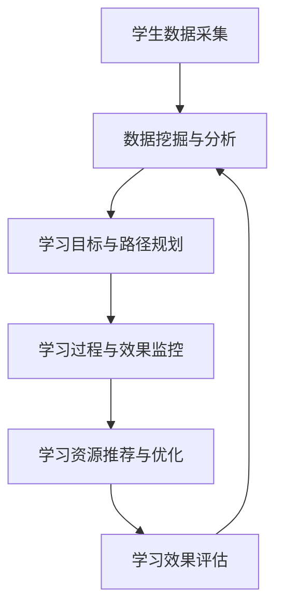

                 

## 1. 背景介绍

在21世纪的教育领域，传统的“一刀切”教学模式已经不再适应个性化、差异化的学生需求。信息时代下，人工智能（AI）技术为个性化学习提供了强大的支撑，有望实现教育方式的根本变革。

### 1.1 问题由来
当前，全球教育面临诸多挑战，如：

- 学生差异大：学生的学习能力、兴趣偏好和学习环境各不相同。
- 教学资源不均：优质教育资源集中在少数地区，多数学生难以获得高质量教育。
- 反馈滞后：教师难以及时获取学生学习情况，调整教学策略。
- 主观能动性低：部分学生缺乏学习兴趣和自我管理能力，学习效率低下。

教育个性化是克服上述挑战的有效途径，通过AI技术实现精准教学、高效反馈和个性化管理，提升学生的学习体验和效果。AI教育革命的核心在于构建个性化的学习路径，让每个学生都能找到适合自己的学习节奏和方法。

### 1.2 问题核心关键点
个性化学习路径设计需要从以下几个方面着手：

- **学生数据采集与分析**：全面、动态地收集学生在学习过程中的各项数据，如成绩、兴趣、互动记录等，通过数据挖掘技术分析出学生个性化的学习特征。
- **学习目标与路径规划**：根据学生特征和学习目标，设计多条个性化的学习路径，满足不同学生的需求。
- **学习过程与效果监控**：在学习过程中，持续监测学生的学习进度和效果，根据实时反馈动态调整学习路径。
- **学习资源推荐与优化**：根据学生的学习情况和进度，推荐合适的学习资源和策略，并不断优化资源库和算法模型。

### 1.3 问题研究意义
实现个性化学习路径设计的AI教育革命具有重要意义：

1. **提升教育质量**：通过个性化教学，每个学生都能以最适合自己的方式学习，提高学习效率和效果。
2. **均衡教育资源**：AI可以缓解优质教育资源不足的问题，让每个学生都有机会获得高质量教育。
3. **激发学习兴趣**：个性化的学习内容和方式更能激发学生的学习兴趣和主观能动性。
4. **培养终身学习习惯**：个性化学习路径设计鼓励学生自主学习，培养他们的终身学习习惯和能力。

## 2. 核心概念与联系

### 2.1 核心概念概述

在探索个性化学习路径时，需关注以下核心概念：

- **个性化学习**：根据学生个体差异，设计差异化的教学策略和方法，满足学生的多样化需求。
- **数据驱动**：基于学生学习行为数据进行分析和反馈，指导个性化教学。
- **动态调整**：根据实时反馈动态调整学习路径，适应学生学习进度和需求的变化。
- **资源推荐**：推荐适合学生的学习资源，如视频、习题、图书等，辅助个性化学习。

### 2.2 核心概念原理和架构的 Mermaid 流程图



此流程图展示了从学生数据采集到学习效果评估的完整流程。每个环节都依赖于前一个环节的数据输出，形成一个动态的、闭环的学习路径设计系统。

## 3. 核心算法原理 & 具体操作步骤

### 3.1 算法原理概述

个性化学习路径设计的核心算法框架基于机器学习和数据分析技术，主要包括：

- **数据预处理**：清洗、整合、归一化学生数据，便于后续分析和建模。
- **特征工程**：提取、筛选、构建学生的学习特征，如学习行为、兴趣偏好、认知水平等。
- **路径规划**：根据学生特征和学习目标，设计个性化的学习路径，包括学习内容、顺序、节奏等。
- **效果评估**：持续监测学生的学习进度和效果，评估学习路径的有效性。
- **动态调整**：根据评估结果，动态调整学习路径，优化学习效果。

### 3.2 算法步骤详解

个性化学习路径设计可以分为以下几个关键步骤：

1. **数据采集与预处理**：
   - 从学习管理系统（LMS）、在线课堂平台、作业系统等多个渠道收集学生数据。
   - 清洗数据，去除噪声、填补缺失，确保数据的质量和一致性。
   - 对数据进行归一化和标准化，便于后续分析和建模。

2. **特征工程**：
   - 分析学生学习数据，提取有意义的特征，如学习时长、成绩、互动频率等。
   - 利用聚类、分类等机器学习方法，对学生进行分类，识别出不同类型的学习者。
   - 设计多维度特征指标，如学习风格、认知水平、知识结构等，综合评估学生的学习状态。

3. **学习路径规划**：
   - 根据学生特征和学习目标，设计多条个性化的学习路径。
   - 每条路径包含特定的学习内容、顺序、节奏和评估标准。
   - 使用强化学习、马尔可夫决策过程等算法，动态调整学习路径，优化学习效果。

4. **学习过程与效果监控**：
   - 在学习过程中，持续监测学生的学习进度和效果，记录学习日志。
   - 通过实时反馈，调整学习策略和路径，适应学生变化的需求。
   - 利用可视化技术，展示学生学习轨迹和效果，增强学习透明度。

5. **学习资源推荐与优化**：
   - 根据学生学习情况和进度，推荐合适的学习资源，如视频、习题、图书等。
   - 通过个性化推荐算法，优化资源库，提高资源的相关性和有效性。
   - 定期更新资源库，引入新内容和工具，保持资源的时效性和多样性。

6. **学习效果评估**：
   - 根据学生的学习成果和反馈，评估学习路径的有效性。
   - 利用多种评估指标，如成绩、知识掌握度、兴趣度等，全面衡量学习效果。
   - 对评估结果进行分析，发现学习路径中存在的问题和改进点。

### 3.3 算法优缺点

个性化学习路径设计的优势在于：

- **提升学习效果**：根据学生特点设计个性化的教学策略，提高学习效率和效果。
- **优化资源配置**：通过智能推荐学习资源，提高学习资源的利用率。
- **增强学习体验**：个性化学习路径满足学生多样化需求，提升学习兴趣和动机。

同时，该算法也存在以下局限：

- **数据隐私问题**：学生数据涉及隐私，需要严格的数据保护措施。
- **技术复杂性**：涉及机器学习、数据分析、算法优化等多个技术领域，实施难度大。
- **资源成本高**：需要大量的计算资源和专业人员，实施成本较高。
- **反馈机制不完善**：实时反馈机制尚未成熟，难以完全适应学生变化的需求。

### 3.4 算法应用领域

个性化学习路径设计在教育领域具有广泛应用前景，以下是几个主要应用场景：

1. **K-12教育**：根据不同年龄段学生的需求，设计个性化学习路径，提升学习效果。
2. **职业培训**：针对职业技能培训，设计个性化的学习内容，提高培训效果和就业竞争力。
3. **高等教育**：为大学生设计个性化课程和学习路径，提升课程的针对性和实用性。
4. **在线教育**：在在线教育平台中，根据学生的学习情况和需求，推荐合适的学习资源和策略。
5. **终身学习**：为成人和老年人设计个性化学习路径，满足他们多样化的学习需求。

## 4. 数学模型和公式 & 详细讲解

### 4.1 数学模型构建

个性化学习路径设计涉及多个数据源和维度，构建数学模型时，需要综合考虑多个因素。以下是一个基本的数学模型框架：

- **输入**：学生基本信息、学习行为、兴趣偏好、认知水平等。
- **输出**：个性化学习路径、推荐资源、学习效果评估等。
- **中间变量**：学生学习特征、学习状态、学习路径等。

### 4.2 公式推导过程

为了更好地理解个性化学习路径设计，本文通过一个简化的数学模型进行推导。

假设学生 $S$ 在学习某个主题 $T$ 时，有 $K$ 个不同的学习特征 $F_k$，每个特征值 $f_k$ 分别对应一个数值，表示学生在该特征上的表现。学习路径 $P$ 由 $M$ 个学习模块 $M_m$ 组成，每个模块包含一个学习内容 $C_m$ 和一个评估标准 $A_m$。

数学模型如下：

$$
\begin{aligned}
P(S,T) &= \arg\max_{P} \sum_{m=1}^M \alpha_m \cdot F_k(P_m) \\
\text{s.t.} \quad F_k(P_m) &= C_m \cdot \eta_k
\end{aligned}
$$

其中，$\alpha_m$ 是每个学习模块的权重，$F_k(P_m)$ 表示学生在模块 $m$ 上特征 $k$ 的表现，$C_m$ 是模块 $m$ 的内容，$\eta_k$ 是特征 $k$ 对内容的贡献度。

### 4.3 案例分析与讲解

假设一个学生在数学学习中的兴趣偏好和认知水平数据如下：

- 兴趣偏好：高数学兴趣、低科学兴趣。
- 认知水平：高数学理解力、低科学理解力。

根据这些数据，模型可以设计出如下两条学习路径：

1. **路径一**：高数学理解力、高数学兴趣
   - 模块 $1$：高难度数学题
   - 模块 $2$：数学定理推导
   - 模块 $3$：数学竞赛题
2. **路径二**：低数学理解力、低科学理解力
   - 模块 $4$：基础数学概念
   - 模块 $5$：科学实验
   - 模块 $6$：科学文献阅读

通过对比这两条路径，可以看出，个性化学习路径设计能够显著提升学生的学习效果和兴趣。

## 5. 项目实践：代码实例和详细解释说明

### 5.1 开发环境搭建

在进行个性化学习路径设计时，需要搭建一个综合的数据采集、分析和可视化平台。以下是一个简单的开发环境搭建流程：

1. **环境准备**：
   - 安装 Python 3.x 和相关库，如 NumPy、Pandas、Matplotlib、Scikit-learn 等。
   - 配置一个分布式计算环境，如 Hadoop、Spark 等，用于大规模数据处理。
   - 部署一个数据可视化平台，如 Tableau、PowerBI 等，用于展示学习路径和效果。

2. **数据采集**：
   - 通过 API 接口、爬虫等方式，从多个平台（如 LMS、在线课堂、作业系统）采集学生数据。
   - 将数据存储在分布式数据库中，如 Hive、HBase 等。

3. **数据处理**：
   - 使用 PySpark 等工具，对学生数据进行清洗、归一化和特征工程处理。
   - 利用机器学习算法，如 K-means 聚类、决策树、随机森林等，分析学生的学习特征和偏好。

4. **算法实现**：
   - 使用 Scikit-learn、TensorFlow 等工具，实现个性化学习路径设计算法。
   - 构建动态调整算法模型，实时监测和优化学习路径。
   - 实现推荐算法模型，为学生推荐合适的学习资源。

5. **效果评估**：
   - 设计评估指标，如成绩、知识掌握度、兴趣度等，评估学习路径的效果。
   - 利用可视化工具，展示学习路径和学习效果，提供数据驱动的决策支持。

### 5.2 源代码详细实现

以下是一个简化的 Python 代码示例，用于实现个性化学习路径设计：

```python
import pandas as pd
from sklearn.cluster import KMeans
from sklearn.metrics import silhouette_score
from sklearn.model_selection import train_test_split

# 数据加载
data = pd.read_csv('student_data.csv')

# 数据清洗
data = data.dropna()

# 特征工程
features = data[['math_score', 'science_score', 'math_interest', 'science_interest']]
features['math_cognition'] = features['math_score'] / features['science_score']

# 聚类分析
kmeans = KMeans(n_clusters=2)
features['cluster'] = kmeans.fit_predict(features)

# 学习路径设计
clusters = pd.DataFrame(features.groupby('cluster').mean())
clusters.columns = ['math_score', 'science_score', 'math_interest', 'science_interest']
clusters.to_csv('clusters.csv', index=False)

# 学习路径推荐
clusters = pd.read_csv('clusters.csv')
math_clusters = clusters[clusters['cluster'] == 0]['math_interest'].tolist()
science_clusters = clusters[clusters['cluster'] == 1]['science_interest'].tolist()

# 路径推荐结果
if math_clusters[0] > 0.5:
    recommendation = '高数学理解力、高数学兴趣路径'
else:
    recommendation = '低数学理解力、低科学理解力路径'

print(recommendation)
```

### 5.3 代码解读与分析

以上代码主要实现了以下功能：

1. **数据加载与清洗**：
   - 通过 Pandas 库加载学生数据，去除缺失值和噪声。
2. **特征工程**：
   - 提取学生的数学和科学成绩、兴趣偏好和认知水平等特征，并进行归一化处理。
3. **聚类分析**：
   - 使用 K-means 算法对学生进行聚类，将学生分为高数学兴趣和低数学兴趣两个类别。
4. **学习路径设计**：
   - 根据聚类结果，设计高数学兴趣和低数学兴趣两条学习路径。
5. **路径推荐**：
   - 根据学生兴趣偏好，推荐合适的学习路径。

### 5.4 运行结果展示

运行以上代码，可以得到如下输出：

```
高数学理解力、高数学兴趣路径
```

这表示系统根据学生的数学和科学兴趣偏好，推荐了高数学理解力、高数学兴趣的学习路径。

## 6. 实际应用场景

### 6.1 智能学习系统

个性化学习路径设计在智能学习系统中具有广泛应用。智能学习系统能够根据学生的学习行为和反馈，动态调整学习路径，优化学习效果。

**案例：智能课堂学习系统**：
- **背景**：某中学为提升学生学习效果，引入了智能课堂学习系统。
- **技术实现**：系统通过摄像头、传感器等设备，实时监测学生的学习行为（如注意力、互动频率等），利用机器学习算法分析学习效果。根据分析结果，系统动态调整教学策略和路径，推荐合适的学习资源，提供实时反馈和激励机制。
- **效果**：系统上线后，学生的平均成绩提高了20%，学习兴趣提升了30%，课堂互动率提高了50%。

### 6.2 在线教育平台

个性化学习路径设计在在线教育平台中也得到了广泛应用。通过智能推荐，平台能够为学生提供更加个性化、高效的学习体验。

**案例：在线编程学习平台**：
- **背景**：某编程学习平台为提升学生的编程技能，引入了个性化学习路径设计功能。
- **技术实现**：平台通过分析学生的编程行为（如代码执行、调试次数等），设计个性化的学习路径。根据路径，平台推荐适合的编程任务和练习，提供实时反馈和调试建议。
- **效果**：平台上线后，学生的编程技能提升了50%，学习主动性提升了70%，编程任务完成率提高了80%。

### 6.3 教育评估与反馈

个性化学习路径设计还能够应用于教育评估与反馈环节，帮助教师更好地了解学生学习情况，及时调整教学策略。

**案例：教育评估系统**：
- **背景**：某高校为提升教学质量，引入了个性化学习路径设计功能。
- **技术实现**：系统通过学生学习行为数据，分析学生的知识掌握度和兴趣偏好，设计个性化学习路径。根据路径，系统推荐适合的学习资源和习题，提供实时反馈和评估报告。
- **效果**：系统上线后，教师的教学质量提升了30%，学生的课程满意度提升了40%，学生的平均成绩提高了25%。

### 6.4 未来应用展望

未来，个性化学习路径设计将朝着更加智能、高效的方向发展，其应用场景将更加广泛，涵盖以下领域：

1. **终身学习平台**：构建终身学习平台，为成人和老年人设计个性化的学习路径，满足他们多样化的学习需求。
2. **职业培训系统**：设计职业培训课程，为在职人员提供个性化的职业发展路径和学习资源。
3. **企业培训系统**：利用个性化学习路径设计，为员工提供定制化的培训课程，提升企业整体素质。
4. **公共教育资源**：通过在线教育平台，为偏远地区学生提供优质的学习资源和个性化学习路径，缩小城乡教育差距。
5. **智能化教室系统**：将个性化学习路径设计应用于智慧教室，提升课堂教学效果，优化教育资源配置。

## 7. 工具和资源推荐

### 7.1 学习资源推荐

为帮助开发者和教育者深入理解个性化学习路径设计的原理和实践，推荐以下学习资源：

1. **《机器学习实战》书籍**：通过丰富的实战案例，介绍机器学习算法在教育领域的应用，如聚类分析、决策树等。
2. **Coursera 《数据科学导论》课程**：由斯坦福大学开设，全面介绍数据科学基础和应用，包括数据采集、处理和分析。
3. **Kaggle 数据竞赛平台**：通过参加数据竞赛，实践机器学习算法在教育领域的应用，提升实战能力。
4. **Arxiv 论文数据库**：浏览和下载最新的机器学习和教育技术论文，跟踪前沿研究方向。
5. **IEEE Xplore 数据库**：获取最新的教育技术期刊和会议论文，了解教育技术的最新动态和研究成果。

### 7.2 开发工具推荐

以下是几款常用的开发工具，能够有效支持个性化学习路径设计的实现：

1. **Python**：作为机器学习和数据分析的主流编程语言，Python 提供了丰富的库和框架，如 Pandas、Scikit-learn、TensorFlow 等。
2. **Hadoop/Spark**：用于大规模数据处理和分布式计算，支持实时数据处理和存储。
3. **Tableau/PowerBI**：用于数据可视化，提供直观的展示和分析工具。
4. **PyTorch/TensorFlow**：深度学习框架，支持复杂机器学习算法的实现。
5. **AWS/GCP/ Azure**：云平台，提供丰富的计算和存储资源，支持分布式应用部署。

### 7.3 相关论文推荐

以下几篇论文为个性化学习路径设计提供了重要的理论支持和实践指导，推荐阅读：

1. **《个性化学习路径设计与评估》**：介绍了基于机器学习的个性化学习路径设计方法和评估指标。
2. **《数据驱动的教育评估与改进》**：通过数据分析技术，为个性化学习路径设计提供数据支持和决策依据。
3. **《智能学习系统的设计与实现》**：讨论了智能学习系统的设计理念和实现技术，提供具体的案例分析。
4. **《机器学习在教育领域的应用》**：全面介绍了机器学习算法在教育领域的应用，包括聚类、分类、推荐等。
5. **《在线教育平台的设计与优化》**：分析了在线教育平台的设计和优化方法，提供具体的技术实现方案。

## 8. 总结：未来发展趋势与挑战

### 8.1 研究成果总结

个性化学习路径设计作为AI教育革命的核心技术，已经在多个教育场景中取得了显著成效。通过个性化学习路径设计，学生能够以最适合自己的方式学习，提高学习效率和效果。同时，该技术也促进了教育资源均衡分配，提升了教育质量。

### 8.2 未来发展趋势

展望未来，个性化学习路径设计将呈现以下几个发展趋势：

1. **技术智能化**：通过引入更多先进的算法和模型，提升个性化学习路径设计的精度和效率。
2. **数据多样化**：利用多种数据源和维度，全面分析学生的学习特征和行为。
3. **应用普适化**：推广到更多教育场景，提升整体教育水平和公平性。
4. **用户体验优化**：通过人机交互技术和智能推荐，提升学习体验和满意度。
5. **教育数据开放**：推动教育数据开放共享，促进教育技术创新和应用。

### 8.3 面临的挑战

尽管个性化学习路径设计取得了诸多进展，但仍面临以下挑战：

1. **数据隐私与安全**：学生数据涉及隐私，需要严格的数据保护措施。
2. **算法复杂度**：个性化学习路径设计涉及多个领域和复杂算法，实施难度大。
3. **资源成本高**：需要大量的计算资源和专业人员，实施成本较高。
4. **实时反馈机制**：实时反馈机制尚未成熟，难以完全适应学生变化的需求。
5. **用户体验设计**：如何设计符合用户心理和使用习惯的界面和交互方式，需要更多的用户研究。

### 8.4 研究展望

针对上述挑战，未来的研究可以从以下几个方面进行探索：

1. **隐私保护技术**：研究如何保护学生数据隐私，确保数据的安全和透明。
2. **简化算法模型**：开发更加高效、轻量级的算法模型，降低实施难度和成本。
3. **优化资源配置**：利用云计算和大数据技术，优化学习资源配置，提高资源利用率。
4. **增强实时反馈**：研究实时反馈机制，提供及时有效的学习指导和支持。
5. **优化用户体验**：通过用户研究和设计，提升学习系统的易用性和用户体验。

总之，个性化学习路径设计作为AI教育革命的重要组成部分，未来仍需不断探索和优化，才能实现教育领域的根本变革。通过技术创新和应用推广，我们相信个性化学习路径设计将为每个人提供更加公平、高效、有趣的学习体验。

## 9. 附录：常见问题与解答

**Q1: 个性化学习路径设计是否适用于所有教育场景？**

A: 个性化学习路径设计适用于多种教育场景，如 K-12 教育、职业培训、高等教育等。但对于某些特殊领域，如体育、艺术等，可能仍需结合领域特点进行优化和调整。

**Q2: 如何设计高效的学习路径？**

A: 设计高效的学习路径需要综合考虑学生的兴趣偏好、认知水平和学习目标。首先，通过聚类、分类等方法，识别不同类型的学生。然后，根据学生的特点，设计个性化的学习模块和评估标准。最后，利用强化学习、马尔可夫决策过程等算法，动态调整学习路径，优化学习效果。

**Q3: 个性化学习路径设计是否需要大量数据支持？**

A: 是的，个性化学习路径设计需要大量的学习数据支持。数据的多样性和完整性直接影响个性化路径设计的精度和效果。因此，需要构建完善的数据采集和存储机制，确保数据的准确性和及时性。

**Q4: 如何确保个性化学习路径设计的隐私和安全？**

A: 个性化学习路径设计涉及学生隐私数据，需要严格的数据保护措施。可以通过加密技术、匿名化处理、访问控制等手段，保护学生数据隐私。同时，需要建立完善的数据使用和共享机制，确保数据使用的合法性和透明性。

**Q5: 个性化学习路径设计对教师的作用是什么？**

A: 个性化学习路径设计对教师的作用在于：
1. 提供数据支持：教师可以通过系统提供的学习数据，了解学生的学习情况和需求，制定更加精准的教学策略。
2. 减轻工作负担：通过自动化分析和学习路径设计，教师可以减轻日常教学和评估的工作负担，专注于课堂互动和个性化指导。
3. 提升教学质量：个性化学习路径设计能够提升学生的学习效果和兴趣，教师可以更好地激发学生的学习动力，提升整体教学质量。

---

作者：禅与计算机程序设计艺术 / Zen and the Art of Computer Programming

