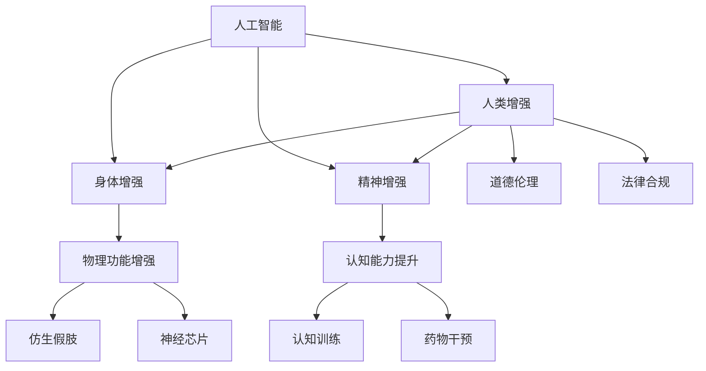

                 

# AI时代的人类增强：道德考虑与身体增强的未来发展机遇与挑战

## 1. 背景介绍

随着人工智能(AI)技术的快速发展，人类增强(Augmentation)已成为科技和商业领域的焦点话题。通过结合AI技术，人类增强不仅仅局限于精神层面，也开始触及物理层面，特别是身体增强领域。从仿生假肢到神经芯片，从基因编辑到脑机接口(Brain-Computer Interface, BCI)，身体增强技术正以前所未有的速度推进，为人类带来前所未有的发展机遇，同时也带来了不容忽视的伦理道德挑战。本文旨在深入探讨AI时代人类增强的概念、应用以及与之相关的主要道德问题，并展望未来发展趋势与面临的挑战。

## 2. 核心概念与联系

### 2.1 核心概念概述

为更好地理解AI时代的人类增强，本节将介绍几个密切相关的核心概念：

- **人工智能(AI)**：指通过机器学习、深度学习等算法实现智能决策的计算机系统。AI技术能够处理大数据、识别复杂模式，从而实现自动化和智能化。

- **人类增强(Augmentation)**：通过AI、生物技术等手段提升人类的物理、精神或认知能力，包括身体增强、精神增强、认知增强等。

- **身体增强(Physiological Enhancement)**：指通过科技手段，如仿生假肢、神经芯片、基因编辑等，改善或增强人类的身体功能。

- **精神增强(Cognitive Enhancement)**：指通过神经刺激、认知训练、药物干预等方法提升人的记忆、注意力、学习能力等认知能力。

- **道德伦理(Moral Ethics)**：关乎人类增强的各类技术应用是否符合伦理标准，包括尊重个人隐私、确保技术安全、避免技术滥用等。

- **法律合规(Legal Compliance)**：技术应用时需要遵守的法律法规，保障社会秩序与个人权益。

这些概念之间的逻辑关系可以通过以下Mermaid流程图来展示：



这个流程图展示了一系列核心概念及其之间的关系：

1. 人工智能是实现人类增强的基础技术。
2. 人类增强包括身体增强和精神增强两大领域。
3. 身体增强涉及仿生假肢和神经芯片等具体技术，精神增强包括认知训练和药物干预等。
4. 道德伦理和法律合规是技术应用需要考虑的重要方面。

## 3. 核心算法原理 & 具体操作步骤
### 3.1 算法原理概述

身体增强的算法原理主要包括两大部分：

1. **生物力学与控制算法**：用于仿生假肢和神经芯片等设备的人机交互。
2. **智能算法与机器学习**：用于预测和优化用户的行为和生理状态，实现自适应控制。

具体的算法步骤包括：

1. **数据采集**：通过传感器、穿戴设备等采集用户的生理和行为数据。
2. **信号处理**：对采集到的信号进行降噪、滤波、转换等处理，使其适合算法分析。
3. **模型训练**：利用机器学习算法对处理后的数据进行建模，建立预测模型。
4. **实时控制**：将模型输出转化为具体的控制信号，驱动身体增强设备。

### 3.2 算法步骤详解

以仿生假肢为例，其算法步骤可以分为：

1. **传感数据采集**：使用压力、加速度传感器等设备，实时采集假肢与地面接触的信号。
2. **信号预处理**：对采集到的信号进行滤波、特征提取等处理，提取有用的特征。
3. **模型训练**：使用监督学习算法，如回归、分类等，训练预测模型，实现对用户步态的预测。
4. **控制策略生成**：根据模型预测结果，生成控制指令，驱动假肢电机执行动作。

### 3.3 算法优缺点

身体增强的算法具有以下优点：

1. **精准控制**：通过机器学习模型预测用户行为，实现精准的人机交互。
2. **自适应性强**：模型能够根据用户的行为和生理状态进行动态调整，提高用户体验。
3. **扩展性强**：可以应用于各种身体增强设备，如假肢、助听器、眼镜等。

同时，这些算法也存在以下缺点：

1. **数据隐私问题**：传感数据的采集涉及用户的隐私，可能引发伦理争议。
2. **算法偏见**：机器学习模型可能存在训练数据偏见，导致不公正的预测结果。
3. **技术复杂性**：算法设计复杂，需要大量的数据和计算资源。
4. **误操作风险**：算法的输出可能出现误判，影响用户体验甚至安全。

### 3.4 算法应用领域

身体增强的算法主要应用于以下几个领域：

- **仿生假肢**：帮助肢体残疾人士恢复行走功能。
- **助听器**：提高听力障碍人士的听力感知能力。
- **增强眼镜**：为视力障碍人士提供视觉补偿。
- **脑机接口**：实现脑控设备，如轮椅、机械手等。

## 4. 数学模型和公式 & 详细讲解 & 举例说明

### 4.1 数学模型构建

身体增强的数学模型通常包括生物力学模型和控制模型：

1. **生物力学模型**：描述假肢与人体运动的关系，如虚功原理模型、刚体动力学模型等。
2. **控制模型**：用于预测和优化用户行为，如回归模型、状态空间模型等。

### 4.2 公式推导过程

以仿生假肢的控制模型为例，其公式推导过程如下：

1. **信号预处理**：
   - 假设采集到的信号为 $x(t)$，经过预处理后的信号为 $y(t)$，可以表示为：
   $$ y(t) = f(x(t)) $$
   其中 $f$ 为预处理函数，包括滤波、特征提取等步骤。

2. **模型训练**：
   - 假设模型为线性回归模型，即 $y(t) = w_0 + \sum_{i=1}^n w_i x_i(t)$，其中 $w_i$ 为模型参数。
   - 通过监督学习算法，如梯度下降，最小化损失函数 $L$：
   $$ L = \frac{1}{2N} \sum_{i=1}^N (y_i - (w_0 + \sum_{j=1}^n w_j x_{ij}(t)))^2 $$
   其中 $N$ 为训练样本数量，$x_{ij}(t)$ 为第 $i$ 个训练样本的第 $j$ 个特征。

3. **实时控制**：
   - 根据模型预测结果 $y(t)$，生成控制指令 $u(t)$，如：
   $$ u(t) = g(y(t)) $$
   其中 $g$ 为控制函数，将预测结果转化为具体的控制信号。

### 4.3 案例分析与讲解

假肢控制的案例分析：

- **数据采集**：使用IMU传感器（加速度计、陀螺仪等）和压力传感器，采集假肢运动数据和地面反作用力数据。
- **信号预处理**：对采集到的信号进行低通滤波、均值滤波、归一化等处理。
- **模型训练**：使用线性回归模型，训练预测用户步态的线性关系。
- **控制策略生成**：根据模型预测的步态特征，生成相应的控制指令，驱动假肢电机。

## 5. 项目实践：代码实例和详细解释说明

### 5.1 开发环境搭建

在进行身体增强项目实践前，我们需要准备好开发环境。以下是使用Python进行TensorFlow开发的环境配置流程：

1. 安装Anaconda：从官网下载并安装Anaconda，用于创建独立的Python环境。

2. 创建并激活虚拟环境：
```bash
conda create -n tf-env python=3.8 
conda activate tf-env
```

3. 安装TensorFlow：根据CUDA版本，从官网获取对应的安装命令。例如：
```bash
conda install tensorflow -c pytorch -c conda-forge
```

4. 安装各类工具包：
```bash
pip install numpy pandas scikit-learn matplotlib tqdm jupyter notebook ipython
```

完成上述步骤后，即可在`tf-env`环境中开始身体增强的实践。

### 5.2 源代码详细实现

这里我们以仿生假肢为例，使用TensorFlow实现仿生假肢的控制算法。

```python
import tensorflow as tf
from tensorflow.keras.layers import Dense, Flatten
from tensorflow.keras import Sequential
import numpy as np

class MyModel(tf.keras.Model):
    def __init__(self, input_shape, output_shape):
        super(MyModel, self).__init__()
        self.flatten = Flatten()
        self.dense1 = Dense(64, activation='relu')
        self.dense2 = Dense(output_shape, activation='sigmoid')

    def call(self, x):
        x = self.flatten(x)
        x = self.dense1(x)
        x = self.dense2(x)
        return x

# 训练数据
x_train = np.random.rand(100, 10)
y_train = np.random.rand(100, 2)

# 模型定义
model = MyModel(input_shape=x_train.shape[1:], output_shape=2)
optimizer = tf.keras.optimizers.Adam()

# 损失函数定义
loss_fn = tf.keras.losses.BinaryCrossentropy()

# 模型训练
model.compile(optimizer=optimizer, loss=loss_fn, metrics=['accuracy'])
model.fit(x_train, y_train, epochs=10, batch_size=32)

# 预测
x_test = np.random.rand(10, 10)
y_test = model.predict(x_test)
```

### 5.3 代码解读与分析

让我们再详细解读一下关键代码的实现细节：

**MyModel类**：
- `__init__`方法：初始化模型结构，包括一个Flatten层、两个Dense层。
- `call`方法：前向传播过程，将输入通过Flatten和Dense层，输出到sigmoid激活函数，生成预测结果。

**训练数据**：
- `x_train`和`y_train`：分别表示输入特征和标签，用于模型训练。

**模型定义**：
- 使用`MyModel`类定义模型结构，包括Flatten层、Dense层。
- 使用Adam优化器进行模型优化。

**损失函数**：
- 使用BinaryCrossentropy损失函数，适用于二分类问题。

**模型训练**：
- 使用`compile`方法配置模型参数，使用`fit`方法进行模型训练，设定训练轮数和批次大小。

**预测**：
- 使用`predict`方法对测试数据进行预测，返回预测结果。

## 6. 实际应用场景

### 6.1 智能假肢

智能假肢是身体增强的重要应用领域，通过结合AI技术，可以显著提升假肢的使用体验和控制精度。

智能假肢通常具备以下功能：

1. **自适应控制**：通过传感器实时采集用户的步态和环境数据，自动调整假肢的输出动作，提升舒适性和灵活性。
2. **视觉辅助**：结合摄像头和计算机视觉技术，自动识别和避障，提高假肢的自主性。
3. **语音控制**：用户可以通过语音指令控制假肢，增强交互性。

### 6.2 助听器增强

助听器增强通过AI技术提升听力障碍人士的听力感知能力，改善其生活质量。

主要应用包括：

1. **语音增强**：通过降噪、回声抑制等技术，提升听到的语音质量。
2. **实时翻译**：将听到的语音实时翻译成文字，帮助用户理解对话内容。
3. **声音引导**：通过音频增强，提升助听器的声音传输效果，减少环境噪音干扰。

### 6.3 增强眼镜

增强眼镜是身体增强的另一个重要方向，通过AI技术为视力障碍人士提供视觉补偿。

主要应用包括：

1. **视觉辅助**：通过计算机视觉技术，识别并放大用户关注的物体，改善其视觉体验。
2. **声音引导**：将识别到的物体转换为声音，辅助用户进行互动。
3. **健康监测**：通过摄像头和传感器，实时监测用户的视力变化和视觉环境，提供健康建议。

## 7. 工具和资源推荐
### 7.1 学习资源推荐

为了帮助开发者系统掌握身体增强的理论基础和实践技巧，这里推荐一些优质的学习资源：

1. **《机器人与增强人》（Robotics and Augmentation）**：一本介绍机器人与增强人技术原理的权威书籍，涵盖了仿生学、神经控制、感知系统等内容。

2. **《深度学习与身体增强》（Deep Learning and Physical Enhancement）**：一本介绍如何使用深度学习技术进行身体增强的教材，提供了丰富的实践案例和代码示例。

3. **《仿生学原理》（Principles of Bionics）**：一本介绍仿生学原理的教材，深入浅出地讲解了仿生假肢、神经芯片等技术的基本概念和应用。

4. **ArXiv预印本**：ArXiv收录了大量身体增强技术的论文，涵盖仿生学、神经工程、计算机视觉等多个领域，是研究前沿技术的绝佳资源。

通过对这些资源的学习实践，相信你一定能够快速掌握身体增强的核心技术，并用于解决实际的增强问题。

### 7.2 开发工具推荐

高效的开发离不开优秀的工具支持。以下是几款用于身体增强开发的常用工具：

1. **TensorFlow**：由Google主导开发的开源深度学习框架，支持多GPU、多设备分布式训练，适合大规模工程应用。

2. **PyTorch**：Facebook开源的深度学习框架，灵活性高，适用于快速迭代研究。

3. **MyModel类**：TensorFlow的高级API，可以方便地定义和训练深度学习模型，支持GPU加速。

4. **Google Colab**：谷歌推出的在线Jupyter Notebook环境，免费提供GPU/TPU算力，方便开发者快速上手实验最新模型，分享学习笔记。

合理利用这些工具，可以显著提升身体增强项目的开发效率，加快创新迭代的步伐。

### 7.3 相关论文推荐

身体增强技术的发展源于学界的持续研究。以下是几篇奠基性的相关论文，推荐阅读：

1. **《仿生学在人体增强中的应用》（Bionics in Human Enhancement）**：介绍了仿生假肢、神经芯片等身体增强技术的原理和应用。

2. **《深度学习与智能假肢》（Deep Learning for Smart Prosthetics）**：研究了如何使用深度学习技术提升假肢的控制精度和适应性。

3. **《助听器的AI增强》（AI Enhanced Hearing Aids）**：探讨了AI技术在助听器中的应用，包括降噪、语音增强、实时翻译等。

4. **《增强眼镜的视觉辅助》（Vision Assistance for Augmented Glasses）**：介绍了增强眼镜的视觉辅助技术，包括计算机视觉、深度学习等。

这些论文代表了大语言模型微调技术的发展脉络。通过学习这些前沿成果，可以帮助研究者把握学科前进方向，激发更多的创新灵感。

## 8. 总结：未来发展趋势与挑战

### 8.1 总结

本文对AI时代的人类增强概念、应用以及相关道德问题进行了全面系统的介绍。首先阐述了身体增强的概念、应用以及与之相关的主要道德问题，明确了身体增强在AI时代的巨大潜力和挑战。其次，从原理到实践，详细讲解了身体增强的算法原理和具体操作步骤，给出了身体增强任务的完整代码实例。同时，本文还广泛探讨了身体增强技术在智能假肢、助听器、增强眼镜等多个行业领域的应用前景，展示了身体增强范式的广阔前景。最后，本文精选了身体增强技术的各类学习资源，力求为读者提供全方位的技术指引。

通过本文的系统梳理，可以看到，AI时代的人类增强技术正以惊人的速度推进，为人类带来前所未有的发展机遇。同时，伴随技术的发展，相应的伦理道德挑战也愈发凸显，如何在追求技术进步的同时，确保伦理道德的底线，将是大语言模型微调技术迈向成熟的必由之路。相信随着学界和产业界的共同努力，这些挑战终将一一被克服，身体增强技术必将在构建人机协同的智能时代中扮演越来越重要的角色。

### 8.2 未来发展趋势

展望未来，身体增强技术将呈现以下几个发展趋势：

1. **技术整合与应用深化**：未来身体增强将更多地与其他AI技术进行整合，如计算机视觉、自然语言处理、增强现实等，提升增强设备的智能性和用户体验。
2. **个性化定制与柔性制造**：基于用户需求进行个性化定制，实现身体增强设备的柔性制造，提供更符合个体需求的增强解决方案。
3. **持续学习与自适应性**：增强设备将具备持续学习能力，根据用户的反馈和环境变化，实时调整控制策略，提升使用体验。
4. **伦理道德与社会责任**：随着身体增强技术的普及，伦理道德问题将愈发突出，社会需制定相关法律法规，保障用户权益。
5. **跨学科合作与多模态融合**：身体增强技术将需要跨学科合作，多模态数据融合，如视觉、听觉、触觉等，提升设备的综合性能。
6. **产业化与市场应用**：身体增强技术将逐步产业化，进入医疗、教育、娱乐等市场，为人类社会带来广泛影响。

以上趋势凸显了身体增强技术的广阔前景。这些方向的探索发展，必将进一步提升身体增强设备的性能和应用范围，为人类生活带来更深刻的变革。

### 8.3 面临的挑战

尽管身体增强技术已经取得了瞩目成就，但在迈向更加智能化、普适化应用的过程中，它仍面临着诸多挑战：

1. **伦理道德争议**：身体增强可能引发一系列伦理道德争议，如隐私权、公平性、依赖性等。如何在技术进步与伦理道德之间找到平衡，是亟待解决的问题。
2. **技术安全与隐私保护**：身体增强设备可能涉及用户的敏感数据，如何确保数据安全和隐私保护，避免数据泄露和滥用，是必须重视的问题。
3. **技术规范与标准化**：当前身体增强技术尚未形成统一的技术规范和标准，不同设备的兼容性、互操作性存在挑战。如何制定统一的行业标准，促进技术健康发展，是重要的研究课题。
4. **用户接受度与教育普及**：身体增强技术在实际应用中可能面临用户的抵触情绪，如何提高用户的接受度，普及相关知识，是推广应用的关键。
5. **资源与成本**：身体增强设备的研发和制造涉及高昂的资源成本，如何降低成本，提高设备的普及率，是普及应用的重要问题。
6. **技术普及与监管**：身体增强技术需要在全球范围内推广应用，但不同国家和地区对技术的接受度和监管政策存在差异。如何在全球范围内推动技术普及，确保技术健康发展，是重要的研究课题。

正视身体增强面临的这些挑战，积极应对并寻求突破，将是大语言模型微调技术迈向成熟的必由之路。相信随着学界和产业界的共同努力，这些挑战终将一一被克服，身体增强技术必将在构建人机协同的智能时代中扮演越来越重要的角色。

### 8.4 研究展望

面向未来，身体增强技术需要在以下几个方面寻求新的突破：

1. **伦理学研究**：加强伦理学研究，探讨身体增强技术对人类社会的影响，制定伦理规范，确保技术的健康发展。
2. **跨学科融合**：促进身体增强技术与其他AI技术的融合，提升设备的综合性能，拓展应用范围。
3. **多模态感知**：实现视觉、听觉、触觉等多模态数据融合，提升设备的感知能力和智能化水平。
4. **个性化定制**：基于用户的个性化需求，提供定制化的增强解决方案，提升用户体验。
5. **低成本制造**：采用柔性制造和3D打印等技术，降低成本，提高设备的普及率。
6. **普及教育**：加强用户教育，提高社会对身体增强技术的认知度，推动技术普及。

这些研究方向的探索，必将引领身体增强技术迈向更高的台阶，为人类生活带来更深刻的变革。面向未来，身体增强技术还需要与其他AI技术进行更深入的融合，共同推动自然语言理解和智能交互系统的进步。只有勇于创新、敢于突破，才能不断拓展身体增强技术的边界，让智能技术更好地造福人类社会。

## 9. 附录：常见问题与解答

**Q1：身体增强技术是否适用于所有人？**

A: 身体增强技术并非适用于所有人。由于涉及复杂的生物信号处理和设备操作，存在一定的技术门槛和风险。对于体质较弱或操作不便的群体，可能不适合使用身体增强设备。

**Q2：身体增强技术的安全性和隐私问题如何解决？**

A: 解决身体增强技术的安全性和隐私问题，需要从多个层面入手：
1. 数据加密：使用先进的数据加密技术，保护用户数据不被泄露。
2. 隐私保护：采用匿名化处理、去标识化等技术，保护用户隐私。
3. 合规性：确保技术应用符合相关法律法规，如GDPR、HIPAA等。

**Q3：身体增强技术是否会导致依赖性？**

A: 过度依赖身体增强设备可能带来依赖性问题。需注意设备的适度使用，避免对设备产生过度依赖。同时，增强设备应具备一定的智能自适性，避免因设备故障导致用户体验下降。

**Q4：身体增强技术的发展对社会有何影响？**

A: 身体增强技术的发展对社会将带来广泛影响：
1. 经济影响：推动相关产业发展，创造新的经济增长点。
2. 社会结构变化：改变劳动力的身体结构和职业分工，影响就业结构。
3. 伦理道德问题：引发一系列伦理道德争议，如隐私权、公平性、依赖性等。

**Q5：如何确保身体增强技术的公平性？**

A: 确保身体增强技术的公平性，需从以下几个方面入手：
1. 普及教育：提高公众对身体增强技术的认知度，避免信息不对称。
2. 政策支持：制定相关政策和法规，确保技术的公平可及。
3. 社会监督：加强社会监督，确保技术应用的公平性。

这些问题的探讨，将有助于更好地理解身体增强技术的实际应用前景及其面临的挑战。通过综合考虑技术、伦理、社会等多方面因素，可以更全面地推动身体增强技术的发展，使其更好地服务于人类社会。

---

作者：禅与计算机程序设计艺术 / Zen and the Art of Computer Programming

