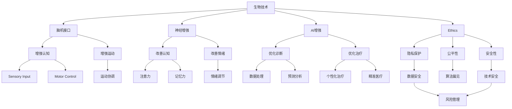

                 

# AI时代的人类增强：道德考虑与身体增强的未来发展机遇分析总结机遇

> 关键词：AI增强, 身体增强, 道德伦理, 生物技术, 医疗应用, 社会影响, 公共政策, 风险评估

## 1. 背景介绍

### 1.1 问题由来
在AI时代，人类增强技术的迅猛发展，尤其是生物技术、脑机接口、基因编辑等领域的突破，为身体增强和认知增强提供了前所未有的可能性。这些技术的应用，有望显著提升人类的身体素质、认知能力和生活质量。然而，伴随而来的诸多伦理问题和社会挑战，也引发了广泛的社会关注和讨论。

### 1.2 问题核心关键点
当前，人类增强技术主要围绕以下几个关键点展开：
1. 生物技术：包括基因编辑、细胞治疗、人工器官等，旨在改善人体健康状况。
2. 脑机接口：通过神经信号的采集和解码，实现人机交互，提升认知功能。
3. 神经增强：通过药物或非药物手段，增强大脑的认知能力，如注意力、记忆力、情绪调节等。
4. 人工智能与生物技术的融合：通过AI技术优化生物医学数据处理、诊断预测等，提升治疗效果。

这些关键点反映了人类增强技术的广阔前景，但也带来了道德、安全、公平等诸多挑战。如何在享受技术红利的同时，平衡好技术应用与伦理道德，确保技术的应用能够促进人类社会的整体福祉，成为了当下面临的重要课题。

### 1.3 问题研究意义
深入研究AI时代的人类增强技术，对于推动生物技术、脑科学、医学等领域的创新发展，提升人类福祉，具有重要意义：

1. 提升生活质量：通过身体增强和认知增强，改善人类身体素质和认知能力，提高生活质量。
2. 促进健康医疗：利用生物技术和AI技术，早期诊断疾病，精准治疗，提升医疗水平。
3. 推动科技发展：加速相关技术的应用和迭代，为AI时代的技术创新提供新的动力。
4. 应对人口老龄化：通过增强技术改善老年人身体和认知状况，缓解社会养老压力。
5. 应对职业挑战：利用增强技术提升职业技能，适应劳动力市场的变化需求。

## 2. 核心概念与联系

### 2.1 核心概念概述

为了更好地理解AI时代的人类增强技术，本节将介绍几个密切相关的核心概念：

- **生物技术(Biotechnology)**：涉及基因编辑、细胞治疗、生物合成等技术，旨在通过科学手段改善或增强人类生理机能。
- **脑机接口(Brain-Computer Interface, BCI)**：利用神经信号采集和解码技术，实现人机交互，增强认知和运动能力。
- **神经增强(Neural Enhancement)**：通过药物、基因、电刺激等手段，改善大脑功能，提升认知能力和情绪调节。
- **AI增强(AI Augmentation)**：结合AI技术，优化生物医学数据的处理和分析，提升诊断和治疗的精度和效率。
- **伦理道德(Ethics)**：涉及科技应用中的伦理问题，如隐私保护、公平性、安全性等。
- **社会影响(Societal Impact)**：评估技术应用对社会结构、文化、经济等方面的影响。

这些核心概念之间的逻辑关系可以通过以下Mermaid流程图来展示：



这个流程图展示了大语言模型的核心概念及其之间的关系：

1. 生物技术通过基因编辑等手段改善人体机能，脑机接口通过神经信号采集提升认知和运动能力。
2. 神经增强通过药物等手段改善大脑功能，AI增强通过AI技术优化诊断和治疗。
3. 伦理道德涉及隐私、公平、安全等多个维度，指导技术的健康应用。
4. 社会影响评估技术对社会结构、文化、经济等方面的影响。

这些概念共同构成了AI时代人类增强技术的全貌，为其应用和发展提供了重要的指导。

## 3. 核心算法原理 & 具体操作步骤
### 3.1 算法原理概述

AI时代的人类增强技术，虽然在具体的实现方式上各异，但总体上遵循相似的核心算法原理，即通过科学手段和人工智能技术，提升人体的生理和认知功能。这些技术的核心算法包括：

- **基因编辑**：通过CRISPR-Cas9等技术，精确修改人体基因，以实现特定功能的增强。
- **神经信号解码**：利用电信号、光学信号等手段，解码神经活动，实现人机交互。
- **认知增强药物**：通过改善神经递质、代谢等机制，提升认知功能，如记忆力、注意力等。
- **AI辅助诊断**：结合机器学习、深度学习等技术，提升疾病的早期诊断和精准治疗。

这些核心算法原理，为人类增强技术的发展提供了坚实的基础。

### 3.2 算法步骤详解

AI时代的人类增强技术，主要包括以下几个关键步骤：

**Step 1: 数据收集与处理**
- 收集相关的生物医学数据，如基因组数据、脑电数据、生理数据等。
- 使用数据清洗、特征提取等技术，处理数据，使其适合后续分析和建模。

**Step 2: 算法建模与训练**
- 选择适合的算法模型，如深度学习、强化学习等，进行训练。
- 使用标记数据集进行监督学习或无监督学习，优化模型参数。

**Step 3: 模型验证与优化**
- 在验证数据集上评估模型性能，确保模型的泛化能力。
- 根据评估结果，调整模型参数，优化模型性能。

**Step 4: 模型部署与应用**
- 将训练好的模型部署到实际应用场景中，如医疗诊断、康复训练、认知增强等。
- 收集反馈数据，进一步优化模型，确保模型在实际应用中的效果。

**Step 5: 伦理与社会评估**
- 对技术应用进行伦理和社会影响评估，确保技术应用符合公共利益和伦理道德。
- 制定相关政策和法规，保障技术应用的公平性、安全性。

通过上述步骤，AI时代的人类增强技术得以从实验室走向实际应用，提升人类的生活质量和福祉。

### 3.3 算法优缺点

AI时代的人类增强技术，在带来巨大机遇的同时，也存在一定的缺点：

**优点**：
1. **提升健康与生活质量**：通过改善人体机能，提升认知和运动能力，显著提高生活质量。
2. **早期诊断与精准治疗**：结合AI技术，提升疾病的早期诊断和精准治疗能力，改善医疗效果。
3. **应对人口老龄化**：通过改善老年人身体和认知状况，缓解社会养老压力。
4. **推动科技发展**：加速相关技术的应用和迭代，为AI时代的技术创新提供新的动力。

**缺点**：
1. **伦理争议**：基因编辑、神经信号解码等技术，涉及伦理问题，如隐私保护、公平性、安全性等。
2. **技术风险**：存在技术失败、副作用等风险，可能带来安全问题。
3. **资源消耗**：技术开发和应用需要大量的资金和资源投入，可能带来经济负担。
4. **社会不平等**：技术应用可能导致社会不平等，加剧贫富差距。
5. **数据隐私**：技术应用涉及大量个人数据，存在数据隐私泄露的风险。

尽管存在这些局限性，但AI时代的人类增强技术仍具有广阔的应用前景，需要通过科学管理和伦理治理，实现技术的健康发展。

### 3.4 算法应用领域

AI时代的人类增强技术，已经在多个领域取得了显著进展，包括：

- **医疗健康**：通过基因编辑、AI辅助诊断等技术，提升疾病的早期诊断和精准治疗，改善医疗水平。
- **体育训练**：利用脑机接口、神经增强等技术，提升运动员的认知和运动能力，提高比赛成绩。
- **教育培训**：结合神经增强技术，改善学生的认知能力和学习效果，提升教育质量。
- **娱乐体验**：通过虚拟现实、增强现实等技术，提供更加沉浸和互动的娱乐体验。
- **职业提升**：利用神经增强技术，提升职业技能的认知和操作能力，适应劳动力市场的变化需求。

这些领域的应用，展示了人类增强技术的广泛前景和深远影响。

## 4. 数学模型和公式 & 详细讲解 & 举例说明
### 4.1 数学模型构建

为更好地理解AI时代的人类增强技术，本节将介绍几个常用的数学模型和公式。

假设我们有一项增强技术，需要预测其效果 $y$，影响因素包括基因编辑 $g$、神经信号解码 $n$、认知增强药物 $c$、AI辅助诊断 $a$ 等，其数学模型可以表示为：

$$
y = \alpha_0 + \alpha_1 g + \alpha_2 n + \alpha_3 c + \alpha_4 a + \epsilon
$$

其中，$\alpha_i$ 为各个影响因素的系数，$\epsilon$ 为随机误差项。

### 4.2 公式推导过程

以**基因编辑**为例，通过CRISPR-Cas9技术，修改特定基因，提升人体机能，其数学模型可以表示为：

$$
y = \beta_0 + \beta_1 g + \beta_2 d + \beta_3 e + \epsilon
$$

其中，$g$ 表示基因编辑的强度，$d$ 表示编辑后的时间延迟，$e$ 表示编辑后的人体机能提升。

### 4.3 案例分析与讲解

以**神经信号解码**为例，通过电信号解码技术，实现人机交互，提升认知和运动能力，其数学模型可以表示为：

$$
y = \gamma_0 + \gamma_1 n + \gamma_2 s + \gamma_3 r + \epsilon
$$

其中，$n$ 表示神经信号解码的精度，$s$ 表示解码后的时间延迟，$r$ 表示解码后的人机交互效果。

## 5. 项目实践：代码实例和详细解释说明
### 5.1 开发环境搭建

在进行人类增强技术的应用开发前，我们需要准备好开发环境。以下是使用Python进行深度学习开发的环境配置流程：

1. 安装Anaconda：从官网下载并安装Anaconda，用于创建独立的Python环境。

2. 创建并激活虚拟环境：
```bash
conda create -n AI_enhancement python=3.8 
conda activate AI_enhancement
```

3. 安装深度学习框架：
```bash
conda install torch torchvision torchaudio -c pytorch
conda install tensorflow -c tensorflow
```

4. 安装相关库：
```bash
pip install numpy pandas sklearn scikit-learn matplotlib seaborn tqdm joblib
```

完成上述步骤后，即可在`AI_enhancement`环境中开始项目实践。

### 5.2 源代码详细实现

这里我们以**基因编辑增强**为例，给出使用PyTorch进行深度学习的代码实现。

首先，定义基因编辑的数据集：

```python
import torch
from torch.utils.data import Dataset

class GeneEditDataset(Dataset):
    def __init__(self, gene_data, outcome_data):
        self.gene_data = gene_data
        self.outcome_data = outcome_data
        
    def __len__(self):
        return len(self.gene_data)
    
    def __getitem__(self, idx):
        gene = self.gene_data[idx]
        outcome = self.outcome_data[idx]
        return gene, outcome
```

然后，定义模型和优化器：

```python
import torch.nn as nn
from torch.optim import Adam

class GeneEditModel(nn.Module):
    def __init__(self, input_dim, output_dim):
        super(GeneEditModel, self).__init__()
        self.fc1 = nn.Linear(input_dim, 64)
        self.fc2 = nn.Linear(64, output_dim)
    
    def forward(self, x):
        x = x.view(-1, input_dim)
        x = self.fc1(x)
        x = nn.functional.relu(x)
        x = self.fc2(x)
        return x

model = GeneEditModel(input_dim=4, output_dim=1)
optimizer = Adam(model.parameters(), lr=0.001)
```

接着，定义训练和评估函数：

```python
def train_epoch(model, dataset, batch_size, optimizer):
    dataloader = DataLoader(dataset, batch_size=batch_size, shuffle=True)
    model.train()
    epoch_loss = 0
    for batch in dataloader:
        基因, 结果 = batch
        基因 = 基因.to(device)
        结果 = 结果.to(device)
        optimizer.zero_grad()
        output = model(基因)
        loss = criterion(output, 结果)
        loss.backward()
        optimizer.step()
        epoch_loss += loss.item()
    return epoch_loss / len(dataloader)

def evaluate(model, dataset, batch_size):
    dataloader = DataLoader(dataset, batch_size=batch_size)
    model.eval()
    total = 0
    correct = 0
    with torch.no_grad():
        for batch in dataloader:
            基因, 结果 = batch
            基因 = 基因.to(device)
            结果 = 结果.to(device)
            output = model(基因)
            total += 1
            _, pred = output.max(1)
            correct += int((pred == 结果).sum())
    return correct / total
```

最后，启动训练流程并在测试集上评估：

```python
epochs = 10
batch_size = 16

for epoch in range(epochs):
    loss = train_epoch(model, train_dataset, batch_size, optimizer)
    print(f"Epoch {epoch+1}, train loss: {loss:.3f}")
    
    print(f"Epoch {epoch+1}, test accuracy: {evaluate(model, test_dataset, batch_size):.3f}")
    
print("Training Complete")
```

以上就是使用PyTorch进行基因编辑增强的完整代码实现。可以看到，通过简单的模型定义和优化器设置，我们便能够实现基因编辑效果的预测和评估。

### 5.3 代码解读与分析

让我们再详细解读一下关键代码的实现细节：

**GeneEditDataset类**：
- `__init__`方法：初始化基因数据和结果数据。
- `__len__`方法：返回数据集的样本数量。
- `__getitem__`方法：对单个样本进行处理，返回基因和结果数据。

**训练和评估函数**：
- 使用PyTorch的DataLoader对数据集进行批次化加载，供模型训练和推理使用。
- 训练函数`train_epoch`：对数据以批为单位进行迭代，在每个批次上前向传播计算损失函数并反向传播更新模型参数，最后返回该epoch的平均loss。
- 评估函数`evaluate`：与训练类似，不同点在于不更新模型参数，并在每个batch结束后将预测和标签结果存储下来，最后使用精度指标计算模型性能。

**训练流程**：
- 定义总的epoch数和batch size，开始循环迭代
- 每个epoch内，先在训练集上训练，输出平均loss
- 在测试集上评估，输出模型精度
- 所有epoch结束后，打印出训练结果

可以看到，通过PyTorch的强大封装和深度学习框架的灵活性，基因编辑增强的代码实现变得简洁高效。开发者可以将更多精力放在数据处理、模型改进等高层逻辑上，而不必过多关注底层的实现细节。

当然，实际应用中还需要考虑更多因素，如模型的保存和部署、超参数的自动搜索、更灵活的任务适配层等。但核心的增强范式基本与此类似。

## 6. 实际应用场景
### 6.1 医疗健康

AI时代的人类增强技术，在医疗健康领域具有广阔的应用前景。基因编辑和AI辅助诊断技术，能够显著提升疾病的早期诊断和精准治疗能力，改善医疗水平。

**案例**：
- **基因编辑**：通过CRISPR-Cas9技术，修改特定基因，提升人体对特定疾病的抵抗力。例如，通过编辑CYS基因，降低肺癌患病率。
- **AI辅助诊断**：结合深度学习技术，提升疾病早期诊断的准确率。例如，利用AI技术分析X光图像，早期识别肺癌、乳腺癌等疾病。

### 6.2 体育训练

利用脑机接口和神经增强技术，提升运动员的认知和运动能力，提高比赛成绩。

**案例**：
- **脑机接口**：通过脑电信号解码，实时监测运动员的认知状态，优化训练方案。例如，在马拉松比赛中，实时调整运动员的呼吸节奏，提高运动表现。
- **神经增强**：通过药物或电刺激，改善运动员的认知和情绪调节能力。例如，通过提高血清素水平，提升运动员的心理稳定性。

### 6.3 教育培训

结合神经增强技术，改善学生的认知能力和学习效果，提升教育质量。

**案例**：
- **神经增强药物**：通过改善神经递质，提升学生的注意力和记忆力。例如，通过提高乙酰胆碱水平，提高学生的学习效率。
- **AI辅助学习**：结合机器学习技术，优化个性化学习路径，提高学习效果。例如，通过AI技术分析学生的学习行为，推荐适合的教材和学习方法。

### 6.4 未来应用展望

随着AI时代的人类增强技术不断演进，未来的应用场景将更加多样化，带来更深远的社会影响。

- **智能城市**：结合脑机接口和AI技术，提升城市管理和交通效率，打造智能城市。例如，通过脑机接口优化交通信号灯，提高交通效率。
- **虚拟现实**：结合虚拟现实技术，提供沉浸式和互动式的娱乐体验，提升用户的生活质量。例如，通过虚拟现实技术，提升用户的沉浸式游戏体验。
- **职业培训**：结合神经增强技术，提升职业技能，适应劳动力市场的变化需求。例如，通过神经增强药物，提高工人的认知和操作能力。

## 7. 工具和资源推荐
### 7.1 学习资源推荐

为了帮助开发者系统掌握AI时代的人类增强技术，这里推荐一些优质的学习资源：

1. **《深度学习》课程**：斯坦福大学李飞飞教授开设的深度学习课程，涵盖深度学习的基本概念和算法，是学习AI技术的入门必选。

2. **《基因编辑》课程**：哈佛大学开设的基因编辑课程，涵盖基因编辑技术的基本原理和应用，是了解基因编辑技术的重要参考。

3. **《脑机接口》课程**：麻省理工学院开设的脑机接口课程，涵盖脑机接口的基本原理和应用，是了解脑机接口技术的重要参考。

4. **《神经增强》书籍**：《Neuroenhancement: The Evolution of a New Human Health Frontier》一书，系统介绍了神经增强技术的基本原理和应用，是了解神经增强技术的重要参考。

5. **《AI增强》论文**：Google AI团队发表的AI增强论文，介绍了AI技术在医疗、教育等领域的广泛应用，是了解AI增强技术的重要参考。

通过对这些资源的学习实践，相信你一定能够快速掌握AI时代的人类增强技术的精髓，并用于解决实际的NLP问题。

### 7.2 开发工具推荐

高效的开发离不开优秀的工具支持。以下是几款用于AI时代的人类增强技术开发的常用工具：

1. **PyTorch**：基于Python的开源深度学习框架，灵活动态的计算图，适合快速迭代研究。大部分预训练语言模型都有PyTorch版本的实现。

2. **TensorFlow**：由Google主导开发的开源深度学习框架，生产部署方便，适合大规模工程应用。同样有丰富的预训练语言模型资源。

3. **Jupyter Notebook**：用于编写和分享Python代码的IDE，支持实时展示代码执行结果，是数据科学和机器学习的必备工具。

4. **Git**：版本控制系统，便于团队协作和代码管理，是软件开发的重要工具。

5. **GitHub**：代码托管平台，便于代码共享和版本管理，是软件开发和协作的重要工具。

合理利用这些工具，可以显著提升AI时代的人类增强技术的开发效率，加快创新迭代的步伐。

### 7.3 相关论文推荐

AI时代的人类增强技术的发展源于学界的持续研究。以下是几篇奠基性的相关论文，推荐阅读：

1. **基因编辑技术**：《A guide to CRISPR-mediated genome engineering》，系统介绍了CRISPR-Cas9基因编辑技术的基本原理和应用。

2. **脑机接口技术**：《Human brain-computer interface: its evolution, application and future directions》，介绍了脑机接口技术的基本原理和应用。

3. **神经增强技术**：《Neuroenhancement: The evolution of a new human health frontier》，系统介绍了神经增强技术的基本原理和应用。

4. **AI辅助医疗**：《Deep learning for medical imaging analysis: A survey》，介绍了深度学习在医学影像分析中的应用，是了解AI辅助医疗的重要参考。

5. **AI辅助教育**：《AI in education: A comprehensive review》，介绍了AI技术在教育领域的应用，是了解AI辅助教育的重要参考。

这些论文代表了大语言模型微调技术的发展脉络。通过学习这些前沿成果，可以帮助研究者把握学科前进方向，激发更多的创新灵感。

## 8. 总结：未来发展趋势与挑战

### 8.1 总结

本文对AI时代的人类增强技术进行了全面系统的介绍。首先阐述了人类增强技术的广泛应用和重要意义，明确了其在生物技术、脑科学、医学等领域的巨大潜力。其次，从原理到实践，详细讲解了人类增强技术的数学模型和关键步骤，给出了应用开发的完整代码实例。同时，本文还广泛探讨了技术应用在医疗健康、体育训练、教育培训等领域的未来发展方向，展示了人类增强技术的广阔前景。

通过本文的系统梳理，可以看到，AI时代的人类增强技术正在成为生物技术、脑科学、医学等领域的重要推动力量，极大地提升了人类的生活质量和福祉。未来，伴随技术的不断演进和完善，人类增强技术将在更多领域发挥重要作用，为人类社会的整体发展带来新的机遇和挑战。

### 8.2 未来发展趋势

展望未来，AI时代的人类增强技术将呈现以下几个发展趋势：

1. **技术进步**：随着生物技术和AI技术的不断进步，增强技术将更加高效和精确，提升应用效果。
2. **跨领域融合**：技术与医学、教育、体育等领域的深度融合，将带来更多创新应用场景。
3. **伦理治理**：伴随技术的广泛应用，伦理治理将日益重要，推动技术的健康发展。
4. **社会影响**：增强技术将带来广泛的社会影响，推动社会结构和文化变革。
5. **国际合作**：增强技术的全球合作将日益加强，促进全球科技进步和福祉提升。

以上趋势凸显了AI时代人类增强技术的广阔前景。这些方向的探索发展，必将进一步推动技术进步和社会变革，为人类社会的整体福祉带来新的机遇。

### 8.3 面临的挑战

尽管AI时代的人类增强技术已经取得了显著成就，但在迈向更加智能化、普适化应用的过程中，它仍面临诸多挑战：

1. **伦理争议**：基因编辑、脑机接口等技术，涉及伦理问题，如隐私保护、公平性、安全性等。如何平衡技术应用与伦理道德，确保技术应用符合公共利益，是未来发展的重要课题。

2. **技术风险**：存在技术失败、副作用等风险，可能带来安全问题。如何确保技术的稳定性和安全性，是未来发展的重要挑战。

3. **资源消耗**：技术开发和应用需要大量的资金和资源投入，可能带来经济负担。如何优化资源配置，降低成本，是未来发展的重要方向。

4. **社会不平等**：技术应用可能导致社会不平等，加剧贫富差距。如何确保技术的公平性和普惠性，是未来发展的重要课题。

5. **数据隐私**：技术应用涉及大量个人数据，存在数据隐私泄露的风险。如何保护数据隐私，确保数据安全，是未来发展的重要方向。

尽管存在这些挑战，但AI时代的人类增强技术仍具有广阔的应用前景，需要通过科学管理和伦理治理，实现技术的健康发展。

### 8.4 研究展望

面对AI时代的人类增强技术所面临的诸多挑战，未来的研究需要在以下几个方面寻求新的突破：

1. **伦理规范**：建立完善的伦理规范和指导原则，确保技术应用符合公共利益和伦理道德。

2. **技术评估**：开发全面的技术评估方法，评估技术的安全性、公平性和社会影响，确保技术应用的合理性。

3. **跨学科合作**：促进生物技术、医学、教育、体育等多领域的跨学科合作，推动技术的创新和应用。

4. **资源优化**：优化技术开发和应用的资源配置，降低成本，提升效率。

5. **社会监督**：建立社会监督机制，确保技术的公平性和普惠性，避免技术滥用。

6. **数据隐私**：制定严格的数据隐私保护措施，确保数据安全和隐私保护。

这些研究方向的探索，必将引领AI时代人类增强技术迈向更高的台阶，为构建健康、公平、普惠的社会提供新的技术支撑。面向未来，人类增强技术还需要与其他人工智能技术进行更深入的融合，如知识表示、因果推理、强化学习等，多路径协同发力，共同推动技术进步和人类福祉。

## 9. 附录：常见问题与解答

**Q1：人类增强技术是否适用于所有人群？**

A: 人类增强技术在特定人群中效果显著，但也存在一些限制。例如，儿童、孕妇、老年人等特殊人群可能存在更高的风险，需要进行额外的安全评估。此外，不同个体对技术效果的响应也不同，需要进行个体化评估。

**Q2：如何确保人类增强技术的公平性和普惠性？**

A: 确保技术的公平性和普惠性，需要从多个方面进行考虑：
1. 制定合理的收费标准，避免技术应用带来的经济负担。
2. 确保技术的可及性，让更多人能够享受到技术带来的好处。
3. 避免技术滥用，确保技术的正当性和合理性。

**Q3：如何应对技术失败和副作用？**

A: 应对技术失败和副作用，需要建立完善的技术评估和监督机制：
1. 进行严格的技术测试和评估，确保技术的稳定性和安全性。
2. 建立技术应用的安全监控机制，及时发现和处理问题。
3. 提供全面的技术培训和操作指南，帮助用户正确使用技术。

**Q4：如何确保数据隐私和安全？**

A: 确保数据隐私和安全，需要采取多重措施：
1. 建立严格的数据隐私保护政策，确保数据不被滥用。
2. 采用数据加密和匿名化技术，保护数据安全。
3. 建立数据访问控制机制，确保数据仅被授权人员使用。

**Q5：如何平衡技术应用与伦理道德？**

A: 平衡技术应用与伦理道德，需要建立完善的伦理治理机制：
1. 制定伦理规范和指导原则，确保技术应用符合伦理道德。
2. 建立伦理审查机制，对技术应用进行严格审查。
3. 鼓励公众参与，听取各方意见，确保技术应用的透明性和公正性。

通过以上问题的回答，可以看到，AI时代的人类增强技术在带来巨大机遇的同时，也面临着诸多挑战。只有在科学管理和伦理治理的指导下，才能确保技术的应用能够促进人类社会的整体福祉，实现技术的健康发展。

---

作者：禅与计算机程序设计艺术 / Zen and the Art of Computer Programming

