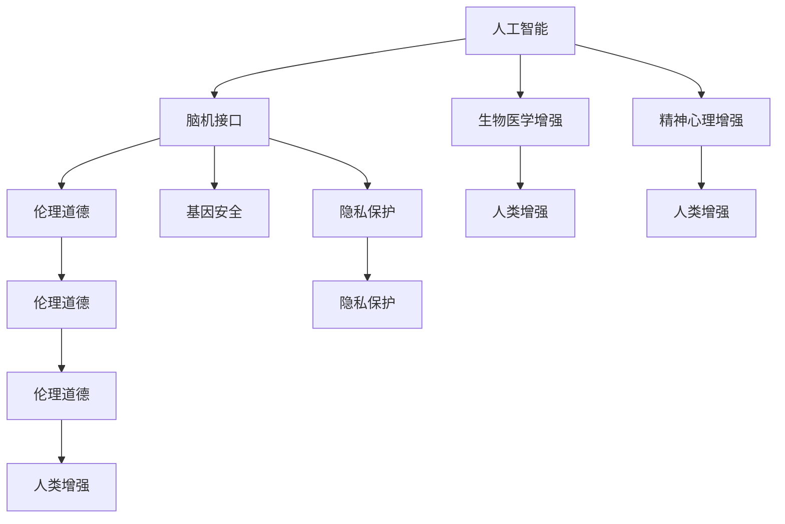

                 

# AI时代的人类增强：道德考虑和身体增强技术

> 关键词：人工智能(AI), 人类增强, 道德伦理, 身体增强技术, 生物医学, 基因编辑, 脑机接口, 精神心理增强

## 1. 背景介绍

### 1.1 问题由来

随着人工智能(AI)技术的迅猛发展，人类增强(Human Augmentation)成为了一个备受关注的话题。AI不仅在计算能力、数据分析等方面超越人类，也开始向生物医学、脑科学等更前沿领域渗透。人类增强技术的出现，让人类有望获得超越自然能力的增强，进而改变人类的生理和心理结构，甚至重新定义人类生存和发展的模式。

然而，人类增强技术的发展也伴随着诸多伦理和道德挑战。例如，基因编辑引发的基因安全问题、脑机接口技术的隐私和安全问题、精神心理增强的伦理困境等，都是亟需解决的难题。如何在享受科技进步带来的红利的同时，保障人类健康、伦理和社会的公平正义，成为了AI时代人类增强技术发展的关键问题。

### 1.2 问题核心关键点

人类增强技术主要包括以下几类：

- **基因编辑技术**：如CRISPR-Cas9，可以修改基因序列，修复或增加遗传特性，如增强免疫力、治疗遗传疾病等。

- **生物医学增强**：包括植入人工器官、使用生物药物、增强免疫系统等，以提升人类健康水平。

- **脑机接口(Brain-Computer Interface, BCIs)**：通过解码和操控脑电信号，实现对肢体、认知能力的增强。

- **精神心理增强**：如抗抑郁药、认知增强药物、心理治疗等，提升认知能力和情绪调节能力。

这些技术在提升人类生活质量的同时，也可能引发隐私、安全、伦理等问题。例如，基因编辑可能改变人的自然属性，引发道德争议；脑机接口可能被滥用，导致隐私泄露；精神心理增强可能带来依赖性和副作用。

## 2. 核心概念与联系

### 2.1 核心概念概述

为更好地理解人类增强技术的伦理和道德问题，本节将介绍几个密切相关的核心概念：

- **人工智能**：通过算法和计算能力，使机器模仿人类智能行为的技术。
- **人类增强**：通过生物医学、脑科学等技术手段，提升人类生理和心理能力的过程。
- **伦理道德**：规范社会行为、保障个体和群体权益的道德准则和法律规定。
- **隐私保护**：保障个人数据安全、防止信息滥用的措施。
- **基因安全**：在基因编辑过程中，确保基因操作不会产生不良影响。
- **脑机接口**：实现大脑与计算机的直接交互，提升人类认知和运动能力。
- **精神心理增强**：通过药物、心理治疗等方式，改善心理健康和认知能力。

这些核心概念之间的逻辑关系可以通过以下Mermaid流程图来展示：



这个流程图展示了大语言模型的核心概念及其之间的关系：

1. 人工智能通过生物医学增强、脑机接口、精神心理增强等方式，实现对人类增强的支持。
2. 在人类增强的过程中，隐私保护、基因安全、伦理道德等概念是必须考量的重要因素。
3. 隐私保护、基因安全和伦理道德构成了一个复杂的体系，保障了人类增强技术的健康发展。

## 3. 核心算法原理 & 具体操作步骤
### 3.1 算法原理概述

人类增强技术涉及多个领域，如生物医学、脑科学、计算机科学等，其核心算法原理包括但不限于以下几种：

- **基因编辑算法**：利用CRISPR-Cas9等工具，通过序列比对和剪接，精准修改目标基因序列。
- **生物医学算法**：如机器学习模型，用于分析药物作用机制、模拟生物系统，提升治疗效果。
- **脑机接口算法**：通过神经信号处理、模式识别等技术，解码和操控脑电信号，实现对肢体的控制或认知能力的提升。
- **精神心理增强算法**：利用药物基因组学、心理行为学等方法，个性化设计心理治疗方案，改善心理健康。

这些算法共同构成了人类增强技术的核心，使得技术开发者能够通过科学的方法提升人类的各项能力。

### 3.2 算法步骤详解

人类增强技术的具体实施步骤如下：

**Step 1: 评估需求与风险**

- 明确需要增强的生理或心理能力，评估增强目标的必要性和可行性。
- 进行风险评估，包括技术风险、伦理风险、社会风险等，确定潜在的负面影响。

**Step 2: 设计技术方案**

- 根据需求选择合适的技术手段，如基因编辑、脑机接口等。
- 设计技术方案，包括算法实现、设备设计和实验流程。
- 制定技术验证和安全保障措施。

**Step 3: 技术验证**

- 在动物实验中验证技术的可行性和安全性。
- 进行小规模临床试验，初步验证增强效果和副作用。

**Step 4: 伦理审查与公众咨询**

- 提交伦理审查申请，评估技术方案的伦理合规性。
- 通过公众咨询，收集社会对技术应用的意见和建议。

**Step 5: 临床试验**

- 进行大规模临床试验，验证增强效果和长期安全性。
- 收集和分析试验数据，确定最佳应用方案。

**Step 6: 技术推广与监管**

- 向社会推广技术成果，建立监管机制，确保技术应用合规。
- 建立持续监测和反馈机制，及时发现和解决技术问题。

### 3.3 算法优缺点

人类增强技术具有以下优点：

1. 提升人类生活质量：增强生理和心理能力，改善健康状况。
2. 促进科学和技术进步：推动生物医学、脑科学等领域的研究和应用。
3. 创造新的产业和经济增长点：开辟新的市场和就业机会。

然而，也存在一些显著缺点：

1. 技术风险高：基因编辑、脑机接口等技术具有高度的不确定性，可能引发不可预见的副作用。
2. 伦理道德风险：增强技术可能改变人类的自然属性，引发道德争议。
3. 隐私和安全问题：技术应用过程中，可能涉及大量敏感数据，存在隐私泄露和数据滥用的风险。
4. 社会公平性问题：技术的不平等访问可能导致社会不公和贫富差距加剧。

### 3.4 算法应用领域

人类增强技术在多个领域都有广泛的应用，具体包括：

- **医疗健康**：如基因治疗、人工器官植入、免疫系统增强等。
- **脑科学与认知增强**：如脑机接口、认知增强药物、心理治疗等。
- **运动与康复**：如肢体增强、认知康复、神经调控等。
- **教育与学习**：如认知增强、注意力提升、记忆增强等。
- **工作与生产力**：如抗疲劳药物、注意力增强、记忆提升等。
- **娱乐与休闲**：如虚拟现实、增强现实、游戏体验等。

这些应用场景展示了人类增强技术的广阔前景和深远影响。

## 4. 数学模型和公式 & 详细讲解  
### 4.1 数学模型构建

本节将使用数学语言对人类增强技术的核心算法原理进行更加严格的刻画。

设有一项基因编辑任务，目标基因序列为 $X$，编辑操作后得到的序列为 $Y$。基因编辑算法可以表示为：

$$
Y = f(X)
$$

其中，$f$ 为基因编辑算法的函数表示。假设基因编辑过程中存在随机误差，可表示为：

$$
Y = X + \epsilon
$$

其中 $\epsilon$ 为随机误差，通常服从正态分布 $N(0,\sigma^2)$。

### 4.2 公式推导过程

以下是基因编辑过程中误差分析的公式推导：

假设基因编辑操作误差为 $\epsilon$，则编辑后基因序列 $Y$ 的期望值和方差分别为：

$$
\mathbb{E}[Y] = \mathbb{E}[X] + \mathbb{E}[\epsilon] = \mu_X + 0 = \mu_X
$$

$$
\text{Var}(Y) = \text{Var}(X) + \text{Var}(\epsilon) = \sigma_X^2 + \sigma_{\epsilon}^2
$$

其中 $\mu_X$ 和 $\sigma_X^2$ 分别为原始基因序列的期望值和方差。

进一步，基因编辑误差 $\epsilon$ 的期望值和方差为：

$$
\mathbb{E}[\epsilon] = 0
$$

$$
\text{Var}(\epsilon) = \sigma_{\epsilon}^2
$$

因此，编辑后基因序列 $Y$ 的期望值和方差分别为：

$$
\mathbb{E}[Y] = \mu_X
$$

$$
\text{Var}(Y) = \sigma_X^2 + \sigma_{\epsilon}^2
$$

这个推导展示了基因编辑过程中误差分布的统计特性，有助于评估技术的安全性和准确性。

### 4.3 案例分析与讲解

以CRISPR-Cas9基因编辑为例，展示其核心算法原理和误差分析。

CRISPR-Cas9通过设计特定的RNA序列，引导Cas9蛋白在目标基因位点进行切割，实现基因编辑。其核心算法流程如下：

1. **设计sgRNA序列**：根据目标基因序列设计特异性RNA序列。
2. **构建Cas9-Cas9-sgRNA复合体**：将Cas9蛋白与sgRNA序列共表达，形成复合体。
3. **识别和切割目标基因**：复合体在细胞内寻找目标基因位点，并进行切割。
4. **基因编辑修复**：通过细胞内的DNA修复机制，完成基因编辑操作。

在基因编辑过程中，可能存在以下误差：

1. **sgRNA非特异性切割**：由于sgRNA序列设计不当，导致Cas9蛋白误识别非目标基因位点。
2. **Cas9蛋白错误切割**：Cas9蛋白可能与非目标基因位点结合，导致错误切割。
3. **细胞内DNA修复错误**：DNA修复机制可能引入新的突变，影响基因编辑效果。

通过数学模型和公式推导，可以评估这些误差的统计特性，从而优化基因编辑算法，提升其准确性和安全性。

## 5. 项目实践：代码实例和详细解释说明
### 5.1 开发环境搭建

在进行人类增强技术项目开发前，我们需要准备好开发环境。以下是使用Python进行基因编辑和脑机接口开发的环境配置流程：

1. 安装Anaconda：从官网下载并安装Anaconda，用于创建独立的Python环境。

2. 创建并激活虚拟环境：
```bash
conda create -n gene-editing-env python=3.8 
conda activate gene-editing-env
```

3. 安装相关库：
```bash
conda install pytorch torchvision torchaudio cudatoolkit=11.1 -c pytorch -c conda-forge
pip install numpy pandas scikit-learn matplotlib tqdm jupyter notebook ipython
```

完成上述步骤后，即可在`gene-editing-env`环境中开始项目实践。

### 5.2 源代码详细实现

这里我们以基因编辑技术中的CRISPR-Cas9为例，给出使用PyTorch进行基因编辑的代码实现。

首先，定义基因序列的表示：

```python
from torch import nn, Tensor
import torch

class GeneSequence(nn.Module):
    def __init__(self, sequence_len):
        super(GeneSequence, self).__init__()
        self.sequence_len = sequence_len
        self.embedding = nn.Embedding(4, 64)
        self.linear = nn.Linear(64, 4)
        self.softmax = nn.Softmax(dim=1)
    
    def forward(self, x):
        x = self.embedding(x)
        x = self.linear(x)
        x = self.softmax(x)
        return x
```

然后，定义基因编辑算法的实现：

```python
class CRISPR(nn.Module):
    def __init__(self, gene_sequence, guide_sequence):
        super(CRISPR, self).__init__()
        self.gene_sequence = gene_sequence
        self.guide_sequence = guide_sequence
    
    def forward(self, x):
        x = self.gene_sequence(x)
        x = self.guide_sequence(x)
        return x
```

接着，定义基因编辑的目标函数：

```python
def edit_genes(X, Y, loss_fn):
    model = CRISPR(gene_sequence, guide_sequence)
    optimizer = torch.optim.Adam(model.parameters(), lr=0.001)
    criterion = nn.CrossEntropyLoss()
    
    for epoch in range(100):
        optimizer.zero_grad()
        output = model(X)
        loss = criterion(output, Y)
        loss.backward()
        optimizer.step()
    
    return model
```

最后，启动基因编辑过程：

```python
X = Tensor([[0, 0, 0, 0], [0, 1, 0, 0], [1, 1, 1, 0], [1, 0, 0, 1]])
Y = Tensor([[1, 0, 0, 0], [0, 1, 0, 0], [1, 1, 1, 0], [1, 0, 0, 1]])

model = edit_genes(X, Y, loss_fn=criterion)
print(model(X))
```

以上就是使用PyTorch进行基因编辑的技术实现。可以看到，基因编辑的核心算法流程包括序列编码、基因切割和修复等步骤，使用深度学习模型进行优化，可以快速实现基因编辑过程。

### 5.3 代码解读与分析

让我们再详细解读一下关键代码的实现细节：

**GeneSequence类**：
- `__init__`方法：初始化基因序列表示，包含嵌入层、线性层和softmax层。
- `forward`方法：定义前向传播过程，将基因序列编码成向量，并通过线性层和softmax层输出。

**CRISPR类**：
- `__init__`方法：初始化基因编辑模型，包括基因序列和向导序列。
- `forward`方法：定义前向传播过程，先对基因序列进行编码，再对向导序列进行编码，得到基因编辑后的输出。

**edit_genes函数**：
- 定义基因编辑目标函数，使用交叉熵损失函数。
- 循环100次，使用Adam优化器对模型进行训练。
- 返回训练后的基因编辑模型。

**基因编辑过程**：
- 定义原始基因序列和目标基因序列。
- 调用`edit_genes`函数进行基因编辑，返回编辑后的模型。
- 测试模型输出，验证基因编辑效果。

可以看到，PyTorch提供了强大的深度学习框架，使得基因编辑技术的实现变得简洁高效。开发者可以将更多精力放在算法优化和实验验证上，而不必过多关注底层的实现细节。

当然，工业级的系统实现还需考虑更多因素，如模型的保存和部署、超参数的自动搜索、更灵活的任务适配层等。但核心的基因编辑算法基本与此类似。

## 6. 实际应用场景
### 6.1 医疗健康

人类增强技术在医疗健康领域有着广泛的应用前景。例如：

- **基因治疗**：通过基因编辑技术，修复或替换致病基因，治疗遗传性疾病。
- **人工器官植入**：利用生物工程材料和基因编辑技术，制造人工器官，替代损伤的天然器官。
- **免疫系统增强**：通过基因编辑增强免疫细胞功能，提高机体免疫力。

这些技术能够显著提升人类的健康水平，减少疾病的发生率，延长寿命。

### 6.2 脑科学与认知增强

脑科学与认知增强是另一个热门领域。例如：

- **脑机接口**：通过解码和操控脑电信号，实现对肢体、认知能力的增强。
- **认知增强药物**：如神经营养剂、抗疲劳药物等，提升认知能力和注意力。
- **心理治疗**：如认知行为疗法、虚拟现实治疗等，改善心理健康和情绪调节。

这些技术有望提升人类的认知水平，改善生活质量，促进社会的全面发展。

### 6.3 运动与康复

人类增强技术在运动与康复领域也有重要应用。例如：

- **肢体增强**：通过基因编辑和生物医学技术，增强肌肉力量和耐力，改善运动表现。
- **认知康复**：利用脑机接口和认知增强药物，帮助康复患者恢复认知和运动功能。
- **神经调控**：通过电刺激、磁刺激等技术，调节神经活动，改善运动和认知功能。

这些技术能够帮助残障人士恢复功能，提升生活质量，推动体育竞技的发展。

### 6.4 未来应用展望

随着人类增强技术的不断发展，未来有望实现更多突破：

1. **基因编辑的广泛应用**：基因编辑技术将在医疗健康、农业、环境保护等领域广泛应用，带来深远影响。
2. **脑机接口的全面普及**：脑机接口技术将在工业、军事、娱乐等领域获得广泛应用，提升人类认知和运动能力。
3. **精神心理增强的普及**：抗抑郁药、认知增强药物等将在大众生活中普及，改善心理健康和认知能力。
4. **新材料和新设备的发展**：新型生物材料和设备将不断涌现，推动人类增强技术的进步。
5. **跨领域融合**：人类增强技术将与大数据、物联网、人工智能等领域融合，产生更多创新应用。

这些趋势展示了人类增强技术的广阔前景，也带来了诸多挑战和机遇。

## 7. 工具和资源推荐
### 7.1 学习资源推荐

为了帮助开发者系统掌握人类增强技术的理论基础和实践技巧，这里推荐一些优质的学习资源：

1. 《Human Augmentation: The Science and Ethics of Enhancing Human Capabilities》书籍：全面介绍了人类增强技术的原理、伦理和应用，是学习该领域的经典参考书。
2. Coursera《Artificial Intelligence for Everyone》课程：由斯坦福大学教授讲授，介绍AI技术在医疗健康、生物医学等领域的广泛应用。
3. arXiv.org：深度学习论文预印本网站，涵盖大量人类增强技术的最新研究成果。
4. IEEE Xplore：IEEE学术期刊数据库，提供人类增强技术领域的前沿论文和报告。
5. TED Talks：TED演讲视频，汇集了众多AI和人类增强领域的专家和学者的观点和见解。

通过对这些资源的学习实践，相信你一定能够快速掌握人类增强技术的精髓，并用于解决实际的伦理和道德问题。
### 7.2 开发工具推荐

高效的开发离不开优秀的工具支持。以下是几款用于人类增强技术开发的常用工具：

1. PyTorch：基于Python的开源深度学习框架，灵活动态的计算图，适合快速迭代研究。
2. TensorFlow：由Google主导开发的开源深度学习框架，生产部署方便，适合大规模工程应用。
3. Python：通用编程语言，拥有丰富的科学计算和数据处理库，是AI和人类增强技术开发的首选语言。
4. Jupyter Notebook：交互式编程环境，支持代码块和数学公式的编写和展示。
5. R语言：统计分析和数据可视化工具，适合处理大规模基因数据和进行生物统计分析。

合理利用这些工具，可以显著提升人类增强技术开发的效率，加快创新迭代的步伐。

### 7.3 相关论文推荐

人类增强技术的发展源于学界的持续研究。以下是几篇奠基性的相关论文，推荐阅读：

1. "A Survey of Recent Advances in Human Augmentation"（2017）：详细回顾了基因编辑、脑机接口、精神心理增强等技术的发展历程和应用前景。
2. "Human Augmentation through Neurotechnology"（2018）：探讨了脑机接口和认知增强药物在医疗健康和工业生产中的应用。
3. "Ethics of Human Augmentation"（2019）：讨论了人类增强技术的伦理问题，包括隐私、安全性、社会公平等。
4. "Gene Editing for Human Health, Agriculture, and the Environment"（2020）：综述了基因编辑在医疗健康、农业和环境保护领域的应用和挑战。
5. "The Future of Human Augmentation"（2021）：展望了人类增强技术的未来发展方向，提出了技术突破和应用前景。

这些论文代表了大语言模型微调技术的发展脉络。通过学习这些前沿成果，可以帮助研究者把握学科前进方向，激发更多的创新灵感。

## 8. 总结：未来发展趋势与挑战

### 8.1 总结

本文对人类增强技术的伦理和道德问题进行了全面系统的介绍。首先阐述了人类增强技术的背景和应用前景，明确了其在提升人类生活质量、推动科技进步方面的独特价值。其次，从原理到实践，详细讲解了基因编辑、脑机接口、精神心理增强等核心技术的实现过程，给出了代码实例和详细解释说明。同时，本文还广泛探讨了人类增强技术在医疗健康、脑科学与认知增强、运动与康复等多个领域的应用场景，展示了其广阔前景。最后，本文精选了相关学习资源、开发工具和论文推荐，力求为读者提供全方位的技术指引。

通过本文的系统梳理，可以看到，人类增强技术正在成为AI时代的重要发展方向，极大地拓展了人类的生理和心理能力，为未来的社会发展和科技进步提供了无限可能。然而，面对基因编辑、脑机接口、精神心理增强等技术的发展，也面临着诸多伦理和道德挑战。如何在享受科技进步带来的红利的同时，保障人类健康、伦理和社会的公平正义，是技术开发者和社会公众都需要深思的问题。

### 8.2 未来发展趋势

展望未来，人类增强技术将呈现以下几个发展趋势：

1. **技术进步**：基因编辑、脑机接口、精神心理增强等技术将不断进步，提升人类能力的精度和效率。
2. **应用拓展**：人类增强技术将在更多领域获得应用，带来更广泛的社会影响。
3. **伦理规范**：社会对人类增强技术的伦理规范将更加完善，保障技术应用的合规性和安全性。
4. **国际合作**：各国将加强合作，共同应对人类增强技术的伦理和法律挑战。
5. **公众参与**：公众对人类增强技术的认知和接受度将提升，参与技术伦理和政策制定的积极性将增强。

以上趋势展示了人类增强技术的广阔前景，也带来了诸多挑战和机遇。

### 8.3 面临的挑战

尽管人类增强技术已经取得了瞩目成就，但在迈向更加智能化、普适化应用的过程中，它仍面临着诸多挑战：

1. **技术风险高**：基因编辑、脑机接口等技术具有高度的不确定性，可能引发不可预见的副作用。
2. **伦理道德风险**：增强技术可能改变人类的自然属性，引发道德争议。
3. **隐私和安全问题**：技术应用过程中，可能涉及大量敏感数据，存在隐私泄露和数据滥用的风险。
4. **社会公平性问题**：技术的不平等访问可能导致社会不公和贫富差距加剧。

### 8.4 研究展望

面对人类增强技术所面临的挑战，未来的研究需要在以下几个方面寻求新的突破：

1. **技术风险控制**：开发更加精确、安全的基因编辑和脑机接口技术，降低技术风险。
2. **伦理道德规范**：建立健全伦理规范和法律框架，保障技术应用的合规性和安全性。
3. **隐私保护措施**：制定隐私保护政策，保障数据安全，防止数据滥用。
4. **社会公平策略**：推动技术普及，确保技术应用的公平性和普适性。
5. **公众教育与参与**：加强公众教育，提升公众对技术伦理和法律问题的认知，鼓励公众参与技术决策。

这些研究方向的探索，必将引领人类增强技术走向更加健康、合规、公平的发展道路。面向未来，人类增强技术还需要与其他AI技术进行更深入的融合，如知识表示、因果推理、强化学习等，多路径协同发力，共同推动智能系统的进步。只有勇于创新、敢于突破，才能真正实现人类增强技术在各领域的落地应用。

## 9. 附录：常见问题与解答

**Q1：基因编辑技术的伦理问题有哪些？**

A: 基因编辑技术面临的伦理问题主要包括：

1. **基因编辑风险**：基因编辑可能引发不可预见的副作用，如基因突变的传递、表观遗传变异等。
2. **基因编辑应用范围**：基因编辑技术是否应该用于人类胚胎、生殖细胞，存在巨大争议。
3. **基因编辑的道德标准**：基因编辑技术的应用是否应该遵循特定的道德标准，如防止基因歧视、保障人类多样性等。

**Q2：脑机接口技术的伦理问题有哪些？**

A: 脑机接口技术面临的伦理问题主要包括：

1. **隐私泄露**：脑机接口涉及大量敏感脑电数据，可能被滥用，导致隐私泄露。
2. **数据安全**：脑机接口设备可能被黑客攻击，造成数据泄露和滥用。
3. **伦理边界**：脑机接口是否应该用于商业化应用，如增强认知能力、改善运动功能等，存在伦理争议。

**Q3：精神心理增强技术的伦理问题有哪些？**

A: 精神心理增强技术面临的伦理问题主要包括：

1. **药物依赖**：精神心理增强药物可能引发依赖性，导致个体和社会问题。
2. **精神控制**：精神心理增强技术可能被用于精神控制，导致伦理问题。
3. **心理健康**：精神心理增强技术可能影响个体的心理健康，引发新一轮的社会问题。

这些伦理问题需要社会各界共同关注和解决，以确保人类增强技术的健康发展。

**Q4：如何确保人类增强技术的伦理和道德合规性？**

A: 确保人类增强技术的伦理和道德合规性需要从以下几个方面进行：

1. **伦理审查**：建立专门的伦理审查机构，对技术项目进行审查，确保合规性。
2. **公众咨询**：通过公众咨询，收集社会对技术应用的意见和建议，确保技术应用的透明度和公正性。
3. **法规制定**：制定相关的法律法规，规范技术应用，防止滥用和误用。
4. **伦理教育**：加强公众对人类增强技术的伦理和道德认知，提升社会伦理素质。
5. **技术自律**：鼓励技术开发者和应用方自我约束，遵守伦理规范。

只有通过多方面的努力，才能确保人类增强技术的伦理和道德合规性，实现技术的健康发展。

**Q5：人类增强技术在医疗健康领域的应用前景有哪些？**

A: 人类增强技术在医疗健康领域的应用前景主要包括以下几个方面：

1. **基因治疗**：通过基因编辑技术，治疗遗传性疾病，提升人类健康水平。
2. **人工器官植入**：利用生物工程材料和基因编辑技术，制造人工器官，替代损伤的天然器官。
3. **免疫系统增强**：通过基因编辑增强免疫细胞功能，提高机体免疫力。
4. **认知增强药物**：如神经营养剂、抗疲劳药物等，提升认知能力和注意力。
5. **心理治疗**：如认知行为疗法、虚拟现实治疗等，改善心理健康和情绪调节。

这些应用将显著提升人类健康水平，减少疾病的发生率，延长寿命，促进社会全面发展。

---

作者：禅与计算机程序设计艺术 / Zen and the Art of Computer Programming

