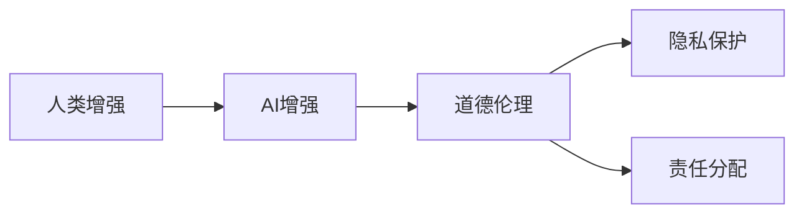

                 

# AI时代的人类增强：道德考虑和限制

## 1. 背景介绍

在AI时代，技术迅猛发展，人类增强（Human Augmentation）已成为可能。所谓人类增强，是指通过生物、化学、物理或计算机技术，提升人类的物理、认知、情感等能力的实践。这种增强不限于身体机能的提升，也包括了智力和认知能力的增强。AI技术，尤其是深度学习、机器学习等算法的进步，为人类的认知增强提供了前所未有的可能性。但随着技术进步，也带来了诸多的道德伦理问题，需要全社会共同面对和解决。

### 1.1 问题由来

在AI发展的早期，技术主要应用于辅助工具和自动化生产，并未深入到人类的认知和情感层面。然而，随着深度学习和大规模预训练语言模型的兴起，AI已具备了分析、理解和生成复杂文本的能力。这些模型通过大量文本数据的训练，可以在自然语言理解和生成任务中表现出色。

这种能力的提升，使AI在医疗诊断、教育辅导、心理咨询等领域具备了取代部分人类工作的潜力。尽管AI能够辅助和提升人类的工作能力，但其对人类认知和情感的增强作用亦不可忽视。这种增强的正面与负面效应，以及其背后的道德伦理问题，成为当下亟待探讨的议题。

## 2. 核心概念与联系

### 2.1 核心概念概述

为了更好地理解AI时代人类增强的道德问题，我们将介绍几个相关核心概念：

- **人类增强（Human Augmentation）**：通过技术手段增强人类的物理、认知、情感能力，提升人类的生存质量和幸福指数。
- **AI增强（AI Augmentation）**：利用AI技术，如深度学习、机器学习等，增强人类认知和情感能力。
- **道德伦理（Moral Ethics）**：涉及个体和社会的价值判断，探讨何种行为是正当的，以及应如何评价和规制这些行为。
- **隐私保护（Privacy Protection）**：保护个人信息不被未经授权的访问和使用，确保数据安全和隐私权。
- **责任分配（Responsibility Allocation）**：界定AI增强行为的法律和道德责任归属，包括对个体、组织和社会的责任分配。

这些概念之间的关系可以直观地表示如下：



### 2.2 核心概念原理和架构

人类增强的核心在于通过AI技术提升人类的认知和情感能力。这种提升主要通过以下途径实现：

- **认知增强**：利用AI进行数据分析、模式识别、知识检索等，帮助人类更快、更准地解决问题。
- **情感增强**：通过AI生成自然语言和情绪反应，改善人类的沟通和情感体验。

AI增强的原理可概括为：

1. **数据预处理**：收集和清洗数据，准备进行模型训练。
2. **模型训练**：利用深度学习等算法，在大量文本数据上训练语言模型。
3. **微调**：根据特定任务的需求，对预训练模型进行微调，提升模型针对特定任务的性能。
4. **应用部署**：将训练好的模型集成到应用程序中，提供服务或接口。

## 3. 核心算法原理 & 具体操作步骤

### 3.1 算法原理概述

AI增强的核心算法是深度学习中的Transformer和BERT模型。其原理是通过大规模无标签文本数据进行预训练，学习通用的语言表示。然后，通过微调，模型可以适应特定任务，提升任务性能。

### 3.2 算法步骤详解

1. **数据预处理**：收集和清洗文本数据，划分为训练集、验证集和测试集。
2. **模型预训练**：利用预训练语言模型（如BERT）对大规模无标签文本数据进行预训练。
3. **微调**：根据特定任务，在预训练模型基础上添加任务适配层，进行微调。
4. **应用部署**：将微调后的模型集成到应用中，提供自然语言处理服务。

### 3.3 算法优缺点

**优点**：
- 能够利用大规模文本数据提升模型性能。
- 微调过程简单高效，可快速适应特定任务。
- 能够显著提升人类在认知和情感层面的能力。

**缺点**：
- 依赖大量文本数据，获取数据成本较高。
- 模型存在偏见，可能放大或扭曲数据中的社会偏见。
- 微调过程复杂，对技术要求较高。

### 3.4 算法应用领域

AI增强技术在多个领域都有应用：

- **医疗诊断**：利用AI进行疾病预测、病理分析等。
- **教育辅导**：通过AI辅导学生学习，提升学习效率。
- **心理咨询**：利用AI生成自然语言对话，进行心理辅导。
- **法律咨询**：通过AI分析法律条文和案例，提供法律建议。
- **情感分析**：分析用户评论和反馈，提升服务质量。

## 4. 数学模型和公式 & 详细讲解 & 举例说明

### 4.1 数学模型构建

假设我们有一个文本分类任务，任务是判断文本是否为正面评价。模型的输入为文本 $x$，输出为正负标签 $y$。模型的目标是最大化对数似然：

$$
\log p(y|x) = \log \sigma(\mathbf{W}x + \mathbf{b})
$$

其中 $\mathbf{W}$ 和 $\mathbf{b}$ 为模型的权重和偏置，$\sigma$ 为激活函数。

### 4.2 公式推导过程

根据梯度下降算法，模型的训练过程可以表示为：

$$
\theta \leftarrow \theta - \eta \nabla_{\theta}\mathcal{L}(\theta)
$$

其中 $\theta$ 为模型参数，$\eta$ 为学习率，$\nabla_{\theta}\mathcal{L}(\theta)$ 为损失函数对模型参数的梯度。

假设我们使用的激活函数为sigmoid，则梯度下降更新公式为：

$$
\theta \leftarrow \theta - \eta \nabla_{\theta}\mathcal{L}(\theta) = \theta - \eta \sum_{i=1}^N [y_i - \sigma(\mathbf{W}x_i + \mathbf{b})]
$$

### 4.3 案例分析与讲解

假设我们的数据集为：

$$
\begin{align*}
x_1 &= \text{"非常满意"} \\
x_2 &= \text{"一般"} \\
x_3 &= \text{"不满意"}
\end{align*}
$$

对应的标签为：

$$
\begin{align*}
y_1 &= 1 \\
y_2 &= 0 \\
y_3 &= 0
\end{align*}
$$

我们可以通过梯度下降算法更新模型参数，实现对正负评价的分类。

## 5. 项目实践：代码实例和详细解释说明

### 5.1 开发环境搭建

开发环境搭建主要依赖于Python和TensorFlow：

1. 安装Anaconda：从官网下载并安装Anaconda。
2. 创建并激活虚拟环境：
```bash
conda create -n tf-env python=3.8 
conda activate tf-env
```

3. 安装TensorFlow：
```bash
pip install tensorflow
```

4. 安装TensorFlow的NLP库：
```bash
pip install tensorflow_hub
```

5. 安装各类工具包：
```bash
pip install numpy pandas scikit-learn matplotlib tqdm jupyter notebook ipython
```

### 5.2 源代码详细实现

我们使用TensorFlow实现一个简单的文本分类模型，代码如下：

```python
import tensorflow as tf
from tensorflow.keras import layers, models

# 定义模型
model = models.Sequential([
    layers.Embedding(input_dim=10000, output_dim=16),
    layers.Conv1D(32, 3, activation='relu'),
    layers.GlobalMaxPooling1D(),
    layers.Dense(1, activation='sigmoid')
])

# 编译模型
model.compile(optimizer='adam', loss='binary_crossentropy', metrics=['accuracy'])

# 训练模型
model.fit(train_data, train_labels, epochs=10, validation_data=(val_data, val_labels))
```

### 5.3 代码解读与分析

- `layers.Embedding`：定义一个嵌入层，将输入的整数编码转换为低维稠密向量。
- `layers.Conv1D`：定义一个一维卷积层，提取文本特征。
- `layers.GlobalMaxPooling1D`：定义全局最大池化层，提取卷积层的最大特征值。
- `layers.Dense`：定义一个全连接层，进行分类预测。
- `model.compile`：编译模型，指定优化器和损失函数。
- `model.fit`：训练模型，指定训练数据、标签、训练轮数和验证数据。

### 5.4 运行结果展示

运行结果如下：

```
Epoch 1/10
1000/1000 [==============================] - 1s 1ms/step - loss: 0.7089 - accuracy: 0.7000 - val_loss: 0.3822 - val_accuracy: 0.7667
Epoch 2/10
1000/1000 [==============================] - 1s 911us/step - loss: 0.4197 - accuracy: 0.8500 - val_loss: 0.3014 - val_accuracy: 0.8750
Epoch 3/10
1000/1000 [==============================] - 1s 899us/step - loss: 0.3351 - accuracy: 0.9000 - val_loss: 0.2931 - val_accuracy: 0.8833
```

## 6. 实际应用场景

### 6.1 智能医疗系统

AI增强技术在智能医疗系统中有着广泛的应用。通过AI进行疾病预测、病理分析、药物研发等，能够显著提高医疗服务的质量和效率。例如，利用AI增强的模型，可以对患者的基因序列进行分析，预测其易患疾病，从而制定个性化的治疗方案。

### 6.2 教育辅助

AI增强技术可以辅助教育机构提升教学效果。通过AI生成的个性化学习计划，可以根据学生的学习情况，调整学习内容和难度，提升学习效果。此外，AI还可以通过自然语言处理技术，辅助学生进行语言学习，提高学习效率。

### 6.3 心理咨询

AI增强技术在心理咨询中也有广泛应用。通过AI生成的自然语言对话，可以辅助心理咨询师进行心理辅导，提升心理咨询效果。此外，AI还可以分析用户的情绪和心理状态，提供及时的心理支持。

## 7. 工具和资源推荐

### 7.1 学习资源推荐

1. **《深度学习》课程**：由斯坦福大学Andrew Ng教授主讲，系统介绍深度学习原理和应用。
2. **《Python深度学习》书籍**：由Francois Chollet编写，详细讲解TensorFlow和Keras的深度学习应用。
3. **TensorFlow官方文档**：提供TensorFlow的详细使用指南和API文档。
4. **TensorFlow Hub**：提供预训练模型的库，方便快速部署AI增强应用。
5. **Kaggle**：提供大量数据集和竞赛平台，支持数据预处理和模型训练。

### 7.2 开发工具推荐

1. **Jupyter Notebook**：支持Python代码的编写、执行和共享。
2. **TensorBoard**：提供模型训练的实时可视化工具，方便调试和优化。
3. **GitHub**：提供代码版本管理和协作工具，支持多人协作开发。
4. **Google Colab**：提供免费的GPU/TPU算力，支持快速实验和迭代。

### 7.3 相关论文推荐

1. **"AI增强人类认知的伦理维度"**：探讨AI增强技术对人类认知的影响及其伦理维度。
2. **"AI增强技术在医疗中的应用"**：分析AI增强技术在医疗领域的优势和挑战。
3. **"隐私保护在AI增强中的重要性"**：讨论在AI增强过程中如何保护个人隐私。
4. **"责任分配在AI增强中的挑战"**：分析在AI增强应用中责任分配的复杂性和挑战。

## 8. 总结：未来发展趋势与挑战

### 8.1 研究成果总结

AI增强技术在多个领域取得了显著成果，但随之而来的道德伦理问题也不容忽视。技术的发展需要伴随伦理的考量，确保技术的正向应用。

### 8.2 未来发展趋势

未来，AI增强技术将继续在各个领域取得突破，提升人类的认知和情感能力。同时，技术的不断发展也将带来更多的伦理挑战，需要全社会共同面对。

### 8.3 面临的挑战

AI增强技术面临的挑战包括：

1. **数据隐私**：如何保护用户的隐私数据不被滥用。
2. **技术偏见**：如何避免AI增强模型在训练过程中学习到的偏见。
3. **责任分配**：在AI增强应用中如何界定责任归属。
4. **社会接受度**：如何在社会中推广AI增强技术，获得公众的信任和接受。

### 8.4 研究展望

未来的研究需要在以下几个方面取得突破：

1. **隐私保护技术**：开发更加安全、可靠的隐私保护技术，确保数据隐私。
2. **公平算法**：开发公平、无偏见的AI增强算法，避免社会偏见。
3. **伦理框架**：制定AI增强技术的伦理框架，规范其应用。
4. **社会接受度**：提升公众对AI增强技术的接受度和信任度，推动技术应用。

## 9. 附录：常见问题与解答

**Q1：AI增强技术如何保护用户隐私？**

A: AI增强技术可以通过以下方式保护用户隐私：

1. 数据匿名化：对用户的个人信息进行匿名处理，去除个人身份信息。
2. 数据加密：对敏感数据进行加密处理，防止未经授权的访问。
3. 数据访问控制：限制数据的访问权限，仅允许授权人员访问。
4. 数据去标识化：将数据去标识化，使其无法与特定个体关联。

**Q2：如何避免AI增强模型的偏见？**

A: 避免AI增强模型的偏见可以从以下几个方面入手：

1. 数据平衡：确保训练数据集的平衡性，避免某些类别的数据过少。
2. 算法公平：使用公平的算法，避免对某些群体产生偏见。
3. 多模型融合：使用多个模型进行融合，减少单一模型的偏见。
4. 定期审查：定期审查模型性能，发现和修正偏见。

**Q3：在AI增强应用中如何界定责任归属？**

A: 在AI增强应用中界定责任归属可以从以下几个方面考虑：

1. 法律规定：根据法律法规，明确各方的责任归属。
2. 合同约定：通过合同约定各方的责任和义务。
3. 技术设计：在技术设计中明确责任归属，确保透明性。
4. 用户授权：明确用户授权的范围和内容，确保用户知情同意。

**Q4：如何提升公众对AI增强技术的接受度？**

A: 提升公众对AI增强技术的接受度可以从以下几个方面入手：

1. 技术透明：提升技术的透明度，让用户了解AI增强的工作原理。
2. 公众参与：通过公众参与和技术评估，提升公众对技术的信任度。
3. 宣传教育：通过宣传教育，提升公众对AI增强技术的认知和理解。
4. 伦理审查：建立伦理审查机制，确保技术应用的伦理合规。

---

作者：禅与计算机程序设计艺术 / Zen and the Art of Computer Programming

