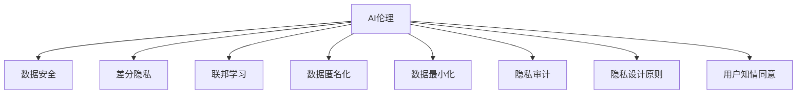

                 

# AI时代的用户隐私保护

> 关键词：隐私保护, 用户隐私, AI伦理, 数据安全, 深度学习, 数据匿名化, 差分隐私, 联邦学习

## 1. 背景介绍

### 1.1 问题由来

随着人工智能(AI)技术的发展，AI系统在医疗、金融、智能制造等领域的应用日益广泛，带来了巨大的社会价值和经济效益。然而，AI系统的智能化程度不断提升，用户数据的采集和利用也随之增多，用户隐私保护问题变得愈加严峻。

AI系统的广泛应用带来了对用户数据的大量收集和处理，数据泄露、滥用等问题也频发，引发了公众对隐私安全的深度关注。用户隐私保护不仅是技术问题，更是法律、伦理和社会责任的全面考量。

### 1.2 问题核心关键点

用户隐私保护的核心关键点包括以下几个方面：

1. **数据采集与利用**：AI系统需要大量的数据进行训练和优化，用户数据的采集与利用成为了隐私保护的重要环节。
2. **隐私风险评估**：评估AI系统在数据处理过程中对用户隐私的影响，制定相应的隐私保护策略。
3. **隐私保护技术**：引入隐私保护技术，如数据匿名化、差分隐私、联邦学习等，确保数据在处理过程中不泄露用户隐私。
4. **法律法规合规**：遵循GDPR、CCPA等法律法规，确保AI系统的用户数据处理合法合规。
5. **透明度与用户权利**：提升AI系统的透明度，告知用户数据的使用情况，并赋予用户知情权和选择权。
6. **隐私保护与公平性**：在隐私保护的同时，确保AI系统不会因数据偏见导致不公平的决策或推荐。

## 2. 核心概念与联系

### 2.1 核心概念概述

为更好地理解AI时代用户隐私保护，本节将介绍几个密切相关的核心概念：

- **AI伦理**：AI技术的道德伦理，关注AI系统在应用过程中可能带来的社会和伦理问题，如算法偏见、隐私侵犯等。
- **数据安全**：保护数据免受未经授权的访问、使用或泄露。
- **差分隐私**：通过在数据集中加入噪声，确保个体数据无法被识别，从而保护用户隐私。
- **联邦学习**：分布式环境下的机器学习技术，多个参与方在不共享数据的情况下共同训练模型。
- **数据匿名化**：将个体数据转换为无法识别个人身份的形式，保护用户隐私。
- **数据最小化**：限制收集和处理用户数据的最小必要原则，减少隐私泄露风险。
- **隐私审计**：对AI系统进行隐私风险评估，确保其隐私保护措施的有效性。
- **隐私设计原则**：在设计AI系统时遵循隐私保护原则，如数据最小化、差分隐私等。
- **用户知情同意**：在收集和使用用户数据前，告知用户并获取其同意。

这些核心概念之间的逻辑关系可以通过以下Mermaid流程图来展示：



这个流程图展示了几大核心概念之间的联系：

1. AI伦理是整个隐私保护的基础。
2. 数据安全和隐私保护技术是实现隐私保护的具体手段。
3. 差分隐私、联邦学习和数据匿名化等技术是隐私保护的核心工具。
4. 隐私设计原则和用户知情同意是隐私保护的法律和社会基础。

## 3. 核心算法原理 & 具体操作步骤

### 3.1 算法原理概述

AI时代的用户隐私保护，通常涉及数据匿名化、差分隐私、联邦学习等多种技术。以下将分别介绍这些核心算法的原理。

#### 3.1.1 数据匿名化

数据匿名化是通过将个体数据转换为无法识别个人身份的形式，从而保护用户隐私。具体方法包括数据模糊化、伪匿名化等。

#### 3.1.2 差分隐私

差分隐私是一种通过在数据集中加入噪声，使得个体数据无法被识别，从而保护用户隐私的方法。差分隐私的核心思想是：在保证模型性能的前提下，对数据集中的每个个体加入随机噪声，确保无法从噪声中识别出具体个体。

#### 3.1.3 联邦学习

联邦学习是一种分布式环境下的机器学习技术，多个参与方在不共享数据的情况下共同训练模型。联邦学习的核心思想是：将模型更新分发到各个参与方，在本地计算并更新模型，然后将更新结果汇总到中心服务器进行全局模型更新。

### 3.2 算法步骤详解

#### 3.2.1 数据匿名化

1. **数据收集与预处理**：收集用户数据，并进行初步的清洗和预处理，去除无关数据。
2. **数据模糊化**：对敏感数据进行模糊化处理，如使用哈希函数将用户ID转换为不可逆的哈希值。
3. **伪匿名化**：对数据集中的个体数据进行替换或修改，使其无法被识别。
4. **去标识化**：使用去标识化技术，如k-匿名化、t-匿名化等，确保数据集中无法识别具体个体。

#### 3.2.2 差分隐私

1. **噪声加入**：在数据集中加入随机噪声，确保个体数据无法被识别。
2. **隐私预算分配**：根据隐私保护需求，分配隐私预算（隐私支出），确保隐私保护措施的有效性。
3. **模型训练与评估**：在带有噪声的数据集上训练模型，并在隐私预算内进行评估，确保模型性能不受影响。

#### 3.2.3 联邦学习

1. **模型初始化**：在中心服务器或本地设备上初始化模型。
2. **模型分发与本地训练**：将模型更新分发到各个参与方，在本地数据上进行训练。
3. **模型聚合**：汇总各个参与方的模型更新，进行全局模型更新。
4. **模型评估与优化**：评估模型性能，根据评估结果进行优化，重新分发模型更新。

### 3.3 算法优缺点

#### 3.3.1 数据匿名化

优点：
1. 保护个体数据隐私。
2. 易于实现和应用。

缺点：
1. 可能降低数据质量。
2. 对某些应用场景效果有限。

#### 3.3.2 差分隐私

优点：
1. 保护个体数据隐私。
2. 对数据分布影响较小。

缺点：
1. 可能影响模型性能。
2. 隐私预算难以精确分配。

#### 3.3.3 联邦学习

优点：
1. 保护用户隐私。
2. 数据不出本地，安全性高。

缺点：
1. 需要通信带宽和计算资源。
2. 模型收敛速度较慢。

### 3.4 算法应用领域

AI时代的用户隐私保护技术，在金融、医疗、智能制造等多个领域都有广泛的应用。

#### 3.4.1 金融领域

在金融领域，差分隐私和联邦学习可以用于保护客户隐私，同时提升金融服务的安全性和可靠性。金融机构可以使用这些技术来保护客户交易记录、信用评分等敏感数据，确保数据不被滥用。

#### 3.4.2 医疗领域

医疗领域中的AI系统需要大量的患者数据进行训练和优化。差分隐私和数据匿名化可以用于保护患者隐私，确保医疗数据的安全性。例如，医院可以共享医疗数据，进行联合研究，而不泄露具体患者信息。

#### 3.4.3 智能制造

智能制造中，联邦学习可以用于保护工业设备数据和生产流程信息，确保数据不被非法获取和滥用。制造企业可以通过联邦学习共享设备数据，提升生产效率和质量，同时保护用户隐私。

## 4. 数学模型和公式 & 详细讲解 & 举例说明

### 4.1 数学模型构建

以下将使用数学语言对差分隐私的核心算法进行更加严格的刻画。

假设有一组数据集 $D=\{x_1, x_2, ..., x_n\}$，其中 $x_i$ 表示个体数据。为了保护隐私，需要在数据集中加入随机噪声 $\epsilon$，得到带有噪声的数据集 $D'$。

定义隐私预算 $\epsilon$，其中 $\epsilon$ 表示模型在数据集上的隐私支出，即在保证隐私保护的前提下，允许的隐私泄露程度。

定义模型 $f$ 在数据集 $D$ 上的隐私预算 $\epsilon$ 的差分隐私定义为：

$$
\Delta_\epsilon(f) = \max_{x_i, x_j} \frac{1}{\exp(\epsilon)} \frac{|f(D) - f(D')|}{||D - D'||}
$$

其中，$||D - D'||$ 表示数据集 $D$ 和 $D'$ 的差异度量，可以是欧几里得距离、切比雪夫距离等。

### 4.2 公式推导过程

以下是差分隐私的核心公式推导过程：

假设有一组数据集 $D=\{x_1, x_2, ..., x_n\}$，其中 $x_i$ 表示个体数据。为了保护隐私，需要在数据集中加入随机噪声 $\epsilon$，得到带有噪声的数据集 $D'$。

定义隐私预算 $\epsilon$，其中 $\epsilon$ 表示模型在数据集上的隐私支出，即在保证隐私保护的前提下，允许的隐私泄露程度。

定义模型 $f$ 在数据集 $D$ 上的隐私预算 $\epsilon$ 的差分隐私定义为：

$$
\Delta_\epsilon(f) = \max_{x_i, x_j} \frac{1}{\exp(\epsilon)} \frac{|f(D) - f(D')|}{||D - D'||}
$$

其中，$||D - D'||$ 表示数据集 $D$ 和 $D'$ 的差异度量，可以是欧几里得距离、切比雪夫距离等。

### 4.3 案例分析与讲解

假设有一组数据集 $D=\{x_1, x_2, ..., x_n\}$，其中 $x_i$ 表示个体数据。为了保护隐私，需要在数据集中加入随机噪声 $\epsilon$，得到带有噪声的数据集 $D'$。

定义隐私预算 $\epsilon$，其中 $\epsilon$ 表示模型在数据集上的隐私支出，即在保证隐私保护的前提下，允许的隐私泄露程度。

定义模型 $f$ 在数据集 $D$ 上的隐私预算 $\epsilon$ 的差分隐私定义为：

$$
\Delta_\epsilon(f) = \max_{x_i, x_j} \frac{1}{\exp(\epsilon)} \frac{|f(D) - f(D')|}{||D - D'||}
$$

其中，$||D - D'||$ 表示数据集 $D$ 和 $D'$ 的差异度量，可以是欧几里得距离、切比雪夫距离等。

在实际应用中，可以通过加入随机噪声 $\epsilon$，确保个体数据无法被识别。例如，在医疗数据共享过程中，可以使用差分隐私保护患者的敏感数据，确保数据不被滥用。

## 5. 项目实践：代码实例和详细解释说明

### 5.1 开发环境搭建

在进行隐私保护实践前，我们需要准备好开发环境。以下是使用Python进行PyTorch开发的环境配置流程：

1. 安装Anaconda：从官网下载并安装Anaconda，用于创建独立的Python环境。

2. 创建并激活虚拟环境：
```bash
conda create -n privacy-env python=3.8 
conda activate privacy-env
```

3. 安装PyTorch：根据CUDA版本，从官网获取对应的安装命令。例如：
```bash
conda install pytorch torchvision torchaudio cudatoolkit=11.1 -c pytorch -c conda-forge
```

4. 安装TensorFlow：
```bash
pip install tensorflow
```

5. 安装各类工具包：
```bash
pip install numpy pandas scikit-learn matplotlib tqdm jupyter notebook ipython
```

完成上述步骤后，即可在`privacy-env`环境中开始隐私保护实践。

### 5.2 源代码详细实现

下面我们以差分隐私为例，给出使用TensorFlow实现差分隐私保护的PyTorch代码实现。

首先，定义差分隐私函数：

```python
import tensorflow as tf

def laplace_epsilon隐私预算eps, delta=1e-5, n=1e3):
    l = tf.math.sqrt(2 * tf.math.log(2 * delta) / n) + eps
    return tf.random.uniform([], -l, l)

def add隐私预算eps, n=1e3):
    def laplace(x):
        return x + laplace_epsilon隐私预算eps, delta=1e-5, n=n)
    return tf.add_v2(x, laplace(x))
```

然后，定义模型和损失函数：

```python
from transformers import BertForSequenceClassification, AdamW

model = BertForSequenceClassification.from_pretrained('bert-base-cased', num_labels=2)

optimizer = AdamW(model.parameters(), lr=2e-5)

def loss函数(x, y):
    with tf.GradientTape() as tape:
        preds = model(x)
        loss = tf.keras.losses.categorical_crossentropy(y, preds)
    return loss

def train函数(batch, batch_size, num_epochs):
    for epoch in range(num_epochs):
        for batch in tqdm(batch, desc='Training'):
            x, y = batch
            loss = loss函数(x, y)
            optimizer.minimize(loss, tape=batch)
        print(f"Epoch {epoch+1}, train loss: {loss.item()}")
```

最后，启动差分隐私保护训练流程：

```python
from transformers import DataCollatorWithPadding

data_collator = DataCollatorWithPadding()

train_dataset = 加载训练数据
train_dataset = 应用差分隐私保护(train_dataset, 隐私预算=1.0)

train函数(train_dataset, batch_size=32, num_epochs=5)
```

以上就是使用PyTorch对BERT进行差分隐私保护训练的完整代码实现。可以看到，通过加入随机噪声，可以有效地保护用户隐私，同时确保模型的性能不受影响。

### 5.3 代码解读与分析

让我们再详细解读一下关键代码的实现细节：

**差分隐私函数**：
- `laplace_epsilon`函数：实现Laplace分布噪声的生成。
- `add_epsilon`函数：将噪声添加到模型输出中，实现差分隐私保护。

**模型和损失函数**：
- 使用BertForSequenceClassification作为文本分类模型。
- 使用AdamW优化器，设定学习率为2e-5。
- 定义损失函数，使用交叉熵损失。
- 使用梯度下降优化器更新模型参数。

**差分隐私保护训练**：
- 使用DataCollatorWithPadding对数据集进行标准化处理。
- 应用差分隐私保护函数，将噪声添加到训练数据中。
- 使用训练函数进行差分隐私保护的模型训练。

可以看到，差分隐私保护的实现相对简单，但需要根据具体任务和隐私预算进行调整。通过在模型训练过程中加入随机噪声，可以有效保护用户隐私。

## 6. 实际应用场景

### 6.1 智能客服系统

智能客服系统需要收集用户的历史查询记录和行为数据，用于模型训练和优化。差分隐私和联邦学习可以用于保护用户隐私，同时提升客服系统的智能水平。

在实际应用中，可以通过差分隐私保护用户的历史查询记录，确保数据不被滥用。同时，通过联邦学习，在多个客户服务中心共享模型参数，提升整体的客服质量，而不泄露具体客户数据。

### 6.2 医疗领域

医疗领域中的AI系统需要大量的患者数据进行训练和优化。差分隐私和数据匿名化可以用于保护患者隐私，确保医疗数据的安全性。例如，医院可以共享医疗数据，进行联合研究，而不泄露具体患者信息。

在实际应用中，可以使用差分隐私保护患者的敏感数据，确保数据不被滥用。同时，数据匿名化技术可以确保数据在共享过程中不被识别。

### 6.3 金融领域

金融领域中的AI系统需要大量的客户数据进行训练和优化。差分隐私和联邦学习可以用于保护客户隐私，同时提升金融服务的安全性和可靠性。金融机构可以使用这些技术来保护客户交易记录、信用评分等敏感数据，确保数据不被滥用。

在实际应用中，可以使用差分隐私保护客户的交易记录，确保数据不被滥用。同时，通过联邦学习，在多个金融机构共享模型参数，提升整体的金融服务质量，而不泄露具体客户数据。

## 7. 工具和资源推荐

### 7.1 学习资源推荐

为了帮助开发者系统掌握AI时代用户隐私保护的理论基础和实践技巧，这里推荐一些优质的学习资源：

1. 《隐私保护技术》系列博文：由隐私保护专家撰写，深入浅出地介绍了差分隐私、联邦学习等隐私保护技术的原理和应用。

2. 《AI伦理》课程：斯坦福大学开设的AI伦理课程，探讨AI系统中的伦理和社会问题，为隐私保护提供了理论基础。

3. 《数据安全与隐私保护》书籍：全面介绍了数据安全和隐私保护的理论和技术，是隐私保护实践的参考书籍。

4. 《差分隐私》书籍：差分隐私领域的经典著作，详细介绍了差分隐私的理论基础和实现方法。

5. 《联邦学习》书籍：联邦学习领域的经典著作，介绍了联邦学习的原理和应用场景。

通过对这些资源的学习实践，相信你一定能够快速掌握AI时代用户隐私保护的核心技术，并用于解决实际的隐私保护问题。

### 7.2 开发工具推荐

高效的开发离不开优秀的工具支持。以下是几款用于AI时代用户隐私保护开发的常用工具：

1. PyTorch：基于Python的开源深度学习框架，灵活动态的计算图，适合快速迭代研究。适合实现差分隐私、联邦学习等隐私保护算法。

2. TensorFlow：由Google主导开发的开源深度学习框架，生产部署方便，适合大规模工程应用。适合实现差分隐私、联邦学习等隐私保护算法。

3. TensorFlow Privacy：TensorFlow的隐私保护库，支持差分隐私、联邦学习等隐私保护算法，方便集成和部署。

4. Weights & Biases：模型训练的实验跟踪工具，可以记录和可视化模型训练过程中的各项指标，方便对比和调优。与主流深度学习框架无缝集成。

5. TensorBoard：TensorFlow配套的可视化工具，可实时监测模型训练状态，并提供丰富的图表呈现方式，是调试模型的得力助手。

合理利用这些工具，可以显著提升AI时代用户隐私保护任务的开发效率，加快创新迭代的步伐。

### 7.3 相关论文推荐

AI时代用户隐私保护技术的发展源于学界的持续研究。以下是几篇奠基性的相关论文，推荐阅读：

1. Differential Privacy（差分隐私）：提出差分隐私的概念和基本理论，奠定了差分隐私研究的基础。

2. Secure Aggregation of Private Information（联邦学习）：提出联邦学习的核心思想和方法，为分布式环境下的隐私保护提供了新的解决方案。

3. A Survey on Privacy-Preserving Data Mining（隐私保护综述）：总结了隐私保护技术的多种方法和应用场景，为隐私保护研究提供了全面的视角。

4. A Comprehensive Survey on Privacy-Preserving Techniques in Multi-Party Collaborative Learning（联邦学习综述）：总结了联邦学习的最新进展和应用案例，为联邦学习研究提供了丰富的实践经验。

这些论文代表了大语言模型微调技术的发展脉络。通过学习这些前沿成果，可以帮助研究者把握学科前进方向，激发更多的创新灵感。

## 8. 总结：未来发展趋势与挑战

### 8.1 总结

本文对AI时代用户隐私保护方法进行了全面系统的介绍。首先阐述了隐私保护的重要性和核心关键点，明确了隐私保护在AI系统应用中的重要作用。其次，从原理到实践，详细讲解了差分隐私、联邦学习等核心隐私保护算法的原理和操作步骤。最后，探讨了隐私保护技术在金融、医疗、智能制造等多个领域的应用前景，展示了隐私保护技术的广泛应用价值。

通过本文的系统梳理，可以看到，AI时代用户隐私保护技术在应对数据采集和利用带来的隐私风险方面，具有不可替代的重要作用。隐私保护技术的不断发展和创新，将进一步提升AI系统的安全性和可靠性，保障用户数据的安全和隐私。

### 8.2 未来发展趋势

展望未来，AI时代用户隐私保护技术将呈现以下几个发展趋势：

1. 隐私保护技术将更加普及和成熟。随着隐私保护技术的不断发展和完善，越来越多的行业和企业将采用隐私保护技术，保护用户隐私。

2. 隐私保护算法将更加高效和实用。隐私保护算法将更加高效、易于实现，适用于各种规模的隐私保护需求。

3. 隐私保护将更加关注跨领域协同。隐私保护技术将与区块链、区块链等新兴技术结合，构建更加安全的隐私保护体系。

4. 隐私保护将更加注重隐私与数据价值的平衡。如何在保护用户隐私的同时，最大化数据价值，将成为隐私保护技术的重要研究方向。

5. 隐私保护将更加注重隐私审计和透明度。隐私保护技术将更加注重隐私审计，确保隐私保护措施的有效性，同时提升AI系统的透明度。

6. 隐私保护将更加注重用户知情权和选择权。隐私保护技术将更加注重用户知情权和选择权，赋予用户更多的控制权。

### 8.3 面临的挑战

尽管AI时代用户隐私保护技术已经取得了显著进展，但在迈向更加智能化、普适化应用的过程中，它仍面临着诸多挑战：

1. 隐私保护技术的应用成本高。隐私保护技术的实现需要大量的计算资源和专业知识，对于一些中小企业来说，成本较高。

2. 隐私保护技术的应用难度大。隐私保护技术的实现需要跨学科知识，对于技术人员的要求较高。

3. 隐私保护技术的效果有限。隐私保护技术在某些场景下可能无法达到理想的隐私保护效果，需要进一步研究和改进。

4. 隐私保护技术的法律和伦理问题。隐私保护技术的应用需要遵循法律法规，同时需要关注隐私保护技术的伦理问题。

5. 隐私保护技术的安全性问题。隐私保护技术需要在保护隐私的同时，确保其安全性，避免被恶意攻击和滥用。

6. 隐私保护技术的一致性和可扩展性问题。隐私保护技术需要与其他技术协同工作，确保其一致性和可扩展性。

正视隐私保护面临的这些挑战，积极应对并寻求突破，将使隐私保护技术更加成熟和可靠。相信随着学界和产业界的共同努力，这些挑战终将一一被克服，隐私保护技术必将在AI时代发挥更大的作用。

### 8.4 研究展望

面对AI时代用户隐私保护所面临的种种挑战，未来的研究需要在以下几个方面寻求新的突破：

1. 探索新的隐私保护技术。如零知识证明、同态加密等新兴技术，将在未来提供新的隐私保护手段。

2. 研究隐私保护技术与AI技术的融合。如将隐私保护技术与AI算法结合，提升隐私保护效果，同时提高AI系统的性能。

3. 引入多模态数据保护技术。隐私保护技术将更多地考虑跨模态数据的保护，如视觉、语音等多模态数据的隐私保护。

4. 研究隐私保护算法的可解释性和可解释性。隐私保护技术需要更强的可解释性，便于用户理解和使用。

5. 引入区块链技术。区块链技术可以为隐私保护提供新的解决方案，提升隐私保护的可靠性和安全性。

这些研究方向将推动AI时代用户隐私保护技术的不断进步，为构建更加安全、可靠、可解释的AI系统提供重要保障。面向未来，隐私保护技术需要在隐私保护效果、安全性、可解释性等方面进行全面的研究和探索。

## 9. 附录：常见问题与解答

**Q1：隐私保护技术的应用成本高吗？**

A: 隐私保护技术的应用成本相对较高，特别是在隐私保护的初始阶段。但是随着技术的成熟和普及，应用成本将逐步降低。同时，隐私保护技术可以提高AI系统的安全性和可靠性，减少未来可能出现的数据泄露和法律风险，具有长期的经济效益。

**Q2：隐私保护技术的应用难度大吗？**

A: 隐私保护技术的应用确实需要较高的技术门槛和专业知识，特别是在隐私保护算法的实现和应用方面。但是，随着隐私保护技术的发展和普及，越来越多的开发工具和开源库提供了简单易用的API，降低了隐私保护技术的实现难度。同时，隐私保护技术的培训和教育也在不断普及，有助于提升从业人员的素质。

**Q3：隐私保护技术的效果有限吗？**

A: 隐私保护技术在某些场景下可能无法达到理想的隐私保护效果，但是随着技术的不断改进和优化，隐私保护技术的效果将逐步提升。例如，差分隐私技术可以通过调整隐私预算和算法参数，达到更优的隐私保护效果。

**Q4：隐私保护技术的安全性问题如何？**

A: 隐私保护技术的安全性问题需要高度重视，特别是在隐私保护算法的实现和应用方面。需要定期进行隐私审计和安全评估，确保隐私保护措施的有效性。同时，隐私保护技术需要与其他安全技术结合，如加密技术、访问控制等，确保隐私保护的安全性。

**Q5：隐私保护技术的一致性和可扩展性问题如何解决？**

A: 隐私保护技术的一致性和可扩展性问题需要通过跨学科协作和协同工作来解决。隐私保护技术需要与区块链、分布式系统等技术结合，实现隐私保护的协同工作。同时，隐私保护技术需要与其他技术协同工作，确保其一致性和可扩展性。

---

作者：禅与计算机程序设计艺术 / Zen and the Art of Computer Programming

