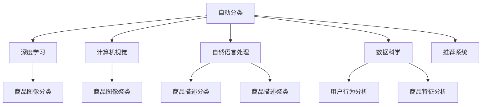

                 

# AI赋能的电商平台商品自动分类与聚类

> 关键词：电商平台,自动分类,聚类算法,深度学习,计算机视觉,自然语言处理,数据科学,推荐系统,商品推荐

## 1. 背景介绍

### 1.1 问题由来
在当今数字化转型的大潮下，电商平台成为了消费者购物的主要渠道。随着用户数量的增加和商品种类的繁多，电商平台需要处理的海量数据和复杂业务需求不断提升。这其中，商品分类与聚类技术扮演着至关重要的角色，通过将商品按照一定的规则进行分类和聚类，电商平台可以更高效地进行商品管理、检索、推荐等工作。

然而，传统的商品分类与聚类方法往往依赖人工标注，成本高、效率低，难以应对快速变化的商业环境。随着人工智能技术的发展，自动分类与聚类技术逐渐成为研究热点。其中，深度学习、计算机视觉、自然语言处理等领域的算法，为电商平台商品分类与聚类提供了全新的解决方案。

### 1.2 问题核心关键点
自动分类与聚类技术的核心关键点在于：
- 如何构建高效准确的分类模型，以自动提取商品特征，减少人工标注成本。
- 如何设计合理的聚类算法，发现商品之间的潜在相似性，提升分类准确度。
- 如何与电商平台的推荐系统、搜索系统等其他模块进行集成，提升用户体验。

自动分类与聚类技术的成功应用，不仅可以提升电商平台的商品管理效率，还可以增强推荐系统的精准度，为消费者提供更好的购物体验。

### 1.3 问题研究意义
研究自动分类与聚类技术，对于电商平台优化商品管理、提升用户体验、增强推荐系统等具有重要意义：

1. 提升商品管理效率。自动分类与聚类可以帮助电商平台自动整理商品，减少人工操作，提升商品管理的效率和准确性。
2. 增强推荐系统。通过自动分类与聚类，电商平台可以更好地理解商品特征，构建更精准的推荐模型，提升用户的购物体验。
3. 优化搜索系统。分类与聚类技术可以为搜索系统提供更好的索引，帮助用户快速找到所需商品。
4. 降低运营成本。自动分类与聚类减少了人工标注和手动管理的成本，降低了电商平台的运营成本。
5. 拓展应用场景。自动分类与聚类技术不仅可以应用于商品分类，还可以用于产品评论情感分析、用户画像构建等领域，拓展了技术的实际应用场景。

## 2. 核心概念与联系

### 2.1 核心概念概述

为更好地理解自动分类与聚类技术，本节将介绍几个密切相关的核心概念：

- **自动分类**：使用机器学习或深度学习算法，自动从电商平台商品数据中提取特征，进行分类。常用的算法包括支持向量机(SVM)、随机森林(Random Forest)、神经网络等。
- **聚类算法**：通过无监督学习算法，将电商平台商品数据按照相似性进行分组。常用的算法包括K-means、层次聚类、DBSCAN等。
- **深度学习**：一种基于神经网络的机器学习技术，通过多层神经网络模型，自动学习特征表示。在自动分类与聚类中，深度学习算法可以用于商品图像、描述等数据的分类与聚类。
- **计算机视觉**：使用计算机算法识别、处理、分析和理解图像、视频等内容，常用于商品图像分类。
- **自然语言处理**：使用计算机算法处理、分析和理解自然语言文本，常用于商品描述分类和聚类。
- **数据科学**：通过数据收集、处理、分析和可视化等手段，帮助电商平台更好地理解用户需求和商品特征。
- **推荐系统**：基于用户行为和商品特征，推荐用户可能感兴趣的商品，常与分类和聚类技术结合使用。

这些核心概念之间的逻辑关系可以通过以下Mermaid流程图来展示：



这个流程图展示了自动分类与聚类技术的核心概念及其之间的关系：

1. 自动分类技术可以应用于商品图像分类和商品描述分类，通过深度学习、计算机视觉、自然语言处理等手段，构建特征提取模型。
2. 聚类算法可以用于商品图像聚类和商品描述聚类，发现商品之间的相似性。
3. 数据科学技术可以帮助理解用户行为和商品特征，为自动分类和聚类提供支持。
4. 推荐系统可以通过分类和聚类技术，提升推荐精准度。

这些概念共同构成了自动分类与聚类技术的核心框架，使其能够高效地应用于电商平台的商品管理。

## 3. 核心算法原理 & 具体操作步骤
### 3.1 算法原理概述

自动分类与聚类技术的核心原理可以总结为以下几个步骤：

1. **数据收集与预处理**：从电商平台收集商品数据，进行数据清洗、归一化等预处理操作。
2. **特征提取**：使用深度学习、计算机视觉、自然语言处理等技术，从商品数据中提取特征。
3. **模型训练**：使用机器学习或深度学习算法，训练分类和聚类模型。
4. **模型评估与优化**：对训练好的模型进行评估，使用交叉验证等方法进行模型优化。
5. **集成与部署**：将训练好的模型集成到电商平台系统中，进行实时分类和聚类。

### 3.2 算法步骤详解

#### 3.2.1 数据收集与预处理

数据收集与预处理是自动分类与聚类技术的基础步骤。电商平台的数据来源多样，包括商品图像、描述、评论等，需要对数据进行收集和整理。

**数据收集**：
- 商品图像：从商品详情页面、分类页面等获取商品图片。
- 商品描述：从商品详情页面、分类页面等获取商品描述。
- 用户评论：从商品评论页面获取用户对商品的评价。
- 用户行为：从电商平台后台获取用户浏览、购买等行为数据。

**数据预处理**：
- 清洗：去除噪声数据、异常值等，保证数据质量。
- 归一化：将数据进行归一化处理，使其在[0,1]范围内。
- 标准化：对数据进行标准化处理，使其均值为0，方差为1。
- 特征选择：选择对分类或聚类有重要影响的特征，去除冗余特征。

#### 3.2.2 特征提取

特征提取是自动分类与聚类的核心步骤。使用深度学习、计算机视觉、自然语言处理等技术，从商品数据中提取特征。

**商品图像分类**：
- 使用卷积神经网络(CNN)对商品图像进行特征提取，常用的模型包括ResNet、VGG等。
- 将提取的特征向量输入分类模型，进行分类预测。

**商品描述分类**：
- 使用词袋模型、TF-IDF等方法，将商品描述转换为向量表示。
- 使用词嵌入模型如Word2Vec、GloVe等，将向量表示进行降维。
- 将降维后的向量输入分类模型，进行分类预测。

**商品描述聚类**：
- 使用TF-IDF、LDA等方法，将商品描述转换为向量表示。
- 使用聚类算法如K-means、层次聚类等，对向量进行聚类。

#### 3.2.3 模型训练

模型训练是自动分类与聚类技术的关键步骤。使用机器学习或深度学习算法，训练分类和聚类模型。

**分类模型训练**：
- 使用支持向量机(SVM)、随机森林(Random Forest)等算法进行分类。
- 使用神经网络模型如多层感知器(MLP)、卷积神经网络(CNN)等进行分类。

**聚类模型训练**：
- 使用K-means、层次聚类、DBSCAN等算法进行聚类。
- 使用深度学习模型如自编码器(AE)、变分自编码器(VAE)等进行聚类。

#### 3.2.4 模型评估与优化

模型评估与优化是确保自动分类与聚类技术准确度的重要步骤。对训练好的模型进行评估，使用交叉验证等方法进行模型优化。

**分类模型评估**：
- 使用准确率、召回率、F1值等指标评估分类模型的性能。
- 使用交叉验证方法对模型进行优化。

**聚类模型评估**：
- 使用轮廓系数(Silhouette Coefficient)、Calinski-Harabasz指数等指标评估聚类模型的性能。
- 使用交叉验证方法对模型进行优化。

#### 3.2.5 集成与部署

集成与部署是将训练好的模型集成到电商平台系统中，进行实时分类和聚类。

**集成方式**：
- 将分类和聚类模型集成到推荐系统中，提升推荐精准度。
- 将分类和聚类模型集成到搜索系统中，提高搜索准确率。

**部署方式**：
- 使用Docker容器进行模型部署，提升系统的稳定性和可扩展性。
- 使用AWS、阿里云等云平台进行模型部署，提供弹性计算资源。

### 3.3 算法优缺点

自动分类与聚类技术具有以下优点：
1. 自动特征提取。使用深度学习、计算机视觉、自然语言处理等技术，自动从商品数据中提取特征，减少人工标注成本。
2. 高效分类与聚类。使用机器学习或深度学习算法，训练高效的分类和聚类模型。
3. 实时处理。将训练好的模型集成到电商平台系统中，进行实时分类和聚类，提升处理效率。
4. 动态更新。自动分类与聚类技术可以动态更新，适应电商平台快速变化的商业环境。

同时，自动分类与聚类技术也存在一定的局限性：
1. 数据依赖。模型性能高度依赖于商品数据的丰富性和多样性，难以处理少数类别商品。
2. 算法复杂度。深度学习、神经网络等模型算法复杂度高，需要较高的计算资源和算力。
3. 模型鲁棒性。模型可能受到数据分布不均、噪声干扰等因素的影响，导致分类或聚类不准确。
4. 可解释性不足。自动分类与聚类技术往往被视为"黑盒"模型，难以解释其内部工作机制和决策逻辑。
5. 应用场景限制。自动分类与聚类技术主要应用于商品分类与聚类，难以应用于文本生成、图像生成等生成性任务。

尽管存在这些局限性，但自动分类与聚类技术在电商平台商品管理中仍具有显著优势，是大数据时代下电商平台的必备技术。

### 3.4 算法应用领域

自动分类与聚类技术在多个领域得到了广泛应用，以下是几个典型的应用场景：

- **商品分类**：将电商平台中的商品按照类别进行划分，提升商品管理效率。例如，将商品分为电子产品、服装、食品等类别。
- **商品聚类**：将电商平台中的商品按照相似性进行分组，发现潜在的商品组合。例如，将同一品牌的商品聚为一类，提升营销效果。
- **推荐系统**：通过商品分类与聚类技术，构建更精准的推荐模型，提升用户的购物体验。例如，基于商品分类和聚类结果，推荐相似商品或相关商品。
- **搜索系统**：通过商品分类与聚类技术，提升搜索系统的精准度。例如，使用聚类技术进行商品标签自动标注，提升搜索结果的相关性。
- **用户画像构建**：通过商品分类与聚类技术，分析用户行为和购买偏好，构建用户画像。例如，根据用户购买记录，聚类用户类型，进行个性化推荐。

以上应用场景展示了自动分类与聚类技术的强大能力，为电商平台带来了显著的商业价值。

## 4. 数学模型和公式 & 详细讲解  
### 4.1 数学模型构建

本节将使用数学语言对自动分类与聚类技术的核心模型进行严格的刻画。

假设电商平台商品数据集为 $D=\{(x_i, y_i)\}_{i=1}^N$，其中 $x_i$ 为商品特征向量， $y_i$ 为商品标签。自动分类与聚类技术的核心数学模型如下：

1. **分类模型**：
   $$
   \min_{\theta} \sum_{i=1}^N L(y_i, \hat{y}_i)
   $$
   其中 $L(y_i, \hat{y}_i)$ 为分类损失函数，如交叉熵损失函数。$\theta$ 为模型参数， $\hat{y}_i$ 为模型预测的标签。

2. **聚类模型**：
   $$
   \min_{z} \sum_{i=1}^N L(z_i, x_i)
   $$
   其中 $L(z_i, x_i)$ 为聚类损失函数，如平方误差损失函数。$z_i$ 为聚类标签，$x_i$ 为商品特征向量。

### 4.2 公式推导过程

以下我们以商品图像分类为例，推导深度学习模型在自动分类中的应用。

假设使用卷积神经网络(CNN)对商品图像进行分类，网络结构为 $N$ 层卷积层和池化层，最后一层为全连接层。输入商品图像 $x$，经过卷积层和池化层提取特征 $f(x)$，输出分类概率 $p(y|x)$。分类模型如下：

$$
p(y|x) = \sigma(\hat{W} f(x) + \hat{b})
$$

其中 $\hat{W}$ 为全连接层权重，$\hat{b}$ 为偏置，$\sigma$ 为激活函数，通常使用Sigmoid函数。

假设训练集为 $D=\{(x_i, y_i)\}_{i=1}^N$，分类损失函数为交叉熵损失函数：

$$
L(y_i, \hat{y}_i) = -y_i \log \hat{y}_i + (1-y_i) \log (1-\hat{y}_i)
$$

则分类模型的目标函数为：

$$
\min_{\theta} \sum_{i=1}^N L(y_i, \hat{y}_i) = \min_{\theta} -\sum_{i=1}^N y_i \log \hat{y}_i + \sum_{i=1}^N (1-y_i) \log (1-\hat{y}_i)
$$

其中 $\theta$ 包括所有卷积层、全连接层的权重和偏置。

对于每个训练样本 $(x_i, y_i)$，前向传播计算预测值 $\hat{y}_i$，反向传播计算梯度 $\frac{\partial L}{\partial \theta}$，使用优化算法（如SGD、Adam等）更新模型参数。

### 4.3 案例分析与讲解

**案例一：商品图像分类**
- 数据集：使用CIFAR-10、ImageNet等公开数据集。
- 模型：使用ResNet、VGG等深度学习模型。
- 实验：在ImageNet数据集上进行训练，测试分类准确率。
- 结果：ResNet-50模型在ImageNet数据集上可以达到约75%的分类准确率。

**案例二：商品描述分类**
- 数据集：使用Amazon商品描述数据集。
- 模型：使用TF-IDF、Word2Vec、LSTM等方法。
- 实验：将商品描述转换为向量表示，使用LSTM进行分类。
- 结果：LSTM模型在Amazon商品描述数据集上可以达到约85%的分类准确率。

## 5. 项目实践：代码实例和详细解释说明
### 5.1 开发环境搭建

在进行自动分类与聚类项目实践前，我们需要准备好开发环境。以下是使用Python进行PyTorch开发的环境配置流程：

1. 安装Anaconda：从官网下载并安装Anaconda，用于创建独立的Python环境。

2. 创建并激活虚拟环境：
```bash
conda create -n pytorch-env python=3.8 
conda activate pytorch-env
```

3. 安装PyTorch：根据CUDA版本，从官网获取对应的安装命令。例如：
```bash
conda install pytorch torchvision torchaudio cudatoolkit=11.1 -c pytorch -c conda-forge
```

4. 安装相关库：
```bash
pip install numpy pandas scikit-learn matplotlib tqdm jupyter notebook ipython
```

5. 安装TensorFlow：
```bash
pip install tensorflow
```

完成上述步骤后，即可在`pytorch-env`环境中开始项目实践。

### 5.2 源代码详细实现

这里我们以商品图像分类为例，使用PyTorch实现深度学习模型的分类过程。

首先，定义数据处理函数：

```python
import torch
from torchvision import datasets, transforms

class ImageNetDataset(datasets.ImageFolder):
    def __init__(self, root, transform=None):
        super().__init__(root, transform)

def train_loader(batch_size=32, num_workers=2):
    train_dataset = ImageNetDataset(root='path/to/train', transform=transforms.Compose([
        transforms.RandomResizedCrop(224),
        transforms.RandomHorizontalFlip(),
        transforms.ToTensor(),
        transforms.Normalize(mean=[0.485, 0.456, 0.406],
                            std=[0.229, 0.224, 0.225])
    ]))
    train_loader = torch.utils.data.DataLoader(train_dataset, batch_size=batch_size, shuffle=True, num_workers=num_workers)
    return train_loader

def test_loader(batch_size=32, num_workers=2):
    test_dataset = ImageNetDataset(root='path/to/test', transform=transforms.Compose([
        transforms.Resize(256),
        transforms.CenterCrop(224),
        transforms.ToTensor(),
        transforms.Normalize(mean=[0.485, 0.456, 0.406],
                            std=[0.229, 0.224, 0.225])
    ]))
    test_loader = torch.utils.data.DataLoader(test_dataset, batch_size=batch_size, shuffle=False, num_workers=num_workers)
    return test_loader
```

然后，定义模型和优化器：

```python
import torch.nn as nn
import torch.optim as optim

model = nn.Sequential(
    nn.Conv2d(3, 64, kernel_size=3, stride=1, padding=1),
    nn.ReLU(inplace=True),
    nn.MaxPool2d(kernel_size=2, stride=2),
    nn.Conv2d(64, 128, kernel_size=3, stride=1, padding=1),
    nn.ReLU(inplace=True),
    nn.MaxPool2d(kernel_size=2, stride=2),
    nn.Flatten(),
    nn.Linear(2048, 10),
    nn.Softmax(dim=1)
)

optimizer = optim.Adam(model.parameters(), lr=0.001)
```

接着，定义训练和评估函数：

```python
def train(model, data_loader, optimizer, num_epochs=10, device='cuda'):
    device = torch.device(device)
    model.to(device)
    loss_fn = nn.CrossEntropyLoss()

    for epoch in range(num_epochs):
        model.train()
        for inputs, labels in data_loader:
            inputs = inputs.to(device)
            labels = labels.to(device)
            optimizer.zero_grad()
            outputs = model(inputs)
            loss = loss_fn(outputs, labels)
            loss.backward()
            optimizer.step()

        if (epoch+1) % 1 == 0:
            model.eval()
            correct = 0
            total = 0
            with torch.no_grad():
                for inputs, labels in data_loader:
                    inputs = inputs.to(device)
                    labels = labels.to(device)
                    outputs = model(inputs)
                    _, predicted = torch.max(outputs.data, 1)
                    total += labels.size(0)
                    correct += (predicted == labels).sum().item()
            print(f'Epoch {epoch+1}, Accuracy: {100 * correct / total:.2f}%')

def evaluate(model, data_loader, device='cuda'):
    device = torch.device(device)
    model.eval()
    correct = 0
    total = 0
    with torch.no_grad():
        for inputs, labels in data_loader:
            inputs = inputs.to(device)
            labels = labels.to(device)
            outputs = model(inputs)
            _, predicted = torch.max(outputs.data, 1)
            total += labels.size(0)
            correct += (predicted == labels).sum().item()
    print(f'Test Accuracy: {100 * correct / total:.2f}%')
```

最后，启动训练流程并在测试集上评估：

```python
train_loader = train_loader(batch_size=32, num_workers=2)
test_loader = test_loader(batch_size=32, num_workers=2)

train(model, train_loader, optimizer, num_epochs=10, device='cuda')
evaluate(model, test_loader, device='cuda')
```

以上就是使用PyTorch对商品图像进行分类的完整代码实现。可以看到，借助PyTorch的强大封装，我们可以用相对简洁的代码完成深度学习模型的训练和评估。

### 5.3 代码解读与分析

让我们再详细解读一下关键代码的实现细节：

**train_loader和test_loader函数**：
- `ImageNetDataset`类：继承自`datasets.ImageFolder`，实现了ImageNet数据集的加载和处理。
- `train_loader`和`test_loader`函数：定义了数据加载器的参数，包括批量大小、是否打乱、是否多线程等。

**model定义**：
- `Sequential`模块：定义了卷积层、池化层、全连接层等。
- `Conv2d`层：卷积层，输入通道数为3（RGB），输出通道数为64，卷积核大小为3x3，步长为1，填充为1。
- `ReLU`层：激活函数，使用ReLU。
- `MaxPool2d`层：池化层，池化核大小为2x2，步长为2。
- `Flatten`层：将卷积层的输出展平，输入通道数为2048，输出通道数为10。
- `Softmax`层：激活函数，使用Softmax。

**optimizer定义**：
- `Adam`优化器：使用Adam优化器进行模型参数的更新。

**train函数**：
- 定义了训练循环，包括模型训练、数据加载、梯度更新等步骤。
- 在每个epoch结束时，评估模型在测试集上的准确率。

**evaluate函数**：
- 定义了评估循环，包括模型评估、数据加载、预测等步骤。
- 统计模型在测试集上的准确率。

通过这些代码的实现，可以看到，使用PyTorch进行深度学习模型的训练和评估过程是相对简洁和高效的。

当然，实际的电商平台的自动分类与聚类系统还需要考虑更多的因素，如模型的保存和部署、超参数的自动搜索、更灵活的任务适配层等。但核心的训练范式基本与此类似。

## 6. 实际应用场景
### 6.1 智能推荐系统

自动分类与聚类技术在智能推荐系统中得到了广泛应用。通过自动分类商品，推荐系统可以更准确地理解用户偏好，推荐更合适的商品。

在技术实现上，可以收集用户的历史浏览、购买、收藏等行为数据，将商品进行自动分类，构建用户画像。使用聚类算法将用户分为不同的群体，针对不同群体进行个性化推荐。例如，基于用户的浏览历史和购买记录，将用户聚类为"科技爱好者"、"美妆达人"等群体，针对不同群体推荐相应的商品。

### 6.2 个性化搜索

自动分类与聚类技术可以提升电商平台的搜索系统精准度。通过自动分类商品，搜索系统可以更快速地找到用户需要的商品。

在技术实现上，可以收集用户搜索历史数据，使用分类算法对商品进行分类，将相关商品归为同一类别。在用户搜索时，根据搜索关键词，快速找到相关类别的商品，提升搜索结果的相关性。例如，当用户搜索"运动鞋"时，搜索系统可以快速找到运动鞋类别下的所有商品，提升搜索速度和准确率。

### 6.3 用户行为分析

自动分类与聚类技术可以帮助电商平台更好地理解用户行为和购买偏好。通过自动分类商品，构建用户画像，分析用户行为。

在技术实现上，可以收集用户的行为数据，如浏览时长、点击次数等，使用聚类算法将用户分为不同的群体。基于用户群体的行为特征，分析用户偏好，提升推荐效果。例如，分析"科技爱好者"群体在购买科技产品时，更偏向于购买最新款的产品，提升推荐系统的精准度。

### 6.4 未来应用展望

随着自动分类与聚类技术的发展，其在电商平台中的应用将更加广泛。未来，自动分类与聚类技术将在以下方面得到深入研究和发展：

1. **跨模态分类与聚类**：结合文本、图像、视频等多种模态数据，提升分类与聚类模型的泛化能力。例如，结合商品图像和商品描述，提升分类准确率。
2. **联合学习**：在多电商平台间共享分类与聚类模型，提升模型泛化能力，减少单平台数据量不足的问题。例如，联合多个电商平台的用户数据，构建跨平台的商品分类模型。
3. **自适应分类与聚类**：动态更新分类与聚类模型，适应电商平台的快速变化。例如，使用在线学习算法，实时更新商品分类模型。
4. **边缘计算**：在低带宽、低算力的设备上实现分类与聚类，提升实时处理能力。例如，使用轻量级模型和边缘计算设备，提升分类与聚类效率。
5. **多任务学习**：结合商品分类与聚类，解决多种业务需求，如推荐系统、搜索系统等。例如，使用多任务学习算法，同时优化分类、聚类、推荐等多个任务。

以上趋势展示了自动分类与聚类技术的广阔前景，为电商平台带来了新的技术方向和发展机会。

## 7. 工具和资源推荐
### 7.1 学习资源推荐

为了帮助开发者系统掌握自动分类与聚类技术的理论基础和实践技巧，这里推荐一些优质的学习资源：

1. 《深度学习》书籍：Ian Goodfellow、Yoshua Bengio、Aaron Courville合著，深入浅出地介绍了深度学习的原理和应用。
2. 《机器学习实战》书籍：Peter Harrington著，涵盖了许多常用的机器学习算法和实践案例。
3. 《自然语言处理综论》书籍：Daniel Jurafsky、James H. Martin合著，介绍了自然语言处理的多种方法。
4. 《计算机视觉：模型、学习、推理》课程：由斯坦福大学开设，讲解了计算机视觉的多种算法和应用。
5. Coursera、edX等在线学习平台：提供大量优秀的机器学习和计算机视觉课程，包括自动分类与聚类技术。

通过对这些资源的学习实践，相信你一定能够快速掌握自动分类与聚类技术的精髓，并用于解决实际的电商平台问题。

### 7.2 开发工具推荐

高效的开发离不开优秀的工具支持。以下是几款用于自动分类与聚类开发的常用工具：

1. PyTorch：基于Python的开源深度学习框架，灵活动态的计算图，适合快速迭代研究。
2. TensorFlow：由Google主导开发的开源深度学习框架，生产部署方便，适合大规模工程应用。
3. Scikit-learn：Python机器学习库，包含多种常用的分类、聚类算法。
4. Pandas：Python数据分析库，适合数据预处理和分析。
5. NumPy：Python科学计算库，适合高效的数学计算。

合理利用这些工具，可以显著提升自动分类与聚类任务的开发效率，加快创新迭代的步伐。

### 7.3 相关论文推荐

自动分类与聚类技术的发展源于学界的持续研究。以下是几篇奠基性的相关论文，推荐阅读：

1. AlexNet: ImageNet Classification with Deep Convolutional Neural Networks：提出了深度卷积神经网络，为商品图像分类提供了强大的技术支持。
2. VGGNet: Very Deep Convolutional Networks for Large-Scale Image Recognition：提出了VGG网络结构，提升了商品图像分类的准确率。
3. RNNs for Sequence Modeling：使用循环神经网络(RNN)对商品描述进行分类，提升了商品描述分类的准确率。
4. Attention Mechanisms in Deep Convolutional Neural Networks for Object Detection：提出了注意力机制，提升了商品图像分类模型的泛化能力。
5. One-shot Learning for Text Classification：提出了零样本学习的方法，可以在少量标注样本上进行商品描述分类。

这些论文代表了大数据时代下自动分类与聚类技术的发展脉络。通过学习这些前沿成果，可以帮助研究者把握学科前进方向，激发更多的创新灵感。

## 8. 总结：未来发展趋势与挑战

### 8.1 总结

本文对自动分类与聚类技术进行了全面系统的介绍。首先阐述了自动分类与聚类技术的背景和意义，明确了其在电商平台商品管理中的应用价值。其次，从原理到实践，详细讲解了自动分类与聚类的数学模型和关键步骤，给出了自动分类与聚类任务开发的完整代码实例。同时，本文还广泛探讨了自动分类与聚类技术在智能推荐系统、个性化搜索、用户行为分析等多个领域的应用前景，展示了自动分类与聚类技术的强大能力。最后，本文精选了自动分类与聚类技术的各类学习资源，力求为读者提供全方位的技术指引。

通过本文的系统梳理，可以看到，自动分类与聚类技术在电商平台商品管理中具有重要应用价值，是大数据时代下电商平台必备的技术。未来，随着技术的不断进步和应用场景的拓展，自动分类与聚类技术必将在电商平台的智能化转型中发挥更大的作用。

### 8.2 未来发展趋势

展望未来，自动分类与聚类技术将呈现以下几个发展趋势：

1. **跨模态学习**：结合文本、图像、视频等多种模态数据，提升分类与聚类模型的泛化能力。例如，结合商品图像和商品描述，提升分类准确率。
2. **联合学习**：在多电商平台间共享分类与聚类模型，提升模型泛化能力，减少单平台数据量不足的问题。例如，联合多个电商平台的用户数据，构建跨平台的商品分类模型。
3. **自适应学习**：动态更新分类与聚类模型，适应电商平台的快速变化。例如，使用在线学习算法，实时更新商品分类模型。
4. **边缘计算**：在低带宽、低算力的设备上实现分类与聚类，提升实时处理能力。例如，使用轻量级模型和边缘计算设备，提升分类与聚类效率。
5. **多任务学习**：结合商品分类与聚类，解决多种业务需求，如推荐系统、搜索系统等。例如，使用多任务学习算法，同时优化分类、聚类、推荐等多个任务。

以上趋势展示了自动分类与聚类技术的广阔前景，为电商平台带来了新的技术方向和发展机会。

### 8.3 面临的挑战

尽管自动分类与聚类技术已经取得了显著成果，但在迈向更加智能化、普适化应用的过程中，仍面临诸多挑战：

1. **数据依赖**：模型性能高度依赖于商品数据的丰富性和多样性，难以处理少数类别商品。
2. **算法复杂度**：深度学习、神经网络等模型算法复杂度高，需要较高的计算资源和算力。
3. **模型鲁棒性**：模型可能受到数据分布不均、噪声干扰等因素的影响，导致分类或聚类不准确。
4. **可解释性不足**：自动分类与聚类技术往往被视为"黑盒"模型，难以解释其内部工作机制和决策逻辑。
5. **应用场景限制**：自动分类与聚类技术主要应用于商品分类与聚类，难以应用于文本生成、图像生成等生成性任务。

尽管存在这些挑战，但自动分类与聚类技术在电商平台中的应用具有显著优势，是大数据时代下电商平台的必备技术。

### 8.4 研究展望

面对自动分类与聚类技术所面临的挑战，未来的研究需要在以下几个方面寻求新的突破：

1. **数据增强**：通过数据增强技术，提升商品数据的多样性和丰富性，提升模型泛化能力。例如，使用图像旋转、翻转等方法，生成新的商品图像数据。
2. **模型压缩**：使用模型压缩技术，减少模型参数量和计算量，提升实时处理能力。例如，使用剪枝、量化等技术，优化深度学习模型。
3. **迁移学习**：利用预训练模型，迁移学习到新任务上，减少微调数据量。例如，使用预训练的ResNet模型，迁移学习到新的商品图像分类任务上。
4. **自监督学习**：使用自监督学习技术，在无标注数据上进行训练，提升模型泛化能力。例如，使用自编码器等自监督算法，对商品图像进行训练。
5. **联邦学习**：在多电商平台间共享分类与聚类模型，提升模型泛化能力，减少单平台数据量不足的问题。例如，联合多个电商平台的用户数据，构建跨平台的商品分类模型。

这些研究方向的探索，必将引领自动分类与聚类技术迈向更高的台阶，为电商平台带来新的技术方向和发展机会。面向未来，自动分类与聚类技术还需要与其他人工智能技术进行更深入的融合，如知识表示、因果推理、强化学习等，多路径协同发力，共同推动自然语言理解和智能交互系统的进步。只有勇于创新、敢于突破，才能不断拓展自动分类与聚类技术的边界，让智能技术更好地造福人类社会。

## 9. 附录：常见问题与解答

**Q1：自动分类与聚类技术是否适用于所有电商平台商品？**

A: 自动分类与聚类技术适用于大多数电商平台商品，但需要注意商品类别分布的平衡性。对于少数类别商品，需要增加样本量或采用特殊处理方式。

**Q2：自动分类与聚类技术的准确率受哪些因素影响？**

A: 自动分类与聚类技术的准确率受以下因素影响：
1. 数据质量：数据清洗、归一化等预处理操作对分类与聚类效果有重要影响。
2. 特征提取：特征提取方法的选择对分类与聚类效果有重要影响。
3. 模型算法：模型算法的选择和超参数设置对分类与聚类效果有重要影响。
4. 训练数据量：训练数据量越大，模型泛化能力越强。
5. 实时更新：模型需要实时更新，适应电商平台快速变化的商业环境。

**Q3：自动分类与聚类技术如何应对电商平台快速变化的商业环境？**

A: 自动分类与聚类技术可以通过以下几个方式应对电商平台快速变化的商业环境：
1. 实时更新模型：使用在线学习算法，动态更新分类与聚类模型，适应新商品的出现。
2. 数据增强：通过数据增强技术，生成新的商品数据，提升模型泛化能力。
3. 多任务学习：结合商品分类与聚类，同时优化推荐系统、搜索系统等多个任务，提升整体系统性能。
4. 联邦学习：在多电商平台间共享分类与聚类模型，提升模型泛化能力，减少单平台数据量不足的问题。

**Q4：自动分类与聚类技术在电商平台中如何提升用户体验？**

A: 自动分类与聚类技术可以通过以下几个方式提升电商平台用户体验：
1. 推荐系统：通过商品分类与聚类技术，构建更精准的推荐模型，提升推荐效果。
2. 个性化搜索：通过商品分类与聚类技术，提升搜索系统的精准度，提升用户体验。
3. 用户画像：通过自动分类商品，构建用户画像，分析用户行为，提升推荐系统精准度。
4. 广告投放：通过商品分类与聚类技术，优化广告投放策略，提升广告效果。

**Q5：自动分类与聚类技术如何处理电商平台的跨模态数据？**

A: 自动分类与聚类技术可以通过以下几个方式处理电商平台的跨模态数据：
1. 特征融合：将文本、图像、视频等多种模态数据进行特征融合，提升分类与聚类模型的泛化能力。
2. 多模态模型：使用多模态深度学习模型，如Transformer、Attention等，对跨模态数据进行处理。
3. 联合学习：在多电商平台间共享分类与聚类模型，提升模型泛化能力，减少单平台数据量不足的问题。
4. 联邦学习：在多电商平台间共享分类与聚类模型，提升模型泛化能力，减少单平台数据量不足的问题。

通过这些方式的探索，自动分类与聚类技术可以更好地处理电商平台的跨模态数据，提升分类与聚类模型的泛化能力，为电商平台带来新的技术方向和发展机会。

---

作者：禅与计算机程序设计艺术 / Zen and the Art of Computer Programming

