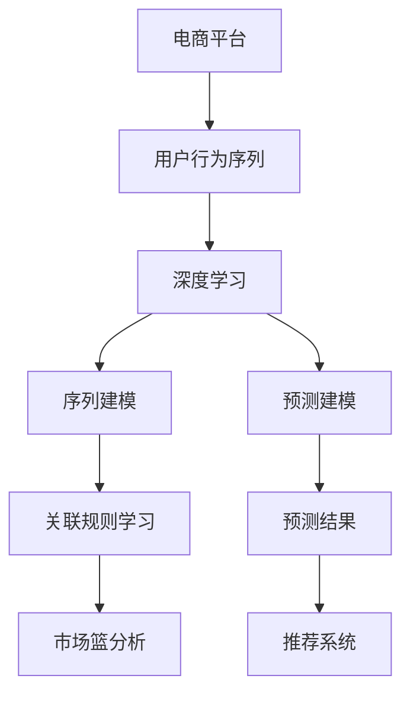

                 

# AI赋能的电商平台用户行为序列分析

> 关键词：电商平台，用户行为分析，序列分析，深度学习，RNN，LSTM，预测建模，关联规则

## 1. 背景介绍

在现代电商平台上，用户行为数据对于商家来说至关重要。通过分析用户的行为序列，商家可以洞察消费者的购买意向、浏览习惯、偏好变化等信息，从而优化产品推荐、提升用户体验、提高转化率。电商平台上的用户行为数据具有以下几个特点：

1. **高维度**：用户行为数据通常包含多个维度，如点击次数、浏览时间、商品评价等，给数据处理带来挑战。
2. **时序性**：用户行为具有显著的时间顺序，不同行为之间存在因果关系。
3. **多样性**：用户行为多样，既包括点击、浏览等显性行为，也包括搜索、收藏等隐性行为。
4. **海量数据**：电商平台的用户数庞大，每个用户的行为数据量也非常大。

面对这些挑战，传统的数据挖掘和统计分析方法已经难以满足需求。近年来，随着深度学习技术的发展，特别是序列建模和预测建模技术的进步，电商平台的用户行为序列分析迎来了新的机遇。本文将详细探讨如何利用深度学习技术，对电商平台的用户行为序列进行建模和分析，以期为电商商家提供更精准的用户画像和个性化推荐服务。

## 2. 核心概念与联系

### 2.1 核心概念概述

为更好地理解AI在电商平台用户行为序列分析中的应用，本节将介绍几个密切相关的核心概念：

- **电商平台（e-commerce platform）**：在线销售商品或服务的平台，如亚马逊、淘宝等，是用户行为数据的主要来源。
- **用户行为序列（User Behavior Sequence）**：用户在电商平台上的行为序列，通常包括点击、浏览、购买等操作。
- **深度学习（Deep Learning）**：基于神经网络的机器学习方法，能自动从数据中提取特征和模式，广泛应用于图像、语音、自然语言处理等领域。
- **序列建模（Sequence Modeling）**：通过构建序列模型来捕捉数据的时间依赖性，广泛应用于时间序列预测、自然语言处理等任务。
- **预测建模（Predictive Modeling）**：使用统计模型或机器学习模型对未来数据进行预测，广泛应用于金融、医疗、电商等领域。
- **关联规则学习（Association Rule Learning）**：发现数据中变量之间的关联关系，广泛应用于市场篮分析、推荐系统等。
- **深度学习序列模型（Deep Learning Sequence Models）**：如循环神经网络（RNN）、长短期记忆网络（LSTM）等，通过学习序列数据的长期依赖性，实现更精确的预测和分类。

这些核心概念之间的逻辑关系可以通过以下Mermaid流程图来展示：



这个流程图展示了大语言模型的核心概念及其之间的关系：

1. 电商平台产生用户行为序列数据。
2. 深度学习技术可以对序列数据进行建模。
3. 序列模型可以通过预测建模实现对用户行为的预测。
4. 关联规则学习可以发现用户行为之间的关联关系，应用于市场篮分析、推荐系统等。
5. 预测结果可用于个性化推荐、用户画像等，提升电商平台的运营效率。

这些概念共同构成了电商平台用户行为序列分析的理论基础，使得商家能够利用AI技术深入挖掘用户行为数据，实现更精准的用户画像和个性化推荐。

## 3. 核心算法原理 & 具体操作步骤
### 3.1 算法原理概述

电商平台用户行为序列分析的核心算法为深度学习序列模型，特别是循环神经网络（RNN）和长短期记忆网络（LSTM）。这些模型通过学习用户行为序列中的长期依赖性，能够捕捉到行为之间的复杂关系，从而实现更准确的预测和分类。

算法的基本原理如下：

1. **数据预处理**：对用户行为序列进行标准化、归一化等预处理，确保数据格式一致，便于模型训练。
2. **模型选择与设计**：选择合适的深度学习序列模型，设计模型的超参数，如网络层数、隐藏单元数、学习率等。
3. **模型训练**：使用历史用户行为序列数据对模型进行训练，最小化预测误差，优化模型参数。
4. **模型评估与调优**：在验证集上评估模型性能，根据评估结果调整模型超参数，继续训练直至收敛。
5. **预测与应用**：使用训练好的模型对新用户的行为序列进行预测，生成个性化推荐或用户画像。

### 3.2 算法步骤详解

#### 步骤1: 数据收集与预处理

电商平台用户行为数据通常来自交易记录、浏览日志、搜索历史等，需要将其标准化、清洗并转换为模型所需的格式。具体步骤包括：

1. **数据收集**：从电商平台的数据库或API接口中获取用户行为数据。
2. **数据清洗**：去除缺失值、重复数据、异常值等，确保数据质量。
3. **序列分割**：将用户行为序列分割成多个样本，每个样本包含一段行为数据。
4. **数据编码**：将离散的分类特征和连续的数值特征编码成模型可以处理的形式。

#### 步骤2: 模型选择与设计

选择深度学习序列模型，并设计模型的超参数。常用的深度学习序列模型包括RNN、LSTM等，具体选择应根据任务需求和数据特点进行评估。例如，LSTM在处理长序列数据时表现更好。

超参数设计通常包括网络层数、隐藏单元数、学习率、正则化参数等。建议采用网格搜索或随机搜索方法，找到最优超参数组合。

#### 步骤3: 模型训练

使用历史用户行为序列数据对模型进行训练，最小化预测误差。训练过程中需要注意以下几点：

1. **批量大小**：选择合适的批量大小，平衡内存使用和训练速度。
2. **学习率**：选择合适的学习率，避免过拟合和欠拟合。
3. **正则化**：使用L2正则、Dropout等方法避免过拟合。
4. **早停**：在验证集上设置早停条件，防止模型过拟合。

#### 步骤4: 模型评估与调优

在验证集上评估模型性能，根据评估结果调整模型超参数，继续训练直至收敛。评估指标包括准确率、召回率、F1值等，具体应根据任务需求进行评估。

#### 步骤5: 预测与应用

使用训练好的模型对新用户的行为序列进行预测，生成个性化推荐或用户画像。预测结果可以用于推荐系统、广告投放、客户维护等应用场景。

### 3.3 算法优缺点

深度学习序列模型在电商平台用户行为序列分析中有以下优点：

1. **自动特征提取**：无需手动设计特征，模型能够自动从数据中提取有用特征。
2. **处理时序性数据**：能够处理用户行为序列中的时间依赖性，捕捉行为之间的复杂关系。
3. **预测精度高**：通过学习长期依赖性，能够实现更准确的预测和分类。

但深度学习序列模型也存在一些缺点：

1. **计算资源消耗大**：模型参数量大，训练和推理需要高性能计算资源。
2. **易过拟合**：需要大量数据和有效正则化方法，避免过拟合。
3. **模型复杂度较高**：设计不当可能导致模型难以解释。

### 3.4 算法应用领域

深度学习序列模型在电商平台用户行为序列分析中，已被广泛应用于以下几个领域：

1. **个性化推荐系统**：根据用户历史行为序列，生成个性化商品推荐，提升用户体验。
2. **用户画像构建**：通过分析用户行为序列，构建详细的用户画像，用于市场营销、客户维护等。
3. **预测用户流失**：预测用户流失行为，提前采取措施，降低用户流失率。
4. **广告投放优化**：根据用户行为序列预测广告效果，优化广告投放策略，提高广告ROI。
5. **情感分析**：分析用户对商品或服务的情感倾向，用于优化产品和服务质量。

## 4. 数学模型和公式 & 详细讲解  
### 4.1 数学模型构建

假设用户行为序列数据为 $X = \{x_1, x_2, ..., x_T\}$，其中 $x_t$ 表示第 $t$ 个用户行为，$T$ 为序列长度。电商平台用户行为序列分析的数学模型为深度学习序列模型，如RNN或LSTM。

模型由输入层、隐藏层和输出层组成，其中隐藏层包含若干个LSTM单元，每个LSTM单元接收一个输入 $x_t$ 和前一时刻的隐藏状态 $h_{t-1}$，输出当前时刻的隐藏状态 $h_t$ 和预测结果 $\hat{y}_t$。模型结构如下图所示：


模型的训练目标是最小化预测误差 $L$，常见目标函数包括均方误差、交叉熵等。

假设模型的预测结果为 $\hat{y}_t$，真实结果为 $y_t$，则均方误差为目标函数 $L_{mse}$ 的定义如下：

$$
L_{mse} = \frac{1}{N}\sum_{t=1}^{N}(y_t - \hat{y}_t)^2
$$

其中 $N$ 为样本数量。

## 5. 项目实践：代码实例和详细解释说明
### 5.1 开发环境搭建

在进行电商平台用户行为序列分析的实践前，我们需要准备好开发环境。以下是使用Python进行TensorFlow开发的的环境配置流程：

1. 安装Anaconda：从官网下载并安装Anaconda，用于创建独立的Python环境。

2. 创建并激活虚拟环境：
```bash
conda create -n tf-env python=3.8 
conda activate tf-env
```

3. 安装TensorFlow：根据CUDA版本，从官网获取对应的安装命令。例如：
```bash
conda install tensorflow tensorflow-gpu -c conda-forge
```

4. 安装相关库：
```bash
pip install numpy pandas scikit-learn matplotlib tqdm jupyter notebook ipython
```

完成上述步骤后，即可在`tf-env`环境中开始项目实践。

### 5.2 源代码详细实现

以下是使用TensorFlow实现电商平台用户行为序列分析的代码示例：

```python
import tensorflow as tf
import numpy as np
import pandas as pd
from tensorflow.keras.models import Sequential
from tensorflow.keras.layers import LSTM, Dense
from sklearn.model_selection import train_test_split
from sklearn.preprocessing import MinMaxScaler

# 读取用户行为序列数据
data = pd.read_csv('user_behavior.csv')
X = data.drop(['label'], axis=1).values
y = data['label'].values

# 数据标准化
scaler = MinMaxScaler(feature_range=(0, 1))
X = scaler.fit_transform(X)

# 数据分割
X_train, X_test, y_train, y_test = train_test_split(X, y, test_size=0.2, random_state=42)

# 定义模型
model = Sequential()
model.add(LSTM(64, input_shape=(X_train.shape[1], 1)))
model.add(Dense(1, activation='sigmoid'))
model.compile(loss='binary_crossentropy', optimizer='adam', metrics=['accuracy'])

# 训练模型
model.fit(X_train, y_train, epochs=10, batch_size=32, validation_data=(X_test, y_test))

# 模型评估
loss, accuracy = model.evaluate(X_test, y_test)
print('Test Loss:', loss)
print('Test Accuracy:', accuracy)
```

### 5.3 代码解读与分析

这里我们详细解读一下代码中的关键部分：

**数据预处理**：
- 使用Pandas库读取用户行为序列数据。
- 数据标准化，将特征值缩放到0-1之间，便于模型训练。

**模型定义**：
- 使用TensorFlow的Sequential模型定义LSTM序列模型。
- 隐藏层包含64个LSTM单元，输入维度为 $X_train.shape[1]$，输出维度为1。
- 输出层为sigmoid激活函数，用于二分类任务。

**模型训练**：
- 使用Binary Crossentropy损失函数和Adam优化器进行模型训练。
- 训练10个epoch，批大小为32。
- 在验证集上评估模型性能。

**模型评估**：
- 使用evaluate方法在测试集上评估模型性能。

可以看到，通过上述代码，我们能够使用TensorFlow实现一个简单的LSTM模型，用于电商平台用户行为序列分析。TensorFlow提供了强大的深度学习框架，使得模型开发和训练变得简便高效。

## 6. 实际应用场景
### 6.1 个性化推荐系统

个性化推荐系统是电商平台用户行为序列分析的重要应用之一。通过分析用户历史行为序列，推荐系统能够生成个性化商品推荐，提升用户体验。推荐系统的一般流程如下：

1. **数据收集**：收集用户历史行为数据，如点击、浏览、购买等。
2. **数据预处理**：标准化、清洗数据，将用户行为编码为模型输入。
3. **模型训练**：使用历史行为数据对深度学习序列模型进行训练。
4. **预测推荐**：对新用户的行为序列进行预测，生成个性化推荐。

### 6.2 用户画像构建

用户画像构建是电商平台用户行为序列分析的另一个重要应用。通过分析用户行为序列，可以构建详细的用户画像，用于市场营销、客户维护等。用户画像的构建流程如下：

1. **数据收集**：收集用户历史行为数据，如搜索、浏览、评价等。
2. **数据预处理**：标准化、清洗数据，将用户行为编码为模型输入。
3. **模型训练**：使用历史行为数据对深度学习序列模型进行训练。
4. **用户画像生成**：对新用户的序列数据进行预测，生成用户画像。

### 6.3 预测用户流失

预测用户流失是电商平台用户行为序列分析的另一个重要应用。通过分析用户行为序列，可以预测用户流失行为，提前采取措施，降低用户流失率。用户流失预测的流程如下：

1. **数据收集**：收集用户历史行为数据，如点击、浏览、购买等。
2. **数据预处理**：标准化、清洗数据，将用户行为编码为模型输入。
3. **模型训练**：使用历史行为数据对深度学习序列模型进行训练。
4. **用户流失预测**：对新用户的行为序列进行预测，生成流失概率。

### 6.4 未来应用展望

随着深度学习序列模型在电商平台用户行为序列分析中的应用不断深入，未来将有更多的应用场景被发掘。以下是一些未来应用展望：

1. **预测广告效果**：通过分析用户行为序列，预测广告点击率、转化率等指标，优化广告投放策略。
2. **情感分析**：分析用户对商品或服务的情感倾向，用于优化产品和服务质量。
3. **价格优化**：预测用户对不同价格的商品反应，进行动态定价。
4. **库存管理**：预测商品销售趋势，优化库存管理。
5. **市场篮分析**：分析用户购买行为，发现关联商品，生成组合推荐。

## 7. 工具和资源推荐
### 7.1 学习资源推荐

为了帮助开发者系统掌握深度学习在电商平台用户行为序列分析中的应用，这里推荐一些优质的学习资源：

1. 《深度学习》系列书籍：由机器学习领域的权威专家撰写，深入浅出地介绍了深度学习的原理和应用。
2. Coursera《深度学习专项课程》：斯坦福大学开设的深度学习课程，涵盖深度学习的基础知识和实践技巧。
3. TensorFlow官方文档：TensorFlow的官方文档，提供了丰富的教程和样例，帮助开发者快速上手。
4. PyTorch官方文档：PyTorch的官方文档，提供了丰富的教程和样例，帮助开发者快速上手。
5. Kaggle竞赛平台：Kaggle举办的数据科学竞赛，提供了大量高质量的数据集和算法实践机会。

通过对这些资源的学习实践，相信你一定能够快速掌握深度学习在电商平台用户行为序列分析中的精髓，并用于解决实际的电商问题。
###  7.2 开发工具推荐

高效的开发离不开优秀的工具支持。以下是几款用于电商平台用户行为序列分析开发的常用工具：

1. TensorFlow：由Google主导开发的深度学习框架，生产部署方便，适合大规模工程应用。
2. PyTorch：由Facebook主导开发的深度学习框架，灵活高效，适合研究性工作。
3. Jupyter Notebook：交互式笔记本，支持代码编写、数据可视化、模型训练等，非常适合数据分析和机器学习开发。
4. Scikit-learn：Python的机器学习库，提供了丰富的数据处理和模型评估工具，适合初步分析数据和模型选择。
5. Pandas：Python的数据处理库，提供了丰富的数据清洗、转换和分析工具，适合处理大规模数据集。

合理利用这些工具，可以显著提升电商平台用户行为序列分析的开发效率，加快创新迭代的步伐。

### 7.3 相关论文推荐

深度学习序列模型在电商平台用户行为序列分析中的应用研究，是一个快速发展的领域，以下是几篇奠基性的相关论文，推荐阅读：

1. Long Short-Term Memory（LSTM）：Hochreiter等在1997年提出的LSTM模型，为序列建模奠定了基础。
2. Sequence to Sequence Learning with Neural Networks：Sutskever等在2014年提出的Seq2Seq模型，实现了序列数据到序列数据的映射。
3. Attention Is All You Need（Transformer）：Vaswani等在2017年提出的Transformer模型，通过自注意力机制提升了序列建模的效率和效果。
4. Neural Collaborative Filtering：He等在2017年提出的Neural CF模型，实现了基于深度学习的推荐系统。
5. Deep Co-Attention Model for Contextual Recommendation：Zhao等在2019年提出的深度协同注意力模型，实现了对用户行为序列的深度理解。

这些论文代表了大语言模型微调技术的发展脉络。通过学习这些前沿成果，可以帮助研究者把握学科前进方向，激发更多的创新灵感。

## 8. 总结：未来发展趋势与挑战
### 8.1 总结

本文对深度学习在电商平台用户行为序列分析中的应用进行了全面系统的介绍。首先阐述了电商平台用户行为序列分析的背景和意义，明确了深度学习序列模型在处理高维度、时序性数据中的优势。其次，从原理到实践，详细讲解了深度学习序列模型的算法流程和关键步骤，给出了电商行为序列分析的完整代码实例。同时，本文还广泛探讨了深度学习在电商领域的应用前景，展示了其在个性化推荐、用户画像构建等方面的巨大潜力。

通过本文的系统梳理，可以看到，深度学习序列模型在电商平台用户行为序列分析中已经取得了显著成效，极大地提升了电商商家的运营效率和用户体验。未来，随着深度学习技术的不断进步，序列模型在电商领域的应用前景将更加广阔。

### 8.2 未来发展趋势

展望未来，深度学习序列模型在电商平台用户行为序列分析中，将呈现以下几个发展趋势：

1. **模型规模增大**：随着算力成本的下降和数据规模的扩张，深度学习序列模型的参数量还将持续增长。超大规模序列模型能够更好地捕捉用户行为的长期依赖性，提升预测精度。
2. **模型结构优化**：未来的深度学习序列模型将更注重结构优化，引入更多高级结构，如注意力机制、残差连接等，提高模型性能。
3. **模型迁移学习**：将电商领域模型迁移到其他领域，如金融、医疗等，实现跨领域知识共享，提升模型泛化能力。
4. **数据融合技术**：通过将用户行为数据与其他数据（如社交媒体、物联网数据等）进行融合，提升模型的决策能力和全面性。
5. **模型可解释性**：提高模型的可解释性，使商家能够理解模型的决策逻辑，增强决策信任度。
6. **隐私保护**：在用户行为序列分析中引入隐私保护技术，保护用户隐私。

以上趋势凸显了深度学习序列模型在电商平台用户行为序列分析中的广阔前景。这些方向的探索发展，必将进一步提升电商平台的运营效率，为商家带来更多价值。

### 8.3 面临的挑战

尽管深度学习序列模型在电商平台用户行为序列分析中已经取得了显著成效，但在迈向更加智能化、普适化应用的过程中，它仍面临着诸多挑战：

1. **计算资源消耗大**：深度学习序列模型参数量大，训练和推理需要高性能计算资源。
2. **数据质量问题**：电商用户行为数据质量参差不齐，存在缺失、异常等问题，影响模型性能。
3. **模型鲁棒性不足**：深度学习序列模型对噪声和异常值敏感，容易过拟合，影响模型泛化能力。
4. **模型可解释性不足**：深度学习模型通常被视为"黑盒"，难以解释其内部决策机制。
5. **数据隐私保护**：电商用户行为数据包含大量敏感信息，如何在保护用户隐私的前提下进行数据分析，是一个重要问题。

### 8.4 研究展望

面对深度学习序列模型在电商平台用户行为序列分析中面临的挑战，未来的研究需要在以下几个方面寻求新的突破：

1. **模型压缩与加速**：开发更高效的模型压缩和加速技术，减少计算资源消耗，提升模型性能。
2. **数据清洗与增强**：采用更高级的数据清洗和增强技术，提高数据质量，提升模型泛化能力。
3. **模型鲁棒性优化**：引入更多正则化技术，提升模型鲁棒性，避免过拟合。
4. **模型可解释性增强**：开发更强的可解释性工具，增强模型的透明度，提高用户信任度。
5. **隐私保护技术**：引入隐私保护技术，如差分隐私、联邦学习等，保护用户隐私。

这些研究方向的探索，必将引领深度学习序列模型在电商平台用户行为序列分析中迈向更高的台阶，为电商商家提供更加智能、高效的解决方案。

## 9. 附录：常见问题与解答
----------------------------------------------------------------

**Q1：电商平台用户行为序列分析是否适用于所有电商场景？**

A: 电商平台用户行为序列分析在大多数电商场景中都能取得不错的效果，特别是对于数据量较大的场景。但对于一些特殊场景，如B2B电商、C2C电商等，数据分布可能较为稀疏，模型性能可能受到影响。此时需要根据具体场景选择合适的模型和算法。

**Q2：如何选择深度学习序列模型？**

A: 选择深度学习序列模型应根据数据特点和任务需求进行评估。例如，对于需要捕捉长期依赖性的任务，LSTM或GRU模型可能更为适合。对于需要快速推理的任务，可以考虑使用卷积神经网络（CNN）或Transformer模型。

**Q3：电商平台用户行为序列分析需要注意哪些隐私问题？**

A: 电商平台用户行为序列分析需要注意以下隐私问题：
1. 数据匿名化：对用户行为数据进行匿名化处理，保护用户隐私。
2. 数据访问控制：对用户行为数据进行严格访问控制，确保数据安全。
3. 用户知情同意：在收集用户行为数据前，应获得用户知情同意，保障用户权益。
4. 数据传输安全：确保用户行为数据在传输过程中的安全性，防止数据泄露。

通过合理解决这些问题，可以在保护用户隐私的前提下，进行电商平台用户行为序列分析。

**Q4：电商平台用户行为序列分析的模型评估方法有哪些？**

A: 电商平台用户行为序列分析的模型评估方法主要包括：
1. 准确率（Accuracy）：模型预测结果与真实结果相符的比例。
2. 召回率（Recall）：模型正确预测出的正样本数占所有正样本数的比例。
3. F1值（F1 Score）：综合考虑准确率和召回率，用于评估模型整体性能。
4. AUC-ROC曲线：用于评估二分类模型的性能，横轴为False Positive Rate，纵轴为True Positive Rate。
5. ROC曲线：用于评估二分类模型的性能，横轴为False Positive Rate，纵轴为True Positive Rate。

通过这些评估方法，可以全面评估模型性能，指导模型调优。

---

作者：禅与计算机程序设计艺术 / Zen and the Art of Computer Programming

