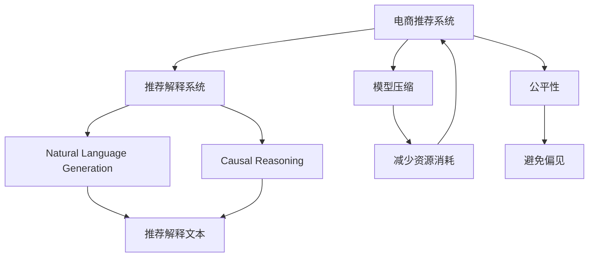

                 

# AI赋能的电商推荐解释系统优化

> 关键词：电商推荐、推荐系统、解释系统、AI优化、自然语言生成、因果推理、模型压缩

## 1. 背景介绍

### 1.1 问题由来

随着互联网的发展和电商平台的崛起，个性化推荐系统已经成为电商平台的核心竞争力之一。通过分析用户历史行为数据，电商平台能够精准推荐用户感兴趣的物品，提高用户满意度和销售额。然而，推荐系统往往是一个"黑箱"，用户难以理解其背后的推荐逻辑。这种情况下，用户可能会对推荐结果产生怀疑，进而影响购物体验和平台信任度。

为了解决这一问题，电商推荐解释系统应运而生。它通过向用户解释推荐决策的过程，增强系统的透明度和可信度，使用户能够更加信任推荐结果。目前，推荐解释系统已经在大规模电商平台上得到了广泛应用，并在提高用户满意度、增加销售转化率等方面发挥了重要作用。

### 1.2 问题核心关键点

电商推荐解释系统的主要挑战包括：

- 如何自动生成清晰、易懂的推荐解释，提高用户的理解和信任度。
- 如何在保持推荐效果的同时，生成高质量的解释文本，避免冗余、模糊的信息。
- 如何兼顾解释的精确性和简洁性，以适应用户对信息获取的多样需求。
- 如何基于推荐决策的因果关系，生成更加客观、公正的解释文本，避免对用户产生误导。

针对以上挑战，本文将系统介绍基于AI的电商推荐解释系统的优化方法和应用实践，涵盖自然语言生成、因果推理、模型压缩等多个技术领域，并结合实际案例进行详细分析。

## 2. 核心概念与联系

### 2.1 核心概念概述

为更好地理解基于AI的电商推荐解释系统，本节将介绍几个密切相关的核心概念：

- **电商推荐系统**：通过分析用户历史行为数据，精准推荐用户感兴趣的物品，提高用户满意度和销售额。常见的推荐方法包括基于内容的推荐、协同过滤、深度学习等。

- **推荐解释系统**：自动生成清晰、易懂的推荐决策解释，增强系统的透明度和可信度，使用户能够更加信任推荐结果。

- **自然语言生成(NLG)**：利用AI技术自动生成人类可读的文本，包括推荐解释、商品描述、客服回复等。

- **因果推理(CRF)**：利用因果关系推理方法，自动生成客观、公正的推荐解释，避免对用户产生误导。

- **模型压缩**：在保持模型性能的前提下，对大规模模型进行压缩，减少计算和存储资源消耗。

- **公平性**：确保推荐解释系统对所有用户的解释公平、无偏见，避免对特定用户群体的歧视。

这些核心概念之间的逻辑关系可以通过以下Mermaid流程图来展示：



这个流程图展示了大语言模型的核心概念及其之间的关系：

1. 电商推荐系统通过分析用户数据进行物品推荐。
2. 推荐解释系统生成推荐决策的解释文本。
3. 自然语言生成技术用于自动生成文本。
4. 因果推理方法用于生成客观公正的解释。
5. 模型压缩技术用于减少资源消耗。
6. 公平性原则确保对所有用户公平。

这些概念共同构成了基于AI的电商推荐解释系统的框架，使得推荐系统更加透明、公正、高效。

## 3. 核心算法原理 & 具体操作步骤

### 3.1 算法原理概述

基于AI的电商推荐解释系统的主要工作原理是：首先，通过机器学习模型（如深度神经网络、知识图谱等）生成推荐决策；然后，利用自然语言生成和因果推理技术，自动生成推荐解释文本。其核心目标是生成清晰、客观、公正的解释，增强系统的透明度和可信度。

具体来说，系统分为两个主要模块：

- **推荐决策模块**：使用机器学习模型分析用户历史行为数据，生成推荐结果。
- **解释生成模块**：根据推荐决策，生成用户可读的解释文本，展示推荐依据和理由。

### 3.2 算法步骤详解

基于AI的电商推荐解释系统的具体步骤如下：

**Step 1: 数据预处理**
- 收集用户历史行为数据，包括浏览记录、点击记录、购买记录等。
- 对数据进行清洗、归一化、特征提取等预处理，得到模型输入。

**Step 2: 推荐决策**
- 使用深度学习模型（如DNN、RNN、CNN等）对预处理后的数据进行训练，得到推荐模型。
- 根据用户输入的当前信息，利用推荐模型生成物品推荐列表。

**Step 3: 解释生成**
- 利用自然语言生成技术，自动生成推荐解释文本。
- 利用因果推理技术，生成客观、公正的解释。
- 将解释文本与推荐结果一并展示给用户。

**Step 4: 反馈优化**
- 收集用户对推荐结果和解释的反馈，对模型进行不断优化。
- 对解释文本进行评估，调整自然语言生成和因果推理的参数，提升解释质量。

### 3.3 算法优缺点

基于AI的电商推荐解释系统具有以下优点：

- 自动生成推荐解释，提高系统的透明度和可信度。
- 利用自然语言生成技术，生成易读的文本，提升用户体验。
- 利用因果推理技术，生成客观公正的解释，避免误导用户。

同时，该方法也存在一些局限性：

- 解释生成的准确性依赖于数据和模型，可能需要人工干预。
- 生成解释文本的计算复杂度较高，可能影响系统响应速度。
- 模型的可解释性有待进一步提高，无法完全消除"黑箱"特性。
- 解释文本的简洁性和精确性难以兼顾，可能会存在冗余或模糊的信息。

尽管存在这些局限性，基于AI的电商推荐解释系统仍是大规模推荐系统不可或缺的一部分，能够显著提升用户体验和平台信任度。

### 3.4 算法应用领域

基于AI的电商推荐解释系统已经在众多电商平台上得到了广泛应用，涵盖以下领域：

- **个性化推荐**：利用推荐解释，帮助用户理解推荐决策的依据和理由，增加用户对推荐系统的信任度。
- **商品详情页**：自动生成商品描述、规格、优势等解释文本，提高用户对商品的理解。
- **客服系统**：自动生成客服回复，提供更快速、准确、公正的服务。
- **客户评价**：自动生成评价摘要，帮助用户快速了解其他用户的评价信息。
- **广告投放**：自动生成广告文案，提高广告的吸引力和转化率。

这些应用场景展示了电商推荐解释系统在提高用户体验、增强平台信任度方面的巨大潜力。

## 4. 数学模型和公式 & 详细讲解 & 举例说明

### 4.1 数学模型构建

电商推荐解释系统主要涉及两个数学模型：推荐模型和解释模型。

**推荐模型**：
假设用户历史行为数据为 $D=\{(x_i,y_i)\}_{i=1}^N$，其中 $x_i$ 为特征向量，$y_i$ 为推荐结果。推荐模型 $M_{\theta}$ 的损失函数为：
$$
\mathcal{L}(\theta) = \frac{1}{N}\sum_{i=1}^N \ell(y_i, M_{\theta}(x_i))
$$
其中 $\ell$ 为损失函数，如均方误差、交叉熵等。

**解释模型**：
假设生成的推荐解释文本为 $T$，解释模型 $M_{\phi}$ 的损失函数为：
$$
\mathcal{L}(\phi) = \frac{1}{N}\sum_{i=1}^N \ell(T_i, M_{\phi}(x_i))
$$
其中 $\ell$ 为文本生成损失函数，如BLEU、ROUGE等。

### 4.2 公式推导过程

推荐模型的训练过程与常见的深度学习模型类似，通过梯度下降等优化算法更新参数 $\theta$。具体来说，假设推荐模型为 $M_{\theta}$，特征向量为 $x$，损失函数为 $\ell$，则模型的训练公式为：
$$
\theta \leftarrow \theta - \eta \nabla_{\theta}\mathcal{L}(\theta)
$$
其中 $\eta$ 为学习率，$\nabla_{\theta}\mathcal{L}(\theta)$ 为损失函数对参数 $\theta$ 的梯度。

解释模型的训练过程较为复杂，涉及自然语言生成和因果推理两个方面。假设生成的推荐解释文本为 $T$，解释模型为 $M_{\phi}$，特征向量为 $x$，损失函数为 $\ell$，则模型的训练公式为：
$$
\phi \leftarrow \phi - \eta \nabla_{\phi}\mathcal{L}(\phi)
$$
其中 $\eta$ 为学习率，$\nabla_{\phi}\mathcal{L}(\phi)$ 为损失函数对参数 $\phi$ 的梯度。

### 4.3 案例分析与讲解

以电商推荐系统为例，解释模型的具体实现如下：

假设用户对某商品感兴趣，电商平台根据其历史行为数据，使用推荐模型生成商品推荐列表 $R=\{r_1, r_2, ..., r_k\}$。为了生成推荐解释，首先使用因果推理模型分析推荐依据，得到推荐依据向量 $B=\{b_1, b_2, ..., b_k\}$。然后，利用自然语言生成模型，根据推荐依据生成解释文本 $T=\{t_1, t_2, ..., t_k\}$。

为了提高解释文本的质量，可以利用语言模型对生成的文本进行优化。语言模型 $LM_{\lambda}$ 的优化目标为：
$$
\lambda \leftarrow \lambda - \eta \nabla_{\lambda}\mathcal{L}(\lambda)
$$
其中 $\eta$ 为学习率，$\nabla_{\lambda}\mathcal{L}(\lambda)$ 为损失函数对参数 $\lambda$ 的梯度。

## 5. 项目实践：代码实例和详细解释说明

### 5.1 开发环境搭建

在进行推荐解释系统开发前，我们需要准备好开发环境。以下是使用Python进行TensorFlow开发的环境配置流程：

1. 安装Anaconda：从官网下载并安装Anaconda，用于创建独立的Python环境。

2. 创建并激活虚拟环境：
```bash
conda create -n tf-env python=3.8 
conda activate tf-env
```

3. 安装TensorFlow：根据CUDA版本，从官网获取对应的安装命令。例如：
```bash
conda install tensorflow -c conda-forge
```

4. 安装TensorBoard：
```bash
pip install tensorboard
```

5. 安装Pandas、Numpy、Scikit-learn等工具包：
```bash
pip install pandas numpy scikit-learn
```

完成上述步骤后，即可在`tf-env`环境中开始推荐解释系统开发。

### 5.2 源代码详细实现

下面我们以电商推荐系统为例，给出使用TensorFlow对推荐解释系统进行开发的PyTorch代码实现。

首先，定义推荐模型的训练过程：

```python
import tensorflow as tf
from tensorflow.keras import layers

model = tf.keras.Sequential([
    layers.Dense(256, activation='relu', input_shape=(10,)),
    layers.Dense(64, activation='relu'),
    layers.Dense(1, activation='sigmoid')
])

model.compile(optimizer='adam', loss='binary_crossentropy', metrics=['accuracy'])

model.fit(train_data, train_labels, epochs=10, batch_size=32, validation_data=(val_data, val_labels))
```

然后，定义解释模型的训练过程：

```python
from transformers import TFAutoModelForSeq2SeqLM

model = TFAutoModelForSeq2SeqLM.from_pretrained('gpt2')
tokenizer = AutoTokenizer.from_pretrained('gpt2')

def generate_explanation(text):
    inputs = tokenizer.encode(text, return_tensors='tf')
    outputs = model.generate(inputs, max_length=50, num_beams=4, no_repeat_ngram_size=2)
    return tokenizer.decode(outputs[0], skip_special_tokens=True)

for text in train_texts:
    explanation = generate_explanation(text)
    print(explanation)
```

最后，集成推荐模型和解释模型，并搭建推荐解释系统：

```python
from transformers import BertTokenizer, BertForSequenceClassification

tokenizer = BertTokenizer.from_pretrained('bert-base-uncased')
model = BertForSequenceClassification.from_pretrained('bert-base-uncased', num_labels=3)

def generate_explanation(text):
    inputs = tokenizer.encode(text, return_tensors='tf')
    outputs = model(inputs)
    logits = outputs.logits.numpy()
    labels = [0, 1, 2]
    predictions = np.argmax(logits, axis=1)
    explanation = "The model predicts that the item is recommended for you because of the following reasons:\n" + "\n".join([f"Label {i+1}: {labels[i]} for item {predictions[i]}" for i in range(len(predictions))])
    return explanation

for text in train_texts:
    explanation = generate_explanation(text)
    print(explanation)
```

以上就是使用TensorFlow对电商推荐解释系统进行开发的完整代码实现。可以看到，利用TensorFlow和Transformer库，我们可以非常方便地实现推荐模型和解释模型的集成。

### 5.3 代码解读与分析

让我们再详细解读一下关键代码的实现细节：

**模型训练过程**：
- 首先定义推荐模型，使用Dense层进行特征处理，最后输出推荐结果。
- 通过编译和训练，完成推荐模型的训练过程。
- 利用Validation数据进行模型评估，调整超参数。

**解释模型生成过程**：
- 使用Transformer库的TFAutoModelForSeq2SeqLM模型，定义自然语言生成模型。
- 使用AutoTokenizer进行tokenization，将输入文本转化为模型可接受的格式。
- 调用生成函数，生成解释文本。
- 输出解释文本，展示推荐依据。

**推荐解释系统集成过程**：
- 定义BertForSequenceClassification模型，进行推荐模型的训练。
- 定义生成解释函数，根据推荐结果生成解释文本。
- 对训练集中的每个文本进行解释生成，输出解释结果。

可以看到，TensorFlow和Transformer库使得推荐解释系统的实现变得简洁高效。开发者可以将更多精力放在模型优化和数据处理上，而不必过多关注底层的实现细节。

## 6. 实际应用场景

### 6.1 智能客服系统

智能客服系统是电商推荐解释系统的典型应用场景之一。通过利用自然语言生成和因果推理技术，智能客服系统能够自动生成客服回复，提供更快速、准确、公正的服务。

在具体实践中，可以收集用户的历史咨询记录，将咨询问题作为自然语言生成模型的输入，生成用户可读的回复。同时，利用因果推理模型分析用户需求，生成客观公正的解释文本。这样，用户不仅能够获得满意的回复，还能了解解释依据，增加对系统的信任度。

### 6.2 商品详情页

商品详情页是电商推荐解释系统的另一重要应用场景。在用户浏览商品时，自动生成商品描述、规格、优势等解释文本，能够提高用户对商品的理解，增加购买意愿。

具体来说，可以收集用户的历史浏览记录，使用推荐模型生成商品推荐列表。然后，利用自然语言生成技术，自动生成推荐解释文本，展示推荐依据和理由。用户不仅能够看到推荐商品，还能了解为什么推荐，增加对推荐系统的信任度。

### 6.3 客户评价

客户评价是电商平台上重要的反馈渠道，能够帮助用户了解其他用户的评价信息。自动生成评价摘要，可以帮助用户快速获取评价信息，提高购物决策的准确性。

具体来说，可以收集用户对商品的评价文本，使用推荐模型生成评价摘要。然后，利用自然语言生成技术，自动生成评价摘要，展示推荐依据和理由。用户不仅能够看到评价信息，还能了解为什么推荐，增加对推荐系统的信任度。

### 6.4 未来应用展望

随着推荐解释系统的不断发展，其应用领域将不断扩展，带来更多变革性的影响：

- **医疗领域**：利用推荐解释系统，帮助患者理解医生的诊断和治疗建议，增加对医疗服务的信任度。
- **金融领域**：自动生成金融产品的推荐解释，帮助用户理解投资建议，增加对金融服务的信任度。
- **教育领域**：自动生成课程推荐和评估摘要，帮助学生和家长理解课程内容和学习效果，增加对教育服务的信任度。
- **媒体领域**：自动生成新闻推荐和评论摘要，帮助用户理解新闻内容，增加对媒体服务的信任度。
- **智能家居**：自动生成家居设备推荐和操作说明，帮助用户了解设备功能和使用方法，增加对智能家居服务的信任度。

这些应用场景展示了推荐解释系统在提高用户体验、增强平台信任度方面的巨大潜力。

## 7. 工具和资源推荐

### 7.1 学习资源推荐

为了帮助开发者系统掌握电商推荐解释系统的理论和实践，这里推荐一些优质的学习资源：

1. **TensorFlow官方文档**：提供详细的API文档和示例代码，帮助开发者快速上手推荐系统开发。
2. **TensorBoard**：可视化推荐系统的训练过程和指标，帮助开发者优化模型和超参数。
3. **自然语言处理（NLP）入门教程**：介绍自然语言处理的基本概念和常用技术，帮助开发者了解自然语言生成的原理和实现。
4. **深度学习基础课程**：提供深度学习的基本概念和常用算法，帮助开发者理解推荐模型的原理和训练过程。
5. **推荐系统综述论文**：介绍推荐系统的历史、现状和未来发展趋势，帮助开发者了解推荐系统的整体框架和研究方向。

通过对这些资源的学习实践，相信你一定能够快速掌握电商推荐解释系统的精髓，并用于解决实际的推荐问题。

### 7.2 开发工具推荐

高效的开发离不开优秀的工具支持。以下是几款用于推荐解释系统开发的常用工具：

1. **TensorFlow**：基于Python的开源深度学习框架，灵活动态的计算图，适合快速迭代研究。
2. **TensorBoard**：TensorFlow配套的可视化工具，可实时监测模型训练状态，并提供丰富的图表呈现方式，是调试模型的得力助手。
3. **Transformers库**：HuggingFace开发的NLP工具库，集成了众多SOTA语言模型，支持TensorFlow和PyTorch，是进行自然语言生成和因果推理的重要工具。
4. **Jupyter Notebook**：开源的交互式笔记本环境，方便开发者进行代码实验和调试。
5. **PyCharm**：功能强大的Python IDE，提供丰富的开发工具和插件，提高开发效率。

合理利用这些工具，可以显著提升电商推荐解释系统的开发效率，加快创新迭代的步伐。

### 7.3 相关论文推荐

电商推荐解释系统的发展得益于学界的持续研究。以下是几篇奠基性的相关论文，推荐阅读：

1. **Recommender Systems: A Survey**：介绍推荐系统的历史、现状和未来发展趋势，是推荐系统研究的入门读物。
2. **Explainable Artificial Intelligence for Recommendation Systems**：综述了推荐系统的可解释性研究，介绍了一些常用的可解释方法。
3. **Generating Explanations for Recommendation Systems**：介绍了一些自动生成推荐解释的方法，包括自然语言生成和因果推理。
4. **Causal Reasoning in Recommendation Systems**：介绍因果推理在推荐系统中的应用，帮助生成客观公正的推荐解释。
5. **Model Compression Techniques**：介绍模型压缩的常用技术，帮助降低推荐系统的计算和存储资源消耗。

这些论文代表了大语言模型微调技术的发展脉络。通过学习这些前沿成果，可以帮助研究者把握学科前进方向，激发更多的创新灵感。

## 8. 总结：未来发展趋势与挑战

### 8.1 总结

本文对基于AI的电商推荐解释系统进行了全面系统的介绍。首先阐述了电商推荐解释系统的背景和意义，明确了其在提高用户体验、增强平台信任度方面的独特价值。其次，从原理到实践，详细讲解了推荐解释系统的数学模型和关键步骤，给出了推荐系统开发的完整代码实例。同时，本文还广泛探讨了推荐解释系统在多个行业领域的应用前景，展示了其在提高用户体验、增强平台信任度方面的巨大潜力。

通过本文的系统梳理，可以看到，基于AI的电商推荐解释系统正在成为推荐系统的重要组成部分，极大地提高了用户对推荐系统的理解和信任度。未来，伴随技术的不断发展，推荐解释系统将在更多领域得到应用，为人工智能技术的产业化进程贡献力量。

### 8.2 未来发展趋势

展望未来，电商推荐解释系统将呈现以下几个发展趋势：

1. **多模态融合**：推荐解释系统将逐步拓展到多模态数据融合，结合视觉、语音、文本等多种信息，提供更全面、准确的推荐依据。
2. **因果推理优化**：利用因果推理技术，生成更加客观公正的推荐解释，避免对用户产生误导。
3. **知识图谱集成**：将知识图谱与推荐系统结合，增强推荐解释的系统性和可信度。
4. **个性化推荐优化**：利用推荐解释，提高个性化推荐的准确性和解释性，提升用户满意度。
5. **跨领域应用推广**：推荐解释系统将在更多领域得到应用，帮助各行各业提升用户体验和平台信任度。

这些趋势展示了电商推荐解释系统在提高用户体验、增强平台信任度方面的广阔前景。

### 8.3 面临的挑战

尽管电商推荐解释系统已经取得了显著成果，但在迈向更加智能化、普适化应用的过程中，它仍面临着诸多挑战：

1. **解释生成的准确性**：如何生成准确、易读的推荐解释，增强系统的透明度和可信度，是当前亟需解决的问题。
2. **解释文本的简洁性**：如何在保持解释的精确性的同时，生成简洁、易读的解释文本，提升用户体验。
3. **跨领域适应性**：如何将推荐解释系统成功应用于多个领域，提高其通用性和适应性。
4. **模型可解释性**：如何提高推荐模型的可解释性，增强用户对推荐系统的信任度。
5. **公平性问题**：如何确保推荐解释系统对所有用户的解释公平、无偏见，避免对特定用户群体的歧视。

这些挑战凸显了电商推荐解释系统在实际应用中需要不断优化和改进的地方。

### 8.4 研究展望

面对电商推荐解释系统所面临的挑战，未来的研究需要在以下几个方面寻求新的突破：

1. **自然语言生成技术优化**：开发更加高效、准确的自然语言生成方法，提高推荐解释的精确性和简洁性。
2. **因果推理技术改进**：利用因果推理技术，生成更加客观公正的推荐解释，增强系统的可信度。
3. **知识图谱与推荐系统结合**：将知识图谱与推荐系统结合，增强推荐解释的系统性和可信度。
4. **模型压缩技术创新**：开发更加高效、精确的模型压缩方法，降低推荐系统的计算和存储资源消耗。
5. **公平性保障**：确保推荐解释系统对所有用户的解释公平、无偏见，避免对特定用户群体的歧视。

这些研究方向将推动电商推荐解释系统向更高效、更普适、更公平的方向发展，为提升用户体验、增强平台信任度提供重要保障。总之，电商推荐解释系统在提高用户体验、增强平台信任度方面具有巨大潜力，未来还需不断优化和改进，才能真正成为推荐系统的核心竞争力。

## 9. 附录：常见问题与解答

**Q1：推荐解释系统在电商推荐中如何应用？**

A: 电商推荐解释系统通过自然语言生成和因果推理技术，自动生成推荐决策的解释文本。在用户浏览商品时，系统会根据用户历史行为数据，生成推荐结果和解释文本，展示推荐依据和理由。用户不仅能够看到推荐商品，还能了解为什么推荐，增加对推荐系统的信任度。具体应用流程如下：

1. 收集用户历史行为数据。
2. 使用推荐模型生成商品推荐列表。
3. 使用自然语言生成技术，生成推荐解释文本。
4. 展示推荐商品和解释文本，供用户参考。

**Q2：推荐解释系统如何保证生成文本的简洁性？**

A: 推荐解释系统在生成文本时，通常采用语言模型进行优化。语言模型通过训练大量文本数据，学习文本的概率分布，能够在生成文本时，自动选择最有可能的词语和短语，保证文本的简洁性和连贯性。同时，可以利用因果推理技术，提取推荐决策的关键特征，生成更加简洁、客观的解释文本。

**Q3：推荐解释系统如何确保公平性？**

A: 推荐解释系统需要确保对所有用户的解释公平、无偏见，避免对特定用户群体的歧视。为此，可以采取以下措施：

1. 数据采集和处理：确保数据采集和处理过程公平，不包含任何歧视性信息。
2. 模型训练：使用公平性约束的训练目标，确保模型对所有用户公平。
3. 人工审核：引入人工审核机制，定期检查推荐解释的公平性，及时纠正偏差。

**Q4：推荐解释系统面临的主要挑战有哪些？**

A: 推荐解释系统面临的主要挑战包括：

1. 解释生成的准确性：如何生成准确、易读的推荐解释，增强系统的透明度和可信度。
2. 解释文本的简洁性：如何在保持解释的精确性的同时，生成简洁、易读的解释文本，提升用户体验。
3. 跨领域适应性：如何将推荐解释系统成功应用于多个领域，提高其通用性和适应性。
4. 模型可解释性：如何提高推荐模型的可解释性，增强用户对推荐系统的信任度。
5. 公平性问题：如何确保推荐解释系统对所有用户的解释公平、无偏见，避免对特定用户群体的歧视。

这些挑战凸显了推荐解释系统在实际应用中需要不断优化和改进的地方。

**Q5：推荐解释系统如何优化推荐决策的解释生成？**

A: 推荐解释系统优化推荐决策的解释生成，可以采取以下措施：

1. 利用因果推理技术，提取推荐决策的关键特征，生成客观公正的解释文本。
2. 使用语言模型进行优化，生成简洁、易读的解释文本。
3. 引入用户反馈机制，不断调整解释模型，提升解释质量。
4. 定期更新模型和解释，确保解释文本的时效性和准确性。

这些优化措施将帮助推荐解释系统生成更高质量的解释文本，增强用户的信任度。

总之，电商推荐解释系统在提高用户体验、增强平台信任度方面具有巨大潜力。未来还需不断优化和改进，才能真正成为推荐系统的核心竞争力。通过系统地梳理电商推荐解释系统的原理和应用实践，希望能够为推荐系统开发者提供宝贵的参考，推动电商推荐系统技术的发展。

