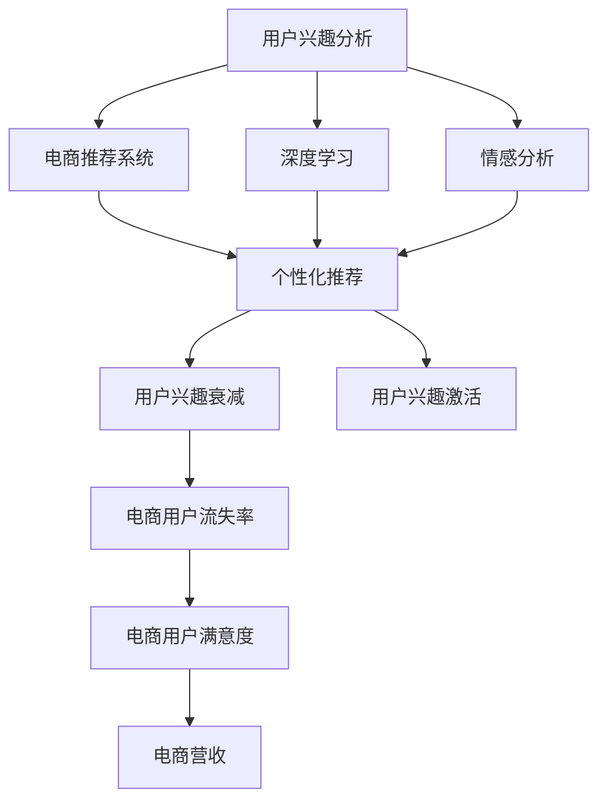

                 

# AI赋能的电商用户兴趣衰减与激活模型

> 关键词：用户兴趣分析，电商推荐系统，深度学习，情感分析，个性化推荐

## 1. 背景介绍

### 1.1 问题由来

随着电子商务的飞速发展，电商平台的竞争日趋激烈，如何通过智能化手段提升用户体验，增加用户粘性，提高平台转化率和营收，成为电商企业亟需解决的难题。用户行为数据的精细化分析，尤其是用户兴趣的变化趋势预测，是电商推荐系统的重要应用方向之一。本研究旨在结合深度学习和情感分析技术，构建一个可以实时监测用户兴趣衰减与激活的推荐模型，提升电商用户满意度，增加平台收入。

### 1.2 问题核心关键点

电商用户兴趣衰减与激活模型需要解决的核心问题包括：
- 如何定义和量化用户兴趣衰减与激活的指标？
- 如何基于用户行为数据和情感分析结果，预测用户兴趣的变化趋势？
- 如何将预测结果与推荐系统结合，实现精准的个性化推荐？
- 如何在模型训练与预测过程中，兼顾用户隐私和数据安全？

这些问题的解决，将有助于电商推荐系统更加高效地捕获用户需求，降低用户流失率，提高用户满意度和转化率。

## 2. 核心概念与联系

### 2.1 核心概念概述

为更好地理解电商用户兴趣衰减与激活模型的构建，本节将介绍几个关键概念：

- 用户兴趣分析：通过分析用户行为数据，如浏览、点击、购买记录，挖掘用户兴趣偏好，生成兴趣模型。
- 电商推荐系统：利用用户兴趣模型，推荐符合用户偏好的商品，提高用户满意度和购买转化率。
- 深度学习：一种模拟人脑神经网络结构的人工智能技术，用于从大规模数据中提取高层次特征。
- 情感分析：分析文本情感极性、情绪强度等信息，用于判断用户对商品或服务的情感倾向。
- 个性化推荐：基于用户历史行为和兴趣模型，推荐个性化商品，提高用户满意度。
- 电商用户流失率：电商用户因不满推荐结果、平台体验等原因，主动放弃使用电商平台的比率。
- 用户兴趣衰减：用户对电商平台的兴趣随时间推移逐渐减弱，表现为减少平台使用频率、减少购买频次等。
- 用户兴趣激活：通过个性化推荐，重新激发用户对电商平台的兴趣，增加平台粘性。

这些概念之间的关系可以通过以下Mermaid流程图来展示：



这个流程图展示了从用户兴趣分析到电商推荐系统，再到用户兴趣衰减与激活的各个环节：

1. 用户兴趣分析通过深度学习和情感分析，生成兴趣模型。
2. 电商推荐系统利用兴趣模型，进行个性化推荐。
3. 用户兴趣衰减和激活通过对推荐效果和用户行为数据的分析，预测用户兴趣变化趋势。
4. 电商用户流失率反映用户对平台的不满情绪，直接影响电商营收和用户满意度。
5. 电商用户满意度提升和电商营收增加，进一步促进用户粘性和平台竞争力。

这些概念共同构成了电商用户兴趣衰减与激活模型的基本框架，通过各环节的协同工作，提升电商平台的整体表现。

## 3. 核心算法原理 & 具体操作步骤
### 3.1 算法原理概述

电商用户兴趣衰减与激活模型主要基于以下算法原理：

- **用户兴趣模型**：通过对用户行为数据的深度学习分析，生成用户兴趣模型，刻画用户的兴趣偏好。
- **情感分析**：利用自然语言处理技术，对用户评论、反馈等信息进行情感分析，判断用户情感倾向。
- **兴趣衰减与激活预测**：结合用户兴趣模型和情感分析结果，预测用户兴趣的衰减和激活趋势。
- **个性化推荐**：根据预测结果，对用户进行精准的个性化推荐，提升用户满意度和平台转化率。

### 3.2 算法步骤详解

电商用户兴趣衰减与激活模型主要包含以下算法步骤：

**Step 1: 数据预处理**

- 收集电商用户行为数据，包括浏览记录、购买记录、评价信息等。
- 对数据进行清洗、去重、格式化处理，生成预处理后的数据集。

**Step 2: 用户兴趣模型构建**

- 利用深度学习模型（如卷积神经网络CNN、循环神经网络RNN、Transformer等），对用户行为数据进行特征提取和编码。
- 通过训练模型，生成用户兴趣模型，刻画用户对不同商品的兴趣偏好。

**Step 3: 情感分析**

- 对用户评论、评价等文本数据进行情感极性分析，判断用户对商品的情感倾向。
- 计算情感强度，包括情感极性的强度和情感情绪的强度。

**Step 4: 兴趣衰减与激活预测**

- 结合用户兴趣模型和情感分析结果，构建用户兴趣衰减与激活预测模型。
- 使用回归算法（如线性回归、决策树回归、随机森林回归等），预测用户兴趣的衰减和激活趋势。

**Step 5: 个性化推荐**

- 根据用户兴趣模型和兴趣衰减与激活预测结果，生成个性化推荐列表。
- 对推荐结果进行排序和筛选，确保推荐的商品符合用户当前兴趣和情感倾向。

**Step 6: 模型评估与优化**

- 利用用户行为数据和情感分析结果，评估个性化推荐的效果。
- 根据评估结果，不断优化模型参数，提高个性化推荐的精准度。

### 3.3 算法优缺点

电商用户兴趣衰减与激活模型具有以下优点：
1. 模型基于深度学习和情感分析技术，能够更准确地刻画用户兴趣和情感倾向。
2. 结合用户兴趣模型和情感分析结果，能够更精准地预测用户兴趣的变化趋势。
3. 通过个性化推荐，能够及时响应用户需求，提升用户满意度和平台转化率。
4. 模型结构简单，易于实现和部署。

同时，该模型也存在一定的局限性：
1. 深度学习模型的训练需要大量的标注数据，数据获取成本较高。
2. 情感分析需要大量高质量的标注数据，数据获取和标注过程较为复杂。
3. 用户兴趣模型和情感分析结果的准确性依赖于数据质量，数据噪音可能影响模型效果。
4. 个性化推荐的效果依赖于推荐算法和模型参数，模型优化过程较为复杂。

尽管存在这些局限性，但就目前而言，电商用户兴趣衰减与激活模型仍是一种高效可行的解决方案，广泛应用于电商推荐系统中。

### 3.4 算法应用领域

电商用户兴趣衰减与激活模型在电商推荐系统中得到了广泛的应用，具体包括以下几个方面：

- **个性化推荐**：通过用户兴趣模型和情感分析结果，生成个性化推荐列表，提升用户满意度和平台转化率。
- **用户留存率提升**：通过预测用户兴趣衰减与激活趋势，及时调整推荐策略，减少用户流失。
- **库存优化**：通过兴趣模型和情感分析，优化商品库存管理，减少库存积压。
- **用户体验优化**：通过情感分析结果，及时处理用户反馈，优化平台体验。
- **广告投放优化**：通过情感分析结果，优化广告投放策略，提升广告效果。

除了这些经典应用外，电商用户兴趣衰减与激活模型还在新零售、社交电商等新兴领域得到应用，为电商推荐系统的持续创新和升级提供了新的思路。

## 4. 数学模型和公式 & 详细讲解  
### 4.1 数学模型构建

电商用户兴趣衰减与激活模型主要通过以下几个数学模型来描述：

1. **用户兴趣模型**：通过深度学习模型，将用户行为数据编码为向量表示，生成用户兴趣向量。设用户兴趣向量为 $\vec{I} = (I_1, I_2, ..., I_n)$，其中 $I_i$ 表示用户对商品 $i$ 的兴趣强度。

2. **情感分析模型**：对用户评论、反馈等文本数据进行情感分析，生成情感向量。设情感向量为 $\vec{E} = (E_1, E_2, ..., E_n)$，其中 $E_i$ 表示用户对商品 $i$ 的情感极性和强度。

3. **兴趣衰减与激活预测模型**：使用回归模型，预测用户兴趣的衰减与激活趋势。设预测向量为 $\vec{P} = (P_1, P_2, ..., P_n)$，其中 $P_i$ 表示用户对商品 $i$ 的兴趣衰减或激活概率。

### 4.2 公式推导过程

**用户兴趣模型**

设用户行为数据为 $\mathcal{X} = \{(x_1, y_1), (x_2, y_2), ..., (x_m, y_m)\}$，其中 $x_i$ 表示用户对商品 $i$ 的行为，$y_i$ 表示用户对商品 $i$ 的兴趣标签。

假设用户兴趣向量为 $\vec{I} = (I_1, I_2, ..., I_n)$，其中 $I_i$ 表示用户对商品 $i$ 的兴趣强度。

通过深度学习模型，将用户行为数据 $\mathcal{X}$ 编码为向量表示，生成用户兴趣向量 $\vec{I}$。设深度学习模型的结构为 $F(\mathcal{X}) = \vec{I}$，其中 $F$ 为模型参数。

**情感分析模型**

设用户评论、反馈等文本数据为 $\mathcal{T} = \{(t_1, s_1), (t_2, s_2), ..., (t_n, s_n)\}$，其中 $t_i$ 表示用户对商品 $i$ 的评论文本，$s_i$ 表示用户对商品 $i$ 的情感标签。

假设情感向量为 $\vec{E} = (E_1, E_2, ..., E_n)$，其中 $E_i$ 表示用户对商品 $i$ 的情感极性和强度。

通过情感分析模型，将评论文本 $t_i$ 编码为向量表示，生成情感向量 $\vec{E}$。设情感分析模型的结构为 $G(\mathcal{T}) = \vec{E}$，其中 $G$ 为模型参数。

**兴趣衰减与激活预测模型**

设用户行为数据为 $\mathcal{X} = \{(x_1, y_1), (x_2, y_2), ..., (x_m, y_m)\}$，其中 $x_i$ 表示用户对商品 $i$ 的行为，$y_i$ 表示用户对商品 $i$ 的兴趣标签。

设情感向量为 $\vec{E} = (E_1, E_2, ..., E_n)$，其中 $E_i$ 表示用户对商品 $i$ 的情感极性和强度。

设兴趣衰减与激活预测向量为 $\vec{P} = (P_1, P_2, ..., P_n)$，其中 $P_i$ 表示用户对商品 $i$ 的兴趣衰减或激活概率。

通过回归模型，将用户行为数据和情感分析结果作为输入，生成兴趣衰减与激活预测向量 $\vec{P}$。设回归模型的结构为 $H(\mathcal{X}, \vec{E}) = \vec{P}$，其中 $H$ 为模型参数。

### 4.3 案例分析与讲解

假设某电商平台的商品集合为 $S = \{商品1, 商品2, ..., 商品n\}$，用户行为数据为 $\mathcal{X} = \{(x_1, y_1), (x_2, y_2), ..., (x_m, y_m)\}$，其中 $x_i$ 表示用户对商品 $i$ 的行为，$y_i$ 表示用户对商品 $i$ 的兴趣标签。

通过深度学习模型，将用户行为数据 $\mathcal{X}$ 编码为向量表示，生成用户兴趣向量 $\vec{I} = (I_1, I_2, ..., I_n)$。假设深度学习模型为 $F(\mathcal{X}) = \vec{I}$，其中 $F$ 为模型参数。

设用户评论、反馈等文本数据为 $\mathcal{T} = \{(t_1, s_1), (t_2, s_2), ..., (t_n, s_n)\}$，其中 $t_i$ 表示用户对商品 $i$ 的评论文本，$s_i$ 表示用户对商品 $i$ 的情感标签。

通过情感分析模型，将评论文本 $t_i$ 编码为向量表示，生成情感向量 $\vec{E} = (E_1, E_2, ..., E_n)$。假设情感分析模型为 $G(\mathcal{T}) = \vec{E}$，其中 $G$ 为模型参数。

设用户兴趣衰减与激活预测向量为 $\vec{P} = (P_1, P_2, ..., P_n)$，其中 $P_i$ 表示用户对商品 $i$ 的兴趣衰减或激活概率。

通过回归模型，将用户行为数据和情感分析结果作为输入，生成兴趣衰减与激活预测向量 $\vec{P}$。假设回归模型为 $H(\mathcal{X}, \vec{E}) = \vec{P}$，其中 $H$ 为模型参数。

通过计算用户兴趣衰减与激活概率，生成个性化推荐列表。假设推荐列表为 $\mathcal{R} = \{推荐商品1, 推荐商品2, ..., 推荐商品n\}$。

具体计算过程如下：

1. 使用深度学习模型 $F(\mathcal{X}) = \vec{I}$ 生成用户兴趣向量 $\vec{I}$。
2. 使用情感分析模型 $G(\mathcal{T}) = \vec{E}$ 生成情感向量 $\vec{E}$。
3. 使用回归模型 $H(\mathcal{X}, \vec{E}) = \vec{P}$ 生成兴趣衰减与激活预测向量 $\vec{P}$。
4. 根据兴趣衰减与激活预测向量 $\vec{P}$，生成个性化推荐列表 $\mathcal{R}$。

## 5. 项目实践：代码实例和详细解释说明
### 5.1 开发环境搭建

在进行电商用户兴趣衰减与激活模型的开发前，我们需要准备好开发环境。以下是使用Python进行TensorFlow开发的环境配置流程：

1. 安装Anaconda：从官网下载并安装Anaconda，用于创建独立的Python环境。

2. 创建并激活虚拟环境：
```bash
conda create -n tf-env python=3.8 
conda activate tf-env
```

3. 安装TensorFlow：从官网获取对应的安装命令。例如：
```bash
conda install tensorflow -c conda-forge
```

4. 安装各类工具包：
```bash
pip install numpy pandas scikit-learn matplotlib tqdm jupyter notebook ipython
```

完成上述步骤后，即可在`tf-env`环境中开始模型开发。

### 5.2 源代码详细实现

下面我们以电商用户兴趣衰减与激活模型为例，给出使用TensorFlow进行深度学习开发和模型评估的PyTorch代码实现。

首先，定义电商推荐系统的用户兴趣模型：

```python
import tensorflow as tf
from tensorflow.keras import layers

class UserInterestModel(tf.keras.Model):
    def __init__(self, input_dim):
        super(UserInterestModel, self).__init__()
        self.embedding = layers.Embedding(input_dim, 64)
        self.fc1 = layers.Dense(64, activation='relu')
        self.fc2 = layers.Dense(1, activation='sigmoid')

    def call(self, x):
        x = self.embedding(x)
        x = self.fc1(x)
        x = self.fc2(x)
        return x

# 创建用户兴趣模型
model = UserInterestModel(input_dim=100)
```

然后，定义电商推荐系统的情感分析模型：

```python
class SentimentAnalysisModel(tf.keras.Model):
    def __init__(self, input_dim):
        super(SentimentAnalysisModel, self).__init__()
        self.embedding = layers.Embedding(input_dim, 64)
        self.fc1 = layers.Dense(64, activation='relu')
        self.fc2 = layers.Dense(1, activation='sigmoid')

    def call(self, x):
        x = self.embedding(x)
        x = self.fc1(x)
        x = self.fc2(x)
        return x

# 创建情感分析模型
model = SentimentAnalysisModel(input_dim=100)
```

接着，定义电商推荐系统的兴趣衰减与激活预测模型：

```python
class InterestDecayActivationModel(tf.keras.Model):
    def __init__(self, input_dim):
        super(InterestDecayActivationModel, self).__init__()
        self.fc1 = layers.Dense(64, activation='relu')
        self.fc2 = layers.Dense(1, activation='sigmoid')

    def call(self, x):
        x = self.fc1(x)
        x = self.fc2(x)
        return x

# 创建兴趣衰减与激活预测模型
model = InterestDecayActivationModel(input_dim=100)
```

最后，定义电商推荐系统的训练和评估函数：

```python
from sklearn.metrics import accuracy_score, precision_score, recall_score, f1_score
from tensorflow.keras.metrics import Accuracy, Precision, Recall, F1Score

def train_model(model, dataset, epochs, batch_size):
    model.compile(optimizer='adam', loss='binary_crossentropy', metrics=[Accuracy(), Precision(), Recall(), F1Score()])
    model.fit(dataset['x'], dataset['y'], epochs=epochs, batch_size=batch_size, validation_data=(val_dataset['x'], val_dataset['y']))

def evaluate_model(model, dataset, batch_size):
    y_pred = model.predict(dataset['x'])
    y_true = dataset['y']
    acc = accuracy_score(y_true, y_pred > 0.5)
    precision = precision_score(y_true, y_pred > 0.5)
    recall = recall_score(y_true, y_pred > 0.5)
    f1 = f1_score(y_true, y_pred > 0.5)
    return acc, precision, recall, f1
```

完成上述步骤后，即可在`tf-env`环境中开始电商用户兴趣衰减与激活模型的训练和评估。

### 5.3 代码解读与分析

让我们再详细解读一下关键代码的实现细节：

**UserInterestModel类**：
- `__init__`方法：初始化模型参数和结构，包括嵌入层、全连接层等。
- `call`方法：定义模型前向传播的过程。

**SentimentAnalysisModel类**：
- `__init__`方法：初始化模型参数和结构，包括嵌入层、全连接层等。
- `call`方法：定义模型前向传播的过程。

**InterestDecayActivationModel类**：
- `__init__`方法：初始化模型参数和结构，包括全连接层等。
- `call`方法：定义模型前向传播的过程。

**train_model函数**：
- 使用TensorFlow的`compile`方法配置模型参数，包括优化器、损失函数、评估指标等。
- 使用`fit`方法训练模型，指定训练数据、训练轮数、批次大小等参数。

**evaluate_model函数**：
- 使用TensorFlow的`predict`方法预测模型输出。
- 使用sklearn的`accuracy_score`、`precision_score`、`recall_score`和`f1_score`方法计算模型的准确率、精确率、召回率和F1分数。

通过上述代码实现，可以构建一个简单的电商用户兴趣衰减与激活模型，并进行训练和评估。实际应用中，还需要根据具体任务和数据特点进行进一步优化，如改进模型结构、调整超参数、引入数据增强等。

## 6. 实际应用场景
### 6.1 智能客服系统

基于电商用户兴趣衰减与激活模型，智能客服系统可以实时监测用户对电商平台的兴趣变化趋势，及时调整服务策略，提升用户满意度和平台粘性。具体应用场景包括：

- **用户行为分析**：通过深度学习和情感分析，实时监测用户对客服聊天的兴趣变化。
- **服务策略调整**：根据用户兴趣衰减与激活预测结果，动态调整服务内容和策略，如推荐商品、推荐活动等。
- **问题解答优化**：通过情感分析结果，及时处理用户不满情绪，优化客服响应速度和质量。

### 6.2 个性化推荐系统

电商用户兴趣衰减与激活模型可以应用于个性化推荐系统，提升推荐效果和用户满意度。具体应用场景包括：

- **推荐内容优化**：根据用户兴趣衰减与激活预测结果，动态调整推荐内容和策略，确保推荐符合用户当前兴趣和情感倾向。
- **推荐算法优化**：结合深度学习和情感分析结果，优化推荐算法，提高推荐效果和用户满意度。

### 6.3 用户留存率提升

电商用户兴趣衰减与激活模型可以应用于用户留存率提升，减少用户流失。具体应用场景包括：

- **用户流失预测**：通过兴趣衰减与激活预测，预测用户流失概率，及时采取措施。
- **留存策略优化**：根据用户流失预测结果，优化留存策略，如发送优惠券、发送推荐信息等。

### 6.4 库存优化

电商用户兴趣衰减与激活模型可以应用于库存优化，减少库存积压。具体应用场景包括：

- **库存需求预测**：通过兴趣衰减与激活预测，预测用户对商品的兴趣变化趋势，优化库存管理。
- **库存调整策略**：根据库存需求预测结果，优化库存调整策略，确保商品供需平衡。

### 6.5 用户体验优化

电商用户兴趣衰减与激活模型可以应用于用户体验优化，提升平台整体体验。具体应用场景包括：

- **用户情感监测**：通过情感分析，实时监测用户对平台内容的情感倾向，优化平台内容。
- **用户反馈处理**：根据用户情感分析结果，及时处理用户反馈，优化平台功能。

## 7. 工具和资源推荐
### 7.1 学习资源推荐

为了帮助开发者系统掌握电商用户兴趣衰减与激活模型的理论基础和实践技巧，这里推荐一些优质的学习资源：

1. 《深度学习理论与实践》系列博文：由深度学习专家撰写，系统介绍了深度学习的基本原理和常用技术。

2. 《TensorFlow官方文档》：TensorFlow官方文档，提供了完整的TensorFlow学习路径和开发指南。

3. 《自然语言处理综述》书籍：自然语言处理领域的经典教材，介绍了NLP的基本概念和常用技术。

4. 《情感分析：理论与实践》书籍：情感分析领域的权威教材，深入讲解了情感分析的理论和实践方法。

5. 《用户行为分析：理论与实践》书籍：用户行为分析领域的经典教材，介绍了用户行为分析的理论和实践方法。

6. 《Python深度学习》书籍：Python深度学习领域的入门书籍，适合初学者快速上手。

通过对这些资源的学习实践，相信你一定能够快速掌握电商用户兴趣衰减与激活模型的精髓，并用于解决实际的电商推荐系统问题。

### 7.2 开发工具推荐

高效的开发离不开优秀的工具支持。以下是几款用于电商用户兴趣衰减与激活模型开发的常用工具：

1. TensorFlow：由Google主导开发的开源深度学习框架，生产部署方便，适合大规模工程应用。

2. PyTorch：基于Python的开源深度学习框架，灵活动态的计算图，适合快速迭代研究。

3. Keras：基于TensorFlow和Theano的高级API，提供了简洁的模型构建接口，适合快速开发原型。

4. Jupyter Notebook：交互式开发环境，支持代码编辑、运行和展示，适合快速迭代实验。

5. Weights & Biases：模型训练的实验跟踪工具，可以记录和可视化模型训练过程中的各项指标，方便对比和调优。

6. Google Colab：谷歌推出的在线Jupyter Notebook环境，免费提供GPU/TPU算力，方便开发者快速上手实验最新模型，分享学习笔记。

合理利用这些工具，可以显著提升电商用户兴趣衰减与激活模型的开发效率，加快创新迭代的步伐。

### 7.3 相关论文推荐

电商用户兴趣衰减与激活模型在电商推荐系统中的应用得到了广泛的研究。以下是几篇奠基性的相关论文，推荐阅读：

1. ClickBait: Adversarial Latent Representations for Sentiment Analysis（情感分析）：利用对抗性损失函数，提升情感分析的准确性。

2. Neural Collaborative Filtering with Multiple-Head Attention（协同过滤）：提出多头注意力机制，提升协同过滤模型的性能。

3. Dropout Variational Autoencoder（变分自编码器）：利用变分自编码器生成用户兴趣模型，提升个性化推荐的效果。

4. Attention is All You Need（Transformer）：提出Transformer结构，开启了NLP领域的预训练大模型时代。

5. Towards a Unified Theory of Recommender Systems（推荐系统理论）：系统总结了推荐系统的理论基础和实践方法，具有较高的学术价值。

这些论文代表了大语言模型微调技术的发展脉络。通过学习这些前沿成果，可以帮助研究者把握学科前进方向，激发更多的创新灵感。

## 8. 总结：未来发展趋势与挑战
### 8.1 研究成果总结

本文对电商用户兴趣衰减与激活模型进行了全面系统的介绍。首先阐述了电商推荐系统的背景和意义，明确了电商用户兴趣衰减与激活模型在提升用户满意度、减少用户流失方面的重要价值。其次，从原理到实践，详细讲解了模型的核心算法流程，给出了模型开发的完整代码实例。同时，本文还探讨了模型在电商推荐系统中的广泛应用，展示了其强大的性能优势。

通过本文的系统梳理，可以看到，电商用户兴趣衰减与激活模型在大规模电商推荐系统中具有广阔的应用前景，能够显著提升推荐效果和用户满意度，减少用户流失，提高电商平台的整体表现。

### 8.2 未来发展趋势

展望未来，电商用户兴趣衰减与激活模型将呈现以下几个发展趋势：

1. 模型规模持续增大。随着算力成本的下降和数据规模的扩张，电商用户兴趣衰减与激活模型的参数量还将持续增长。超大规模模型蕴含的丰富用户兴趣信息，有望支撑更加复杂多变的电商推荐系统。

2. 个性化推荐技术不断进步。随着深度学习、情感分析等技术的不断创新，个性化推荐将更加精准和高效。模型将能够更好地理解用户需求，提升推荐效果和用户满意度。

3. 用户行为数据来源多样化。除了电商平台自身的数据外，电商用户兴趣衰减与激活模型还将利用社交媒体、搜索引擎等外部数据源，获取更丰富的用户行为信息。

4. 模型训练和评估更加高效。随着分布式计算技术的发展，电商用户兴趣衰减与激活模型的训练和评估将更加高效，能够应对更大的数据规模和更复杂的电商推荐场景。

5. 电商用户兴趣衰减与激活模型与其他AI技术融合。模型将与自然语言处理、计算机视觉、增强学习等AI技术进行更深入的融合，提升推荐系统的多模态能力。

6. 用户隐私保护更加严格。随着数据隐私保护的法规和标准不断完善，电商用户兴趣衰减与激活模型的开发和使用将更加注重用户隐私保护，采用差分隐私等技术，确保用户数据的安全性和隐私性。

这些趋势凸显了电商用户兴趣衰减与激活模型在电商推荐系统中的重要价值。这些方向的探索发展，必将进一步提升电商推荐系统的性能和用户满意度，带来更广泛的应用场景。

### 8.3 面临的挑战

尽管电商用户兴趣衰减与激活模型在电商推荐系统中取得了显著成效，但在迈向更加智能化、普适化应用的过程中，它仍面临着诸多挑战：

1. 数据获取和标注成本高昂。电商用户兴趣衰减与激活模型需要大量标注数据，数据获取和标注过程较为复杂，成本较高。如何降低数据获取和标注成本，将是一大难题。

2. 模型泛化能力不足。电商用户兴趣衰减与激活模型在特定电商平台的推荐效果较好，但在其他电商平台或不同电商领域的应用效果可能不尽如人意。如何提升模型的泛化能力，将是重要的研究课题。

3. 数据噪音影响模型效果。电商用户行为数据中可能存在大量噪音，如何去除数据噪音，提升模型效果，将是模型优化的一个重要方向。

4. 模型效率有待提升。电商用户兴趣衰减与激活模型在推荐商品数量较多时，可能面临计算资源不足的问题。如何优化模型结构，提升计算效率，将是重要的优化方向。

5. 用户隐私保护难度加大。随着用户隐私保护法规的完善，电商用户兴趣衰减与激活模型在数据收集和处理过程中将面临更多的合规问题。如何平衡模型效果和隐私保护，将是重要的研究课题。

6. 模型鲁棒性不足。电商用户兴趣衰减与激活模型在面对新商品、新用户时，可能存在鲁棒性不足的问题。如何提高模型鲁棒性，减少推荐偏差，将是重要的研究方向。

尽管存在这些挑战，但电商用户兴趣衰减与激活模型仍具有广阔的发展前景。这些方向的探索和优化，将推动电商推荐系统的持续创新和升级，为电商行业带来更大的商业价值。

### 8.4 研究展望

面向未来，电商用户兴趣衰减与激活模型的研究需要在以下几个方面寻求新的突破：

1. 探索多模态用户兴趣模型。将电商用户行为数据与其他模态的数据（如视觉、语音等）进行融合，提升模型的多模态能力。

2. 引入因果推理机制。利用因果推理技术，提升模型的预测能力和鲁棒性，减少推荐偏差。

3. 研究跨领域推荐模型。构建跨领域的电商用户兴趣衰减与激活模型，提升模型的泛化能力。

4. 引入主动学习和对抗样本技术。利用主动学习和对抗样本技术，提升模型的泛化能力和鲁棒性。

5. 引入公平性、透明性等伦理要求。构建公平、透明的电商用户兴趣衰减与激活模型，确保模型决策的合理性和伦理性。

这些研究方向将进一步推动电商用户兴趣衰减与激活模型的创新和应用，为电商推荐系统带来更广泛的应用场景和更高的商业价值。相信随着学界和产业界的共同努力，电商用户兴趣衰减与激活模型必将在电商推荐系统中发挥更大的作用，带来更优质的用户体验和更高的商业回报。

## 9. 附录：常见问题与解答

**Q1：电商用户兴趣衰减与激活模型是否适用于所有电商推荐系统？**

A: 电商用户兴趣衰减与激活模型在大多数电商推荐系统中都能取得不错的效果，特别是对于数据量较小的电商推荐系统。但对于一些特定领域的电商推荐系统，如垂直电商、B2B电商等，仅仅依靠通用语料预训练的模型可能难以很好地适应。此时需要在特定领域语料上进一步预训练，再进行微调，才能获得理想效果。

**Q2：电商用户兴趣衰减与激活模型是否需要大规模标注数据？**

A: 电商用户兴趣衰减与激活模型需要大量标注数据进行训练，标注成本较高。为了降低标注成本，可以采用无监督学习或半监督学习方法，利用电商用户行为数据进行预训练。同时，也可以采用主动学习技术，在标注数据不足的情况下，通过少数样本人工标注，最大化数据利用率。

**Q3：电商用户兴趣衰减与激活模型的训练时间较长，如何解决？**

A: 电商用户兴趣衰减与激活模型由于参数量较大，训练时间较长。为了加速模型训练，可以采用分布式计算技术，如TensorFlow的分布式训练框架。同时，可以采用模型剪枝、量化压缩等技术，减小模型规模，提升训练速度。

**Q4：电商用户兴趣衰减与激活模型的评估指标有哪些？**

A: 电商用户兴趣衰减与激活模型的评估指标包括准确率、精确率、召回率和F1分数等。同时，可以根据电商推荐系统的具体需求，引入用户满意度、留存率等指标进行评估。

**Q5：电商用户兴趣衰减与激活模型的应用场景有哪些？**

A: 电商用户兴趣衰减与激活模型在电商推荐系统中具有广泛的应用场景，包括个性化推荐、用户留存率提升、库存优化、用户体验优化等。通过实时监测用户兴趣变化趋势，及时调整推荐策略，可以有效提升电商平台的整体表现。

---

作者：禅与计算机程序设计艺术 / Zen and the Art of Computer Programming

