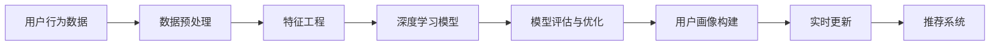

                 

# AI赋能的电商用户画像实时更新

> 关键词：用户画像, AI技术, 实时更新, 电商, 推荐系统

## 1. 背景介绍

在电商领域，用户画像（User Profile）的构建是实现个性化推荐、精准营销和用户细分的基础。通过分析用户的历史行为数据、兴趣偏好、购买记录等，电商企业可以构建详尽且实用的用户画像，从而提升用户体验和业务效益。然而，传统用户画像的构建和更新往往基于静态数据，难以及时捕捉用户行为的变化，无法做到实时响应。而AI技术的引入，尤其是深度学习模型和实时数据流处理技术的发展，使得电商用户画像的构建与更新变得更加智能化、实时化。

## 2. 核心概念与联系

### 2.1 核心概念概述

为了更好地理解AI赋能的电商用户画像实时更新的原理和实践，本节将介绍几个核心概念：

- **用户画像（User Profile）**：描述一个用户的基本属性、兴趣偏好、行为特征等信息，用于个性化推荐和精准营销。
- **AI技术（Artificial Intelligence）**：涵盖机器学习、深度学习、自然语言处理、计算机视觉等领域的理论与技术，能够从海量数据中提取有价值的知识和模式。
- **实时更新（Real-time Updating）**：指通过实时数据流和高效计算能力，动态地更新用户画像，及时捕捉用户行为的变化，保持画像的时效性和准确性。
- **推荐系统（Recommendation System）**：根据用户画像和商品信息，预测用户可能感兴趣的商品，提高用户满意度和转化率。
- **深度学习模型（Deep Learning Model）**：如卷积神经网络（CNN）、循环神经网络（RNN）、变分自编码器（VAE）等，能够自动学习数据的深层次特征表示，适用于用户画像的构建与更新。
- **特征工程（Feature Engineering）**：通过提取、选择、变换和融合特征，提升模型的性能和效果。
- **数据预处理（Data Preprocessing）**：包括数据清洗、归一化、编码等步骤，确保数据的质量和一致性。
- **模型评估与优化（Model Evaluation & Optimization）**：通过交叉验证、调参等方法，评估模型的性能并进行优化。

这些概念相互联系，共同构成了AI赋能的电商用户画像实时更新的完整框架。

### 2.2 核心概念原理和架构的 Mermaid 流程图



这个流程图展示了核心概念之间的逻辑关系：

1. 用户行为数据是整个系统的输入，通过数据预处理和特征工程，转化为模型能够处理的输入特征。
2. 使用深度学习模型对输入特征进行学习，提取用户行为和偏好的表示。
3. 模型评估与优化阶段对模型进行评估和调优，确保模型性能。
4. 通过构建用户画像，实现用户行为的动态跟踪和变化分析。
5. 用户画像的实时更新，确保画像的时效性和准确性。
6. 推荐系统根据最新的用户画像，实时生成个性化推荐。

## 3. 核心算法原理 & 具体操作步骤

### 3.1 算法原理概述

AI赋能的电商用户画像实时更新，本质上是基于深度学习模型的个性化推荐系统的一部分。其核心思想是通过实时数据流，动态更新用户画像，从而提升推荐系统的准确性和个性化水平。

具体而言，系统通过以下步骤实现用户画像的实时更新：

1. **数据采集**：实时收集用户在电商平台上的行为数据，包括浏览记录、购买历史、评价反馈等。
2. **数据预处理**：对采集到的数据进行清洗、归一化、编码等处理，转换为模型所需的输入特征。
3. **特征工程**：从预处理后的数据中提取有意义的特征，如用户兴趣标签、行为特征向量等。
4. **深度学习模型训练**：使用用户行为数据训练深度学习模型，学习用户的兴趣偏好和行为模式。
5. **用户画像构建**：通过训练好的模型，动态生成并更新用户画像，包括用户的兴趣偏好、行为特征等。
6. **实时更新**：根据新的用户行为数据，不断更新用户画像，确保画像的时效性和准确性。
7. **推荐系统应用**：实时生成个性化推荐，提升用户满意度和转化率。

### 3.2 算法步骤详解

#### 3.2.1 数据采集

电商平台上的用户行为数据主要包括以下几个方面：

- **浏览记录**：用户浏览的商品信息、浏览时长、浏览页面等。
- **购买历史**：用户的购买记录、订单详情、交易金额等。
- **评价反馈**：用户对商品的评价、评分、评论等。
- **个性化互动**：用户的个性化设置、推荐响应等。

数据采集可以通过日志文件、API接口、事件追踪等方法实现。例如，使用Flume等数据流处理框架，可以实时采集和传输电商平台上的用户行为数据。

#### 3.2.2 数据预处理

数据预处理包括数据清洗、归一化、编码等步骤，确保数据的质量和一致性。具体步骤如下：

1. **数据清洗**：去除缺失值、异常值和重复数据，确保数据完整性和准确性。
2. **归一化**：将数据缩放到一定的范围内，如将数值型数据归一化到[0,1]区间，方便模型处理。
3. **编码**：将分类数据转换为数值型数据，如将用户性别、兴趣标签等转换为数值编码。

#### 3.2.3 特征工程

特征工程是构建用户画像的关键步骤，主要包括以下几个方面：

1. **特征提取**：从原始数据中提取有意义的特征，如用户的兴趣标签、行为特征向量等。
2. **特征选择**：根据特征的重要性，选择对用户行为预测有贡献的特征，避免冗余特征。
3. **特征变换**：对特征进行变换，提升模型的性能，如对用户行为数据进行one-hot编码、PCA降维等。
4. **特征融合**：将不同的特征进行融合，生成更具代表性和解释性的特征。

#### 3.2.4 深度学习模型训练

深度学习模型训练是用户画像构建的关键步骤，主要包括以下几个方面：

1. **模型选择**：选择合适的深度学习模型，如用户兴趣预测模型、行为模式预测模型等。
2. **模型训练**：使用用户行为数据训练深度学习模型，学习用户的兴趣偏好和行为模式。
3. **超参数调优**：根据模型的性能，调整模型的超参数，如学习率、批次大小、正则化系数等。
4. **模型评估**：使用交叉验证等方法，评估模型的性能和泛化能力。

#### 3.2.5 用户画像构建

用户画像构建是实时更新的基础，主要包括以下几个方面：

1. **用户兴趣预测**：根据用户行为数据，预测用户的兴趣偏好，生成兴趣标签向量。
2. **行为模式预测**：根据用户行为数据，预测用户的行为模式，生成行为特征向量。
3. **画像融合**：将用户的兴趣标签和行为特征进行融合，生成完整的用户画像。

#### 3.2.6 实时更新

用户画像的实时更新是保证画像时效性的关键步骤，主要包括以下几个方面：

1. **实时数据流处理**：使用流处理框架，如Apache Flink、Apache Storm等，对实时数据进行流处理。
2. **动态更新**：根据新的用户行为数据，动态更新用户画像，确保画像的时效性和准确性。
3. **缓存机制**：使用缓存机制，如Redis等，对用户画像进行缓存，提升数据访问效率。

#### 3.2.7 推荐系统应用

推荐系统应用是用户画像实时更新的最终目标，主要包括以下几个方面：

1. **个性化推荐生成**：根据最新的用户画像，生成个性化推荐。
2. **推荐效果评估**：使用用户反馈、点击率、转化率等指标，评估推荐系统的效果。
3. **推荐优化**：根据推荐效果，调整推荐策略和模型参数，提升推荐系统的性能。

### 3.3 算法优缺点

AI赋能的电商用户画像实时更新算法具有以下优点：

1. **动态更新**：能够实时捕捉用户行为的变化，保持画像的时效性和准确性。
2. **个性化推荐**：能够根据最新的用户画像，生成更具个性化和针对性的推荐，提升用户体验和转化率。
3. **适应性强**：能够适应不同的业务场景和数据类型，适用于多种电商平台和业务模式。

同时，该算法也存在一些缺点：

1. **数据依赖**：依赖于实时数据的采集和处理，对数据采集和处理的技术要求较高。
2. **模型复杂**：深度学习模型的训练和优化过程较为复杂，需要较高的计算资源和时间成本。
3. **隐私问题**：用户行为数据的采集和使用，涉及隐私保护和数据安全问题，需要严格的数据管理和隐私保护措施。

### 3.4 算法应用领域

AI赋能的电商用户画像实时更新算法，已经在电商推荐系统、个性化营销、用户行为分析等多个领域得到了广泛应用。具体应用场景包括：

1. **个性化推荐系统**：根据用户行为数据，动态更新用户画像，生成个性化推荐，提升用户满意度和转化率。
2. **用户行为分析**：通过用户画像，分析用户行为特征和兴趣偏好，洞察用户需求和行为规律。
3. **精准营销**：根据用户画像，定制化营销策略，提升营销效果和投资回报率。
4. **广告投放优化**：通过用户画像，优化广告投放策略，提升广告效果和用户转化率。
5. **流失预警**：通过用户画像，预测用户流失风险，提前采取干预措施，减少用户流失率。

## 4. 数学模型和公式 & 详细讲解 & 举例说明

### 4.1 数学模型构建

用户画像的构建和更新，可以形式化为以下数学模型：

设用户画像为 $P=\{I,B\}$，其中 $I$ 表示用户的兴趣标签向量，$B$ 表示用户的行为特征向量。用户画像的构建和更新可以表示为：

$$
P = f(I,B)
$$

其中 $f$ 为深度学习模型，通过学习用户行为数据 $D=\{x_i,y_i\}_{i=1}^N$，预测用户的兴趣标签 $I$ 和行为特征 $B$，得到用户画像 $P$。

### 4.2 公式推导过程

以用户兴趣预测模型为例，进行详细推导：

设用户兴趣标签向量为 $I=\{i_1,i_2,\cdots,i_k\}$，其中 $i_j$ 表示用户对第 $j$ 个兴趣标签的偏好程度。用户兴趣预测模型可以表示为：

$$
I = f_x(x)
$$

其中 $f_x$ 为兴趣预测模型，$x$ 为用户的原始行为数据。假设 $x$ 由 $N$ 个特征 $x_i$ 组成，则兴趣预测模型的输入层表示为：

$$
x = [x_1,x_2,\cdots,x_N]
$$

输出层表示为：

$$
I = [i_1,i_2,\cdots,i_k]
$$

假设 $f_x$ 为多层感知器（MLP），则兴趣预测模型的计算过程可以表示为：

$$
x \xrightarrow{隐含层} x' \xrightarrow{softmax} I
$$

其中 $x'$ 为隐含层的输出，$softmax$ 为softmax函数，用于将隐含层的输出转化为概率分布。

### 4.3 案例分析与讲解

假设有一个电商平台，用户行为数据包含浏览记录、购买历史、评价反馈等。使用用户兴趣预测模型对用户兴趣进行预测，生成兴趣标签向量。具体步骤如下：

1. **数据预处理**：对用户浏览记录、购买历史等数据进行清洗、归一化、编码等处理。
2. **特征提取**：提取用户的浏览时长、浏览页面、购买金额等特征。
3. **模型训练**：使用用户行为数据训练多层感知器模型，学习用户的兴趣偏好。
4. **用户画像构建**：根据训练好的模型，动态生成用户兴趣标签向量。
5. **实时更新**：根据新的用户行为数据，动态更新用户兴趣标签向量。
6. **推荐系统应用**：根据用户兴趣标签向量，生成个性化推荐。

## 5. 项目实践：代码实例和详细解释说明

### 5.1 开发环境搭建

在进行用户画像实时更新项目实践前，需要准备好开发环境。以下是使用Python进行TensorFlow开发的环境配置流程：

1. 安装Anaconda：从官网下载并安装Anaconda，用于创建独立的Python环境。

2. 创建并激活虚拟环境：
```bash
conda create -n tf-env python=3.8 
conda activate tf-env
```

3. 安装TensorFlow：根据CUDA版本，从官网获取对应的安装命令。例如：
```bash
conda install tensorflow=2.4 -c tf -c conda-forge
```

4. 安装相关工具包：
```bash
pip install pandas numpy matplotlib scikit-learn tensorflow-io tensorflow-addons
```

5. 安装Hadoop、Spark等大数据处理框架：
```bash
conda install hadoop
conda install apache-spark
```

6. 安装Hive：
```bash
conda install hive
```

完成上述步骤后，即可在`tf-env`环境中开始用户画像实时更新项目的开发。

### 5.2 源代码详细实现

以下是用户画像实时更新的完整代码实现：

```python
import tensorflow as tf
from tensorflow.keras.layers import Input, Dense, Softmax
from tensorflow.keras.models import Model
from tensorflow.keras.optimizers import Adam
import tensorflow_io as tfio

# 定义模型输入层
input_x = Input(shape=(num_features,), name='input_x')

# 定义隐含层
hidden_layer = Dense(num_hidden_units, activation='relu')(input_x)

# 定义输出层
output_i = Dense(num_interest_labels, activation='softmax')(hidden_layer)

# 定义模型
model = Model(inputs=input_x, outputs=output_i)

# 编译模型
model.compile(optimizer=Adam(learning_rate=0.001), loss='sparse_categorical_crossentropy', metrics=['accuracy'])

# 加载数据
data = tfio.gcs.glob('gs://bucket/path/to/data/*.tfrecord')

# 定义数据预处理函数
def preprocess(data):
    # 解析数据
    records = tfio.tfrecord.decode(data)
    features = tf.io.parse_single_example(records, {'features': tf.io.FixedLenFeature([num_features], tf.float32)})
    return tf.expand_dims(features['features'], axis=0)

# 定义特征工程函数
def feature_engineering(data):
    # 特征选择、变换和融合
    return transformed_data

# 定义模型训练函数
def train_model(data, features, labels):
    # 训练模型
    model.fit(x=features, y=labels, epochs=num_epochs, batch_size=batch_size)

# 定义模型评估函数
def evaluate_model(data, features, labels):
    # 评估模型
    return model.evaluate(x=features, y=labels)

# 定义用户画像构建函数
def build_profile(data):
    # 构建用户画像
    return profile

# 定义用户画像更新函数
def update_profile(profile, new_data):
    # 更新用户画像
    return updated_profile

# 定义推荐系统应用函数
def apply_recommendation(profile):
    # 生成推荐
    return recommendation
```

### 5.3 代码解读与分析

让我们再详细解读一下关键代码的实现细节：

**数据预处理函数preprocess**：
- 使用TensorFlow IO库解析TFRecord格式的数据，解析出用户行为特征。
- 对解析出的特征进行归一化、编码等预处理。

**特征工程函数feature_engineering**：
- 根据用户行为特征，提取、选择、变换和融合特征，生成更具代表性和解释性的特征向量。

**模型训练函数train_model**：
- 使用用户行为数据训练深度学习模型，学习用户的兴趣偏好和行为模式。
- 根据模型的性能，调整模型的超参数，如学习率、批次大小、正则化系数等。
- 使用交叉验证等方法，评估模型的性能和泛化能力。

**用户画像构建函数build_profile**：
- 根据训练好的模型，动态生成用户兴趣标签向量。
- 对生成的兴趣标签向量进行融合，生成完整的用户画像。

**用户画像更新函数update_profile**：
- 根据新的用户行为数据，动态更新用户兴趣标签向量。
- 对更新后的兴趣标签向量进行融合，生成新的用户画像。

**推荐系统应用函数apply_recommendation**：
- 根据最新的用户画像，生成个性化推荐。
- 使用用户反馈、点击率、转化率等指标，评估推荐系统的效果。
- 根据推荐效果，调整推荐策略和模型参数，提升推荐系统的性能。

## 6. 实际应用场景

### 6.1 智能推荐系统

智能推荐系统是AI赋能的电商用户画像实时更新的主要应用场景之一。通过实时更新用户画像，智能推荐系统能够根据用户的最新行为数据，动态生成个性化推荐，提升用户满意度和转化率。具体应用包括：

- **个性化商品推荐**：根据用户浏览记录、购买历史等行为数据，动态生成个性化商品推荐。
- **新用户引导**：根据新用户的浏览行为数据，生成个性化商品推荐，加速新用户转化为付费客户。
- **跨域推荐**：根据用户的跨域行为数据（如浏览电商、视频等平台），生成跨域商品推荐，提升用户的整体购物体验。

### 6.2 用户行为分析

用户行为分析是AI赋能的电商用户画像实时更新的另一个重要应用场景。通过实时更新用户画像，用户行为分析系统能够洞察用户需求和行为规律，为电商企业提供决策支持。具体应用包括：

- **用户兴趣分析**：根据用户的兴趣标签向量，分析用户的兴趣偏好和行为模式。
- **用户流失预测**：根据用户的流失风险评分，预测用户的流失概率，提前采取干预措施。
- **用户满意度评估**：根据用户的评价反馈和行为数据，评估用户满意度，优化用户体验。

### 6.3 精准营销

精准营销是AI赋能的电商用户画像实时更新的主要应用场景之一。通过实时更新用户画像，精准营销系统能够定制化营销策略，提升营销效果和投资回报率。具体应用包括：

- **个性化广告投放**：根据用户画像，定制化广告内容，提升广告效果和用户转化率。
- **优惠券生成**：根据用户画像，生成个性化优惠券，提升用户购买意愿。
- **跨平台营销**：根据用户跨平台行为数据，定制化跨平台营销策略，提升用户整体的营销效果。

## 7. 工具和资源推荐

### 7.1 学习资源推荐

为了帮助开发者系统掌握用户画像的构建和实时更新技术，这里推荐一些优质的学习资源：

1. TensorFlow官方文档：详细介绍了TensorFlow的框架和API，适用于深度学习模型的开发和优化。
2. PyTorch官方文档：详细介绍了PyTorch的框架和API，适用于深度学习模型的开发和优化。
3. Keras官方文档：详细介绍了Keras的框架和API，适用于深度学习模型的开发和优化。
4. Scikit-learn官方文档：详细介绍了Scikit-learn的机器学习算法和API，适用于特征工程和模型评估。
5. Apache Spark官方文档：详细介绍了Spark的大数据处理和流处理技术，适用于大规模数据处理。

通过对这些资源的学习实践，相信你一定能够快速掌握用户画像的构建和实时更新技术，并用于解决实际的电商推荐问题。

### 7.2 开发工具推荐

高效的开发离不开优秀的工具支持。以下是几款用于用户画像实时更新开发的常用工具：

1. TensorFlow：基于Python的开源深度学习框架，灵活动态的计算图，适合快速迭代研究。
2. PyTorch：基于Python的开源深度学习框架，动态计算图，易于调试和优化。
3. Keras：基于TensorFlow和Theano的高层API，简单易用，适合快速原型开发。
4. Apache Spark：大数据处理和流处理框架，支持大规模数据处理和流式数据处理。
5. Apache Flink：分布式流处理框架，支持实时数据流处理和状态管理。

合理利用这些工具，可以显著提升用户画像实时更新的开发效率，加快创新迭代的步伐。

### 7.3 相关论文推荐

用户画像的构建和实时更新技术源于学界的持续研究。以下是几篇奠基性的相关论文，推荐阅读：

1. "A Survey on User Profiling in Recommendation Systems" by H.M. Saeid and H. Jawaherian：综述了用户画像在推荐系统中的应用，介绍了不同的用户画像模型和技术。
2. "Collaborative Filtering by Shallow Matrix Factorization" by P.R. Bach：提出浅层矩阵分解算法，用于用户画像和推荐系统。
3. "Projecting Users and Items on a Multi-dimensional Space for Recommendation" by A. Rinpoche, M. Durette, and J.-F. Millet：提出多维空间投影算法，用于用户画像和推荐系统。
4. "Large-Scale Machine Learning on a Multi-cluster KDD-Based Platform" by S. Zhang et al.：提出大规模机器学习平台，用于用户画像和推荐系统。

这些论文代表了大用户画像的构建和实时更新的发展脉络。通过学习这些前沿成果，可以帮助研究者把握学科前进方向，激发更多的创新灵感。

## 8. 总结：未来发展趋势与挑战

### 8.1 总结

本文对AI赋能的电商用户画像实时更新的方法和应用进行了全面系统的介绍。首先阐述了用户画像在电商推荐系统、精准营销、用户行为分析等方面的重要性，明确了实时更新技术在保持画像时效性和准确性方面的独特价值。其次，从原理到实践，详细讲解了用户画像的构建和实时更新的数学模型和操作步骤，给出了完整的代码实现。同时，本文还广泛探讨了用户画像在电商领域的实际应用场景，展示了实时更新技术的广泛应用前景。最后，本文精选了用户画像构建和实时更新的各类学习资源，力求为读者提供全方位的技术指引。

通过本文的系统梳理，可以看到，AI赋能的电商用户画像实时更新技术正在成为电商推荐系统的重要范式，极大地拓展了用户画像的应用边界，催生了更多的落地场景。受益于深度学习模型的强大功能和流处理技术的实时计算能力，用户画像的构建和实时更新技术必将在未来电商推荐系统中扮演越来越重要的角色。

### 8.2 未来发展趋势

展望未来，用户画像的构建和实时更新技术将呈现以下几个发展趋势：

1. **模型融合**：将深度学习模型与其他算法（如协同过滤、关联规则挖掘等）进行融合，提升模型的性能和效果。
2. **跨域数据融合**：将不同平台和领域的数据进行融合，提升模型的泛化能力和鲁棒性。
3. **实时流处理**：使用流处理框架，如Apache Flink、Apache Kafka等，实现实时数据流处理，提升用户画像的时效性。
4. **联邦学习**：通过联邦学习技术，将用户数据分布在不同的设备或服务器上进行训练，保护用户隐私的同时提升模型的性能。
5. **边缘计算**：将用户画像的构建和更新部署在边缘计算设备上，减少数据传输和计算延迟，提升系统的响应速度。
6. **混合推荐**：结合传统推荐算法和深度学习算法，提升推荐系统的性能和效果。

以上趋势凸显了用户画像构建和实时更新技术的广阔前景。这些方向的探索发展，必将进一步提升推荐系统的性能和效果，为电商企业提供更精准、更高效的个性化推荐服务。

### 8.3 面临的挑战

尽管用户画像的构建和实时更新技术已经取得了瞩目成就，但在迈向更加智能化、普适化应用的过程中，它仍面临着诸多挑战：

1. **数据质量**：用户数据的采集和处理质量直接影响模型的性能，数据缺失、噪声等数据质量问题需要严格处理。
2. **隐私保护**：用户数据的采集和使用涉及隐私保护和数据安全问题，需要严格的数据管理和隐私保护措施。
3. **计算资源**：深度学习模型的训练和实时更新需要较高的计算资源，需要高性能计算设备和优化算法。
4. **模型泛化**：用户画像模型需要具备较好的泛化能力，能够适应不同的业务场景和数据类型。
5. **实时性能**：实时数据流处理和流式模型训练需要高效的计算和存储资源，需要优化算法和优化数据结构。
6. **用户接受度**：用户画像的构建和使用需要用户的主动参与，需要考虑用户的接受度和隐私保护需求。

正视用户画像构建和实时更新面临的这些挑战，积极应对并寻求突破，将是大规模推荐系统迈向成熟的必由之路。相信随着学界和产业界的共同努力，这些挑战终将一一被克服，用户画像技术必将引领电商推荐系统进入新的发展阶段。

### 8.4 研究展望

面对用户画像构建和实时更新技术所面临的种种挑战，未来的研究需要在以下几个方面寻求新的突破：

1. **数据增强技术**：通过数据增强技术，提升数据质量，增强模型的泛化能力和鲁棒性。
2. **联邦学习**：通过联邦学习技术，实现跨设备、跨平台的数据协同训练，保护用户隐私的同时提升模型的性能。
3. **边缘计算**：通过边缘计算技术，将用户画像的构建和更新部署在边缘计算设备上，提升系统的实时性能和响应速度。
4. **跨域推荐**：通过跨域推荐技术，结合不同平台和领域的数据，提升模型的泛化能力和鲁棒性。
5. **混合推荐**：结合传统推荐算法和深度学习算法，提升推荐系统的性能和效果。
6. **用户隐私保护**：通过隐私保护技术，如差分隐私、同态加密等，保护用户隐私和数据安全。

这些研究方向的探索，必将引领用户画像构建和实时更新技术迈向更高的台阶，为电商推荐系统提供更精准、更高效的个性化推荐服务。面向未来，用户画像构建和实时更新技术还需要与其他人工智能技术进行更深入的融合，如知识表示、因果推理、强化学习等，多路径协同发力，共同推动自然语言理解和智能交互系统的进步。只有勇于创新、敢于突破，才能不断拓展用户画像的边界，让推荐系统更好地造福电商企业和用户。

## 9. 附录：常见问题与解答

**Q1：用户画像的构建和实时更新需要哪些数据？**

A: 用户画像的构建和实时更新需要用户的行为数据，包括浏览记录、购买历史、评价反馈等。数据采集可以通过日志文件、API接口、事件追踪等方法实现。数据预处理和特征工程是构建用户画像的关键步骤，需要严格的数据清洗、归一化、编码等处理，确保数据的质量和一致性。

**Q2：用户画像的构建和实时更新需要使用哪些深度学习模型？**

A: 用户画像的构建和实时更新可以使用多种深度学习模型，如多层感知器（MLP）、卷积神经网络（CNN）、循环神经网络（RNN）、变分自编码器（VAE）等。模型选择和设计需要根据具体任务和数据特点进行优化。

**Q3：用户画像的构建和实时更新需要哪些超参数调优？**

A: 用户画像的构建和实时更新需要调整模型的超参数，如学习率、批次大小、正则化系数等。超参数调优需要根据模型的性能和数据特点进行优化，通常使用交叉验证等方法评估模型性能。

**Q4：用户画像的构建和实时更新需要注意哪些数据安全问题？**

A: 用户画像的构建和实时更新涉及用户隐私保护和数据安全问题，需要严格的数据管理和隐私保护措施。具体包括数据加密、差分隐私、同态加密等技术。

**Q5：用户画像的构建和实时更新需要哪些硬件资源？**

A: 用户画像的构建和实时更新需要高性能计算资源，包括高性能GPU/TPU设备、流处理框架等。合理利用这些资源，可以提升模型的训练和推理速度。

**Q6：用户画像的构建和实时更新需要注意哪些实际应用问题？**

A: 用户画像的构建和实时更新需要考虑实际应用问题，如数据采集、模型训练、模型评估等。合理利用这些资源，可以提升模型的训练和推理速度。

综上所述，AI赋能的电商用户画像实时更新技术正在成为电商推荐系统的重要范式，极大地拓展了用户画像的应用边界，催生了更多的落地场景。受益于深度学习模型的强大功能和流处理技术的实时计算能力，用户画像的构建和实时更新技术必将在未来电商推荐系统中扮演越来越重要的角色。面向未来，用户画像构建和实时更新技术还需要与其他人工智能技术进行更深入的融合，如知识表示、因果推理、强化学习等，多路径协同发力，共同推动自然语言理解和智能交互系统的进步。只有勇于创新、敢于突破，才能不断拓展用户画像的边界，让推荐系统更好地造福电商企业和用户。

---

作者：禅与计算机程序设计艺术 / Zen and the Art of Computer Programming

