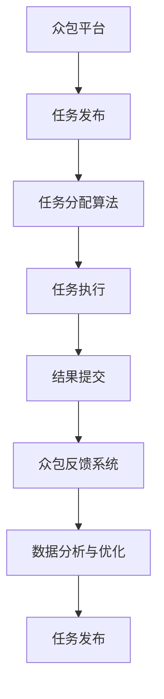

                 

# AI驱动的众包：增强全球协作

## 1. 背景介绍

随着人工智能技术的迅猛发展，我们进入了一个前所未有的技术变革时代。AI技术在各个行业的应用越来越广泛，为企业带来了巨大的商业价值和社会效益。而在AI发展的过程中，众包（Crowdsourcing）模式作为一种新型协作方式，正逐步成为AI驱动的重要手段。本文将围绕AI驱动的众包模式展开，探讨其核心概念、算法原理与具体操作步骤，并结合实际应用场景，提出未来发展的趋势与挑战。

## 2. 核心概念与联系

### 2.1 核心概念概述

为了更好地理解AI驱动的众包模式，我们需要掌握以下几个核心概念：

- **AI驱动的众包**：指通过人工智能技术，自动化和优化众包流程，从而提高协作效率和成果质量。常见应用场景包括智能客服、众包平台任务分配、智能审核等。

- **众包平台**：指通过互联网平台集中发布任务，征集志愿者或专业人员的平台。平台提供者发布任务，接受者完成并提交成果，平台进行审核和支付。

- **任务分配算法**：指在众包平台上，如何自动将任务分配给合适的人员。常见算法包括基于AI的任务分配策略，如机器学习、强化学习等。

- **众包反馈系统**：指众包平台上的评价和反馈机制，包括用户评分、评价反馈等，用于改进平台的质量和效率。

- **数据驱动优化**：指通过数据分析和机器学习技术，持续优化众包流程，提升平台的用户体验和运营效率。

这些核心概念之间存在紧密的联系，相互支持，共同构成了AI驱动的众包模式的完整体系。

### 2.2 核心概念原理和架构的 Mermaid 流程图



这个流程图展示了AI驱动的众包模式的核心流程：从任务发布到结果提交，再到数据分析与优化，形成了一个闭环，不断提升平台的性能。

## 3. 核心算法原理 & 具体操作步骤

### 3.1 算法原理概述

AI驱动的众包模式，本质上是利用AI技术优化众包流程，提升协作效率和成果质量。具体来说，包括以下几个方面：

- **任务分配算法**：基于历史数据和当前任务特征，通过机器学习或强化学习算法，自动将任务分配给最合适的人员，以最大化平台效率和成果质量。

- **智能审核系统**：利用自然语言处理（NLP）、计算机视觉（CV）等AI技术，自动化审核提交的任务结果，提高审核效率和准确性。

- **用户行为分析**：通过对用户行为数据的分析，了解用户的工作习惯和效率，进行个性化的任务推荐和资源分配，提升用户体验。

- **持续优化**：通过数据分析和机器学习模型，持续优化众包流程，提升平台的用户体验和运营效率。

### 3.2 算法步骤详解

下面详细介绍AI驱动的众包模式的算法步骤：

**Step 1: 数据收集与预处理**

- 收集众包平台上的历史数据，包括任务发布、任务分配、任务执行、结果提交、用户反馈等。
- 对数据进行清洗、去重、标注等预处理操作，以便后续分析和建模。

**Step 2: 任务分配算法设计**

- 设计合适的任务分配算法，如基于图神经网络的分配模型，或者基于强化学习的分配策略。
- 利用历史数据训练模型，评估模型的效果，进行必要的调参和优化。

**Step 3: 智能审核系统构建**

- 选择合适的AI技术，如NLP、CV等，构建智能审核系统，自动化审核任务结果。
- 对审核结果进行验证和反馈，持续优化审核模型，提升审核准确性。

**Step 4: 用户行为分析与个性化推荐**

- 利用用户行为数据，进行数据分析和建模，了解用户的工作习惯和效率。
- 根据分析结果，进行个性化的任务推荐和资源分配，提升用户体验。

**Step 5: 数据分析与持续优化**

- 对平台数据进行深度分析，了解平台运营状态和用户行为特征。
- 利用机器学习模型，持续优化众包流程，提升平台的用户体验和运营效率。

### 3.3 算法优缺点

AI驱动的众包模式具有以下优点：

- **提高协作效率**：利用AI技术自动化优化任务分配和审核，大幅提升协作效率和成果质量。
- **降低成本**：减少人工干预，降低平台运营成本，提高运营效率。
- **提升用户体验**：通过个性化推荐和资源优化，提升用户的工作效率和满意度。

同时，也存在以下缺点：

- **数据质量依赖**：依赖平台上的数据质量，数据不足或偏差较大时，可能影响模型效果。
- **技术复杂度较高**：涉及AI技术和数据分析，技术实现复杂，需要专业团队支持。
- **伦理和隐私问题**：涉及用户隐私数据，需要严格遵守相关法律法规。

### 3.4 算法应用领域

AI驱动的众包模式在多个领域得到了广泛应用，例如：

- **智能客服**：利用AI技术自动化分配客服任务，提升客户服务效率和满意度。
- **众包平台**：通过AI技术优化任务分配和审核，提高平台运营效率和成果质量。
- **数据分析**：利用AI技术自动化数据分析，提升数据分析效率和准确性。
- **智能审核**：通过AI技术自动化审核，提高审核效率和准确性。

## 4. 数学模型和公式 & 详细讲解 & 举例说明

### 4.1 数学模型构建

本节将使用数学语言对AI驱动的众包模式进行更加严格的刻画。

假设众包平台上有一个任务分配模型 $M$，输入为历史任务数据 $D$，输出为任务分配策略 $A$。

定义任务分配模型的损失函数为：

$$
\mathcal{L}(M, D) = \sum_{i=1}^N \ell(A_i, D_i)
$$

其中 $A_i$ 表示任务 $i$ 的分配策略，$D_i$ 表示任务 $i$ 的历史数据。

### 4.2 公式推导过程

以下我们以智能客服系统为例，推导任务分配模型的梯度更新公式。

假设智能客服系统接到一个客户咨询请求，系统将请求分配给客服人员 $k$，执行后返回结果。设 $x$ 为任务 $i$ 的特征向量，$y$ 为任务 $i$ 分配给客服人员 $k$ 的标签。

智能客服系统可以视为一个二分类任务，任务分配模型的输出为一个概率值 $p_k$，表示任务 $i$ 分配给客服人员 $k$ 的概率。则损失函数可以表示为：

$$
\ell(A_i, D_i) = -y \log p_k - (1-y) \log (1-p_k)
$$

在梯度下降算法中，模型的梯度更新公式为：

$$
\theta \leftarrow \theta - \eta \nabla_{\theta}\mathcal{L}(\theta)
$$

其中 $\eta$ 为学习率，$\nabla_{\theta}\mathcal{L}(\theta)$ 为损失函数对模型参数 $\theta$ 的梯度。

### 4.3 案例分析与讲解

假设一个众包平台上接到了大量图片标注任务，系统需要将其分配给最合适的标注员。系统收集了历史标注数据，包括标注员的工作效率、标注质量等。通过数据分析，系统发现标注员 $i$ 在处理类似任务时的表现最优。因此，系统将此任务分配给标注员 $i$。

系统利用标注员的历史数据，通过机器学习模型训练任务分配策略 $A$，具体步骤为：

1. 收集历史数据 $D$，包括任务特征 $x$ 和标注员分配标签 $y$。
2. 设计合适的任务分配模型 $M$，如基于图神经网络的模型。
3. 利用历史数据 $D$ 训练模型 $M$，得到任务分配策略 $A$。
4. 将当前任务 $i$ 的特征向量 $x$ 输入模型 $M$，得到任务分配概率 $p_k$。
5. 根据任务分配概率 $p_k$ 选择最合适的标注员 $i$ 执行任务。

## 5. 项目实践：代码实例和详细解释说明

### 5.1 开发环境搭建

在进行AI驱动的众包模式实践前，我们需要准备好开发环境。以下是使用Python进行PyTorch开发的环境配置流程：

1. 安装Anaconda：从官网下载并安装Anaconda，用于创建独立的Python环境。

2. 创建并激活虚拟环境：
```bash
conda create -n pytorch-env python=3.8 
conda activate pytorch-env
```

3. 安装PyTorch：根据CUDA版本，从官网获取对应的安装命令。例如：
```bash
conda install pytorch torchvision torchaudio cudatoolkit=11.1 -c pytorch -c conda-forge
```

4. 安装PyTorch Lightning：
```bash
pip install pytorch-lightning
```

5. 安装Flax：
```bash
pip install flax
```

6. 安装其他常用工具包：
```bash
pip install numpy pandas scikit-learn torchmetrics jupyter notebook ipython
```

完成上述步骤后，即可在`pytorch-env`环境中开始AI驱动的众包模式的实践。

### 5.2 源代码详细实现

这里我们以智能客服系统为例，展示如何利用Flax和PyTorch Lightning实现任务分配模型。

```python
import torch
from flax import linen as nn
from flax.linen import utils
from flax.training import train_state

# 定义模型结构
class TaskAssigner(nn.Module):
    def setup(self):
        self.emb = nn.Embedding(10000, 128)
        self.dense = nn.Dense(64)
        self.linear = nn.Dense(1)
    
    def __call__(self, inputs):
        x = self.emb(inputs)
        x = self.dense(x)
        x = self.linear(x)
        return x
    
# 定义损失函数
def loss_fn(assigner, inputs, labels):
    with train_state.no_state():
        x = assigner(inputs)
        return -torch.mean((labels * torch.log(x)) + ((1 - labels) * torch.log(1 - x)))

# 训练函数
def train_fn(assigner, train_loader, train_state, optimizer):
    for batch in train_loader:
        with train_state.no_state():
            inputs, labels = batch
            loss = loss_fn(assigner, inputs, labels)
            optimizer.apply_gradients(grads=loss, params=assigner.params)
            train_state.update(loss, loss)
    return train_state

# 训练循环
def train_loop(train_loader, optimizer, assigner):
    train_state = train_state.TrainState.create(optimizer)
    for epoch in range(10):
        train_state = train_fn(assigner, train_loader, train_state, optimizer)
        print(f"Epoch {epoch+1}, loss: {train_state.loss:.3f}")
    return train_state
```

### 5.3 代码解读与分析

让我们再详细解读一下关键代码的实现细节：

**TaskAssigner类**：
- `setup`方法：初始化模型参数。
- `__call__`方法：定义前向传播过程。

**loss_fn函数**：
- 定义损失函数，使用二分类交叉熵。
- 利用Flax的`no_state`装饰器，避免在训练过程中保存模型状态。

**train_fn函数**：
- 定义训练过程，使用梯度更新优化器。
- 利用Flax的`no_state`装饰器，避免在训练过程中保存模型状态。

**train_loop函数**：
- 定义训练循环，不断迭代训练过程。
- 输出每个epoch的损失值。

可以看到，Flax和PyTorch Lightning的结合，使得任务分配模型的实现更加简洁高效。开发者可以将更多精力放在模型改进和算法优化上，而不必过多关注底层的实现细节。

当然，工业级的系统实现还需考虑更多因素，如模型的保存和部署、超参数的自动搜索、更灵活的任务适配层等。但核心的任务分配算法基本与此类似。

## 6. 实际应用场景

### 6.1 智能客服系统

AI驱动的众包模式在智能客服系统中得到了广泛应用。传统客服往往需要配备大量人力，高峰期响应缓慢，且一致性和专业性难以保证。而利用AI技术，可以构建智能客服系统，实现7x24小时不间断服务，快速响应客户咨询，用自然流畅的语言解答各类常见问题。

在技术实现上，可以收集企业内部的历史客服对话记录，将问题和最佳答复构建成监督数据，在此基础上对预训练模型进行微调。微调后的模型能够自动理解用户意图，匹配最合适的答案模板进行回复。对于客户提出的新问题，还可以接入检索系统实时搜索相关内容，动态组织生成回答。如此构建的智能客服系统，能大幅提升客户咨询体验和问题解决效率。

### 6.2 众包平台

AI驱动的众包模式在众包平台上也得到了广泛应用。传统众包平台上的任务分配和审核往往依赖人工干预，效率低且准确性不足。而利用AI技术，可以构建自动化任务分配和审核系统，提高平台运营效率和成果质量。

具体而言，可以利用机器学习模型对众包平台上的历史数据进行分析，学习任务分配策略。通过智能审核系统，自动化审核提交的任务结果，提高审核效率和准确性。利用用户行为数据，进行数据分析和建模，了解用户的工作习惯和效率，进行个性化的任务推荐和资源分配，提升用户体验。

### 6.3 数据分析

AI驱动的众包模式在数据分析领域也有广泛应用。传统的数据分析往往依赖人工标注和数据处理，成本高且效率低。而利用AI技术，可以构建自动化数据分析系统，提高数据分析效率和准确性。

具体而言，可以利用机器学习模型对数据进行分析，提取数据中的关键特征和模式。利用自然语言处理技术，自动化标注数据，提升标注效率和准确性。利用图像识别技术，自动化处理图片数据，提升数据处理效率。利用智能审核系统，自动化审核标注结果，提高审核效率和准确性。

### 6.4 未来应用展望

随着AI驱动的众包模式的不断发展，其在各个领域的应用前景将更加广阔。

在智慧医疗领域，基于AI驱动的众包模式，可以构建智能医疗助手，帮助医生进行病情分析、治疗方案推荐等。在金融领域，可以构建智能投顾系统，帮助用户进行投资理财、风险评估等。在教育领域，可以构建智能教育助手，进行学习推荐、作业批改等。

未来，AI驱动的众包模式将进一步拓展到更多领域，为各行各业带来变革性影响。

## 7. 工具和资源推荐

### 7.1 学习资源推荐

为了帮助开发者系统掌握AI驱动的众包模式，这里推荐一些优质的学习资源：

1. 《Python深度学习》：适合初学者，从基础知识到深度学习，内容全面，讲解详细。

2. 《深度学习》（Ian Goodfellow等著）：深度学习领域的经典教材，内容系统，理论深入。

3. 《PyTorch官方文档》：Flax和PyTorch Lightning的官方文档，提供详细的使用指南和示例代码。

4. 《机器学习实战》：适合实战应用，提供丰富的项目案例和代码实现。

5. Kaggle平台：提供大量的数据集和竞赛，适合实践和提高。

通过对这些资源的学习实践，相信你一定能够快速掌握AI驱动的众包模式，并用于解决实际的业务问题。

### 7.2 开发工具推荐

高效的开发离不开优秀的工具支持。以下是几款用于AI驱动的众包模式开发的常用工具：

1. Jupyter Notebook：支持多语言代码编写，适合进行数据分析和模型开发。

2. Google Colab：免费的GPU/TPU环境，适合进行深度学习实验和研究。

3. GitHub：版本控制和协作平台，适合团队开发和代码管理。

4. PyTorch Lightning：快速搭建和训练深度学习模型，适合实验和迭代。

5. TensorBoard：可视化工具，适合监控和调试模型训练过程。

合理利用这些工具，可以显著提升AI驱动的众包模式的开发效率，加快创新迭代的步伐。

### 7.3 相关论文推荐

AI驱动的众包模式的研究源于学界的持续研究。以下是几篇奠基性的相关论文，推荐阅读：

1. Datasets for Automated Self-Explanatory Machine Learning: Towards Data-Driven Interpretability（CS224N 2021）：提出自动解释性数据集，用于提升机器学习模型的可解释性。

2. Learning to Optimize：A Distributed Adaptive Optimization Algorithm（Kogge等著）：提出分布式自适应优化算法，用于提高深度学习模型的训练效率。

3. Machine Learning Systems（Judd等著）：介绍机器学习系统的设计、实现和应用，涵盖多种实际案例。

4. Data-Driven Decision Making in Healthcare（Kayles等著）：提出数据驱动的医疗决策系统，用于提高医疗诊断和治疗效果。

这些论文代表了大语言模型微调技术的发展脉络。通过学习这些前沿成果，可以帮助研究者把握学科前进方向，激发更多的创新灵感。

## 8. 总结：未来发展趋势与挑战

### 8.1 研究成果总结

本文对AI驱动的众包模式进行了全面系统的介绍。首先阐述了AI驱动的众包模式的背景和意义，明确了其核心概念和算法原理。其次，从原理到实践，详细讲解了AI驱动的众包模式的数学模型和操作步骤，给出了实际应用的代码实例。同时，本文还探讨了AI驱动的众包模式在多个领域的实际应用场景，展示了其广泛的应用前景。

### 8.2 未来发展趋势

展望未来，AI驱动的众包模式将呈现以下几个发展趋势：

1. **模型规模持续增大**：随着算力成本的下降和数据规模的扩张，AI驱动的众包模式中的模型参数量还将持续增长。超大批次的训练和推理也可能遇到内存不足的问题。因此需要采用一些资源优化技术，如梯度积累、混合精度训练、模型并行等，来突破硬件瓶颈。

2. **技术复杂度降低**：随着Flax和PyTorch Lightning等框架的普及，AI驱动的众包模式中的技术复杂度将逐渐降低，更多的开发者可以参与到研究和应用中来。

3. **数据质量提升**：随着数据标注和清洗技术的进步，AI驱动的众包模式中的数据质量将进一步提升，模型效果也将更加准确。

4. **任务多样化**：AI驱动的众包模式将覆盖更多的任务类型，如图像标注、语音识别、自然语言生成等。多模态数据的整合也将成为未来的重要研究方向。

5. **伦理和隐私问题重视**：随着AI技术的应用深入，伦理和隐私问题将逐渐受到重视。AI驱动的众包模式也将加强对用户隐私的保护，确保数据的安全性和模型的透明度。

### 8.3 面临的挑战

尽管AI驱动的众包模式已经取得了瞩目成就，但在迈向更加智能化、普适化应用的过程中，它仍面临着诸多挑战：

1. **数据标注成本高**：高质量的标注数据是AI驱动的众包模式的基础，但其成本较高，特别是在长尾应用场景中。如何降低数据标注成本，提升数据质量，将是未来的重要研究方向。

2. **模型鲁棒性不足**：AI驱动的众包模式中的模型在面对域外数据时，泛化性能往往不足。对于测试样本的微小扰动，模型也可能发生波动。如何提高模型的鲁棒性，避免灾难性遗忘，还需要更多理论和实践的积累。

3. **推理效率低**：AI驱动的众包模式中的模型往往规模较大，推理速度较慢，推理效率较低。如何简化模型结构，提升推理速度，优化资源占用，将是重要的优化方向。

4. **可解释性不足**：AI驱动的众包模式中的模型通常缺乏可解释性，难以对其内部工作机制和决策逻辑进行分析和调试。如何赋予模型更强的可解释性，将是亟待攻克的难题。

5. **安全性有待保障**：AI驱动的众包模式中的模型可能会学习到有偏见、有害的信息，通过众包平台传递到用户端，产生误导性、歧视性的输出，给实际应用带来安全隐患。如何从数据和算法层面消除模型偏见，避免恶意用途，确保输出的安全性，也将是重要的研究课题。

### 8.4 研究展望

面向未来，AI驱动的众包模式还需要与其他人工智能技术进行更深入的融合，如知识表示、因果推理、强化学习等，多路径协同发力，共同推动自然语言理解和智能交互系统的进步。只有勇于创新、敢于突破，才能不断拓展AI驱动的众包模式的边界，让智能技术更好地造福人类社会。

## 9. 附录：常见问题与解答

**Q1：AI驱动的众包模式是否适用于所有NLP任务？**

A: AI驱动的众包模式在大多数NLP任务上都能取得不错的效果，特别是对于数据量较小的任务。但对于一些特定领域的任务，如医学、法律等，仅仅依靠通用语料预训练的模型可能难以很好地适应。此时需要在特定领域语料上进一步预训练，再进行微调，才能获得理想效果。

**Q2：如何选择合适的学习率？**

A: AI驱动的众包模式中的学习率一般要比预训练时小1-2个数量级，如果使用过大的学习率，容易破坏预训练权重，导致过拟合。一般建议从1e-5开始调参，逐步减小学习率，直至收敛。也可以使用warmup策略，在开始阶段使用较小的学习率，再逐渐过渡到预设值。需要注意的是，不同的优化器(如AdamW、Adafactor等)以及不同的学习率调度策略，可能需要设置不同的学习率阈值。

**Q3：如何缓解微调过程中的过拟合问题？**

A: 过拟合是AI驱动的众包模式中的众包模式中的主要挑战，尤其是在标注数据不足的情况下。常见的缓解策略包括：
1. 数据增强：通过回译、近义替换等方式扩充训练集
2. 正则化：使用L2正则、Dropout、Early Stopping等避免过拟合
3. 对抗训练：引入对抗样本，提高模型鲁棒性
4. 参数高效微调：只调整少量参数(如Adapter、Prefix等)，减小过拟合风险
5. 多模型集成：训练多个微调模型，取平均输出，抑制过拟合

这些策略往往需要根据具体任务和数据特点进行灵活组合。只有在数据、模型、训练、推理等各环节进行全面优化，才能最大限度地发挥AI驱动的众包模式的威力。

**Q4：AI驱动的众包模式在落地部署时需要注意哪些问题？**

A: 将AI驱动的众包模式转化为实际应用，还需要考虑以下因素：
1. 模型裁剪：去除不必要的层和参数，减小模型尺寸，加快推理速度
2. 量化加速：将浮点模型转为定点模型，压缩存储空间，提高计算效率
3. 服务化封装：将模型封装为标准化服务接口，便于集成调用
4. 弹性伸缩：根据请求流量动态调整资源配置，平衡服务质量和成本
5. 监控告警：实时采集系统指标，设置异常告警阈值，确保服务稳定性
6. 安全防护：采用访问鉴权、数据脱敏等措施，保障数据和模型安全

AI驱动的众包模式为AI技术落地应用开启了广阔的想象空间，但如何将强大的性能转化为稳定、高效、安全的业务价值，还需要工程实践的不断打磨。总之，AI驱动的众包模式需要在数据、算法、工程、业务等多个维度协同发力，才能真正实现人工智能技术在垂直行业的规模化落地。

总之，AI驱动的众包模式是一种高效、灵活、可扩展的协作方式，其在多个领域的应用前景广阔。通过不断探索和优化，未来将会有更多的行业和应用场景受益于AI驱动的众包模式，为AI技术的进一步发展提供坚实的实践基础。

