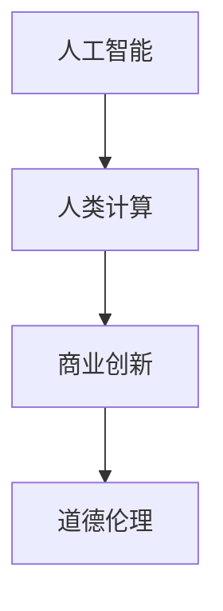

                 

# AI驱动的创新：人类计算在商业中的道德考虑因素与应用趋势

> 关键词：人工智能, 人类计算, 商业创新, 道德伦理, 隐私保护, 公平性, 数据安全

## 1. 背景介绍

### 1.1 问题由来
随着人工智能(AI)技术的高速发展，AI驱动的商业创新已逐步渗透到各行各业。AI技术在提升业务效率、降低成本、创造新价值等方面展现出巨大潜力。然而，AI技术的广泛应用也带来了诸多道德和伦理问题，如隐私侵犯、算法偏见、数据安全等。

### 1.2 问题核心关键点
AI在商业创新中的应用需要从多个维度进行考量，其中最为关键的是如何在提升商业价值的同时，确保道德伦理的底线不被突破。具体来说，需要关注以下核心问题：

- **隐私保护**：如何确保用户数据的安全和隐私不被侵犯。
- **公平性**：AI模型是否能够公平、公正地处理所有用户。
- **数据安全**：如何防止数据泄露和滥用。
- **算法透明性**：模型的决策过程是否可解释，是否存在"黑箱"问题。
- **人类计算的边界**：AI何时应作为辅助工具，何时应完全取代人工。

### 1.3 问题研究意义
研究和探索AI在商业创新中的道德伦理问题，不仅对确保技术健康发展至关重要，而且能够为未来技术的可持续发展提供指导，进一步提升人类社会的福祉。

## 2. 核心概念与联系

### 2.1 核心概念概述

为了更好地理解AI驱动商业创新中的道德伦理问题，我们首先需要明确几个核心概念及其联系：

- **人工智能(AI)**：基于计算机算法和数据分析技术，模拟人类智能行为的系统。
- **人类计算**：指通过算法计算模拟人类认知和决策过程，使计算机能够理解和执行人类任务。
- **商业创新**：利用技术手段，改变和优化商业流程，提升运营效率，创造商业价值的过程。
- **道德伦理**：指导人类行为的道德准则，包括隐私保护、公平性、数据安全、透明性等方面。

这些概念之间的逻辑关系可以通过以下Mermaid流程图来展示：



这个流程图展示了大语言模型工作的核心概念及其之间的联系：

1. 人工智能是实现人类计算的基础，通过计算机算法和数据分析技术，模拟人类智能行为。
2. 人类计算是利用AI技术提升商业创新能力，通过算法计算模拟人类认知和决策过程，使计算机能够理解和执行人类任务。
3. 商业创新是利用AI技术改变和优化商业流程，提升运营效率，创造商业价值。
4. 道德伦理是指导AI应用的原则和规范，包括隐私保护、公平性、数据安全、透明性等方面。

这些概念共同构成了AI驱动商业创新的框架，需要在这几个维度进行综合考虑。

## 3. 核心算法原理 & 具体操作步骤
### 3.1 算法原理概述

AI在商业创新中的应用，主要依赖于算法驱动的计算和决策过程。这些算法通常基于数据训练，通过对大量历史数据进行分析，学习并预测未来行为。

基于监督学习的AI算法，通常包括数据预处理、模型训练、模型评估和部署等多个环节。以销售预测为例，其主要步骤如下：

1. **数据预处理**：清洗和处理原始销售数据，确保数据质量。
2. **模型训练**：利用历史销售数据训练AI模型，生成预测模型。
3. **模型评估**：使用测试数据评估模型性能，选择合适的参数和算法。
4. **模型部署**：将训练好的模型部署到生产环境，进行实时预测。

在具体实施时，需要关注以下几个关键点：

- **数据质量**：确保数据准确、完整、一致，避免因数据问题导致的模型错误。
- **模型泛化能力**：确保模型能够泛化到新数据，避免过拟合。
- **计算效率**：确保模型计算速度快，实时响应。

### 3.2 算法步骤详解

以销售预测为例，详细描述AI模型在商业创新中的实现步骤：

**Step 1: 数据准备**
- 收集历史销售数据，包括日期、产品名称、销量、价格等。
- 清洗数据，去除重复、错误和异常值，确保数据质量。
- 对数据进行标准化处理，便于模型训练。

**Step 2: 特征工程**
- 选择合适的特征，如销售日期、天气、节假日等，生成训练数据集。
- 对特征进行编码和归一化，转化为模型可以处理的数值类型。
- 生成时间序列数据，利用历史数据预测未来趋势。

**Step 3: 模型选择**
- 选择适合的算法，如线性回归、决策树、随机森林等。
- 训练模型，利用历史数据进行训练和调参。
- 评估模型，使用测试数据集验证模型性能。

**Step 4: 模型优化**
- 对模型进行优化，如增加正则化、调整学习率等，提高模型泛化能力。
- 使用集成方法，如Bagging、Boosting等，提升模型精度。
- 进行交叉验证，确保模型在不同数据集上的表现一致。

**Step 5: 模型部署**
- 将训练好的模型部署到生产环境，如AWS、阿里云等。
- 设置实时数据流，将新数据输入模型进行预测。
- 监控模型性能，确保模型在生产环境中的稳定性。

### 3.3 算法优缺点

AI在商业创新中的算法应用具有以下优点：
1. **高效性**：通过自动化数据分析，可以大幅提升业务效率，降低人力成本。
2. **精准性**：利用大数据和算法技术，可以提升预测和决策的准确性。
3. **可扩展性**：AI模型可以随时更新和优化，适应不断变化的商业环境。

但同时，这些算法也存在一些局限性：
1. **数据依赖**：模型依赖于高质量的数据，数据问题可能导致模型错误。
2. **透明性不足**：许多AI模型是"黑箱"系统，难以解释决策过程。
3. **偏见问题**：算法可能继承训练数据的偏见，导致不公正的决策。
4. **安全性风险**：模型可能被恶意攻击，导致数据泄露和滥用。

### 3.4 算法应用领域

AI在商业创新中的应用领域广泛，涵盖金融、医疗、零售、制造等多个行业。具体来说：

- **金融行业**：利用AI进行风险评估、信用评分、欺诈检测等。
- **医疗行业**：利用AI进行疾病预测、影像诊断、个性化治疗等。
- **零售行业**：利用AI进行销售预测、库存管理、客户推荐等。
- **制造行业**：利用AI进行质量控制、设备维护、供应链优化等。

这些应用不仅提升了业务效率和精度，还带来了全新的商业价值。

## 4. 数学模型和公式 & 详细讲解 & 举例说明

### 4.1 数学模型构建

以销售预测为例，建立一个简单的线性回归模型。假设销售量 $y$ 与日期 $x$ 之间的关系为：

$$
y = \beta_0 + \beta_1 x + \epsilon
$$

其中，$x$ 为日期，$\beta_0$ 为截距，$\beta_1$ 为斜率，$\epsilon$ 为随机误差项。

### 4.2 公式推导过程

通过最小二乘法，求解 $\beta_0$ 和 $\beta_1$ 的值。假设已知 $n$ 个历史数据点 $(x_i, y_i)$，则有：

$$
\hat{\beta} = \mathop{\arg\min}_{\beta} \sum_{i=1}^n (y_i - (\beta_0 + \beta_1 x_i))^2
$$

根据最小二乘法的求解公式，得到：

$$
\hat{\beta_0} = \frac{\sum_{i=1}^n x_i y_i - n \overline{x} \overline{y}}{\sum_{i=1}^n x_i^2 - n \overline{x}^2}
$$

$$
\hat{\beta_1} = \frac{\sum_{i=1}^n y_i - n \overline{y}}{\sum_{i=1}^n x_i^2 - n \overline{x}^2}
$$

其中 $\overline{x} = \frac{1}{n} \sum_{i=1}^n x_i$，$\overline{y} = \frac{1}{n} \sum_{i=1}^n y_i$。

### 4.3 案例分析与讲解

以某电商平台的销售预测为例，使用上述线性回归模型进行分析和预测。假设已知日期 $x$ 和销售量 $y$ 的历史数据，如表所示：

| 日期       | 销售量 | 日期       | 销售量 | ...  |
|------------|--------|------------|--------|-------|

首先，对数据进行标准化处理，生成训练数据集。然后，利用最小二乘法求解 $\beta_0$ 和 $\beta_1$ 的值，得到线性回归模型。最后，使用测试数据进行验证，计算模型的预测误差。

## 5. 项目实践：代码实例和详细解释说明
### 5.1 开发环境搭建

在进行项目实践前，我们需要准备好开发环境。以下是使用Python进行Scikit-Learn开发的开发环境配置流程：

1. 安装Anaconda：从官网下载并安装Anaconda，用于创建独立的Python环境。

2. 创建并激活虚拟环境：
```bash
conda create -n pyenv python=3.8 
conda activate pyenv
```

3. 安装Scikit-Learn：
```bash
pip install scikit-learn
```

4. 安装各类工具包：
```bash
pip install numpy pandas scikit-learn matplotlib tqdm jupyter notebook ipython
```

完成上述步骤后，即可在`pyenv`环境中开始项目实践。

### 5.2 源代码详细实现

以下是使用Scikit-Learn进行销售预测的完整代码实现：

```python
import numpy as np
from sklearn.linear_model import LinearRegression
from sklearn.model_selection import train_test_split
from sklearn.metrics import mean_squared_error

# 读取历史销售数据
data = np.loadtxt('sales_data.csv', delimiter=',', skiprows=1)

# 将日期转换为数值型
data[:, 0] = np.arange(len(data))

# 划分训练集和测试集
X_train, X_test, y_train, y_test = train_test_split(data[:, 0], data[:, 1], test_size=0.2, random_state=42)

# 创建线性回归模型
model = LinearRegression()

# 训练模型
model.fit(X_train, y_train)

# 预测测试集
y_pred = model.predict(X_test)

# 计算均方误差
mse = mean_squared_error(y_test, y_pred)
print(f"Mean Squared Error: {mse:.2f}")
```

### 5.3 代码解读与分析

让我们再详细解读一下关键代码的实现细节：

**数据处理**：
- 使用`numpy.loadtxt`读取历史销售数据，将其存储为数组。
- 将日期转换为数值型，方便模型训练。
- 使用`train_test_split`将数据划分为训练集和测试集，设置测试集占比为20%。

**模型训练**：
- 创建线性回归模型，利用`fit`方法训练模型。
- 使用测试集进行预测，得到预测结果。

**性能评估**：
- 计算预测结果与真实结果的均方误差，评估模型性能。

可以看到，Scikit-Learn提供了简单易用的API，使得销售预测的代码实现变得简洁高效。开发者可以将更多精力放在数据处理、模型改进等高层逻辑上，而不必过多关注底层的实现细节。

当然，工业级的系统实现还需考虑更多因素，如模型的保存和部署、超参数的自动搜索、更灵活的任务适配层等。但核心的销售预测流程基本与此类似。

## 6. 实际应用场景
### 6.1 智能客服系统

基于AI驱动的智能客服系统，可以应用于电商、金融、医疗等多个领域。通过语音识别和自然语言处理技术，智能客服能够自动解答用户咨询，提供个性化服务。

在技术实现上，可以收集用户的历史咨询记录，提取问题和最佳答复，训练AI模型进行预测和生成。模型可以对新用户咨询进行自然语言理解，匹配最合适的答复模板，并动态生成回答。

### 6.2 金融风控系统

AI驱动的金融风控系统，可以应用于信用评分、欺诈检测、风险评估等环节。利用大数据和算法技术，AI模型能够实时分析用户行为数据，预测风险，提前预警。

在技术实现上，可以收集用户的历史行为数据，包括信用卡使用、贷款申请、转账记录等，训练AI模型进行预测和评估。模型可以对新用户的行为进行实时分析，识别出潜在的欺诈和风险，提升金融系统的安全性和稳定性。

### 6.3 零售个性化推荐

AI驱动的个性化推荐系统，可以应用于电商、视频、音乐等多个领域。通过分析用户的行为数据，AI模型能够推荐用户感兴趣的内容和商品，提升用户体验。

在技术实现上，可以收集用户的历史浏览、购买、评分等数据，训练AI模型进行预测和推荐。模型可以实时分析用户行为，动态调整推荐结果，提升推荐的精准度和多样性。

### 6.4 未来应用展望

随着AI技术的发展，基于AI驱动的商业创新将呈现以下几个趋势：

1. **智能化水平提升**：未来AI模型将更加精准、高效，能够处理更复杂的业务场景，提供更优质的服务。
2. **数据质量提升**：通过AI技术提升数据收集和处理能力，确保数据的准确性和完整性。
3. **隐私保护加强**：AI技术将更加注重隐私保护，确保用户数据的安全和隐私。
4. **公平性提升**：AI模型将更加公平、公正，避免算法偏见，提升决策的公平性。
5. **人机协同增强**：未来AI将作为人类计算的辅助工具，增强人机协同能力，提升工作效率和决策质量。

以上趋势凸显了AI驱动商业创新的广阔前景。这些方向的探索发展，必将进一步提升AI系统的性能和应用范围，为人类社会的全面数字化转型提供新的动力。

## 7. 工具和资源推荐
### 7.1 学习资源推荐

为了帮助开发者系统掌握AI驱动商业创新的理论基础和实践技巧，这里推荐一些优质的学习资源：

1. 《机器学习实战》：吴恩达著，介绍了机器学习和数据科学的基本概念和实现方法。
2. 《深度学习入门：基于Python的理论与实现》：斋藤康毅著，介绍了深度学习的基本理论和Python实现。
3. 《AI驱动的商业创新》课程：由各大名校开设的在线课程，涵盖AI在商业创新中的应用案例和实践技巧。
4. 《AI道德与法律》书籍：介绍了AI伦理和法律的基本框架，帮助开发者理解AI应用中的道德和法律问题。

通过对这些资源的学习实践，相信你一定能够快速掌握AI驱动商业创新的精髓，并用于解决实际的商业问题。

### 7.2 开发工具推荐

高效的开发离不开优秀的工具支持。以下是几款用于AI驱动商业创新开发的常用工具：

1. Scikit-Learn：基于Python的机器学习库，提供了丰富的机器学习算法和工具。
2. TensorFlow：由Google主导开发的深度学习框架，支持大规模模型训练和部署。
3. PyTorch：基于Python的深度学习框架，提供了灵活的计算图和自动微分功能。
4. HuggingFace Transformers库：提供了多种预训练语言模型，方便开发者进行任务适配和微调。
5. TensorBoard：TensorFlow配套的可视化工具，可实时监测模型训练状态，提供丰富的图表呈现方式。

合理利用这些工具，可以显著提升AI驱动商业创新的开发效率，加快创新迭代的步伐。

### 7.3 相关论文推荐

AI驱动商业创新领域的研究涉及多个子领域，以下是几篇奠基性的相关论文，推荐阅读：

1. "Sales Forecasting with Machine Learning"（基于机器学习的销售预测）：介绍了机器学习在销售预测中的应用。
2. "Personalized Recommendation Systems"（个性化推荐系统）：介绍了个性化推荐的基本理论和实现方法。
3. "Deep Learning for Natural Language Processing"（深度学习在自然语言处理中的应用）：介绍了深度学习在自然语言处理中的应用，包括语言模型、序列标注等。
4. "AI in Healthcare"（AI在医疗领域的应用）：介绍了AI在医疗诊断、治疗、管理等方面的应用。

这些论文代表了大语言模型微调技术的发展脉络。通过学习这些前沿成果，可以帮助研究者把握学科前进方向，激发更多的创新灵感。

## 8. 总结：未来发展趋势与挑战
### 8.1 总结

本文对AI驱动商业创新的道德伦理问题进行了全面系统的介绍。首先阐述了AI驱动商业创新的背景和意义，明确了道德伦理在其中的重要地位。其次，从原理到实践，详细讲解了AI模型在商业创新中的实现步骤，给出了具体案例分析。同时，本文还广泛探讨了AI模型在落地部署时的关键技术和挑战。

通过本文的系统梳理，可以看到，AI驱动的商业创新在提升业务效率和创造商业价值的同时，也需要关注道德伦理的底线。只有在遵循道德伦理的前提下，AI技术才能健康、可持续地发展，为人类社会带来更多的福祉。

### 8.2 未来发展趋势

展望未来，AI驱动的商业创新将呈现以下几个发展趋势：

1. **智能化水平提升**：未来AI模型将更加精准、高效，能够处理更复杂的业务场景，提供更优质的服务。
2. **数据质量提升**：通过AI技术提升数据收集和处理能力，确保数据的准确性和完整性。
3. **隐私保护加强**：AI技术将更加注重隐私保护，确保用户数据的安全和隐私。
4. **公平性提升**：AI模型将更加公平、公正，避免算法偏见，提升决策的公平性。
5. **人机协同增强**：未来AI将作为人类计算的辅助工具，增强人机协同能力，提升工作效率和决策质量。

以上趋势凸显了AI驱动商业创新的广阔前景。这些方向的探索发展，必将进一步提升AI系统的性能和应用范围，为人类社会的全面数字化转型提供新的动力。

### 8.3 面临的挑战

尽管AI驱动的商业创新已经取得了瞩目成就，但在迈向更加智能化、普适化应用的过程中，它仍面临诸多挑战：

1. **数据依赖**：模型依赖于高质量的数据，数据问题可能导致模型错误。
2. **透明性不足**：许多AI模型是"黑箱"系统，难以解释决策过程。
3. **偏见问题**：算法可能继承训练数据的偏见，导致不公正的决策。
4. **安全性风险**：模型可能被恶意攻击，导致数据泄露和滥用。
5. **伦理道德问题**：AI技术的应用需要遵守伦理道德规范，避免道德风险。

### 8.4 研究展望

面对AI驱动商业创新所面临的挑战，未来的研究需要在以下几个方面寻求新的突破：

1. **数据采集与处理**：提升数据收集和处理能力，确保数据的准确性和完整性。
2. **算法透明性**：研究可解释性算法，提升模型透明性，避免"黑箱"问题。
3. **公平性优化**：开发公平性算法，避免算法偏见，提升决策的公平性。
4. **安全性保障**：研究安全性技术，确保模型抗攻击能力，避免数据泄露和滥用。
5. **伦理道德规范**：研究伦理道德规范，确保AI技术的应用符合社会价值和伦理标准。

这些研究方向的探索，必将引领AI驱动商业创新的技术进步，为构建更加智能、安全、公平的AI系统铺平道路。面向未来，我们需要在技术创新和伦理道德之间找到平衡，共同推动AI技术的健康发展。

## 9. 附录：常见问题与解答

**Q1：AI驱动的商业创新是否适用于所有商业场景？**

A: AI驱动的商业创新在提升业务效率和创造商业价值方面具有广泛的应用前景，但并不适用于所有商业场景。对于一些需要高度人工介入和决策的场景，如艺术创作、法律咨询等，AI仍需作为辅助工具，而非完全取代人工。

**Q2：AI驱动的商业创新如何确保数据安全？**

A: 数据安全是AI驱动商业创新中的重要问题。主要措施包括：
1. 数据加密：对敏感数据进行加密处理，防止数据泄露。
2. 访问控制：设置严格的访问权限，确保只有授权人员可以访问数据。
3. 数据匿名化：对用户数据进行匿名化处理，保护用户隐私。
4. 安全审计：定期进行安全审计，发现和修复潜在的安全漏洞。

**Q3：AI驱动的商业创新如何避免算法偏见？**

A: 算法偏见是AI模型中的一个重要问题。主要措施包括：
1. 数据多样化：确保训练数据的多样性，避免数据集偏倚。
2. 公平性算法：开发公平性算法，避免算法偏见。
3. 模型监控：定期监控模型性能，发现和修正算法偏见。
4. 公开透明：将模型训练过程和结果公开透明，接受社会监督。

**Q4：AI驱动的商业创新如何提升决策公平性？**

A: 提升决策公平性是AI驱动商业创新中的重要目标。主要措施包括：
1. 多样性数据：确保训练数据的多样性，避免数据集偏倚。
2. 公平性算法：开发公平性算法，避免算法偏见。
3. 公开透明：将模型训练过程和结果公开透明，接受社会监督。
4. 人机协同：将AI作为辅助工具，避免完全依赖算法决策。

**Q5：AI驱动的商业创新如何提升人机协同能力？**

A: 提升人机协同能力是AI驱动商业创新的重要目标。主要措施包括：
1. 用户反馈：将用户反馈纳入模型训练，提升模型的适应性。
2. 人工干预：在关键决策环节，引入人工干预，确保决策的合理性和公正性。
3. 透明性：提升模型的透明性，使用户能够理解和信任AI决策。
4. 多模态融合：结合多模态数据，提升模型的综合判断能力。

通过这些措施，AI驱动的商业创新可以在提升业务效率和创造商业价值的同时，确保道德伦理的底线不被突破，为人类社会的全面数字化转型提供新的动力。

---

作者：禅与计算机程序设计艺术 / Zen and the Art of Computer Programming

