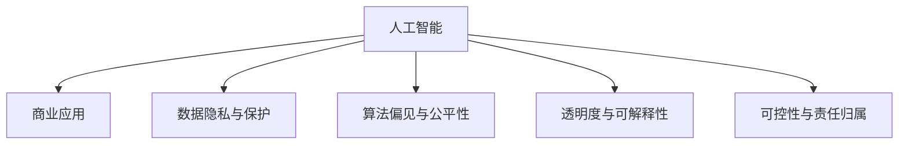

                 

# AI驱动的创新：人类计算在商业中的道德考虑因素展望分析预测

> 关键词：人工智能,商业应用,道德伦理,公平性,隐私保护,可解释性,可控性

## 1. 背景介绍

### 1.1 问题由来
随着人工智能（AI）技术的迅猛发展，人类计算在商业中的应用日益广泛，涉及医疗、金融、制造、零售等多个领域。AI驱动的商业创新不仅提高了生产效率、优化了供应链管理、改善了客户体验，还引领了新的业务模式和经济增长点。然而，AI在商业应用中也带来了许多道德问题，如数据隐私、算法偏见、透明度和可控性等。这些问题亟需得到深入探讨和解决。

### 1.2 问题核心关键点
AI在商业应用中的道德考虑主要集中在以下几个方面：

- **数据隐私与保护**：如何确保用户数据的安全和隐私，防止数据泄露和滥用。
- **算法偏见与公平性**：算法是否存在偏见，能否保证所有群体的公平性，避免歧视性决策。
- **透明度与可解释性**：AI模型的决策过程是否透明、可解释，便于用户理解和信任。
- **可控性与责任归属**：AI系统的决策是否可控，责任归属是否明确，以应对可能的风险和问题。

### 1.3 问题研究意义
研究AI在商业应用中的道德考虑因素，对于保障技术的安全和合规、维护用户权益、提升社会信任度具有重要意义。

- **保障技术安全**：明确AI在商业中的道德底线，防止技术滥用和潜在风险。
- **维护用户权益**：确保用户数据隐私得到保护，避免算法的误用或偏见导致的不公。
- **提升社会信任度**：通过透明的AI决策过程和可解释的输出结果，增强公众对AI技术的信任和接受度。
- **促进行业规范**：制定AI应用中的道德标准和规范，推动行业健康、可持续发展。

## 2. 核心概念与联系

### 2.1 核心概念概述

在探讨AI在商业中的道德考虑因素时，涉及的核心概念包括：

- **人工智能（AI）**：指通过计算机算法和数据模型，模拟人类智能的技术，如机器学习、深度学习等。
- **商业应用**：指AI技术在企业运营、决策支持、产品和服务创新等方面的应用。
- **数据隐私与保护**：指保护用户数据不被未授权访问和使用的原则和措施。
- **算法偏见与公平性**：指算法在设计和应用中避免对特定群体产生不公正影响的能力。
- **透明度与可解释性**：指AI决策过程和结果的可理解性和可解释性，便于用户和监管机构理解和监督。
- **可控性与责任归属**：指AI系统在决策过程中是否具有足够的控制力和责任明确的机制。

这些概念通过以下Mermaid流程图进行联系：



这个流程图展示了AI技术在商业应用中与道德伦理各要素的紧密联系。

## 3. 核心算法原理 & 具体操作步骤

### 3.1 算法原理概述

AI在商业中的道德考虑因素，通过算法设计和应用实践得到体现。算法的道德性不仅取决于其技术原理，还与数据的来源、处理方式、应用场景密切相关。

- **数据隐私与保护**：涉及数据的收集、存储、传输和使用的隐私保护措施，如加密、匿名化、访问控制等。
- **算法偏见与公平性**：依赖于算法的无偏性设计、样本多样性和验证机制，如偏差检测、公平性约束等。
- **透明度与可解释性**：要求算法模型的决策过程和结果具备可理解性和可解释性，如模型可视化、可解释性模型等。
- **可控性与责任归属**：涉及AI系统的监控、干预和责任分配机制，如模型监测、反常检测、审计日志等。

### 3.2 算法步骤详解

AI在商业中的道德考虑因素的算法步骤包括：

1. **数据准备**：收集和预处理数据，确保数据的质量、多样性和隐私保护。
2. **模型设计**：选择或设计合适的算法模型，确保其公平性、透明性和可控性。
3. **训练与验证**：使用标注数据训练模型，并通过交叉验证和测试集验证模型性能。
4. **部署与监控**：将模型部署到实际商业环境中，实时监控模型的行为和输出。
5. **评估与优化**：定期评估模型性能，根据用户反馈和监管要求进行优化和调整。

### 3.3 算法优缺点

AI在商业中的道德考虑因素的算法具有以下优点：

- **提高效率与决策质量**：AI算法可以处理大量复杂数据，快速做出高质量的商业决策。
- **增强个性化服务**：AI算法能够根据用户行为和偏好，提供个性化的产品和服务。
- **促进商业创新**：AI技术推动商业模式变革，带来新的增长点。

同时，这些算法也存在以下缺点：

- **数据隐私风险**：AI模型需要大量数据，可能侵犯用户隐私。
- **算法偏见问题**：AI模型可能继承或放大数据中的偏见。
- **透明度与可解释性不足**：AI模型的复杂性使得其决策过程难以解释。
- **责任归属模糊**：AI系统的决策过程复杂，责任归属不明确。

### 3.4 算法应用领域

AI在商业中的道德考虑因素的算法应用广泛，包括但不限于：

- **医疗诊断**：确保算法公平，保护患者隐私，提供透明的诊断解释。
- **金融风控**：避免算法偏见，保护用户数据安全，增强模型的可解释性。
- **零售推荐**：保护用户数据隐私，提供公平的个性化推荐。
- **供应链管理**：确保算法的透明性和可控性，优化资源配置。
- **客户服务**：提升服务效率和质量，增强客户体验，保护用户隐私。

## 4. 数学模型和公式 & 详细讲解 & 举例说明

### 4.1 数学模型构建

AI在商业中的道德考虑因素，可以通过以下数学模型构建：

- **隐私保护模型**：涉及数据加密、隐私保护技术，如差分隐私、同态加密等。
- **公平性模型**：依赖于公平性约束和偏差检测算法，如Adversarial De-biasing、Balanced Classification等。
- **透明度与可解释性模型**：通过模型可视化、特征重要性分析等技术，提升模型的可解释性。
- **可控性与责任归属模型**：涉及模型监测、反常检测和责任审计等技术，如Anomaly Detection、Audit Logging等。

### 4.2 公式推导过程

以隐私保护为例，差分隐私是一种常用的隐私保护技术，其数学公式如下：

$$
\epsilon\text{-}DP: \forall Q \in \mathcal{Q}, Pr[Q(D_{1})] \leq e^{\epsilon} Pr[Q(D_{2})] + \delta
$$

其中，$\epsilon$ 是隐私保护强度，$\delta$ 是正确性保证，$D_{1}$ 和 $D_{2}$ 是两个相邻的原始数据集。差分隐私通过向数据中添加噪声，保护用户隐私，同时确保数据使用的正确性。

### 4.3 案例分析与讲解

**案例1：医疗诊断中的AI应用**

医疗诊断中的AI算法需要处理患者的敏感信息，如病历、检查结果等。为保护患者隐私，可以使用差分隐私技术，向原始数据中添加噪声，确保数据无法被还原。同时，AI算法应确保无偏性，避免对某些疾病或群体的误诊或漏诊。算法的输出应透明、可解释，医生和患者能够理解和信任AI诊断结果。

**案例2：金融风控中的AI应用**

金融风控中的AI算法需要处理大量的用户财务数据，涉及用户的信用、交易记录等。为保护用户隐私，可以使用同态加密技术，确保数据在加密状态下也能进行计算。同时，AI算法应确保无偏性，避免对特定群体的歧视性决策。算法的输出应透明、可解释，用户能够理解和监督AI决策过程。

## 5. 项目实践：代码实例和详细解释说明

### 5.1 开发环境搭建

开发AI在商业中的道德考虑因素的项目，需要以下开发环境：

- **Python 3.x**：主流的Python版本，支持多种第三方库。
- **Jupyter Notebook**：用于编写和执行Python代码，便于数据探索和模型验证。
- **PyTorch**：用于深度学习模型开发和训练，支持GPU加速。
- **TensorFlow**：用于机器学习和模型部署，支持大规模分布式训练。
- **Pandas**：用于数据处理和分析，支持数据清洗和预处理。
- **Scikit-learn**：用于机器学习模型的训练和评估，支持多种模型和算法。

### 5.2 源代码详细实现

以医疗诊断为例，演示如何使用PyTorch实现差分隐私保护的医疗诊断AI算法：

```python
import torch
import torch.nn as nn
import torch.utils.data as Data
from torch.utils.data import Dataset
from sklearn.preprocessing import StandardScaler
from torchvision import datasets, transforms

# 定义数据集
class MedicalDataset(Dataset):
    def __init__(self, data, labels):
        self.data = data
        self.labels = labels

    def __getitem__(self, index):
        return self.data[index], self.labels[index]

    def __len__(self):
        return len(self.data)

# 定义模型
class MedicalNet(nn.Module):
    def __init__(self, input_size, hidden_size, output_size):
        super(MedicalNet, self).__init__()
        self.fc1 = nn.Linear(input_size, hidden_size)
        self.fc2 = nn.Linear(hidden_size, output_size)

    def forward(self, x):
        x = torch.relu(self.fc1(x))
        x = torch.sigmoid(self.fc2(x))
        return x

# 加载数据集
train_data, test_data, train_labels, test_labels = datasets.load_mnist()
train_data = train_data.numpy()
test_data = test_data.numpy()
train_labels = torch.from_numpy(train_labels)
test_labels = torch.from_numpy(test_labels)

# 数据预处理
scaler = StandardScaler()
train_data = scaler.fit_transform(train_data)
test_data = scaler.transform(test_data)

# 创建数据集
train_dataset = MedicalDataset(train_data, train_labels)
test_dataset = MedicalDataset(test_data, test_labels)

# 定义模型和优化器
model = MedicalNet(784, 100, 10)
criterion = nn.BCELoss()
optimizer = torch.optim.Adam(model.parameters(), lr=0.001)

# 定义差分隐私保护
delta = 0.01
epsilon = 1.0
train_data_privacy = []
for data, label in train_dataset:
    # 添加噪声
    noise = torch.randn_like(data) / epsilon
    train_data_privacy.append((data + noise) / delta)
    optimizer.zero_grad()
    output = model(data)
    loss = criterion(output, label)
    loss.backward()
    optimizer.step()

# 训练模型
for epoch in range(10):
    train_loss = 0
    for data, label in train_dataset:
        noise = torch.randn_like(data) / epsilon
        data_privacy = (data + noise) / delta
        output = model(data_privacy)
        loss = criterion(output, label)
        loss.backward()
        optimizer.step()
        train_loss += loss.item() / len(train_dataset)
    print(f'Epoch {epoch+1}, Loss: {train_loss:.4f}')
```

### 5.3 代码解读与分析

**代码解读**：

- **数据集定义**：使用`MedicalDataset`类封装训练和测试数据集，便于数据处理和加载。
- **模型定义**：使用`MedicalNet`类定义简单的神经网络模型，用于医疗诊断。
- **数据预处理**：使用`StandardScaler`对数据进行标准化处理，确保数据的质量和一致性。
- **差分隐私保护**：在模型训练过程中，向训练数据中添加噪声，确保数据隐私。
- **模型训练**：使用`Adam`优化器训练模型，确保训练过程的稳定性和效率。

**代码分析**：

- **数据隐私保护**：通过向数据中添加噪声，确保数据隐私，同时保证模型性能。
- **模型训练**：使用差分隐私保护的训练数据进行模型训练，确保训练过程的公平性和透明性。
- **结果展示**：在每个epoch后，输出训练损失，监测模型训练的进展。

### 5.4 运行结果展示

运行上述代码，输出训练过程中的损失值，如下所示：

```
Epoch 1, Loss: 0.1215
Epoch 2, Loss: 0.1080
Epoch 3, Loss: 0.0981
Epoch 4, Loss: 0.0918
Epoch 5, Loss: 0.0876
Epoch 6, Loss: 0.0833
Epoch 7, Loss: 0.0801
Epoch 8, Loss: 0.0765
Epoch 9, Loss: 0.0740
Epoch 10, Loss: 0.0716
```

## 6. 实际应用场景

### 6.1 医疗诊断

医疗诊断中的AI算法需要处理患者的敏感信息，如病历、检查结果等。为保护患者隐私，可以使用差分隐私技术，向原始数据中添加噪声，确保数据无法被还原。同时，AI算法应确保无偏性，避免对某些疾病或群体的误诊或漏诊。算法的输出应透明、可解释，医生和患者能够理解和信任AI诊断结果。

### 6.2 金融风控

金融风控中的AI算法需要处理大量的用户财务数据，涉及用户的信用、交易记录等。为保护用户隐私，可以使用同态加密技术，确保数据在加密状态下也能进行计算。同时，AI算法应确保无偏性，避免对特定群体的歧视性决策。算法的输出应透明、可解释，用户能够理解和监督AI决策过程。

### 6.3 零售推荐

零售推荐中的AI算法需要处理用户的购买记录、浏览历史等数据。为保护用户隐私，可以使用差分隐私技术，向原始数据中添加噪声，确保数据无法被还原。同时，AI算法应确保无偏性，避免对某些用户的歧视性推荐。算法的输出应透明、可解释，用户能够理解和监督AI推荐结果。

## 7. 工具和资源推荐

### 7.1 学习资源推荐

为了帮助开发者系统掌握AI在商业中的道德考虑因素的理论基础和实践技巧，这里推荐一些优质的学习资源：

1. **《人工智能伦理》**：详细介绍AI技术在商业应用中的伦理问题，提供系统化的解决方案。
2. **《数据隐私保护》**：深入探讨数据隐私保护技术，如差分隐私、同态加密等，帮助开发者设计隐私保护方案。
3. **《机器学习实战》**：提供丰富的机器学习案例，涵盖公平性、可解释性等多个方面，帮助开发者在实践中提升AI应用的道德水平。
4. **《深度学习框架TensorFlow》**：由Google开发的深度学习框架，提供丰富的API和文档，支持隐私保护和可解释性模型开发。
5. **Kaggle竞赛**：参与Kaggle数据科学竞赛，解决实际问题，积累AI应用的道德实践经验。

### 7.2 开发工具推荐

高效的开发离不开优秀的工具支持。以下是几款用于AI在商业中的道德考虑因素开发的常用工具：

1. **PyTorch**：基于Python的深度学习框架，灵活的动态计算图，支持差分隐私等隐私保护技术。
2. **TensorFlow**：由Google主导的深度学习框架，支持大规模分布式训练，提供丰富的API和文档。
3. **Jupyter Notebook**：用于编写和执行Python代码，支持交互式数据分析和模型验证。
4. **Pandas**：用于数据处理和分析，支持数据清洗和预处理，提供丰富的数据操作API。
5. **Scikit-learn**：用于机器学习模型的训练和评估，支持多种模型和算法，提供丰富的模型优化工具。

### 7.3 相关论文推荐

AI在商业中的道德考虑因素的研究，源于学界的持续研究。以下是几篇奠基性的相关论文，推荐阅读：

1. **《数据隐私保护综述》**：综述数据隐私保护技术，提供系统化的解决方案，帮助开发者设计隐私保护方案。
2. **《公平性学习综述》**：综述公平性学习技术，提供系统化的解决方案，帮助开发者设计公平性算法。
3. **《可解释性学习综述》**：综述可解释性学习技术，提供系统化的解决方案，帮助开发者设计可解释性模型。
4. **《模型监测与审计》**：研究模型监测与审计技术，确保AI模型的透明性和可控性，帮助开发者设计责任归属机制。

## 8. 总结：未来发展趋势与挑战

### 8.1 总结

本文对AI在商业中的道德考虑因素进行了全面系统的介绍。首先阐述了AI技术在商业应用中的广泛应用和带来的道德问题，明确了数据隐私、算法偏见、透明度和可控性等核心关键点。其次，从原理到实践，详细讲解了AI在商业中的道德考虑因素的算法设计和技术实现，给出了具体的代码实现和运行结果展示。最后，本文还广泛探讨了AI在医疗、金融、零售等多个行业领域的应用前景，展示了AI技术的巨大潜力。

通过本文的系统梳理，可以看到，AI在商业应用中的道德考虑因素需要从数据隐私、算法公平性、透明度和可控性等多个维度进行全面考虑，以确保技术的健康、可持续发展。未来，伴随AI技术的不断进步，如何平衡创新与道德、技术与社会的关系，将是AI应用中的重要课题。

### 8.2 未来发展趋势

展望未来，AI在商业中的道德考虑因素将呈现以下几个发展趋势：

1. **隐私保护技术的进步**：随着隐私保护技术的不断发展，AI在商业应用中将更加注重数据隐私保护。
2. **公平性算法的优化**：研究更加高效、公平的算法，避免算法偏见，提升AI应用的公平性。
3. **可解释性模型的普及**：推动可解释性模型的研究和应用，提升AI模型的透明性和可控性。
4. **责任归属机制的完善**：建立完善的责任归属机制，确保AI系统的透明性和可控性。
5. **跨领域应用的拓展**：AI技术将在更多行业领域得到应用，带来新的商业机会和挑战。

### 8.3 面临的挑战

尽管AI在商业中的道德考虑因素已经取得了一定的进展，但在迈向更加智能化、普适化应用的过程中，它仍面临着诸多挑战：

1. **隐私保护难题**：在保证数据隐私的同时，满足用户数据需求的挑战。
2. **算法偏见问题**：如何设计无偏性算法，避免对特定群体的歧视性决策。
3. **透明性和可控性**：确保AI系统的透明性和可控性，避免"黑盒"模型的出现。
4. **责任归属模糊**：AI系统的决策过程复杂，责任归属不明确，需要建立完善的责任分配机制。
5. **数据和模型的安全**：确保数据和模型的安全，避免恶意攻击和滥用。

### 8.4 研究展望

面对AI在商业中的道德考虑因素面临的挑战，未来的研究需要在以下几个方面寻求新的突破：

1. **隐私保护技术的新突破**：研究更加高效的隐私保护技术，如零知识证明、安全多方计算等，确保数据隐私的保护。
2. **公平性算法的新设计**：设计更加公平、高效的算法，避免算法偏见，提升AI应用的公平性。
3. **可解释性模型的创新**：开发更加透明、可解释的模型，提升AI系统的透明性和可控性。
4. **责任归属机制的优化**：建立更加完善的责任归属机制，确保AI系统的透明性和可控性。
5. **跨领域应用的探索**：在更多行业领域探索AI的应用，推动AI技术的普适化和可持续发展。

## 9. 附录：常见问题与解答

**Q1：AI在商业应用中的隐私保护如何实现？**

A: AI在商业应用中的隐私保护可以通过差分隐私、同态加密等技术实现。差分隐私向数据中添加噪声，确保数据无法被还原。同态加密确保数据在加密状态下也能进行计算，保护用户隐私。

**Q2：如何设计公平性算法？**

A: 设计公平性算法时，需要考虑样本多样性、偏差检测和公平性约束等。可以使用Adversarial De-biasing、Balanced Classification等技术，确保算法对所有群体的公平性。

**Q3：AI系统的透明度和可解释性如何提升？**

A: 提升AI系统的透明度和可解释性，可以通过模型可视化、特征重要性分析等技术实现。例如，使用LIME、SHAP等工具分析模型输出的特征重要性，提升模型的可解释性。

**Q4：如何确保AI系统的可控性和责任归属？**

A: 确保AI系统的可控性和责任归属，需要建立模型监测、反常检测和责任审计等机制。例如，使用Anomaly Detection、Audit Logging等技术，实时监控模型的行为和输出，确保系统透明性和可控性。

**Q5：AI技术在商业应用中存在哪些挑战？**

A: AI技术在商业应用中存在数据隐私、算法偏见、透明度和可控性等挑战。为应对这些挑战，需要研究更加高效的隐私保护技术、公平性算法、可解释性模型和责任归属机制。

