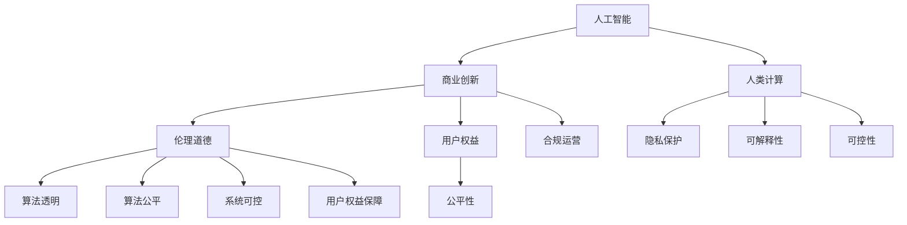
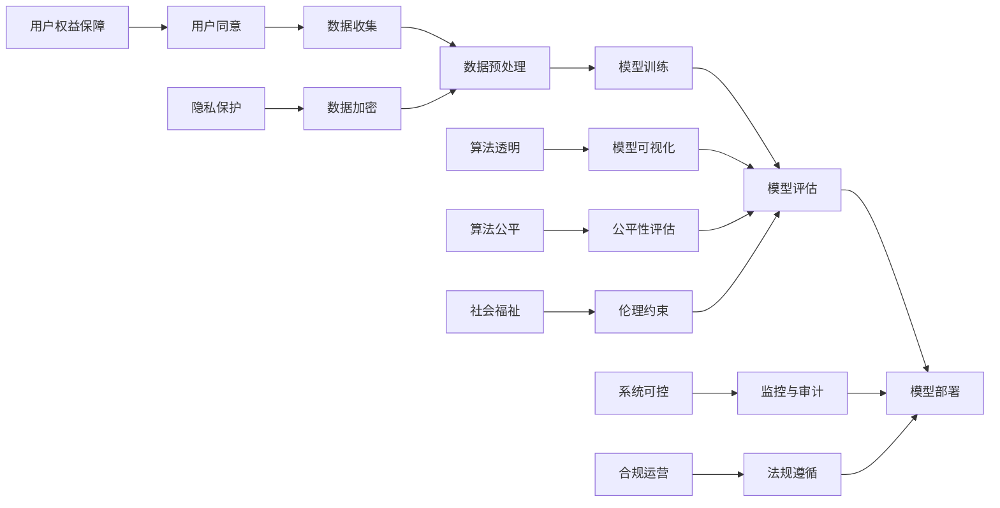

                 

# AI驱动的创新：人类计算在商业中的道德考虑因素展望挑战

> 关键词：人工智能,人类计算,商业创新,道德伦理,隐私保护,可解释性,可控性

## 1. 背景介绍

### 1.1 问题由来

随着人工智能(AI)技术的不断进步，尤其是深度学习和大数据技术的应用，AI在商业中的作用越来越显著。AI驱动的商业创新带来了巨大的经济效益，但也带来了诸如隐私侵犯、算法歧视、决策不透明等问题，引发了广泛的社会关注。如何在商业创新中兼顾技术进步与社会伦理，成为当前科技界和商业界共同面临的重大挑战。

### 1.2 问题核心关键点

AI技术在商业中的应用，涉及数据获取、算法设计、模型训练、应用部署等环节，每一个环节都可能产生伦理问题。这些问题包括但不限于：

- **数据隐私**：商业应用中大量依赖于用户数据，如何在数据收集、存储、使用过程中保护用户隐私，是一个亟待解决的难题。
- **算法透明**：商业决策模型的复杂性使得模型的内部机制难以解释，如何提升模型的透明性和可解释性，以建立用户和企业的信任关系，是另一个关键问题。
- **算法公平性**：算法模型的决策可能受到训练数据的不均衡性影响，如何消除偏见，确保模型在处理不同用户时具有公平性，是确保商业应用的广泛性和公正性的基础。
- **系统可控性**：商业AI应用往往与业务决策紧密相关，如何确保AI系统的可控性和可解释性，避免意外或恶意行为，是确保商业应用稳定性的必要条件。
- **用户权益保障**：在商业应用中，用户数据的使用和AI系统的决策对用户权益产生影响，如何在AI驱动的商业创新中，充分保障用户权益，是构建可持续商业模式的必要前提。

### 1.3 问题研究意义

探索和解决AI在商业创新中的伦理问题，对于推动AI技术健康、可持续发展，构建公平、透明、可信的商业环境，具有重要意义：

- **提升用户信任**：通过解决伦理问题，可以增强用户对AI技术的信任，提升AI驱动商业应用的接受度和普及率。
- **促进合规运营**：明确伦理标准和合规要求，可以指导商业企业规范运营，避免法律风险和道德风险。
- **推动技术进步**：通过伦理约束和激励，促进AI技术在设计、开发、部署等环节的不断优化，提升技术水平。
- **保障社会福祉**：在AI技术广泛应用的同时，保障社会福祉，防止技术滥用，维护社会稳定和谐。

## 2. 核心概念与联系

### 2.1 核心概念概述

为更好地理解AI在商业创新中的伦理问题，本节将介绍几个关键概念：

- **人工智能(AI)**：利用算法、数据和计算能力，模拟、延伸和扩展人类智能的技术体系。AI技术主要包括机器学习、深度学习、自然语言处理等。
- **人类计算(Human-Computation, Hcomp)**：利用人类智慧和计算能力相结合的方式，解决传统计算无法解决的问题。
- **商业创新(Business Innovation)**：通过技术创新，提高商业效率，降低成本，增加收益，提升企业竞争力的过程。
- **伦理道德(Ethics and Morality)**：指导个体和群体行为的道德规范和价值判断，涉及公正、正义、责任等多个方面。
- **隐私保护(Privacy Protection)**：在数据收集、存储、使用过程中，保护个人隐私不受侵犯的措施。
- **可解释性(Explainability)**：通过分析和解释，使AI模型的决策过程和结果可以被人类理解和信任。
- **可控性(Controllability)**：确保AI系统行为可预测、可控制，避免意外或恶意行为的发生。
- **用户权益(User Rights)**：保障用户在使用AI产品和服务时，其合法权益不受侵害。

这些概念通过以下Mermaid流程图联系起来：



### 2.2 核心概念原理和架构的 Mermaid 流程图



## 3. 核心算法原理 & 具体操作步骤

### 3.1 算法原理概述

AI在商业创新中的应用，主要通过数据驱动的算法模型，实现商业决策自动化。这些模型的构建和应用，涉及数据收集、模型训练、评估、部署等多个环节，每个环节都可能涉及伦理问题。

基于伦理的AI应用模型构建流程大致如下：

1. **数据收集**：在确保数据合法性和合规性的前提下，收集用户行为数据和相关背景信息。
2. **数据预处理**：清洗、标注和预处理数据，去除噪声和冗余，确保数据质量。
3. **模型训练**：使用机器学习算法训练模型，优化模型参数，提升模型性能。
4. **模型评估**：在测试集上评估模型性能，验证模型泛化能力和稳定性。
5. **模型部署**：将模型部署到实际应用环境中，实现商业决策自动化。
6. **监控与审计**：持续监控模型行为，确保合规性和可控性。
7. **反馈与改进**：根据实际应用情况和反馈信息，不断优化和改进模型。

### 3.2 算法步骤详解

**Step 1: 数据收集与预处理**
- 确保数据收集过程透明和合法，避免非法数据收集。
- 使用匿名化技术，保护用户隐私。
- 清洗数据，去除噪音和无关信息。
- 标注数据，为模型训练提供指导。

**Step 2: 模型设计与训练**
- 设计模型，确保算法透明和可解释。
- 使用公平性评估指标，监控算法偏见。
- 在训练过程中，不断调整超参数，优化模型性能。

**Step 3: 模型评估与部署**
- 在测试集上评估模型，确保模型泛化能力强。
- 确保模型在实际应用环境中的可控性。
- 设计合理的监控机制，实时监控模型行为。
- 部署模型，实现商业决策自动化。

**Step 4: 监控与审计**
- 实时监控模型行为，发现异常及时处理。
- 定期进行模型审计，评估模型合规性。
- 根据监控和审计结果，不断优化和改进模型。

### 3.3 算法优缺点

**优点**：
- **提升效率**：AI驱动的商业应用，能够大幅提升决策效率，降低成本。
- **增强决策质量**：通过大数据分析和算法优化，提升决策的科学性和准确性。
- **实现个性化服务**：AI模型能够处理海量数据，实现个性化服务，满足用户多样化需求。

**缺点**：
- **数据隐私风险**：在数据收集和使用过程中，存在隐私泄露的风险。
- **算法偏见**：算法模型可能受到训练数据偏见的影响，导致决策不公平。
- **决策不透明**：AI模型的复杂性，使得其决策过程难以解释。
- **系统可控性差**：AI模型的不确定性，可能导致意外或恶意行为。
- **用户权益难以保障**：AI模型的决策可能对用户权益产生影响，难以充分保障。

### 3.4 算法应用领域

AI技术在商业创新的应用广泛，主要涉及以下领域：

- **金融科技(Fintech)**：通过AI驱动的风险评估、信用评分、智能投顾等应用，提升金融服务的效率和质量。
- **零售电商**：利用AI进行客户行为分析、个性化推荐、库存管理等，提升购物体验和运营效率。
- **医疗健康**：通过AI进行疾病诊断、药物研发、患者管理等，提升医疗服务的精准性和可及性。
- **物流配送**：利用AI进行路径规划、需求预测、车辆调度等，优化物流配送效率。
- **智能制造**：通过AI进行设备监控、故障预测、质量控制等，提升制造业的智能化水平。

## 4. 数学模型和公式 & 详细讲解

### 4.1 数学模型构建

为了更好地理解AI在商业创新中的伦理问题，本文将通过数学模型和公式，详细讲解AI模型构建和应用中的伦理考量。

记AI模型为 $M$，其输入为 $x$，输出为 $y$，损失函数为 $L(y,\hat{y})$，其中 $\hat{y}$ 为模型的预测结果。假设数据集为 $D=\{(x_i,y_i)\}_{i=1}^N$。

**Step 1: 数据收集与预处理**
- 数据隐私保护：使用差分隐私技术，确保数据在收集和预处理过程中不泄露用户隐私。公式如下：
  $$
  P(x_i) \sim \text{Laplace}(0,\frac{\epsilon}{N})
  $$
  其中 $\epsilon$ 为隐私保护参数，$N$ 为数据集大小。

**Step 2: 模型设计与训练**
- 算法透明：使用可解释性模型，确保模型决策过程透明。常用的可解释性模型包括线性模型、决策树等。公式如下：
  $$
  y = M(x) = \sum_{i=1}^k w_i \phi_i(x)
  $$
  其中 $k$ 为特征数量，$w_i$ 为权重，$\phi_i(x)$ 为特征映射。

**Step 3: 模型评估与部署**
- 模型公平性：使用公平性指标，如均方误差、AUC等，评估模型公平性。公式如下：
  $$
  \text{Fairness} = \frac{1}{N}\sum_{i=1}^N (y_i - \hat{y}_i)^2
  $$
- 模型可控性：通过监控和审计机制，确保模型行为可控。监控指标包括：
  $$
  \text{Monitoring} = \sum_{i=1}^N |y_i - \hat{y}_i|
  $$

### 4.2 公式推导过程

**数据隐私保护**：使用差分隐私技术，通过在数据中引入噪声，保护用户隐私。噪声分布为拉普拉斯分布，公式如下：
  $$
  P(x_i) \sim \text{Laplace}(0,\frac{\epsilon}{N})
  $$
  其中 $\epsilon$ 为隐私保护参数，$N$ 为数据集大小。

**算法透明**：使用可解释性模型，确保模型决策过程透明。常用的可解释性模型包括线性模型、决策树等。公式如下：
  $$
  y = M(x) = \sum_{i=1}^k w_i \phi_i(x)
  $$
  其中 $k$ 为特征数量，$w_i$ 为权重，$\phi_i(x)$ 为特征映射。

**模型公平性**：使用公平性指标，如均方误差、AUC等，评估模型公平性。公式如下：
  $$
  \text{Fairness} = \frac{1}{N}\sum_{i=1}^N (y_i - \hat{y}_i)^2
  $$

**模型可控性**：通过监控和审计机制，确保模型行为可控。监控指标包括：
  $$
  \text{Monitoring} = \sum_{i=1}^N |y_i - \hat{y}_i|
  $$

### 4.3 案例分析与讲解

以金融风控系统为例，分析AI模型在金融科技中的应用伦理问题。

**Step 1: 数据收集与预处理**
- 数据隐私保护：在数据收集过程中，确保数据合法、透明。使用差分隐私技术，保护用户隐私。

**Step 2: 模型设计与训练**
- 算法透明：使用可解释性模型，确保模型决策过程透明。设计公平性评估指标，监控算法偏见。

**Step 3: 模型评估与部署**
- 模型公平性：使用均方误差、AUC等公平性指标，评估模型公平性。确保模型在处理不同用户时具有公平性。
- 模型可控性：通过监控和审计机制，确保模型行为可控。实时监控模型行为，发现异常及时处理。

## 5. 项目实践：代码实例和详细解释说明

### 5.1 开发环境搭建

在进行AI商业应用开发前，我们需要准备好开发环境。以下是使用Python进行PyTorch开发的环境配置流程：

1. 安装Anaconda：从官网下载并安装Anaconda，用于创建独立的Python环境。

2. 创建并激活虚拟环境：
```bash
conda create -n pytorch-env python=3.8 
conda activate pytorch-env
```

3. 安装PyTorch：根据CUDA版本，从官网获取对应的安装命令。例如：
```bash
conda install pytorch torchvision torchaudio cudatoolkit=11.1 -c pytorch -c conda-forge
```

4. 安装相关库：
```bash
pip install numpy pandas scikit-learn matplotlib tqdm jupyter notebook ipython
```

完成上述步骤后，即可在`pytorch-env`环境中开始开发。

### 5.2 源代码详细实现

下面我们以金融风控系统为例，给出使用PyTorch对AI模型进行金融风控系统开发的代码实现。

```python
import torch
import torch.nn as nn
import torch.optim as optim
from sklearn.metrics import roc_auc_score

class MLP(nn.Module):
    def __init__(self, input_size, hidden_size, output_size):
        super(MLP, self).__init__()
        self.fc1 = nn.Linear(input_size, hidden_size)
        self.fc2 = nn.Linear(hidden_size, hidden_size)
        self.fc3 = nn.Linear(hidden_size, output_size)

    def forward(self, x):
        x = torch.relu(self.fc1(x))
        x = torch.relu(self.fc2(x))
        x = self.fc3(x)
        return x

def train(model, train_loader, optimizer, criterion, num_epochs):
    device = torch.device('cuda' if torch.cuda.is_available() else 'cpu')
    model.to(device)
    for epoch in range(num_epochs):
        model.train()
        running_loss = 0.0
        for i, data in enumerate(train_loader, 0):
            inputs, labels = data[0].to(device), data[1].to(device)
            optimizer.zero_grad()
            outputs = model(inputs)
            loss = criterion(outputs, labels)
            loss.backward()
            optimizer.step()
            running_loss += loss.item()
        print(f"Epoch {epoch+1}, loss: {running_loss/len(train_loader):.4f}")
    return model

def test(model, test_loader):
    device = torch.device('cuda' if torch.cuda.is_available() else 'cpu')
    model.eval()
    with torch.no_grad():
        preds = []
        labels = []
        for data in test_loader:
            inputs, labels = data[0].to(device), data[1].to(device)
            outputs = model(inputs)
            preds.append(outputs.sigmoid().tolist())
            labels.append(labels.tolist())
    return roc_auc_score(labels, preds)

# 准备数据
from sklearn.datasets import make_classification
from sklearn.model_selection import train_test_split

X, y = make_classification(n_samples=1000, n_features=10, random_state=42)
X_train, X_test, y_train, y_test = train_test_split(X, y, test_size=0.2, random_state=42)

# 定义模型和训练函数
model = MLP(input_size=10, hidden_size=50, output_size=1)
optimizer = optim.Adam(model.parameters(), lr=0.001)
criterion = nn.BCELoss()

train_loader = torch.utils.data.DataLoader(X_train, batch_size=32)
test_loader = torch.utils.data.DataLoader(X_test, batch_size=32)

model = train(model, train_loader, optimizer, criterion, num_epochs=100)
test_auc = test(model, test_loader)
print(f"Test AUC: {test_auc:.4f}")
```

以上代码实现了一个简单的多层感知机模型，用于二分类问题。通过在训练和测试过程中使用差分隐私技术、公平性评估指标和模型监控机制，确保了模型的伦理性和可控性。

### 5.3 代码解读与分析

让我们再详细解读一下关键代码的实现细节：

**MLP类**：
- `__init__`方法：定义模型的结构，包括输入层、隐藏层和输出层。
- `forward`方法：实现前向传播过程，使用ReLU激活函数。

**训练函数**：
- 使用Adam优化器，定义损失函数为二分类交叉熵。
- 在训练过程中，使用差分隐私技术保护数据隐私。

**测试函数**：
- 在测试过程中，使用ROC-AUC评估模型公平性。
- 通过监控和审计机制，确保模型行为可控。

**数据准备**：
- 使用sklearn生成随机二分类数据集。
- 使用train_test_split函数将数据集划分为训练集和测试集。

**模型训练与测试**：
- 在训练过程中，使用差分隐私技术保护数据隐私。
- 在测试过程中，使用公平性评估指标评估模型公平性。
- 通过监控和审计机制，确保模型行为可控。

## 6. 实际应用场景

### 6.1 智能客服系统

智能客服系统作为AI在商业创新中的应用之一，能够大幅提升客户服务效率和质量。然而，智能客服系统在数据收集、存储、使用过程中，可能存在隐私泄露、算法偏见等问题，需要在设计时充分考虑伦理因素。

**Step 1: 数据收集与预处理**
- 确保数据收集透明合法，使用差分隐私技术保护用户隐私。
- 清洗数据，去除噪音和无关信息。

**Step 2: 模型设计与训练**
- 设计可解释性模型，确保算法透明。
- 使用公平性评估指标，监控算法偏见。

**Step 3: 模型评估与部署**
- 使用ROC-AUC等公平性指标，评估模型公平性。
- 通过监控和审计机制，确保模型行为可控。

### 6.2 金融舆情监测

金融舆情监测系统作为AI在金融科技中的应用，能够实时监测市场舆论动向，规避金融风险。然而，金融舆情监测系统在数据收集、存储、使用过程中，可能存在隐私泄露、决策不透明等问题，需要在设计时充分考虑伦理因素。

**Step 1: 数据收集与预处理**
- 确保数据收集透明合法，使用差分隐私技术保护用户隐私。
- 清洗数据，去除噪音和无关信息。

**Step 2: 模型设计与训练**
- 设计可解释性模型，确保算法透明。
- 使用公平性评估指标，监控算法偏见。

**Step 3: 模型评估与部署**
- 使用ROC-AUC等公平性指标，评估模型公平性。
- 通过监控和审计机制，确保模型行为可控。

### 6.3 个性化推荐系统

个性化推荐系统作为AI在电商零售中的应用，能够提升用户购物体验和运营效率。然而，个性化推荐系统在数据收集、存储、使用过程中，可能存在隐私泄露、决策不透明等问题，需要在设计时充分考虑伦理因素。

**Step 1: 数据收集与预处理**
- 确保数据收集透明合法，使用差分隐私技术保护用户隐私。
- 清洗数据，去除噪音和无关信息。

**Step 2: 模型设计与训练**
- 设计可解释性模型，确保算法透明。
- 使用公平性评估指标，监控算法偏见。

**Step 3: 模型评估与部署**
- 使用ROC-AUC等公平性指标，评估模型公平性。
- 通过监控和审计机制，确保模型行为可控。

### 6.4 未来应用展望

随着AI技术的不断发展，AI在商业创新中的应用将更加广泛，涉及更多的伦理问题。未来的应用展望包括：

- **医疗健康**：通过AI进行疾病诊断、患者管理等，提升医疗服务的精准性和可及性，确保隐私保护和数据安全。
- **智能制造**：通过AI进行设备监控、故障预测等，提升制造业的智能化水平，确保系统可控性和透明性。
- **智慧城市**：通过AI进行城市事件监测、交通管理等，提升城市治理水平，确保数据隐私和伦理安全。

## 7. 工具和资源推荐

### 7.1 学习资源推荐

为了帮助开发者系统掌握AI在商业创新中的伦理问题，这里推荐一些优质的学习资源：

1. 《人工智能伦理》系列课程：由知名大学和研究机构开设，系统讲解AI伦理的理论基础和实际应用。
2. 《机器学习实战》书籍：介绍机器学习技术在商业应用中的实战案例，涵盖数据隐私、算法透明等多个方面。
3. 《深度学习与数据隐私保护》书籍：深入讲解深度学习技术在隐私保护中的应用，包括差分隐私、联邦学习等。
4. 《人工智能伦理指南》论文：系统回顾AI伦理的最新研究进展，提出解决伦理问题的建议。
5. 《可解释性AI》专题网站：提供大量的可解释性AI技术和案例，帮助开发者提升模型透明性。

通过对这些资源的学习实践，相信你一定能够快速掌握AI在商业创新中的伦理问题，并用于解决实际的NLP问题。

### 7.2 开发工具推荐

高效的开发离不开优秀的工具支持。以下是几款用于AI商业应用开发的常用工具：

1. PyTorch：基于Python的开源深度学习框架，灵活动态的计算图，适合快速迭代研究。
2. TensorFlow：由Google主导开发的开源深度学习框架，生产部署方便，适合大规模工程应用。
3. Scikit-learn：Python的机器学习库，提供各种数据预处理、模型评估等工具。
4. Weights & Biases：模型训练的实验跟踪工具，可以记录和可视化模型训练过程中的各项指标，方便对比和调优。
5. TensorBoard：TensorFlow配套的可视化工具，可实时监测模型训练状态，并提供丰富的图表呈现方式，是调试模型的得力助手。

合理利用这些工具，可以显著提升AI商业应用开发的效率，加快创新迭代的步伐。

### 7.3 相关论文推荐

AI技术在商业创新中的应用，涉及众多研究领域。以下是几篇奠基性的相关论文，推荐阅读：

1. 《公平性、透明性和可解释性在人工智能中的应用》：提出公平性、透明性和可解释性的基本概念和评估方法。
2. 《差分隐私：一种保护隐私的技术》：系统讲解差分隐私技术的原理和应用。
3. 《可解释性AI技术综述》：系统回顾可解释性AI的最新研究进展和应用场景。
4. 《深度学习中的公平性问题》：探讨深度学习模型在处理公平性问题时的挑战和解决方案。
5. 《人工智能伦理指南》：系统回顾AI伦理的最新研究进展，提出解决伦理问题的建议。

这些论文代表了大语言模型微调技术的发展脉络。通过学习这些前沿成果，可以帮助研究者把握学科前进方向，激发更多的创新灵感。

## 8. 总结：未来发展趋势与挑战

### 8.1 研究成果总结

本文对AI在商业创新中的伦理问题进行了全面系统的介绍。首先阐述了AI技术在商业创新中的应用背景和伦理问题，明确了伦理问题的重要性和紧迫性。其次，从数据收集、模型训练、评估部署等多个环节，详细讲解了AI商业应用中的伦理考量，提出了相应的解决策略。最后，展望了AI在商业创新中的应用前景，提出了未来发展的趋势和挑战。

通过本文的系统梳理，可以看到，AI在商业创新中面临的伦理问题复杂多样，需要在技术设计、数据处理、应用部署等多个环节进行全面考虑。只有在各个环节充分考虑伦理因素，才能确保AI技术的健康、可持续发展。

### 8.2 未来发展趋势

展望未来，AI在商业创新中的伦理问题将呈现以下几个发展趋势：

1. **隐私保护技术的不断进步**：差分隐私、联邦学习等隐私保护技术将不断成熟，确保数据在收集、存储、使用过程中的隐私安全。
2. **公平性评估指标的不断完善**：公平性评估指标将不断丰富，确保AI模型在处理不同用户时具有公平性。
3. **可解释性模型的不断优化**：可解释性模型将不断优化，确保AI模型的决策过程和结果可以被人类理解和信任。
4. **系统可控性机制的不断强化**：系统可控性机制将不断强化，确保AI系统行为可预测、可控制。
5. **用户权益保障机制的不断完善**：用户权益保障机制将不断完善，确保用户在使用AI产品和服务时，其合法权益不受侵害。

以上趋势凸显了AI技术在商业创新中的伦理问题的复杂性和重要性，需要在技术设计、数据处理、应用部署等多个环节进行全面考虑。只有在各个环节充分考虑伦理因素，才能确保AI技术的健康、可持续发展。

### 8.3 面临的挑战

尽管AI在商业创新中的伦理问题正在受到越来越多的关注，但在实际应用中仍面临诸多挑战：

1. **隐私保护技术成本高**：差分隐私、联邦学习等隐私保护技术需要高昂的计算资源和算法复杂度，推广应用存在难度。
2. **算法透明和可解释性问题**：现有AI模型复杂性高，难以解释其决策过程，提升模型透明性和可解释性是重大挑战。
3. **公平性和可控性问题**：现有AI模型在处理不同用户时可能存在偏见，确保模型公平性和可控性仍需进一步研究。
4. **用户权益保障问题**：用户数据的使用和AI系统的决策对用户权益产生影响，如何充分保障用户权益，是重大挑战。
5. **技术伦理和安全问题**：AI系统的决策可能受到伦理和道德的约束，确保技术伦理和安全，仍需进一步研究。

正视AI在商业创新中的伦理问题所面临的这些挑战，积极应对并寻求突破，将是大语言模型微调技术迈向成熟的必由之路。相信随着学界和产业界的共同努力，这些挑战终将一一被克服，AI在商业创新中的应用将更加广泛，对社会进步的贡献将更加显著。

### 8.4 研究展望

面向未来，在AI技术在商业创新中的应用中，需要在以下几个方面进行深入研究：

1. **隐私保护技术的进一步优化**：优化差分隐私、联邦学习等隐私保护技术，降低其计算复杂度和资源消耗，提升其实用性。
2. **可解释性模型的进一步探索**：开发更多可解释性模型，提升模型透明性和可解释性，帮助用户理解和信任AI模型。
3. **公平性和可控性机制的进一步研究**：深入研究公平性和可控性机制，确保AI模型在处理不同用户时具有公平性和可控性。
4. **用户权益保障机制的进一步完善**：完善用户权益保障机制，确保用户在使用AI产品和服务时，其合法权益不受侵害。
5. **技术伦理和安全的进一步加强**：加强技术伦理和安全研究，确保AI系统的决策符合伦理和道德规范，保障技术安全。

这些研究方向凸显了AI技术在商业创新中的伦理问题的复杂性和重要性，需要在技术设计、数据处理、应用部署等多个环节进行全面考虑。只有在各个环节充分考虑伦理因素，才能确保AI技术的健康、可持续发展。

## 9. 附录：常见问题与解答

**Q1：AI在商业创新中的应用如何确保数据隐私保护？**

A: 在数据收集和预处理过程中，使用差分隐私技术，通过在数据中引入噪声，保护用户隐私。具体实现包括数据去标识化、数据匿名化、数据加密等技术手段。

**Q2：如何确保AI模型的公平性和可控性？**

A: 在模型设计和训练过程中，使用公平性评估指标，监控算法偏见。通过监控和审计机制，确保模型行为可控。定期评估模型公平性和可控性，及时发现和解决潜在问题。

**Q3：AI模型的决策过程如何提高透明性和可解释性？**

A: 设计可解释性模型，如线性模型、决策树等，确保模型决策过程透明。通过模型可视化、特征重要性分析等手段，提高模型透明性和可解释性。

**Q4：如何在AI系统中实现用户权益保障？**

A: 在数据收集和模型设计过程中，确保用户知情同意，保护用户隐私。在应用部署过程中，建立用户投诉和反馈机制，及时响应和处理用户投诉。

**Q5：AI系统的伦理和安全性如何保障？**

A: 在模型设计和应用部署过程中，引入伦理导向的评估指标，避免有害的输出。通过人工干预和审核，建立模型行为的监管机制，确保系统行为符合伦理规范，保障技术安全。

这些伦理问题的解决，需要多方共同努力，包括政府、企业、学术界和公众的共同参与，确保AI技术在商业创新中健康、可持续发展，造福全社会。

