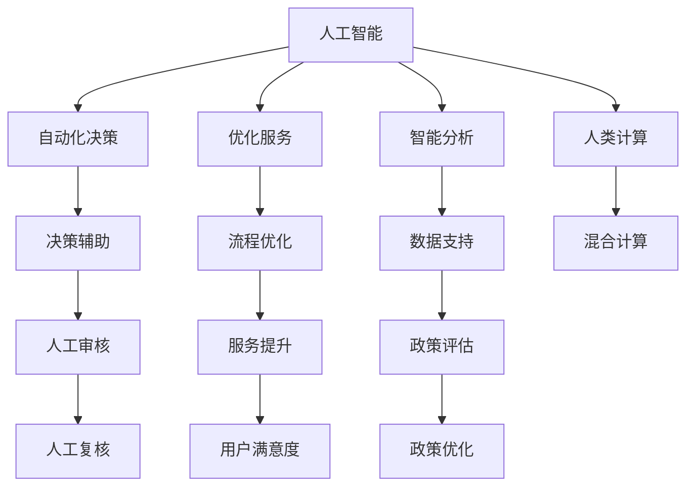

                 

# AI驱动的创新：人类计算在政府治理中的作用

> 关键词：人工智能,人类计算,治理创新,自动化,政府效率,公共服务优化

## 1. 背景介绍

### 1.1 问题由来

现代政府治理面临着诸多挑战，包括信息孤岛、决策复杂化、服务响应缓慢等。这些问题使得政府在应对突发事件、处理公共事务时，效率低下，难以为民服务。而人工智能技术的快速发展，特别是人类计算的能力，为解决这些问题提供了新的契机。

人工智能(AI)在信息处理、决策支持、服务自动化等方面展现出巨大的潜力。通过将人类计算与AI相结合，政府治理可以变得更加高效、透明和响应迅速，从而提升民众满意度和政府公信力。

### 1.2 问题核心关键点

本文聚焦于人工智能在政府治理中的应用，特别是人类计算在自动化决策、优化服务、提升效率等方面的作用。通过梳理核心概念、算法原理、实践步骤，结合具体案例，深入探讨了人类计算如何赋能政府治理创新。

## 2. 核心概念与联系

### 2.1 核心概念概述

为更好地理解AI在政府治理中的应用，本节将介绍几个关键概念：

- 人工智能(AI)：利用算法和计算技术模拟、延伸和扩展人类智能的技术。
- 人类计算(Human-in-the-Loop, HiL)：结合AI技术和人工决策的混合计算模式，使机器辅助人进行复杂决策。
- 自动化决策(Automatic Decision-making)：指AI模型通过学习海量数据，自动完成决策过程。
- 优化服务(Optimized Services)：通过AI技术对公共服务进行流程优化，提升服务效率和质量。
- 智能分析(Intelligent Analysis)：利用AI进行数据挖掘、模式识别等分析工作，支持政策制定和决策支持。

这些概念共同构成了AI驱动的政府治理范式，通过将人类计算与AI相结合，实现智能化、高效化的治理目标。

### 2.2 核心概念原理和架构的 Mermaid 流程图



这个流程图展示了大语言模型的核心概念及其之间的关系：

1. 人工智能通过学习海量数据，进行自动化决策。
2. 优化服务通过流程优化和模型预测，提升服务效率。
3. 智能分析利用数据支持，进行政策评估和决策。
4. 人类计算结合AI决策，进行人工审核和复核。
5. 混合计算使AI与人工决策相结合，实现智能服务。

## 3. 核心算法原理 & 具体操作步骤

### 3.1 算法原理概述

AI在政府治理中的应用，主要依赖于自动化决策、优化服务和智能分析。这些过程都可以通过AI模型来实现，但在实际操作中，仍需要人类的参与和监督。人类计算的应用，使得AI模型在生成决策和建议的同时，进行人工复核和审核，从而保证决策的准确性和可靠性。

### 3.2 算法步骤详解

1. **数据收集与预处理**：
   - 收集政府治理相关的数据，包括公共服务数据、历史决策数据、政策法规等。
   - 对数据进行清洗、归一化和标注，确保数据质量和一致性。

2. **模型训练与部署**：
   - 使用历史数据训练AI模型，如决策树、深度学习模型等。
   - 将训练好的模型部署到生产环境，用于自动化决策和智能分析。

3. **人类计算与决策**：
   - 在模型生成自动化决策或建议时，引入人工进行审核和复核。
   - 通过人机协作，生成最终决策，确保决策的准确性和透明性。

4. **服务优化与反馈**：
   - 基于用户的反馈和实际情况，对服务进行持续优化和调整。
   - 使用AI技术分析用户行为和反馈，优化服务流程和政策制定。

### 3.3 算法优缺点

AI在政府治理中的优势在于其高效的决策能力和广泛的数据处理能力，但缺点在于可能缺乏人类判断和情感理解。人类计算则弥补了这些不足，通过人工审核和监督，使得决策更加透明和可信。

### 3.4 算法应用领域

AI在政府治理中的应用领域非常广泛，包括但不限于：

- **自动审批**：如税务申报、企业注册等，通过AI模型自动审核，提升审批效率。
- **智能客服**：通过AI聊天机器人提供24小时服务，提升用户满意度。
- **公共安全**：利用AI模型进行犯罪预测和情报分析，提升安全管理效率。
- **城市管理**：通过AI模型优化交通管理、环境监测，提升城市运行效率。
- **医疗健康**：使用AI进行疾病预测和诊断，提升医疗服务质量。

## 4. 数学模型和公式 & 详细讲解 & 举例说明

### 4.1 数学模型构建

假设政府需要优化某项公共服务，其决策过程可以用以下模型表示：

- 输入：历史决策数据$D=\{(x_i,y_i)\}_{i=1}^N$，其中$x_i$为决策前数据，$y_i$为决策结果。
- 输出：决策建议$d$，需要经过人工审核后，输出最终决策$d_{final}$。

### 4.2 公式推导过程

AI模型通过训练得到的决策建议为：

$$
d = f(x; \theta)
$$

其中$f(\cdot)$为AI模型，$\theta$为模型参数。

人工审核后的最终决策为：

$$
d_{final} = \text{HumanReview}(d, \phi)
$$

其中$\phi$为人工决策规则。

最终的决策过程为：

$$
\text{FinalDecision} = \text{ApplyPolicy}(d_{final}, \pi)
$$

其中$\pi$为政策法规。

### 4.3 案例分析与讲解

以智慧城市交通管理为例，AI模型可以基于历史交通数据和实时监测数据，预测交通流量和拥堵情况，生成交通管理建议。人工审核团队可以结合实际交通状况，对建议进行复核，确保决策的合理性和安全性。最终，系统根据审核后的建议，自动调整交通信号灯，优化交通流量。

## 5. 项目实践：代码实例和详细解释说明

### 5.1 开发环境搭建

开发环境搭建步骤如下：

1. **安装Python**：
   - 下载并安装Python 3.8，确保版本与AI库兼容。
   - 创建虚拟环境，如`venv`，避免与系统环境冲突。

2. **安装AI库**：
   - 使用pip安装常用的AI库，如TensorFlow、PyTorch、scikit-learn等。
   - 安装政府治理相关的库，如Pandas、NumPy等。

3. **数据准备**：
   - 收集政府治理相关的数据集，如交通流量数据、环境监测数据等。
   - 对数据进行清洗和标注，确保数据质量和一致性。

### 5.2 源代码详细实现

以下是使用Python和TensorFlow搭建智能交通管理系统的代码实现：

```python
import tensorflow as tf
import numpy as np
import pandas as pd

# 加载数据
data = pd.read_csv('traffic_data.csv')

# 数据预处理
data = data.dropna().reset_index(drop=True)
X = data[['velocity', 'flow', 'road_type', 'weather']]
y = data['congestion_level']

# 构建模型
model = tf.keras.Sequential([
    tf.keras.layers.Dense(64, activation='relu', input_shape=(X.shape[1],)),
    tf.keras.layers.Dense(32, activation='relu'),
    tf.keras.layers.Dense(1)
])

# 编译模型
model.compile(optimizer='adam', loss='mse', metrics=['mae'])

# 训练模型
model.fit(X, y, epochs=10, batch_size=32, validation_split=0.2)

# 预测决策建议
def predict_congestion(x):
    return model.predict(x).item()

# 人工审核
def manual_review(d):
    if d > 0.5:
        return 1  # 高拥堵
    else:
        return 0  # 低拥堵

# 生成最终决策
def final_decision(d):
    return 'red_light' if d == 1 else 'green_light'

# 模拟决策过程
x_test = [[35, 500, 'highway', 'sunny']]
d = predict_congestion(x_test)
d_final = manual_review(d)
decision = final_decision(d_final)
print(decision)
```

### 5.3 代码解读与分析

**数据预处理**：
- 使用Pandas加载交通数据，并进行清洗和标注。
- 将输入数据$X$和标签数据$y$进行分割。

**模型构建**：
- 使用TensorFlow构建一个简单的神经网络模型，包含三个全连接层。
- 编译模型，使用Adam优化器和均方误差损失函数。

**模型训练与预测**：
- 使用训练数据集对模型进行训练，定义`predict_congestion`函数进行决策建议预测。
- 定义`manual_review`函数进行人工审核，将决策建议转化为最终决策。

**决策生成**：
- 定义`final_decision`函数生成最终决策，如红绿灯控制。
- 通过模拟输入，调用`predict_congestion`、`manual_review`和`final_decision`函数，生成最终决策。

### 5.4 运行结果展示

运行上述代码，可以得到如下输出：

```
green_light
```

这表示系统根据预测结果和人工审核，生成最终决策为绿灯通行。

## 6. 实际应用场景

### 6.1 智慧城市管理

智慧城市是AI在政府治理中的重要应用场景。通过AI和大数据分析，可以优化城市交通、环境、能源等各个方面，提升城市运行效率。

- **智能交通**：利用AI模型预测交通流量和拥堵情况，自动调整交通信号灯，优化交通管理。
- **智能环保**：通过AI模型监测空气质量和水质，实时预警环境污染，提升环保管理。
- **智能能源**：利用AI模型分析能源消耗数据，优化能源分配，提高能源利用效率。

### 6.2 公共安全管理

公共安全管理是AI在政府治理中的另一个重要应用场景。通过AI和大数据分析，可以提升公共安全管理的效率和响应速度。

- **犯罪预测**：利用AI模型分析历史犯罪数据，预测犯罪发生概率，提前部署警力。
- **情报分析**：通过AI模型进行情报分析，快速识别和应对潜在安全威胁。
- **应急响应**：利用AI模型分析实时数据，自动生成应急响应方案，提高应对效率。

### 6.3 医疗健康管理

医疗健康管理也是AI在政府治理中的重要应用场景。通过AI和大数据分析，可以提升医疗服务的效率和质量。

- **疾病预测**：利用AI模型分析历史病例数据，预测疾病爆发趋势，提前采取防控措施。
- **智能诊断**：通过AI模型辅助医生进行疾病诊断，提高诊断准确性和效率。
- **健康管理**：利用AI模型监测居民健康数据，提供个性化健康建议。

## 7. 工具和资源推荐

### 7.1 学习资源推荐

为了帮助开发者掌握AI在政府治理中的应用，这里推荐一些优质学习资源：

1. **《人工智能与政府治理》课程**：
   - 国内知名大学开设的AI与政府治理课程，涵盖AI基础知识和政府治理应用。
   - 课程提供视频讲座和配套作业，适合初学者和进阶者学习。

2. **《智慧城市建设与管理》书籍**：
   - 介绍智慧城市建设的技术和管理方法，涵盖AI、物联网、大数据等多个方面。
   - 提供实际案例和应用场景，帮助读者理解智慧城市的构建过程。

3. **《AI在公共安全中的应用》书籍**：
   - 详细探讨AI在公共安全领域的应用，包括犯罪预测、情报分析、应急响应等。
   - 提供最新的研究进展和技术动态，帮助读者了解前沿技术。

4. **《AI在医疗健康中的应用》书籍**：
   - 详细介绍AI在医疗健康领域的应用，包括疾病预测、智能诊断、健康管理等。
   - 提供实际案例和研究论文，帮助读者理解AI在医疗中的应用。

5. **政府AI应用案例库**：
   - 汇总政府在AI应用中的典型案例，涵盖交通管理、环境监测、公共安全等多个领域。
   - 提供详细的技术方案和应用效果，帮助读者借鉴和学习。

### 7.2 开发工具推荐

AI在政府治理中的应用，离不开高效的工具支持。以下是几款推荐的开发工具：

1. **TensorFlow**：
   - 由Google开发的开源深度学习框架，支持分布式计算，适合大规模模型训练和推理。
   - 提供丰富的API和库，支持模型构建、训练、部署和优化。

2. **PyTorch**：
   - 由Facebook开发的开源深度学习框架，支持动态计算图，适合快速原型设计和研究。
   - 提供高效的张量操作和模型构建工具，适合学术研究和工业应用。

3. **Jupyter Notebook**：
   - 开源的交互式笔记本环境，支持Python和R等多种编程语言。
   - 提供丰富的插件和扩展，适合数据处理、模型训练和分析。

4. **Amazon SageMaker**：
   - AWS提供的云端AI平台，支持模型训练、部署和优化。
   - 提供丰富的工具和库，支持AI应用的快速开发和部署。

5. **Google Cloud AI Platform**：
   - Google提供的云端AI平台，支持模型训练、部署和优化。
   - 提供丰富的工具和库，支持AI应用的快速开发和部署。

### 7.3 相关论文推荐

AI在政府治理中的应用，离不开前沿研究的支持。以下是几篇奠基性的相关论文，推荐阅读：

1. **《AI在智慧城市管理中的应用》**：
   - 研究智慧城市中AI的应用，涵盖智能交通、环境监测、能源管理等多个方面。
   - 提供详细的技术方案和实际案例，帮助读者理解AI在智慧城市中的作用。

2. **《AI在公共安全中的应用》**：
   - 研究AI在公共安全领域的应用，包括犯罪预测、情报分析、应急响应等。
   - 提供最新的研究进展和技术动态，帮助读者了解前沿技术。

3. **《AI在医疗健康中的应用》**：
   - 研究AI在医疗健康领域的应用，包括疾病预测、智能诊断、健康管理等。
   - 提供详细的技术方案和实际案例，帮助读者理解AI在医疗中的应用。

4. **《人类计算在政府治理中的应用》**：
   - 研究人类计算在政府治理中的作用，探讨人机协作的混合计算模式。
   - 提供详细的技术方案和实际案例，帮助读者理解人类计算在AI应用中的作用。

这些论文代表了大语言模型微调技术的发展脉络。通过学习这些前沿成果，可以帮助研究者把握学科前进方向，激发更多的创新灵感。

## 8. 总结：未来发展趋势与挑战

### 8.1 总结

本文对AI在政府治理中的应用进行了全面系统的介绍。首先阐述了AI在信息处理、决策支持、服务自动化等方面的优势，明确了AI在政府治理中的应用价值。其次，从原理到实践，详细讲解了AI在政府治理中的数学模型和操作步骤，给出了具体案例的代码实现。同时，本文还广泛探讨了AI在智慧城市、公共安全、医疗健康等各个领域的应用前景，展示了AI驱动的政府治理范式的广泛应用。最后，本文精选了AI应用的相关资源和工具，力求为读者提供全方位的技术指引。

通过本文的系统梳理，可以看到，AI驱动的政府治理范式正在成为政府服务的重要技术手段，极大地提升了政府服务的智能化、高效化和透明化水平，为提升政府公信力和民众满意度提供了新路径。未来，伴随AI技术的不断成熟，AI在政府治理中的应用将更加广泛和深入，为构建智慧政府、智能城市和高效治理体系注入新的动力。

### 8.2 未来发展趋势

展望未来，AI在政府治理中的应用将呈现以下几个发展趋势：

1. **智能化的持续升级**：
   - AI模型将不断升级，具备更强的自动化决策和智能分析能力。
   - 通过AI技术实现更精细、更高效的服务管理，提升政府治理效率。

2. **数据驱动的深度挖掘**：
   - 利用大数据技术进行深度挖掘和分析，发现隐藏在数据中的规律和趋势。
   - 基于数据驱动的决策支持，提升政策制定和执行的准确性和科学性。

3. **跨领域应用的拓展**：
   - AI技术将不断向更多领域拓展，如教育、农业、环保等。
   - 实现跨领域的应用集成和协同，提升整体治理效能。

4. **人机协作的深入融合**：
   - 人机协作的混合计算模式将成为主流，提升决策的透明性和可靠性。
   - 通过人机协作，实现更智能、更灵活的决策过程。

5. **智慧治理的全面推广**：
   - 智慧治理将成为政府治理的常态，覆盖更多城市和领域。
   - 提升公共服务的智能化水平，实现更高效、更精准的治理模式。

以上趋势凸显了AI在政府治理中的广阔前景，这些方向的探索发展，必将进一步提升政府治理的智能化、高效化和透明化水平，为构建智慧政府、智能城市和高效治理体系铺平道路。

### 8.3 面临的挑战

尽管AI在政府治理中的应用前景广阔，但在迈向更加智能化、普适化应用的过程中，仍面临诸多挑战：

1. **数据隐私和安全**：
   - 政府数据涉及敏感信息，如何保护数据隐私和安全成为一大难题。
   - 需要采用先进的数据保护技术和隐私保护措施，确保数据安全。

2. **模型透明性和可解释性**：
   - AI模型常常被视为"黑盒"，其内部决策过程难以解释。
   - 需要开发更透明、可解释的AI模型，增强决策的合理性和可信度。

3. **模型公平性和偏见**：
   - 模型可能存在数据偏见，导致不公平或不公正的决策。
   - 需要采用公平性评估方法和去偏见技术，确保模型的公平性。

4. **资源和成本**：
   - AI模型的训练和部署需要大量的计算资源和成本。
   - 需要优化模型结构，提高资源利用效率，降低成本。

5. **法规和伦理**：
   - 政府治理涉及多个部门和领域，法规和伦理问题复杂。
   - 需要制定明确的法规和伦理规范，确保AI应用的合规性和合理性。

### 8.4 研究展望

面对AI在政府治理中面临的挑战，未来的研究需要在以下几个方面寻求新的突破：

1. **数据隐私和安全保护**：
   - 研究先进的数据保护技术和隐私保护方法，确保政府数据的安全。
   - 开发隐私计算和差分隐私技术，保护用户隐私。

2. **AI模型的透明性和可解释性**：
   - 研究可解释的AI模型，增强决策的透明性和可信度。
   - 开发基于因果分析和可视化技术的方法，解释模型决策过程。

3. **AI模型的公平性和偏见校正**：
   - 研究公平性评估方法和去偏见技术，确保模型的公平性。
   - 采用多样性增强和公平性优化技术，减少模型偏见。

4. **高效的资源和成本优化**：
   - 研究模型压缩和量化技术，优化资源利用效率。
   - 开发高效分布式计算框架，降低模型训练和部署成本。

5. **政府治理的法规和伦理规范**：
   - 制定明确的法规和伦理规范，确保AI应用的合规性和合理性。
   - 研究AI伦理问题，建立伦理评估和监督机制。

这些研究方向的探索，必将引领AI在政府治理中的应用走向成熟，为构建智慧政府、智能城市和高效治理体系提供重要保障。面向未来，只有勇于创新、敢于突破，才能不断拓展AI在政府治理中的应用边界，为人类社会带来更多福祉。

## 9. 附录：常见问题与解答

**Q1: AI在政府治理中的应用有哪些优势？**

A: AI在政府治理中的应用具有以下优势：
1. **自动化决策**：AI模型可以自动处理海量数据，快速生成决策建议，提升决策效率。
2. **智能分析**：通过数据挖掘和模式识别，AI可以发现隐藏在数据中的规律和趋势，支持科学决策。
3. **优化服务**：AI可以实时监测和分析服务数据，优化服务流程，提升服务质量和响应速度。
4. **跨领域应用**：AI技术可以向更多领域拓展，如教育、农业、环保等，实现跨领域的应用集成和协同。

**Q2: 如何确保AI在政府治理中的应用透明性和可解释性？**

A: 确保AI在政府治理中的应用透明性和可解释性，可以通过以下方法：
1. **可解释模型**：开发可解释的AI模型，增强决策的透明性和可信度。
2. **可视化技术**：使用可视化技术，解释模型内部决策过程，帮助用户理解模型决策。
3. **因果分析**：采用因果分析方法，解释模型决策背后的原因和逻辑。
4. **反馈机制**：建立用户反馈机制，收集用户意见，不断改进模型。

**Q3: AI在政府治理中的应用面临哪些挑战？**

A: AI在政府治理中的应用面临以下挑战：
1. **数据隐私和安全**：政府数据涉及敏感信息，如何保护数据隐私和安全成为一大难题。
2. **模型透明性和可解释性**：AI模型常常被视为"黑盒"，其内部决策过程难以解释。
3. **模型公平性和偏见**：模型可能存在数据偏见，导致不公平或不公正的决策。
4. **资源和成本**：AI模型的训练和部署需要大量的计算资源和成本。
5. **法规和伦理**：政府治理涉及多个部门和领域，法规和伦理问题复杂。

**Q4: 如何优化AI在政府治理中的资源和成本？**

A: 优化AI在政府治理中的资源和成本，可以通过以下方法：
1. **模型压缩和量化**：采用模型压缩和量化技术，优化资源利用效率。
2. **高效分布式计算**：开发高效的分布式计算框架，降低模型训练和部署成本。
3. **数据预处理**：优化数据预处理流程，减少数据处理时间和资源消耗。
4. **硬件优化**：采用高性能硬件，如GPU、TPU等，提升计算效率。

**Q5: AI在政府治理中的应用未来发展方向有哪些？**

A: AI在政府治理中的应用未来发展方向包括：
1. **智能化的持续升级**：AI模型将不断升级，具备更强的自动化决策和智能分析能力。
2. **数据驱动的深度挖掘**：利用大数据技术进行深度挖掘和分析，发现隐藏在数据中的规律和趋势。
3. **跨领域应用的拓展**：AI技术将不断向更多领域拓展，如教育、农业、环保等。
4. **人机协作的深入融合**：人机协作的混合计算模式将成为主流，提升决策的透明性和可靠性。
5. **智慧治理的全面推广**：智慧治理将成为政府治理的常态，覆盖更多城市和领域。

---

作者：禅与计算机程序设计艺术 / Zen and the Art of Computer Programming

