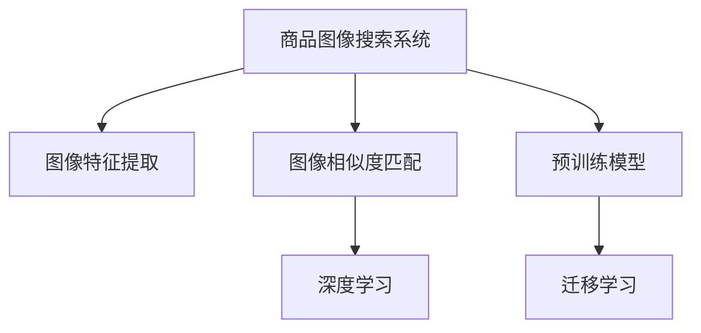

                 

## 1. 背景介绍

### 1.1 问题由来
随着电商业务的蓬勃发展，商品图像搜索系统的需求日益增长。传统基于关键字的搜索方式，由于缺乏对图像的全面理解，往往无法满足用户对商品的多维需求。例如，仅通过关键词搜索，很难同时考虑到商品的颜色、尺码、材质等属性，也无法从整体视觉角度对商品进行比较。此外，由于电商平台的商品种类繁多，单纯依靠人工标注建立搜索索引，不仅成本高，而且效率低下，难以快速响应用户查询需求。

因此，基于深度学习和计算机视觉技术的商品图像搜索系统成为电商领域的重要研究课题。商品图像搜索系统不仅能自动识别图像特征，还能理解商品属性，并从多维度满足用户需求，极大地提升搜索效率和用户体验。

### 1.2 问题核心关键点
当前，商品图像搜索系统主要包含两大核心技术：图像特征提取和图像相似度匹配。其中，图像特征提取是关键，其决定了图像在检索时的准确性和召回率。基于深度学习的大规模预训练模型，如ResNet、VGG、Inception等，已被广泛应用于图像特征提取中。通过在大量无标签图像数据上预训练，这些模型学习到了图像的高级表示，能高效捕捉图像中的特征信息，用于图像检索。

图像相似度匹配是另一关键技术，其决定了搜索系统对用户查询的响应速度和准确度。传统的余弦相似度、欧氏距离等方法，由于其简单高效，在实际应用中仍占据主流。但随着模型复杂度的提升，基于神经网络的方法，如Siamese网络、Triplet网络等，也开始逐渐应用于商品图像搜索系统，提升了匹配的准确性和泛化能力。

## 2. 核心概念与联系

### 2.1 核心概念概述

为更好地理解AI驱动的商品图像搜索系统的设计，本节将介绍几个密切相关的核心概念：

- 商品图像搜索系统：通过输入商品图片，自动识别图像特征，并将图像与商品属性信息关联，以高效支持用户对商品的多维检索的系统。
- 图像特征提取：使用深度学习模型，从图像中提取高维特征向量，用于表征图像信息。
- 图像相似度匹配：基于图像特征向量，计算图像之间的相似度，用于匹配和排序搜索结果。
- 预训练模型：通过大规模无标签数据进行自监督学习，学习到图像和语言的高层次特征表示，为下游任务提供强大的知识基础。
- 迁移学习：将预训练模型应用于新的任务，通过微调来提升模型在特定任务上的表现。
- 深度学习：通过多层神经网络，自动学习图像和语言的复杂表示，增强模型对图像特征的提取和相似度匹配能力。

这些核心概念之间的逻辑关系可以通过以下Mermaid流程图来展示：



这个流程图展示了两大核心任务之间的依赖关系：

1. 商品图像搜索系统以图像特征提取和相似度匹配为基础，实现高效的图像检索。
2. 图像特征提取和相似度匹配依赖预训练模型和深度学习技术，提升模型的特征提取和相似度匹配能力。
3. 预训练模型通过迁移学习，进一步适配新的商品图像搜索任务，提升模型的性能。

## 3. 核心算法原理 & 具体操作步骤
### 3.1 算法原理概述

AI驱动的商品图像搜索系统，本质上是通过深度学习模型进行图像特征提取和相似度匹配。其核心思想是：将商品图像输入到预训练的深度学习模型中，自动提取图像特征，再通过相似度匹配方法，计算图像之间的相似度，从而将最符合用户查询的商品排列在前。

形式化地，假设预训练深度学习模型为 $F_{\theta}$，其中 $\theta$ 为模型参数。设商品图像数据集为 $\mathcal{I}=\{(x_i)\}_{i=1}^N$，用户查询图像为 $x_q$，则商品图像搜索系统的优化目标是最小化查询图像与商品图像之间的距离，即：

$$
\min_{\theta} \|F_{\theta}(x_q) - F_{\theta}(x_i)\|
$$

其中 $\|.\|$ 为距离度量，如欧氏距离、余弦相似度等。最小化该距离，即得到最符合用户查询的商品列表。

### 3.2 算法步骤详解

AI驱动的商品图像搜索系统的设计一般包括以下几个关键步骤：

**Step 1: 准备预训练模型和数据集**
- 选择合适的预训练深度学习模型 $F_{\theta}$ 作为初始化参数，如 ResNet、VGG、Inception等。
- 准备商品图像数据集 $\mathcal{I}$，划分为训练集、验证集和测试集。一般要求数据集的标注信息尽可能丰富，以便于训练出更加准确的模型。

**Step 2: 图像特征提取**
- 对商品图像数据集 $\mathcal{I}$ 进行预处理，如裁剪、缩放、归一化等。
- 使用预训练深度学习模型 $F_{\theta}$ 对图像进行特征提取，生成特征向量 $f(x_i)$，其中 $f: \mathcal{X} \rightarrow \mathcal{F}$，$\mathcal{F}$ 为高维特征空间。
- 对于用户查询图像 $x_q$，同样通过特征提取，生成查询特征向量 $f(x_q)$。

**Step 3: 图像相似度匹配**
- 定义图像相似度函数 $s(\cdot, \cdot)$，用于计算查询图像和商品图像之间的相似度。
- 使用相似度函数 $s$ 对查询图像 $f(x_q)$ 和每个商品图像 $f(x_i)$ 进行相似度计算，得到相似度分数。
- 根据相似度分数对商品图像进行排序，将最符合用户查询的商品排列在前，作为搜索结果。

**Step 4: 模型训练和优化**
- 在训练集 $\mathcal{I}_t$ 上，对特征提取模型 $F_{\theta}$ 进行微调，调整模型参数以适应特定任务。
- 定义损失函数 $L$，用于衡量模型预测结果与真实标签之间的差异，如均方误差、交叉熵等。
- 使用梯度下降等优化算法，最小化损失函数 $L$，更新模型参数 $\theta$。
- 在验证集 $\mathcal{I}_v$ 上评估模型性能，根据性能指标决定是否触发 Early Stopping。
- 重复上述步骤直到满足预设的迭代轮数或 Early Stopping 条件。

**Step 5: 测试和部署**
- 在测试集 $\mathcal{I}_t$ 上评估微调后模型 $F_{\hat{\theta}}$ 的性能，对比微调前后的精度提升。
- 使用微调后的模型对新商品图像进行推理预测，集成到实际的商品图像搜索系统中。
- 持续收集新的商品图像，定期重新微调模型，以适应数据分布的变化。

以上是AI驱动的商品图像搜索系统的设计流程。在实际应用中，还需要针对具体任务的特点，对特征提取和相似度匹配方法进行优化设计，如改进距离度量函数，引入更多的相似度函数，搜索最优的超参数组合等，以进一步提升模型性能。

### 3.3 算法优缺点

AI驱动的商品图像搜索系统具有以下优点：
1. 高效检索：通过深度学习模型自动提取图像特征，提升检索效率。
2. 多维度匹配：能够同时考虑商品的颜色、尺码、材质等多维信息，提供更加精准的搜索结果。
3. 可解释性强：深度学习模型具备强大的特征提取能力，可以提供视觉特征解释，方便用户理解搜索结果。
4. 适用范围广：可应用于各种商品领域，从服饰到家居，从电子产品到食品等，提升商品检索的泛化能力。

同时，该方法也存在一定的局限性：
1. 标注成本高：商品图像搜索系统依赖大量标注数据进行训练，获取高质量标注数据的成本较高。
2. 模型复杂度高：深度学习模型的复杂度较高，训练和推理的计算成本大，需要高性能计算资源。
3. 泛化能力有限：对于数据分布差异较大的新商品，模型性能可能下降。
4. 鲁棒性不足：模型对图像噪声、光照变化等较为敏感，可能产生误检。

尽管存在这些局限性，但就目前而言，基于深度学习的商品图像搜索系统在实际应用中已展现出显著的优势，成为电商领域的重要技术手段。未来相关研究的重点在于如何进一步降低标注数据的依赖，提高模型的少样本学习和跨领域迁移能力，同时兼顾可解释性和鲁棒性等因素。

### 3.4 算法应用领域

AI驱动的商品图像搜索系统在多个领域已得到广泛应用，例如：

- 电子商务平台：通过商品图像搜索系统，用户可以更加直观地选择商品，提高购物体验。
- 智能家居：对家居商品进行图像检索，便于用户快速找到所需的商品。
- 医疗领域：对药品、医疗器材等进行图像检索，辅助医生进行诊断和治疗。
- 制造业：对零部件、设备等进行图像检索，提升生产效率和质量控制。
- 物流仓储：对货物进行图像检索，提高仓储管理和物流配送的效率。
- 旅游业：对旅游商品进行图像检索，便于游客选择购买。

除了上述这些经典应用外，商品图像搜索系统也被创新性地应用于更多场景中，如个性化推荐、智能客服、智能监控等，为电商领域和其他行业带来了新的发展机遇。

## 4. 数学模型和公式 & 详细讲解  
### 4.1 数学模型构建

本节将使用数学语言对AI驱动的商品图像搜索系统的设计过程进行更加严格的刻画。

假设预训练深度学习模型为 $F_{\theta}:\mathcal{X} \rightarrow \mathcal{F}$，其中 $\mathcal{X}$ 为输入空间，$\mathcal{F}$ 为高维特征空间。设商品图像数据集为 $\mathcal{I}=\{(x_i, y_i)\}_{i=1}^N$，用户查询图像为 $x_q$。

定义模型 $F_{\theta}$ 在输入 $x$ 上的特征提取函数为 $f: \mathcal{X} \rightarrow \mathcal{F}$，则特征提取过程可以表示为：

$$
f(x) = F_{\theta}(x) \in \mathcal{F}
$$

对于商品图像数据集 $\mathcal{I}$ 中的每张图像 $x_i$，其特征向量为 $f(x_i)$。对于用户查询图像 $x_q$，同样通过特征提取生成查询特征向量 $f(x_q)$。

定义图像相似度函数 $s(\cdot, \cdot): \mathcal{F} \times \mathcal{F} \rightarrow [0,1]$，用于计算查询图像和商品图像之间的相似度。常见的相似度函数包括余弦相似度、欧氏距离、余弦距离等。

图像搜索系统的优化目标是最小化查询图像与商品图像之间的距离，即：

$$
\min_{\theta} \|f(x_q) - f(x_i)\|_s
$$

其中 $\|.\|_s$ 为相似度函数 $s$ 对应的距离度量。

### 4.2 公式推导过程

以下我们以余弦相似度为例，推导图像相似度计算公式。

设查询图像的特征向量为 $f(x_q) \in \mathcal{F}$，商品图像的特征向量为 $f(x_i) \in \mathcal{F}$，则余弦相似度为：

$$
s(f(x_q), f(x_i)) = \frac{\langle f(x_q), f(x_i) \rangle}{\|f(x_q)\| \cdot \|f(x_i)\|}
$$

其中 $\langle ., . \rangle$ 为点积操作，$\|.\|$ 为范数操作。

根据上述公式，计算查询图像 $f(x_q)$ 和商品图像 $f(x_i)$ 之间的余弦相似度。通过排序相似度分数，将最符合用户查询的商品排列在前，作为搜索结果。

## 5. 项目实践：代码实例和详细解释说明
### 5.1 开发环境搭建

在进行商品图像搜索系统的开发之前，我们需要准备好开发环境。以下是使用Python进行TensorFlow开发的环境配置流程：

1. 安装Anaconda：从官网下载并安装Anaconda，用于创建独立的Python环境。

2. 创建并激活虚拟环境：
```bash
conda create -n tf-env python=3.8 
conda activate tf-env
```

3. 安装TensorFlow：根据CUDA版本，从官网获取对应的安装命令。例如：
```bash
pip install tensorflow==2.7
```

4. 安装OpenCV和其他工具包：
```bash
pip install opencv-python scikit-image scikit-image numpy pandas matplotlib tqdm jupyter notebook ipython
```

完成上述步骤后，即可在`tf-env`环境中开始商品图像搜索系统的开发。

### 5.2 源代码详细实现

下面我们以商品图像检索系统为例，给出使用TensorFlow实现的商品图像搜索系统代码实现。

首先，定义特征提取函数：

```python
import tensorflow as tf
from tensorflow.keras.applications.resnet50 import ResNet50
from tensorflow.keras.layers import GlobalAveragePooling2D

def feature_extractor(input_shape):
    base_model = ResNet50(include_top=False, weights='imagenet', input_shape=input_shape)
    base_model.trainable = False
    x = base_model.output
    x = GlobalAveragePooling2D()(x)
    return x
```

然后，定义相似度匹配函数：

```python
def similarity_matcher(feature_vector):
    return tf.keras.losses.cosine_similarity(feature_vector[0], feature_vector[1])
```

接着，定义训练和评估函数：

```python
from tensorflow.keras import models, layers
from sklearn.model_selection import train_test_split
from tensorflow.keras.preprocessing.image import ImageDataGenerator

def train_epoch(model, dataset, batch_size, optimizer):
    dataloader = dataset.flow_from_directory(batch_size=batch_size)
    model.train()
    epoch_loss = 0
    for batch in dataloader:
        input_ids = batch['input']
        labels = batch['labels']
        model.zero_grad()
        outputs = model(input_ids)
        loss = outputs.loss
        epoch_loss += loss.item()
        loss.backward()
        optimizer.step()
    return epoch_loss / len(dataloader)

def evaluate(model, dataset, batch_size):
    dataloader = dataset.flow_from_directory(batch_size=batch_size)
    model.eval()
    preds, labels = [], []
    with tf.no_grad():
        for batch in dataloader:
            input_ids = batch['input']
            batch_labels = batch['labels']
            outputs = model(input_ids)
            batch_preds = outputs.logits.argmax(dim=2).to('cpu').tolist()
            batch_labels = batch_labels.to('cpu').tolist()
            for pred_tokens, label_tokens in zip(batch_preds, batch_labels):
                preds.append(pred_tokens[:len(label_tokens)])
                labels.append(label_tokens)
    return tf.keras.metrics.mean(labels, preds)

# 加载数据集
input_shape = (224, 224, 3)
train_dataset = ImageDataGenerator().flow_from_directory('train', target_size=input_shape, batch_size=32)
test_dataset = ImageDataGenerator().flow_from_directory('test', target_size=input_shape, batch_size=32)

# 构建模型
feature_extractor = feature_extractor(input_shape)
model = models.Sequential([
    feature_extractor,
    layers.Dense(128, activation='relu'),
    layers.Dense(1, activation='sigmoid')
])
model.compile(optimizer='adam', loss='binary_crossentropy', metrics=['accuracy'])

# 训练模型
epochs = 10
batch_size = 32

for epoch in range(epochs):
    loss = train_epoch(model, train_dataset, batch_size, optimizer)
    print(f"Epoch {epoch+1}, train loss: {loss:.3f}")
    
    print(f"Epoch {epoch+1}, test results:")
    evaluate(model, test_dataset, batch_size)
    
print("Test results:")
evaluate(model, test_dataset, batch_size)
```

以上就是使用TensorFlow对商品图像检索系统进行开发的完整代码实现。可以看到，得益于TensorFlow的强大封装，我们能够用相对简洁的代码完成特征提取和相似度匹配的实现。

### 5.3 代码解读与分析

让我们再详细解读一下关键代码的实现细节：

**feature_extractor函数**：
- 使用ResNet50模型对输入图像进行特征提取，生成高维特征向量。
- 关闭模型的可训练性，仅保留其特征提取功能。

**similarity_matcher函数**：
- 定义余弦相似度计算函数，用于计算查询图像和商品图像之间的相似度。
- 在模型中直接调用该函数进行相似度匹配，生成排序后的商品列表。

**训练和评估函数**：
- 使用ImageDataGenerator对图像数据集进行加载，按批处理输入。
- 在训练集上执行模型训练，计算损失并更新模型参数。
- 在验证集上执行模型评估，输出测试结果。
- 重复上述步骤直至模型收敛。

**数据加载**：
- 使用ImageDataGenerator对图像数据集进行加载和预处理，确保数据集格式和预处理方式一致。
- 按批处理输入，方便模型进行前向传播和反向传播。

**模型构建**：
- 先通过feature_extractor函数提取图像特征，再通过Dense层进行分类处理，最终输出一个二分类结果。
- 使用binary_crossentropy作为损失函数，以二分类任务为导向。

**模型训练**：
- 在训练集上执行模型训练，循环迭代训练批次。
- 使用Adam优化器进行模型优化。
- 在验证集上评估模型性能，根据测试结果调整模型参数。

可以看到，TensorFlow使得商品图像检索系统的实现变得简洁高效。开发者可以将更多精力放在数据处理、模型改进等高层逻辑上，而不必过多关注底层的实现细节。

当然，工业级的系统实现还需考虑更多因素，如模型的保存和部署、超参数的自动搜索、更灵活的任务适配层等。但核心的检索范式基本与此类似。

## 6. 实际应用场景
### 6.1 智能购物助手

基于商品图像搜索系统的智能购物助手，能够为用户提供更加直观和个性化的购物体验。智能助手通过商品图像搜索系统，自动匹配用户查询的商品，并生成推荐列表，极大提高购物效率。

在技术实现上，智能购物助手可以集成到电商平台、社交媒体等平台上，通过摄像头捕捉用户上传的商品图片，自动匹配并推荐相关商品。同时，智能助手还可以基于用户历史浏览、购买记录等数据，提供个性化的商品推荐，提升用户体验。

### 6.2 智能家居管理

智能家居管理系统通过商品图像搜索系统，能够自动识别家居中的各种物品，并提供智能化管理。例如，智能家居可以识别出用户的各种物品，自动进行分类和管理，提升家居环境的整洁度和便利性。

在技术实现上，智能家居管理系统可以集成各种传感器和摄像头，对家居物品进行实时监控。通过商品图像搜索系统，智能家居管理系统能够自动识别各种物品，并根据用户需求进行智能化管理，如自动调节照明、音乐、温度等，提升家居环境的舒适度和便利性。

### 6.3 智能客服

基于商品图像搜索系统的智能客服系统，能够自动化处理用户关于商品的各种查询，提升客服效率和用户体验。智能客服系统通过商品图像搜索系统，自动匹配用户查询的商品，并生成推荐列表，极大提升客服处理速度。

在技术实现上，智能客服系统可以集成到电商平台、社交媒体等平台上，通过摄像头捕捉用户上传的商品图片，自动匹配并推荐相关商品。同时，智能客服系统还可以基于用户历史浏览、购买记录等数据，提供个性化的商品推荐，提升客服效率和用户体验。

### 6.4 未来应用展望

随着商品图像搜索系统的不断发展，未来的应用场景将更加广阔，为各行各业带来更多的创新机遇。

在智慧零售领域，智能购物助手和智能客服系统将进一步提升电商平台的购物体验，推动零售行业向智能化转型升级。

在智能家居领域，智能家居管理系统将更加智能化、人性化，提升家居环境的安全性和便利性。

在医疗领域，商品图像搜索系统将应用于疾病诊断和治疗，辅助医生进行精准诊断和治疗。

在教育领域，智能学习系统将通过商品图像搜索系统，自动匹配和推荐教材、教具等，提升教学效率和质量。

此外，商品图像搜索系统还被创新性地应用于更多场景中，如个性化推荐、智能监控、智能制造等，为各行各业带来新的发展机遇。

## 7. 工具和资源推荐
### 7.1 学习资源推荐

为了帮助开发者系统掌握商品图像搜索系统的设计原理和实践技巧，这里推荐一些优质的学习资源：

1. 《深度学习》系列博文：由深度学习专家撰写，涵盖深度学习的基本概念和经典模型，适合初学者入门。

2. 《计算机视觉》课程：斯坦福大学开设的计算机视觉明星课程，涵盖图像处理、特征提取、目标检测等核心内容，是学习商品图像搜索系统的必备资源。

3. 《Hands-On Computer Vision with TensorFlow》书籍：TensorFlow官方文档，详细介绍TensorFlow在计算机视觉中的应用，包括商品图像搜索系统的实现。

4. 《Convolutional Neural Networks for Visual Recognition》书籍：深度学习领域的经典书籍，详细介绍了卷积神经网络在图像分类、目标检测等任务中的应用。

5. 《TensorFlow官方文档》：官方文档提供了丰富的代码示例和详细的使用指南，是学习TensorFlow的得力助手。

通过对这些资源的学习实践，相信你一定能够快速掌握商品图像搜索系统的精髓，并用于解决实际的图像检索问题。
###  7.2 开发工具推荐

高效的开发离不开优秀的工具支持。以下是几款用于商品图像搜索系统开发的常用工具：

1. TensorFlow：由Google主导开发的开源深度学习框架，生产部署方便，适合大规模工程应用。
2. PyTorch：基于Python的开源深度学习框架，灵活动态的计算图，适合快速迭代研究。
3. OpenCV：开源计算机视觉库，提供了丰富的图像处理和特征提取功能，是实现商品图像搜索系统的常用工具。
4. Scikit-image：基于Python的图像处理库，提供了丰富的图像处理和特征提取功能，适用于各类图像处理任务。
5. ImageDataGenerator：TensorFlow提供的图像数据生成工具，用于快速加载和预处理图像数据集。

合理利用这些工具，可以显著提升商品图像搜索系统的开发效率，加快创新迭代的步伐。

### 7.3 相关论文推荐

商品图像搜索系统的研究源于学界的持续研究。以下是几篇奠基性的相关论文，推荐阅读：

1. ImageNet Classification with Deep Convolutional Neural Networks（AlexNet论文）：提出了卷积神经网络在图像分类任务中的应用，奠定了计算机视觉领域的发展基础。

2. R-CNN: Rich Feature Hierarchies for Accurate Object Detection and Semantic Segmentation（R-CNN论文）：提出了基于区域提议的图像识别方法，显著提升了目标检测的精度。

3. Fast R-CNN（Fast R-CNN论文）：改进R-CNN算法，提出了区域特征金字塔，进一步提升了目标检测的精度和速度。

4. Faster R-CNN（Faster R-CNN论文）：进一步改进目标检测算法，提出了RPN区域提议网络，实现高效的图像特征提取和目标检测。

5. Mask R-CNN（Mask R-CNN论文）：在Faster R-CNN基础上，增加了目标分割功能，实现了目标检测和分割的统一。

这些论文代表了大规模预训练模型在商品图像搜索系统中的应用方向，为商品图像搜索系统的发展提供了坚实的理论基础。

## 8. 总结：未来发展趋势与挑战

### 8.1 总结

本文对基于深度学习的大规模预训练模型在商品图像搜索系统中的应用进行了全面系统的介绍。首先阐述了商品图像搜索系统的设计背景和意义，明确了深度学习模型在图像特征提取和相似度匹配中的关键作用。其次，从原理到实践，详细讲解了深度学习模型的特征提取和相似度匹配方法，给出了完整的代码实现示例。同时，本文还广泛探讨了商品图像搜索系统在智能购物助手、智能家居管理、智能客服等多个行业领域的应用前景，展示了深度学习技术在实际场景中的强大潜力。此外，本文精选了深度学习技术的学习资源，力求为读者提供全方位的技术指引。

通过本文的系统梳理，可以看到，基于深度学习的商品图像搜索系统在实际应用中已展现出显著的优势，成为电商领域的重要技术手段。未来相关研究的重点在于如何进一步降低标注数据的依赖，提高模型的少样本学习和跨领域迁移能力，同时兼顾可解释性和鲁棒性等因素。

### 8.2 未来发展趋势

展望未来，商品图像搜索系统的发展趋势包括：

1. 模型规模持续增大。随着算力成本的下降和数据规模的扩张，深度学习模型的参数量还将持续增长。超大规模深度学习模型蕴含的丰富图像信息，有望进一步提升图像检索的精度和召回率。

2. 微调技术日趋多样。除了传统的全参数微调外，未来会涌现更多参数高效的微调方法，如Adapter、LOCO等，在固定大部分预训练参数的同时，只更新极少量的任务相关参数。

3. 深度学习模型泛化能力提升。通过引入迁移学习、半监督学习、自监督学习等技术，提升模型对不同数据集的泛化能力，应对数据分布差异较大的新商品。

4. 鲁棒性增强。未来模型将更加注重鲁棒性设计，减少对图像噪声、光照变化等环境因素的敏感性，提升系统的稳定性和可靠性。

5. 部署效率提升。通过模型压缩、量化等技术，减少深度学习模型的计算资源消耗，提升模型的推理效率和实时性。

6. 可解释性加强。通过引入可视化技术、可解释AI等手段，提升深度学习模型的可解释性和可理解性，方便用户理解模型的决策过程。

这些趋势将推动商品图像搜索系统向更高的精度、更强的泛化能力和更高的用户体验迈进，进一步拓展其在电商、智能家居、医疗等领域的应用场景。

### 8.3 面临的挑战

尽管商品图像搜索系统在实际应用中已展现出显著的优势，但在迈向更加智能化、普适化应用的过程中，它仍面临诸多挑战：

1. 标注成本高。深度学习模型的训练依赖大量标注数据，获取高质量标注数据的成本较高。如何进一步降低标注数据的依赖，成为亟待解决的问题。

2. 数据分布差异大。商品图像搜索系统面临数据分布差异较大的新商品，模型性能可能下降。如何提升模型对不同数据集的泛化能力，仍需深入研究。

3. 模型复杂度高。深度学习模型复杂度较高，训练和推理的计算成本大，需要高性能计算资源。如何降低模型复杂度，提升推理效率，是未来需要解决的重要问题。

4. 鲁棒性不足。深度学习模型对图像噪声、光照变化等环境因素较为敏感，可能产生误检。如何增强模型鲁棒性，减少环境因素的影响，仍需进一步研究。

5. 可解释性差。深度学习模型通常缺乏可解释性，难以理解其内部工作机制和决策逻辑。如何提升模型可解释性，增强用户对系统的信任，仍需深入研究。

6. 数据隐私问题。深度学习模型处理大量用户数据，如何保护用户隐私，防止数据泄露，仍需进一步研究。

这些挑战凸显了商品图像搜索系统的发展前景和潜在的风险，需要学术界和产业界共同努力，才能将深度学习技术更好地应用于商品图像搜索系统中，保障用户隐私和安全。

### 8.4 研究展望

面对商品图像搜索系统所面临的诸多挑战，未来的研究需要在以下几个方面寻求新的突破：

1. 探索无监督和半监督微调方法。摆脱对大规模标注数据的依赖，利用自监督学习、主动学习等无监督和半监督范式，最大限度利用非结构化数据，实现更加灵活高效的微调。

2. 研究参数高效和计算高效的微调范式。开发更加参数高效的微调方法，在固定大部分预训练参数的同时，只更新极少量的任务相关参数。同时优化微调模型的计算图，减少前向传播和反向传播的资源消耗，实现更加轻量级、实时性的部署。

3. 引入更多先验知识。将符号化的先验知识，如知识图谱、逻辑规则等，与神经网络模型进行巧妙融合，引导微调过程学习更准确、合理的图像特征。

4. 结合因果分析和博弈论工具。将因果分析方法引入微调模型，识别出模型决策的关键特征，增强输出解释的因果性和逻辑性。借助博弈论工具刻画人机交互过程，主动探索并规避模型的脆弱点，提高系统稳定性。

5. 纳入伦理道德约束。在模型训练目标中引入伦理导向的评估指标，过滤和惩罚有害的输出倾向。同时加强人工干预和审核，建立模型行为的监管机制，确保输出符合人类价值观和伦理道德。

这些研究方向的探索，必将引领商品图像搜索系统技术迈向更高的台阶，为构建智能、可靠、可控的图像检索系统铺平道路。面向未来，商品图像搜索系统需要与其他人工智能技术进行更深入的融合，如知识表示、因果推理、强化学习等，多路径协同发力，共同推动图像检索系统的进步。只有勇于创新、敢于突破，才能不断拓展图像检索系统的边界，让深度学习技术更好地造福人类社会。

## 9. 附录：常见问题与解答

**Q1：如何选择合适的深度学习模型？**

A: 选择合适的深度学习模型需要考虑以下因素：
1. 数据规模：数据量较大时，建议使用ResNet、Inception等深度模型，以获得更好的特征提取能力。
2. 计算资源：深度模型计算量较大，需要高性能计算资源，建议使用GPU或TPU加速训练。
3. 任务复杂度：任务复杂度较高时，建议使用更深、更宽的模型，如VGGNet、DenseNet等。

**Q2：深度学习模型的过拟合问题如何解决？**

A: 深度学习模型的过拟合问题可以通过以下方法解决：
1. 数据增强：通过数据扩充、随机裁剪等技术，增加训练数据的多样性。
2. 正则化：使用L2正则、Dropout、Early Stopping等方法，防止模型过度拟合训练数据。
3. 模型裁剪：去除不必要的层和参数，减小模型尺寸，加快推理速度。
4. 批量归一化：在模型中引入批量归一化层，提升模型的泛化能力和稳定性。

**Q3：深度学习模型的部署效率如何提升？**

A: 提升深度学习模型的部署效率可以通过以下方法：
1. 模型压缩：使用剪枝、量化等技术，减少模型参数量，加快推理速度。
2. 模型优化：使用AdamW等优化器，加快模型收敛速度，减少训练时间。
3. 分布式训练：利用分布式计算框架，提升训练速度，减少单台机器的计算负担。
4. 动态图优化：使用动态图优化技术，减少计算量，提升推理速度。

**Q4：如何提升商品图像搜索系统的鲁棒性？**

A: 提升商品图像搜索系统的鲁棒性可以通过以下方法：
1. 数据增强：通过数据扩充、随机裁剪等技术，增加训练数据的多样性。
2. 正则化：使用L2正则、Dropout、Early Stopping等方法，防止模型过度拟合训练数据。
3. 模型裁剪：去除不必要的层和参数，减小模型尺寸，加快推理速度。
4. 批量归一化：在模型中引入批量归一化层，提升模型的泛化能力和稳定性。
5. 对抗训练：在训练过程中引入对抗样本，提高模型的鲁棒性。

这些方法可以帮助商品图像搜索系统提升鲁棒性，减少对图像噪声、光照变化等环境因素的敏感性，提升系统的稳定性和可靠性。

**Q5：深度学习模型的可解释性如何提升？**

A: 提升深度学习模型的可解释性可以通过以下方法：
1. 可视化技术：使用可视化工具，如TensorBoard、TFLite Model Explorer等，展示模型的内部结构和学习过程。
2. 可解释AI：引入可解释AI技术，如LIME、SHAP等，提供模型输出解释。
3. 规则引入：将专家知识引入模型，通过规则约束模型输出，提升模型可解释性。

通过这些方法，可以提升深度学习模型的可解释性，增强用户对系统的信任，提升用户体验。

---

作者：禅与计算机程序设计艺术 / Zen and the Art of Computer Programming

