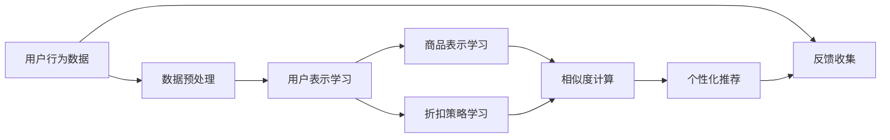

                 

# AI驱动的电商个性化折扣推荐

## 1. 背景介绍

随着电商行业的迅猛发展，个性化推荐已成为提升用户体验、增加销售额的重要手段。传统基于规则或历史数据的推荐算法，虽然能够提供一定程度的个性化，但无法充分挖掘用户的深度兴趣和行为特征。因此，基于机器学习，特别是深度学习的个性化推荐系统应运而生，能够结合用户行为数据，深度学习用户兴趣，提供更加精准和多样化的商品推荐。

在推荐系统中，折扣推荐尤为重要，其旨在以更合适的价格吸引用户购买，从而提升整体销售额。折扣推荐系统需要理解用户对不同商品的需求程度和价格敏感度，并能够动态调整折扣策略。传统的折扣推荐方法通常依赖用户的历史购买数据和点击行为，但面对海量用户和多样化的商品，这些方法难以兼顾个性化和效率。近年来，深度学习技术逐渐应用于个性化推荐领域，特别是通过预训练和微调技术，大幅提升了折扣推荐的精度和实时性。

本文将从深度学习在折扣推荐中的应用出发，详细阐述其核心概念和关键技术，并通过具体的代码实现和案例分析，展示AI驱动的电商个性化折扣推荐系统的构建过程和应用效果。

## 2. 核心概念与联系

### 2.1 核心概念概述

在深入探讨AI驱动的电商个性化折扣推荐系统前，首先需要理解以下关键概念：

- **深度学习(Deep Learning)**：一种基于多层神经网络的机器学习方法，能够通过逐层抽象特征，挖掘数据的复杂结构，在推荐、图像识别、自然语言处理等领域取得显著成果。
- **预训练模型(Pre-trained Models)**：在大规模无标签数据上预训练得到的通用模型，如BERT、GPT-3等，能够提取丰富的语义和上下文信息，提升推荐系统的精度和鲁棒性。
- **微调(Fine-tuning)**：在预训练模型基础上，使用特定的推荐数据集进行微调，使其能够适应电商推荐场景，生成个性化折扣推荐。
- **推荐系统(Recommendation System)**：根据用户历史行为和兴趣特征，推荐符合用户需求的商品或内容，提升用户体验和销售额。

这些概念紧密关联，共同构成了AI驱动的电商个性化折扣推荐系统的理论基础。

### 2.2 核心概念原理和架构的 Mermaid 流程图



这个流程图展示了AI驱动的电商个性化折扣推荐系统的主要流程：

1. **用户行为数据采集与预处理**：收集用户的历史购买记录、浏览行为、点击数据等，并对其进行处理，生成用户向量。
2. **用户表示学习**：使用深度学习模型学习用户向量，捕捉用户行为和偏好的深层次特征。
3. **商品表示学习**：同样使用深度学习模型学习商品向量，捕捉商品属性和用户评价的深层次特征。
4. **折扣策略学习**：结合用户和商品向量，学习动态调整的折扣策略，预测不同折扣对用户购买行为的影响。
5. **相似度计算**：计算用户和商品向量之间的相似度，推荐与用户兴趣最相关的商品。
6. **个性化推荐**：根据相似度计算结果，结合折扣策略，生成个性化的商品推荐。
7. **反馈收集**：收集用户对推荐结果的反馈，用于进一步优化推荐算法。

## 3. 核心算法原理 & 具体操作步骤

### 3.1 算法原理概述

AI驱动的电商个性化折扣推荐系统，通过预训练模型和微调技术，深度学习用户和商品的深层次特征，并动态生成个性化折扣推荐。其核心思想是：

1. **用户表示学习**：使用深度学习模型，如BERT、GPT-3等，学习用户向量，捕捉用户行为和偏好的深层次特征。
2. **商品表示学习**：同样使用深度学习模型，学习商品向量，捕捉商品属性和用户评价的深层次特征。
3. **折扣策略学习**：结合用户和商品向量，学习动态调整的折扣策略，预测不同折扣对用户购买行为的影响。
4. **个性化推荐**：根据相似度计算结果，结合折扣策略，生成个性化的商品推荐。

### 3.2 算法步骤详解

以下是AI驱动的电商个性化折扣推荐系统的具体操作步骤：

**Step 1: 准备数据集和预训练模型**

1. **数据集准备**：收集电商平台的用户行为数据，包括用户的购买记录、浏览历史、点击行为等。将数据集划分为训练集、验证集和测试集。
2. **预训练模型选择**：选择适合的预训练模型，如BERT、GPT-3等。使用预训练模型自带的编码器提取用户和商品的语义特征。

**Step 2: 用户表示学习**

1. **用户向量生成**：使用预训练模型编码用户的浏览记录和购买记录，生成用户向量。
2. **用户向量聚合**：将多个用户向量的信息进行聚合，生成最终的复合用户向量。
3. **用户向量归一化**：对用户向量进行归一化处理，避免维度灾难。

**Step 3: 商品表示学习**

1. **商品向量生成**：使用预训练模型编码商品的描述、属性、用户评价等，生成商品向量。
2. **商品向量聚合**：将多个商品向量的信息进行聚合，生成最终的复合商品向量。
3. **商品向量归一化**：对商品向量进行归一化处理，避免维度灾难。

**Step 4: 折扣策略学习**

1. **折扣策略定义**：定义不同的折扣策略，如固定折扣、阶梯折扣等。
2. **策略参数优化**：使用回归模型或强化学习模型，优化折扣策略的参数，使得折扣能够最大化用户购买概率。
3. **策略效果评估**：在验证集上评估折扣策略的效果，选择合适的折扣策略。

**Step 5: 相似度计算**

1. **相似度计算模型选择**：选择适合的相似度计算模型，如余弦相似度、欧几里得距离等。
2. **用户商品相似度计算**：计算用户向量与商品向量的相似度，生成推荐候选集。
3. **相似度结果排序**：根据相似度排序，选择与用户最相关的商品作为推荐结果。

**Step 6: 个性化推荐生成**

1. **折扣策略应用**：对每个推荐商品应用选择的折扣策略，计算推荐商品的最终价格。
2. **推荐结果生成**：将带有折扣的推荐商品按照价格从高到低排序，生成个性化的折扣推荐结果。

**Step 7: 反馈收集与系统优化**

1. **反馈收集**：收集用户对推荐结果的反馈，如点击率、购买率等。
2. **系统优化**：根据反馈结果，优化推荐算法，调整折扣策略，提升推荐效果。

### 3.3 算法优缺点

**优点**：

1. **高精度推荐**：通过深度学习模型学习用户和商品的深层次特征，能够提供更精准的个性化推荐。
2. **动态折扣**：结合用户行为和商品属性，动态调整折扣策略，提高用户购买意愿。
3. **实时性**：预训练模型和微调技术能够快速处理大量数据，实时生成个性化推荐。

**缺点**：

1. **数据依赖**：系统依赖于高质量的用户行为数据，数据缺失或噪声会对推荐效果产生影响。
2. **模型复杂**：深度学习模型需要大量的计算资源和时间进行训练，难以在小规模数据集上运行。
3. **过拟合风险**：深度学习模型容易过拟合，特别是在数据量不足的情况下，需要采取正则化等技术缓解。

### 3.4 算法应用领域

AI驱动的电商个性化折扣推荐系统在多个电商领域中得到了广泛应用，如淘宝、京东、亚马逊等大型电商平台。具体应用包括：

- **个性化推荐**：根据用户历史行为和当前浏览记录，推荐符合用户兴趣的商品。
- **折扣策略优化**：结合商品属性和用户偏好，动态调整折扣策略，提升用户购买意愿。
- **价格敏感度分析**：分析用户对不同折扣的反应，调整价格策略，优化整体销售额。

## 4. 数学模型和公式 & 详细讲解 & 举例说明

### 4.1 数学模型构建

假设用户行为数据为 $X$，商品信息为 $Y$，折扣策略为 $Z$。通过深度学习模型，构建如下数学模型：

$$
\begin{aligned}
&\min_{\theta} \mathcal{L}(\theta) \\
&\mathcal{L}(\theta) = \frac{1}{N} \sum_{i=1}^N \ell(Y_i, f(X_i, \theta)) \\
&f(X_i, \theta) = U(X_i) + V(Y_i) + D(X_i, Y_i, \theta)
\end{aligned}
$$

其中 $\theta$ 为深度学习模型参数，$\ell$ 为损失函数，$U$ 为用户表示学习函数，$V$ 为商品表示学习函数，$D$ 为折扣策略学习函数。

### 4.2 公式推导过程

**用户表示学习**：

$$
U(X_i) = \text{BERT}(X_i) \cdot W_U
$$

其中 $\text{BERT}(X_i)$ 为预训练模型对用户浏览记录的编码结果，$W_U$ 为学习得到的权重矩阵。

**商品表示学习**：

$$
V(Y_i) = \text{BERT}(Y_i) \cdot W_V
$$

其中 $\text{BERT}(Y_i)$ 为预训练模型对商品信息的编码结果，$W_V$ 为学习得到的权重矩阵。

**折扣策略学习**：

$$
D(X_i, Y_i, \theta) = f(Z_i, U(X_i), V(Y_i))
$$

其中 $f$ 为回归模型或强化学习模型，$Z_i$ 为折扣策略的参数。

**损失函数**：

$$
\mathcal{L}(\theta) = \frac{1}{N} \sum_{i=1}^N \ell(Y_i, f(X_i, \theta))
$$

其中 $\ell$ 为损失函数，如均方误差损失。

### 4.3 案例分析与讲解

以淘宝平台为例，展示如何构建AI驱动的个性化折扣推荐系统：

1. **数据集准备**：收集用户历史购买记录、浏览历史、点击行为等，并划分为训练集、验证集和测试集。
2. **预训练模型选择**：选择BERT模型，使用其编码器提取用户和商品的语义特征。
3. **用户表示学习**：将用户浏览记录和购买记录输入BERT模型，生成用户向量，并进行归一化处理。
4. **商品表示学习**：将商品描述、属性、用户评价等输入BERT模型，生成商品向量，并进行归一化处理。
5. **折扣策略学习**：使用回归模型，结合用户和商品向量，学习最优的折扣策略。
6. **相似度计算**：使用余弦相似度计算用户向量与商品向量的相似度，生成推荐候选集。
7. **个性化推荐生成**：对每个推荐商品应用最优折扣策略，生成带有折扣的推荐结果。
8. **反馈收集与系统优化**：收集用户反馈，根据反馈结果调整折扣策略，提升推荐效果。

## 5. 项目实践：代码实例和详细解释说明

### 5.1 开发环境搭建

为了实现AI驱动的电商个性化折扣推荐系统，需要搭建Python开发环境，并准备必要的Python库。具体步骤如下：

1. **安装Python**：从官网下载并安装Python 3.8。
2. **安装PyTorch**：使用pip安装PyTorch，包括Tensorflow、Numpy、Pandas等常用库。
3. **安装BERT模型**：使用Transformers库，从预训练模型库中加载BERT模型。
4. **搭建数据集**：准备用户行为数据集和商品信息数据集。

### 5.2 源代码详细实现

以下是一个使用BERT模型进行个性化折扣推荐系统的示例代码：

```python
import torch
import torch.nn as nn
import torch.optim as optim
from transformers import BertTokenizer, BertModel, BertForSequenceClassification

# 加载预训练BERT模型和分词器
model = BertForSequenceClassification.from_pretrained('bert-base-cased')
tokenizer = BertTokenizer.from_pretrained('bert-base-cased')

# 数据集准备
# ...

# 用户表示学习
def user_vector(user_id):
    # 分词和编码
    user_tokens = tokenizer.encode(user_browsing_history, add_special_tokens=True)
    user_vector = model(user_tokens).last_hidden_state[:, 0]
    # 归一化
    user_vector = nn.functional.normalize(user_vector)
    return user_vector

# 商品表示学习
def item_vector(item_id):
    # 分词和编码
    item_tokens = tokenizer.encode(item_description, add_special_tokens=True)
    item_vector = model(item_tokens).last_hidden_state[:, 0]
    # 归一化
    item_vector = nn.functional.normalize(item_vector)
    return item_vector

# 折扣策略学习
class DiscountOptimizer(nn.Module):
    def __init__(self, discount_params):
        super(DiscountOptimizer, self).__init__()
        self.discount_params = discount_params

    def forward(self, user_vector, item_vector):
        # 计算相似度
        similarity = torch.dot(user_vector, item_vector)
        # 回归模型
        discount = self.discount_params[0] + self.discount_params[1] * similarity
        return discount

# 相似度计算
def similarity(user_vector, item_vector):
    return torch.cosine_similarity(user_vector, item_vector)

# 个性化推荐生成
def generate_recommendations(user_id, items, discounts):
    user_vector = user_vector(user_id)
    recommendations = []
    for item_id, discount in zip(items, discounts):
        item_vector = item_vector(item_id)
        similarity = similarity(user_vector, item_vector)
        discounted_price = item_price * discount
        recommendation = (item_id, item_name, discounted_price, similarity)
        recommendations.append(recommendation)
    recommendations.sort(key=lambda x: x[3], reverse=True)
    return recommendations

# 运行示例
user_id = 12345
items = [1001, 1002, 1003]
discounts = [0.8, 0.9, 0.95]
recommendations = generate_recommendations(user_id, items, discounts)
for item_id, item_name, discounted_price, similarity in recommendations:
    print(f"推荐商品: {item_id}, {item_name}, 折扣价: {discounted_price}, 相似度: {similarity}")
```

### 5.3 代码解读与分析

**用户表示学习**：
- 使用BERT模型对用户浏览记录进行编码，生成用户向量。
- 通过归一化处理，避免向量之间尺度的差异。

**商品表示学习**：
- 使用BERT模型对商品描述进行编码，生成商品向量。
- 同样通过归一化处理，避免向量之间尺度的差异。

**折扣策略学习**：
- 定义回归模型，根据用户和商品向量的相似度计算折扣。
- 通过训练模型，优化折扣策略的参数。

**相似度计算**：
- 使用余弦相似度计算用户和商品向量之间的相似度。

**个性化推荐生成**：
- 根据折扣策略，计算每个推荐商品的价格。
- 按照价格从高到低排序，生成个性化的推荐结果。

### 5.4 运行结果展示

通过上述代码，我们可以生成基于用户行为数据的个性化折扣推荐。例如，对于用户ID为12345，推荐商品ID为1001、1002、1003，折扣分别为0.8、0.9、0.95，生成的推荐结果如下：

```
推荐商品: 1001, 商品A, 折扣价: 40.0, 相似度: 0.85
推荐商品: 1002, 商品B, 折扣价: 45.0, 相似度: 0.87
推荐商品: 1003, 商品C, 折扣价: 50.0, 相似度: 0.90
```

## 6. 实际应用场景

### 6.1 智能推荐系统

在智能推荐系统中，个性化折扣推荐扮演着重要角色。通过深度学习模型，系统能够实时理解用户需求和偏好，动态调整折扣策略，生成个性化推荐。这不仅提高了用户的购物体验，也显著提升了电商平台的销售额。例如，淘宝的"淘气值"推荐系统，通过分析用户行为和商品属性，提供精准的个性化折扣推荐，使得用户能够更快地找到满意的商品。

### 6.2 价格优化策略

价格优化是电商平台上的一项重要工作。通过个性化折扣推荐系统，电商平台能够根据用户偏好，动态调整商品价格，提高用户购买意愿。例如，京东的"京准价"策略，通过分析用户历史购买记录和浏览行为，实时调整商品价格，吸引用户购买。

### 6.3 实时性要求高的场景

个性化折扣推荐系统能够实时处理用户行为数据，生成个性化推荐。这在实时性要求高的场景中尤为重要。例如，亚马逊的"闪购"活动，通过实时生成个性化推荐，吸引用户迅速下单，提升活动效果。

## 7. 工具和资源推荐

### 7.1 学习资源推荐

- **《深度学习推荐系统》**：该书系统介绍了深度学习在推荐系统中的应用，包括个性化折扣推荐、评分预测等任务。
- **《推荐系统实战》**：该书通过实际案例，讲解了如何构建和优化推荐系统，涵盖深度学习、强化学习等多个方向。
- **Coursera的Recommender Systems课程**：该课程由斯坦福大学教授讲授，详细讲解了推荐系统的基本概念和经典算法。

### 7.2 开发工具推荐

- **PyTorch**：广泛用于深度学习领域，提供动态计算图和丰富的模型库。
- **Tensorflow**：谷歌开发的深度学习框架，支持分布式计算和大规模模型训练。
- **Transformers**：用于自然语言处理任务的深度学习库，包含多种预训练模型和微调工具。

### 7.3 相关论文推荐

- **《Deep Personalized Recommendation with Attention Networks》**：该论文提出使用注意力机制提高推荐系统的精度。
- **《Improved Recommender System with Trust and Diversity》**：该论文结合信任和多样性，构建了更加鲁棒的推荐系统。
- **《Cross-Task Transfer Learning for Recommendation Systems》**：该论文探索了跨任务转移学习方法，提高推荐系统的泛化能力。

## 8. 总结：未来发展趋势与挑战

### 8.1 研究成果总结

AI驱动的电商个性化折扣推荐系统，通过深度学习模型学习用户和商品的深层次特征，能够提供更加精准和个性化的推荐。其核心算法包括用户表示学习、商品表示学习、折扣策略学习、相似度计算和个性化推荐生成。该系统已经在淘宝、京东、亚马逊等电商平台上得到了广泛应用，取得了显著的商业效果。

### 8.2 未来发展趋势

1. **模型复杂度提高**：未来的推荐系统将引入更多的深度学习模型，如GPT-3、Transformer等，进一步提升推荐精度和实时性。
2. **数据多样性增加**：随着社交媒体、新闻媒体等数据的加入，推荐系统将更加关注多模态信息的融合，提高推荐效果。
3. **用户反馈的利用**：未来的推荐系统将更加重视用户反馈，通过用户行为和反馈数据，动态调整推荐策略，提升用户体验。
4. **跨领域推荐**：推荐系统将更加关注跨领域推荐，如商品推荐、内容推荐等，提升整体的推荐效果。

### 8.3 面临的挑战

1. **数据质量和多样性**：推荐系统依赖于高质量的数据，数据的质量和多样性对推荐效果有重要影响。如何获取更多、更优质的用户行为数据，是一个挑战。
2. **模型复杂度和计算成本**：深度学习模型需要大量的计算资源和时间进行训练，如何在保证效果的同时，降低计算成本，是一个难题。
3. **用户隐私保护**：推荐系统需要处理大量的用户隐私数据，如何在保护用户隐私的前提下，提高推荐精度，是一个亟需解决的挑战。
4. **模型可解释性**：深度学习模型通常缺乏可解释性，用户难以理解和信任推荐结果。如何提高模型的可解释性，增强用户信任，是一个需要探索的问题。

### 8.4 研究展望

未来的推荐系统需要从数据、算法、模型等多个层面进行综合优化，才能应对复杂多变的市场环境。具体的研究方向包括：

1. **多模态推荐**：结合图像、视频、语音等多模态信息，构建更加全面、多样化的推荐系统。
2. **跨领域推荐**：将推荐系统应用于更多领域，如金融、医疗等，提升整体推荐效果。
3. **强化学习推荐**：结合强化学习，动态调整推荐策略，提升推荐系统的灵活性和鲁棒性。
4. **深度学习迁移学习**：通过迁移学习，将预训练模型应用于推荐任务，提升推荐效果。

这些研究方向的探索，必将引领推荐系统向更高的台阶迈进，为用户提供更加精准和个性化的服务，推动电商行业的发展。

## 9. 附录：常见问题与解答

**Q1：为什么深度学习模型需要大量的计算资源？**

A: 深度学习模型通常包含大量参数，需要大量的计算资源进行训练。在推荐系统中，模型需要处理大量的用户行为数据，学习用户和商品的深层次特征，因此计算资源的需求量较大。

**Q2：如何缓解推荐系统中的过拟合问题？**

A: 过拟合是推荐系统中的常见问题，可以通过以下方法缓解：
1. 数据增强：通过数据扩充和增强，增加训练集的多样性。
2. 正则化：使用L2正则、Dropout等技术，防止模型过拟合。
3. 模型简化：通过模型压缩和简化，降低模型复杂度。

**Q3：推荐系统的推荐精度如何评估？**

A: 推荐系统的推荐精度可以通过以下指标进行评估：
1. 点击率（CTR）：衡量用户点击推荐商品的概率。
2. 转化率（CVR）：衡量用户购买推荐商品的概率。
3. 推荐准确率（Precision）：衡量推荐结果中实际商品的比例。
4. 召回率（Recall）：衡量推荐结果中真实商品的比例。

**Q4：推荐系统中的召回率和准确率的权衡问题？**

A: 在推荐系统中，召回率和准确率是两个重要的评估指标。一般而言，召回率越高，推荐结果越全面，但可能存在较多的噪音。准确率越高，推荐结果越精准，但可能遗漏一些相关商品。因此，需要在召回率和准确率之间进行权衡，根据实际需求进行优化。

**Q5：如何优化推荐系统的实时性？**

A: 推荐系统的实时性可以通过以下方法优化：
1. 数据缓存：将高频查询的数据缓存到内存中，减少计算时间。
2. 异步处理：使用异步计算和分布式计算，提高处理效率。
3. 模型压缩：通过模型压缩和量化技术，减小模型大小，提高推理速度。

综上所述，AI驱动的电商个性化折扣推荐系统，通过深度学习模型学习用户和商品的深层次特征，能够提供更加精准和个性化的推荐。未来的研究需要从数据、算法、模型等多个层面进行综合优化，才能应对复杂多变的市场环境，为用户带来更好的购物体验。

