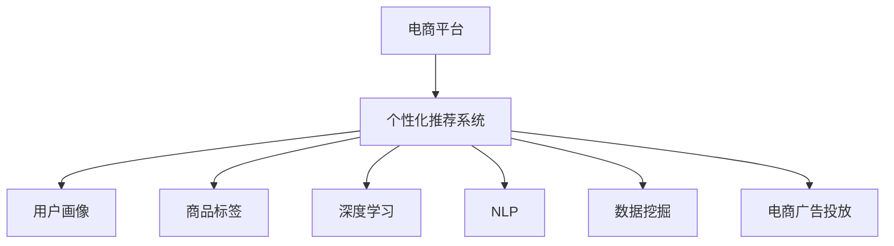

                 

# AI驱动的电商平台个性化促销策略

> 关键词：AI个性化推荐, 电商平台, 深度学习, 电商数据挖掘, 广告投放优化, 用户行为分析

## 1. 背景介绍

### 1.1 问题由来
随着互联网电商的迅猛发展，线上购物已成为越来越多消费者的主流选择。电商平台通过推荐算法，为消费者提供个性化的购物建议，提升了用户体验和购买转化率。但传统推荐算法通常采用静态的特征工程，缺乏对用户动态行为和环境变化的响应能力。因此，电商平台需要一种动态、个性化的推荐策略，以进一步提升推荐效果。

### 1.2 问题核心关键点
电商平台的个性化促销策略的核心在于通过数据分析，准确预测用户的购物需求，并根据需求推荐最合适的产品或服务。其中，用户行为数据的深度学习模型、商品属性的全面标注、广告投放的优化算法、用户画像的动态更新等环节是关键。

### 1.3 问题研究意义
研究AI驱动的电商平台个性化促销策略，对于提升电商平台的用户体验和经营效益，具有重要意义：

1. 提升用户转化率。个性化推荐能够精准捕捉用户兴趣，提高购物体验和满意度，从而提升购买转化率。
2. 优化库存管理。通过精准的销售预测，电商平台能够更合理地安排库存，避免缺货或过剩。
3. 提高营销效果。个性化广告投放能够更精准地触达目标用户，提升广告的点击率和转化率。
4. 推动用户增长。通过个性化策略的实施，电商平台可以吸引更多潜在用户，提升用户粘性和忠诚度。
5. 增强竞争优势。个性化促销策略能够帮助电商平台在激烈的市场竞争中脱颖而出，实现差异化经营。

## 2. 核心概念与联系

### 2.1 核心概念概述

为更好地理解AI驱动的电商平台个性化促销策略，本节将介绍几个密切相关的核心概念：

- **电商平台**：在线销售商品和服务的商业平台，如淘宝、京东、亚马逊等。
- **个性化推荐系统**：根据用户历史行为、偏好和实时数据，向用户推荐其可能感兴趣的商品的系统。
- **用户画像**：通过数据挖掘和机器学习，对用户行为、兴趣和属性进行建模，以生成用户全息画像。
- **商品标签**：对商品属性和特征进行分类和标注，以便推荐系统进行匹配和推荐。
- **深度学习**：利用神经网络模型，通过大量数据进行学习和训练，实现对复杂非线性关系的建模和预测。
- **自然语言处理(NLP)**：使计算机能够理解、处理和生成自然语言的技术，应用于用户评论、广告语义等文本数据。
- **数据挖掘**：通过算法和模型，从大量数据中挖掘出有用的信息和知识，如用户行为模式、市场趋势等。
- **电商广告投放**：通过AI算法，对广告进行优化投放，最大化广告效果和用户转化。

这些核心概念之间的逻辑关系可以通过以下Mermaid流程图来展示：



这个流程图展示了个性化促销策略的关键组件及其之间的关系：

1. 电商平台通过个性化推荐系统向用户推荐商品。
2. 用户画像和商品标签是推荐系统的基础输入。
3. 深度学习和大数据技术用于建模用户行为和商品属性。
4. NLP技术处理和理解用户评论、广告语义等文本数据。
5. 数据挖掘技术从用户数据和市场数据中挖掘出有价值的信息。
6. 电商广告投放优化算法基于推荐结果和用户画像，实现广告的精准投放。

这些核心概念共同构成了电商平台个性化促销策略的技术框架，使其能够实现动态、个性化的推荐和广告投放。

## 3. 核心算法原理 & 具体操作步骤
### 3.1 算法原理概述

AI驱动的电商平台个性化促销策略，本质上是将深度学习、自然语言处理、数据挖掘等技术融合于推荐系统和广告投放中，以实现动态、精准的用户推荐和广告投放。其核心思想是：

1. **用户行为数据分析**：通过深度学习模型，分析用户的历史行为和偏好，生成用户画像。
2. **商品属性匹配**：利用商品标签，对商品进行属性标注，建立商品与用户画像的匹配关系。
3. **推荐模型训练**：基于用户画像和商品标签，训练推荐模型，预测用户对各个商品的兴趣程度。
4. **广告投放优化**：利用推荐结果和用户画像，进行广告的优化投放，提升广告效果和用户转化率。
5. **动态更新**：根据用户实时行为和市场变化，动态更新用户画像和推荐模型，保持推荐的精准性和时效性。

### 3.2 算法步骤详解

基于上述核心思想，AI驱动的电商平台个性化促销策略主要包括以下几个关键步骤：

**Step 1: 数据准备和预处理**
- 收集用户行为数据、商品数据、广告数据等，并进行数据清洗、去重和归一化。
- 对商品进行属性标注，生成商品标签。
- 对用户评论、广告语义等文本数据进行分词、去停用词等预处理操作。

**Step 2: 用户画像构建**
- 通过深度学习模型，如用户嵌入模型，对用户历史行为数据进行建模，生成用户画像向量。
- 利用用户画像向量，建立用户画像档案，包括用户基本信息、行为特征、兴趣偏好等。

**Step 3: 推荐模型训练**
- 选择合适的推荐模型，如基于矩阵分解的推荐系统、基于深度学习的序列推荐系统等。
- 利用用户画像和商品标签，对推荐模型进行训练，输出用户对各个商品的兴趣度评分。
- 对推荐模型进行调参优化，提升推荐效果。

**Step 4: 广告投放优化**
- 利用推荐结果和用户画像，进行广告的优化投放。
- 根据用户画像和行为数据，设置广告投放策略，如定向投放、预算控制等。
- 利用广告效果反馈数据，不断优化广告投放策略。

**Step 5: 动态更新**
- 根据用户实时行为和市场变化，动态更新用户画像和推荐模型。
- 定期重新训练推荐模型，以适应新的市场趋势和用户行为。

### 3.3 算法优缺点

AI驱动的电商平台个性化促销策略具有以下优点：
1. 高精度推荐。深度学习模型能够捕捉用户行为中的复杂非线性关系，实现高精度的用户兴趣预测。
2. 精准广告投放。利用用户画像和行为数据，实现广告的精准投放，提升广告效果和用户转化率。
3. 动态适应性。通过动态更新用户画像和推荐模型，保持推荐的精准性和时效性。
4. 自动化优化。自动化推荐和广告投放策略，节省人力成本，提升运营效率。
5. 用户粘性提升。个性化的推荐和广告，提升用户体验和满意度，增加用户粘性和忠诚度。

同时，该策略也存在一些局限性：
1. 数据需求量大。深度学习模型需要大量的用户行为数据和商品属性数据，数据获取成本较高。
2. 模型复杂度高。深度学习模型计算复杂度高，对硬件资源要求较高。
3. 隐私保护问题。用户行为数据的收集和处理可能涉及用户隐私问题，需要严格遵守数据保护法规。
4. 高维稀疏性。电商平台商品种类繁多，商品标签维度高，存在高维稀疏性问题，需要优化模型和算法。
5. 广告投放风险。不当的广告投放可能引起用户反感，影响用户体验和品牌形象。

尽管存在这些局限性，但AI驱动的电商平台个性化促销策略仍是当前电商推荐和广告投放的主流技术范式，能够显著提升电商平台的推荐效果和广告效益。

### 3.4 算法应用领域

AI驱动的电商平台个性化促销策略在多个电商领域得到广泛应用，例如：

- 推荐系统：根据用户历史行为和偏好，向用户推荐商品。
- 广告投放：利用用户画像和行为数据，实现广告的精准投放。
- 销售预测：基于历史销售数据，预测未来销售趋势，优化库存管理。
- 用户增长：通过个性化推荐和广告，吸引新用户，提升用户粘性和忠诚度。
- 智能客服：根据用户对话记录，推荐相关产品，提升客服效率。
- 风险控制：通过用户行为分析，识别异常交易，降低平台风险。

除了上述这些常见应用外，AI驱动的个性化促销策略还被创新性地应用到更多场景中，如个性化内容推荐、动态定价策略、实时推荐算法等，为电商平台的业务创新提供了新的思路。

## 4. 数学模型和公式 & 详细讲解 & 举例说明

### 4.1 数学模型构建

为了更好地理解AI驱动的电商平台个性化促销策略，本节将介绍几个核心数学模型和公式。

**用户画像模型**
用户画像模型 $P_{user}$ 可以表示为向量形式，其中每个维度代表一个用户特征，向量值表示该特征的值。数学上可以表示为：

$$ P_{user} = [f_1(x), f_2(x), \ldots, f_n(x)] $$

其中 $f_i$ 为特征函数，$x$ 为用户的历史行为数据。

**推荐模型**
推荐模型 $M_{item}$ 可以表示为一个线性模型，其中 $w$ 为模型参数，$x_i$ 为商品的属性向量，$y_i$ 为推荐结果：

$$ y_i = \sum_{j=1}^d w_j \cdot x_{ij} $$

其中 $d$ 为商品属性维度，$x_{ij}$ 为商品属性 $j$ 的值。

**广告投放模型**
广告投放模型 $C_{ad}$ 可以表示为一个二元分类模型，其中 $w$ 为模型参数，$x_a$ 为广告的属性向量，$y_a$ 为广告投放结果：

$$ y_a = sigmoid(\sum_{j=1}^d w_j \cdot x_{aj}) $$

其中 $sigmoid$ 为逻辑回归函数，将广告属性转化为二元输出。

### 4.2 公式推导过程

以下我们以用户画像模型和推荐模型为例，推导其数学公式。

**用户画像模型**
用户画像模型 $P_{user}$ 的推导基于用户历史行为数据 $X$，假设用户历史行为可以表示为一个矩阵 $X = [x_1, x_2, \ldots, x_n]$，其中每一行代表一个用户，每一列代表一个时间点。用户画像向量 $P_{user}$ 可以表示为：

$$ P_{user} = W^T X $$

其中 $W$ 为模型参数矩阵。通过对矩阵 $X$ 进行主成分分析(PCA)等降维技术，可以得到用户画像向量 $P_{user}$，表示用户的特征和偏好。

**推荐模型**
推荐模型 $M_{item}$ 的推导基于用户画像模型 $P_{user}$ 和商品属性向量 $X_{item}$，假设商品属性可以表示为一个矩阵 $X_{item} = [x_{i1}, x_{i2}, \ldots, x_{id}]$，其中每一行代表一个商品，每一列代表一个属性。推荐结果 $y$ 可以表示为：

$$ y = P_{user}^T \cdot X_{item} \cdot W $$

其中 $W$ 为推荐模型参数矩阵。通过对矩阵 $X_{item}$ 进行归一化处理，可以使得推荐结果更加合理。

**广告投放模型**
广告投放模型 $C_{ad}$ 的推导基于广告属性向量 $X_{ad}$，假设广告属性可以表示为一个矩阵 $X_{ad} = [x_{a1}, x_{a2}, \ldots, x_{ad}]$，其中每一行代表一个广告，每一列代表一个属性。广告投放结果 $y_a$ 可以表示为：

$$ y_a = sigmoid(P_{user}^T \cdot X_{ad} \cdot W_a) $$

其中 $W_a$ 为广告投放模型参数矩阵。通过对矩阵 $X_{ad}$ 进行正则化处理，可以避免过拟合，提升广告投放效果。

### 4.3 案例分析与讲解

**案例：电商平台个性化推荐系统**

假设某电商平台有用户 $U = \{u_1, u_2, \ldots, u_m\}$ 和商品 $I = \{i_1, i_2, \ldots, i_n\}$，用户历史行为数据 $X$ 和商品属性数据 $X_{item}$ 已知。

1. 利用用户历史行为数据 $X$ 训练用户画像模型 $P_{user}$，得到用户画像向量。
2. 利用商品属性数据 $X_{item}$ 训练推荐模型 $M_{item}$，得到商品推荐向量。
3. 根据用户画像向量 $P_{user}$ 和商品推荐向量 $M_{item}$，计算推荐结果。
4. 根据推荐结果，选择最优商品进行推荐。

**案例：电商平台广告投放系统**

假设某电商平台有广告 $A = \{a_1, a_2, \ldots, a_m\}$ 和广告属性数据 $X_{ad}$ 已知。

1. 利用用户画像模型 $P_{user}$ 和广告属性数据 $X_{ad}$ 训练广告投放模型 $C_{ad}$，得到广告投放概率。
2. 根据广告投放概率 $y_a$ 进行广告的优化投放，选择最优广告进行展示。
3. 根据广告展示效果，不断优化广告投放模型 $C_{ad}$，提升广告效果和用户转化率。

## 5. 项目实践：代码实例和详细解释说明

### 5.1 开发环境搭建

在进行AI驱动的电商平台个性化促销策略实践前，我们需要准备好开发环境。以下是使用Python进行TensorFlow和Keras开发的环境配置流程：

1. 安装Anaconda：从官网下载并安装Anaconda，用于创建独立的Python环境。

2. 创建并激活虚拟环境：
```bash
conda create -n tf-env python=3.8 
conda activate tf-env
```

3. 安装TensorFlow和Keras：
```bash
pip install tensorflow==2.6
pip install keras==2.6.0
```

4. 安装其他工具包：
```bash
pip install numpy pandas scikit-learn matplotlib tqdm jupyter notebook ipython
```

完成上述步骤后，即可在`tf-env`环境中开始AI驱动的个性化促销策略实践。

### 5.2 源代码详细实现

这里我们以用户画像和推荐系统的实现为例，给出使用TensorFlow和Keras进行电商推荐系统的PyTorch代码实现。

首先，定义用户画像模型和推荐模型的数据处理函数：

```python
import tensorflow as tf
from tensorflow.keras import layers

class UserEmbeddingModel(tf.keras.Model):
    def __init__(self, embedding_dim=128):
        super(UserEmbeddingModel, self).__init__()
        self.dense = layers.Dense(embedding_dim, activation='relu')
        
    def call(self, inputs):
        x = self.dense(inputs)
        return x

class ItemEmbeddingModel(tf.keras.Model):
    def __init__(self, embedding_dim=128):
        super(ItemEmbeddingModel, self).__init__()
        self.dense = layers.Dense(embedding_dim, activation='relu')
        
    def call(self, inputs):
        x = self.dense(inputs)
        return x

# 定义推荐模型
class Recommender(tf.keras.Model):
    def __init__(self, user_dim, item_dim, num_factors=10, embedding_dim=128):
        super(Recommender, self).__init__()
        self.user_embedding = UserEmbeddingModel(user_dim, embedding_dim)
        self.item_embedding = ItemEmbeddingModel(item_dim, embedding_dim)
        self.dot_product = layers.Dot(axes=[-1, -1], normalize=True)
        
    def call(self, inputs):
        user_embeddings = self.user_embedding(inputs[0])
        item_embeddings = self.item_embedding(inputs[1])
        scores = self.dot_product([user_embeddings, item_embeddings])
        return scores
```

然后，定义推荐系统的训练函数：

```python
def train_recommender(model, user_data, item_data, learning_rate=0.001, epochs=10, batch_size=64):
    user_embeddings = user_data
    item_embeddings = item_data
    optimizer = tf.keras.optimizers.Adam(learning_rate)
    
    for epoch in range(epochs):
        for i in range(0, user_data.shape[0], batch_size):
            batch_user = user_data[i:i+batch_size]
            batch_item = item_data[i:i+batch_size]
            with tf.GradientTape() as tape:
                predictions = model([batch_user, batch_item])
                loss = tf.keras.losses.MSE(batch_predictions, predictions)
            gradients = tape.gradient(loss, model.trainable_variables)
            optimizer.apply_gradients(zip(gradients, model.trainable_variables))
            print(f"Epoch {epoch+1}, loss: {loss:.4f}")
```

最后，启动训练流程：

```python
# 构建用户画像和推荐模型
user_model = UserEmbeddingModel(user_dim, embedding_dim)
item_model = ItemEmbeddingModel(item_dim, embedding_dim)
recommender = Recommender(user_dim, item_dim, embedding_dim)

# 加载用户数据和商品数据
user_data = ...
item_data = ...

# 训练推荐模型
train_recommender(recommender, user_data, item_data, learning_rate=0.001, epochs=10, batch_size=64)
```

以上就是使用TensorFlow和Keras进行电商推荐系统的完整代码实现。可以看到，得益于TensorFlow和Keras的强大封装，我们可以用相对简洁的代码完成用户画像和推荐模型的训练。

### 5.3 代码解读与分析

让我们再详细解读一下关键代码的实现细节：

**UserEmbeddingModel类**：
- `__init__`方法：定义用户画像模型的维度。
- `call`方法：对用户历史行为数据进行编码，生成用户画像向量。

**ItemEmbeddingModel类**：
- `__init__`方法：定义商品属性模型的维度。
- `call`方法：对商品属性数据进行编码，生成商品嵌入向量。

**Recommender类**：
- `__init__`方法：初始化用户嵌入模型、商品嵌入模型和推荐矩阵。
- `call`方法：计算用户和商品的相似度得分。

**训练函数train_recommender**：
- 循环训练epochs轮，每次迭代处理一个batch的训练数据。
- 计算预测得分和真实标签的均方误差，反向传播更新模型参数。
- 打印每轮训练的损失值。

**启动训练流程**：
- 构建用户画像和推荐模型。
- 加载用户数据和商品数据。
- 调用训练函数，进行模型训练。

可以看到，TensorFlow和Keras使得电商推荐系统的代码实现变得简洁高效。开发者可以将更多精力放在数据处理、模型改进等高层逻辑上，而不必过多关注底层的实现细节。

当然，工业级的系统实现还需考虑更多因素，如模型的保存和部署、超参数的自动搜索、更灵活的任务适配层等。但核心的推荐范式基本与此类似。

## 6. 实际应用场景
### 6.1 智能客服系统

基于AI驱动的电商平台个性化促销策略，可以构建智能客服系统。传统客服系统往往依赖于规则和知识库，难以处理复杂的用户需求和环境变化。而通过用户画像和推荐模型，可以实时分析用户问题，提供个性化建议，提升客服效率和用户体验。

在技术实现上，可以收集客服历史对话记录，利用深度学习模型训练用户画像模型，动态更新推荐模型。系统根据用户问题，推荐合适的解决方案，并不断优化推荐结果，提高问题解决的准确性和效率。

### 6.2 个性化广告投放

基于AI驱动的个性化促销策略，可以实现广告的精准投放，提升广告效果和用户转化率。

在广告投放时，可以利用用户画像和推荐模型，预测用户对不同广告的兴趣程度，选择最优广告进行展示。同时，根据广告展示效果，不断优化广告投放模型，提高广告点击率和转化率。

### 6.3 个性化推荐系统

基于AI驱动的电商推荐系统，可以提供个性化的商品推荐，提升用户购物体验和满意度。

在推荐系统设计中，可以利用用户画像模型和推荐模型，对用户行为数据和商品属性数据进行建模，生成用户画像和商品推荐向量。系统根据用户画像和推荐向量，选择最合适的商品进行推荐，并不断优化推荐结果，提升推荐精度和用户体验。

### 6.4 未来应用展望

随着AI驱动的电商个性化促销策略的不断演进，其在更多领域的应用前景广阔：

1. 智能内容推荐：结合用户画像和推荐模型，为内容创作者提供个性化推荐，提升内容质量和用户粘性。
2. 实时定价策略：基于销售预测和推荐模型，动态调整商品价格，提升销售效益。
3. 跨平台推荐：实现不同平台间的推荐数据共享和用户画像融合，提升跨平台推荐效果。
4. 电商风控系统：利用用户行为分析，识别异常交易，提升电商平台的安全性和稳定性。
5. 智慧城市应用：将电商推荐技术应用于智慧城市治理，实现智能交通、智慧能源等领域的应用。

随着AI技术的不断进步，电商推荐系统和广告投放策略将在更多领域得到应用，为各行各业带来新的变革和机遇。

## 7. 工具和资源推荐
### 7.1 学习资源推荐

为了帮助开发者系统掌握AI驱动的电商平台个性化促销策略的理论基础和实践技巧，这里推荐一些优质的学习资源：

1. **《深度学习与推荐系统》书籍**：介绍深度学习在推荐系统中的应用，涵盖协同过滤、矩阵分解、深度学习等多种推荐方法。
2. **《广告学：理论与实践》课程**：介绍广告学的基本概念和理论，包括广告投放策略、广告效果评估等。
3. **《自然语言处理》课程**：介绍自然语言处理的基本原理和应用，包括文本分类、情感分析、命名实体识别等。
4. **Kaggle平台**：提供大量推荐系统相关的数据集和比赛，实践AI驱动的个性化促销策略。
5. **GitHub开源项目**：搜索并参考电商推荐系统的开源代码，学习其中的优化策略和实践经验。

通过对这些资源的学习实践，相信你一定能够快速掌握AI驱动的电商平台个性化促销策略的精髓，并用于解决实际的NLP问题。

### 7.2 开发工具推荐

高效的开发离不开优秀的工具支持。以下是几款用于AI驱动的电商平台个性化促销策略开发的常用工具：

1. **TensorFlow**：由Google主导开发的深度学习框架，灵活性高，支持大规模分布式训练。
2. **Keras**：高层神经网络API，易于上手，支持多种深度学习模型。
3. **Scikit-learn**：经典的机器学习库，提供多种数据挖掘和推荐算法。
4. **PyTorch**：灵活的深度学习框架，动态图机制，适合科研和高效开发。
5. **Jupyter Notebook**：交互式开发环境，支持代码编写和数据可视化。
6. **TensorBoard**：深度学习模型的可视化工具，帮助调试和优化模型。

合理利用这些工具，可以显著提升AI驱动的电商平台个性化促销策略的开发效率，加快创新迭代的步伐。

### 7.3 相关论文推荐

AI驱动的电商平台个性化促销策略的研究源于学界的持续探索。以下是几篇奠基性的相关论文，推荐阅读：

1. **《Adaptive Weighted Sampling in Online Ranking》**：提出自适应加权采样方法，解决在线推荐中的数据不平衡问题。
2. **《Deep Reinforcement Learning for Personalized Product Recommendation》**：利用深度强化学习，实现个性化商品推荐。
3. **《Natural Language Processing (NLP) in Recommendation Systems》**：探讨自然语言处理在推荐系统中的应用，包括情感分析、文本匹配等。
4. **《A Survey on Recommendation Systems》**：综述推荐系统的发展历程和应用现状，涵盖协同过滤、深度学习等多种推荐方法。
5. **《Personalized Recommendation via Multi-view Clustering》**：利用多视图聚类，实现个性化商品推荐。

这些论文代表了大语言模型微调技术的发展脉络。通过学习这些前沿成果，可以帮助研究者把握学科前进方向，激发更多的创新灵感。

## 8. 总结：未来发展趋势与挑战

### 8.1 总结

本文对AI驱动的电商平台个性化促销策略进行了全面系统的介绍。首先阐述了电商平台的个性化推荐系统的背景和意义，明确了个性化推荐系统在提升用户体验和经营效益方面的重要价值。其次，从原理到实践，详细讲解了个性化促销策略的数学模型和关键步骤，给出了推荐系统的代码实现。同时，本文还探讨了个性化推荐系统在智能客服、广告投放、用户画像等多个环节的应用，展示了该策略的广阔前景。

通过本文的系统梳理，可以看到，AI驱动的电商平台个性化促销策略正在成为电商推荐和广告投放的主流技术范式，能够显著提升电商平台的推荐效果和广告效益。未来，随着深度学习、自然语言处理、数据挖掘等技术的不断发展，AI驱动的个性化促销策略将进一步深化，提升电商平台的竞争力和市场份额。

### 8.2 未来发展趋势

展望未来，AI驱动的电商平台个性化促销策略将呈现以下几个发展趋势：

1. **多模态融合**：将图像、视频、语音等多模态数据与文本数据结合，提升推荐系统的全面性和准确性。
2. **跨平台推荐**：实现不同平台间的推荐数据共享和用户画像融合，提升跨平台推荐效果。
3. **实时化推荐**：利用流式数据处理技术，实现实时推荐，提升用户体验和系统响应速度。
4. **自动化优化**：利用自动化调参技术，优化推荐模型和广告投放策略，提升运营效率。
5. **个性化推荐**：结合用户行为数据和外部知识库，提供更加个性化的推荐，提升用户满意度和忠诚度。
6. **智能风控**：利用用户行为分析，实现智能风控，提升平台的安全性和稳定性。

以上趋势凸显了AI驱动的电商个性化促销策略的广阔前景。这些方向的探索发展，必将进一步提升电商平台的推荐效果和广告效益，为电商平台带来新的增长动力。

### 8.3 面临的挑战

尽管AI驱动的电商平台个性化促销策略已经取得了瞩目成就，但在迈向更加智能化、普适化应用的过程中，仍面临诸多挑战：

1. **数据质量问题**：用户行为数据和商品属性数据的收集、清洗和标注成本高，数据质量难以保证。
2. **模型复杂度**：深度学习模型计算复杂度高，对硬件资源要求较高，需优化模型和算法。
3. **用户隐私保护**：用户行为数据的收集和处理可能涉及用户隐私问题，需严格遵守数据保护法规。
4. **广告投放风险**：不当的广告投放可能引起用户反感，需优化广告投放策略，提升广告效果。
5. **广告成本控制**：广告投放成本高，需优化广告预算分配，提升广告ROI。
6. **用户行为变化**：用户行为和市场需求动态变化，需不断更新用户画像和推荐模型。

尽管存在这些挑战，但AI驱动的电商平台个性化促销策略仍具有广阔的发展前景，需要研究者不断突破技术瓶颈，实现更好的商业应用。

### 8.4 研究展望

面向未来，AI驱动的电商平台个性化促销策略需要在以下几个方面寻求新的突破：

1. **高效推荐算法**：开发高效推荐算法，如模型压缩、低秩分解等，优化模型复杂度和计算资源消耗。
2. **多模态融合技术**：结合多模态数据，提升推荐系统的全面性和准确性，拓展推荐系统的应用场景。
3. **跨平台推荐系统**：实现不同平台间的推荐数据共享和用户画像融合，提升跨平台推荐效果。
4. **智能风控系统**：利用用户行为分析，实现智能风控，提升平台的安全性和稳定性。
5. **个性化广告投放**：结合用户画像和推荐模型，实现广告的精准投放，提升广告效果和用户转化率。
6. **自动化优化技术**：利用自动化调参技术，优化推荐模型和广告投放策略，提升运营效率。

这些研究方向将推动AI驱动的电商平台个性化促销策略向更加智能化、普适化和高效化的方向发展，为电商平台带来新的增长动力，实现更好的商业应用。

## 9. 附录：常见问题与解答

**Q1：AI驱动的个性化促销策略是否适用于所有电商平台？**

A: AI驱动的个性化促销策略在大多数电商平台中都能取得不错的效果，特别是对于数据量丰富的平台。但对于一些小型电商，由于数据量较小，可能难以获得理想的效果。此时需要在特定领域语料上进一步预训练，再进行微调，才能获得理想效果。此外，对于一些需要时效性、个性化很强的任务，如对话、推荐等，AI驱动的个性化促销策略也需要针对性的改进优化。

**Q2：个性化推荐系统中如何应对用户行为变化？**

A: 个性化推荐系统需要不断更新用户画像和推荐模型，以应对用户行为和市场需求的变化。具体来说，可以通过以下方式进行动态更新：
1. 定期重新训练推荐模型，更新用户画像。
2. 利用流式数据处理技术，实时更新用户画像和推荐模型。
3. 结合外部知识库，提升推荐系统的全面性和准确性。

**Q3：如何优化广告投放策略？**

A: 广告投放策略的优化可以通过以下方式实现：
1. 利用用户画像和推荐模型，预测用户对不同广告的兴趣程度，选择最优广告进行展示。
2. 根据广告展示效果，不断优化广告投放模型，提高广告点击率和转化率。
3. 结合A/B测试，比较不同广告投放策略的效果，选择最优策略。

**Q4：个性化推荐系统在实际应用中面临哪些挑战？**

A: 个性化推荐系统在实际应用中面临以下挑战：
1. 数据质量问题：用户行为数据和商品属性数据的收集、清洗和标注成本高，数据质量难以保证。
2. 模型复杂度：深度学习模型计算复杂度高，对硬件资源要求较高，需优化模型和算法。
3. 用户隐私保护：用户行为数据的收集和处理可能涉及用户隐私问题，需严格遵守数据保护法规。
4. 广告投放风险：不当的广告投放可能引起用户反感，需优化广告投放策略，提升广告效果。
5. 广告成本控制：广告投放成本高，需优化广告预算分配，提升广告ROI。
6. 用户行为变化：用户行为和市场需求动态变化，需不断更新用户画像和推荐模型。

**Q5：如何实现跨平台推荐系统？**

A: 跨平台推荐系统的实现需要以下步骤：
1. 数据整合：将不同平台的用户行为数据和商品属性数据进行整合，构建统一的推荐数据集。
2. 用户画像融合：将不同平台的用户画像进行融合，构建更加全面的用户画像。
3. 推荐模型训练：基于整合后的推荐数据集，训练跨平台推荐模型。
4. 推荐结果分发：根据用户画像和推荐结果，在不同平台间进行推荐分发。

通过以上措施，可以实现跨平台推荐系统的构建，提升推荐效果和用户体验。

---

作者：禅与计算机程序设计艺术 / Zen and the Art of Computer Programming

