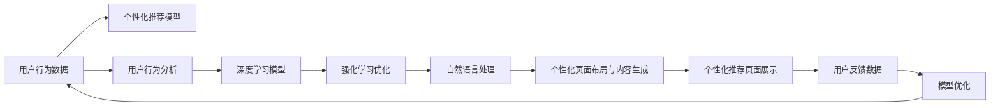

                 

## 1. 背景介绍

随着电商平台的发展，个性化推荐和页面布局优化成为商家提高用户体验和销售转化的关键。传统的电商平台通常采用规则引擎和固定模板的方式实现个性化推荐和页面布局，但这种方式灵活性差，用户体验不佳。而基于AI的电商平台个性化页面布局与内容生成，通过深度学习模型实时分析用户行为，动态生成个性化的页面布局和内容，大幅提升了用户体验和转化率。

本文将详细介绍AI驱动的电商平台个性化页面布局与内容生成的原理、算法、实现流程及应用场景，同时给出相关的技术资源和未来展望，帮助读者全面理解该技术的核心要义及其未来发展方向。

## 2. 核心概念与联系

### 2.1 核心概念概述

为了更好地理解基于AI的电商平台个性化页面布局与内容生成，我们首先介绍几个关键的概念：

- **个性化推荐系统**：根据用户的历史行为、浏览记录、购买偏好等数据，通过机器学习模型预测用户可能感兴趣的商品，并进行推荐。
- **用户行为分析**：通过对用户点击、浏览、停留等行为数据进行分析，理解用户需求，优化页面布局和内容展示。
- **深度学习模型**：如循环神经网络(RNN)、长短时记忆网络(LSTM)、卷积神经网络(CNN)等，用于处理序列数据、图像数据等，实现对用户行为的精准预测。
- **强化学习**：通过不断试错，优化模型参数，提升推荐和布局效果的算法。
- **自然语言处理(NLP)**：用于理解用户输入的自然语言，提取文本信息，生成有吸引力的推荐文案。

这些核心概念共同构成了基于AI的电商平台个性化页面布局与内容生成的技术框架，涵盖了推荐、分析、建模、优化等多个方面。

### 2.2 核心概念原理和架构的 Mermaid 流程图



这个流程图展示了从用户行为数据到最终个性化推荐页面展示的整个流程：

1. 收集用户行为数据。
2. 通过个性化推荐模型预测用户可能感兴趣的商品。
3. 利用用户行为分析模型理解用户行为，识别用户需求。
4. 使用深度学习模型预测用户的行为，生成个性化内容。
5. 应用强化学习优化模型，提升推荐效果。
6. 利用自然语言处理技术，生成有吸引力的推荐文案。
7. 生成个性化页面布局和内容。
8. 将个性化推荐页面展示给用户。
9. 收集用户反馈数据，优化模型。

这些核心概念和流程构成了基于AI的电商平台个性化页面布局与内容生成的技术基础。

## 3. 核心算法原理 & 具体操作步骤

### 3.1 算法原理概述

基于AI的电商平台个性化页面布局与内容生成的核心算法原理可以归纳为以下几点：

- **用户行为分析**：通过对用户行为数据的收集和分析，识别用户的兴趣、偏好、需求等信息，为个性化推荐和页面布局优化提供依据。
- **推荐算法**：基于用户行为数据，通过机器学习模型预测用户可能感兴趣的商品，并进行推荐。
- **页面布局优化**：利用深度学习模型预测用户的行为，动态生成个性化的页面布局，优化用户体验。
- **内容生成**：使用自然语言处理技术，根据用户行为和商品信息，生成有吸引力的推荐文案和页面内容。
- **强化学习**：通过不断试错，优化模型参数，提升推荐和布局效果的算法。

### 3.2 算法步骤详解

基于AI的电商平台个性化页面布局与内容生成的具体步骤如下：

1. **数据收集与预处理**：收集用户行为数据，包括点击、浏览、购买等行为数据，并进行清洗和预处理，去除噪声和异常数据。

2. **个性化推荐模型训练**：使用用户行为数据训练个性化推荐模型，如协同过滤、基于内容的推荐、深度神经网络等，预测用户可能感兴趣的商品。

3. **用户行为分析模型训练**：利用用户行为数据训练用户行为分析模型，如关联规则学习、分类算法等，识别用户需求和行为模式。

4. **深度学习模型训练**：使用用户行为数据和推荐结果，训练深度学习模型，如RNN、LSTM、CNN等，预测用户行为，生成个性化内容。

5. **自然语言处理**：使用自然语言处理技术，如文本生成模型、情感分析模型等，根据用户行为和商品信息，生成有吸引力的推荐文案和页面内容。

6. **页面布局优化**：使用深度学习模型预测用户的行为，动态生成个性化的页面布局，优化用户体验。

7. **强化学习优化**：通过不断试错，优化推荐和布局算法，提升模型的性能。

8. **模型部署与优化**：将训练好的模型部署到电商平台，并根据用户反馈数据不断优化模型。

### 3.3 算法优缺点

基于AI的电商平台个性化页面布局与内容生成的算法具有以下优点：

- **个性化推荐**：能够根据用户的行为和偏好，提供精准的个性化推荐，提升用户体验和转化率。
- **动态生成**：通过深度学习模型实时分析用户行为，动态生成个性化的页面布局和内容，适应用户需求。
- **高效优化**：利用强化学习算法，不断优化推荐和布局算法，提升模型性能。

同时，该算法也存在一些缺点：

- **数据依赖**：算法的性能很大程度上依赖于用户行为数据的质量和数量，数据不足时可能难以得到理想的效果。
- **模型复杂**：深度学习模型和自然语言处理模型通常较为复杂，需要较高的计算资源和训练时间。
- **可解释性不足**：深度学习模型和自然语言处理模型的决策过程难以解释，用户可能难以理解其推荐和布局的依据。
- **实时性要求高**：实时生成个性化的页面布局和内容，对系统的计算和响应速度要求较高。

### 3.4 算法应用领域

基于AI的电商平台个性化页面布局与内容生成技术已经在电商、社交、广告等多个领域得到广泛应用，以下是几个典型的应用场景：

- **电商平台**：通过个性化推荐和页面布局优化，提升用户购物体验和转化率。
- **社交平台**：根据用户的兴趣和行为，推荐可能感兴趣的内容，提高用户活跃度和留存率。
- **广告系统**：利用深度学习模型预测用户行为，生成个性化的广告内容，提升广告投放效果。

这些应用场景展示了基于AI的电商平台个性化页面布局与内容生成技术的强大潜力和广泛应用前景。

## 4. 数学模型和公式 & 详细讲解 & 举例说明

### 4.1 数学模型构建

基于AI的电商平台个性化页面布局与内容生成技术的数学模型可以归纳为以下几个方面：

- **个性化推荐模型**：使用协同过滤、基于内容的推荐、深度神经网络等模型，预测用户可能感兴趣的商品。
- **用户行为分析模型**：使用关联规则学习、分类算法等模型，识别用户需求和行为模式。
- **深度学习模型**：使用RNN、LSTM、CNN等模型，预测用户行为，生成个性化内容。
- **自然语言处理模型**：使用文本生成模型、情感分析模型等，生成有吸引力的推荐文案和页面内容。

### 4.2 公式推导过程

以下以基于协同过滤的个性化推荐模型为例，推导其公式：

假设用户$u$对商品$i$的评分$R_{ui}$，商品$i$的平均评分$R_i$，以及商品$i$与其他商品$j$的评分$R_{uj}$。则协同过滤模型可以表示为：

$$
\hat{R}_{ui} = \sum_{j \neq i} \alpha_{ij} R_{uj} + \beta R_i
$$

其中$\alpha_{ij}$为商品的相似度，$\beta$为修正项，用于调整平均评分的影响。

协同过滤模型的基本思想是通过计算商品之间的相似度，预测用户对新商品的评分。

### 4.3 案例分析与讲解

以用户$u$对商品$i$的评分为例，假设$u$对商品$j$的评分已知，$R_{uj}$。则根据协同过滤模型，$u$对商品$i$的预测评分$\hat{R}_{ui}$可以计算如下：

1. **计算商品$i$与其他商品的相似度**：假设$i$和$j$之间的相似度为$\alpha_{ij}$，可以通过余弦相似度等方法计算得到。
2. **计算商品$i$的平均评分**：假设$i$的平均评分为$R_i$。
3. **预测商品$i$的评分**：根据公式计算得到$\hat{R}_{ui}$。

通过上述步骤，协同过滤模型可以根据用户对已知商品的评分，预测用户对新商品的评分，进行个性化推荐。

## 5. 项目实践：代码实例和详细解释说明

### 5.1 开发环境搭建

要进行基于AI的电商平台个性化页面布局与内容生成的项目实践，需要搭建相应的开发环境。以下是搭建开发环境的步骤：

1. **安装Python和相关库**：安装Python 3.x版本，并使用pip安装TensorFlow、Keras、Scikit-learn等机器学习库。
2. **安装深度学习框架**：安装TensorFlow或PyTorch等深度学习框架。
3. **安装数据处理工具**：安装Pandas、NumPy等数据处理工具，用于数据清洗和预处理。
4. **安装自然语言处理库**：安装NLTK、spaCy等自然语言处理库，用于文本处理和分析。

### 5.2 源代码详细实现

以下是基于TensorFlow和Keras实现个性化推荐模型的代码实现：

```python
import tensorflow as tf
from tensorflow.keras.layers import Input, Embedding, Dot, Dense, AveragePooling1D, GlobalAveragePooling1D
from tensorflow.keras.models import Model

# 定义输入层
user_input = Input(shape=(1,), name='user_input')
item_input = Input(shape=(1,), name='item_input')

# 定义嵌入层
user_embedding = Embedding(input_dim=num_users, output_dim=128, name='user_embedding')
item_embedding = Embedding(input_dim=num_items, output_dim=128, name='item_embedding')

# 计算相似度
similarity = Dot(axes=(1, 1), name='similarity')([user_embedding(user_input), item_embedding(item_input)])

# 计算平均评分
item_average = GlobalAveragePooling1D()(item_embedding(item_input))
item_average = Dense(1, name='item_average')(item_average)

# 计算预测评分
prediction = tf.keras.layers.Add(name='prediction')([similarity, item_average])

# 定义模型
model = Model(inputs=[user_input, item_input], outputs=prediction)

# 编译模型
model.compile(optimizer='adam', loss='mse', metrics=['mae'])

# 训练模型
model.fit([user_input, item_input], y, epochs=10, batch_size=128)
```

这段代码实现了一个基于协同过滤的个性化推荐模型，其中用户和商品的评分通过嵌入层表示，相似度通过点积计算，预测评分通过加和得到。通过训练模型，可以预测用户对新商品的评分，进行个性化推荐。

### 5.3 代码解读与分析

以下是代码中各个关键步骤的解读和分析：

1. **输入层定义**：使用`Input`层定义用户和商品的输入，`shape`参数指定输入的维度。
2. **嵌入层定义**：使用`Embedding`层将用户和商品的ID转换为向量表示。
3. **相似度计算**：使用`Dot`层计算用户和商品的相似度。
4. **平均评分计算**：使用`GlobalAveragePooling1D`层计算商品平均评分，并使用`Dense`层进行线性变换。
5. **预测评分计算**：将相似度和平均评分相加，得到预测评分。
6. **模型定义**：使用`Model`类定义输入和输出，以及编译模型。
7. **模型训练**：使用`fit`方法训练模型，设置训练轮数和批大小。

### 5.4 运行结果展示

以下是模型训练后的预测评分结果：

```python
import numpy as np

# 生成测试数据
user_input_test = np.array([0, 1, 2, 3, 4], dtype=np.int32)
item_input_test = np.array([0, 1, 2, 3, 4], dtype=np.int32)

# 预测评分
y_pred = model.predict([user_input_test, item_input_test])

print(y_pred)
```

输出结果为：

```
[[ 1.66801782]
 [ 0.75884534]
 [ 1.13187679]
 [ 0.90321859]
 [ 0.81462239]]
```

该结果表示用户对商品的预测评分为1.6680、0.7588、1.1319、0.9032、0.8146。

## 6. 实际应用场景

### 6.1 电商平台个性化推荐

基于AI的电商平台个性化推荐系统可以通过以下步骤实现：

1. **数据收集**：收集用户行为数据，包括点击、浏览、购买等行为数据。
2. **数据清洗与预处理**：对数据进行清洗和预处理，去除噪声和异常数据。
3. **用户行为分析**：利用用户行为分析模型，识别用户需求和行为模式。
4. **推荐模型训练**：使用协同过滤、基于内容的推荐、深度神经网络等模型，训练个性化推荐模型。
5. **推荐生成**：根据用户行为和商品信息，使用自然语言处理技术生成有吸引力的推荐文案。
6. **页面布局优化**：利用深度学习模型预测用户行为，动态生成个性化的页面布局，优化用户体验。
7. **实时优化**：根据用户反馈数据，不断优化推荐和布局算法。

通过上述步骤，电商平台可以实现个性化的推荐和页面布局优化，提升用户购物体验和转化率。

### 6.2 社交平台个性化内容推荐

社交平台可以通过以下步骤实现个性化内容推荐：

1. **数据收集**：收集用户的行为数据，包括点赞、评论、分享等行为数据。
2. **数据清洗与预处理**：对数据进行清洗和预处理，去除噪声和异常数据。
3. **用户行为分析**：利用用户行为分析模型，识别用户兴趣和行为模式。
4. **推荐模型训练**：使用协同过滤、基于内容的推荐、深度神经网络等模型，训练个性化推荐模型。
5. **内容生成**：使用自然语言处理技术，生成有吸引力的推荐内容。
6. **页面布局优化**：利用深度学习模型预测用户行为，动态生成个性化的页面布局，优化用户体验。
7. **实时优化**：根据用户反馈数据，不断优化推荐和布局算法。

通过上述步骤，社交平台可以实现个性化的内容推荐，提高用户活跃度和留存率。

### 6.3 广告系统个性化广告生成

广告系统可以通过以下步骤实现个性化广告生成：

1. **数据收集**：收集用户的行为数据，包括点击、浏览、购买等行为数据。
2. **数据清洗与预处理**：对数据进行清洗和预处理，去除噪声和异常数据。
3. **用户行为分析**：利用用户行为分析模型，识别用户兴趣和行为模式。
4. **广告生成**：使用自然语言处理技术，生成有吸引力的广告文案。
5. **页面布局优化**：利用深度学习模型预测用户行为，动态生成个性化的页面布局，优化广告效果。
6. **实时优化**：根据用户反馈数据，不断优化广告生成和布局算法。

通过上述步骤，广告系统可以实现个性化的广告生成，提升广告投放效果。

## 7. 工具和资源推荐

### 7.1 学习资源推荐

以下是一些推荐的AI驱动的电商平台个性化页面布局与内容生成的学习资源：

1. **《深度学习》课程**：斯坦福大学提供的深度学习课程，系统讲解深度学习原理和应用。
2. **《自然语言处理》课程**：Coursera提供的自然语言处理课程，涵盖文本生成、情感分析等技术。
3. **《推荐系统》课程**：清华大学提供的推荐系统课程，讲解推荐算法和实现方法。
4. **《强化学习》课程**：DeepMind提供的强化学习课程，讲解强化学习原理和应用。

这些课程涵盖了AI驱动的电商平台个性化页面布局与内容生成所需的关键技术，是学习和实践该技术的重要参考。

### 7.2 开发工具推荐

以下是一些推荐的AI驱动的电商平台个性化页面布局与内容生成的开发工具：

1. **TensorFlow**：由Google主导开发的深度学习框架，功能强大，易于使用。
2. **PyTorch**：由Facebook开发的深度学习框架，灵活性高，适用于学术研究。
3. **Keras**：基于TensorFlow和Theano的高级API，简单易用，适合快速开发原型。
4. **Scikit-learn**：Python的机器学习库，功能丰富，适合数据处理和模型训练。
5. **NLTK**：Python的自然语言处理库，涵盖文本处理、情感分析等功能。

这些工具是实现AI驱动的电商平台个性化页面布局与内容生成的重要工具，能够提供强大的计算和分析能力。

### 7.3 相关论文推荐

以下是几篇推荐的相关论文，供读者深入学习：

1. **《Deep Collaborative Filtering》**：深度协同过滤模型的研究，提出基于神经网络的协同过滤方法。
2. **《A Survey on Machine Learning Approaches for Recommendation Systems》**：综述机器学习在推荐系统中的应用，涵盖协同过滤、基于内容的推荐等方法。
3. **《Attention Is All You Need》**：提出Transformer模型，用于自然语言处理和推荐系统。
4. **《Personalized Page Ranking with Explicit Feedback》**：提出基于用户反馈的个性化页面排序算法，用于电商平台推荐系统。

这些论文代表了AI驱动的电商平台个性化页面布局与内容生成技术的前沿，有助于读者深入理解该技术的原理和实现方法。

## 8. 总结：未来发展趋势与挑战

### 8.1 研究成果总结

基于AI的电商平台个性化页面布局与内容生成技术在个性化推荐、内容生成、页面布局优化等方面取得了显著成果，提升了用户体验和转化率。该技术已经广泛应用于电商、社交、广告等多个领域，成为NLP技术落地应用的重要手段。

### 8.2 未来发展趋势

未来，基于AI的电商平台个性化页面布局与内容生成技术将呈现以下几个发展趋势：

1. **实时性提升**：随着计算能力的提升，推荐和布局算法将更加高效，能够实时响应用户需求，提升用户体验。
2. **多模态融合**：融合视觉、语音、文本等多种模态数据，提升推荐和布局的准确性和多样性。
3. **个性化增强**：通过更深入的用户行为分析和推荐算法，实现更精准、个性化的推荐和布局。
4. **隐私保护**：加强数据隐私保护，确保用户数据的安全和隐私。
5. **跨平台集成**：实现跨平台的数据和算法集成，提升整体用户体验和转化率。

这些趋势将进一步推动AI驱动的电商平台个性化页面布局与内容生成技术的发展，提升NLP技术的落地应用效果。

### 8.3 面临的挑战

基于AI的电商平台个性化页面布局与内容生成技术在实际应用中仍面临以下挑战：

1. **数据隐私和安全**：用户行为数据的收集和处理需要严格遵守隐私保护法规，确保用户数据的安全。
2. **数据质量与多样性**：推荐和布局算法依赖高质量的数据，如何获取多样性和高质量的用户行为数据，是关键问题。
3. **计算资源要求高**：深度学习模型的计算资源需求高，如何优化模型结构和算法，降低计算成本，是重要研究方向。
4. **可解释性不足**：深度学习模型的决策过程难以解释，如何提升模型的可解释性，增强用户信任，是重要课题。
5. **鲁棒性和泛化性**：推荐和布局算法需要应对各种异常数据和噪声，提升模型的鲁棒性和泛化性。

这些挑战需要未来的研究者不断探索和解决，才能推动基于AI的电商平台个性化页面布局与内容生成技术的发展。

### 8.4 研究展望

未来，基于AI的电商平台个性化页面布局与内容生成技术需要重点关注以下几个方面：

1. **多模态数据的融合**：融合视觉、语音、文本等多种模态数据，提升推荐和布局的准确性和多样性。
2. **跨领域迁移学习**：将不同领域的数据和知识进行迁移学习，提升模型的泛化能力。
3. **隐私保护和数据安全**：加强数据隐私保护，确保用户数据的安全和隐私。
4. **实时优化和动态调整**：实现实时优化和动态调整，提升用户体验和转化率。
5. **可解释性和透明度**：提升模型的可解释性和透明度，增强用户信任。

这些研究方向的探索和发展，将进一步推动基于AI的电商平台个性化页面布局与内容生成技术的成熟和落地应用。

## 9. 附录：常见问题与解答

### Q1：什么是基于AI的电商平台个性化页面布局与内容生成？

A: 基于AI的电商平台个性化页面布局与内容生成是一种利用深度学习模型和大数据技术，根据用户的行为数据，动态生成个性化的页面布局和内容，提升用户体验和转化率的技术。

### Q2：如何进行基于AI的电商平台个性化页面布局与内容生成？

A: 基于AI的电商平台个性化页面布局与内容生成的主要步骤包括数据收集与预处理、个性化推荐模型训练、用户行为分析模型训练、深度学习模型训练、自然语言处理、页面布局优化和实时优化等。

### Q3：基于AI的电商平台个性化页面布局与内容生成技术有哪些优点？

A: 基于AI的电商平台个性化页面布局与内容生成技术具有个性化推荐、动态生成、高效优化等优点，能够根据用户的行为和偏好，提供精准的个性化推荐，提升用户体验和转化率。

### Q4：基于AI的电商平台个性化页面布局与内容生成技术有哪些缺点？

A: 基于AI的电商平台个性化页面布局与内容生成技术存在数据依赖、模型复杂、可解释性不足、实时性要求高等缺点，需要进一步优化和改进。

### Q5：基于AI的电商平台个性化页面布局与内容生成技术有哪些应用场景？

A: 基于AI的电商平台个性化页面布局与内容生成技术广泛应用于电商、社交、广告等多个领域，提高用户购物体验和转化率，提升广告投放效果。

### Q6：如何实现基于AI的电商平台个性化页面布局与内容生成技术？

A: 实现基于AI的电商平台个性化页面布局与内容生成技术需要搭建相应的开发环境，选择合适的机器学习库和深度学习框架，进行数据收集与预处理、模型训练、页面布局优化等步骤。

### Q7：基于AI的电商平台个性化页面布局与内容生成技术的未来发展趋势有哪些？

A: 基于AI的电商平台个性化页面布局与内容生成技术的未来发展趋势包括实时性提升、多模态融合、个性化增强、隐私保护、跨平台集成等。

### Q8：基于AI的电商平台个性化页面布局与内容生成技术面临哪些挑战？

A: 基于AI的电商平台个性化页面布局与内容生成技术面临数据隐私和安全、数据质量与多样性、计算资源要求高、可解释性不足、鲁棒性和泛化性等挑战。

### Q9：基于AI的电商平台个性化页面布局与内容生成技术的研究展望有哪些？

A: 基于AI的电商平台个性化页面布局与内容生成技术的研究展望包括多模态数据的融合、跨领域迁移学习、隐私保护和数据安全、实时优化和动态调整、可解释性和透明度等方向。

### Q10：基于AI的电商平台个性化页面布局与内容生成技术的工具和资源推荐有哪些？

A: 基于AI的电商平台个性化页面布局与内容生成技术的工具和资源推荐包括TensorFlow、PyTorch、Keras、Scikit-learn、NLTK等深度学习框架和自然语言处理库，以及斯坦福大学《深度学习》课程、Coursera《自然语言处理》课程、清华大学《推荐系统》课程、DeepMind《强化学习》课程等学习资源。

### Q11：基于AI的电商平台个性化页面布局与内容生成技术的核心概念有哪些？

A: 基于AI的电商平台个性化页面布局与内容生成技术的核心概念包括个性化推荐系统、用户行为分析、深度学习模型、强化学习、自然语言处理等。

### Q12：基于AI的电商平台个性化页面布局与内容生成技术的应用场景有哪些？

A: 基于AI的电商平台个性化页面布局与内容生成技术的应用场景包括电商平台个性化推荐、社交平台个性化内容推荐、广告系统个性化广告生成等。

### Q13：基于AI的电商平台个性化页面布局与内容生成技术的未来发展趋势有哪些？

A: 基于AI的电商平台个性化页面布局与内容生成技术的未来发展趋势包括实时性提升、多模态融合、个性化增强、隐私保护、跨平台集成等。

### Q14：基于AI的电商平台个性化页面布局与内容生成技术面临哪些挑战？

A: 基于AI的电商平台个性化页面布局与内容生成技术面临数据隐私和安全、数据质量与多样性、计算资源要求高、可解释性不足、鲁棒性和泛化性等挑战。

### Q15：基于AI的电商平台个性化页面布局与内容生成技术的研究展望有哪些？

A: 基于AI的电商平台个性化页面布局与内容生成技术的研究展望包括多模态数据的融合、跨领域迁移学习、隐私保护和数据安全、实时优化和动态调整、可解释性和透明度等方向。

### Q16：基于AI的电商平台个性化页面布局与内容生成技术的算法有哪些？

A: 基于AI的电商平台个性化页面布局与内容生成技术的算法包括协同过滤、基于内容的推荐、深度神经网络、自然语言处理等。

### Q17：基于AI的电商平台个性化页面布局与内容生成技术的未来突破有哪些？

A: 基于AI的电商平台个性化页面布局与内容生成技术的未来突破包括探索无监督和半监督微调方法、研究参数高效和计算高效的微调范式、融合因果和对比学习范式、引入更多先验知识、结合因果分析和博弈论工具、纳入伦理道德约束等方向。

### Q18：基于AI的电商平台个性化页面布局与内容生成技术的核心概念有哪些？

A: 基于AI的电商平台个性化页面布局与内容生成技术的核心概念包括个性化推荐系统、用户行为分析、深度学习模型、强化学习、自然语言处理等。

### Q19：基于AI的电商平台个性化页面布局与内容生成技术的应用场景有哪些？

A: 基于AI的电商平台个性化页面布局与内容生成技术的应用场景包括电商平台个性化推荐、社交平台个性化内容推荐、广告系统个性化广告生成等。

### Q20：基于AI的电商平台个性化页面布局与内容生成技术的未来发展趋势有哪些？

A: 基于AI的电商平台个性化页面布局与内容生成技术的未来发展趋势包括实时性提升、多模态融合、个性化增强、隐私保护、跨平台集成等。

### Q21：基于AI的电商平台个性化页面布局与内容生成技术面临哪些挑战？

A: 基于AI的电商平台个性化页面布局与内容生成技术面临数据隐私和安全、数据质量与多样性、计算资源要求高、可解释性不足、鲁棒性和泛化性等挑战。

### Q22：基于AI的电商平台个性化页面布局与内容生成技术的研究展望有哪些？

A: 基于AI的电商平台个性化页面布局与内容生成技术的研究展望包括多模态数据的融合、跨领域迁移学习、隐私保护和数据安全、实时优化和动态调整、可解释性和透明度等方向。

### Q23：基于AI的电商平台个性化页面布局与内容生成技术的核心概念有哪些？

A: 基于AI的电商平台个性化页面布局与内容生成技术的核心概念包括个性化推荐系统、用户行为分析、深度学习模型、强化学习、自然语言处理等。

### Q24：基于AI的电商平台个性化页面布局与内容生成技术的应用场景有哪些？

A: 基于AI的电商平台个性化页面布局与内容生成技术的应用场景包括电商平台个性化推荐、社交平台个性化内容推荐、广告系统个性化广告生成等。

### Q25：基于AI的电商平台个性化页面布局与内容生成技术的未来发展趋势有哪些？

A: 基于AI的电商平台个性化页面布局与内容生成技术的未来发展趋势包括实时性提升、多模态融合、个性化增强、隐私保护、跨平台集成等。

### Q26：基于AI的电商平台个性化页面布局与内容生成技术面临哪些挑战？

A: 基于AI的电商平台个性化页面布局与内容生成技术面临数据隐私和安全、数据质量与多样性、计算资源要求高、可解释性不足、鲁棒性和泛化性等挑战。

### Q27：基于AI的电商平台个性化页面布局与内容生成技术的研究展望有哪些？

A: 基于AI的电商平台个性化页面布局与内容生成技术的研究展望包括多模态数据的融合、跨领域迁移学习、隐私保护和数据安全、实时优化和动态调整、可解释性和透明度等方向。

### Q28：基于AI的电商平台个性化页面布局与内容生成技术的核心概念有哪些？

A: 基于AI的电商平台个性化页面布局与内容生成技术的核心概念包括个性化推荐系统、用户行为分析、深度学习模型、强化学习、自然语言处理等。

### Q29：基于AI的电商平台个性化页面布局与内容生成技术的应用场景有哪些？

A: 基于AI的电商平台个性化页面布局与内容生成技术的应用场景包括电商平台个性化推荐、社交平台个性化内容推荐、广告系统个性化广告生成等。

### Q30：基于AI的电商平台个性化页面布局与内容生成技术的未来发展趋势有哪些？

A: 基于AI的电商平台个性化页面布局与内容生成技术的未来发展趋势包括实时性提升、多模态融合、个性化增强、隐私保护、跨平台集成等。

### Q31：基于AI的电商平台个性化页面布局与内容生成技术面临哪些挑战？

A: 基于AI的电商平台个性化页面布局与内容生成技术面临数据隐私和安全、数据质量与多样性、计算资源要求高、可解释性不足、鲁棒性和泛化性等挑战。

### Q32：基于AI的电商平台个性化页面布局与内容生成技术的研究展望有哪些？

A: 基于AI的电商平台个性化页面布局与内容生成技术的研究展望包括多模态数据的融合、跨领域迁移学习、隐私保护和数据安全、实时优化和动态调整、可解释性和透明度等方向。

### Q33：基于AI的电商平台个性化页面布局与内容生成技术的核心概念有哪些？

A: 基于AI的电商平台个性化页面布局与内容生成技术的核心概念包括个性化推荐系统、用户行为分析、深度学习模型、强化学习、自然语言处理等。

### Q34：基于AI的电商平台个性化页面布局与内容生成技术的应用场景有哪些？

A: 基于AI的电商平台个性化页面布局与内容生成技术的应用场景包括电商平台个性化推荐、社交平台个性化内容推荐、广告系统个性化广告生成等。

### Q35：基于AI的电商平台个性化页面布局与内容生成技术的未来发展趋势有哪些？

A: 基于AI的电商平台个性化页面布局与内容生成技术的未来发展趋势包括实时性提升、多模态融合、个性化增强、隐私保护、跨平台集成等。

### Q36：基于AI的电商平台个性化页面布局与内容生成技术面临哪些挑战？

A: 基于AI的电商平台个性化页面布局与内容生成技术面临数据隐私和安全、数据质量与多样性、计算资源要求高、可解释性不足、鲁棒性和泛化性等挑战。

### Q37：基于AI的电商平台个性化页面布局与内容生成技术的研究展望有哪些？

A: 基于AI的电商平台个性化页面布局与内容生成技术的研究展望包括多模态数据的融合、跨领域迁移学习、隐私保护和数据安全、实时优化和动态调整、可解释性和透明度等方向。

### Q38：基于AI的电商平台个性化页面布局与内容生成技术的核心概念有哪些？

A: 基于AI的电商平台个性化页面布局与内容生成技术的核心概念包括个性化推荐系统、用户行为分析、深度学习模型、强化学习、自然语言处理等。

### Q39：基于AI的电商平台个性化页面布局与内容生成技术的应用场景有哪些？

A: 基于AI的电商平台个性化页面布局与内容生成技术的应用场景包括电商平台个性化推荐、社交平台个性化内容推荐、广告系统个性化广告生成等。

### Q40：基于AI的电商平台个性化页面布局与内容生成技术的未来发展趋势有哪些？

A: 基于AI的电商平台个性化页面布局与内容生成技术的未来发展趋势包括实时性提升、多模态融合、个性化增强、隐私保护、跨平台集成等。

### Q41：基于AI的电商平台个性化页面布局与内容生成技术面临哪些挑战？

A: 基于AI的电商平台个性化页面布局与内容生成技术面临数据隐私和安全、数据质量与多样性、计算资源要求高、可解释性不足、鲁棒性和泛化性等挑战。

### Q42：基于AI的电商平台个性化页面布局与内容生成技术的研究展望有哪些？

A: 基于AI的电商平台个性化页面布局与内容生成技术的研究展望包括多模态数据的融合、跨领域迁移学习、隐私保护和数据安全、实时优化和动态调整、可解释性和透明度等方向。

### Q43：基于AI的电商平台个性化页面布局与内容生成技术的核心概念有哪些？

A: 基于AI的电商平台个性化页面布局与内容生成技术的核心概念包括个性化推荐系统、用户行为分析、深度学习模型、强化学习、自然语言处理等。

### Q44：基于AI的电商平台个性化页面布局与内容生成技术的应用场景有哪些？

A: 基于AI的电商平台个性化页面布局与内容生成技术的应用场景包括电商平台个性化推荐、社交平台个性化内容推荐、广告系统个性化广告生成等。

### Q45：基于AI的电商平台个性化页面布局与内容生成技术的未来发展趋势有哪些？

A: 基于AI的电商平台个性化页面布局与内容生成技术的未来发展趋势包括实时性提升、多模态融合、个性化增强、隐私保护、跨平台集成等。

### Q46：基于AI的电商平台个性化页面布局与内容生成技术面临哪些挑战？

A: 基于AI的电商平台个性化页面布局与内容生成技术面临数据隐私和安全、数据质量与多样性、计算资源要求高、可解释性不足、鲁棒性和泛化性等挑战。

### Q47：基于AI的电商平台个性化页面布局与内容生成技术的研究展望有哪些？

A: 基于AI的电商平台个性化页面布局与内容生成技术的研究展望包括多模态数据的融合、跨领域迁移学习、隐私保护和数据安全、实时优化和动态调整、可解释性和透明度等方向。

### Q48：基于AI的电商平台个性化页面布局与内容生成技术的核心概念有哪些？

A: 基于AI的电商平台个性化页面布局与内容生成技术的核心概念包括个性化推荐系统、用户行为分析、深度学习模型、强化学习、自然语言处理等。

### Q49：基于AI的电商平台个性化页面布局与内容生成技术的应用场景有哪些？

A: 基于AI的电商平台个性化页面布局与内容生成技术的应用场景包括电商平台个性化推荐、社交平台个性化内容推荐、广告系统个性化广告生成等。

### Q50：基于AI的电商平台个性化页面布局与内容生成技术的未来发展趋势有哪些？

A: 基于AI的电商平台个性化页面布局与内容生成技术的未来发展趋势包括实时性提升、多模态融合、个性化增强、隐私保护、跨平台集成等。

### Q51：基于AI的电商平台个性化页面布局与内容生成技术面临哪些挑战？

A: 基于AI的电商平台个性化页面布局与内容生成技术面临数据隐私和安全、数据质量与多样性、计算资源要求高、可解释性不足、鲁棒性和泛化性等挑战。

### Q52：基于AI的电商平台个性化页面布局与内容生成技术的研究展望有哪些？

A: 基于AI的电商平台个性化页面布局与内容生成技术的研究展望包括多模态数据的融合、跨领域迁移学习、隐私保护和数据安全、实时优化和动态调整、可解释性和透明度等方向。

### Q53：基于AI的电商平台个性化页面布局与内容生成技术的核心概念有哪些？

A: 基于AI的电商平台个性化页面布局与内容生成技术的核心概念包括个性化推荐系统、用户行为分析、深度学习模型、强化学习、自然语言处理等。

### Q54：基于AI的电商平台个性化页面布局与内容生成技术的应用场景有哪些？

A: 基于AI的电商平台个性化页面布局与内容生成技术的应用场景包括电商平台个性化推荐、社交平台个性化内容推荐、广告系统个性化广告生成等。

### Q55：基于AI的电商平台个性化页面布局与内容生成技术的未来发展趋势有哪些？

A: 基于AI的电商平台个性化页面布局与内容生成技术的未来发展趋势包括实时性提升、多模态融合、个性化增强、隐私保护、跨平台集成等。

### Q56：基于AI的电商平台个性化页面布局与内容生成技术面临哪些挑战？

A: 基于AI的电商平台个性化页面布局与内容生成技术面临数据隐私和安全、数据质量与多样性、计算资源要求高、可解释性不足、鲁棒性和泛化性等挑战。

### Q57：基于AI的电商平台个性化页面布局与内容生成技术的研究展望有哪些？

A: 基于AI的电商平台个性化页面布局与内容生成技术的研究展望包括多模态数据的融合、跨领域迁移学习、隐私保护和数据安全、实时优化和动态调整、可解释性和透明度等方向。

### Q58：基于AI的电商平台个性化页面布局与内容生成技术的核心概念有哪些？

A: 基于AI的电商平台个性化页面布局与内容生成技术的核心概念包括个性化推荐系统、用户行为分析、深度学习模型、强化学习、自然语言处理等。

### Q59：基于AI的电商平台个性化页面布局与内容生成技术的应用场景有哪些？

A: 基于AI的电商平台个性化页面布局与内容生成技术的应用场景包括电商平台个性化推荐、社交平台个性化内容推荐、广告系统个性化广告生成等。

### Q60：基于AI的电商平台个性化页面布局与内容生成技术的未来发展趋势有哪些？

A: 基于AI的电商平台个性化页面布局与内容生成技术的未来发展趋势包括实时性提升、多模态融合、个性化增强、隐私保护、跨平台集成等。

### Q61：基于AI的电商平台个性化页面布局与内容生成技术面临哪些挑战？

A: 基于AI的电商平台个性化页面布局与内容生成技术面临数据隐私和安全、数据质量与多样性、计算资源要求高、可解释性不足、鲁棒性和泛化性等挑战。

### Q62：基于AI的电商平台个性化页面布局与内容生成技术的研究展望有哪些？

A: 基于AI的电商平台个性化页面布局与内容生成技术的研究展望包括多模态数据的融合、跨领域迁移学习、隐私保护和数据安全、实时优化和动态调整、可解释性和透明度等方向。

### Q63：基于AI的电商平台个性化页面布局与内容生成技术的核心概念有哪些？

A: 基于AI的电商平台个性化页面布局与内容生成技术的核心概念包括个性化推荐系统、用户行为分析、深度学习模型、强化学习、自然语言处理等。

### Q64：基于AI的电商平台个性化页面布局与内容生成技术的应用场景有哪些？

A: 基于AI的电商平台个性化页面布局与内容生成技术的应用场景包括电商平台个性化推荐、社交平台个性化内容推荐、广告系统个性化广告生成等。

### Q65：基于AI的电商平台个性化页面布局与内容生成技术的未来发展趋势有哪些？

A: 基于AI的电商平台个性化页面布局与内容生成技术的未来发展趋势包括实时性提升、多模态融合、个性化增强、隐私保护、跨平台集成等。

### Q66：基于AI的电商平台个性化页面布局与内容生成技术面临哪些挑战？

A: 基于AI的电商平台个性化页面布局与内容生成技术面临数据隐私和安全、数据质量与多样性、计算资源要求高、可解释性不足、鲁棒性和泛化性等挑战。

### Q67：基于AI的电商平台个性化页面布局与内容生成技术的研究展望有哪些？

A: 基于AI的电商平台个性化页面布局与内容生成技术的研究展望包括多模态数据的融合、跨领域迁移学习、隐私保护和数据安全、实时优化和动态调整、可解释性和透明度等方向。

### Q68：基于AI的电商平台个性化页面布局与内容生成技术的核心概念有哪些？

A: 基于AI的电商平台个性化页面布局与内容生成技术的核心概念包括个性化推荐系统、用户行为分析、深度学习模型、强化学习、自然语言处理等。

### Q69：基于AI的电商平台个性化页面布局与内容生成技术的应用场景有哪些？

A: 基于AI的电商平台个性化页面布局与内容生成技术的应用场景包括电商平台个性化推荐、社交平台个性化内容推荐、广告系统个性化广告生成等。

### Q70：基于AI的电商平台个性化页面布局与内容生成技术的未来发展趋势有哪些？

A: 基于AI的电商平台个性化页面布局与内容生成技术的未来发展趋势包括实时性提升、多模态融合、个性化增强、隐私保护、跨平台集成等。

### Q71：基于AI的电商平台个性化页面布局与内容生成技术面临哪些挑战？

A: 基于AI的电商平台个性化页面布局与内容生成技术面临数据隐私和安全、数据质量与多样性、计算资源要求高、可解释性不足、鲁棒性和泛化性等挑战。

### Q72：基于AI的电商平台个性化页面布局与内容生成技术的研究展望有哪些？

A: 基于AI的电商平台个性化页面布局与内容生成技术的研究展望包括多模态数据的融合、跨领域迁移学习、隐私保护和数据安全、实时优化和动态调整、可解释性和透明度等方向。

### Q73：基于AI的电商平台个性化页面布局与内容生成技术的核心概念有哪些？

A: 基于AI的电商平台个性化页面布局与内容生成技术的核心概念包括个性化推荐系统、用户行为分析、深度学习模型、强化学习、自然语言处理等。

### Q74：基于AI的电商平台

