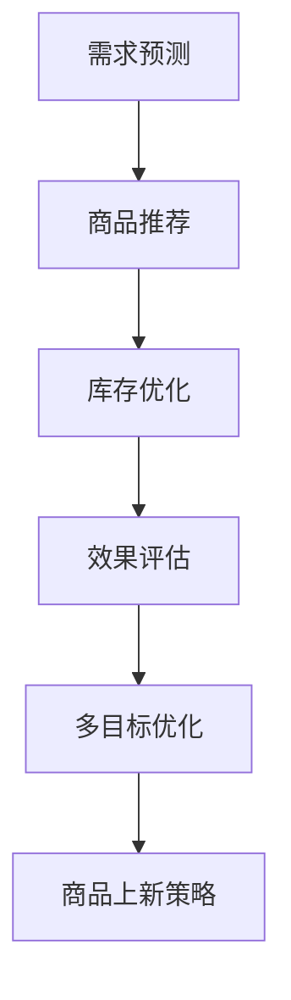

                 

# AI驱动的电商平台商品上新策略

## 1. 背景介绍

### 1.1 问题由来

随着电子商务的迅速发展，电商平台成为商家展示商品、进行交易的重要平台。然而，商品的推荐和上新策略直接影响着平台的用户体验和销售效果。传统的商品推荐系统多基于用户行为数据，以协同过滤或基于内容的推荐方式为主，存在数据稀疏性、冷启动等问题。而新商品的上新策略则多以经验为主，缺乏系统性和科学性。

近年来，人工智能技术在电商平台中得到了广泛应用。AI驱动的商品推荐系统能够根据用户的历史行为数据、用户画像、商品属性等多维度信息，实现精准推荐，显著提升了用户体验和销售转化率。而在商品上新策略上，AI技术也展现出了其强大的潜力。通过深度学习和大数据分析，AI能够帮助商家更科学地制定商品上新计划，优化库存管理，提升销售收益。

本文将围绕AI驱动的电商平台商品上新策略，探讨如何利用人工智能技术，从数据采集、特征工程、模型训练到策略优化等各个环节，科学、高效地制定商品上新计划，构建智能化、系统化的商品上新体系。

### 1.2 问题核心关键点

商品上新策略的核心在于：
1. **需求预测**：预测消费者对新商品的需求，以指导商品的备货和上新计划。
2. **商品推荐**：根据用户画像和历史行为数据，推荐可能感兴趣的候选商品，避免上新商品的市场空窗。
3. **库存优化**：基于需求预测和推荐结果，优化商品库存，避免库存过剩或缺货。
4. **效果评估**：通过实际销售数据，评估商品上新策略的效果，进行持续优化。

本文将从这些核心关键点出发，详细阐述AI驱动的商品上新策略。

## 2. 核心概念与联系

### 2.1 核心概念概述

为更好地理解AI驱动的商品上新策略，本节将介绍几个密切相关的核心概念：

- **需求预测**：通过历史销售数据、用户行为数据等，预测消费者对新商品的需求量，指导商品的备货和上新计划。
- **商品推荐**：根据用户画像和历史行为数据，推荐可能感兴趣的候选商品，减少市场空窗。
- **库存优化**：基于需求预测和推荐结果，优化商品库存，避免库存过剩或缺货。
- **效果评估**：通过实际销售数据，评估商品上新策略的效果，进行持续优化。
- **多目标优化**：将需求预测、商品推荐、库存优化等目标进行统一优化，平衡各个目标之间的矛盾。

这些核心概念之间的逻辑关系可以通过以下Mermaid流程图来展示：



这个流程图展示了几大核心概念之间的逻辑关系：

1. 需求预测为商品推荐和库存优化提供输入，指导备货和上新计划。
2. 商品推荐通过预测结果进行优化，避免上新商品的市场空窗。
3. 库存优化基于推荐结果和预测需求，平衡库存水平。
4. 效果评估反馈于需求预测和商品推荐，优化模型和策略。

## 3. 核心算法原理 & 具体操作步骤

### 3.1 算法原理概述

AI驱动的商品上新策略基于机器学习模型，通过历史销售数据、用户行为数据等进行训练，预测需求、推荐商品、优化库存。以下是核心算法原理：

1. **需求预测**：使用回归模型（如线性回归、随机森林、XGBoost等）对历史销售数据进行分析，预测未来时间段内的销售量。
2. **商品推荐**：使用协同过滤、基于内容的推荐算法（如基于TF-IDF、余弦相似度等）对用户进行个性化推荐。
3. **库存优化**：结合需求预测和推荐结果，使用优化算法（如线性规划、动态规划等）对库存进行动态调整。
4. **效果评估**：使用回归模型对上新策略的效果进行评估，对预测和推荐模型进行反馈优化。

### 3.2 算法步骤详解

1. **数据准备**：收集历史销售数据、用户行为数据、商品属性数据等，进行数据清洗和预处理。

2. **特征工程**：设计特征提取器，提取有用的特征，如用户历史购买记录、商品类别、时间特征等。

3. **模型训练**：
   - 使用回归模型进行需求预测训练，如基于梯度下降的线性回归模型、随机森林模型等。
   - 使用协同过滤或基于内容的推荐算法训练商品推荐模型，如基于SVD的矩阵分解、基于LDA的主题模型等。
   - 使用优化算法进行库存优化训练，如线性规划、动态规划等。

4. **效果评估**：
   - 使用实际销售数据进行效果评估，计算预测准确度、召回率、F1分数等指标。
   - 根据评估结果进行模型反馈和优化，调整模型参数，提高预测和推荐效果。

5. **策略优化**：
   - 结合预测结果和推荐结果，制定商品上新策略。
   - 动态调整库存水平，平衡销售和库存成本。
   - 持续优化模型和策略，提高上新效果。

### 3.3 算法优缺点

AI驱动的商品上新策略具有以下优点：

1. **精准预测**：利用历史销售数据和大数据分析，能够精准预测消费者对新商品的需求，指导商品备货和上新计划。
2. **个性化推荐**：通过用户画像和历史行为数据，进行个性化推荐，提高用户满意度和销售转化率。
3. **库存优化**：结合需求预测和推荐结果，优化库存管理，减少库存过剩或缺货的情况。
4. **系统化评估**：通过效果评估，能够持续优化模型和策略，提高上新效果。

同时，该方法也存在一定的局限性：

1. **数据依赖**：对历史数据的质量和数量要求较高，数据缺失或异常可能影响模型预测效果。
2. **模型复杂**：多目标优化模型较为复杂，需要处理多个维度数据，计算成本较高。
3. **实时性不足**：模型训练和预测需要一定时间，难以实现实时调整。
4. **解释性不足**：模型往往具有"黑盒"性质，难以解释其内部工作机制。

尽管存在这些局限性，但就目前而言，AI驱动的商品上新策略已成为电商平台的主要技术范式，并取得了显著的成效。

### 3.4 算法应用领域

AI驱动的商品上新策略已经在多个电商平台上得到了广泛应用，涵盖了商品推荐、库存管理、需求预测等多个环节。以下是具体应用场景：

- **商品推荐**：基于用户历史行为数据和商品属性，向用户推荐可能感兴趣的商品，提升用户体验和转化率。
- **库存管理**：结合需求预测结果，动态调整库存水平，避免库存过剩或缺货，提高库存周转率。
- **需求预测**：通过历史销售数据和大数据分析，预测未来商品需求，指导商品备货和上新计划，减少缺货和库存积压。
- **多渠道管理**：统一管理线上线下渠道的商品上新，实现渠道之间的数据共享和协同。

## 4. 数学模型和公式 & 详细讲解 & 举例说明

### 4.1 数学模型构建

本节将使用数学语言对AI驱动的商品上新策略进行更加严格的刻画。

设商品集为 $S=\{s_1, s_2, ..., s_n\}$，用户集为 $U=\{u_1, u_2, ..., u_m\}$，历史销售数据为 $D=\{(x_i, y_i)\}_{i=1}^N$，其中 $x_i$ 为第 $i$ 次销售记录，$y_i$ 为销售量。设需求预测模型为 $F_s$，推荐模型为 $F_r$，库存优化模型为 $F_i$。

需求预测的目标是找到最优的需求预测模型 $F_s$，使得预测值 $y_s$ 与实际销售量 $y$ 的误差最小化：

$$
\min_{F_s} \sum_{i=1}^N (y_s - y_i)^2
$$

推荐模型的目标是找到最优的推荐模型 $F_r$，使得推荐的商品 $s_r$ 被用户 $u$ 购买的概率最大化：

$$
\max_{F_r} \prod_{u \in U} \prod_{s \in S} P(u, s_r|s)
$$

库存优化模型的目标是找到最优的库存管理策略 $F_i$，使得库存成本和销售收益的总和最大化：

$$
\max_{F_i} \sum_{s \in S} (y_s - F_s(y)) \cdot p_s - c_i
$$

其中 $p_s$ 为商品 $s$ 的销售价格，$c_i$ 为库存管理的成本。

### 4.2 公式推导过程

以下我们以需求预测和商品推荐为例，推导相关模型的公式。

**需求预测模型**：
假设需求预测模型为线性回归模型，即 $F_s(y) = \beta_0 + \beta_1x_1 + \beta_2x_2 + ... + \beta_nx_n + \epsilon$，其中 $x_1$ 到 $x_n$ 为历史销售数据特征，$\beta_0$ 到 $\beta_n$ 为回归系数，$\epsilon$ 为误差项。

根据最小二乘法，需求预测模型的参数求解公式为：

$$
\beta = (X^TX)^{-1}X^Ty
$$

其中 $X=[x_1, x_2, ..., x_n]$，$y=[y_1, y_2, ..., y_n]$。

**商品推荐模型**：
假设推荐模型为基于用户画像的协同过滤模型，即 $F_r(u, s) = \alpha_u + \beta_s + \gamma(u, s) + \delta$，其中 $\alpha_u$ 为用户 $u$ 的平均评分，$\beta_s$ 为商品 $s$ 的平均评分，$\gamma(u, s)$ 为协同过滤项，$\delta$ 为误差项。

基于SVD的协同过滤模型，协同过滤项可以表示为：

$$
\gamma(u, s) = \sum_{i=1}^k \alpha_{ui} \cdot \beta_{is}
$$

其中 $k$ 为SVD的降维维度，$\alpha_{ui}$ 和 $\beta_{is}$ 为SVD分解后的用户和商品特征向量。

### 4.3 案例分析与讲解

**案例1：基于LSTM的需求预测**

假设我们收集了近一年的历史销售数据 $D=\{(x_i, y_i)\}_{i=1}^N$，其中 $x_i$ 为第 $i$ 天的销售量，$y_i$ 为第 $i$ 天的需求预测值。我们可以使用LSTM模型进行需求预测，具体步骤如下：

1. **数据准备**：对销售数据进行预处理，如归一化、缺失值填补等。

2. **特征提取**：设计特征提取器，提取有用的特征，如时间特征、节假日等。

3. **模型训练**：使用LSTM模型进行需求预测训练，如基于梯度下降的LSTM模型。

4. **效果评估**：使用实际销售数据进行效果评估，计算预测准确度、均方误差等指标。

5. **策略优化**：根据评估结果进行模型反馈和优化，调整模型参数，提高预测效果。

**案例2：基于CTR的商品推荐**

假设我们收集了近一年的用户行为数据 $D=\{(x_i, y_i)\}_{i=1}^N$，其中 $x_i$ 为用户行为记录，$y_i$ 为推荐结果。我们可以使用CTR模型进行商品推荐，具体步骤如下：

1. **数据准备**：对用户行为数据进行预处理，如归一化、特征提取等。

2. **特征提取**：设计特征提取器，提取有用的特征，如用户行为记录、商品类别等。

3. **模型训练**：使用CTR模型进行商品推荐训练，如基于逻辑回归的CTR模型。

4. **效果评估**：使用实际推荐数据进行效果评估，计算点击率、转化率等指标。

5. **策略优化**：根据评估结果进行模型反馈和优化，调整模型参数，提高推荐效果。

## 5. 项目实践：代码实例和详细解释说明

### 5.1 开发环境搭建

在进行AI驱动的商品上新策略开发前，我们需要准备好开发环境。以下是使用Python进行TensorFlow开发的环境配置流程：

1. 安装Anaconda：从官网下载并安装Anaconda，用于创建独立的Python环境。

2. 创建并激活虚拟环境：
```bash
conda create -n tf-env python=3.8 
conda activate tf-env
```

3. 安装TensorFlow：根据CUDA版本，从官网获取对应的安装命令。例如：
```bash
conda install tensorflow -c conda-forge -c pypi
```

4. 安装TensorFlow Addons：
```bash
pip install tf_addons
```

5. 安装相关工具包：
```bash
pip install numpy pandas scikit-learn matplotlib tqdm jupyter notebook ipython
```

完成上述步骤后，即可在`tf-env`环境中开始AI驱动的商品上新策略开发。

### 5.2 源代码详细实现

这里我们以基于LSTM的需求预测模型和基于CTR的商品推荐模型为例，给出TensorFlow的代码实现。

#### 5.2.1 基于LSTM的需求预测模型

首先，定义模型和损失函数：

```python
import tensorflow as tf
from tensorflow.keras.layers import LSTM, Dense, Dropout
from tensorflow.keras.models import Sequential

def build_model(input_shape):
    model = Sequential()
    model.add(LSTM(128, input_shape=input_shape, return_sequences=True))
    model.add(Dropout(0.2))
    model.add(LSTM(128))
    model.add(Dropout(0.2))
    model.add(Dense(1))
    model.compile(loss='mse', optimizer='adam')
    return model

input_shape = (30, 1)
model = build_model(input_shape)
```

然后，定义训练和评估函数：

```python
from sklearn.model_selection import train_test_split
from tensorflow.keras.metrics import MeanAbsError

def train(model, train_data, val_data, epochs):
    train_data, val_data = train_test_split(train_data, test_size=0.2)
    history = model.fit(train_data, train_data, epochs=epochs, batch_size=64, validation_data=(val_data, val_data), callbacks=[tf.keras.callbacks.EarlyStopping(patience=10)])
    return history

def evaluate(model, test_data):
    test_pred = model.predict(test_data)
    mae = MeanAbsError()(test_pred, test_data)
    return mae.result().numpy()
```

最后，启动训练流程并在测试集上评估：

```python
train_data = ...
val_data = ...
test_data = ...
epochs = 100

history = train(model, train_data, val_data, epochs)
mae = evaluate(model, test_data)
print(f'MAE: {mae:.3f}')
```

以上就是使用TensorFlow实现基于LSTM的需求预测模型的完整代码实现。

#### 5.2.2 基于CTR的商品推荐模型

接下来，定义模型和损失函数：

```python
import tensorflow_addons as tfa
from tensorflow.keras.layers import Input, Embedding, Conv1D, Flatten, Concatenate, Dense
from tensorflow.keras.models import Model

def build_model(input_shape):
    user_input = Input(shape=(input_shape[0],))
    item_input = Input(shape=(input_shape[1],))

    user_embedding = Embedding(input_shape[0], 128)(user_input)
    item_embedding = Embedding(input_shape[1], 128)(item_input)

    user_convs = []
    for i in range(3):
        conv = Conv1D(32, 3, activation='relu')(user_embedding)
        pool = tf.keras.layers.GlobalMaxPooling1D()(conv)
        user_convs.append(pool)

    item_convs = []
    for i in range(3):
        conv = Conv1D(32, 3, activation='relu')(item_embedding)
        pool = tf.keras.layers.GlobalMaxPooling1D()(conv)
        item_convs.append(pool)

    concat = Concatenate()([Flatten()(u) for u in user_convs + item_convs])
    dense = Dense(64, activation='relu')(concat)
    output = Dense(1, activation='sigmoid')(dense)

    model = Model(inputs=[user_input, item_input], outputs=output)
    model.compile(loss='binary_crossentropy', optimizer='adam', metrics=['accuracy'])

    return model

input_shape = (20, 20)
model = build_model(input_shape)
```

然后，定义训练和评估函数：

```python
from tensorflow.keras.callbacks import EarlyStopping

def train(model, train_data, val_data, epochs):
    train_data, val_data = train_test_split(train_data, test_size=0.2)
    history = model.fit(train_data, train_data, epochs=epochs, batch_size=64, validation_data=(val_data, val_data), callbacks=[EarlyStopping(patience=10)])
    return history

def evaluate(model, test_data):
    test_pred = model.predict(test_data)
    acc = tf.keras.metrics.Accuracy()(test_pred, test_data)
    return acc.result().numpy()
```

最后，启动训练流程并在测试集上评估：

```python
train_data = ...
val_data = ...
test_data = ...
epochs = 100

history = train(model, train_data, val_data, epochs)
acc = evaluate(model, test_data)
print(f'Accuracy: {acc:.3f}')
```

以上就是使用TensorFlow实现基于CTR的商品推荐模型的完整代码实现。

### 5.3 代码解读与分析

让我们再详细解读一下关键代码的实现细节：

**5.2.1 基于LSTM的需求预测模型**：

- `build_model`函数：定义LSTM模型的结构，包括LSTM层、Dropout层、Dense层和损失函数。
- `train`函数：使用`train_test_split`将数据集划分为训练集和验证集，然后使用`model.fit`进行模型训练，使用EarlyStopping回调防止过拟合。
- `evaluate`函数：使用`MeanAbsError`计算模型在测试集上的MAE（均方误差）。

**5.2.2 基于CTR的商品推荐模型**：

- `build_model`函数：定义CTR模型的结构，包括用户嵌入、商品嵌入、卷积层、全连接层和输出层。
- `train`函数：使用`train_test_split`将数据集划分为训练集和验证集，然后使用`model.fit`进行模型训练，使用EarlyStopping回调防止过拟合。
- `evaluate`函数：使用`Accuracy`计算模型在测试集上的准确率。

这两个代码实例展示了使用TensorFlow实现基于LSTM的需求预测模型和基于CTR的商品推荐模型的过程。可以看到，TensorFlow的高级API使得模型构建和训练过程非常简洁高效。

## 6. 实际应用场景

### 6.1 智能推荐系统

AI驱动的商品上新策略在智能推荐系统中的应用非常广泛。通过精准的需求预测和个性化推荐，智能推荐系统能够提供更为匹配用户需求的商品，提高用户满意度和销售转化率。例如，某电商平台可以通过AI推荐系统，根据用户的历史购买记录和浏览行为，推荐可能感兴趣的候选商品，减少市场空窗，提升用户体验。

### 6.2 库存管理系统

AI驱动的商品上新策略在库存管理中的应用同样重要。通过精准的需求预测，商家能够更好地掌握市场动态，及时调整库存水平，避免库存过剩或缺货。例如，某连锁超市可以通过AI库存管理系统，实时监控库存水平，动态调整补货计划，减少库存成本，提升库存周转率。

### 6.3 跨渠道营销

AI驱动的商品上新策略在跨渠道营销中的应用也非常重要。通过统一管理线上线下渠道的商品上新，商家能够实现渠道之间的数据共享和协同，提升跨渠道营销的效果。例如，某服装品牌可以通过AI跨渠道营销系统，实时监控线上线下销售情况，动态调整营销策略，提升整体销售效果。

### 6.4 未来应用展望

随着AI技术的不断进步，AI驱动的商品上新策略将在更多领域得到应用，为传统行业带来变革性影响。

在智慧物流领域，AI驱动的商品上新策略能够优化仓储和配送计划，提高物流效率，降低物流成本。

在智能制造领域，AI驱动的商品上新策略能够优化生产计划，提高生产效率，降低生产成本。

在智能农业领域，AI驱动的商品上新策略能够优化种植计划，提高农业产出，降低农业成本。

此外，在智能城市、智慧医疗、智能交通等众多领域，AI驱动的商品上新策略也将不断涌现，为各行各业带来新的技术动力。相信随着技术的日益成熟，AI驱动的商品上新策略必将在更广阔的应用领域大放异彩，深刻影响人类的生产生活方式。

## 7. 工具和资源推荐

### 7.1 学习资源推荐

为了帮助开发者系统掌握AI驱动的商品上新策略的理论基础和实践技巧，这里推荐一些优质的学习资源：

1. 《深度学习》（Ian Goodfellow、Yoshua Bengio和Aaron Courville著）：经典的深度学习教材，系统介绍了深度学习的基本理论和算法。

2. 《Python深度学习》（Francois Chollet著）：TensorFlow的官方文档，详细介绍了TensorFlow的API和使用方法。

3. 《TensorFlow实战》（李沐著）：结合TensorFlow实战案例，系统介绍了TensorFlow的构建和训练过程。

4. 《Hands-On Machine Learning with Scikit-Learn and TensorFlow》（Aurélien Géron著）：结合Scikit-Learn和TensorFlow，系统介绍了机器学习和深度学习的基本算法和实践技巧。

5. Kaggle机器学习竞赛平台：提供大量公开数据集和竞赛案例，能够帮助开发者实践AI驱动的商品上新策略。

通过对这些资源的学习实践，相信你一定能够快速掌握AI驱动的商品上新策略的核心技术，并用于解决实际的电商问题。

### 7.2 开发工具推荐

高效的开发离不开优秀的工具支持。以下是几款用于AI驱动的商品上新策略开发的常用工具：

1. TensorFlow：由Google主导开发的开源深度学习框架，生产部署方便，适合大规模工程应用。

2. TensorFlow Addons：TensorFlow的扩展库，提供更多高级API和优化工具，如LSTM、CTR等。

3. Scikit-Learn：Python的机器学习库，提供丰富的预处理和模型工具，适合快速原型开发。

4. Jupyter Notebook：Python的交互式开发环境，支持代码块的重用和保存，方便开发者迭代开发。

5. GitHub：代码托管平台，支持团队协作和版本控制，方便开发者共享和复用代码。

合理利用这些工具，可以显著提升AI驱动的商品上新策略的开发效率，加快创新迭代的步伐。

### 7.3 相关论文推荐

AI驱动的商品上新策略的研究源于学界的持续研究。以下是几篇奠基性的相关论文，推荐阅读：

1. 《DNNs for Large-Scale Recommender Systems》（Yoshua Bengio等，ICML 2009）：首次提出深度神经网络在推荐系统中的应用，为AI驱动的商品上新策略奠定了基础。

2. 《Deep Interest Network: A Neural Network Approach for Multi-field Recommender System》（Xiang Xie等，IJCAI 2018）：提出Deep Interest Network，通过深度学习网络进行多字段推荐，提升了推荐模型的效果。

3. 《Session-based Recommendation Systems with Recurrent Neural Networks》（Rendle等，RecSys 2010）：首次提出使用RNN进行会话推荐，能够更好地捕捉用户行为的时序特征。

4. 《A Large-Scale Recommender System: Scalable and Cascaded》（Lorenzo Gubbi等，ICDM 2016）：提出可扩展和级联的推荐系统架构，提升了推荐系统的效率和效果。

5. 《Retraining Word Vectors as Continuous and Smooth Representations》（Mikolov等，NIPS 2012）：提出Word2Vec模型，通过大规模语料训练，提高了词向量的语义表示能力，为推荐系统的特征提取提供了新的方法。

这些论文代表了大语言模型微调技术的发展脉络。通过学习这些前沿成果，可以帮助研究者把握学科前进方向，激发更多的创新灵感。

## 8. 总结：未来发展趋势与挑战

### 8.1 总结

本文对AI驱动的商品上新策略进行了全面系统的介绍。首先阐述了AI驱动的商品上新策略的背景和核心关键点，明确了需求预测、商品推荐、库存优化等环节的重要性和方法。其次，从理论到实践，详细讲解了需求预测、商品推荐、库存优化等各个环节的算法原理和具体操作步骤，给出了TensorFlow的代码实例。同时，本文还广泛探讨了AI驱动的商品上新策略在智能推荐系统、库存管理、跨渠道营销等多个领域的应用前景，展示了AI技术在电商领域的应用潜力。最后，本文精选了学习资源、开发工具、相关论文等资源，力求为读者提供全方位的技术指引。

通过本文的系统梳理，可以看到，AI驱动的商品上新策略正在成为电商的主要技术范式，极大地提升了电商平台的智能化水平，为商家带来了显著的收益。未来，伴随AI技术的不断进步，AI驱动的商品上新策略必将进一步优化和创新，为电商平台带来更高效的运营和管理。

### 8.2 未来发展趋势

展望未来，AI驱动的商品上新策略将呈现以下几个发展趋势：

1. **多模态数据融合**：结合文本、图像、视频等多模态数据，提升推荐系统的精准度和用户满意度。例如，结合用户的视频浏览记录，提升个性化推荐的效果。

2. **实时化推荐**：通过流式数据处理和实时计算技术，实现实时推荐，满足用户即时的需求。例如，在用户浏览商品页面时，即时推荐相关商品。

3. **跨领域协同**：结合用户在不同领域的消费行为，实现跨领域的协同推荐。例如，结合用户在电商、社交、内容等多个领域的消费行为，推荐相关商品。

4. **个性化推荐**：通过深度学习模型，实现更加个性化和动态的推荐。例如，通过用户行为动态更新推荐模型，实时调整推荐策略。

5. **去中心化推荐**：基于区块链等技术，实现去中心化的推荐系统，增强用户数据隐私和推荐算法的公平性。例如，通过去中心化存储和计算，增强推荐系统的公平性和透明性。

6. **分布式推荐**：通过分布式计算和存储技术，实现高可扩展和高性能的推荐系统。例如，通过Flink等分布式计算框架，处理大规模数据，提升推荐系统的效率。

以上趋势凸显了AI驱动的商品上新策略的广阔前景。这些方向的探索发展，必将进一步提升推荐系统的性能和用户体验，推动电商平台的智能化发展。

### 8.3 面临的挑战

尽管AI驱动的商品上新策略已经取得了显著成效，但在迈向更加智能化、普适化应用的过程中，它仍面临着诸多挑战：

1. **数据隐私和安全**：用户数据的隐私和安全问题始终是推荐系统面临的重要挑战。如何在保护用户隐私的同时，提升推荐效果，需要更多的技术和管理手段。

2. **数据异构和噪声**：不同渠道和平台的数据格式和质量差异较大，数据异构和噪声问题普遍存在。如何在异构数据上进行高效融合，提升推荐模型的鲁棒性，需要更多的算法创新。

3. **计算资源和成本**：大规模深度学习模型和高性能计算的资源消耗较大，计算成本较高。如何优化模型结构和计算过程，降低计算成本，需要更多的工程实践和创新。

4. **推荐模型的公平性和透明性**：推荐模型的决策过程缺乏透明度，难以解释其内部工作机制。如何在推荐模型中引入伦理导向的评估指标，确保推荐过程的公平性和透明性，需要更多的理论研究和实践探索。

5. **动态环境和变化**：用户行为和市场环境在不断变化，推荐系统需要具备适应动态变化的能力。如何在动态环境下持续优化推荐策略，需要更多的自适应和持续学习技术。

6. **数据质量与业务场景结合**：不同业务场景和行业特点差异较大，推荐系统需要结合具体业务场景进行优化。如何在复杂业务场景下进行推荐系统的部署和优化，需要更多的实际应用经验。

正视AI驱动的商品上新策略面临的这些挑战，积极应对并寻求突破，将是大语言模型微调走向成熟的必由之路。相信随着学界和产业界的共同努力，这些挑战终将一一被克服，AI驱动的商品上新策略必将在构建人机协同的智能时代中扮演越来越重要的角色。

### 8.4 研究展望

面向未来，AI驱动的商品上新策略需要在以下几个方面寻求新的突破：

1. **多模态融合**：结合文本、图像、视频等多模态数据，提升推荐系统的精准度和用户满意度。

2. **实时化推荐**：通过流式数据处理和实时计算技术，实现实时推荐，满足用户即时的需求。

3. **跨领域协同**：结合用户在不同领域的消费行为，实现跨领域的协同推荐。

4. **个性化推荐**：通过深度学习模型，实现更加个性化和动态的推荐。

5. **去中心化推荐**：基于区块链等技术，实现去中心化的推荐系统，增强用户数据隐私和推荐算法的公平性。

6. **分布式推荐**：通过分布式计算和存储技术，实现高可扩展和高性能的推荐系统。

7. **数据隐私与安全**：结合隐私保护技术，如差分隐私、联邦学习等，保护用户数据隐私和安全。

8. **动态环境和变化**：在动态环境下持续优化推荐策略，增强推荐系统的适应性。

9. **推荐模型的公平性与透明性**：在推荐模型中引入伦理导向的评估指标，确保推荐过程的公平性和透明性。

10. **动态环境和变化**：在动态环境下持续优化推荐策略，增强推荐系统的适应性。

11. **数据质量与业务场景结合**：结合具体业务场景进行优化，提升推荐系统的效果。

这些研究方向的探索，必将引领AI驱动的商品上新策略进入新的高度，为电商平台带来更高效的运营和管理。总之，AI驱动的商品上新策略需要在数据、算法、工程、业务等多个维度协同发力，才能真正实现人工智能技术在电商领域的应用价值。

