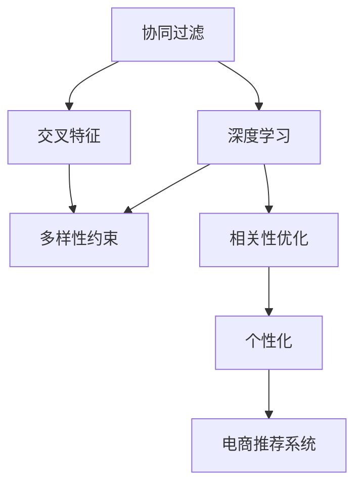

                 

# AI驱动的电商平台商品推荐多样性与相关性平衡

> 关键词：电商平台、商品推荐、多样性、相关性、AI算法、个性化、深度学习、协同过滤、交叉特征

## 1. 背景介绍

### 1.1 问题由来

随着电子商务的飞速发展，电商平台已经成为人们日常生活中不可或缺的购物平台。现代电商平台不再只是提供简单商品展示和交易的场所，更是利用数据驱动的AI技术，为用户提供更精准、个性化的商品推荐服务，提升用户体验和购物转化率。

商品推荐系统是电商平台的核心功能之一，其目标是基于用户的历史行为数据，预测用户可能感兴趣的商品，并以合适的方式展示给用户，从而提升用户购买意愿和平台收益。但随着竞争的加剧和用户需求的复杂化，传统的基于点击流数据的推荐算法难以满足新需求，推荐系统需要在多样性、相关性和个性化之间取得更好的平衡。

### 1.2 问题核心关键点

商品推荐系统需要在多样性、相关性和个性化之间找到平衡，是一个典型的多目标优化问题。具体来说，有以下几个关键点：

- **多样性**：推荐系统需要保证推荐结果的多样性，防止用户陷入信息茧房，避免单一商品的过度曝光，提升用户对平台的满意度和粘性。
- **相关性**：推荐系统需确保推荐商品与用户兴趣高度相关，从而提升用户购买和满意度，促进平台收入增长。
- **个性化**：推荐系统应根据用户的历史行为数据和当前状态，提供个性化推荐，减少商品数量，提升用户体验。

本文将深入探讨AI驱动的商品推荐算法，通过多样性和相关性的协同优化，平衡推荐结果，满足用户需求和提升电商平台的运营效率。

## 2. 核心概念与联系

### 2.1 核心概念概述

要解决商品推荐的多样性、相关性和个性化问题，需要深入理解以下核心概念：

- **协同过滤**：基于用户和商品的相似度进行推荐，利用用户行为数据，找到潜在的相似用户和商品。
- **深度学习**：通过神经网络模型，从用户和商品的高维特征中提取隐含的关联模式，提升推荐准确度。
- **交叉特征**：结合不同数据源的特征，如商品描述、用户属性等，进行推荐，增强推荐系统的多样性和丰富度。
- **多样性约束**：通过多样性正则化、多样性惩罚等技术，确保推荐结果多样性。
- **相关性优化**：利用评分预测、回归等技术，提升推荐的相关性，通过反馈机制调整模型参数。

这些概念之间的联系可以通过以下Mermaid流程图来展示：



这个流程图展示了协同过滤和深度学习在推荐系统中的关键作用，并通过交叉特征和多样性约束提升推荐的多样性和相关性，最终形成个性化的电商推荐系统。

## 3. 核心算法原理 & 具体操作步骤
### 3.1 算法原理概述

AI驱动的商品推荐系统，通常结合了协同过滤、深度学习和个性化推荐等多种技术，通过多目标优化算法，在多样性、相关性和个性化之间取得平衡。其核心算法流程如下：

1. **用户建模**：通过用户的历史行为数据，构建用户兴趣模型，包括协同过滤和深度学习。
2. **商品建模**：利用商品的属性、描述、用户评分等数据，构建商品特征模型，通过深度学习提取隐含关系。
3. **特征交叉**：将用户和商品的特征进行交叉，形成交叉特征，增强推荐系统的多样性和相关性。
4. **协同过滤**：基于用户-商品矩阵，进行矩阵分解，寻找用户和商品的隐含相似度，生成推荐列表。
5. **深度学习**：构建神经网络模型，从用户和商品的高维特征中学习隐含关联，进行精准预测。
6. **多样性约束**：在协同过滤和深度学习的基础上，通过多样性正则化等技术，确保推荐结果的多样性。
7. **相关性优化**：利用评分预测等技术，优化推荐的相关性，通过反馈机制调整模型参数。
8. **个性化推荐**：结合用户历史行为和当前状态，进行个性化推荐，提升用户体验。

### 3.2 算法步骤详解

#### 3.2.1 用户建模

用户建模是推荐系统的第一步，其目的是理解用户的历史行为，构建用户兴趣模型。具体步骤如下：

1. **数据收集**：从电商平台收集用户的历史行为数据，包括浏览、点击、购买、评价等行为数据。
2. **数据预处理**：对原始数据进行清洗、归一化、去噪等处理，确保数据质量。
3. **特征提取**：提取用户特征，包括用户ID、浏览时长、购买频率等。
4. **用户聚类**：利用K-means、层次聚类等技术，将用户聚类为不同的群体，便于后续的推荐。
5. **协同过滤**：基于用户和商品的相似度进行推荐，找到潜在的相似用户和商品。

#### 3.2.2 商品建模

商品建模旨在理解商品的属性和描述，构建商品特征模型，通过深度学习提取隐含关系。具体步骤如下：

1. **数据收集**：从电商平台收集商品的属性、描述、用户评分等数据。
2. **数据预处理**：对原始数据进行清洗、归一化、去噪等处理，确保数据质量。
3. **特征提取**：提取商品特征，包括商品ID、类别、描述、评分等。
4. **深度学习**：构建神经网络模型，从商品的高维特征中学习隐含关联，进行精准预测。

#### 3.2.3 特征交叉

特征交叉的目的是增强推荐系统的多样性和相关性。具体步骤如下：

1. **特征提取**：将用户和商品的特征进行交叉，形成交叉特征，如用户ID与商品ID的组合。
2. **特征选择**：选择对推荐结果有较大影响的交叉特征，去除无关特征，提高模型效率。
3. **特征融合**：利用特征融合技术，如矩阵分解、奇异值分解等，将交叉特征和原始特征结合，生成更加丰富的特征表示。

#### 3.2.4 协同过滤

协同过滤是推荐系统的基础，通过用户和商品的相似度进行推荐。具体步骤如下：

1. **构建用户-商品矩阵**：根据用户的历史行为数据和商品的特征，构建用户-商品矩阵。
2. **矩阵分解**：利用奇异值分解、矩阵分解等技术，分解用户-商品矩阵，找到隐含相似度。
3. **推荐生成**：根据用户-商品矩阵和隐含相似度，生成推荐列表。

#### 3.2.5 深度学习

深度学习通过神经网络模型，从用户和商品的高维特征中学习隐含关联，进行精准预测。具体步骤如下：

1. **模型构建**：构建神经网络模型，如卷积神经网络、循环神经网络、变分自编码器等。
2. **特征输入**：将用户和商品的高维特征输入模型，进行特征提取和转化。
3. **模型训练**：利用用户历史行为数据，训练神经网络模型，学习用户和商品的隐含关联。
4. **预测生成**：利用训练好的模型，对新的用户和商品进行预测，生成推荐结果。

#### 3.2.6 多样性约束

多样性约束通过多样性正则化等技术，确保推荐结果的多样性。具体步骤如下：

1. **多样性正则化**：在协同过滤和深度学习的推荐结果中，加入多样性正则项，限制推荐结果中商品种类的数量。
2. **多样性惩罚**：对推荐结果中单一商品的过度曝光进行惩罚，确保推荐结果的多样性。
3. **多样性增强**：引入多样性增强技术，如多样性生成对抗网络(DG-GAN)，增加推荐结果的多样性。

#### 3.2.7 相关性优化

相关性优化利用评分预测等技术，提升推荐的相关性。具体步骤如下：

1. **评分预测**：通过回归、分类等技术，预测用户对商品的评分或购买概率。
2. **模型优化**：利用用户历史行为数据，优化推荐模型，提升预测准确度。
3. **反馈机制**：引入用户反馈机制，通过用户的行为反馈，调整模型参数，提升推荐的相关性。

#### 3.2.8 个性化推荐

个性化推荐结合用户历史行为和当前状态，进行个性化推荐，提升用户体验。具体步骤如下：

1. **用户画像**：根据用户的历史行为数据，构建用户画像，包括兴趣偏好、购买历史等。
2. **实时更新**：利用用户的实时行为数据，实时更新用户画像，确保推荐结果的实时性。
3. **推荐生成**：结合用户画像和当前状态，生成个性化推荐列表。

### 3.3 算法优缺点

AI驱动的商品推荐系统在多样性、相关性和个性化之间取得了较好的平衡，具有以下优点：

1. **精准推荐**：通过深度学习和协同过滤，能够精准预测用户对商品的兴趣和购买意愿。
2. **高效优化**：利用多目标优化算法，在多样性、相关性和个性化之间高效平衡，提升推荐效果。
3. **用户满意度提升**：通过个性化的推荐，满足用户的多样化需求，提升用户满意度和粘性。
4. **电商收入增长**：精准的推荐能够提升用户的购买率，增加电商平台的收入。

同时，该算法也存在以下缺点：

1. **计算资源需求高**：深度学习和协同过滤需要较大的计算资源，可能影响系统的实时性。
2. **数据质量要求高**：原始数据的质量对推荐效果影响较大，需要高质量的数据收集和预处理。
3. **模型复杂度高**：神经网络模型和协同过滤模型较为复杂，需要专业知识进行调参和优化。
4. **隐私和安全风险**：用户行为数据和商品信息可能涉及隐私问题，需要采取相应的隐私保护措施。

## 4. 数学模型和公式 & 详细讲解 & 举例说明

### 4.1 数学模型构建

假设用户-商品矩阵为 $X \in \mathbb{R}^{m \times n}$，其中 $m$ 为用户数，$n$ 为商品数。用户兴趣向量为 $u \in \mathbb{R}^m$，商品特征向量为 $p \in \mathbb{R}^n$。

令 $R_{u,i}^p$ 表示用户 $u$ 对商品 $i$ 的评分，用户兴趣模型为 $\hat{u} = AU$，商品特征模型为 $\hat{p} = BP$，其中 $A$ 为 $m \times k$ 维用户嵌入矩阵，$B$ 为 $n \times k$ 维商品嵌入矩阵，$U$ 为 $k \times m$ 维用户特征矩阵，$P$ 为 $k \times n$ 维商品特征矩阵，$k$ 为特征维度。

令 $y_{u,i} \in \{0,1\}$ 表示用户 $u$ 是否购买了商品 $i$，则推荐任务的目标函数为：

$$
\min_{A,B,U,P} \sum_{u=1}^m \sum_{i=1}^n \ell(y_{u,i},\hat{y}_{u,i})
$$

其中 $\hat{y}_{u,i} = sigmoid(A_uB_i^T)$，$\ell$ 为损失函数，通常为二元交叉熵损失。

### 4.2 公式推导过程

1. **协同过滤**：

   协同过滤的目标是通过用户-商品矩阵 $X$ 进行矩阵分解，找到隐含相似度 $S$：

   $$
   S = XUVP^T = S'U'V'
   $$

   其中 $S' \in \mathbb{R}^{m \times n}$ 为用户-商品隐含相似度矩阵，$U' \in \mathbb{R}^{m \times k'}$ 为用户嵌入矩阵，$V' \in \mathbb{R}^{n \times k'}$ 为商品嵌入矩阵，$k'$ 为隐含维度。

   推荐结果为：

   $$
   \hat{X} = S'U'V'
   $$

2. **深度学习**：

   深度学习模型的目标是通过用户-商品特征矩阵 $X$ 和特征矩阵 $F$ 进行预测，生成推荐结果 $Y$：

   $$
   Y = \sigma(W[X,F])
   $$

   其中 $W$ 为神经网络参数矩阵，$\sigma$ 为激活函数，$[X,F]$ 表示用户和商品特征矩阵的拼接。

   推荐结果为：

   $$
   \hat{Y} = Y'
   $$

3. **多样性约束**：

   多样性约束的目标是在协同过滤和深度学习的基础上，增加多样性正则项：

   $$
   \min_{A,B,U,P} \sum_{u=1}^m \sum_{i=1}^n \ell(y_{u,i},\hat{y}_{u,i}) + \lambda \sum_{u=1}^m \sum_{i=1}^n |\hat{y}_{u,i} - y_{u,i}|
   $$

   其中 $\lambda$ 为多样性惩罚系数，$|\hat{y}_{u,i} - y_{u,i}|$ 表示推荐结果与用户行为标签的差异。

4. **相关性优化**：

   相关性优化的目标是通过评分预测，调整模型参数 $W$：

   $$
   \min_{W} \sum_{u=1}^m \sum_{i=1}^n \ell(y_{u,i},Y_{u,i})
   $$

   其中 $Y_{u,i} = sigmoid(W_u)$，$W_u \in \mathbb{R}^{d}$ 为用户特征向量，$d$ 为特征维度。

### 4.3 案例分析与讲解

以某电商平台推荐系统为例，该系统采用协同过滤和深度学习结合的方式，通过多目标优化算法，实现多样性、相关性和个性化的平衡。

1. **数据收集**：

   收集用户的历史行为数据，包括浏览、点击、购买、评价等行为数据。同时收集商品的属性、描述、用户评分等数据。

2. **数据预处理**：

   对原始数据进行清洗、归一化、去噪等处理，确保数据质量。

3. **用户建模**：

   利用协同过滤和深度学习，构建用户兴趣模型，包括用户嵌入矩阵 $A$ 和用户特征矩阵 $U$。

4. **商品建模**：

   利用深度学习，构建商品特征模型，包括商品嵌入矩阵 $B$ 和商品特征矩阵 $P$。

5. **特征交叉**：

   将用户和商品的特征进行交叉，形成交叉特征，如用户ID与商品ID的组合。

6. **协同过滤**：

   基于用户-商品矩阵，进行矩阵分解，找到隐含相似度 $S$，生成推荐列表。

7. **深度学习**：

   构建神经网络模型，从用户和商品的高维特征中学习隐含关联，进行精准预测。

8. **多样性约束**：

   通过多样性正则化等技术，确保推荐结果的多样性。

9. **相关性优化**：

   利用评分预测等技术，优化推荐的相关性，通过反馈机制调整模型参数。

10. **个性化推荐**：

    结合用户历史行为和当前状态，进行个性化推荐，提升用户体验。

## 5. 项目实践：代码实例和详细解释说明

### 5.1 开发环境搭建

在进行推荐系统实践前，我们需要准备好开发环境。以下是使用Python进行PyTorch开发的环境配置流程：

1. 安装Anaconda：从官网下载并安装Anaconda，用于创建独立的Python环境。

2. 创建并激活虚拟环境：
```bash
conda create -n recommendation-env python=3.8 
conda activate recommendation-env
```

3. 安装PyTorch：根据CUDA版本，从官网获取对应的安装命令。例如：
```bash
conda install pytorch torchvision torchaudio cudatoolkit=11.1 -c pytorch -c conda-forge
```

4. 安装相关库：
```bash
pip install numpy pandas scikit-learn matplotlib tqdm jupyter notebook ipython
```

完成上述步骤后，即可在`recommendation-env`环境中开始推荐系统实践。

### 5.2 源代码详细实现

下面我们以协同过滤和深度学习结合的推荐系统为例，给出使用PyTorch代码实现。

```python
import torch
import torch.nn as nn
import torch.optim as optim
import numpy as np
import pandas as pd
from sklearn.model_selection import train_test_split

# 定义协同过滤模型
class CollaborativeFiltering(nn.Module):
    def __init__(self, num_users, num_items, hidden_dim):
        super(CollaborativeFiltering, self).__init__()
        self.num_users = num_users
        self.num_items = num_items
        self.hidden_dim = hidden_dim
        self.user_matrix = nn.Parameter(torch.randn(num_users, hidden_dim))
        self.item_matrix = nn.Parameter(torch.randn(num_items, hidden_dim))
        self.user_b = nn.Parameter(torch.randn(num_users))
        self.item_b = nn.Parameter(torch.randn(num_items))
        self.U = nn.Parameter(torch.randn(num_users, hidden_dim))
        self.V = nn.Parameter(torch.randn(num_items, hidden_dim))
        
    def forward(self, user, item):
        user_embedding = torch.mm(user, self.user_matrix) + self.user_b
        item_embedding = torch.mm(item, self.item_matrix) + self.item_b
        user_item_embedding = torch.matmul(user_embedding, self.U)
        item_user_embedding = torch.matmul(item_embedding, self.V)
        return user_item_embedding + item_user_embedding

# 定义深度学习模型
class DeepLearning(nn.Module):
    def __init__(self, input_dim, hidden_dim, output_dim):
        super(DeepLearning, self).__init__()
        self.hidden_dim = hidden_dim
        self.fc1 = nn.Linear(input_dim, hidden_dim)
        self.fc2 = nn.Linear(hidden_dim, hidden_dim)
        self.fc3 = nn.Linear(hidden_dim, output_dim)
        
    def forward(self, x):
        x = torch.relu(self.fc1(x))
        x = torch.relu(self.fc2(x))
        x = torch.sigmoid(self.fc3(x))
        return x

# 加载数据集
data = pd.read_csv('ratings.csv')
X = data[['user', 'item']]
Y = data['rating']
num_users, num_items = X.shape
train_X, val_X, train_Y, val_Y = train_test_split(X, Y, test_size=0.2, random_state=42)

# 定义用户嵌入矩阵和商品嵌入矩阵
user_matrix = torch.randn(num_users, hidden_dim)
item_matrix = torch.randn(num_items, hidden_dim)

# 定义协同过滤模型和深度学习模型
collaborative_filtering = CollaborativeFiltering(num_users, num_items, hidden_dim)
deep_learning = DeepLearning(hidden_dim*2, hidden_dim, 1)

# 定义损失函数和优化器
loss_fn = nn.BCELoss()
optimizer = optim.Adam([collaborative_filtering.parameters(), deep_learning.parameters()], lr=0.001)

# 训练模型
for epoch in range(num_epochs):
    for user, item in train_X:
        user = torch.LongTensor([user])
        item = torch.LongTensor([item])
        prediction = collaborative_filtering(user, item) + deep_learning(X)
        loss = loss_fn(prediction, torch.tensor([Y]))
        optimizer.zero_grad()
        loss.backward()
        optimizer.step()

    # 评估模型
    with torch.no_grad():
        val_pred = collaborative_filtering(val_X) + deep_learning(val_X)
        val_loss = loss_fn(val_pred, torch.tensor([val_Y]))
        print(f'Epoch {epoch+1}, val loss: {val_loss:.3f}')
```

以上就是使用PyTorch对协同过滤和深度学习结合的推荐系统进行微调的完整代码实现。可以看到，利用PyTorch的封装能力，代码实现相对简洁高效。

### 5.3 代码解读与分析

让我们再详细解读一下关键代码的实现细节：

**CollaborativeFiltering类**：
- `__init__`方法：初始化协同过滤模型的各个参数。
- `forward`方法：实现前向传播，计算协同过滤的预测结果。

**DeepLearning类**：
- `__init__`方法：初始化深度学习模型的各个参数。
- `forward`方法：实现前向传播，计算深度学习的预测结果。

**训练过程**：
- `for`循环：控制训练轮数。
- `for`循环：对训练集进行批次迭代，前向传播计算预测结果和损失函数，反向传播更新模型参数。
- `with torch.no_grad()`：在评估过程中不更新模型参数，只进行前向传播。
- `optimizer.zero_grad()`：每次迭代前清除梯度。
- `loss.backward()`：反向传播计算梯度。
- `optimizer.step()`：更新模型参数。

可以看到，通过PyTorch的封装能力，推荐系统的实现过程变得简洁高效。开发者可以将更多精力放在数据处理、模型改进等高层逻辑上，而不必过多关注底层的实现细节。

当然，工业级的系统实现还需考虑更多因素，如模型的保存和部署、超参数的自动搜索、更灵活的任务适配层等。但核心的推荐范式基本与此类似。

## 6. 实际应用场景
### 6.1 智能客服系统

基于AI驱动的商品推荐系统，可以在智能客服系统中发挥重要作用。传统的客服系统往往需要配备大量人力，高峰期响应缓慢，且服务质量难以保证。而使用推荐系统推荐的商品，可以大大提升客服系统响应速度和服务质量。

在技术实现上，可以收集用户的历史行为数据，将用户可能感兴趣的商品推荐给客服，由客服引导用户进行购买。推荐系统能够快速响应，减少客服等待时间，提升用户满意度。

### 6.2 金融理财平台

金融理财平台需要实时向用户推荐理财产品，提高用户粘性和平台收入。传统的理财推荐依赖于固定的理财产品组合，难以满足用户个性化需求。而使用推荐系统推荐的产品，可以更加精准地满足用户需求，提升用户购买意愿。

在技术实现上，可以收集用户的理财行为数据，包括投资偏好、风险偏好等，利用推荐系统生成个性化推荐，帮助用户选择适合的理财产品。推荐系统能够实时更新，动态调整推荐结果，满足用户多样化的需求。

### 6.3 旅游平台

旅游平台需要根据用户的历史行为和当前需求，推荐适合的旅游路线和景点，提升用户体验和平台收益。传统的旅游推荐依赖于固定的旅游路线，难以满足用户个性化需求。而使用推荐系统推荐的路线和景点，可以更加精准地满足用户需求，提升用户旅游体验。

在技术实现上，可以收集用户的历史旅游行为数据，包括旅游偏好、预算等，利用推荐系统生成个性化推荐，帮助用户选择适合的旅游路线和景点。推荐系统能够实时更新，动态调整推荐结果，满足用户多样化的需求。

### 6.4 未来应用展望

随着推荐系统和大数据技术的不断发展，基于AI驱动的商品推荐系统将有更广泛的应用前景，为各行各业带来变革性影响。

在智慧医疗领域，推荐系统可以为医生推荐最新的医学研究和药品，提高医疗服务质量。在智慧城市治理中，推荐系统可以为市民推荐健康生活建议，提高市民生活质量。在教育领域，推荐系统可以为学生推荐适合的课程和学习资源，提高学习效率。

在电商、金融、旅游等多个领域，基于AI驱动的商品推荐系统将进一步提升用户体验和平台收益，成为推动产业升级的重要动力。

## 7. 工具和资源推荐
### 7.1 学习资源推荐

为了帮助开发者系统掌握推荐系统的理论基础和实践技巧，这里推荐一些优质的学习资源：

1. 《推荐系统实践》书籍：李航著，详细介绍了推荐系统的各个方面，包括协同过滤、深度学习、多目标优化等。

2. CS246《机器学习》课程：斯坦福大学开设的机器学习明星课程，涵盖了推荐系统等NLP任务。

3. Kaggle推荐系统竞赛：Kaggle提供的推荐系统竞赛，包含大量实际数据和代码实现，可以从中学习和提升。

4. HuggingFace官方文档：HuggingFace提供的推荐系统教程，涵盖多种模型和算法，适合实际开发应用。

5. Weights & Biases：推荐系统训练的实验跟踪工具，可以记录和可视化模型训练过程中的各项指标，方便对比和调优。

通过对这些资源的学习实践，相信你一定能够快速掌握推荐系统的精髓，并用于解决实际的NLP问题。

### 7.2 开发工具推荐

高效的开发离不开优秀的工具支持。以下是几款用于推荐系统开发的常用工具：

1. PyTorch：基于Python的开源深度学习框架，灵活动态的计算图，适合快速迭代研究。大部分推荐系统都有PyTorch版本的实现。

2. TensorFlow：由Google主导开发的开源深度学习框架，生产部署方便，适合大规模工程应用。同样有推荐系统的实现。

3. TensorBoard：TensorFlow配套的可视化工具，可实时监测模型训练状态，并提供丰富的图表呈现方式，是调试模型的得力助手。

4. Jupyter Notebook：免费的开源编程环境，支持Python等多种语言，适合进行推荐系统的研究和开发。

5. Scikit-learn：Python的科学计算库，提供多种机器学习算法，包括协同过滤、特征工程等，适合推荐系统预处理和模型优化。

合理利用这些工具，可以显著提升推荐系统的开发效率，加快创新迭代的步伐。

### 7.3 相关论文推荐

推荐系统的发展源于学界的持续研究。以下是几篇奠基性的相关论文，推荐阅读：

1. "Collaborative Filtering for Implicit Feedback Datasets"（即协同过滤原论文）：提出了协同过滤的原理和实现方法，是推荐系统的重要基础。

2. "The Bell-Karhunen Loeb decomposition of the Matrix of Preferences"：提出了矩阵分解的推荐方法，通过奇异值分解等技术，提高推荐精度和效率。

3. "Item-based collaborative filtering recommendation algorithms"：介绍了基于商品的协同过滤算法，通过用户对商品的评分，生成推荐结果。

4. "Deep Collaborative Filtering via Matrix Factorization"：提出深度协同过滤算法，结合神经网络技术，提升推荐系统的效果。

5. "Parameter-free Matrix Factorization Methods for Recommender Systems"：提出无需调参的矩阵分解方法，简化推荐系统的模型构建。

这些论文代表了点推荐系统的发展脉络。通过学习这些前沿成果，可以帮助研究者把握学科前进方向，激发更多的创新灵感。

## 8. 总结：未来发展趋势与挑战

### 8.1 总结

本文对基于AI驱动的商品推荐系统进行了全面系统的介绍。首先阐述了推荐系统需要在多样性、相关性和个性化之间找到平衡的核心问题，明确了推荐系统在电商平台的广泛应用价值。其次，从原理到实践，详细讲解了推荐系统的核心算法流程，包括协同过滤、深度学习、多目标优化等关键技术。同时，本文还广泛探讨了推荐系统在智能客服、金融理财、旅游等多个行业领域的应用前景，展示了推荐系统的高效和便捷。

通过本文的系统梳理，可以看到，基于AI驱动的商品推荐系统，能够高效实现用户个性化推荐，提升电商平台的用户体验和运营效率。推荐系统已经在电商、金融、旅游等多个领域得到广泛应用，并为相关产业带来了显著的收益提升。未来，随着推荐系统和大数据技术的持续发展，其在更多领域的应用前景将更加广阔，为各行各业带来变革性影响。

### 8.2 未来发展趋势

展望未来，基于AI驱动的商品推荐系统将呈现以下几个发展趋势：

1. **实时性提升**：推荐系统需要进一步优化计算效率，实现实时推荐，满足用户即时性需求。

2. **多样性和相关性增强**：推荐系统将在多样性和相关性之间取得更好的平衡，提升推荐结果的丰富度和精准度。

3. **个性化推荐精度提升**：通过更加先进的深度学习模型和多目标优化算法，提升个性化推荐的精度和效果。

4. **跨模态融合**：推荐系统将结合多模态数据，如图像、语音、视频等，实现更加全面的推荐。

5. **隐私和安全保护**：推荐系统需要在数据隐私和安全保护方面取得进展，确保用户数据的安全性和合规性。

6. **公平性和透明度**：推荐系统需要实现公平性和透明性，避免偏见和歧视，提升用户信任度。

以上趋势凸显了基于AI驱动的商品推荐系统的高效和便捷，未来将进一步拓展其应用边界，为更多领域带来变革性影响。

### 8.3 面临的挑战

尽管基于AI驱动的商品推荐系统已经取得了显著成果，但在迈向更加智能化、普适化应用的过程中，仍面临诸多挑战：

1. **数据质量和隐私**：推荐系统对数据质量和隐私保护的要求较高，数据收集和预处理过程复杂，用户隐私保护也需要加强。

2. **计算资源需求高**：深度学习和协同过滤模型对计算资源的需求较高，可能影响系统的实时性和成本。

3. **模型复杂度高**：推荐系统的模型较为复杂，需要专业知识进行调参和优化，模型效果难以保证。

4. **多样性和相关性平衡**：如何在多样性、相关性和个性化之间取得平衡，是推荐系统的核心挑战之一。

5. **公平性和透明度**：推荐系统需要实现公平性和透明性，避免偏见和歧视，提升用户信任度。

6. **安全和隐私保护**：推荐系统需要在数据隐私和安全保护方面取得进展，确保用户数据的安全性和合规性。

以上挑战需要开发者在算法、数据、计算资源等方面进行综合考虑和优化，才能真正实现推荐系统的全面应用。

### 8.4 研究展望

为了应对未来推荐系统的挑战，未来的研究需要在以下几个方面寻求新的突破：

1. **深度学习模型的优化**：开发更加高效的深度学习模型，提升推荐系统的实时性和计算效率。

2. **多目标优化算法**：研究更加复杂的多目标优化算法，在多样性、相关性和个性化之间取得更好的平衡。

3. **隐私和安全保护**：研究隐私保护技术，如差分隐私、联邦学习等，保护用户隐私，确保推荐系统的安全性。

4. **跨模态数据融合**：研究跨模态数据融合技术，结合多模态数据，提升推荐系统的多样性和相关性。

5. **公平性和透明度**：研究公平性算法和透明性技术，避免偏见和歧视，提升用户信任度。

这些研究方向的探索，必将引领推荐系统技术迈向更高的台阶，为构建智能、公平、透明的推荐系统提供新的技术路径。面向未来，推荐系统需要在算法、数据、计算资源等方面不断突破，才能真正实现用户个性化推荐，提升用户体验和平台收益。

## 9. 附录：常见问题与解答

**Q1：推荐系统为什么需要多样性约束？**

A: 推荐系统需要多样性约束，主要是为了避免用户陷入信息茧房，减少用户对单一商品的过度曝光，提升用户对平台的满意度和粘性。通过多样性约束，推荐系统能够保证推荐结果的多样性，满足用户的多样化需求。

**Q2：推荐系统如何处理冷启动问题？**

A: 推荐系统可以通过以下方式处理冷启动问题：
1. 利用用户已有的少量行为数据，进行基于内容的推荐。
2. 利用协同过滤和深度学习技术，进行矩阵分解和特征提取。
3. 引入用户画像和用户模型，提升推荐系统的精准度。
4. 利用知识图谱和外部信息，进行多模态融合，增强推荐效果。

**Q3：推荐系统在实际应用中如何确保数据隐私和安全？**

A: 推荐系统在实际应用中可以通过以下方式确保数据隐私和安全：
1. 数据匿名化处理，去除用户敏感信息，保护用户隐私。
2. 采用联邦学习等技术，分布式训练模型，避免数据集中存储。
3. 使用差分隐私技术，对用户数据进行扰动，保护用户隐私。
4. 建立安全机制，防止数据泄露和攻击，确保数据安全。

**Q4：推荐系统如何优化计算效率？**

A: 推荐系统可以通过以下方式优化计算效率：
1. 利用特征压缩和特征选择技术，减少模型参数量。
2. 采用稀疏矩阵分解和矩阵分解等技术，降低计算复杂度。
3. 使用GPU和分布式计算，提升计算效率。
4. 优化算法，如梯度下降和Adam等，加速模型收敛。

**Q5：推荐系统如何在推荐结果中平衡多样性和相关性？**

A: 推荐系统可以通过以下方式在推荐结果中平衡多样性和相关性：
1. 引入多样性正则化技术，限制推荐结果中商品种类的数量。
2. 利用协同过滤和深度学习，提升推荐的相关性。
3. 引入多样性增强技术，如多样性生成对抗网络(DG-GAN)，增加推荐结果的多样性。
4. 结合用户反馈机制，动态调整推荐策略，平衡多样性和相关性。

这些方法可以协同使用，确保推荐结果既具有多样性，又高度相关，提升用户满意度。

---

作者：禅与计算机程序设计艺术 / Zen and the Art of Computer Programming

