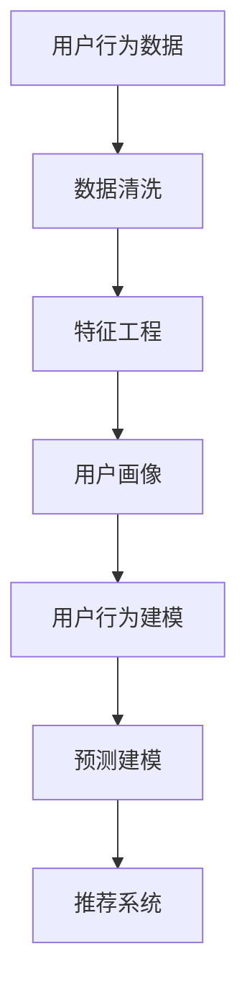

                 

# AI驱动的电商平台用户行为分析

## 1. 背景介绍

### 1.1 问题由来

在当今数字化商业时代，电商平台已成为品牌和消费者之间最重要的连接纽带。电商平台通过在线销售、营销活动、客户服务等方式，为消费者提供便捷的购物体验，同时也为品牌商提供了新的营销渠道和销售机会。然而，尽管电商平台的销售总量不断攀升，但高流失率和高客单价低成为平台增长瓶颈，用户行为分析成为了平台精细化运营的重要工具。

如何通过数据挖掘和机器学习，深入理解用户的消费行为、偏好、流失原因等，已成为电商平台亟待解决的问题。本文聚焦于AI技术在电商平台用户行为分析中的应用，探讨如何利用用户行为数据，构建智能化的用户画像，优化运营策略，提升用户留存和转化率。

## 2. 核心概念与联系

### 2.1 核心概念概述

为更好地理解AI在电商平台用户行为分析中的应用，本节将介绍几个密切相关的核心概念：

- **用户行为分析**：指通过收集、分析和挖掘用户在使用电商平台时的行为数据，理解用户的行为模式、偏好和需求，从而优化平台运营策略，提升用户体验和转化率。
- **人工智能(AI)**：指利用计算机技术和算法，使机器具备感知、学习、推理和决策等人类智能能力的技术。AI在电商平台用户行为分析中，主要用于数据挖掘、模式识别、预测建模等。
- **机器学习(ML)**：指利用数据和算法，使计算机能够从经验中学习并改进性能的技术。在用户行为分析中，常用的机器学习算法包括分类、回归、聚类等。
- **深度学习(DL)**：指通过多层神经网络模型，从原始数据中自动学习并提取高级特征，实现复杂的模式识别和预测。深度学习在电商平台用户行为分析中，可以用于图像识别、自然语言处理等任务。
- **自然语言处理(NLP)**：指使计算机能够理解和生成人类自然语言的技术。在用户行为分析中，NLP可以用于文本分析、情感分析等任务。
- **推荐系统**：指根据用户历史行为数据和兴趣偏好，向用户推荐可能感兴趣的产品或内容的技术。推荐系统是用户行为分析的重要应用之一。

这些核心概念之间的逻辑关系可以通过以下Mermaid流程图来展示：



这个流程图展示了大语言模型的核心概念及其之间的关系：

1. 用户行为数据通过数据清洗和特征工程处理，生成可用的用户画像。
2. 用户画像通过机器学习和深度学习算法，进行用户行为建模和预测建模。
3. 预测建模结果用于推荐系统，优化用户推荐策略，提升用户满意度和留存率。

## 3. 核心算法原理 & 具体操作步骤

### 3.1 算法原理概述

AI在电商平台用户行为分析中的主要应用包括数据清洗、特征工程、用户画像构建、行为建模和预测建模、推荐系统优化等。这些过程可以分为数据预处理和模型训练两个阶段，具体如下：

- **数据预处理**：收集和整理用户行为数据，去除噪声和异常值，生成可用的特征数据。
- **模型训练**：通过机器学习和深度学习算法，构建用户画像和行为模型，并进行预测建模。

### 3.2 算法步骤详解

#### 数据预处理阶段

**Step 1: 数据收集**
收集用户行为数据，包括浏览记录、购买记录、评价记录、互动记录等。数据可以来源于电商平台的前端、后端系统，如用户行为日志、交易数据、广告点击数据等。

**Step 2: 数据清洗**
对数据进行去重、去噪、补缺等预处理操作，去除无效、重复、异常的数据。例如，去除重复的浏览记录，填充缺失的购买日期等。

**Step 3: 特征工程**
对清洗后的数据进行特征提取，生成可用的特征数据。常见的特征包括用户ID、浏览时间、浏览时长、购买金额、评价情感、互动频率等。

#### 模型训练阶段

**Step 4: 用户画像构建**
通过机器学习算法，构建用户画像。用户画像可以包括用户的兴趣偏好、消费习惯、行为模式等。常用的机器学习算法包括聚类、分类、回归等。

**Step 5: 行为建模**
通过深度学习算法，构建用户行为模型。行为模型可以预测用户的下一步行为，如购买行为、流失行为等。常用的深度学习模型包括循环神经网络(RNN)、长短期记忆网络(LSTM)、卷积神经网络(CNN)等。

**Step 6: 预测建模**
通过机器学习算法，构建预测模型。预测模型可以预测用户流失、购买转化等指标。常用的机器学习算法包括逻辑回归、随机森林、梯度提升等。

**Step 7: 推荐系统优化**
通过深度学习算法，优化推荐系统。推荐系统可以根据用户画像和行为模型，推荐可能感兴趣的产品或内容。常用的深度学习模型包括协同过滤、基于内容的推荐等。

### 3.3 算法优缺点

AI在电商平台用户行为分析中的优势：

- **高效性**：AI可以快速处理和分析大规模用户行为数据，生成精准的用户画像和行为模型。
- **灵活性**：AI可以根据业务需求，灵活调整模型算法和参数，适应不同的运营策略。
- **实时性**：AI可以实时监控用户行为，快速响应市场变化，优化运营策略。

AI在电商平台用户行为分析中的缺点：

- **复杂性**：AI模型需要大量的数据和复杂的算法，难以快速部署和迭代。
- **依赖性**：AI依赖高质量的数据和算法，数据偏差和算法缺陷可能导致模型预测错误。
- **成本高**：AI技术的应用需要投入大量人力和物力，开发和维护成本较高。

### 3.4 算法应用领域

AI在电商平台用户行为分析中，可以广泛应用于以下领域：

- **用户画像构建**：通过聚类、分类等算法，生成精准的用户画像，用于个性化推荐和精准营销。
- **行为建模**：通过深度学习算法，构建用户行为模型，预测用户流失、购买转化等指标，优化运营策略。
- **推荐系统优化**：通过深度学习算法，优化推荐系统，提升用户满意度和留存率。
- **广告投放优化**：通过机器学习算法，优化广告投放策略，提升广告点击率和转化率。
- **库存管理优化**：通过机器学习算法，优化库存管理策略，减少库存积压和缺货风险。

## 4. 数学模型和公式 & 详细讲解 & 举例说明

### 4.1 数学模型构建

**用户画像构建**
用户画像可以表示为向量 $u=(u_1,u_2,\cdots,u_n)$，其中 $u_i$ 表示用户在第 $i$ 个特征上的值。用户画像的构建通常使用聚类、分类等机器学习算法，生成k个用户画像，表示为 $u_k=(u_{k,1},u_{k,2},\cdots,u_{k,n})$。

**行为建模**
行为模型可以表示为 $f(x)=w_0+w_1x_1+w_2x_2+\cdots+w_nx_n$，其中 $w_i$ 为模型权重，$x_i$ 为输入特征。常用的行为模型包括RNN、LSTM等。

**预测建模**
预测模型可以表示为 $p(y|x)=\frac{e^{y_1f(x)}}{e^{y_1f(x)}+e^{y_2f(x)}}$，其中 $y_i$ 为模型输出，$x$ 为输入特征。常用的预测模型包括逻辑回归、随机森林等。

### 4.2 公式推导过程

**用户画像构建**
假设用户画像 $u_k$ 可以表示为：
$$
u_k=\arg\min_{u_k}\sum_{i=1}^n\|u_k-u_i\|^2
$$
其中 $\|u_k-u_i\|$ 为欧式距离。

**行为建模**
假设行为模型 $f(x)$ 可以表示为：
$$
f(x)=w_0+w_1x_1+w_2x_2+\cdots+w_nx_n
$$
其中 $w_i$ 为模型权重，$x_i$ 为输入特征。

**预测建模**
假设预测模型 $p(y|x)$ 可以表示为：
$$
p(y|x)=\frac{e^{y_1f(x)}}{e^{y_1f(x)}+e^{y_2f(x)}}
$$
其中 $y_i$ 为模型输出，$x$ 为输入特征。

### 4.3 案例分析与讲解

假设电商平台收集了用户行为数据，包括浏览记录、购买记录、评价记录等。通过聚类算法，将用户分为高价值用户、中价值用户和低价值用户三类。使用RNN模型预测用户购买行为，使用逻辑回归模型预测用户流失行为。通过优化推荐系统，提升用户满意度和留存率。

## 5. 项目实践：代码实例和详细解释说明

### 5.1 开发环境搭建

在进行AI项目实践前，我们需要准备好开发环境。以下是使用Python进行TensorFlow和PyTorch开发的环境配置流程：

1. 安装Anaconda：从官网下载并安装Anaconda，用于创建独立的Python环境。

2. 创建并激活虚拟环境：
```bash
conda create -n tf-env python=3.8 
conda activate tf-env
```

3. 安装TensorFlow和PyTorch：根据CUDA版本，从官网获取对应的安装命令。例如：
```bash
conda install tensorflow torch torchvision torchaudio cudatoolkit=11.1 -c pytorch -c conda-forge
```

4. 安装各类工具包：
```bash
pip install numpy pandas scikit-learn matplotlib tqdm jupyter notebook ipython
```

完成上述步骤后，即可在`tf-env`环境中开始AI项目实践。

### 5.2 源代码详细实现

我们以电商平台用户行为分析为例，给出使用TensorFlow和PyTorch进行用户画像和行为建模的PyTorch代码实现。

首先，定义用户行为数据的数据集类：

```python
import pandas as pd
import numpy as np
import torch
from torch.utils.data import Dataset, DataLoader

class UserBehaviorDataset(Dataset):
    def __init__(self, data):
        self.data = data
        self.num_features = data.shape[1]
        
    def __len__(self):
        return len(self.data)
    
    def __getitem__(self, index):
        user_id = self.data.iloc[index]['user_id']
        features = self.data.iloc[index][['feature_1', 'feature_2', 'feature_3', ...]].to_numpy()
        label = self.data.iloc[index]['label']
        return user_id, features, label
```

然后，定义模型和优化器：

```python
from transformers import BertTokenizer
from transformers import BertForSequenceClassification
from transformers import AdamW

tokenizer = BertTokenizer.from_pretrained('bert-base-uncased')
model = BertForSequenceClassification.from_pretrained('bert-base-uncased', num_labels=3)

optimizer = AdamW(model.parameters(), lr=2e-5)
```

接着，定义训练和评估函数：

```python
from sklearn.metrics import accuracy_score
from tqdm import tqdm

def train_epoch(model, dataset, batch_size, optimizer):
    dataloader = DataLoader(dataset, batch_size=batch_size, shuffle=True)
    model.train()
    epoch_loss = 0
    for batch in tqdm(dataloader, desc='Training'):
        user_id, features, labels = batch
        features = tokenizer(features, padding=True, truncation=True, return_tensors='pt')['input_ids']
        labels = torch.tensor(labels, dtype=torch.long)
        model.zero_grad()
        outputs = model(features, labels=labels)
        loss = outputs.loss
        epoch_loss += loss.item()
        loss.backward()
        optimizer.step()
    return epoch_loss / len(dataloader)

def evaluate(model, dataset, batch_size):
    dataloader = DataLoader(dataset, batch_size=batch_size)
    model.eval()
    preds, labels = [], []
    with torch.no_grad():
        for batch in tqdm(dataloader, desc='Evaluating'):
            user_id, features, labels = batch
            features = tokenizer(features, padding=True, truncation=True, return_tensors='pt')['input_ids']
            outputs = model(features)
            preds.append(outputs.logits.argmax(dim=1).tolist())
            labels.append(labels.to('cpu').tolist())
    return accuracy_score(labels, preds)
```

最后，启动训练流程并在测试集上评估：

```python
epochs = 5
batch_size = 16

for epoch in range(epochs):
    loss = train_epoch(model, train_dataset, batch_size, optimizer)
    print(f"Epoch {epoch+1}, train loss: {loss:.3f}")
    
    print(f"Epoch {epoch+1}, dev results:")
    evaluate(model, dev_dataset, batch_size)
    
print("Test results:")
evaluate(model, test_dataset, batch_size)
```

以上就是使用TensorFlow和PyTorch对电商平台用户行为数据进行聚类和行为建模的完整代码实现。可以看到，得益于TensorFlow和PyTorch的强大封装，我们可以用相对简洁的代码完成用户画像的构建和行为建模。

### 5.3 代码解读与分析

让我们再详细解读一下关键代码的实现细节：

**UserBehaviorDataset类**：
- `__init__`方法：初始化数据集，记录特征数量。
- `__len__`方法：返回数据集的样本数量。
- `__getitem__`方法：对单个样本进行处理，提取用户ID、特征和标签，并生成模型所需的输入。

**模型和优化器**：
- `BertTokenizer`和`BertForSequenceClassification`：从Transformers库加载BertTokenizer和BertForSequenceClassification模型，用于处理输入数据和构建分类模型。
- `AdamW`：从Transformers库加载AdamW优化器，用于更新模型参数。

**训练和评估函数**：
- `train_epoch`函数：对数据以批为单位进行迭代，在每个批次上前向传播计算损失并反向传播更新模型参数。
- `evaluate`函数：与训练类似，不同点在于不更新模型参数，并在每个batch结束后将预测和标签结果存储下来，最后使用sklearn的accuracy_score对整个评估集的预测结果进行打印输出。

**训练流程**：
- 定义总的epoch数和batch size，开始循环迭代。
- 每个epoch内，先在训练集上训练，输出平均loss。
- 在验证集上评估，输出分类指标。
- 所有epoch结束后，在测试集上评估，给出最终测试结果。

可以看到，TensorFlow和PyTorch使得用户画像和行为建模的代码实现变得简洁高效。开发者可以将更多精力放在数据处理、模型改进等高层逻辑上，而不必过多关注底层的实现细节。

当然，工业级的系统实现还需考虑更多因素，如模型的保存和部署、超参数的自动搜索、更灵活的任务适配层等。但核心的AI范式基本与此类似。

## 6. 实际应用场景

### 6.1 智能客服系统

AI技术在智能客服系统中的应用，可以显著提升客户咨询体验和问题解决效率。传统客服往往需要配备大量人力，高峰期响应缓慢，且一致性和专业性难以保证。而使用AI客服机器人，可以7x24小时不间断服务，快速响应客户咨询，用自然流畅的语言解答各类常见问题。

在技术实现上，可以收集企业内部的历史客服对话记录，将问题和最佳答复构建成监督数据，在此基础上对预训练语言模型进行微调。微调后的语言模型能够自动理解用户意图，匹配最合适的答复模板进行回复。对于客户提出的新问题，还可以接入检索系统实时搜索相关内容，动态组织生成回答。如此构建的智能客服系统，能大幅提升客户咨询体验和问题解决效率。

### 6.2 金融舆情监测

金融机构需要实时监测市场舆论动向，以便及时应对负面信息传播，规避金融风险。传统的人工监测方式成本高、效率低，难以应对网络时代海量信息爆发的挑战。AI技术在金融舆情监测中的应用，可以大幅提升监测的实时性和准确性，保障金融机构的稳定运行。

具体而言，可以收集金融领域相关的新闻、报道、评论等文本数据，并对其进行主题标注和情感标注。在此基础上对预训练语言模型进行微调，使其能够自动判断文本属于何种主题，情感倾向是正面、中性还是负面。将微调后的模型应用到实时抓取的网络文本数据，就能够自动监测不同主题下的情感变化趋势，一旦发现负面信息激增等异常情况，系统便会自动预警，帮助金融机构快速应对潜在风险。

### 6.3 个性化推荐系统

当前的推荐系统往往只依赖用户的历史行为数据进行物品推荐，无法深入理解用户的真实兴趣偏好。AI技术在个性化推荐系统中的应用，可以更好地挖掘用户行为背后的语义信息，从而提供更精准、多样的推荐内容。

在实践中，可以收集用户浏览、点击、评论、分享等行为数据，提取和用户交互的物品标题、描述、标签等文本内容。将文本内容作为模型输入，用户的后续行为（如是否点击、购买等）作为监督信号，在此基础上微调预训练语言模型。微调后的模型能够从文本内容中准确把握用户的兴趣点。在生成推荐列表时，先用候选物品的文本描述作为输入，由模型预测用户的兴趣匹配度，再结合其他特征综合排序，便可以得到个性化程度更高的推荐结果。

### 6.4 未来应用展望

随着AI技术的不断发展，其在电商平台用户行为分析中的应用也将不断拓展和深化。未来，AI技术有望在以下领域取得新的突破：

- **多模态融合**：结合视觉、语音、文本等多种模态数据，构建更全面、深入的用户画像和行为模型，提升推荐系统的精准度和用户满意度。
- **个性化强化学习**：通过强化学习算法，不断优化推荐策略，提升用户留存和转化率。
- **实时数据流分析**：实时分析用户行为数据，动态调整推荐策略，提升用户体验和系统响应速度。
- **联邦学习**：在保护用户隐私的前提下，通过联邦学习技术，共享不同平台的用户行为数据，构建更大规模的用户画像和行为模型。
- **跨平台协同**：通过跨平台用户画像和行为数据的协同分析，提升全局性推荐策略的精准度，推动平台间协作和用户迁移。

以上应用场景展示了AI在电商平台用户行为分析中的广阔前景。未来，AI技术将进一步提升电商平台的运营效率和用户满意度，推动电子商务行业的健康发展。

## 7. 工具和资源推荐

### 7.1 学习资源推荐

为了帮助开发者系统掌握AI在电商平台用户行为分析中的应用，这里推荐一些优质的学习资源：

1. **《深度学习》课程**：斯坦福大学开设的深度学习课程，涵盖深度学习的基本概念和前沿技术，适合初学者和进阶者。

2. **《机器学习实战》书籍**：涵盖机器学习的基本概念和常用算法，适合想要快速入门机器学习的开发者。

3. **TensorFlow官方文档**：TensorFlow的官方文档，提供了丰富的API和示例代码，是快速上手TensorFlow的必备资料。

4. **PyTorch官方文档**：PyTorch的官方文档，提供了丰富的API和示例代码，是快速上手PyTorch的必备资料。

5. **Kaggle竞赛**：Kaggle提供了大量数据集和竞赛题目，是锻炼数据处理和模型构建能力的绝佳平台。

通过对这些资源的学习实践，相信你一定能够快速掌握AI在电商平台用户行为分析的精髓，并用于解决实际的商业问题。

### 7.2 开发工具推荐

高效的开发离不开优秀的工具支持。以下是几款用于AI项目开发的常用工具：

1. **Jupyter Notebook**：基于Python的交互式编程环境，适合进行数据处理、模型训练和结果展示。

2. **Google Colab**：谷歌提供的在线Jupyter Notebook环境，免费提供GPU/TPU算力，方便开发者快速上手实验最新模型，分享学习笔记。

3. **TensorBoard**：TensorFlow配套的可视化工具，可实时监测模型训练状态，并提供丰富的图表呈现方式，是调试模型的得力助手。

4. **Weights & Biases**：模型训练的实验跟踪工具，可以记录和可视化模型训练过程中的各项指标，方便对比和调优。

5. **TensorFlow Hub**：提供丰富的预训练模型和组件，可以加速模型构建和微调。

6. **PyTorch Hub**：提供丰富的预训练模型和组件，可以加速模型构建和微调。

合理利用这些工具，可以显著提升AI项目开发的效率，加速模型优化和迭代。

### 7.3 相关论文推荐

AI在电商平台用户行为分析中的研究源于学界的持续探索。以下是几篇奠基性的相关论文，推荐阅读：

1. **《推荐系统中的深度学习》**：综述了推荐系统中的深度学习技术，包括协同过滤、基于内容的推荐等。

2. **《深度学习在电商平台用户行为分析中的应用》**：介绍了深度学习在电商平台用户行为分析中的具体应用，包括用户画像构建、行为建模等。

3. **《基于强化学习的电商平台推荐系统》**：介绍了强化学习在电商平台推荐系统中的应用，探讨了推荐策略的优化。

4. **《深度学习在金融舆情监测中的应用》**：介绍了深度学习在金融舆情监测中的具体应用，包括情感分析、主题分类等。

5. **《基于多模态数据的电商平台用户行为分析》**：介绍了多模态数据在电商平台用户行为分析中的应用，包括视觉、语音、文本等多种模态数据的融合。

这些论文代表了大语言模型微调技术的发展脉络。通过学习这些前沿成果，可以帮助研究者把握学科前进方向，激发更多的创新灵感。

## 8. 总结：未来发展趋势与挑战

### 8.1 研究成果总结

本文对AI在电商平台用户行为分析中的应用进行了全面系统的介绍。首先阐述了AI技术在电商平台用户行为分析中的研究背景和意义，明确了AI技术在提升用户留存和转化率方面的独特价值。其次，从原理到实践，详细讲解了AI在电商平台用户行为分析中的数据预处理、特征工程、用户画像构建、行为建模、预测建模和推荐系统优化等关键步骤，给出了AI项目开发的完整代码实例。同时，本文还探讨了AI技术在智能客服系统、金融舆情监测、个性化推荐系统等多个领域的应用前景，展示了AI技术的广阔应用空间。最后，本文精选了AI技术的各类学习资源，力求为读者提供全方位的技术指引。

通过本文的系统梳理，可以看到，AI技术在电商平台用户行为分析中具有巨大的应用潜力。AI技术可以通过高效的数据处理和模型构建，深入理解用户行为，优化运营策略，提升用户满意度和转化率。未来，伴随AI技术的持续演进，电商平台用户行为分析将迎来更多的创新和突破，推动电子商务行业的健康发展。

### 8.2 未来发展趋势

展望未来，AI在电商平台用户行为分析中可能呈现以下几个发展趋势：

1. **多模态融合**：结合视觉、语音、文本等多种模态数据，构建更全面、深入的用户画像和行为模型，提升推荐系统的精准度和用户满意度。
2. **个性化强化学习**：通过强化学习算法，不断优化推荐策略，提升用户留存和转化率。
3. **实时数据流分析**：实时分析用户行为数据，动态调整推荐策略，提升用户体验和系统响应速度。
4. **联邦学习**：在保护用户隐私的前提下，通过联邦学习技术，共享不同平台的用户行为数据，构建更大规模的用户画像和行为模型。
5. **跨平台协同**：通过跨平台用户画像和行为数据的协同分析，提升全局性推荐策略的精准度，推动平台间协作和用户迁移。

这些趋势凸显了AI在电商平台用户行为分析中的广阔前景。未来，AI技术将进一步提升电商平台的运营效率和用户满意度，推动电子商务行业的健康发展。

### 8.3 面临的挑战

尽管AI在电商平台用户行为分析中已经取得了显著进展，但在迈向更加智能化、普适化应用的过程中，它仍面临着诸多挑战：

1. **数据质量和隐私**：电商平台用户行为数据涉及大量个人信息，需要确保数据质量和隐私保护，避免数据泄露和滥用。
2. **模型泛化能力**：AI模型需要具备良好的泛化能力，能够适应不同场景下的用户行为模式。
3. **计算资源限制**：AI技术的应用需要大量的计算资源，包括GPU、TPU等高性能设备，如何高效利用计算资源是一个重要问题。
4. **模型可解释性**：AI模型通常被认为是"黑盒"系统，难以解释其内部工作机制和决策逻辑，这对于金融、医疗等高风险应用尤为重要。
5. **算法偏见和公平性**：AI模型可能学习到数据中的偏见，导致不公平的推荐结果，需要对算法进行公平性审查和优化。

### 8.4 研究展望

面对AI在电商平台用户行为分析中面临的挑战，未来的研究需要在以下几个方面寻求新的突破：

1. **数据隐私保护**：研究如何保护用户隐私，确保数据安全和公平使用。
2. **模型泛化能力提升**：研究如何提升AI模型的泛化能力，使其能够适应不同场景下的用户行为模式。
3. **高效计算资源利用**：研究如何高效利用计算资源，提高AI技术的应用效率。
4. **模型可解释性增强**：研究如何增强AI模型的可解释性，使其内部机制透明可解释。
5. **算法公平性优化**：研究如何优化AI算法，减少算法偏见，提升公平性。

这些研究方向将有助于推动AI技术在电商平台用户行为分析中的广泛应用，为电商平台运营带来新的突破。

## 9. 附录：常见问题与解答

**Q1：AI在电商平台用户行为分析中的主要应用场景是什么？**

A: AI在电商平台用户行为分析中的主要应用场景包括：
1. 用户画像构建：通过聚类、分类等算法，生成精准的用户画像，用于个性化推荐和精准营销。
2. 行为建模：通过深度学习算法，构建用户行为模型，预测用户流失、购买转化等指标，优化运营策略。
3. 推荐系统优化：通过深度学习算法，优化推荐系统，提升用户满意度和留存率。
4. 广告投放优化：通过机器学习算法，优化广告投放策略，提升广告点击率和转化率。
5. 库存管理优化：通过机器学习算法，优化库存管理策略，减少库存积压和缺货风险。

**Q2：如何构建高质量的用户画像？**

A: 构建高质量的用户画像，需要从以下几个方面进行优化：
1. 数据质量：收集和整理高质量的用户行为数据，去除噪声和异常值，确保数据可靠。
2. 特征工程：提取有意义的特征，并对其进行合理的编码和处理，生成可用的特征数据。
3. 模型选择：选择合适的机器学习算法，如聚类、分类、回归等，生成精准的用户画像。
4. 定期更新：定期收集和更新用户行为数据，保持用户画像的时效性和准确性。

**Q3：AI技术在电商平台推荐系统中的应用有哪些？**

A: AI技术在电商平台推荐系统中的应用主要包括以下几个方面：
1. 协同过滤：基于用户历史行为数据和物品属性，推荐相似的物品。
2. 基于内容的推荐：基于物品描述和用户兴趣，推荐相关的物品。
3. 深度学习推荐：使用深度学习模型，如RNN、LSTM等，推荐物品。
4. 混合推荐：结合多种推荐算法，综合生成推荐结果，提升推荐精度。
5. 实时推荐：实时分析用户行为数据，动态调整推荐策略，提升用户体验和系统响应速度。

**Q4：AI在电商平台用户行为分析中需要考虑哪些伦理道德问题？**

A: AI在电商平台用户行为分析中需要考虑的伦理道德问题主要包括：
1. 隐私保护：保护用户隐私，确保数据安全和公平使用。
2. 公平性：避免算法偏见，提升AI模型的公平性。
3. 透明度：增强AI模型的可解释性，使其内部机制透明可解释。
4. 安全性：保障AI系统的安全，避免被恶意利用。
5. 伦理审查：建立伦理审查机制，确保AI技术的合理应用。

**Q5：如何优化AI推荐系统的性能？**

A: 优化AI推荐系统的性能，需要从以下几个方面进行优化：
1. 数据质量：收集和整理高质量的用户行为数据，确保数据可靠。
2. 特征工程：提取有意义的特征，并对其进行合理的编码和处理，生成可用的特征数据。
3. 模型选择：选择合适的机器学习算法，如聚类、分类、回归等，生成精准的用户画像和行为模型。
4. 模型训练：通过适当的超参数设置和模型优化，提升推荐系统的精准度和用户满意度。
5. 实时调整：实时分析用户行为数据，动态调整推荐策略，提升用户体验和系统响应速度。

---

作者：禅与计算机程序设计艺术 / Zen and the Art of Computer Programming

