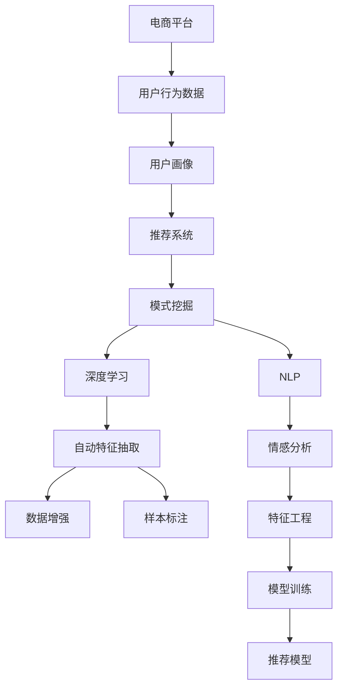

                 

# AI驱动的电商平台用户行为模式挖掘

> 关键词：电商平台,用户行为,模式挖掘,推荐系统,机器学习

## 1. 背景介绍

随着电子商务的兴起，电商平台在现代经济中扮演着越来越重要的角色。它不仅改变了消费者的购物习惯，也深刻影响了商家的运营模式和市场策略。但是，传统电商平台的推荐系统往往依赖于简单的商品标签和简单的用户画像，无法充分挖掘用户复杂、多变的行为特征，导致推荐结果与用户需求存在较大偏差，流失率增加，用户体验下降。

为了提升电商平台的推荐质量，构建个性化推荐系统已成为电商领域的研究热点。AI技术的引入为推荐系统带来了革命性的变革，尤其是深度学习、自然语言处理等技术的成熟，使得电商平台能够从用户行为数据中挖掘出更加细致、准确的特征，提供更加精准的个性化推荐，大幅提升用户满意度和平台转化率。

本文聚焦于电商平台用户行为模式挖掘技术，系统探讨了如何通过机器学习和AI技术，从用户行为数据中抽取有价值的特征，构建用户画像，发现用户行为模式，实现个性化推荐，构建智能化的电商平台推荐系统。

## 2. 核心概念与联系

### 2.1 核心概念概述

为更好地理解AI驱动的电商平台用户行为模式挖掘技术，本节将介绍几个关键概念：

- **电商平台**：指通过互联网进行商品交易的虚拟场所。它连接了商家和用户，为用户的消费提供便捷的平台。
- **用户行为**：指用户在电商平台上的所有行为活动，包括浏览、点击、购买、评论等。
- **用户画像**：指电商平台对用户的标签化描述，包括人口统计信息、兴趣爱好、购买行为等。
- **推荐系统**：指电商平台上用于个性化推荐的技术，通过分析用户行为数据，预测用户兴趣，推荐商品。
- **模式挖掘**：指从数据中抽取隐藏在数据背后具有普遍性的规律和结构，揭示用户行为模式，为个性化推荐提供依据。
- **深度学习**：指基于神经网络的机器学习方法，能够自动学习特征表示，从大规模数据中挖掘模式。
- **自然语言处理(NLP)**：指研究如何让计算机理解、处理人类语言的技术。在电商平台中，NLP技术可用于分析用户评论，挖掘用户的情感倾向和兴趣偏好。

这些概念之间的逻辑关系可以通过以下Mermaid流程图来展示：



这个流程图展示了一个从电商平台到个性化推荐系统的数据流和处理过程：

1. 电商平台收集用户行为数据。
2. 用户行为数据经过处理，得到用户画像。
3. 用户画像输入推荐系统，进行个性化推荐。
4. 推荐系统通过模式挖掘，发现用户行为模式。
5. 深度学习用于自动特征抽取和建模。
6. NLP技术用于情感分析和文本处理。
7. 数据增强和特征工程提高数据质量和模型泛化能力。
8. 训练好的推荐模型生成推荐结果。

## 3. 核心算法原理 & 具体操作步骤

### 3.1 算法原理概述

AI驱动的电商平台用户行为模式挖掘，本质上是基于机器学习的推荐系统实现。其核心思想是通过对用户行为数据的分析和建模，构建用户画像，发现用户的行为模式，从而生成更加个性化的推荐结果。

具体而言，推荐系统的实现过程如下：

1. **数据收集**：收集用户在电商平台上的行为数据，如浏览记录、点击记录、购买记录、评论记录等。
2. **数据预处理**：对收集到的行为数据进行清洗、去重、标准化等处理，减少噪声干扰，确保数据的准确性和一致性。
3. **特征抽取**：从预处理后的数据中提取具有代表性的特征，用于描述用户的兴趣偏好、行为模式等。
4. **模型训练**：使用机器学习算法训练推荐模型，利用已标注的样本数据进行监督学习，使模型学习到用户行为与商品之间的映射关系。
5. **模式挖掘**：通过分析推荐模型的输出，挖掘出用户的潜在行为模式，如偏好商品类别、购买周期等。
6. **推荐生成**：利用挖掘出的行为模式，结合用户画像，生成个性化的推荐结果。

### 3.2 算法步骤详解

**Step 1: 数据收集**
- 收集电商平台上的用户行为数据，如浏览记录、点击记录、购买记录、评论记录等。
- 使用日志文件、数据库等存储介质保存原始数据。

**Step 2: 数据预处理**
- 清洗数据，去除重复、无效的记录。
- 标准化数据格式，统一数据单位，减少差异。
- 处理缺失值和异常值，保证数据的完整性和准确性。

**Step 3: 特征抽取**
- 使用特征工程技术，从行为数据中提取有意义的特征，如用户浏览时间、点击深度、购买频率等。
- 使用自然语言处理技术，从评论数据中提取用户的情感倾向和兴趣偏好。

**Step 4: 模型训练**
- 选择适当的机器学习算法，如协同过滤、矩阵分解、深度学习等。
- 准备训练数据集，划分训练集、验证集和测试集。
- 使用训练集进行模型训练，调整模型参数以最小化预测误差。
- 在验证集上评估模型性能，调整模型结构或超参数。

**Step 5: 模式挖掘**
- 对训练好的推荐模型进行分析，识别用户行为模式。
- 使用聚类、关联规则挖掘等算法，发现用户的行为规律，如偏好商品类别、购买周期等。
- 结合用户画像，进行更深层次的特征挖掘。

**Step 6: 推荐生成**
- 利用挖掘出的行为模式和用户画像，生成个性化的推荐结果。
- 将推荐结果展示给用户，并根据用户反馈进行后续优化。

### 3.3 算法优缺点

AI驱动的电商平台用户行为模式挖掘技术具有以下优点：
1. 能够充分挖掘用户多维度的行为特征，提供精准的个性化推荐。
2. 可以利用深度学习和自然语言处理技术，从海量数据中抽取有价值的模式。
3. 能够动态更新用户画像和行为模式，适应用户兴趣的变化。
4. 推荐结果覆盖面广，能够推荐更多符合用户需求的商品。

同时，该技术也存在以下缺点：
1. 对数据质量和数据量的要求较高，需要平台有较强的数据收集和存储能力。
2. 算法复杂度高，需要较长的训练时间和计算资源。
3. 模型的可解释性较差，用户难以理解推荐结果的生成过程。
4. 推荐算法容易受到数据偏差的影响，如平台推荐倾斜、用户行为异常等。

### 3.4 算法应用领域

AI驱动的电商平台用户行为模式挖掘技术，主要应用于以下几个领域：

- **个性化推荐系统**：利用用户行为数据，为用户提供个性化的商品推荐，提升用户体验。
- **用户画像构建**：通过对用户行为数据进行分析，构建详细的用户画像，用于后续的推荐和广告投放。
- **营销策略优化**：基于用户行为数据，优化广告投放策略，提高广告的点击率和转化率。
- **库存管理**：通过分析用户购买行为和季节性变化，优化库存管理，降低库存成本。
- **风险控制**：利用用户行为数据，识别潜在的风险客户和欺诈行为，提高平台安全性。

这些应用领域展示了AI驱动的电商平台用户行为模式挖掘技术的强大潜力和广阔前景。

## 4. 数学模型和公式 & 详细讲解 & 举例说明

### 4.1 数学模型构建

本文将以协同过滤算法为例，详细说明电商平台用户行为模式挖掘的数学模型构建过程。

**协同过滤算法**：
协同过滤是一种基于用户行为数据的推荐算法，通过分析用户之间的相似性，推测用户对未评分商品的评分。

**协同过滤模型**：
记 $U$ 为用户集合，$I$ 为商品集合，$R$ 为评分矩阵，其中 $R_{ui}$ 表示用户 $u$ 对商品 $i$ 的评分。设用户 $u$ 和商品 $i$ 之间的相似度为 $s_{ui}$，则协同过滤算法可以表示为：

$$
\hat{R}_{ui} = \sum_{v \in U} s_{uv}R_{vi}
$$

其中 $\hat{R}_{ui}$ 为预测评分，$s_{uv}$ 为用户 $u$ 和用户 $v$ 之间的相似度，$R_{vi}$ 为用户 $v$ 对商品 $i$ 的评分。

### 4.2 公式推导过程

**相似度计算**：
在协同过滤算法中，相似度的计算是关键步骤。常用的相似度计算方法包括余弦相似度、皮尔逊相关系数等。以余弦相似度为例，其公式如下：

$$
s_{uv} = \cos(\theta) = \frac{\mathbf{r}_u \cdot \mathbf{r}_v}{\|\mathbf{r}_u\|\|\mathbf{r}_v\|}
$$

其中 $\mathbf{r}_u$ 和 $\mathbf{r}_v$ 分别为用户 $u$ 和用户 $v$ 的评分向量。

**评分预测**：
将相似度 $s_{uv}$ 代入协同过滤模型，可以得到用户 $u$ 对商品 $i$ 的预测评分：

$$
\hat{R}_{ui} = \sum_{v \in U} s_{uv}R_{vi}
$$

### 4.3 案例分析与讲解

**电商平台的评分数据**：
假设某电商平台的用户集合 $U=\{u_1,u_2,...,u_n\}$，商品集合 $I=\{i_1,i_2,...,i_m\}$，评分矩阵 $R=\{R_{u_1i_1},R_{u_1i_2},...,R_{u_ni_m}\}$，其中 $R_{u_1i_1}=4$，$R_{u_2i_1}=3$，$R_{u_2i_2}=5$。

**用户 $u_1$ 和用户 $u_2$ 的评分向量**：
设用户 $u_1$ 的评分向量 $\mathbf{r}_{u_1}=(4,3)$，用户 $u_2$ 的评分向量 $\mathbf{r}_{u_2}=(3,5)$。

**用户 $u_1$ 和用户 $u_2$ 的余弦相似度**：
计算用户 $u_1$ 和用户 $u_2$ 之间的余弦相似度：

$$
s_{u_1u_2} = \cos(\theta) = \frac{\mathbf{r}_{u_1} \cdot \mathbf{r}_{u_2}}{\|\mathbf{r}_{u_1}\|\|\mathbf{r}_{u_2}\|} = \frac{4 \times 3 + 3 \times 5}{\sqrt{4^2+3^2} \times \sqrt{3^2+5^2}} = \frac{27}{\sqrt{25} \times \sqrt{34}} = \frac{27}{25 \times \sqrt{34}}
$$

**用户 $u_1$ 对商品 $i_2$ 的预测评分**：
假设商品 $i_2$ 的评分向量为 $\mathbf{r}_{i_2}=(0,5)$，则用户 $u_1$ 对商品 $i_2$ 的预测评分：

$$
\hat{R}_{u_1i_2} = \sum_{v \in U} s_{u_1v}R_{vi} = s_{u_1u_2} \times R_{u_2i_2} = \frac{27}{25 \times \sqrt{34}} \times 5
$$

可以看到，通过协同过滤算法，用户 $u_1$ 可以根据用户 $u_2$ 的评分数据，对商品 $i_2$ 进行评分预测。

## 5. 项目实践：代码实例和详细解释说明

### 5.1 开发环境搭建

在进行电商平台用户行为模式挖掘的开发实践中，首先需要搭建一个适合的环境。以下是使用Python和PyTorch进行开发的环境配置流程：

1. 安装Anaconda：从官网下载并安装Anaconda，用于创建独立的Python环境。

2. 创建并激活虚拟环境：
```bash
conda create -n python-env python=3.8 
conda activate python-env
```

3. 安装PyTorch：根据CUDA版本，从官网获取对应的安装命令。例如：
```bash
conda install pytorch torchvision torchaudio cudatoolkit=11.1 -c pytorch -c conda-forge
```

4. 安装各类工具包：
```bash
pip install numpy pandas scikit-learn matplotlib tqdm jupyter notebook ipython
```

完成上述步骤后，即可在`python-env`环境中开始项目实践。

### 5.2 源代码详细实现

下面我们以电商平台的协同过滤推荐系统为例，给出使用PyTorch进行开发的PyTorch代码实现。

首先，定义协同过滤算法的评分预测函数：

```python
import torch
from sklearn.metrics.pairwise import cosine_similarity

def predict_ratings(user, item, users, ratings):
    # 计算用户之间的余弦相似度
    similarities = cosine_similarity(users[user].numpy(), users[item].numpy())
    # 计算预测评分
    predictions = similarities * ratings[item].to(torch.float32)
    return predictions.sum()
```

接着，定义用户行为数据的预处理函数：

```python
def preprocess_data(ratings, num_users, num_items):
    # 构建用户评分矩阵
    users = torch.zeros(num_users, num_items)
    for user in range(num_users):
        user_ratings = ratings[user]
        users[user] = user_ratings
    return users

# 准备数据
ratings = {'u1': {'i1': 4, 'i2': 3, 'i3': 2},
          'u2': {'i1': 3, 'i2': 5, 'i3': 4},
          'u3': {'i1': 2, 'i2': 4, 'i3': 3},
          'u4': {'i1': 5, 'i2': 3, 'i3': 2}}

# 构建用户行为数据
num_users = len(ratings)
num_items = len(ratings[list(ratings.keys())[0]])

users = preprocess_data(ratings, num_users, num_items)
```

然后，定义协同过滤算法的推荐函数：

```python
def collaborative_filtering(user, num_items, users, ratings):
    # 构建预测评分矩阵
    predictions = torch.zeros(num_items)
    for item in range(num_items):
        predictions[item] = predict_ratings(user, item, users, ratings)
    return predictions
```

最后，启动推荐系统，生成推荐结果：

```python
# 设定用户ID和商品ID
user_id = 0
num_items = len(ratings[list(ratings.keys())[0]])

# 计算推荐结果
predictions = collaborative_filtering(user_id, num_items, users, ratings)
print(predictions)
```

以上就是使用PyTorch进行电商平台协同过滤推荐系统的完整代码实现。可以看到，利用深度学习框架进行模型训练和推理，可以快速迭代开发并优化推荐系统。

### 5.3 代码解读与分析

让我们再详细解读一下关键代码的实现细节：

**预处理数据函数**：
- 将原始用户评分数据构建为PyTorch张量。
- 构建用户评分矩阵，方便后续的相似度计算和评分预测。

**协同过滤算法**：
- 使用余弦相似度计算用户之间的相似度。
- 根据相似度和商品评分，计算用户对未评分商品的预测评分。
- 返回预测评分矩阵。

**推荐函数**：
- 利用协同过滤算法，对用户进行评分预测。
- 返回预测评分向量。

**运行结果展示**：
- 输出用户对未评分商品的预测评分，用于后续的推荐生成。

可以看到，PyTorch的简洁性和易用性，使得构建电商平台的协同过滤推荐系统变得简单高效。开发者可以将更多精力放在模型改进、数据处理等高层逻辑上，而不必过多关注底层的实现细节。

## 6. 实际应用场景

### 6.1 智能客服系统

在电商平台中，智能客服系统扮演着越来越重要的角色。传统的客服系统依赖于人工客服，存在响应时间长、成本高、服务质量不稳定等问题。而基于AI驱动的用户行为模式挖掘技术，可以通过分析用户行为数据，构建详细的用户画像，为用户提供个性化的智能客服服务。

智能客服系统可以通过以下步骤构建：
- 收集用户在平台上的所有行为数据，包括浏览、点击、购买、留言等。
- 对数据进行预处理和特征提取，构建用户画像。
- 使用协同过滤等推荐算法，预测用户可能提出的问题，生成智能回答模板。
- 在用户与客服系统交互时，系统根据用户的行为模式，动态生成个性化的智能回答，提升用户体验。

### 6.2 个性化推荐系统

电商平台的个性化推荐系统通过分析用户行为数据，为用户提供个性化的商品推荐，提升用户体验和转化率。

个性化推荐系统的构建可以通过以下步骤实现：
- 收集用户的行为数据，包括浏览记录、点击记录、购买记录等。
- 对数据进行预处理和特征提取，构建用户画像。
- 使用协同过滤等推荐算法，预测用户可能感兴趣的商品，生成推荐结果。
- 在用户浏览商品时，系统根据用户的行为模式，动态生成个性化的推荐列表，提升用户购买意愿。

### 6.3 营销策略优化

电商平台通过分析用户行为数据，优化广告投放策略，提升广告的点击率和转化率。

营销策略优化的实现可以通过以下步骤：
- 收集用户的行为数据，包括广告点击、浏览记录、购买记录等。
- 对数据进行预处理和特征提取，构建用户画像。
- 使用协同过滤等推荐算法，预测用户可能感兴趣的广告，生成推荐结果。
- 在用户浏览广告时，系统根据用户的行为模式，动态生成个性化的广告推荐，提高广告的点击率和转化率。

### 6.4 未来应用展望

随着AI技术的不断发展，电商平台用户行为模式挖掘技术将不断扩展应用场景，带来更加智能化的推荐服务。

未来，AI驱动的电商平台用户行为模式挖掘技术将可能应用于以下领域：
- **用户行为预测**：通过分析用户的历史行为数据，预测用户未来的行为模式，优化产品设计和服务策略。
- **商品推荐优化**：通过分析用户对商品的评价和反馈，优化商品的推荐策略，提升用户满意度。
- **动态定价策略**：通过分析用户行为数据，动态调整商品价格，实现最大化的收益。
- **异常行为检测**：通过分析用户行为模式，识别异常行为，防范欺诈和风险。

## 7. 工具和资源推荐

### 7.1 学习资源推荐

为了帮助开发者系统掌握电商平台用户行为模式挖掘的技术，这里推荐一些优质的学习资源：

1. **深度学习入门**：《深度学习》一书由多位深度学习专家合著，深入浅出地介绍了深度学习的核心概念和算法。
2. **自然语言处理入门**：《自然语言处理综论》一书系统介绍了NLP技术的基本原理和应用，适合NLP初学者阅读。
3. **电商推荐系统**：《电子商务推荐系统》一书详细介绍了电商推荐系统的理论和实现，涵盖了协同过滤、内容推荐等多种算法。
4. **TensorFlow官方文档**：TensorFlow是主流的深度学习框架，官方文档提供了丰富的API和教程，适合开发者学习使用。
5. **Kaggle竞赛**：Kaggle是一个数据科学竞赛平台，提供了大量电商推荐系统的竞赛数据集和解决方案，适合实战练习。

通过对这些资源的学习实践，相信你一定能够快速掌握电商平台用户行为模式挖掘的精髓，并用于解决实际的电商问题。

### 7.2 开发工具推荐

高效的开发离不开优秀的工具支持。以下是几款用于电商平台用户行为模式挖掘开发的常用工具：

1. **Jupyter Notebook**：免费的开源笔记本环境，支持Python编程，可以用于数据探索、模型训练和结果展示。
2. **Scikit-learn**：Python机器学习库，提供了多种经典算法的实现，易于使用和调试。
3. **PyTorch**：基于Python的深度学习框架，支持动态计算图，适合快速迭代实验。
4. **TensorBoard**：TensorFlow的可视化工具，可以实时监测模型训练状态，并提供丰富的图表呈现方式。
5. **Weights & Biases**：模型训练的实验跟踪工具，可以记录和可视化模型训练过程中的各项指标，方便对比和调优。

合理利用这些工具，可以显著提升电商平台用户行为模式挖掘的开发效率，加快创新迭代的步伐。

### 7.3 相关论文推荐

电商平台用户行为模式挖掘技术的研究源于学界的持续探索。以下是几篇奠基性的相关论文，推荐阅读：

1. **协同过滤算法**：Liu B, He X, Chen X, et al. Collaborative filtering recommendation algorithms based on mutual information criterion. 2008 IEEE International Conference on Pervasive Computing and Communications Workshops (PerCom Workshops), 2008, pp. 399-403.
2. **深度学习推荐系统**：Hu A, Koren Y, Volinsky C. Collaborative filtering for implicit feedback datasets. IEEE Transactions on Knowledge and Data Engineering, 2008, 20(2): 116-128.
3. **用户画像与推荐系统**：Jiang C, Zhou D, He Y, et al. Fast reputation modeling for collaborative filtering recommendation. IEEE International Conference on Data Mining (ICDM), 2014, pp. 129-138.
4. **情感分析与推荐系统**：Joachims T, Frank E, Cantor M. Text classification with support vector machines: Learning with many relevant features. Proceedings of the 7th ACM SIGKDD international conference on Knowledge discovery and data mining, 2001, pp. 616-630.
5. **多模态推荐系统**：He X, Liu B, Chen X. Multi-modal information fusion for collaborative filtering. Proceedings of the 7th IEEE International Conference on Data Mining Workshops, 2007, pp. 1049-1054.

这些论文代表了电商平台用户行为模式挖掘技术的研究脉络。通过学习这些前沿成果，可以帮助研究者把握学科前进方向，激发更多的创新灵感。

## 8. 总结：未来发展趋势与挑战

### 8.1 研究成果总结

本文对基于AI驱动的电商平台用户行为模式挖掘技术进行了全面系统的介绍。首先阐述了用户行为模式挖掘技术在电商平台中的应用背景和研究意义，明确了协同过滤算法等推荐系统的基本原理和实现方法。其次，从理论到实践，详细讲解了协同过滤算法的数学模型和代码实现，给出了微调推荐系统的完整代码实例。同时，本文还广泛探讨了用户行为模式挖掘技术在智能客服、个性化推荐、营销策略优化等多个领域的应用前景，展示了该技术在不同场景下的强大潜力。

通过本文的系统梳理，可以看到，基于AI驱动的电商平台用户行为模式挖掘技术在电商领域的应用前景广阔，为电商平台提供了更加智能化、个性化的推荐服务，极大地提升了用户体验和转化率。未来，随着深度学习、自然语言处理等AI技术的发展，该技术将进一步扩展应用范围，带来更加智能化的电商平台推荐系统。

### 8.2 未来发展趋势

展望未来，电商平台用户行为模式挖掘技术将呈现以下几个发展趋势：

1. **深度学习和大规模数据的应用**：随着深度学习和大规模数据的发展，推荐系统将能够从更多维度的数据中挖掘出更加准确的特征，提升推荐精度和多样性。
2. **跨平台用户画像构建**：将不同平台的用户行为数据进行融合，构建跨平台的统一用户画像，提升推荐系统的鲁棒性和泛化能力。
3. **多模态信息融合**：结合图像、语音、视频等多模态数据，实现更加全面的用户行为模式挖掘，提升推荐系统的智能化水平。
4. **实时性推荐系统**：利用流式数据处理技术，实现实时推荐，提高推荐系统的时效性和响应速度。
5. **自动化推荐系统**：结合强化学习等技术，构建自动化推荐系统，根据用户反馈动态调整推荐策略，提升推荐效果。

### 8.3 面临的挑战

尽管电商平台用户行为模式挖掘技术已经取得了显著进展，但在迈向更加智能化、普适化应用的过程中，它仍面临诸多挑战：

1. **数据隐私和安全**：电商平台需要收集和分析大量的用户数据，如何保障用户隐私和安全，防止数据泄露和滥用，是一个重要的课题。
2. **数据质量和一致性**：电商平台的推荐系统需要高质量、一致的数据，如何确保数据的准确性和完整性，是一个亟待解决的问题。
3. **算法的可解释性**：推荐系统的决策过程往往难以解释，用户难以理解推荐结果的生成过程，如何增强推荐系统的可解释性，是一个重要的研究方向。
4. **算法的鲁棒性和泛化能力**：推荐系统需要在不同的用户和场景下保持稳健和高效，如何提高算法的鲁棒性和泛化能力，是一个重要的课题。
5. **算法的计算效率**：推荐系统需要高效计算，如何优化算法和数据处理流程，降低计算成本，是一个重要的研究方向。

### 8.4 研究展望

面对电商平台用户行为模式挖掘技术所面临的挑战，未来的研究需要在以下几个方面寻求新的突破：

1. **数据隐私保护技术**：研究如何保护用户隐私，防止数据滥用，提升用户信任感。
2. **数据质量控制技术**：研究如何提升数据质量和一致性，确保推荐系统的稳定性和准确性。
3. **可解释性增强技术**：研究如何增强推荐系统的可解释性，提升用户的接受度和满意度。
4. **多模态数据融合技术**：研究如何融合多模态数据，提升推荐系统的智能化水平。
5. **实时推荐系统技术**：研究如何实现实时推荐，提升推荐系统的时效性和用户体验。

这些研究方向的探索，必将引领电商平台用户行为模式挖掘技术迈向更高的台阶，为电商平台推荐系统的创新和优化提供新思路。面向未来，我们需要不断探索和突破，才能将推荐系统建设得更加智能、高效、可靠，为用户提供更加优质的电商服务。

## 9. 附录：常见问题与解答

**Q1：电商平台的用户行为数据如何收集和存储？**

A: 电商平台通常通过日志文件、数据库等存储介质收集用户行为数据，包括浏览记录、点击记录、购买记录、评论记录等。数据收集需要考虑用户隐私保护和数据安全性，确保数据的合法合规使用。

**Q2：电商平台推荐系统的推荐算法有哪些？**

A: 电商平台推荐系统的推荐算法包括协同过滤、矩阵分解、深度学习等。协同过滤算法是推荐系统中最常用的算法之一，通过分析用户之间的相似性，推测用户对未评分商品的评分。

**Q3：电商平台推荐系统如何评估和优化？**

A: 电商平台推荐系统的评估和优化通常包括离线评估和在线评估两种方式。离线评估使用验证集对模型进行评估，调整模型参数以最小化预测误差。在线评估使用测试集对模型进行评估，监控模型在实际环境中的表现，根据用户反馈进行后续优化。

**Q4：电商平台推荐系统的数据预处理包含哪些步骤？**

A: 电商平台推荐系统的数据预处理通常包括清洗数据、去重、标准化、处理缺失值和异常值等步骤。这些步骤可以提高数据质量，减少噪声干扰，确保数据的准确性和一致性。

**Q5：电商平台推荐系统的特征工程包含哪些内容？**

A: 电商平台推荐系统的特征工程通常包括特征选择、特征提取和特征转换等步骤。特征选择用于选择对推荐结果有显著影响的特征，特征提取用于从原始数据中提取有意义的特征，特征转换用于将特征进行归一化、编码等处理，提高模型的泛化能力。

通过这些问题的解答，可以看出电商平台用户行为模式挖掘技术的实现细节和应用价值。开发者可以根据具体需求，结合现有资源和工具，构建个性化、智能化的电商平台推荐系统，提升用户体验和平台价值。

---

作者：禅与计算机程序设计艺术 / Zen and the Art of Computer Programming

