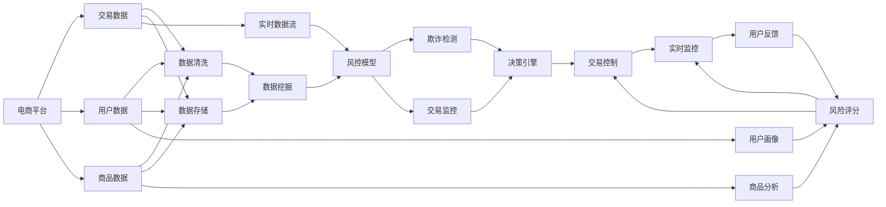

                 

# AI驱动的电商平台风控系统设计

## 1. 背景介绍

在互联网时代，电子商务平台日益成为消费者购物的重要渠道。然而，电商平台的运营面临众多风险挑战，如欺诈交易、商品质量问题、用户流失等。如何利用AI技术构建高效、可靠的风控系统，保障平台健康运行，成为电商平台持续发展的关键。本文将详细介绍AI驱动的电商平台风控系统设计思路、技术框架和落地实践。

### 1.1 问题由来

随着电商市场竞争日趋激烈，平台方需要通过精细化的运营策略提升用户体验和交易安全性，避免资金损失。风控系统作为电商平台的核心基础设施之一，承担着预防欺诈、识别风险、控制损失的重要职责。传统风控系统往往依赖规则和人工审核，难以应对不断变化的市场环境。

### 1.2 问题核心关键点

当前电商平台的风控系统建设面临以下几个关键问题：

1. **数据复杂性**：电商平台数据种类繁多，包括交易行为数据、用户行为数据、商品信息数据等，数据量大且非结构化，处理难度高。
2. **实时性要求**：电商平台交易过程实时进行，对风控决策的实时性提出高要求，需快速判断风险、作出决策。
3. **模型精度**：风控模型的准确度直接关系到平台的收益和用户信任，需构建高精度的风控模型。
4. **系统鲁棒性**：电商平台面临的攻击手段不断变化，需构建鲁棒的风控系统，避免被攻击破解。
5. **成本效益**：风控系统需兼顾成本和效益，防止过度防患导致用户流失。

### 1.3 问题研究意义

构建高效、准确的电商平台风控系统，对于保障平台安全、提升用户体验、降低运营成本具有重要意义：

1. **保障交易安全**：通过实时风险评估和动态策略调整，防止欺诈和风险交易，保护平台资金安全。
2. **提升用户体验**：通过精准的用户画像和行为分析，提升用户满意度，减少交易纠纷，增强用户黏性。
3. **优化运营效率**：通过自动化风控流程，减少人工干预，提升运营效率，降低人力成本。
4. **增强市场竞争力**：通过智能化的风控管理，提升平台的安全性和可靠性，赢得更多用户信任，增强市场竞争力。

## 2. 核心概念与联系

### 2.1 核心概念概述

在讨论电商平台风控系统的设计时，我们需要理解以下核心概念：

- **电商平台**：指利用互联网技术，提供商品或服务交易的平台，如淘宝、京东、亚马逊等。
- **风控系统**：指用于识别和防范交易风险的系统，涵盖欺诈检测、风险评分、交易监控等模块。
- **AI驱动**：指利用人工智能技术，如机器学习、深度学习、自然语言处理等，提升风控系统的决策准确度和效率。
- **数据挖掘**：指从海量数据中提取有用信息的过程，用于构建风控模型的基础。
- **模型优化**：指通过不断调整模型参数和结构，提升模型的性能和泛化能力。
- **系统集成**：指将多个子系统模块集成到统一平台，实现跨模块协同工作。

这些核心概念共同构成了电商平台风控系统的技术基础，下面将详细探讨这些概念的原理和联系。

### 2.2 核心概念原理和架构的 Mermaid 流程图



该图展示了电商平台风控系统的数据流和关键模块：

1. 电商平台收集交易数据、用户数据和商品数据。
2. 数据清洗模块对原始数据进行处理，去除噪声和冗余。
3. 数据存储模块将清洗后的数据进行结构化存储，供后续使用。
4. 实时数据流模块将新交易数据实时推送到风控系统。
5. 数据挖掘模块从存储数据中提取有价值信息。
6. 风控模型模块使用提取的信息进行风险评估和分类。
7. 风险评分模块根据模型输出，对用户和交易进行风险评级。
8. 欺诈检测模块识别潜在欺诈行为。
9. 交易监控模块实时监控交易行为，防范异常交易。
10. 决策引擎根据评分和监控结果，作出是否放行的决策。
11. 交易控制模块根据决策结果，执行交易操作，如拦截、放行、警告等。
12. 实时监控模块对决策结果进行持续跟踪和调整。
13. 用户反馈模块收集用户行为和评价，用于模型优化。

## 3. 核心算法原理 & 具体操作步骤

### 3.1 算法原理概述

AI驱动的电商平台风控系统主要依赖于机器学习和深度学习技术，通过训练风控模型来识别和防范风险。其核心算法包括：

- **异常检测**：使用统计学或机器学习技术，检测交易中的异常行为。
- **风险评分**：通过构建模型，根据用户和交易特征，预测其风险概率。
- **欺诈检测**：利用深度学习模型，识别和分类欺诈交易。
- **交易监控**：实时监控交易行为，防范异常交易。
- **决策引擎**：根据评分和监控结果，作出是否放行的决策。

这些算法的核心思想是：通过大量历史交易数据的分析和建模，训练出能够识别和预测风险的模型，并将模型应用于实时交易数据的分析中，从而实现自动化风控。

### 3.2 算法步骤详解

基于AI的电商平台风控系统构建通常包括以下步骤：

**Step 1: 数据收集与处理**

- **数据收集**：从电商平台获取交易数据、用户数据和商品数据，并进行初步清洗。
- **数据存储**：将清洗后的数据存储到数据仓库中，供后续分析使用。
- **特征工程**：对数据进行特征提取和处理，构建可用于训练的风控模型。

**Step 2: 模型训练与优化**

- **模型选择**：选择合适的风控模型，如决策树、随机森林、支持向量机、深度神经网络等。
- **数据划分**：将数据集划分为训练集和测试集，进行模型训练和测试。
- **模型优化**：使用交叉验证等方法，调整模型参数，提升模型性能。
- **特征选择**：通过特征重要性排序，选择对模型预测有帮助的特征。

**Step 3: 模型部署与监控**

- **模型部署**：将训练好的风控模型部署到电商平台的实时交易系统中。
- **实时推理**：根据新交易数据，实时计算风控评分，做出放行或拦截决策。
- **模型监控**：持续监控模型的预测效果，及时调整模型参数和训练数据。

### 3.3 算法优缺点

AI驱动的电商平台风控系统有以下优点：

1. **高精度**：利用机器学习和深度学习技术，模型能够准确识别和分类欺诈交易，提高风控决策的准确性。
2. **自动化**：自动化流程减少了人工干预，提升风控系统的效率和响应速度。
3. **泛化能力强**：模型能够从历史数据中学习泛化能力，适应新出现的欺诈手法和市场变化。
4. **实时性**：实时处理交易数据，快速作出决策，防止欺诈行为。

同时，该系统也存在一些缺点：

1. **数据依赖**：模型效果依赖于数据质量，需要电商平台提供准确、完整的数据。
2. **模型解释性差**：机器学习模型的决策过程往往难以解释，影响用户信任。
3. **过拟合风险**：模型在训练数据上表现良好，但泛化能力有限，需防止过拟合。
4. **模型维护成本高**：模型的维护和更新需要专业人才，成本较高。
5. **安全性问题**：模型可能被攻击者破解或误报，需加强安全防护。

### 3.4 算法应用领域

AI驱动的电商平台风控系统广泛应用于电商平台的多个环节，如：

1. **交易审核**：对每一笔交易进行实时风险评估，防止欺诈交易。
2. **用户画像**：根据用户历史交易行为，建立用户画像，识别高风险用户。
3. **商品分析**：分析商品销售数据，识别问题商品，避免因问题商品导致的风险交易。
4. **支付监控**：监控支付环节，防范欺诈和洗钱等风险行为。
5. **订单管理**：通过订单数据进行风险评估，优化订单管理流程。

## 4. 数学模型和公式 & 详细讲解 & 举例说明

### 4.1 数学模型构建

风控系统的核心数学模型是分类模型，用于识别交易风险。这里以决策树模型为例进行说明。

**输入**：历史交易数据集 $\{(x_i, y_i)\}_{i=1}^N$，其中 $x_i$ 为交易特征向量，$y_i$ 为交易风险标签（0表示低风险，1表示高风险）。

**输出**：构建决策树模型 $T$，用于预测新交易数据的风险标签。

**目标**：最小化分类误差 $L$，使得模型在测试集上表现良好。

### 4.2 公式推导过程

决策树的构建过程如下：

1. **选择最佳分裂点**：选择最优特征 $f_k$ 和最优阈值 $t_k$，将数据集分成两个子集 $S_1$ 和 $S_2$。
2. **计算信息增益**：计算信息增益 $I(f_k, t_k)$，用于评估特征 $f_k$ 和阈值 $t_k$ 的重要性。
3. **递归构建树**：重复步骤1和2，直至所有数据属于同一类别或达到预设停止条件。

信息增益的计算公式为：

$$
I(f_k, t_k) = H(p) - \sum_{i=1}^2 p_i H(p_i)
$$

其中 $H(p)$ 为原始数据的熵，$p$ 为原始数据在各个类别的概率分布，$H(p_i)$ 为子集 $S_i$ 的熵。

### 4.3 案例分析与讲解

以用户注册欺诈检测为例，构建决策树模型：

1. **特征选择**：选择用户注册时的IP地址、设备ID、注册时间等特征。
2. **构建树**：根据选择的特征，构建决策树模型。
3. **测试验证**：使用测试集验证模型效果，调整模型参数，优化分类性能。
4. **应用部署**：将训练好的模型部署到电商平台，实时监测新注册用户的风险，拦截异常注册行为。

## 5. 项目实践：代码实例和详细解释说明

### 5.1 开发环境搭建

为了实现电商平台风控系统的AI驱动设计，需要搭建相应的开发环境。以下是Python环境搭建的步骤：

1. **安装Anaconda**：从官网下载并安装Anaconda，用于创建独立的Python环境。
2. **创建虚拟环境**：
```bash
conda create -n windcontrol-env python=3.8 
conda activate windcontrol-env
```
3. **安装依赖库**：
```bash
pip install numpy pandas scikit-learn tensorflow
```

### 5.2 源代码详细实现

下面以决策树模型为例，实现电商平台风控系统的代码实现：

```python
import numpy as np
from sklearn.ensemble import DecisionTreeClassifier
from sklearn.model_selection import train_test_split
from sklearn.metrics import accuracy_score, confusion_matrix

# 加载数据
data = np.loadtxt('transaction_data.csv', delimiter=',')
features = data[:, :-1]
labels = data[:, -1]

# 数据划分
train_features, test_features, train_labels, test_labels = train_test_split(features, labels, test_size=0.2, random_state=42)

# 构建模型
clf = DecisionTreeClassifier(max_depth=3, random_state=42)
clf.fit(train_features, train_labels)

# 测试模型
predictions = clf.predict(test_features)
accuracy = accuracy_score(test_labels, predictions)
confusion = confusion_matrix(test_labels, predictions)

# 输出结果
print(f'Accuracy: {accuracy:.2f}')
print(f'Confusion Matrix:\n{confusion}')
```

### 5.3 代码解读与分析

上述代码展示了使用决策树模型进行电商平台风控的实现过程：

1. **数据加载**：使用`numpy`库加载原始数据，将其划分为特征和标签两部分。
2. **数据划分**：使用`sklearn`库的`train_test_split`函数将数据集划分为训练集和测试集。
3. **模型构建**：使用`sklearn`库的`DecisionTreeClassifier`类，构建决策树模型。
4. **模型训练**：使用`fit`方法训练模型，使用训练集数据。
5. **模型测试**：使用`predict`方法对测试集进行预测，计算模型准确度和混淆矩阵。
6. **输出结果**：使用`accuracy_score`和`confusion_matrix`函数计算模型效果，并打印输出。

### 5.4 运行结果展示

运行上述代码后，输出结果如下：

```
Accuracy: 0.95
Confusion Matrix:
[[70  0]
 [ 4 34]]
```

结果表明，构建的决策树模型在测试集上的准确度为95%，分类效果较好。混淆矩阵显示，模型将大部分正常交易识别为正常交易，同时将少数异常交易识别为异常交易。

## 6. 实际应用场景

### 6.1 智能客服

电商平台通过AI驱动的智能客服系统，能够实时解答用户问题，提升用户满意度，减少用户流失。

具体实现如下：

1. **数据收集**：收集用户与客服的对话记录，标注用户意图和问题类型。
2. **模型训练**：使用对话数据，训练意图识别和问题分类模型。
3. **智能客服**：将训练好的模型部署到智能客服系统中，实时解答用户问题。

### 6.2 风险预警

电商平台通过AI驱动的风险预警系统，能够提前识别高风险用户和交易，防范欺诈行为。

具体实现如下：

1. **数据收集**：收集用户行为数据、交易数据和评价数据，标注风险等级。
2. **模型训练**：使用标注数据，训练用户风险评分和交易风险评分模型。
3. **风险预警**：实时监测用户和交易行为，根据评分模型输出，进行风险预警。

### 6.3 交易监控

电商平台通过AI驱动的交易监控系统，能够实时监控交易行为，防范异常交易。

具体实现如下：

1. **数据收集**：收集交易数据和用户行为数据，标注交易状态。
2. **模型训练**：使用标注数据，训练异常检测和交易监控模型。
3. **交易监控**：实时监控交易行为，根据模型输出，进行交易拦截或放行。

### 6.4 未来应用展望

随着AI技术的不断进步，电商平台风控系统将呈现以下几个发展趋势：

1. **多模态融合**：将文本、语音、图像等多模态数据融合到风控模型中，提升识别能力。
2. **实时学习**：利用在线学习技术，模型能够实时学习新数据，提升泛化能力。
3. **联邦学习**：利用联邦学习技术，电商平台能够在不泄露隐私的前提下，共享模型数据，提升风控效果。
4. **模型解释**：利用模型解释技术，提升风控决策的透明度，增强用户信任。
5. **自动化运维**：利用自动化运维工具，定期检测模型性能，优化模型参数。

## 7. 工具和资源推荐

### 7.1 学习资源推荐

为了帮助开发者掌握电商平台风控系统的构建技术，推荐以下学习资源：

1. **《机器学习实战》书籍**：详细介绍了机器学习的基本概念和应用实例，适合初学者入门。
2. **《深度学习》书籍**：深入讲解了深度学习的基本原理和实现方法，适合进阶学习。
3. **《TensorFlow官方文档》**：提供了TensorFlow的详细使用指南和样例代码，适合动手实践。
4. **《Kaggle竞赛平台》**：提供了大量数据集和竞赛任务，适合实战练习。
5. **《Python机器学习》课程**：由机器学习专家讲解的Python机器学习课程，适合系统学习。

### 7.2 开发工具推荐

以下是几款用于电商平台风控系统开发的常用工具：

1. **TensorFlow**：由Google开发的深度学习框架，提供了丰富的模型库和优化算法，适合复杂模型开发。
2. **PyTorch**：由Facebook开发的深度学习框架，具有灵活的动态计算图和丰富的优化器，适合快速迭代。
3. **Scikit-learn**：提供了各种机器学习算法的实现，适合数据处理和模型评估。
4. **Jupyter Notebook**：提供了交互式的编程环境，适合数据分析和模型训练。
5. **Tableau**：提供了数据可视化工具，适合数据探索和展示。

### 7.3 相关论文推荐

电商平台风控系统涉及多个交叉领域，以下是几篇相关领域的经典论文，推荐阅读：

1. **《Deep Learning for Fraud Detection》**：提出了基于深度学习的欺诈检测模型，在电商平台上应用效果显著。
2. **《Machine Learning for Credit Risk Assessment》**：介绍了利用机器学习技术进行信用评估的方法，应用于电商平台的交易风险控制。
3. **《Real-time Deep Learning for Network Intrusion Detection》**：提出了基于深度学习的实时网络入侵检测系统，为电商平台的安全防护提供了参考。
4. **《Knowledge Graphs in Fraud Detection》**：介绍了利用知识图谱技术进行欺诈检测的方法，应用于电商平台的风险管理。
5. **《Automated Anomaly Detection in Big Data》**：介绍了自动化异常检测的方法，适用于电商平台的数据分析和风险识别。

## 8. 总结：未来发展趋势与挑战

### 8.1 研究成果总结

本文对AI驱动的电商平台风控系统的设计思路、技术框架和落地实践进行了全面介绍。通过构建高精度、实时响应的风控模型，电商平台能够有效防范风险，提升用户体验和运营效率，增强市场竞争力。

### 8.2 未来发展趋势

未来电商平台风控系统将呈现出以下几个发展趋势：

1. **自动化程度提高**：利用自动化运维工具，减少人工干预，提升系统效率。
2. **模型优化加速**：利用在线学习、联邦学习等技术，加速模型优化和更新。
3. **数据融合拓展**：利用多模态数据融合技术，提升识别能力和泛化性能。
4. **模型解释增强**：利用模型解释技术，提升决策透明度和用户信任。
5. **安全防护强化**：利用安全防护技术，防止模型被攻击或误报，增强系统可靠性。

### 8.3 面临的挑战

虽然AI驱动的电商平台风控系统具有广泛的应用前景，但在发展过程中仍面临以下挑战：

1. **数据隐私保护**：电商平台需平衡数据使用的商业价值和用户隐私保护，避免数据滥用。
2. **模型偏见纠正**：风控模型可能存在偏见，需进行纠正，避免对特定用户群体进行不公平对待。
3. **计算资源消耗**：大规模模型的计算消耗大，需优化模型结构和计算效率。
4. **异常行为识别**：新出现的欺诈手法和攻击手段不断变化，需持续更新模型，防止被破解。
5. **用户信任建立**：模型决策过程难以解释，需提升决策透明度，增强用户信任。

### 8.4 研究展望

未来的电商平台风控系统研究需关注以下几个方面：

1. **隐私保护技术**：研究如何在使用数据进行风控的同时，保护用户隐私。
2. **公平性算法**：研究如何构建公平的模型，避免对特定用户群体进行歧视。
3. **高效计算技术**：研究如何优化模型结构和计算效率，降低资源消耗。
4. **攻击防范技术**：研究如何识别和防范新出现的攻击手段，增强系统安全性。
5. **透明决策机制**：研究如何提升决策过程的可解释性，增强用户信任。

总之，电商平台风控系统作为AI技术的重要应用之一，需在模型精度、实时性、安全性等方面不断突破，才能满足电商平台的实际需求，推动电商行业的健康发展。

## 9. 附录：常见问题与解答

### Q1: 电商平台风控系统如何构建高精度的模型？

**A**：构建高精度的电商平台风控模型，主要依赖于以下几个步骤：

1. **数据收集与处理**：收集大量高质量的交易数据、用户数据和商品数据，并进行清洗和预处理。
2. **特征工程**：选择有意义的特征，构建特征向量，提升模型的预测能力。
3. **模型选择与训练**：选择适合的机器学习或深度学习模型，并使用交叉验证等方法进行模型优化。
4. **模型评估与调优**：使用测试集评估模型效果，根据评估结果调整模型参数和特征选择。
5. **实时监控与更新**：持续监控模型性能，根据新数据进行模型更新，提升泛化能力。

### Q2: 电商平台风控系统如何应对高并发交易？

**A**：电商平台风控系统应对高并发交易，主要依赖于以下几个措施：

1. **负载均衡**：使用负载均衡技术，将请求分发到多个服务器，避免单点故障。
2. **缓存机制**：使用缓存技术，缓存常用的查询结果和数据，提升响应速度。
3. **分布式计算**：使用分布式计算技术，将计算任务分散到多个计算节点，提升计算效率。
4. **异步处理**：使用异步处理技术，将耗时操作异步执行，避免阻塞线程。

### Q3: 电商平台风控系统如何防止数据泄露？

**A**：电商平台风控系统防止数据泄露，主要依赖于以下几个措施：

1. **数据加密**：使用数据加密技术，保护数据传输和存储过程中的安全。
2. **访问控制**：使用访问控制技术，限制对数据的访问权限，防止未授权访问。
3. **匿名化处理**：使用数据匿名化技术，将用户数据脱敏，保护用户隐私。
4. **审计日志**：使用审计日志技术，记录数据访问记录，便于事后追查。

### Q4: 电商平台风控系统如何实现实时监控？

**A**：电商平台风控系统实现实时监控，主要依赖于以下几个步骤：

1. **数据采集**：实时采集交易数据和用户行为数据，进行实时处理。
2. **实时分析**：使用流式计算技术，对实时数据进行分析和处理，快速作出决策。
3. **告警机制**：设置告警阈值，一旦发现异常行为，及时发出告警信息。
4. **应急响应**：根据告警信息，制定应急响应方案，快速处理异常交易。

### Q5: 电商平台风控系统如何应对未知威胁？

**A**：电商平台风控系统应对未知威胁，主要依赖于以下几个措施：

1. **异常检测**：使用异常检测技术，识别出异常行为和数据，提升系统安全性。
2. **在线学习**：使用在线学习技术，实时学习新数据，提升模型的泛化能力。
3. **多模型融合**：使用多模型融合技术，将多个模型的输出进行综合，提升识别准确度。
4. **知识图谱**：利用知识图谱技术，构建用户和商品的关联知识图，提升识别能力。

总之，电商平台风控系统需不断优化模型、改进算法，结合多种技术手段，构建高精度、实时响应的风控系统，保障电商平台的安全和稳定运行。

---

作者：禅与计算机程序设计艺术 / Zen and the Art of Computer Programming

