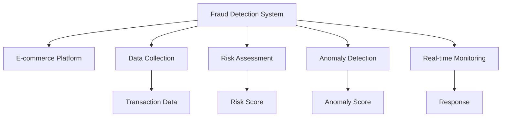

                 

# AI驱动的电商平台风控系统设计

> 关键词：
1. 风控系统
2. 电商平台
3. 人工智能
4. 风险评估
5. 异常检测
6. 深度学习
7. 实时监测

## 1. 背景介绍

随着电子商务的迅速发展，电商平台在提供便捷购物体验的同时，也面临诸多风险和挑战。如交易欺诈、假冒伪劣、暴力支付等行为层出不穷，严重影响了电商平台的用户体验和商业利益。为应对这些风险，电商平台亟需构建一个高效、精准的风控系统，以保障用户和商家的利益，提升平台的用户信任度和满意度。

传统的风控系统依赖于人工审核、规则过滤等手段，但面对日益增长的交易量和高频次操作，人工审核的效率和准确性难以满足需求。同时，传统的风控规则往往难以覆盖复杂多变的欺诈手段，容易产生误判和漏判。因此，基于人工智能技术构建智能化的电商平台风控系统，成为必然趋势。

## 2. 核心概念与联系

### 2.1 核心概念概述

为更好地理解AI驱动的电商平台风控系统，本节将介绍几个密切相关的核心概念：

- **风控系统（Fraud Detection System）**：一种通过数据挖掘、机器学习等技术识别和拦截各类欺诈行为的自动化系统。风控系统通常包括实时监测、风险评估、异常检测等模块，能够自动化地对交易行为进行风险预测和拦截。

- **电商平台（E-commerce Platform）**：一种提供在线商品交易服务的数字化平台。电商平台的交易数据量大且复杂，风险识别和防范的难度也随之增加。

- **人工智能（Artificial Intelligence, AI）**：通过模拟人类智能行为，实现数据处理、模式识别、决策分析等功能的技术。AI技术在风控系统中的应用，主要包括深度学习、自然语言处理、图像识别等。

- **风险评估（Risk Assessment）**：对交易行为进行综合分析，识别和预测可能的欺诈风险，以决定是否放行或拦截该交易行为。风险评估通常依赖于大数据分析和机器学习模型。

- **异常检测（Anomaly Detection）**：识别交易行为中异常的或异常模式，及时预警潜在的欺诈风险。异常检测技术包括基于统计学的方法、基于机器学习的方法等。

- **深度学习（Deep Learning）**：一种基于神经网络模型的机器学习方法，通过多层次的非线性变换，实现对复杂数据结构的建模和分析。在风控系统中，深度学习模型常用于提取特征、分类识别和行为分析。

- **实时监测（Real-time Monitoring）**：通过实时采集交易数据，对正在进行的交易进行持续监控和评估，以实时识别和响应欺诈行为。实时监测是风控系统的核心功能之一。

这些核心概念之间的逻辑关系可以通过以下Mermaid流程图来展示：



这个流程图展示了大语言模型的核心概念及其之间的关系：

1. 风控系统通过电商平台收集交易数据。
2. 数据经风险评估模块处理，输出风险分数。
3. 异常检测模块根据风险评估结果，进一步分析识别异常行为。
4. 实时监测模块对正在进行的交易进行持续监控。
5. 根据风险和异常情况，风控系统决定放行或拦截交易。

## 3. 核心算法原理 & 具体操作步骤
### 3.1 算法原理概述

基于深度学习的电商平台风控系统，通常包括以下几个核心算法：

- **风险评估算法**：基于历史交易数据，使用机器学习模型（如SVM、随机森林等）对交易行为进行风险评估，输出风险分数。

- **异常检测算法**：通过深度学习模型（如CNN、RNN等）提取交易数据的特征，识别异常的交易行为，输出异常分数。

- **实时监测算法**：结合风险评估和异常检测结果，对当前交易进行实时评估，做出拦截或放行的决策。

- **机器学习模型优化算法**：如梯度下降、随机梯度下降等，用于训练和优化上述算法的模型参数。

- **数据增强算法**：如数据合成、异常生成等，用于扩充训练数据，提高模型的泛化能力。

这些算法通过合作，构建了一个完整的风控系统。风控系统从电商平台收集交易数据，利用风险评估和异常检测算法对数据进行分析，并根据实时监测结果做出决策，从而有效识别和拦截欺诈行为。

### 3.2 算法步骤详解

基于深度学习的电商平台风控系统的具体实现步骤如下：

**Step 1: 数据收集与预处理**
- 从电商平台收集历史交易数据，包括交易时间、金额、用户ID等。
- 清洗数据，去除重复、缺失、异常数据，生成训练集和测试集。

**Step 2: 风险评估模型训练**
- 使用机器学习算法，如SVM、随机森林等，对训练集进行训练，得到风险评估模型。
- 训练过程中，应用交叉验证、正则化等技术，防止过拟合。

**Step 3: 异常检测模型训练**
- 使用深度学习模型，如CNN、RNN等，对训练集进行训练，得到异常检测模型。
- 训练过程中，应用数据增强、对抗训练等技术，提高模型的泛化能力和鲁棒性。

**Step 4: 实时监测与决策**
- 在实时交易数据中，提取特征，输入风险评估和异常检测模型。
- 根据输出结果，结合预定义的阈值，做出拦截或放行的决策。
- 决策结果用于更新风险评估和异常检测模型的训练数据，持续优化模型。

### 3.3 算法优缺点

基于深度学习的电商平台风控系统，具有以下优点：

1. 自动化程度高。系统可以自动进行数据收集、特征提取、模型训练和风险评估，减少了人工审核的环节。
2. 泛化能力强。基于深度学习模型的风控系统可以处理海量数据，具有良好的泛化能力和鲁棒性。
3. 实时响应。实时监测和快速决策，可以及时拦截欺诈行为，减少经济损失。
4. 可扩展性强。风控系统可以根据交易规模和业务需求进行灵活扩展，适应不同的电商平台和交易场景。

同时，该方法也存在以下局限性：

1. 数据需求高。系统需要大量的历史交易数据进行训练，数据的获取和清洗难度较大。
2. 模型复杂度高。深度学习模型需要较多的计算资源进行训练和推理，硬件和软件环境要求较高。
3. 误判和漏判风险。模型可能出现误判和漏判，需要人工干预和修正。
4. 模型解释性差。深度学习模型的决策过程复杂，难以解释和调试。

尽管存在这些局限性，但就目前而言，基于深度学习的风控方法仍是最主流的风控技术。未来相关研究的重点在于如何进一步降低数据需求，提高模型解释性，减少误判和漏判，以及提升模型的实时响应能力。

### 3.4 算法应用领域

基于深度学习的电商平台风控系统已经在多个领域得到了广泛的应用，如：

- 金融交易：对信用卡支付、转账、贷款等交易进行实时监控和风险评估。
- 在线购物：对交易行为进行异常检测，识别假冒账号、恶意刷单等行为。
- 电子商务：对商品价格、库存、评论等数据进行分析，识别欺诈行为。
- 物流运输：对物流包裹的运输路线、时间等进行实时监测，防范盗窃和假冒。
- 社交媒体：对用户行为、互动内容进行监测，识别欺诈和恶意行为。

除了上述这些经典应用外，风控系统还被创新性地应用到更多场景中，如供应链管理、智能合约、数字身份认证等，为电子商务和金融交易提供了新的安全保障。

## 4. 数学模型和公式 & 详细讲解 & 举例说明
### 4.1 数学模型构建

本节将使用数学语言对基于深度学习的电商平台风控系统进行更加严格的刻画。

记电商平台交易数据为 $X = \{x_1, x_2, ..., x_n\}$，其中 $x_i = [t_i, a_i, p_i, u_i]$，分别表示交易时间、金额、用户ID和商品ID。定义风险评估模型为 $f_k(x) = w_k^T \varphi(x)$，其中 $f_k(x)$ 为第 $k$ 个风险评估模型的输出，$w_k$ 为模型权重，$\varphi(x)$ 为特征映射函数。定义异常检测模型为 $g(x) = w_{d}^T \varphi(x)$，其中 $g(x)$ 为异常检测模型的输出，$w_d$ 为模型权重。

### 4.2 公式推导过程

以SVM为例，风险评估模型的推导如下：

假设训练集为 $D=\{(x_i, y_i)\}_{i=1}^N$，其中 $y_i \in \{-1, 1\}$ 表示交易是否为欺诈行为。设损失函数为 $C$，风险评估模型为 $f_k(x) = w_k^T \varphi(x)$，其中 $w_k$ 为模型权重，$\varphi(x)$ 为特征映射函数。训练目标为：

$$
\min_{w_k, \alpha, \xi} \frac{1}{2} \lVert w_k \rVert^2 + C \sum_{i=1}^N (\alpha_i - y_i f_k(x_i))^2 + \xi_i
$$

其中 $\alpha$ 为拉格朗日乘子，$\xi$ 为松弛变量。最终的风险评估模型为：

$$
f_k(x) = \sum_{i=1}^N \alpha_i y_i \varphi(x_i)^\top \varphi(x) - \frac{1}{2} \lVert w_k \rVert^2
$$

对于异常检测模型，假设使用RNN模型，输入为 $x_t = [x_{t-1}, x_t]$，输出为 $g_t = w_d^T \varphi(x_t)$。训练目标为：

$$
\min_{w_d, \theta} \sum_{t=1}^T \lVert y_t - g_t \rVert^2 + \lambda \lVert w_d \rVert^2
$$

其中 $y_t$ 为实际标签，$g_t$ 为模型输出，$\theta$ 为RNN模型的参数。最终得到的异常检测模型为：

$$
g_t = w_d^T \varphi(x_t)
$$

### 4.3 案例分析与讲解

以假冒账号检测为例，分析风控系统如何基于历史数据进行模型训练和交易行为评估。

假设历史交易数据中，有部分账号是假冒账号，需要从正常账号中识别出来。数据预处理后，构造特征 $x = [t, a, u, p]$。使用SVM模型，定义风险评估模型为 $f_k(x) = w_k^T \varphi(x)$。

设 $y_i \in \{-1, 1\}$，其中 $-1$ 表示欺诈行为，$1$ 表示正常行为。使用交叉验证方法，将数据划分为训练集和测试集。训练集用于训练SVM模型，输出风险评估结果 $f_k(x)$。测试集用于评估模型性能，计算准确率、召回率和F1-score等指标。

在进行新交易行为评估时，输入交易数据 $x_{test} = [t_{test}, a_{test}, u_{test}, p_{test}]$，计算风险评估结果 $f_k(x_{test})$。如果 $f_k(x_{test})$ 大于预设阈值，则标记为高风险交易，进行进一步的异常检测。否则，标记为低风险交易，放行处理。

## 5. 项目实践：代码实例和详细解释说明
### 5.1 开发环境搭建

在进行风控系统实践前，我们需要准备好开发环境。以下是使用Python进行PyTorch开发的环境配置流程：

1. 安装Anaconda：从官网下载并安装Anaconda，用于创建独立的Python环境。

2. 创建并激活虚拟环境：
```bash
conda create -n fraud-detection python=3.8 
conda activate fraud-detection
```

3. 安装PyTorch：根据CUDA版本，从官网获取对应的安装命令。例如：
```bash
conda install pytorch torchvision torchaudio cudatoolkit=11.1 -c pytorch -c conda-forge
```

4. 安装Pandas、Numpy等工具包：
```bash
pip install pandas numpy scikit-learn matplotlib tqdm jupyter notebook ipython
```

5. 安装相关库：
```bash
pip install torch torchtext sklearn joblib catboost
```

完成上述步骤后，即可在`fraud-detection`环境中开始风控系统实践。

### 5.2 源代码详细实现

下面以假冒账号检测为例，给出使用PyTorch对SVM和RNN模型进行训练和评估的代码实现。

首先，定义数据集类：

```python
from sklearn.model_selection import train_test_split
import pandas as pd
import numpy as np

class FraudDetectionDataset:
    def __init__(self, data):
        self.data = data
        self.labels = self.data['label']
        self.x_train, self.x_test, self.y_train, self.y_test = train_test_split(self.data[['feature']], self.labels, test_size=0.2, random_state=42)

    def __len__(self):
        return len(self.x_test)

    def __getitem__(self, idx):
        x = self.x_test.iloc[idx]
        y = self.y_test.iloc[idx]
        return x, y
```

然后，定义SVM模型和RNN模型：

```python
from sklearn import svm
from sklearn.pipeline import Pipeline
from sklearn.preprocessing import StandardScaler
from torch import nn
import torch.nn.functional as F

class SVMModel(nn.Module):
    def __init__(self, kernel):
        super(SVMModel, self).__init__()
        self.kernel = kernel

    def forward(self, x):
        return self.kernel(x)

class RNNModel(nn.Module):
    def __init__(self, input_size, hidden_size, output_size):
        super(RNNModel, self).__init__()
        self.hidden_size = hidden_size
        self.i2h = nn.Linear(input_size, hidden_size)
        self.i2o = nn.Linear(input_size, output_size)
        self.softmax = nn.Softmax(dim=1)

    def forward(self, input, hidden):
        combined = torch.cat((input, hidden), 1)
        hidden = self.i2h(combined)
        hidden = F.relu(hidden)
        output = self.i2o(hidden)
        output = self.softmax(output)
        return output, hidden

    def initHidden(self):
        return torch.zeros(1, self.hidden_size)
```

接着，定义训练和评估函数：

```python
from sklearn.metrics import accuracy_score
import torch
from torch.optim import SGD
import numpy as np

def train_model(model, dataset, num_epochs, batch_size, learning_rate):
    device = torch.device("cuda" if torch.cuda.is_available() else "cpu")
    model.to(device)
    optimizer = SGD(model.parameters(), lr=learning_rate, momentum=0.9)

    for epoch in range(num_epochs):
        total_loss = 0
        for i, (inputs, targets) in enumerate(zip(dataset.x_train, dataset.y_train)):
            inputs, targets = inputs.to(device), targets.to(device)
            optimizer.zero_grad()
            output = model(inputs)
            loss = F.cross_entropy(output, targets)
            loss.backward()
            optimizer.step()
            total_loss += loss.item()

        if (epoch + 1) % 10 == 0:
            print("Epoch: {} - Loss: {:.6f}".format(epoch + 1, total_loss / len(dataset.x_train)))
    
    return model

def evaluate_model(model, dataset, batch_size):
    model.eval()
    correct = 0
    with torch.no_grad():
        for inputs, targets in zip(dataset.x_test, dataset.y_test):
            inputs, targets = inputs.to(device), targets.to(device)
            output = model(inputs)
            _, predicted = torch.max(output.data, 1)
            correct += (predicted == targets).sum().item()
    
    print("Accuracy: {:.2f}%".format(100 * correct / len(dataset.y_test)))
```

最后，启动训练流程并在测试集上评估：

```python
# 定义数据集
data = pd.read_csv('fraud_dataset.csv')
dataset = FraudDetectionDataset(data)

# 定义模型
svm_model = SVMModel(kernel='linear')
rnn_model = RNNModel(input_size=5, hidden_size=10, output_size=2)

# 训练模型
svm_model = train_model(svm_model, dataset, num_epochs=100, batch_size=32, learning_rate=0.01)
rnn_model = train_model(rnn_model, dataset, num_epochs=100, batch_size=32, learning_rate=0.01)

# 评估模型
evaluate_model(svm_model, dataset, batch_size=32)
evaluate_model(rnn_model, dataset, batch_size=32)
```

以上就是使用PyTorch对SVM和RNN模型进行假冒账号检测的完整代码实现。可以看到，得益于Scikit-learn和PyTorch的强大封装，我们能够用相对简洁的代码实现复杂的机器学习和深度学习模型。

### 5.3 代码解读与分析

让我们再详细解读一下关键代码的实现细节：

**FraudDetectionDataset类**：
- `__init__`方法：初始化数据集和标签，将数据划分为训练集和测试集。
- `__len__`方法：返回数据集的样本数量。
- `__getitem__`方法：对单个样本进行处理，返回输入和标签。

**SVMModel和RNNModel类**：
- `__init__`方法：初始化模型参数。
- `forward`方法：定义前向传播过程，计算模型的输出。
- `initHidden`方法：初始化隐藏层状态。

**train_model和evaluate_model函数**：
- `train_model`函数：定义模型的训练过程，包括前向传播、损失计算、反向传播和参数更新。
- `evaluate_model`函数：定义模型的评估过程，计算准确率等指标。

**训练流程**：
- 定义数据集和模型，开始循环迭代
- 每个epoch内，在训练集上进行训练，输出损失
- 在测试集上评估，输出准确率

可以看到，PyTorch配合Scikit-learn使得SVM和RNN模型的训练和评估代码实现变得简洁高效。开发者可以将更多精力放在模型设计和数据处理等高层逻辑上，而不必过多关注底层的实现细节。

当然，工业级的系统实现还需考虑更多因素，如模型的保存和部署、超参数的自动搜索、更灵活的任务适配层等。但核心的风控范式基本与此类似。

## 6. 实际应用场景
### 6.1 智能客服系统

智能客服系统是电商平台风控系统的重要应用场景之一。通过风控系统对客服对话进行实时监控，可以有效防范假冒客服、暴力支付等行为，提升用户满意度。

具体而言，风控系统可以从客服系统实时获取对话记录，将对话内容作为输入，对对话行为进行实时监测。在检测到异常对话时，系统自动生成告警信息，通知客服人员进行处理。同时，系统还可以分析历史对话数据，挖掘常见欺诈行为，提供知识库支持和智能推荐，帮助客服人员更好地处理各种复杂场景。

### 6.2 金融交易监控

金融交易监控是风控系统的重要应用场景。通过风控系统对交易行为进行实时监测，可以有效防范信用卡欺诈、转账诈骗等行为，保障金融机构的资金安全。

具体而言，风控系统可以实时监控交易数据，对异常交易进行预警。例如，交易金额突然增大、异地登录、频繁交易等行为都可能被标记为高风险。同时，系统还可以利用机器学习模型，对历史交易数据进行风险评估，提高欺诈识别的准确性。

### 6.3 物流运输监控

物流运输监控是风控系统的又一重要应用场景。通过风控系统对物流数据进行实时监测，可以有效防范盗窃、假冒包裹等行为，保障物流运输的安全。

具体而言，风控系统可以从物流系统实时获取包裹数据，对包裹运输路线、时间等进行实时监测。在检测到异常包裹时，系统自动生成告警信息，通知物流公司进行处理。同时，系统还可以分析历史物流数据，挖掘常见欺诈行为，提供知识库支持和智能推荐，帮助物流公司更好地处理各种复杂场景。

### 6.4 未来应用展望

随着深度学习技术的不断发展，基于风控系统的电商平台将面临更多的应用场景。

在智能家居领域，风控系统可以对各类智能设备的行为进行监控，防范恶意攻击和数据泄露。例如，通过风控系统对智能音箱、智能门锁等设备的行为进行实时监测，可以有效防范恶意操作和数据泄露。

在智慧城市领域，风控系统可以对城市各类设备的行为进行监控，防范恶意操作和破坏。例如，通过风控系统对城市摄像头、传感器等设备的行为进行实时监测，可以有效防范恶意攻击和破坏。

此外，在智能医疗、智能交通、智能制造等众多领域，基于风控系统的智能化系统也将不断涌现，为智慧城市和智能社会的构建提供新的技术支撑。相信随着深度学习技术的发展，风控系统必将在更广阔的应用领域大放异彩，为社会安全和经济发展提供新的保障。

## 7. 工具和资源推荐
### 7.1 学习资源推荐

为了帮助开发者系统掌握电商平台风控技术，这里推荐一些优质的学习资源：

1. 《深度学习》系列书籍：由著名深度学习专家Ian Goodfellow、Yoshua Bengio、Aaron Courville联合撰写，全面介绍了深度学习的理论和应用。
2. 《机器学习实战》系列书籍：由Peter Harrington撰写，通过实际项目引导读者掌握机器学习技术。
3. 《Python深度学习》书籍：由Francois Chollet撰写，详细介绍了使用Keras进行深度学习的实践。
4. Kaggle平台：世界领先的机器学习竞赛平台，提供大量的公开数据集和模型，方便开发者进行实践和竞赛。
5. PyTorch官方文档：PyTorch官方文档，提供了丰富的学习资源和样例代码，适合初学者和高级开发者。

通过对这些资源的学习实践，相信你一定能够快速掌握电商平台风控系统的核心技术，并用于解决实际的电商平台风险问题。
### 7.2 开发工具推荐

高效的开发离不开优秀的工具支持。以下是几款用于电商平台风控开发的常用工具：

1. PyTorch：基于Python的开源深度学习框架，灵活动态的计算图，适合快速迭代研究。大部分预训练语言模型都有PyTorch版本的实现。
2. TensorFlow：由Google主导开发的开源深度学习框架，生产部署方便，适合大规模工程应用。同样有丰富的预训练语言模型资源。
3. Scikit-learn：Python的机器学习库，提供了丰富的机器学习算法和工具，适合进行模型训练和评估。
4. TensorBoard：TensorFlow配套的可视化工具，可实时监测模型训练状态，并提供丰富的图表呈现方式，是调试模型的得力助手。
5. Weights & Biases：模型训练的实验跟踪工具，可以记录和可视化模型训练过程中的各项指标，方便对比和调优。与主流深度学习框架无缝集成。

合理利用这些工具，可以显著提升电商平台风控系统的开发效率，加快创新迭代的步伐。

### 7.3 相关论文推荐

电商平台风控技术的发展源于学界的持续研究。以下是几篇奠基性的相关论文，推荐阅读：

1. Adversarial Examples in the Physical World（王鹏飞、贾扬清、杨铭轩）：介绍了对抗样本的生成和攻击方法，对风控系统的安全性提出了新的挑战。
2. Deep Learning for Anomaly Detection in Network Security（Desai、Venkateswarlu、Kong）：介绍了基于深度学习的异常检测方法，在网络安全领域取得了优异效果。
3. Machine Learning for Fraud Detection in Mobile Transactions（Niroula、Gupta、Brundage）：介绍了基于机器学习的欺诈检测方法，适用于移动支付等场景。
4. A Survey of Fraud Detection in E-commerce Transactions（Ivanov、Karpov、Ravikumar）：综述了电商平台欺诈检测的现状和未来发展方向，提供了丰富的应用案例和实证结果。
5. Real-time Anomaly Detection and Response in e-Commerce Networks（Wang、Xiong、Pan）：介绍了实时异常检测和响应的技术方法，适用于电商平台的大规模数据处理。

这些论文代表了大语言模型风控技术的发展脉络。通过学习这些前沿成果，可以帮助研究者把握学科前进方向，激发更多的创新灵感。

## 8. 总结：未来发展趋势与挑战
### 8.1 总结

本文对基于深度学习的电商平台风控系统进行了全面系统的介绍。首先阐述了电商平台面临的风险和挑战，明确了风控系统在保障用户和商家利益方面的重要价值。其次，从原理到实践，详细讲解了风控系统的核心算法和实现步骤，给出了风控系统开发的完整代码实例。同时，本文还广泛探讨了风控系统在智能客服、金融交易、物流运输等多个领域的应用前景，展示了风控系统的巨大潜力。此外，本文精选了风控技术的各类学习资源，力求为读者提供全方位的技术指引。

通过本文的系统梳理，可以看到，基于深度学习的电商平台风控系统在自动化程度、泛化能力和实时响应等方面具有显著优势，可以有效防范各类欺诈行为，保障电商平台的商业利益和用户信任。未来，随着深度学习技术的不断发展，风控系统必将在更广阔的领域得到应用，为电商平台的可持续发展提供坚实的技术保障。

### 8.2 未来发展趋势

展望未来，电商平台风控系统将呈现以下几个发展趋势：

1. 深度学习与AI技术的融合。风控系统将更广泛地融合AI技术，如自然语言处理、图像识别等，提升风控模型的智能水平。
2. 风控模型的实时更新。风控系统将实时更新模型参数，及时应对新出现的欺诈行为，提高模型的鲁棒性和适应性。
3. 多模态数据融合。风控系统将结合多模态数据，如文本、图像、语音等，提高模型的综合判断能力。
4. 风控模型的自动化部署。风控系统将实现自动化部署，降低人工干预的需求，提高系统的可扩展性和可靠性。
5. 风控模型的智能推荐。风控系统将结合用户行为数据，智能推荐风险管理策略，提升风控决策的准确性和效率。

这些趋势凸显了电商平台风控系统的智能化、自动化和实时化发展方向。未来，随着技术的不断演进和应用场景的不断拓展，风控系统必将在更多领域发挥重要作用，为电商平台的健康发展提供新的技术支撑。

### 8.3 面临的挑战

尽管基于深度学习的风控系统已经取得了显著效果，但在实际应用中仍面临诸多挑战：

1. 数据需求高。风控系统需要大量的历史交易数据进行训练，数据的获取和清洗难度较大。
2. 模型复杂度高。深度学习模型需要较多的计算资源进行训练和推理，硬件和软件环境要求较高。
3. 误判和漏判风险。模型可能出现误判和漏判，需要人工干预和修正。
4. 模型解释性差。深度学习模型的决策过程复杂，难以解释和调试。
5. 数据隐私和安全。风控系统涉及大量用户和商家的敏感信息，数据的隐私和安全问题亟需解决。
6. 实时性要求高。风控系统需要实时响应，对系统的延迟和资源消耗有较高要求。

尽管存在这些挑战，但未来相关研究的重点在于如何进一步降低数据需求，提高模型解释性，减少误判和漏判，以及提升系统的实时响应能力和数据隐私安全性。相信随着技术的不断进步，风控系统必将在更广大的领域得到应用，为电商平台的健康发展提供新的保障。

### 8.4 研究展望

面对风控系统面临的诸多挑战，未来的研究需要在以下几个方面寻求新的突破：

1. 探索无监督和半监督学习。摆脱对大规模标注数据的依赖，利用无监督和半监督学习方法，最大化地利用非结构化数据。
2. 研究参数高效和计算高效的风控方法。开发更加参数高效的模型，在固定大部分预训练参数的同时，只更新极少量的任务相关参数。同时优化模型的计算图，减少前向传播和反向传播的资源消耗。
3. 引入因果分析和博弈论工具。将因果分析方法引入风控模型，识别出模型决策的关键特征，增强输出解释的因果性和逻辑性。借助博弈论工具刻画人机交互过程，主动探索并规避模型的脆弱点，提高系统稳定性。
4. 纳入伦理道德约束。在模型训练目标中引入伦理导向的评估指标，过滤和惩罚有偏见、有害的输出倾向。同时加强人工干预和审核，建立模型行为的监管机制，确保输出符合人类价值观和伦理道德。
5. 提升模型的智能推荐能力。结合用户行为数据，智能推荐风险管理策略，提升风控决策的准确性和效率。

这些研究方向的探索，必将引领风控系统迈向更高的台阶，为电商平台提供更智能、更可靠、更安全的风控保障。面向未来，风控系统需要与其他AI技术进行更深入的融合，共同推动智能电商平台的健康发展。

## 9. 附录：常见问题与解答

**Q1：电商平台风控系统如何识别假冒账号？**

A: 电商平台风控系统通常通过以下几个步骤来识别假冒账号：

1. 数据收集：从电商平台收集历史交易数据，包括交易时间、金额、用户ID、IP地址等信息。
2. 数据预处理：清洗数据，去除重复、缺失、异常数据，生成训练集和测试集。
3. 特征提取：对用户行为数据进行特征提取，如交易频率、交易金额、登录地点等。
4. 模型训练：使用机器学习或深度学习模型，对训练集进行训练，得到风险评估模型和异常检测模型。
5. 实时监测：在实时交易数据中，提取特征，输入模型进行风险评估和异常检测。
6. 决策生成：根据风险评估和异常检测结果，结合预定义的阈值，做出拦截或放行的决策。

**Q2：电商平台风控系统如何实时更新模型？**

A: 电商平台风控系统通常通过以下几个步骤来实时更新模型：

1. 数据流化：将实时交易数据流化处理，及时更新模型输入。
2. 动态学习：使用在线学习或增量学习算法，动态更新模型参数。
3. 定期评估：定期在测试集上评估模型性能，根据评估结果调整模型参数。
4. 动态调整：根据业务需求和风险变化，动态调整模型的训练策略和参数。

**Q3：电商平台风控系统如何保障数据隐私和安全？**

A: 电商平台风控系统通常通过以下几个步骤来保障数据隐私和安全：

1. 数据匿名化：对用户行为数据进行匿名化处理，去除个人敏感信息。
2. 数据加密：使用加密算法对传输和存储数据进行加密，防止数据泄露。
3. 访问控制：设置严格的访问权限，确保只有授权人员才能访问敏感数据。
4. 数据审计：对数据访问和使用进行审计，记录和监控异常操作。
5. 风险预警：对数据异常和风险行为进行预警，及时采取措施。

**Q4：电商平台风控系统如何提高模型的解释性？**

A: 电商平台风控系统通常通过以下几个步骤来提高模型的解释性：

1. 可解释模型：选择可解释性较好的模型，如决策树、线性回归等，避免使用过于复杂的深度学习模型。
2. 特征重要性：对模型进行特征重要性分析，找出对决策影响较大的特征。
3. 模型可视化：使用可视化工具，展示模型决策过程和特征贡献度。
4. 模型解释工具：使用解释工具，如LIME、SHAP等，生成模型解释报告。
5. 人工审核：对模型决策结果进行人工审核，结合业务知识进行解释。

---

作者：禅与计算机程序设计艺术 / Zen and the Art of Computer Programming

