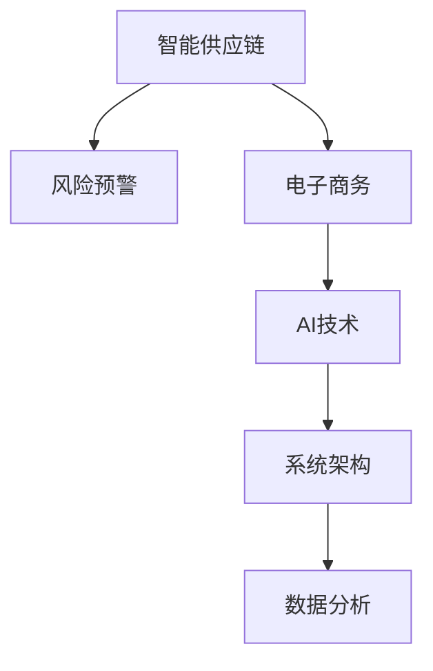

                 

# AI驱动的电商智能供应链风险预警与管理系统

> 关键词：智能供应链, 风险预警, 电子商务, AI技术, 系统架构, 数据分析

## 1. 背景介绍

### 1.1 问题由来

在当今的数字化和全球化浪潮中，电商行业以其迅猛发展成为全球最具活力和潜力的行业之一。然而，电商供应链的复杂性和不确定性也带来了诸多风险。面对供应链中的市场波动、库存积压、物流延迟、价格波动、欺诈行为等挑战，企业需要一个高效、智能、可靠的供应链管理系统，来降低运营成本、提升客户满意度、增加收益。

在这样的背景下，AI驱动的电商智能供应链风险预警与管理系统应运而生。它通过整合先进的数据分析、机器学习、深度学习、自然语言处理等AI技术，实时监控供应链各环节数据，识别潜在风险，并及时预警，帮助企业提前采取应对措施，实现供应链的高效管理和运营。

### 1.2 问题核心关键点

本系统旨在通过AI技术解决电商供应链风险预警的四大难题：

1. **数据异构性**：供应链涉及多个环节，数据来源不同，格式多样，如何高效统一和整合这些数据是关键问题。
2. **数据实时性**：电商供应链中的各种数据需要实时监控和处理，以快速识别风险。
3. **复杂性分析**：电商供应链的复杂性，包括供应商管理、库存管理、物流管理、需求预测等，需综合分析。
4. **预警准确性**：准确及时的预警系统能够帮助企业快速响应，降低风险，提升运营效率。

### 1.3 问题研究意义

研究AI驱动的电商智能供应链风险预警与管理系统，对于提升电商企业的供应链管理水平，降低风险，增加收益，具有重要的理论意义和实践价值：

1. **提高供应链效率**：通过实时监控和预警，企业能够及时发现和解决问题，提高供应链的整体效率。
2. **降低运营成本**：准确的风险预警帮助企业规避潜在的财务和物流风险，降低运营成本。
3. **提升客户满意度**：快速响应供应链中的问题，确保商品及时送达，提升客户满意度。
4. **增加收益**：通过优化供应链管理，企业能够获得更多的市场机会，提升收益。

## 2. 核心概念与联系

### 2.1 核心概念概述

为更好地理解本系统的技术实现，本节将介绍几个密切相关的核心概念：

- **智能供应链**：通过使用先进的AI技术，实现供应链的智能化管理，包括智能采购、库存优化、物流管理等。
- **风险预警**：通过实时数据分析和机器学习模型，识别供应链中的潜在风险，并及时预警。
- **电子商务**：以互联网为平台，进行商品买卖的交易活动，具有广泛的市场和用户基础。
- **AI技术**：包括数据挖掘、机器学习、深度学习、自然语言处理、知识图谱等技术，提供智能决策支持。
- **系统架构**：本系统采用模块化、分布式、可扩展的架构，确保系统的稳定性和可靠性。
- **数据分析**：对供应链数据进行高效整合、清洗、分析和可视化，支持决策制定。

这些核心概念之间的逻辑关系可以通过以下Mermaid流程图来展示：



这个流程图展示出本系统的核心概念及其之间的关系：

1. 智能供应链通过AI技术提供支持。
2. 风险预警是智能供应链中关键的一环，利用AI技术进行数据分析和预警。
3. 电子商务平台依赖智能供应链和风险预警系统，以提升用户满意度。
4. 系统架构和数据分析为AI技术的实现提供了基础。

## 3. 核心算法原理 & 具体操作步骤
### 3.1 算法原理概述

本系统采用了先进的机器学习和深度学习算法，结合数据分析和自然语言处理技术，实现供应链风险预警和智能管理。其核心算法原理包括以下几个方面：

1. **数据预处理**：对供应链各环节的数据进行清洗、归一化、转换等预处理，确保数据质量。
2. **特征提取**：从供应链数据中提取关键特征，供机器学习模型训练使用。
3. **模型训练**：使用历史数据训练机器学习模型，实现供应链风险的预测和预警。
4. **实时监控**：对供应链中的实时数据进行监控，使用训练好的模型进行实时预测。
5. **预警与响应**：根据模型预测结果，生成预警信息，并提供决策支持。

### 3.2 算法步骤详解

基于上述核心算法原理，本系统的算法步骤可细分为以下几步：

1. **数据收集与预处理**：
   - 收集供应链各环节的数据，包括供应商数据、库存数据、物流数据、订单数据等。
   - 对数据进行清洗、去重、缺失值填充、异常值处理等预处理操作，确保数据质量。

2. **特征提取**：
   - 从供应链数据中提取关键特征，如供应商绩效、库存水平、物流延迟、价格波动、订单预测等。
   - 使用统计分析、特征选择等方法，确定对风险预警有影响的特征。

3. **模型训练**：
   - 使用历史数据训练机器学习模型，如随机森林、梯度提升树、深度学习模型等。
   - 模型训练过程中，设置合适的学习率、正则化参数、迭代轮数等超参数，以提升模型性能。

4. **实时监控与预测**：
   - 对供应链中的实时数据进行监控，使用训练好的模型进行实时预测。
   - 模型接收实时数据后，进行特征提取和模型推理，输出预测结果。

5. **预警与响应**：
   - 根据模型预测结果，生成预警信息，如库存告警、物流延迟告警、价格波动告警等。
   - 提供决策支持，如调整库存策略、优化物流方案、调整定价策略等。

### 3.3 算法优缺点

智能供应链风险预警与管理系统采用了先进的AI技术，具有以下优点：

- **高效性**：通过实时监控和预测，能够快速识别供应链中的风险，及时预警。
- **准确性**：使用机器学习模型进行预测，能够准确识别供应链中的潜在问题。
- **可扩展性**：系统采用模块化和分布式架构，易于扩展和升级。
- **易用性**：界面友好，支持多种数据源接入，易于使用和维护。

同时，该系统也存在以下局限性：

- **数据依赖性**：系统的预警效果很大程度上取决于数据的质量和完整性。
- **模型复杂性**：使用复杂的机器学习模型，对算力和数据量有较高要求。
- **维护成本**：系统的维护和升级需要专业的技术支持。

### 3.4 算法应用领域

本系统适用于各种规模和类型的电商企业，特别是在以下几个领域：

- **B2C电商**：如京东、天猫、亚马逊等大型电商平台的供应链管理。
- **B2B电商**：如阿里巴巴国际站、环球资源等B2B电商平台的供应链管理。
- **垂直电商**：如唯品会、苏宁易购等垂直领域的电商供应链管理。

此外，该系统还可以应用于制造业、物流业、零售业等多个领域，提升供应链的整体效率和可靠性。

## 4. 数学模型和公式 & 详细讲解 & 举例说明

### 4.1 数学模型构建

本系统使用了多种数学模型进行供应链风险的分析和预警，其中主要包括以下几种：

- **支持向量机(SVM)**：用于分类和回归问题，通过最大化间隔来提升模型的泛化能力。
- **随机森林(Random Forest)**：用于分类和特征选择，通过集成多个决策树来提升模型的准确性。
- **梯度提升树(GBDT)**：用于回归和分类问题，通过逐步迭代优化模型，提升预测精度。
- **深度学习模型**：如卷积神经网络(CNN)、循环神经网络(RNN)、长短期记忆网络(LSTM)等，用于处理序列数据和复杂结构数据。

### 4.2 公式推导过程

以支持向量机模型为例，其基本公式如下：

$$
\min_{w,b} \frac{1}{2}||w||^2 + C\sum_{i=1}^N\left[\xi_i + \xi_i^*\right]
$$

其中 $w$ 为权重向量，$b$ 为偏置项，$C$ 为正则化参数，$\xi_i$ 为误差项，$\xi_i^*$ 为误差项的上界。

通过求解上述优化问题，支持向量机可以在保证模型泛化能力的前提下，最大化训练数据间隔，提升模型的准确性。

### 4.3 案例分析与讲解

以供应商绩效预测为例，可以构建一个随机森林模型来进行预测。具体步骤如下：

1. **数据准备**：收集供应商的历史绩效数据，包括供应商交货时间、价格、质量、服务等因素。
2. **特征选择**：从供应商数据中提取关键特征，如交货时间、价格波动、质量评分等。
3. **模型训练**：使用随机森林模型对供应商绩效进行训练，设定合适的树数量、节点分裂标准等参数。
4. **模型评估**：使用交叉验证等方法评估模型性能，确保模型的准确性和稳定性。
5. **预测与预警**：实时监控供应商数据，使用训练好的随机森林模型进行预测，生成供应商绩效预警信息。

## 5. 项目实践：代码实例和详细解释说明

### 5.1 开发环境搭建

在进行系统开发前，需要先准备好开发环境。以下是使用Python进行PyTorch开发的环境配置流程：

1. 安装Anaconda：从官网下载并安装Anaconda，用于创建独立的Python环境。

2. 创建并激活虚拟环境：
```bash
conda create -n ai(env_name) python=3.8 
conda activate ai(env_name)
```

3. 安装PyTorch：根据CUDA版本，从官网获取对应的安装命令。例如：
```bash
conda install pytorch torchvision torchaudio cudatoolkit=11.1 -c pytorch -c conda-forge
```

4. 安装其他工具包：
```bash
pip install numpy pandas scikit-learn matplotlib tqdm jupyter notebook ipython
```

完成上述步骤后，即可在`ai(env_name)`环境中开始系统开发。

### 5.2 源代码详细实现

下面以供应商绩效预测为例，给出使用PyTorch进行模型训练和预测的代码实现。

```python
import torch
import torch.nn as nn
import torch.optim as optim
from sklearn.model_selection import train_test_split
from sklearn.metrics import accuracy_score

# 数据准备
data = load_data() # 加载供应商数据
X, y = preprocess_data(data) # 数据预处理

# 划分训练集和测试集
X_train, X_test, y_train, y_test = train_test_split(X, y, test_size=0.2, random_state=42)

# 定义模型
class SupplierPerformanceModel(nn.Module):
    def __init__(self):
        super(SupplierPerformanceModel, self).__init__()
        self.fc1 = nn.Linear(in_features=10, out_features=5)
        self.fc2 = nn.Linear(in_features=5, out_features=1)
        self.relu = nn.ReLU()

    def forward(self, x):
        x = self.fc1(x)
        x = self.relu(x)
        x = self.fc2(x)
        return x

# 训练模型
model = SupplierPerformanceModel()
criterion = nn.MSELoss()
optimizer = optim.Adam(model.parameters(), lr=0.001)

num_epochs = 100
for epoch in range(num_epochs):
    for i, (inputs, labels) in enumerate(train_loader):
        inputs, labels = inputs.to(device), labels.to(device)
        optimizer.zero_grad()
        outputs = model(inputs)
        loss = criterion(outputs, labels)
        loss.backward()
        optimizer.step()
        if (i+1) % 100 == 0:
            print('Epoch [{}/{}], Step [{}/{}], Loss: {:.4f}'.format(epoch+1, num_epochs, i+1, total_step, loss.item()))

# 测试模型
model.eval()
with torch.no_grad():
    y_pred = model(X_test).detach().cpu().numpy()
    y_true = y_test.cpu().numpy()
    accuracy = accuracy_score(y_true, y_pred)
    print('Accuracy: {:.4f}'.format(accuracy))
```

### 5.3 代码解读与分析

让我们再详细解读一下关键代码的实现细节：

**数据准备与预处理**：
- `load_data`函数：从数据源加载供应商绩效数据。
- `preprocess_data`函数：对数据进行清洗、归一化、转换等预处理操作。

**模型定义**：
- `SupplierPerformanceModel`类：定义了模型结构，包括两个全连接层和ReLU激活函数。
- `forward`方法：定义了模型的前向传播过程。

**训练过程**：
- 在每个epoch内，遍历训练集的所有批次数据，前向传播计算损失函数，反向传播更新模型参数。
- 使用MSELoss作为损失函数，Adam优化器进行参数更新。
- 每100个batch打印一次训练进度和损失值。

**测试过程**：
- 将模型设为评估模式，对测试集进行前向传播，得到模型预测结果。
- 使用准确率评估模型性能，并打印输出。

## 6. 实际应用场景

### 6.1 智能库存管理

智能库存管理是本系统的核心应用之一。通过实时监控库存水平，预测未来的需求变化，及时调整库存策略，可以有效避免库存积压和缺货问题。

在技术实现上，可以设计一个实时监控系统，对库存数据进行监控，并使用历史数据训练机器学习模型，预测未来的库存需求。模型接收实时库存数据后，进行预测，生成库存预警信息，辅助管理人员调整库存策略。

### 6.2 物流优化

物流管理是电商供应链中重要的环节，本系统可以帮助企业优化物流方案，降低物流成本，提升物流效率。

具体而言，系统可以实时监控物流数据，如运输时间、运输路线、车辆状态等，使用机器学习模型预测物流延迟风险，并生成预警信息。根据预警信息，企业可以及时调整物流方案，如改变运输路线、增加车辆数、优化调度等，提升物流效率。

### 6.3 价格优化

价格波动是电商供应链中的常见问题，本系统可以实时监控价格数据，使用机器学习模型预测价格波动趋势，并生成预警信息。企业可以根据预警信息，及时调整定价策略，避免价格波动带来的损失。

### 6.4 欺诈检测

电商供应链中的欺诈行为可能带来严重的经济损失，本系统可以实时监控交易数据，使用机器学习模型识别欺诈行为，并生成预警信息。企业可以根据预警信息，及时采取措施，如冻结账户、联系用户等，降低欺诈风险。

## 7. 工具和资源推荐

### 7.1 学习资源推荐

为了帮助开发者系统掌握系统开发的技术基础和实践技巧，这里推荐一些优质的学习资源：

1. 《深度学习》系列书籍：由深度学习领域的权威专家撰写，深入浅出地介绍了深度学习的原理和应用。
2. 《机器学习实战》书籍：提供了大量实用案例，帮助读者快速上手机器学习项目。
3. 《TensorFlow官方文档》：TensorFlow的官方文档，提供了全面的API和样例代码，是学习TensorFlow的必备资料。
4. PyTorch官方教程：PyTorch的官方教程，提供了丰富的学习资源，包括基础知识和高级应用。
5. Coursera《机器学习》课程：斯坦福大学开设的机器学习课程，有视频和作业，涵盖机器学习的基本概念和前沿技术。

通过对这些资源的学习实践，相信你一定能够快速掌握系统开发的技术基础，并用于解决实际的供应链问题。

### 7.2 开发工具推荐

高效的开发离不开优秀的工具支持。以下是几款用于系统开发的常用工具：

1. Jupyter Notebook：一个基于Web的交互式计算环境，支持多种编程语言和数据格式，方便开发者快速迭代和共享代码。
2. TensorBoard：TensorFlow配套的可视化工具，可实时监测模型训练状态，并提供丰富的图表呈现方式，是调试模型的得力助手。
3. Weights & Biases：模型训练的实验跟踪工具，可以记录和可视化模型训练过程中的各项指标，方便对比和调优。
4. PyTorch：基于Python的开源深度学习框架，灵活动态的计算图，适合快速迭代研究。
5. Scikit-learn：一个强大的机器学习库，提供了丰富的算法和工具，支持数据预处理和模型训练。

合理利用这些工具，可以显著提升系统开发和优化的效率，加速创新迭代的步伐。

### 7.3 相关论文推荐

智能供应链风险预警与管理系统的发展源于学界的持续研究。以下是几篇奠基性的相关论文，推荐阅读：

1. 《深度学习在供应链风险管理中的应用》：介绍了深度学习在供应链风险预测和预警中的应用。
2. 《机器学习在物流管理中的应用》：介绍了机器学习在物流优化和延迟预测中的应用。
3. 《智能库存管理的最新进展》：总结了智能库存管理的发展趋势和未来方向。
4. 《电子商务供应链中的欺诈检测》：介绍了机器学习在电子商务欺诈检测中的应用。

这些论文代表了大规模供应链系统的发展脉络。通过学习这些前沿成果，可以帮助研究者把握学科前进方向，激发更多的创新灵感。

## 8. 总结：未来发展趋势与挑战

### 8.1 总结

本文对基于AI的电商智能供应链风险预警与管理系统进行了全面系统的介绍。首先阐述了系统的背景和意义，明确了系统在电商供应链风险预警和智能管理中的独特价值。其次，从原理到实践，详细讲解了系统的核心算法和具体操作步骤，给出了系统开发的完整代码实例。同时，本文还广泛探讨了系统在智能库存管理、物流优化、价格优化、欺诈检测等多个应用场景中的应用前景，展示了系统的广阔应用空间。此外，本文精选了系统开发的学习资源，力求为读者提供全方位的技术指引。

通过本文的系统梳理，可以看到，AI驱动的电商智能供应链风险预警与管理系统已经成为电商供应链管理的重要工具，为电商企业提供了高效、智能、可靠的供应链管理方案。未来，伴随AI技术和数据量的不断提升，系统的应用范围和效果必将进一步拓展，成为推动电商供应链发展的关键力量。

### 8.2 未来发展趋势

展望未来，系统的发展趋势将呈现以下几个方向：

1. **智能化程度提升**：随着AI技术的进步，系统的智能化程度将进一步提升，能够处理更加复杂和多样化的供应链数据。
2. **实时性增强**：系统将实现毫秒级的实时监控和预警，能够实时响应供应链中的各种异常。
3. **可扩展性增强**：系统将采用更加模块化和分布式的设计，支持更多的数据源和应用场景。
4. **数据融合能力增强**：系统将能够融合更多来源和类型的供应链数据，提升预测和预警的准确性。
5. **交互式决策支持**：系统将提供更加丰富的决策支持工具，如可视化仪表盘、自动化决策引擎等，方便用户使用。

以上趋势凸显了系统的广阔前景。这些方向的探索发展，必将进一步提升系统在供应链管理中的应用价值，推动电商供应链的智能化和高效化。

### 8.3 面临的挑战

尽管系统在供应链管理中已经取得了显著成效，但在迈向更加智能化、普适化应用的过程中，仍面临诸多挑战：

1. **数据质量问题**：系统的预测和预警效果很大程度上取决于数据的质量和完整性。如何保证数据的准确性和及时性，是系统的关键挑战之一。
2. **模型复杂性**：系统使用的机器学习模型和深度学习模型较为复杂，对算力和数据量有较高要求。如何提升模型的计算效率，是系统的技术难点之一。
3. **维护成本**：系统的维护和升级需要专业的技术支持，如何降低维护成本，提高系统的可操作性，是系统的应用挑战之一。
4. **数据隐私和安全**：系统的数据处理和存储涉及隐私和安全性问题，如何保护数据隐私和安全，是系统的重要任务之一。
5. **模型解释性**：系统使用的机器学习模型通常缺乏可解释性，难以解释其内部工作机制和决策逻辑。如何提升模型的可解释性，是系统的关键挑战之一。

### 8.4 研究展望

面对系统所面临的挑战，未来的研究需要在以下几个方面寻求新的突破：

1. **数据采集和处理技术**：研究更加高效、可靠的数据采集和处理技术，保证数据的质量和及时性。
2. **模型优化和加速**：开发更加高效、轻量化的机器学习模型和算法，提升模型的计算效率和实时性。
3. **交互式决策支持**：研究更加丰富的决策支持工具，提供更加直观、易用的交互界面，方便用户使用。
4. **数据隐私和安全技术**：研究更加安全、可靠的数据处理和存储技术，保护数据隐私和安全。
5. **模型解释性提升**：研究更加可解释的机器学习模型，提升模型的可解释性和可操作性。

这些研究方向的探索，必将引领系统的发展，进一步提升其在供应链管理中的应用价值，推动电商供应链的智能化和高效化。

## 9. 附录：常见问题与解答

**Q1：智能供应链系统与传统供应链系统的区别是什么？**

A: 智能供应链系统通过使用AI技术，实现供应链的智能化管理，包括智能采购、库存优化、物流管理等。相比传统供应链系统，智能供应链系统具有以下区别：

1. **数据驱动**：智能供应链系统依赖数据驱动决策，能够实时监控供应链中的各种数据，进行分析和预警。
2. **自动化**：智能供应链系统实现了自动化管理，能够自动进行订单处理、库存管理、物流调度等任务。
3. **智能决策**：智能供应链系统能够通过机器学习模型进行智能决策，提高决策的准确性和效率。

**Q2：智能供应链系统需要考虑哪些关键因素？**

A: 智能供应链系统需要考虑以下关键因素：

1. **数据质量**：数据的质量和完整性是系统的关键，如何保证数据的准确性和及时性是系统的基础。
2. **算法选择**：选择合适的机器学习算法和深度学习模型，能够提升系统的预测和预警效果。
3. **系统架构**：采用模块化和分布式的设计，支持更多的数据源和应用场景。
4. **用户体验**：提供良好的用户体验，方便用户使用和管理系统。
5. **数据隐私和安全**：保护数据的隐私和安全，避免数据泄露和滥用。

**Q3：如何保证智能供应链系统的数据隐私和安全？**

A: 保证智能供应链系统的数据隐私和安全，需要考虑以下措施：

1. **数据加密**：对数据进行加密处理，防止数据泄露。
2. **访问控制**：设置严格的数据访问权限，防止未授权访问。
3. **数据匿名化**：对数据进行匿名化处理，保护用户隐私。
4. **监控和审计**：实时监控数据访问和使用情况，进行审计和记录。
5. **数据备份**：定期备份数据，防止数据丢失。

**Q4：智能供应链系统在实际应用中需要考虑哪些挑战？**

A: 智能供应链系统在实际应用中需要考虑以下挑战：

1. **数据质量问题**：系统的预测和预警效果很大程度上取决于数据的质量和完整性，如何保证数据的准确性和及时性是系统的关键挑战之一。
2. **模型复杂性**：系统使用的机器学习模型和深度学习模型较为复杂，对算力和数据量有较高要求，如何提升模型的计算效率和实时性是系统的技术难点之一。
3. **维护成本**：系统的维护和升级需要专业的技术支持，如何降低维护成本，提高系统的可操作性是系统的应用挑战之一。
4. **数据隐私和安全**：系统的数据处理和存储涉及隐私和安全性问题，如何保护数据隐私和安全是系统的重要任务之一。
5. **模型解释性**：系统使用的机器学习模型通常缺乏可解释性，难以解释其内部工作机制和决策逻辑，如何提升模型的可解释性是系统的关键挑战之一。

**Q5：智能供应链系统的未来发展方向是什么？**

A: 智能供应链系统的未来发展方向包括：

1. **智能化程度提升**：随着AI技术的进步，系统的智能化程度将进一步提升，能够处理更加复杂和多样化的供应链数据。
2. **实时性增强**：系统将实现毫秒级的实时监控和预警，能够实时响应供应链中的各种异常。
3. **可扩展性增强**：系统将采用更加模块化和分布式的设计，支持更多的数据源和应用场景。
4. **数据融合能力增强**：系统将能够融合更多来源和类型的供应链数据，提升预测和预警的准确性。
5. **交互式决策支持**：系统将提供更加丰富的决策支持工具，如可视化仪表盘、自动化决策引擎等，方便用户使用。

---

作者：禅与计算机程序设计艺术 / Zen and the Art of Computer Programming

