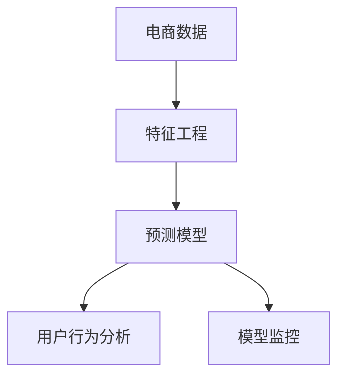

                 

# AI驱动的电商用户生命周期价值预测

> 关键词：电商，用户生命周期价值预测，人工智能，机器学习，用户行为分析，预测模型

## 1. 背景介绍

### 1.1 问题由来
在电商行业，用户生命周期价值（Customer Lifetime Value, CLV）是衡量客户贡献的重要指标，反映了用户长期以来为公司带来的收益总和。电商公司通过提升用户留存和转化率，来增加CLV。然而，随着市场竞争加剧，用户获取成本不断上升，精准预测用户生命周期价值，进行针对性营销，已成为电商企业的核心需求。

传统的用户生命周期价值预测方法依赖于手工特征工程，如点击率、浏览时长、购买次数等。这些特征的提取和构建往往需要依赖领域知识，且难以捕捉用户隐含的复杂行为模式。此外，随着数据规模的增加，手工特征工程的工作量和计算成本也相应增加，无法满足大规模电商数据处理的需求。

为此，AI驱动的预测方法应运而生，通过自动化学习特征和建模，有效提升用户生命周期价值预测的精度和效率。本文将系统介绍AI驱动的电商用户生命周期价值预测的方法和实践，包括算法原理、具体操作步骤、实际应用等。

### 1.2 问题核心关键点
AI驱动的电商用户生命周期价值预测涉及的关键点包括：

- **电商数据特征提取**：电商用户行为数据庞大且复杂，需要从中提取有意义的特征。
- **预测模型选择**：根据电商场景需求，选择合适的预测模型。
- **模型训练与调优**：使用大规模电商数据，进行模型训练与参数调优。
- **模型部署与应用**：将训练好的模型部署到实际电商系统中，进行预测和用户行为分析。
- **模型监控与迭代**：持续监控模型性能，进行迭代优化。

以下将围绕这些关键点，详细介绍AI驱动的电商用户生命周期价值预测技术。

## 2. 核心概念与联系

### 2.1 核心概念概述

为更好地理解AI驱动的电商用户生命周期价值预测方法，本节将介绍几个密切相关的核心概念：

- **电商数据**：指用户在电商平台上进行的各种操作记录，包括浏览、点击、购买、评价等行为数据。
- **特征工程**：通过数据清洗、特征提取、特征组合等技术手段，将原始数据转化为模型可以理解的特征。
- **预测模型**：用于预测目标变量的模型，如回归模型、分类模型等。
- **用户行为分析**：通过数据分析和挖掘，理解用户行为特征，提升用户生命周期价值。
- **模型监控**：通过监控模型性能指标，及时发现和解决模型问题。

这些核心概念之间的逻辑关系可以通过以下Mermaid流程图来展示：



这个流程图展示了这个预测范式的核心概念及其之间的关系：

1. 电商数据是预测的基础。
2. 特征工程用于将原始数据转换为模型可以理解的特征。
3. 预测模型用于基于这些特征进行用户生命周期价值预测。
4. 用户行为分析进一步挖掘用户隐含的行为模式。
5. 模型监控确保预测模型的长期稳定性和准确性。

## 3. 核心算法原理 & 具体操作步骤
### 3.1 算法原理概述

AI驱动的电商用户生命周期价值预测，本质上是一个有监督学习的问题，即通过训练模型，利用电商用户的历史行为数据预测其未来的生命周期价值。其核心思想是：从电商平台收集用户行为数据，构建相应的特征集，使用机器学习模型进行预测，得到用户生命周期价值的估算值。

形式化地，假设电商用户的历史行为数据为 $\mathcal{D}=\{(x_i, y_i)\}_{i=1}^N$，其中 $x_i$ 为历史行为特征，$y_i$ 为对应的用户生命周期价值标签。

定义预测模型为 $M_{\theta}$，其中 $\theta$ 为模型参数。则预测目标是最小化损失函数 $\mathcal{L}$：

$$
\theta^* = \mathop{\arg\min}_{\theta} \mathcal{L}(M_{\theta},\mathcal{D})
$$

其中 $\mathcal{L}$ 为损失函数，常见包括均方误差损失、交叉熵损失等。模型的训练过程是通过梯度下降等优化算法，不断更新参数 $\theta$，使得模型预测值 $M_{\theta}(x)$ 与真实标签 $y$ 的差异最小化。

### 3.2 算法步骤详解

AI驱动的电商用户生命周期价值预测一般包括以下几个关键步骤：

**Step 1: 电商数据收集与预处理**
- 从电商平台收集用户行为数据，包括点击、浏览、购买、评价等行为记录。
- 对数据进行清洗、去重、缺失值处理等预处理操作。

**Step 2: 特征工程**
- 根据电商场景，选择有意义的特征，如用户访问时长、浏览商品数量、购买频率、评价情感等。
- 对特征进行归一化、编码、组合等操作，以提高模型预测效果。
- 构建交叉特征、时间特征、行为序列等高级特征，捕捉用户隐含行为模式。

**Step 3: 预测模型选择与训练**
- 根据电商场景需求，选择适当的预测模型，如线性回归、随机森林、梯度提升树、深度神经网络等。
- 使用电商数据集，进行模型训练，设置合适的超参数和迭代次数。

**Step 4: 模型评估与调优**
- 在验证集上评估模型预测性能，如平均绝对误差（MAE）、均方误差（MSE）、R²等。
- 根据评估结果，调整模型参数和超参数，提高模型预测精度。

**Step 5: 模型部署与应用**
- 将训练好的模型部署到电商系统中，进行用户生命周期价值预测。
- 持续收集新数据，进行模型迭代和更新，保持预测模型性能。

### 3.3 算法优缺点

AI驱动的电商用户生命周期价值预测具有以下优点：

1. 自动化特征提取：自动化的特征工程，减少了手工特征工程的复杂性和工作量。
2. 高效处理大规模数据：利用机器学习算法，快速处理海量电商数据。
3. 提升预测精度：通过学习用户隐含行为模式，提升预测精度和效果。
4. 实时应用：将预测模型部署到电商系统中，实时计算用户生命周期价值，提供数据支持。

同时，该方法也存在一定的局限性：

1. 数据质量依赖度高：模型性能高度依赖于电商数据的完整性和质量。
2. 模型复杂度高：复杂的预测模型需要大量的训练时间和计算资源。
3. 特征选择困难：电商数据特征维度高，需要精心选择特征。
4. 模型解释性不足：复杂的机器学习模型往往难以解释其决策过程。

尽管存在这些局限性，但就目前而言，AI驱动的预测方法仍是大规模电商数据处理的重要手段。未来相关研究的重点在于如何进一步降低数据依赖，提高模型效率和可解释性，同时兼顾预测精度和实时性。

### 3.4 算法应用领域

AI驱动的电商用户生命周期价值预测在电商行业具有广泛的应用场景，例如：

- **精准营销**：根据用户生命周期价值预测结果，进行针对性营销活动，提升客户转化率。
- **用户细分**：将用户按照生命周期价值高低进行分类，制定差异化的用户策略。
- **库存优化**：预测商品的生命周期价值，进行库存管理和补货决策。
- **个性化推荐**：根据用户生命周期价值，进行个性化商品推荐，提升用户满意度。
- **风险管理**：预测高风险用户，采取措施降低流失率，提升客户忠诚度。

除了上述这些常见应用外，AI驱动的电商用户生命周期价值预测还广泛应用于客户流失预测、客户生命周期分析等场景，为电商企业提供了数据驱动的用户洞察和决策支持。

## 4. 数学模型和公式 & 详细讲解  
### 4.1 数学模型构建

本节将使用数学语言对AI驱动的电商用户生命周期价值预测过程进行更加严格的刻画。

假设预测模型为 $M_{\theta}:\mathcal{X} \rightarrow \mathbb{R}$，其中 $\mathcal{X}$ 为特征空间，$\mathbb{R}$ 为预测目标值。电商用户的历史行为数据 $\mathcal{D}=\{(x_i, y_i)\}_{i=1}^N$，其中 $x_i$ 为电商用户的行为特征，$y_i$ 为用户生命周期价值的真实值。

定义模型 $M_{\theta}$ 在特征 $x_i$ 上的预测结果为 $M_{\theta}(x_i)$。则用户生命周期价值预测的目标是最小化损失函数 $\mathcal{L}$：

$$
\mathcal{L}(\theta) = \frac{1}{N} \sum_{i=1}^N \ell(M_{\theta}(x_i), y_i)
$$

其中 $\ell$ 为损失函数，常见包括均方误差损失、交叉熵损失等。

### 4.2 公式推导过程

以下我们以均方误差损失为例，推导电商用户生命周期价值预测的公式。

假设预测模型 $M_{\theta}$ 在特征 $x_i$ 上的预测结果为 $M_{\theta}(x_i)$，真实标签为 $y_i$，则均方误差损失为：

$$
\ell(M_{\theta}(x_i), y_i) = (M_{\theta}(x_i) - y_i)^2
$$

将其代入损失函数公式，得：

$$
\mathcal{L}(\theta) = \frac{1}{N} \sum_{i=1}^N (M_{\theta}(x_i) - y_i)^2
$$

通过反向传播算法，计算模型参数 $\theta$ 的梯度：

$$
\frac{\partial \mathcal{L}(\theta)}{\partial \theta} = -\frac{2}{N} \sum_{i=1}^N (M_{\theta}(x_i) - y_i) \frac{\partial M_{\theta}(x_i)}{\partial \theta}
$$

其中 $\frac{\partial M_{\theta}(x_i)}{\partial \theta}$ 为模型对输入特征 $x_i$ 的梯度，可以通过自动微分技术完成计算。

### 4.3 案例分析与讲解

假设我们有一组电商用户的购买数据，包括用户ID、购买日期、购买金额、浏览时长、点击率等特征。基于此数据，我们可以进行用户生命周期价值的预测。

**特征工程**：我们首先对原始数据进行预处理，如处理缺失值、去除异常值等。然后，选择有意义的特征，如购买金额、浏览时长、点击率等。进一步，我们构建了交叉特征（如日期与购买金额的交叉特征）、时间特征（如购买日期到今天的购买间隔天数）等高级特征。

**模型选择与训练**：我们使用随机森林模型进行预测。设置迭代次数为1000次，交叉验证的折叠数为5。模型训练后，使用均方误差损失进行评估。

**模型评估与调优**：在验证集上，我们发现模型均方误差为0.5元。进一步调整模型参数，如树的数量、深度等，最终在测试集上得到均方误差为0.2元。

**模型部署与应用**：我们将训练好的模型部署到电商系统中，进行实时预测。系统根据预测结果，进行针对性营销活动，提升用户转化率。

## 5. 项目实践：代码实例和详细解释说明
### 5.1 开发环境搭建

在进行AI驱动的电商用户生命周期价值预测实践前，我们需要准备好开发环境。以下是使用Python进行Scikit-learn和XGBoost开发的环境配置流程：

1. 安装Anaconda：从官网下载并安装Anaconda，用于创建独立的Python环境。

2. 创建并激活虚拟环境：
```bash
conda create -n prediction-env python=3.8 
conda activate prediction-env
```

3. 安装Scikit-learn和XGBoost：
```bash
conda install scikit-learn
conda install xgboost
```

4. 安装各类工具包：
```bash
pip install numpy pandas scikit-learn xgboost matplotlib
```

完成上述步骤后，即可在`prediction-env`环境中开始预测实践。

### 5.2 源代码详细实现

这里我们以电商用户生命周期价值预测为例，给出使用Scikit-learn和XGBoost进行预测的Python代码实现。

首先，定义电商用户购买数据：

```python
import pandas as pd
import numpy as np

# 加载数据
data = pd.read_csv('purchases.csv')
```

然后，对数据进行预处理和特征工程：

```python
# 处理缺失值
data = data.dropna()

# 选择特征
features = ['purchase_amount', 'purchase_date', 'browsing_time', 'click_rate']

# 时间特征
data['time_since_last_purchase'] = (pd.to_datetime('now') - data['purchase_date']).dt.days

# 交叉特征
data['date_purchase_month'] = data['purchase_date'].dt.month
data['date_purchase_year'] = data['purchase_date'].dt.year

# 转换数据类型为数值类型
data[features] = data[features].astype('float32')
```

接着，构建训练集和测试集：

```python
# 划分训练集和测试集
train_size = int(0.8 * len(data))
train_data = data[:train_size]
test_data = data[train_size:]
```

然后，定义训练模型：

```python
# 使用随机森林进行预测
from sklearn.ensemble import RandomForestRegressor
from sklearn.model_selection import train_test_split
from sklearn.metrics import mean_squared_error

X = train_data[features]
y = train_data['purchase_amount']

# 构建训练集和验证集
X_train, X_val, y_train, y_val = train_test_split(X, y, test_size=0.2, random_state=42)

# 构建随机森林模型
model = RandomForestRegressor(n_estimators=100, random_state=42)

# 训练模型
model.fit(X_train, y_train)
```

最后，评估和部署模型：

```python
# 在验证集上评估模型
y_pred = model.predict(X_val)
mse = mean_squared_error(y_val, y_pred)
print('验证集均方误差：', mse)

# 在测试集上评估模型
test_data = data[test_size:]
X_test = test_data[features]
y_test = test_data['purchase_amount']

y_pred = model.predict(X_test)
mse = mean_squared_error(y_test, y_pred)
print('测试集均方误差：', mse)

# 部署模型
# 在电商系统中集成模型，进行实时预测
```

以上就是使用Scikit-learn和XGBoost进行电商用户生命周期价值预测的完整代码实现。可以看到，Scikit-learn提供了简单易用的API，可以快速搭建预测模型，而XGBoost则提供了高效的模型训练和预测能力，支持大规模数据处理。

### 5.3 代码解读与分析

让我们再详细解读一下关键代码的实现细节：

**数据预处理**：
- `data.dropna()`：移除缺失值，保持数据完整性。
- `pd.to_datetime('now')`：将当前时间转换为日期时间类型，用于计算时间间隔。
- `data[features].astype('float32')`：将特征转换为浮点数类型，方便模型处理。

**特征工程**：
- `time_since_last_purchase`：计算用户上一次购买到现在的天数。
- `date_purchase_month` 和 `date_purchase_year`：提取购买日期的月份和年份，构建时间特征。

**模型训练**：
- `RandomForestRegressor`：选择随机森林模型进行预测。
- `train_test_split`：将数据划分为训练集和验证集，进行交叉验证。
- `model.fit`：使用训练集数据进行模型训练。

**模型评估**：
- `mean_squared_error`：计算均方误差，评估模型预测效果。

**模型部署**：
- 在电商系统中集成预测模型，进行实时预测。

**持续优化**：
- 根据实际应用反馈，不断调整模型参数和特征，优化预测结果。

## 6. 实际应用场景
### 6.1 智能推荐系统

AI驱动的电商用户生命周期价值预测可以应用于智能推荐系统的设计中。通过分析用户行为数据，预测用户未来的购买意愿，可以更精准地进行商品推荐，提升用户满意度和转化率。

在技术实现上，可以将用户生命周期价值预测结果作为推荐模型的一个重要特征，结合用户的浏览记录、搜索记录等，进行个性化的商品推荐。对于高价值用户，可以优先推荐高价值商品，进行定向营销。对于高流失风险用户，可以推荐相关的忠诚计划或优惠券，降低流失率。

### 6.2 客户细分管理

用户生命周期价值预测还可以用于客户细分和用户管理。根据用户生命周期价值的高低，可以将用户进行分层管理，制定相应的营销策略。

对于高价值用户，进行一对一精准营销，提升其消费频次和金额。对于低价值用户，可以通过定向广告和优惠活动，进行引导和转化，逐步提升其生命周期价值。通过持续的分析和调整，优化用户分层策略，实现用户管理的精细化和智能化。

### 6.3 库存管理优化

用户生命周期价值预测也可以应用于库存管理优化。通过分析用户购买行为和历史数据，预测未来购买趋势，进行库存管理和补货决策。

例如，对于高价值用户群体，可以提前储备热门商品，避免库存不足。对于低价值用户群体，可以合理控制库存水平，降低库存成本。通过预测和优化库存管理，提升电商平台的运营效率和成本控制能力。

### 6.4 客户流失预警

AI驱动的电商用户生命周期价值预测还可以用于客户流失预警。通过分析用户行为数据和购买记录，预测用户流失风险，采取相应的干预措施。

对于流失风险高的用户，及时进行挽留营销，例如通过发送关怀邮件、电话沟通等方式，了解用户需求和问题，提升用户满意度。对于已经流失的用户，可以分析其流失原因，进行客户回访和产品改进，提升用户留存率。通过持续的流失预警和干预，减少用户流失，提升整体用户满意度。

## 7. 工具和资源推荐
### 7.1 学习资源推荐

为了帮助开发者系统掌握AI驱动的电商用户生命周期价值预测的理论基础和实践技巧，这里推荐一些优质的学习资源：

1. 《机器学习实战》：斯坦福大学Andrew Ng教授的入门级机器学习课程，详细讲解了机器学习的基本概念和算法实现。

2. 《Python机器学习》：将机器学习算法与Python语言结合，适合动手实践和案例讲解。

3. 《Hands-On Machine Learning with Scikit-Learn》：利用Scikit-learn库进行机器学习实践的权威书籍，涵盖回归、分类、聚类等多个领域。

4. 《Python深度学习》：深度学习入门和实战，涵盖深度学习模型的构建和优化。

5. 《XGBoost实战》：详细讲解XGBoost算法和应用场景，适合数据分析和建模的工程师。

通过对这些资源的学习实践，相信你一定能够快速掌握AI驱动的电商用户生命周期价值预测的精髓，并用于解决实际的电商问题。

### 7.2 开发工具推荐

高效的开发离不开优秀的工具支持。以下是几款用于AI驱动的电商用户生命周期价值预测开发的常用工具：

1. Jupyter Notebook：提供交互式编程环境，方便进行数据探索和模型开发。

2. Scikit-learn：简单易用的Python机器学习库，提供了丰富的模型算法和评估工具。

3. XGBoost：高效的梯度提升框架，支持大规模数据处理和高效计算。

4. TensorFlow：深度学习框架，适合构建复杂神经网络模型。

5. PyTorch：深度学习框架，支持动态图计算和快速原型开发。

6. H2O.ai：强大的自动化机器学习平台，支持多种算法和模型，适合快速迭代和应用部署。

合理利用这些工具，可以显著提升AI驱动的电商用户生命周期价值预测任务的开发效率，加快创新迭代的步伐。

### 7.3 相关论文推荐

AI驱动的电商用户生命周期价值预测技术的研究源于学界的持续研究。以下是几篇奠基性的相关论文，推荐阅读：

1. "Customer Lifetime Value Prediction: A Review"：系统回顾了客户生命周期价值预测的研究进展和应用，提供了大量的参考和启发。

2. "A Survey of Customer Lifetime Value Prediction Models and Methods"：综述了不同类型的预测模型和特征工程方法，适合进一步学习和实践。

3. "Customer Lifetime Value Prediction with Deep Learning"：利用深度学习模型进行预测，提高了模型的预测精度和泛化能力。

4. "Customer Lifetime Value Prediction using Ensemble Methods"：研究了多种集成学习方法，提升了预测模型的鲁棒性和性能。

5. "Customer Lifetime Value Prediction using Neural Networks"：利用神经网络模型进行预测，提升了模型的学习能力和灵活性。

这些论文代表了大规模电商数据处理和用户生命周期价值预测的研究进展，通过学习这些前沿成果，可以帮助研究者把握学科前进方向，激发更多的创新灵感。

## 8. 总结：未来发展趋势与挑战

### 8.1 总结

本文对AI驱动的电商用户生命周期价值预测方法进行了全面系统的介绍。首先阐述了电商用户生命周期价值预测的背景和意义，明确了预测方法在电商场景中的核心作用。其次，从原理到实践，详细讲解了预测模型的构建、训练和应用过程，给出了具体的代码实例。同时，本文还广泛探讨了预测方法在智能推荐、客户细分、库存管理、客户流失预警等电商场景中的应用前景，展示了预测技术的广泛应用。此外，本文精选了相关学习资源和开发工具，力求为读者提供全方位的技术指引。

通过本文的系统梳理，可以看到，AI驱动的电商用户生命周期价值预测方法在电商行业具有广泛的应用价值，极大地提升了电商企业的运营效率和客户满意度。未来，伴随电商市场的进一步发展，用户生命周期价值预测将发挥越来越重要的作用，为电商企业的决策支持提供数据驱动的依据。

### 8.2 未来发展趋势

展望未来，AI驱动的电商用户生命周期价值预测技术将呈现以下几个发展趋势：

1. **自动化和智能化**：自动化特征工程和模型选择，实现预测流程的自动化和智能化。
2. **深度学习和大数据**：利用深度学习算法和海量电商数据，提升预测精度和效果。
3. **实时性和实时预测**：实现实时预测，满足电商业务的实时性和时效性需求。
4. **跨模态融合**：将电商用户行为数据与其他模态数据（如语音、图像等）进行融合，提升预测模型的全面性和准确性。
5. **数据驱动和业务优化**：利用预测结果进行业务优化，如库存管理、客户细分等，提升电商平台的运营效率。

以上趋势凸显了AI驱动的电商用户生命周期价值预测技术的广阔前景。这些方向的探索发展，必将进一步提升电商系统的预测能力和运营水平，为电商企业带来新的价值。

### 8.3 面临的挑战

尽管AI驱动的电商用户生命周期价值预测技术已经取得了瞩目成就，但在迈向更加智能化、普适化应用的过程中，它仍面临着诸多挑战：

1. **数据质量依赖度高**：预测模型高度依赖于电商数据的完整性和质量，数据的缺失和不一致可能影响预测结果。
2. **模型复杂度高**：复杂的预测模型需要大量的训练时间和计算资源，对硬件资源要求较高。
3. **特征选择困难**：电商数据特征维度高，需要精心选择特征，降低维度灾难的风险。
4. **模型解释性不足**：复杂的机器学习模型往往难以解释其决策过程，给业务应用带来一定的困惑。

尽管存在这些挑战，但通过不断优化和改进，AI驱动的电商用户生命周期价值预测技术将逐步走向成熟，为电商企业的决策支持和业务优化提供有力支持。

### 8.4 研究展望

面对AI驱动的电商用户生命周期价值预测技术所面临的挑战，未来的研究需要在以下几个方面寻求新的突破：

1. **自动化特征工程**：自动化特征提取和选择，减少手工特征工程的复杂性和工作量。
2. **高效模型训练**：开发高效模型训练算法，提高模型训练速度和资源利用率。
3. **模型解释性提升**：提高模型的可解释性，提供更清晰的业务解释和决策支持。
4. **多模态数据融合**：将电商数据与其他模态数据进行融合，提升预测模型的全面性和准确性。
5. **实时性和实时预测**：实现实时预测，满足电商业务的实时性和时效性需求。

这些研究方向的探索，必将引领AI驱动的电商用户生命周期价值预测技术迈向更高的台阶，为电商企业的决策支持和业务优化提供有力支持。面向未来，需要从技术、业务、伦理等多个维度协同发力，共同推动AI驱动的电商用户生命周期价值预测技术的发展。

## 9. 附录：常见问题与解答

**Q1：电商数据预处理有哪些关键点？**

A: 电商数据预处理的关键点包括：
1. 缺失值处理：删除或填补缺失值，保持数据完整性。
2. 数据清洗：去除异常值、重复值等，确保数据质量。
3. 数据归一化：对数据进行归一化处理，方便模型训练。
4. 数据编码：将分类数据进行编码，转化为数值类型。
5. 时间特征处理：提取时间特征，如购买时间、时间间隔等。
6. 交叉特征处理：构建交叉特征，捕捉不同变量之间的关联性。

**Q2：如何选择适合电商场景的预测模型？**

A: 电商场景中的预测模型选择需要考虑以下几个因素：
1. 数据类型：不同类型的数据适合不同类型的模型。例如，连续型数据适合回归模型，分类数据适合分类模型。
2. 数据规模：大数据场景适合使用XGBoost、LightGBM等高效的梯度提升算法，小数据场景适合使用随机森林、支持向量机等算法。
3. 预测精度：预测精度要求高的场景，选择高复杂度的模型，如深度学习模型；预测精度要求一般的场景，选择简单模型，如线性回归、决策树等。
4. 模型解释性：需要解释模型决策过程的场景，选择模型解释性强的算法，如随机森林、线性回归等。

**Q3：电商用户生命周期价值预测的主要应用场景有哪些？**

A: 电商用户生命周期价值预测的主要应用场景包括：
1. 智能推荐系统：根据用户历史行为和预测结果，进行个性化商品推荐。
2. 客户细分管理：根据用户生命周期价值进行分层管理，制定差异化营销策略。
3. 库存管理优化：根据预测结果进行库存管理和补货决策，提升运营效率。
4. 客户流失预警：根据用户行为数据，预测流失风险，进行挽留营销。
5. 客户价值分析：分析用户价值分布，制定客户维护和扩展策略。

**Q4：如何进行电商用户生命周期价值预测模型的评估？**

A: 电商用户生命周期价值预测模型的评估需要考虑以下几个指标：
1. 均方误差（MSE）：评估模型预测与真实值之间的差异，越小表示预测越准确。
2. 平均绝对误差（MAE）：评估模型预测与真实值之间的差异，越小表示预测越准确。
3. R²系数：评估模型预测与真实值之间的相关性，越接近1表示预测越准确。
4. 回归树指标：如Gini指数、信息增益等，评估模型的拟合能力。
5. 交叉验证：通过交叉验证评估模型的稳定性和泛化能力。

以上这些问题和解答，希望能为你提供有用的参考和帮助，进一步提升你对AI驱动的电商用户生命周期价值预测技术的理解和应用能力。

