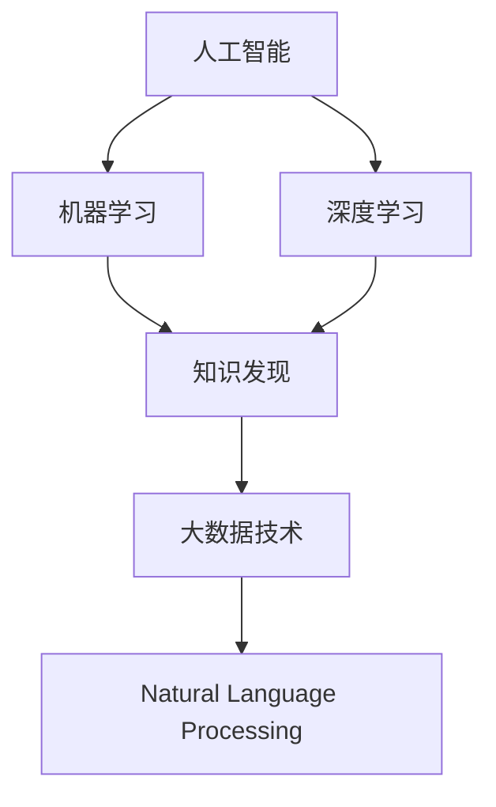

                 

# AI驱动的知识发现：程序员的新机遇

> 关键词：AI, 知识发现, 大数据, 自然语言处理, 机器学习, 深度学习, 大数据技术, 自然语言处理工具, 深度学习框架, 开源社区

## 1. 背景介绍

### 1.1 问题由来

在当今信息爆炸的时代，数据已经成为最有价值的资产之一。企业、机构和政府部门在各自领域中积累了大量的数据，但是这些数据往往杂乱无章、散落在不同的系统中，难以被有效利用。如何从海量数据中提取有用的信息，发现潜在的知识，是每个组织和个人面临的巨大挑战。

为了解决这一问题，人工智能（AI）技术，特别是机器学习和深度学习技术，被广泛应用。AI能够从复杂的数据集中识别模式，提取有用的特征，并形成有意义的洞察。AI驱动的知识发现（Knowledge Discovery by AI, KDAI）成为了解决问题的新途径。

### 1.2 问题核心关键点

AI驱动的知识发现涉及以下几个核心关键点：

1. **数据收集与管理**：从不同数据源中收集数据，并进行清洗、整合，构建统一的数据仓库。
2. **数据预处理**：对数据进行特征工程，包括缺失值处理、异常值检测、标准化等，提高数据质量。
3. **模型训练与优化**：选择合适的算法，对数据进行训练，并通过交叉验证、超参数调优等方法，优化模型性能。
4. **结果解释与可视化**：将模型输出进行解释，通过可视化工具展示发现的知识，促进业务决策。

这些关键点共同构成了AI驱动的知识发现流程，使得数据能够被有效利用，从而创造新的价值。

## 2. 核心概念与联系

### 2.1 核心概念概述

为了深入理解AI驱动的知识发现，我们需要掌握以下几个关键概念：

- **人工智能（AI）**：使用计算机算法和统计模型，模拟人类智能行为的科学和技术。
- **知识发现（KD）**：从数据中提取出有用的信息和知识，形成有意义的洞察。
- **机器学习（ML）**：通过数据训练算法，让机器自动获取知识，并做出预测或决策。
- **深度学习（DL）**：基于神经网络的多层非线性模型，能够处理复杂的非结构化数据。
- **大数据技术**：用于处理、存储、管理和分析海量数据的工具和技术。
- **自然语言处理（NLP）**：使计算机能够理解和处理人类语言的技术。

这些概念相互关联，共同构成了AI驱动的知识发现框架。

### 2.2 核心概念原理和架构的 Mermaid 流程图



这个流程图展示了各个概念之间的联系：人工智能通过机器学习和深度学习技术，从大数据中提取知识，并通过自然语言处理技术将知识转化为可理解和应用的洞察。

## 3. 核心算法原理 & 具体操作步骤

### 3.1 算法原理概述

AI驱动的知识发现通常采用机器学习和深度学习算法，通过对大规模数据集进行训练，提取有用的特征，形成有意义的洞察。其核心思想是：

1. **数据驱动**：通过数据集训练模型，提取特征。
2. **模型优化**：调整模型参数，提高准确率和泛化能力。
3. **知识发现**：从训练好的模型中提取有用的信息，形成知识图谱或决策规则。

### 3.2 算法步骤详解

AI驱动的知识发现一般包括以下几个关键步骤：

**Step 1: 数据收集与管理**

1. **数据收集**：从不同数据源中收集数据，如数据库、文件系统、网络爬虫等。
2. **数据清洗**：去除噪声、处理缺失值、异常值，确保数据质量。
3. **数据整合**：将不同格式的数据整合到一个统一的数据仓库中，便于后续处理。

**Step 2: 数据预处理**

1. **特征工程**：对数据进行转换、提取、选择，形成有用的特征。
2. **数据标准化**：将数据转换成标准格式，便于模型训练。
3. **数据可视化**：通过图表展示数据分布、趋势等，帮助理解数据特性。

**Step 3: 模型训练与优化**

1. **算法选择**：根据数据特性和业务需求，选择合适的算法。
2. **模型训练**：使用训练集对模型进行训练，并调整超参数。
3. **模型评估**：使用验证集评估模型性能，确保模型泛化能力。
4. **模型优化**：通过交叉验证、网格搜索等方法，优化模型性能。

**Step 4: 结果解释与可视化**

1. **结果解释**：对模型输出进行解释，确保理解模型的推理过程。
2. **知识可视化**：通过图表、仪表盘等工具，展示知识发现的结果，促进业务决策。

### 3.3 算法优缺点

AI驱动的知识发现具有以下优点：

1. **高效性**：能够处理海量数据，快速提取有用的信息。
2. **自动化**：通过自动化算法，减少人工干预，提高效率。
3. **灵活性**：能够适应不同类型的数据和问题，应用广泛。

但同时，也存在以下缺点：

1. **数据依赖性**：模型性能依赖于数据质量，需要大量高质量标注数据。
2. **算法复杂性**：模型训练和优化过程复杂，需要专业知识。
3. **解释难度**：模型往往被视为"黑盒"，难以解释其内部机制。

### 3.4 算法应用领域

AI驱动的知识发现可以应用于多个领域，包括但不限于：

1. **金融领域**：通过分析历史交易数据，发现市场趋势，指导投资决策。
2. **医疗健康**：通过分析病历数据，发现疾病模式，改善诊疗方案。
3. **零售行业**：通过分析消费者行为，发现购物偏好，优化营销策略。
4. **能源管理**：通过分析能源使用数据，发现节能潜力，优化能源分配。
5. **公共安全**：通过分析犯罪数据，发现安全漏洞，提高预防能力。

这些应用展示了AI驱动的知识发现在实际中的广泛应用，为各行各业带来新的机遇。

## 4. 数学模型和公式 & 详细讲解 & 举例说明

### 4.1 数学模型构建

为了构建AI驱动的知识发现模型，我们需要建立数学模型，并定义相关的公式。以一个简单的分类问题为例，我们可以使用逻辑回归模型：

$$
P(y|x;\theta) = \sigma(\theta^Tx + b)
$$

其中，$x$ 为输入特征，$y$ 为输出标签，$\theta$ 为模型参数，$\sigma$ 为sigmoid函数。

### 4.2 公式推导过程

假设我们有一组训练数据 $(x_i, y_i)$，$i=1,2,\cdots,N$。我们可以使用最大似然估计法，估计模型参数 $\theta$：

$$
\theta = \mathop{\arg\min}_{\theta} -\frac{1}{N} \sum_{i=1}^N y_i \log P(y_i|x_i;\theta) + (1-y_i) \log (1-P(y_i|x_i;\theta))
$$

即最小化负对数似然损失函数。

### 4.3 案例分析与讲解

以一个简单的股票价格预测为例，我们可以使用历史股价数据 $(x_t, y_t)$，$i=1,2,\cdots,N$，其中 $x_t$ 为时间序列特征，$y_t$ 为未来股价。我们可以使用时间序列模型，如ARIMA，进行训练：

$$
y_t = \phi_0 + \sum_{i=1}^p \phi_i x_{t-i} + \sum_{j=1}^q \theta_j \Delta y_{t-j} + \epsilon_t
$$

其中，$\phi_i$ 和 $\theta_j$ 为模型参数，$\Delta y_t$ 为股价差分，$\epsilon_t$ 为误差项。

通过训练模型，我们可以预测未来的股票价格，发现市场趋势，为投资决策提供参考。

## 5. 项目实践：代码实例和详细解释说明

### 5.1 开发环境搭建

为了进行AI驱动的知识发现项目，我们需要搭建开发环境。以下是Python开发环境的配置步骤：

1. **安装Python**：从官网下载并安装Python，建议使用Anaconda或Miniconda。
2. **创建虚拟环境**：使用conda创建虚拟环境，避免不同项目之间的依赖冲突。
3. **安装依赖包**：安装常用的Python依赖包，如numpy、pandas、scikit-learn等。
4. **配置环境**：设置环境变量，配置好IDE（如Jupyter Notebook、PyCharm等）。

### 5.2 源代码详细实现

以一个简单的分类问题为例，展示如何在Python中进行模型训练和优化。

```python
import numpy as np
from sklearn.linear_model import LogisticRegression

# 准备数据
X = np.array([[1, 2, 3], [4, 5, 6], [7, 8, 9], [10, 11, 12]])
y = np.array([0, 0, 1, 1])

# 定义模型
model = LogisticRegression(solver='lbfgs', max_iter=1000)

# 训练模型
model.fit(X, y)

# 预测结果
print(model.predict([[13, 14, 15]]))
```

### 5.3 代码解读与分析

- **数据准备**：使用numpy创建输入特征矩阵 $X$ 和输出标签向量 $y$。
- **模型定义**：使用sklearn的LogisticRegression类定义模型。
- **模型训练**：使用fit方法对模型进行训练，调整超参数。
- **模型预测**：使用predict方法对新样本进行预测。

## 6. 实际应用场景

### 6.1 金融领域

在金融领域，AI驱动的知识发现可以用于风险评估、信用评分、投资组合优化等。通过分析历史交易数据，发现市场趋势，预测未来价格波动，为投资决策提供依据。

### 6.2 医疗健康

在医疗健康领域，AI驱动的知识发现可以用于疾病诊断、治疗方案优化、药物研发等。通过分析病历数据，发现疾病模式，优化诊疗方案，加速新药研发进程。

### 6.3 零售行业

在零售行业，AI驱动的知识发现可以用于客户分析、库存管理、营销策略优化等。通过分析消费者行为，发现购物偏好，优化库存和营销策略，提高销售额。

### 6.4 能源管理

在能源管理领域，AI驱动的知识发现可以用于能源消耗预测、节能方案优化、能源分配等。通过分析能源使用数据，发现节能潜力，优化能源分配，降低能源成本。

### 6.5 公共安全

在公共安全领域，AI驱动的知识发现可以用于犯罪预测、安全漏洞检测、应急响应等。通过分析犯罪数据，发现安全漏洞，提高预防能力，保障公共安全。

## 7. 工具和资源推荐

### 7.1 学习资源推荐

为了掌握AI驱动的知识发现技术，以下是一些优质的学习资源：

1. **《Python数据分析与可视化》**：介绍Python数据分析和可视化工具，适合入门学习。
2. **《机器学习实战》**：通过实例演示，讲解常用的机器学习算法和模型。
3. **《深度学习》**：介绍深度学习的基础知识和实践技巧，适合深入学习。
4. **《TensorFlow官方文档》**：介绍TensorFlow框架的使用方法和最佳实践，适合技术实践。
5. **《Kaggle竞赛》**：通过参加Kaggle竞赛，实战演练AI驱动的知识发现技术。

### 7.2 开发工具推荐

为了提高开发效率，以下是一些常用的开发工具：

1. **Jupyter Notebook**：开源的Python开发环境，支持代码编写、数据可视化、交互式编程。
2. **PyCharm**：商业化的Python开发工具，功能强大，支持大规模数据处理。
3. **TensorFlow**：开源的深度学习框架，支持多种算法和模型。
4. **Pandas**：开源的数据处理工具，支持数据清洗、整合、分析。
5. **Scikit-learn**：开源的机器学习库，提供多种算法和模型。

### 7.3 相关论文推荐

以下是几篇具有代表性的AI驱动的知识发现论文，推荐阅读：

1. **《大数据的挑战：理解数据背后的故事》**：分析大数据带来的机遇与挑战，探讨数据挖掘和知识发现的方法。
2. **《基于深度学习的文本分类研究》**：介绍深度学习在文本分类中的应用，包括模型选择、训练优化等。
3. **《知识图谱构建与知识发现》**：介绍知识图谱的构建方法和应用，探讨如何从数据中提取知识。
4. **《时间序列分析与预测》**：介绍时间序列分析的方法和应用，探讨如何预测未来趋势。
5. **《自然语言处理中的情感分析》**：介绍自然语言处理中的情感分析技术，包括算法选择、模型优化等。

## 8. 总结：未来发展趋势与挑战

### 8.1 研究成果总结

AI驱动的知识发现技术已经在多个领域取得了显著成果，为各行各业带来了新的机遇。通过大数据、深度学习、自然语言处理等技术的结合，发现有用的信息和知识，形成有意义的洞察。

### 8.2 未来发展趋势

未来，AI驱动的知识发现将呈现以下几个发展趋势：

1. **自动化与智能化**：自动化技术进一步提升，智能算法不断提高，使得知识发现过程更加高效和准确。
2. **跨领域融合**：将知识发现技术与其他领域的技术融合，如计算机视觉、生物信息学等，拓展应用范围。
3. **人机协同**：结合人机协同技术，实现更加智能和灵活的知识发现过程。
4. **数据安全**：加强数据安全和隐私保护，确保数据使用的合规性和安全性。
5. **模型解释**：开发更加可解释的模型，提升模型的透明度和可信度。

### 8.3 面临的挑战

尽管AI驱动的知识发现技术取得了显著进展，但在发展过程中仍面临以下挑战：

1. **数据质量**：数据质量直接影响模型性能，需要高质量的数据采集和处理。
2. **算法复杂性**：模型训练和优化过程复杂，需要专业知识和高性能计算资源。
3. **模型解释**：模型往往被视为"黑盒"，难以解释其内部机制。
4. **数据安全**：数据安全和隐私保护是关键问题，需要采取有效措施确保数据安全。

### 8.4 研究展望

为了克服这些挑战，未来的研究需要在以下几个方面进行突破：

1. **数据增强**：通过数据增强技术，提高数据质量和多样性，增强模型的泛化能力。
2. **模型解释**：开发更加可解释的模型，提升模型的透明度和可信度。
3. **跨领域融合**：将知识发现技术与其他领域的技术融合，拓展应用范围。
4. **数据安全**：加强数据安全和隐私保护，确保数据使用的合规性和安全性。

## 9. 附录：常见问题与解答

### Q1：什么是AI驱动的知识发现？

A：AI驱动的知识发现是指通过人工智能技术，从大规模数据中提取有用的信息和知识，形成有意义的洞察，帮助人们理解和决策。

### Q2：AI驱动的知识发现有哪些步骤？

A：AI驱动的知识发现一般包括以下几个步骤：数据收集与管理、数据预处理、模型训练与优化、结果解释与可视化。

### Q3：AI驱动的知识发现有什么应用？

A：AI驱动的知识发现可以应用于金融、医疗、零售、能源、公共安全等多个领域，帮助各行各业发现有用的信息和知识，形成有意义的洞察。

### Q4：AI驱动的知识发现有哪些挑战？

A：AI驱动的知识发现面临数据质量、算法复杂性、模型解释、数据安全等挑战，需要不断探索和优化。

### Q5：如何提高AI驱动的知识发现性能？

A：提高AI驱动的知识发现性能可以从数据质量、算法选择、模型优化、结果解释等方面入手，不断迭代和优化模型、数据和算法。

---

作者：禅与计算机程序设计艺术 / Zen and the Art of Computer Programming

