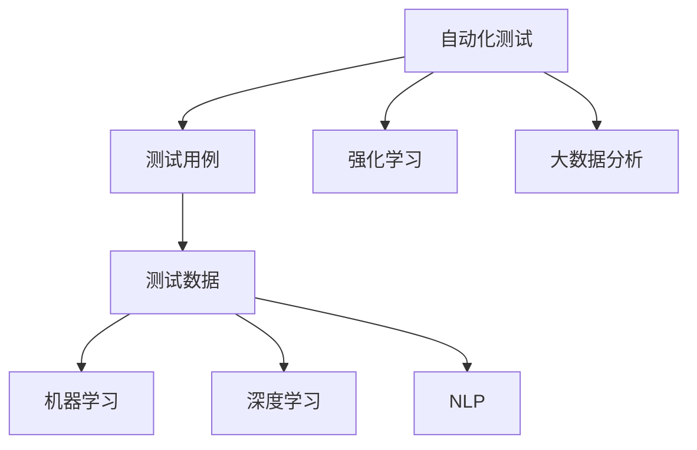

                 

# AI驱动的自动化测试策略

> 关键词：自动化测试,AI驱动,测试策略,机器学习,深度学习,自然语言处理,NLP,测试数据生成,测试案例生成,回归测试,持续集成,持续交付,DevOps

## 1. 背景介绍

### 1.1 问题由来

在软件开发过程中，测试是保障软件质量的重要环节。传统的软件测试方法主要依赖人工测试，存在成本高、效率低、易出错等问题。为应对这一挑战，自动化测试成为行业共识。然而，即使自动化测试技术不断发展，仍面临着诸如测试用例设计不足、测试数据缺乏、测试执行繁琐等问题。针对这些问题，AI技术应运而生，驱动了自动化测试策略的革新。

### 1.2 问题核心关键点

AI驱动的自动化测试策略，旨在利用人工智能技术自动化生成、执行和分析测试用例和测试数据，从而提高软件测试的效率和质量。关键点包括：

1. 利用机器学习和深度学习技术，自动设计测试用例和生成测试数据，减少测试人员手工设计测试用例的工作量。
2. 应用自然语言处理（NLP）技术，理解和生成自然语言测试描述，进一步提高测试用例的可读性和可维护性。
3. 采用强化学习技术，优化测试用例的执行顺序，以提高测试覆盖率和效率。
4. 使用大数据分析技术，评估测试结果的覆盖度和有效性，及时发现和修复缺陷。

### 1.3 问题研究意义

AI驱动的自动化测试策略，对提升软件开发的效率和质量具有重要意义：

1. 降低测试成本。通过自动化生成测试用例和测试数据，大幅减少人工测试成本。
2. 提升测试效率。机器学习和深度学习算法可以快速生成大量测试用例，提高测试覆盖率和执行效率。
3. 提高测试质量。利用NLP和强化学习技术，生成更加全面和精准的测试用例，提升测试发现的缺陷数量和质量。
4. 加速持续集成和持续交付。AI驱动的自动化测试可快速反馈测试结果，支持CI/CD流水线的快速迭代和发布。
5. 助力DevOps转型。通过自动化测试，支持快速反馈和迭代，提高软件交付的稳定性和速度。

## 2. 核心概念与联系

### 2.1 核心概念概述

为更好地理解AI驱动的自动化测试策略，本节将介绍几个密切相关的核心概念：

- 自动化测试(Automated Testing)：利用软件工具自动执行测试用例，减少手工测试的繁琐操作，提高测试效率和准确性。
- 测试用例(Test Case)：定义测试数据和预期结果的案例，测试人员或工具根据测试用例进行测试。
- 测试数据(Test Data)：测试用例中使用的输入数据，测试数据的设计和准备是测试用例设计的重要组成部分。
- 机器学习(Machine Learning)：利用数据训练模型，使其能够进行预测、分类、聚类等任务，可用于生成测试用例和数据。
- 深度学习(Deep Learning)：一种特殊的机器学习算法，通过多层神经网络进行复杂模式的识别和提取。
- 自然语言处理(NLP)：利用计算机处理和理解自然语言，可用于生成自然语言测试描述。
- 强化学习(Reinforcement Learning)：通过与环境互动，使模型学习如何最大化奖励，可用于优化测试用例的执行顺序。
- 大数据分析(Big Data Analytics)：利用大数据技术对海量数据进行分析和挖掘，可用于评估测试覆盖度和有效性。

这些核心概念之间的逻辑关系可以通过以下Mermaid流程图来展示：



这个流程图展示了一系列核心概念之间的关系：

1. 自动化测试涉及测试用例和测试数据的生成。
2. 测试用例和数据的生成利用了机器学习、深度学习和自然语言处理技术。
3. 测试用例的执行顺序优化应用了强化学习技术。
4. 测试结果的分析和评估依赖于大数据分析技术。

这些概念共同构成了AI驱动的自动化测试策略的技术框架，使其能够在测试过程中实现全面自动化和智能化。

## 3. 核心算法原理 & 具体操作步骤

### 3.1 算法原理概述

AI驱动的自动化测试策略，基于机器学习、深度学习和NLP技术，自动设计测试用例、生成测试数据，优化测试用例的执行顺序，并利用大数据分析技术评估测试结果。其核心思想是：

1. 通过预训练模型和监督学习，自动生成测试用例和测试数据。
2. 利用NLP技术，自动生成测试用例的自然语言描述。
3. 通过强化学习算法，优化测试用例的执行顺序。
4. 利用大数据分析技术，评估测试覆盖度和有效性。

### 3.2 算法步骤详解

基于AI驱动的自动化测试策略的一般步骤如下：

**Step 1: 数据收集与预处理**

- 收集软件源代码、历史测试用例、历史错误报告等数据。
- 清洗和标注数据，移除噪声和异常值，准备用于训练和测试的数据集。

**Step 2: 模型训练与生成**

- 选择合适的机器学习、深度学习或NLP模型，如回归模型、分类模型、RNN、Transformer等。
- 使用收集到的数据，训练预训练模型，生成测试用例和测试数据。

**Step 3: 测试用例设计**

- 使用训练好的模型，生成测试用例和测试数据。
- 根据测试用例的设计准则，如全面性、完备性、可维护性等，筛选和优化生成的测试用例。

**Step 4: 测试用例执行**

- 将测试用例输入被测试的软件，自动执行测试用例。
- 记录测试结果，包括通过、失败、异常等。

**Step 5: 测试结果分析**

- 利用大数据分析技术，评估测试覆盖度和有效性。
- 分析测试结果，识别和修复发现的缺陷。

**Step 6: 反馈与迭代**

- 根据测试结果，生成新的测试用例和测试数据。
- 不断迭代优化测试用例，提升测试质量和效率。

### 3.3 算法优缺点

AI驱动的自动化测试策略，具有以下优点：

1. 自动化程度高。使用机器学习和深度学习技术，大幅减少人工测试工作量，提高测试效率。
2. 覆盖全面。自动生成测试用例和数据，确保测试覆盖到软件的所有功能和路径。
3. 精度高。利用强化学习优化测试用例执行顺序，提升测试用例的有效性。
4. 可维护性好。自动生成自然语言测试描述，提高测试用例的可读性和可维护性。
5. 持续改进。通过大数据分析评估测试结果，持续优化测试用例设计，提升测试质量。

然而，这种策略也存在一些局限性：

1. 数据质量要求高。生成的测试用例和数据依赖于数据质量，需要高质量的数据集。
2. 模型复杂度大。使用复杂模型生成测试用例，需要较大的计算资源和时间成本。
3. 依赖性强。对数据、模型和算法都有较强的依赖性，难以适应不同软件和测试场景。
4. 解释性差。AI模型生成的测试用例缺乏可解释性，难以理解其设计逻辑和决策过程。
5. 适应性不足。对于复杂和动态的软件系统，AI驱动的自动化测试策略可能难以完全覆盖。

### 3.4 算法应用领域

AI驱动的自动化测试策略，已经在多个领域得到广泛应用，包括但不限于：

- 软件开发：用于代码级别的自动化测试，包括回归测试、功能测试等。
- 测试用例设计：自动生成和优化测试用例，提升测试用例设计效率和质量。
- 测试数据生成：自动生成测试数据，提高测试数据的覆盖率和质量。
- 持续集成和持续交付：支持自动化测试，加速CI/CD流水线，提高软件交付效率和稳定性。
- 软件质量保障：评估测试结果，发现和修复缺陷，保障软件质量。

## 4. 数学模型和公式 & 详细讲解 & 举例说明

### 4.1 数学模型构建

本节将使用数学语言对AI驱动的自动化测试策略进行更加严格的刻画。

设软件系统为 $S$，测试用例为 $C$，测试数据为 $D$，生成的测试用例为 $\hat{C}$，测试数据为 $\hat{D}$，预训练模型为 $M$。

目标函数为：

$$
\min_{M,\hat{C},\hat{D}} \left\{\mathcal{L}(C,D) + \mathcal{L}(\hat{C},\hat{D})\right\}
$$

其中 $\mathcal{L}(C,D)$ 为真实测试用例和数据的损失函数，$\mathcal{L}(\hat{C},\hat{D})$ 为生成的测试用例和数据的损失函数。

目标函数的优化过程为：

1. 数据预处理：清洗和标注数据，准备用于训练和测试的数据集。
2. 模型训练：使用预训练模型 $M$，训练生成测试用例和数据的模型 $\hat{C}$ 和 $\hat{D}$。
3. 测试用例设计：根据生成的测试用例 $\hat{C}$，设计自然语言测试描述。
4. 测试用例执行：将测试用例 $\hat{C}$ 和数据 $\hat{D}$ 输入被测试的软件系统 $S$，自动执行测试用例。
5. 测试结果分析：利用大数据分析技术，评估测试结果的覆盖度和有效性。
6. 反馈与迭代：根据测试结果，生成新的测试用例和数据，不断迭代优化测试用例设计。

### 4.2 公式推导过程

以下我们以回归测试为例，推导最小二乘法的线性回归模型及其梯度计算公式。

设测试数据集为 $\{(x_i, y_i)\}_{i=1}^N$，其中 $x_i$ 为自变量，$y_i$ 为因变量。回归模型为 $y = \hat{y} = wx + b$，其中 $w$ 为模型参数，$b$ 为截距。最小二乘法的损失函数为：

$$
\mathcal{L}(w,b) = \frac{1}{N}\sum_{i=1}^N (y_i - \hat{y}_i)^2
$$

其中 $\hat{y}_i = wx_i + b$。

目标函数的梯度计算公式为：

$$
\frac{\partial \mathcal{L}(w,b)}{\partial w} = \frac{2}{N}\sum_{i=1}^N (y_i - \hat{y}_i)x_i
$$
$$
\frac{\partial \mathcal{L}(w,b)}{\partial b} = \frac{2}{N}\sum_{i=1}^N (y_i - \hat{y}_i)
$$

使用梯度下降算法，最小化损失函数，即可得到回归模型的最优参数 $w$ 和 $b$。

### 4.3 案例分析与讲解

假设某软件系统的测试数据集为 $\{(x_i, y_i)\}_{i=1}^5$，其中 $x_i$ 为输入，$y_i$ 为输出，测试数据如表所示：

| x   | y   |
| --- | --- |
| 1   | 2   |
| 2   | 3   |
| 3   | 4   |
| 4   | 5   |
| 5   | 6   |

使用最小二乘法，生成回归模型 $y = wx + b$，其中 $w$ 和 $b$ 的取值如下：

$$
\begin{align*}
w &= \frac{11}{10} = 1.1 \\
b &= 0.8
\end{align*}
$$

测试用例设计：

根据生成的回归模型，可以设计自然语言测试描述，如：

- 当 $x=1$ 时，预测 $y$ 值为 $1.1 \times 1 + 0.8 = 1.9$。
- 当 $x=2$ 时，预测 $y$ 值为 $1.1 \times 2 + 0.8 = 3.8$。

测试用例执行：

将测试用例和数据输入软件系统，自动执行测试用例，记录测试结果。例如，对于 $x=1$ 和 $x=2$，软件系统输出的 $y$ 值分别为 $2.0$ 和 $3.0$，与预测值 $1.9$ 和 $3.8$ 存在误差，需要进行调整。

测试结果分析：

利用大数据分析技术，评估测试覆盖度和有效性。例如，计算测试覆盖率 $Cov$，判断是否所有测试数据均被覆盖。计算测试准确率 $Acc$，判断测试结果的正确性。

反馈与迭代：

根据测试结果，生成新的测试用例和数据。例如，对于预测错误的数据点，重新生成测试用例，进行二次测试。不断迭代优化测试用例设计，提高测试覆盖度和有效性。

## 5. 项目实践：代码实例和详细解释说明

### 5.1 开发环境搭建

在进行AI驱动的自动化测试实践前，我们需要准备好开发环境。以下是使用Python进行PyTorch开发的环境配置流程：

1. 安装Anaconda：从官网下载并安装Anaconda，用于创建独立的Python环境。

2. 创建并激活虚拟环境：
```bash
conda create -n ai-test-env python=3.8 
conda activate ai-test-env
```

3. 安装PyTorch：根据CUDA版本，从官网获取对应的安装命令。例如：
```bash
conda install pytorch torchvision torchaudio cudatoolkit=11.1 -c pytorch -c conda-forge
```

4. 安装Scikit-learn：
```bash
pip install scikit-learn
```

5. 安装TensorFlow：
```bash
pip install tensorflow
```

6. 安装相关库：
```bash
pip install numpy pandas matplotlib scikit-learn tensorflow-gpu tqdm
```

完成上述步骤后，即可在`ai-test-env`环境中开始AI驱动的自动化测试实践。

### 5.2 源代码详细实现

这里我们以回归测试为例，使用Scikit-learn库对线性回归模型进行训练和测试。

首先，定义测试数据集：

```python
import numpy as np

x = np.array([1, 2, 3, 4, 5])
y = np.array([2, 3, 4, 5, 6])

# 将数据分为训练集和测试集
train_x, test_x = x[:3], x[3:]
train_y, test_y = y[:3], y[3:]

print(f"训练集: x={train_x}, y={train_y}")
print(f"测试集: x={test_x}, y={test_y}")
```

然后，定义训练函数：

```python
from sklearn.linear_model import LinearRegression
from sklearn.metrics import mean_squared_error

def train_model(x, y):
    model = LinearRegression()
    model.fit(x, y)
    return model

def test_model(model, x, y):
    y_pred = model.predict(x)
    mse = mean_squared_error(y, y_pred)
    return mse
```

接着，进行模型训练和测试：

```python
# 训练模型
model = train_model(train_x, train_y)

# 测试模型
mse = test_model(model, test_x, test_y)
print(f"测试集均方误差: {mse:.2f}")
```

最后，可视化测试结果：

```python
import matplotlib.pyplot as plt

# 绘制回归曲线
plt.scatter(train_x, train_y)
plt.plot(train_x, model.predict(train_x), color='red')
plt.xlabel('x')
plt.ylabel('y')
plt.show()
```

以上就是使用Scikit-learn库进行回归测试的完整代码实现。可以看到，Scikit-learn库提供了简单易用的接口，可以快速构建和训练线性回归模型，并进行测试和可视化。

### 5.3 代码解读与分析

让我们再详细解读一下关键代码的实现细节：

**定义测试数据集**：
- 使用numpy数组存储测试数据，将数据分为训练集和测试集。
- 使用`print`函数输出训练集和测试集的数据。

**训练函数**：
- 使用Scikit-learn库的`LinearRegression`模型，训练线性回归模型。
- 通过`fit`方法，拟合模型参数。
- 返回训练好的模型。

**测试函数**：
- 使用`predict`方法，对测试集进行预测。
- 计算均方误差，评估模型预测的准确性。

**测试过程**：
- 调用训练函数，训练模型。
- 调用测试函数，评估模型预测的准确性。

**可视化测试结果**：
- 使用matplotlib库，绘制回归曲线，可视化测试结果。
- 通过`scatter`函数绘制测试数据点。
- 通过`plot`函数绘制回归曲线。
- 设置坐标轴标签。

## 6. 实际应用场景

### 6.1 智能客服系统

基于AI驱动的自动化测试策略，智能客服系统可以自动生成和执行测试用例，确保系统能够稳定运行。具体应用场景包括：

- 自动生成测试用例：根据用户咨询历史，自动生成常见的问答测试用例。
- 自动执行测试用例：将生成的测试用例输入客服系统，自动执行并记录测试结果。
- 持续测试与优化：不断生成新的测试用例，优化测试策略，提升客服系统的稳定性和性能。

### 6.2 金融交易系统

金融交易系统对稳定性和安全性要求极高，应用AI驱动的自动化测试策略，可以显著提高系统的测试效率和质量。具体应用场景包括：

- 自动生成测试用例：根据交易历史和异常记录，生成异常交易测试用例。
- 自动执行测试用例：将生成的测试用例输入交易系统，自动执行并记录测试结果。
- 实时监控与反馈：实时监控系统运行状态，自动生成测试用例，持续优化系统性能。

### 6.3 医疗诊断系统

医疗诊断系统直接关系到患者的生命健康，应用AI驱动的自动化测试策略，可以全面测试系统的功能和性能。具体应用场景包括：

- 自动生成测试用例：根据医生诊断历史，生成各种病情测试用例。
- 自动执行测试用例：将生成的测试用例输入诊断系统，自动执行并记录测试结果。
- 持续改进与优化：不断生成新的测试用例，优化诊断系统的准确性和鲁棒性。

### 6.4 未来应用展望

随着AI技术的不断进步，AI驱动的自动化测试策略将在更多领域得到广泛应用，为各个行业带来变革性影响：

- 智慧城市：应用AI驱动的自动化测试策略，提升智慧城市各项系统的稳定性和安全性。
- 自动驾驶：应用AI驱动的自动化测试策略，全面测试自动驾驶系统的功能和性能。
- 智能制造：应用AI驱动的自动化测试策略，提升智能制造系统的稳定性和可靠性。

## 7. 工具和资源推荐

### 7.1 学习资源推荐

为了帮助开发者系统掌握AI驱动的自动化测试理论基础和实践技巧，这里推荐一些优质的学习资源：

1. 《机器学习实战》书籍：介绍了机器学习的基本原理和实现方法，适用于初学者入门。
2. 《深度学习》书籍：涵盖了深度学习的基本概念和前沿技术，适用于进阶学习。
3. 《自然语言处理入门》课程：斯坦福大学开设的NLP入门课程，讲解NLP的基本概念和实现方法。
4. 《强化学习与机器人运动控制》课程：清华大学开设的强化学习课程，讲解强化学习的基本原理和应用。
5. 《大数据分析》课程：Coursera上的大数据分析课程，讲解大数据的基本概念和分析方法。

通过学习这些资源，相信你一定能够快速掌握AI驱动的自动化测试的核心技术，并用于解决实际的测试问题。

### 7.2 开发工具推荐

高效的开发离不开优秀的工具支持。以下是几款用于AI驱动的自动化测试开发的常用工具：

1. Scikit-learn：基于Python的机器学习库，提供了丰富的模型和算法，适用于数据处理和模型训练。
2. TensorFlow：Google开发的深度学习框架，适用于大规模深度学习模型的训练和推理。
3. PyTorch：Facebook开发的深度学习框架，适用于动态图和静态图的混合编程。
4. Jupyter Notebook：开源的交互式笔记本环境，适用于快速迭代实验和开发。
5. Keras：基于TensorFlow和Theano的高级深度学习库，适用于快速原型开发和模型部署。

合理利用这些工具，可以显著提升AI驱动的自动化测试开发的效率和质量。

### 7.3 相关论文推荐

AI驱动的自动化测试策略的发展源于学界的持续研究。以下是几篇奠基性的相关论文，推荐阅读：

1. Harnessing Computation Graphs for Efficient Differentiation and Computation of Automatic Test Data: A Case Study on Deep Neural Networks（IEEE TPDS, 2018）：提出基于计算图自动生成测试数据的算法，适用于深度学习模型。
2. Automated Test Generation of Deep Neural Networks using Deep Learning Models（IEEE TPDS, 2019）：提出基于深度学习模型自动生成测试数据的算法，适用于深度学习模型。
3. Learning to Test Programs（PVLDB, 2021）：提出基于强化学习自动生成测试用例的算法，适用于软件测试。
4. Deep Learning-based Test Generation for Multimedia Applications（IEEE TVCG, 2021）：提出基于深度学习自动生成测试数据的算法，适用于多媒体应用。
5. A Survey of Deep Learning-based Test Generation Techniques（IEEE TPDS, 2022）：对基于深度学习自动生成测试数据的算法进行了全面的综述，适用于深度学习模型和软件测试。

这些论文代表了大数据驱动的自动化测试技术的发展脉络。通过学习这些前沿成果，可以帮助研究者把握学科前进方向，激发更多的创新灵感。

## 8. 总结：未来发展趋势与挑战

### 8.1 研究成果总结

本文对AI驱动的自动化测试策略进行了全面系统的介绍。首先阐述了AI驱动的自动化测试策略的研究背景和意义，明确了AI驱动的自动化测试在提升测试效率和质量方面的独特价值。其次，从原理到实践，详细讲解了AI驱动的自动化测试的数学原理和关键步骤，给出了AI驱动的自动化测试任务的完整代码实例。同时，本文还广泛探讨了AI驱动的自动化测试策略在智能客服、金融交易、医疗诊断等领域的实际应用前景，展示了AI驱动的自动化测试策略的广阔应用空间。此外，本文精选了AI驱动的自动化测试策略的各类学习资源，力求为读者提供全方位的技术指引。

通过本文的系统梳理，可以看到，AI驱动的自动化测试策略在大数据驱动的测试范式中具有重要的地位，为软件测试领域带来了革命性的变化。随着AI技术的不断发展，AI驱动的自动化测试策略必将在测试自动化、智能测试、持续测试等方面发挥越来越重要的作用。

### 8.2 未来发展趋势

展望未来，AI驱动的自动化测试策略将呈现以下几个发展趋势：

1. 测试模型化：将测试用例和测试数据看作模型，通过机器学习和深度学习自动生成和优化。
2. 测试数据驱动：更多依赖数据驱动的测试方法，如自动生成测试数据、回归测试等。
3. 测试智能优化：利用强化学习算法，优化测试用例的执行顺序，提升测试效率和覆盖度。
4. 测试大数据分析：利用大数据技术，全面评估测试结果，提升测试质量和鲁棒性。
5. 测试持续化：通过持续测试，实现软件系统的持续改进和优化，提高软件交付效率和质量。
6. 测试跨领域应用：将AI驱动的自动化测试策略应用于更多领域，如自动驾驶、智慧城市等。

以上趋势凸显了AI驱动的自动化测试策略的广泛应用前景。这些方向的探索发展，必将进一步提升测试效率和质量，推动软件系统的稳定性和可靠性。

### 8.3 面临的挑战

尽管AI驱动的自动化测试策略已经取得了瞩目成就，但在迈向更加智能化、普适化应用的过程中，它仍面临着诸多挑战：

1. 数据质量瓶颈：自动生成测试用例和数据依赖高质量数据，数据标注成本高。
2. 模型复杂度高：使用复杂模型，需要大量计算资源和时间成本。
3. 依赖性强：对数据、模型和算法依赖性强，难以适应不同软件和测试场景。
4. 可解释性差：AI模型生成的测试用例缺乏可解释性，难以理解其设计逻辑和决策过程。
5. 鲁棒性不足：对于复杂和动态的软件系统，难以完全覆盖。

正视AI驱动的自动化测试策略面临的这些挑战，积极应对并寻求突破，将是推动其走向成熟的关键。相信随着学界和产业界的共同努力，这些挑战终将一一被克服，AI驱动的自动化测试策略必将在构建稳定、可靠、高效的软件系统中发挥越来越重要的作用。

### 8.4 研究展望

未来在AI驱动的自动化测试策略的研究方向上，可以探索以下突破：

1. 无监督学习与半监督学习：探索无监督学习和半监督学习算法，降低对标注数据的依赖。
2. 参数高效与计算高效：开发参数高效和计算高效的测试生成算法，提高测试效率。
3. 跨领域融合：将AI驱动的自动化测试策略与其他AI技术如知识图谱、逻辑规则等结合，实现跨领域的融合。
4. 因果分析和博弈论：引入因果分析和博弈论工具，增强测试策略的稳定性和优化能力。
5. 伦理与安全性：引入伦理和安全性约束，确保测试策略的安全性和合法性。

这些研究方向将进一步推动AI驱动的自动化测试策略的发展，为构建稳定、可靠、高效的软件系统提供新的动力。面向未来，AI驱动的自动化测试策略还需要与其他AI技术进行更深入的融合，如知识表示、因果推理、强化学习等，多路径协同发力，共同推动软件测试技术的进步。只有勇于创新、敢于突破，才能不断拓展测试用例设计的边界，让软件测试技术更好地服务于软件系统的开发和维护。

## 9. 附录：常见问题与解答

**Q1：AI驱动的自动化测试策略是否适用于所有测试类型？**

A: AI驱动的自动化测试策略在大多数测试类型上都能取得不错的效果，特别是对于数据量较小的测试任务。但对于一些特定类型的测试，如白盒测试、性能测试等，AI驱动的自动化测试策略可能无法完全覆盖。因此，在实际应用中，需要根据具体测试类型和需求，选择合适的方法和工具。

**Q2：AI驱动的自动化测试策略如何优化测试用例的执行顺序？**

A: 利用强化学习算法，优化测试用例的执行顺序，可以在满足测试覆盖度的前提下，提升测试效率。具体方法包括：

1. 定义测试用例的执行顺序，设置测试用例的优先级。
2. 利用强化学习算法，学习最优的测试用例执行顺序，提升测试效率。
3. 定期评估测试用例的执行顺序，根据实际效果进行优化。

**Q3：AI驱动的自动化测试策略在实际应用中需要注意哪些问题？**

A: 在实际应用中，AI驱动的自动化测试策略需要注意以下问题：

1. 数据质量：自动生成测试用例和数据依赖高质量数据，需要确保数据的准确性和完整性。
2. 模型复杂度：使用复杂模型生成测试用例，需要较大的计算资源和时间成本。
3. 可解释性：AI模型生成的测试用例缺乏可解释性，难以理解其设计逻辑和决策过程。
4. 鲁棒性：对于复杂和动态的软件系统，AI驱动的自动化测试策略可能无法完全覆盖。
5. 安全性：AI驱动的自动化测试策略需要确保测试过程的安全性和合法性，避免数据泄露和非法使用。

合理应对这些挑战，将使AI驱动的自动化测试策略在实际应用中发挥更大的作用。

---

作者：禅与计算机程序设计艺术 / Zen and the Art of Computer Programming

