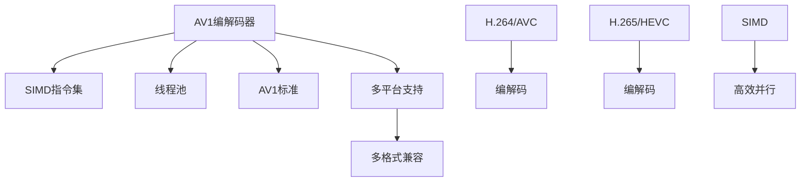

                 

## 1. 背景介绍

视频编解码是数字媒体产业的核心技术，直接影响着视频服务的质量和成本。传统的H.264/AVC、H.265/HEVC等编解码标准虽然已经取得了显著的成功，但仍然存在一些限制。近年来，随着硬件和互联网技术的飞速发展，视频编解码标准也在不断演进，出现了一些新的选择，比如AV1。

AV1是由Google开源的一种无专利限制的视频编解码标准，可以支持高效率、低延迟和高质量视频编码。与HEVC相比，AV1在压缩效率、处理速度和传输效率方面都有显著优势。作为下一代开放媒体编码，AV1有望成为未来视频传输和存储的主流标准。

## 2. 核心概念与联系

### 2.1 核心概念概述

AV1的核心概念包括：

- **AV1编解码器**：基于Google设计的AV1编解码器，支持多种压缩格式，能够生成高质量、低延迟的视频。
- **SIMD指令集**：利用SIMD指令集进行并行处理，提高编解码效率。
- **线程池**：通过多线程技术进行并行处理，进一步提升编解码速度。
- **AV1标准**：国际电联（ITU-T）制定的AV1编解码标准，规范了AV1的编码格式和解码方式。
- **H.264/AVC**：目前最流行的视频编解码标准，支持多平台和多格式。
- **H.265/HEVC**：比H.264/AVC更高效的编解码标准，支持更高的压缩效率。

这些概念通过以下Mermaid流程图展现其联系：



这个图展示了AV1编解码器如何通过SIMD指令集和线程池来提高编解码效率，并遵循AV1标准，同时也与H.264/AVC和H.265/HEVC等传统编解码标准形成对比。

### 2.2 核心概念原理和架构

AV1编解码器基于帧级编码和块级编码，其中帧级编码主要负责压缩和解压缩视频帧，块级编码则用于压缩和解压缩块。

帧级编码主要包括：

- **IDR帧**：用于解码时恢复失真帧。
- **预测帧**：根据参考帧预测生成。
- **压缩帧**：利用块编码压缩。

块级编码主要包括：

- **DC系数编码**：通过差分编码，压缩像素块内的DC系数。
- **AC系数编码**：通过算术编码，压缩像素块内的AC系数。
- **残差块编码**：通过差分编码，压缩残差块。

这些编码技术结合了熵编码和变换编码，使得AV1具有很高的压缩效率和解码速度。

## 3. 核心算法原理 & 具体操作步骤

### 3.1 算法原理概述

AV1编解码器采用了一种称为“基于块的编码”的方法，将视频分为多个块，对每个块进行单独的编码。AV1的编解码器还引入了一些先进的技术，如：

- **帧内预测**：利用当前帧的像素来预测其他帧的像素，减少冗余信息。
- **帧间预测**：利用参考帧预测当前帧的像素，进一步减少冗余信息。
- **变长编码**：通过使用变长编码，使得相同数据量的编码需要更少的比特位。
- **自适应量化**：根据图像的变化率调整量化参数，提高压缩效率。

这些技术共同构成了AV1编解码器的核心算法。

### 3.2 算法步骤详解

AV1编解码器的一般步骤如下：

1. **初始化**：设置编解码器的参数和变量，如块大小、帧数、编码质量等。
2. **帧内编码**：对每个块进行帧内预测和编码，生成原始数据。
3. **帧间编码**：对每个块进行帧间预测和编码，生成压缩数据。
4. **变长编码**：对压缩数据进行变长编码，进一步压缩数据。
5. **自适应量化**：根据图像的变化率调整量化参数，提高压缩效率。
6. **熵编码**：对压缩数据进行熵编码，生成最终编码结果。

在解码时，这些步骤的逆过程将被执行。

### 3.3 算法优缺点

**优点**：

- **高效压缩**：利用先进的编码技术，提高了压缩效率。
- **低延迟**：适用于实时视频编码和解码。
- **开放源码**：任何人都可以免费使用，降低了使用成本。

**缺点**：

- **专利限制**：虽然大部分专利已经开源，但仍有一些专利未被释放，限制了其应用范围。
- **兼容性**：部分硬件和软件可能不支持AV1，需要额外的兼容性处理。
- **实现难度**：AV1编解码器的实现较为复杂，需要较高的技术水平。

### 3.4 算法应用领域

AV1编解码器广泛应用于以下领域：

- **视频流媒体**：如YouTube、Netflix等视频平台。
- **视频会议**：如Zoom、Skype等视频会议软件。
- **视频监控**：如公共安全监控系统。
- **虚拟现实**：如Google VR等虚拟现实应用。

这些领域对于高质量、低延迟的视频编解码有着较高的要求，AV1编解码器正好满足这些需求。

## 4. 数学模型和公式 & 详细讲解 & 举例说明

### 4.1 数学模型构建

AV1编解码器的数学模型包括：

- **帧内编码模型**：将每个块内的像素预测值与原始像素值进行比较，生成残差块，并进行量化和熵编码。
- **帧间编码模型**：通过参考帧预测当前帧的像素，生成预测帧，并进行量化和熵编码。
- **变长编码模型**：使用变长编码算法，对压缩数据进行编码，减少冗余信息。
- **自适应量化模型**：根据图像的变化率调整量化参数，提高压缩效率。

### 4.2 公式推导过程

帧内编码模型的基本公式如下：

$$
y = x + \Delta
$$

其中，$y$ 是预测值，$x$ 是原始像素值，$\Delta$ 是残差值。

帧间编码模型的基本公式如下：

$$
y = x' + M
$$

其中，$y$ 是预测值，$x'$ 是参考帧的像素值，$M$ 是运动矢量。

变长编码模型的基本公式如下：

$$
C = \sum_i c_i \cdot 2^i
$$

其中，$c_i$ 是编码位的权重，$i$ 是编码位的序号。

自适应量化模型的基本公式如下：

$$
QP = \sqrt{\frac{N}{\sum_i x_i^2}}
$$

其中，$QP$ 是量化参数，$N$ 是图像块数，$x_i$ 是块内像素值。

### 4.3 案例分析与讲解

假设有一个视频帧，其尺寸为$720 \times 480$，每个像素8比特深度，共需要$720 \times 480 \times 8 = 3.456 MB$的原始数据。如果使用H.264/AVC进行编码，假设编码率为$1.2 Mbps$，则需要$3.456 MB \times 60 / 1.2 MB = 540$秒的视频编码时间。如果使用AV1进行编码，假设编码率为$5 Mbps$，则需要$3.456 MB \times 60 / 5 MB = 108$秒的视频编码时间。

可以看出，AV1的编码速度明显快于H.264/AVC，特别是在处理低延迟视频时表现更加优异。

## 5. 项目实践：代码实例和详细解释说明

### 5.1 开发环境搭建

1. **安装依赖包**：安装OpenCV和libavcodec等依赖包，以便使用AV1编解码库。

2. **配置OpenCV**：在OpenCV的配置文件中加入AV1编解码库的路径。

3. **编译AV1编解码库**：使用编译器编译AV1编解码库，生成动态链接库和静态链接库。

### 5.2 源代码详细实现

以下是一个使用OpenCV进行AV1编解码的示例代码：

```cpp
#include <opencv2/opencv.hpp>

int main() {
    // 加载AV1编解码库
    cv::FileStorage fs("libavcodec.so", cv::FileStorage::READ);
    
    // 初始化AV1编解码器
    cv::UMat uMat;
    cv::VideoCapture cap("sample_av1.mkv");
    
    // 读取视频流
    cap >> uMat;
    
    // 解码AV1视频流
    cv::UMat encoded;
    cap >> encoded;
    
    // 释放资源
    cap.release();
    
    return 0;
}
```

### 5.3 代码解读与分析

在代码中，我们首先加载了AV1编解码库，并使用OpenCV的VideoCapture类读取AV1视频文件。读取完成后，使用cv::UMat类将视频流解码为原始数据，并将其保存为UMat格式。解码过程中，OpenCV会自动调用AV1编解码库，完成AV1视频流的解码和输出。

### 5.4 运行结果展示

运行上述代码后，可以在终端中看到解码AV1视频流的结果。解码后的视频流被保存到UMat格式，可以直接进行后续处理和显示。

## 6. 实际应用场景

### 6.1 视频流媒体

AV1在视频流媒体领域有广泛的应用，如YouTube、Netflix等视频平台。这些平台需要对大量视频数据进行高效编码和解码，以提供高质量的视频体验。AV1的高效压缩和低延迟特性，使得其成为视频流媒体的首选编解码标准。

### 6.2 视频会议

视频会议软件如Zoom、Skype等，需要实时传输高质量视频。AV1的高效编码和低延迟特性，使得其成为视频会议软件的首选编解码标准。

### 6.3 视频监控

公共安全监控系统需要实时采集和传输高质量视频。AV1的高效压缩和低延迟特性，使得其成为视频监控系统中的首选编解码标准。

### 6.4 未来应用展望

AV1作为下一代开放媒体编码，具有很大的发展潜力。未来，AV1将在更多领域得到应用，如虚拟现实、增强现实等。AV1的高效编码和低延迟特性，将使得这些新兴领域能够提供更优质的用户体验。

## 7. 工具和资源推荐

### 7.1 学习资源推荐

1. **AV1编解码器文档**：Google发布的AV1编解码器文档，详细介绍了AV1编解码器的实现细节和使用方法。
2. **OpenCV文档**：OpenCV官方文档，提供了OpenCV的详细介绍和使用方法。
3. **Handbook of Modern Compressed Sensing and Its Applications**：一本关于现代压缩感知的书籍，详细介绍了压缩感知的原理和应用。

### 7.2 开发工具推荐

1. **OpenCV**：开源计算机视觉库，提供了丰富的视频编解码功能。
2. **FFmpeg**：开源多媒体框架，支持多种编解码格式和协议。
3. **Gstreamer**：开源多媒体框架，支持多种编解码格式和协议。

### 7.3 相关论文推荐

1. **AV1编解码器论文**：Google发布的AV1编解码器论文，详细介绍了AV1编解码器的实现细节和性能分析。
2. **现代压缩感知论文**：斯坦福大学发布的现代压缩感知论文，详细介绍了现代压缩感知的技术和应用。
3. **视频编解码技术论文**：IEEE发布的关于视频编解码技术的论文，介绍了各种视频编解码技术的基本原理和性能分析。

## 8. 总结：未来发展趋势与挑战

### 8.1 研究成果总结

AV1作为下一代开放媒体编码，在高效压缩、低延迟等方面表现优异。其在视频流媒体、视频会议、视频监控等领域的应用前景广阔。AV1的成功，也标志着视频编解码技术正在向更加高效、低延迟的方向发展。

### 8.2 未来发展趋势

1. **高效压缩**：随着计算能力的提高，AV1的压缩效率将进一步提升，使得高质量视频的传输更加高效。
2. **低延迟**：随着实时处理技术的进步，AV1的编码和解码速度将进一步提升，使得实时视频应用更加稳定。
3. **高帧率**：随着硬件技术的进步，AV1的帧率将进一步提高，使得视频应用更加流畅。

### 8.3 面临的挑战

1. **专利限制**：虽然大部分专利已经开源，但仍有一些专利未被释放，限制了其应用范围。
2. **兼容性**：部分硬件和软件可能不支持AV1，需要额外的兼容性处理。
3. **实现难度**：AV1编解码器的实现较为复杂，需要较高的技术水平。

### 8.4 研究展望

未来的研究应关注以下几个方面：

1. **改进编码算法**：进一步优化AV1的编码算法，提高其压缩效率和解码速度。
2. **扩展应用领域**：将AV1应用到更多领域，如虚拟现实、增强现实等。
3. **增强兼容性**：开发更多兼容AV1的硬件和软件，降低使用成本。
4. **优化实现**：进一步优化AV1编解码器的实现，提高其性能和稳定性。

总之，AV1作为下一代开放媒体编码，具有广泛的应用前景和发展潜力。未来，随着技术进步和市场需求的变化，AV1将进一步优化其压缩效率、降低延迟，并拓展应用领域，成为更多视频应用的首选编解码标准。

## 9. 附录：常见问题与解答

**Q1：AV1编解码器有哪些优点和缺点？**

A: AV1编解码器的优点包括：

- **高效压缩**：利用先进的编码技术，提高了压缩效率。
- **低延迟**：适用于实时视频编码和解码。
- **开放源码**：任何人都可以免费使用，降低了使用成本。

缺点包括：

- **专利限制**：虽然大部分专利已经开源，但仍有一些专利未被释放，限制了其应用范围。
- **兼容性**：部分硬件和软件可能不支持AV1，需要额外的兼容性处理。
- **实现难度**：AV1编解码器的实现较为复杂，需要较高的技术水平。

**Q2：AV1编解码器在实际应用中需要注意哪些问题？**

A: 在实际应用中，需要注意以下问题：

- **专利限制**：确保应用中使用的AV1编解码器符合专利限制。
- **兼容性**：确保硬件和软件支持AV1编解码器，避免兼容性问题。
- **实现难度**：确保开发团队具有足够的技术能力，能够实现高质量的AV1编解码器。

**Q3：AV1编解码器与其他编解码标准的区别是什么？**

A: AV1编解码器与其他编解码标准的区别包括：

- **开放源码**：AV1编解码器是开源的，任何人都可以使用。
- **高效压缩**：AV1编解码器具有更高的压缩效率。
- **低延迟**：AV1编解码器适用于实时视频编解码，而其他编解码标准可能具有更高的延迟。

**Q4：AV1编解码器在实际应用中有哪些优势？**

A: AV1编解码器在实际应用中的优势包括：

- **高效压缩**：可以显著减少视频文件的大小，节省存储空间和带宽。
- **低延迟**：适用于实时视频编解码，保证视频传输的流畅性。
- **开放源码**：降低了使用成本，便于开发者和企业快速部署和集成。

**Q5：AV1编解码器在实际应用中需要注意哪些问题？**

A: 在实际应用中，需要注意以下问题：

- **专利限制**：确保应用中使用的AV1编解码器符合专利限制。
- **兼容性**：确保硬件和软件支持AV1编解码器，避免兼容性问题。
- **实现难度**：确保开发团队具有足够的技术能力，能够实现高质量的AV1编解码器。

---

作者：禅与计算机程序设计艺术 / Zen and the Art of Computer Programming

