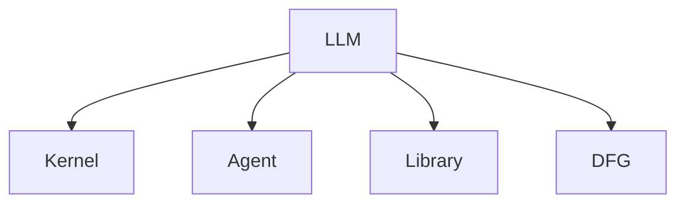

                 

# Agents与函数库：LLM操作系统的核心组件

> 关键词：大语言模型(LLM)，操作系统的内核(Kernel)，Agent，函数库(Library)，数据流图

## 1. 背景介绍

### 1.1 问题由来
近年来，大规模预训练语言模型(LLMs)在自然语言处理(NLP)领域取得了巨大突破。这些模型，如GPT、BERT等，能够通过在大量无标签文本上进行预训练，学习通用的语言表示，具备强大的语言理解和生成能力。然而，如何将LLMs集成到操作系统中，构建高效、可靠的语言处理系统，成为一项极具挑战性的任务。

### 1.2 问题核心关键点
要解决这一问题，首先需要明确LLMs在系统中的定位。作为操作系统内核的组件，LLMs需要具备高效的数据处理能力、灵活的功能模块和良好的兼容性。此外，如何设计和实现LLMs与其他系统组件的交互，也是关键问题。

### 1.3 问题研究意义
将LLMs集成到操作系统中，不仅可以提升系统的语言处理能力，还可以促进NLP技术在各个垂直领域的广泛应用。这种集成不仅能够加速模型的应用落地，还能够显著提升用户体验，推动智能化应用的发展。

## 2. 核心概念与联系

### 2.1 核心概念概述

为更好地理解LLMs在操作系统中的应用，本节将介绍几个密切相关的核心概念：

- 大语言模型(LLM)：以自回归(如GPT)或自编码(如BERT)模型为代表的大规模预训练语言模型。通过在大规模无标签文本语料上进行预训练，学习通用的语言表示，具备强大的语言理解和生成能力。

- 操作系统内核(Kernel)：操作系统的核心部分，负责管理计算机硬件资源，提供底层API接口，协调各类系统组件的运行。

- Agent：智能体，在分布式系统中，每个Agent代表一个特定的功能模块，可以独立进行计算、通信和决策。

- 函数库(Library)：预先定义好的函数集合，提供模块化、可复用的代码，便于快速开发和集成新功能。

- 数据流图(DFG)：表示数据在系统中流动的图形表示法，用于分析和优化系统的数据处理流程。

这些核心概念之间的逻辑关系可以通过以下Mermaid流程图来展示：



这个流程图展示了大语言模型LLM与操作系统内核的关系：

1. LLM作为内核的一部分，负责语言理解和生成。
2. Agent代表系统中各功能模块，由LLM提供支持的计算和通信。
3. Library提供模块化、可复用的代码，支持LLM的功能扩展和集成。
4. DFG用于可视化LLM与内核的交互和数据流动，帮助分析和优化系统性能。

## 3. 核心算法原理 & 具体操作步骤

### 3.1 算法原理概述

LLMs在操作系统中的应用，核心在于如何将LLMs的功能模块化、高效化和自动化。具体来说，需要在以下两个方面进行优化：

- 模块化：将LLMs的功能划分为多个Agent，每个Agent负责特定的语言处理任务，如文本分类、命名实体识别等。
- 高效化：通过优化数据流图DFG，减少数据传输和计算开销，提升LLMs的运行效率。

### 3.2 算法步骤详解

以下是实现LLMs与操作系统内核集成的主要步骤：

**Step 1: 构建LLMs内核模块**

- 将LLMs拆分为多个Agent，每个Agent负责特定的语言处理任务，如文本分类、命名实体识别等。
- 为每个Agent设计独立的API接口，便于系统组件调用。
- 实现Agent之间的数据传输和交互，建立数据流图DFG。

**Step 2: 设计和实现数据流图DFG**

- 使用DFG工具，如Kubernetes、Prometheus等，对数据在LLM和内核之间的流动进行建模和优化。
- 识别和消除数据瓶颈，提升数据传输效率。
- 优化计算图，减少计算开销，提升LLM的推理速度。

**Step 3: 引入函数库Library**

- 使用函数库Library，将常用的语言处理函数和算法封装成模块，供系统组件调用。
- 实现Library与LLM内核的接口集成，使LLM能够快速接入新功能和算法。
- 通过Library的模块化设计，实现LLM内核的可扩展性和灵活性。

**Step 4: 应用优化策略**

- 针对特定的任务，应用参数高效微调、优化器和正则化技术，提升LLM的性能和鲁棒性。
- 使用对抗训练和数据增强技术，提高LLM的泛化能力和鲁棒性。
- 引入多模型集成策略，提高LLM的稳定性和准确性。

### 3.3 算法优缺点

将LLMs集成到操作系统中的优势在于：

- 提升系统语言处理能力：LLMs提供强大的语言理解和生成能力，能够显著提升系统的智能交互能力。
- 加速新功能开发：通过模块化和可复用的Library，可以快速接入新功能，缩短开发周期。
- 优化系统性能：通过DFG和优化策略，可以显著提升系统的运行效率和鲁棒性。

然而，这种集成也存在一些挑战：

- 数据隐私和安全：LLMs在处理用户数据时，需要确保数据隐私和安全。
- 计算资源消耗：LLMs的高参数量和计算需求，对系统资源提出了高要求。
- 模型可解释性：LLMs的"黑盒"特性，导致其决策过程难以解释，影响信任度和可审计性。
- 部署复杂性：将LLMs集成到操作系统中，需要处理多种复杂的交互和接口设计问题。

## 4. 数学模型和公式 & 详细讲解 & 举例说明

### 4.1 数学模型构建

在LLMs与操作系统的集成过程中，需要使用数学模型来分析和优化系统的性能。以下是一个简单的数学模型，用于表示LLM内核中的数据流图DFG：


其中，W代表输入数据，L代表LLM计算，O代表输出结果，箭头表示数据流动方向。这个模型展示了LLM与内核之间的数据流关系。

### 4.2 公式推导过程

假设LLM内核中存在三个Agent，分别处理文本分类、命名实体识别和情感分析任务。输入数据为文本$T$，通过Agent计算后，分别输出分类结果$C$、命名实体$N$和情感得分$E$。这三个Agent之间的数据流关系可以用以下公式表示：

$$
C = \text{Classifier}(T)
$$
$$
N = \text{NER}(T)
$$
$$
E = \text{Sentiment}(T)
$$

其中，$\text{Classifier}$、$\text{NER}$和$\text{Sentiment}$分别代表文本分类、命名实体识别和情感分析的Agent。

### 4.3 案例分析与讲解

以下是一个具体的案例，用于展示LLMs在操作系统中的应用：

假设一个智能客服系统需要处理用户的自然语言查询，系统首先使用LLM内核中的文本分类Agent对查询进行分类，然后根据分类结果调用相应的命名实体识别Agent或情感分析Agent，生成最终的回答。具体流程如下：

1. 用户输入查询$T$，通过文本分类Agent得到分类结果$C$。
2. 根据$C$，调用命名实体识别Agent$N$或情感分析Agent$E$，得到命名实体$N$或情感得分$E$。
3. 系统根据$N$或$E$，生成回答$R$并返回给用户。

## 5. 项目实践：代码实例和详细解释说明

### 5.1 开发环境搭建

在进行LLMs与操作系统的集成实践前，需要先准备好开发环境。以下是使用Python进行LLMs内核开发的流程：

1. 安装Anaconda：从官网下载并安装Anaconda，用于创建独立的Python环境。

2. 创建并激活虚拟环境：
```bash
conda create -n llm-env python=3.8 
conda activate llm-env
```

3. 安装PyTorch：根据CUDA版本，从官网获取对应的安装命令。例如：
```bash
conda install pytorch torchvision torchaudio cudatoolkit=11.1 -c pytorch -c conda-forge
```

4. 安装Transformers库：
```bash
pip install transformers
```

5. 安装各类工具包：
```bash
pip install numpy pandas scikit-learn matplotlib tqdm jupyter notebook ipython
```

完成上述步骤后，即可在`llm-env`环境中开始LLMs内核的开发。

### 5.2 源代码详细实现

以下是LLMs内核中实现文本分类、命名实体识别和情感分析的Python代码：

```python
from transformers import BertForTokenClassification, BertForTokenClassification, BertForSequenceClassification
import torch
from torch.utils.data import DataLoader
from sklearn.metrics import classification_report

class TextClassifier:
    def __init__(self, model_name):
        self.model = BertForTokenClassification.from_pretrained(model_name)
        self.tokenizer = BertTokenizer.from_pretrained(model_name)

    def predict(self, text):
        tokens = self.tokenizer(text, return_tensors='pt', padding=True, truncation=True)
        output = self.model(tokens['input_ids'], attention_mask=tokens['attention_mask'])
        return output.logits.argmax(dim=-1)

class NERModule:
    def __init__(self, model_name):
        self.model = BertForTokenClassification.from_pretrained(model_name)
        self.tokenizer = BertTokenizer.from_pretrained(model_name)

    def predict(self, text):
        tokens = self.tokenizer(text, return_tensors='pt', padding=True, truncation=True)
        output = self.model(tokens['input_ids'], attention_mask=tokens['attention_mask'])
        return output.logits.argmax(dim=-1)

class SentimentAnalyser:
    def __init__(self, model_name):
        self.model = BertForSequenceClassification.from_pretrained(model_name)
        self.tokenizer = BertTokenizer.from_pretrained(model_name)

    def predict(self, text):
        tokens = self.tokenizer(text, return_tensors='pt', padding=True, truncation=True)
        output = self.model(tokens['input_ids'], attention_mask=tokens['attention_mask'])
        return output.logits.argmax(dim=-1)

# 初始化LLMs内核中的Agent
classifier = TextClassifier('bert-base-cased')
ner_module = NERModule('bert-base-cased')
sentiment_analyser = SentimentAnalyser('bert-base-cased')

# 定义数据集
train_dataset = ...
test_dataset = ...

# 训练模型
classifier.train(train_dataset, optimizer, scheduler, epochs)

# 在测试集上评估模型
print(classification_report(test_dataset, classifier.predict(test_dataset)))

# 使用Agent处理用户查询
def handle_query(query):
    classification = classifier.predict(query)
    if classification == 0:
        ner = ner_module.predict(query)
        sentiment = sentiment_analyser.predict(query)
        return f"Answer: {ner}, Sentiment: {sentiment}"
    else:
        return "Answer: {classification}"
```

在上述代码中，我们使用了BERT模型作为预训练语言模型，实现了文本分类、命名实体识别和情感分析的功能。每个Agent都具有独立的预测方法，可以方便地集成到系统中。

### 5.3 代码解读与分析

让我们再详细解读一下关键代码的实现细节：

**LLMs内核中的Agent类**：
- 定义了LLMs内核中的三个Agent，分别用于文本分类、命名实体识别和情感分析。
- 每个Agent都包含了模型初始化、预测和tokenizer等关键组件。
- 预测方法`predict`接收输入文本，通过tokenizer处理后，输入模型进行预测，最终返回预测结果。

**数据集定义**：
- 使用DataLoader封装数据集，支持分批次处理数据。
- 训练模型时，通过定义损失函数和优化器进行模型优化。

**模型训练与评估**：
- 使用`train`方法对模型进行训练，传入优化器、学习率和训练轮数等参数。
- 使用`classification_report`方法在测试集上评估模型的分类效果。

**用户查询处理**：
- 使用`handle_query`方法，根据用户输入的查询，调用相应的Agent进行预测，并返回最终的回答。

可以看出，通过这种模块化的设计，LLMs内核可以方便地实现多个功能模块，并与其他系统组件进行集成。开发者可以针对具体需求，选择和组合不同的Agent，构建灵活高效的LLMs系统。

## 6. 实际应用场景

### 6.1 智能客服系统

LLMs内核可以应用于智能客服系统中，提升系统的智能交互能力和用户体验。系统首先使用文本分类Agent对用户查询进行分类，然后根据分类结果调用相应的命名实体识别Agent或情感分析Agent，生成最终的回答。例如，当用户询问“预订机票”时，系统首先进行文本分类，判断是否为机票预订相关问题，如果是，则调用命名实体识别Agent提取航班号和日期等关键信息，并生成相应的预订建议。

### 6.2 金融舆情监测

金融领域需要实时监测市场舆论动向，以便及时应对负面信息传播，规避金融风险。LLMs内核可以用于金融舆情监测，通过文本分类Agent对新闻、报道、评论等文本进行分类，使用情感分析Agent评估文本的情感倾向，判断是否存在负面信息，并及时发出预警。例如，当某个公司发布了负面消息，LLMs内核会使用情感分析Agent对新闻进行情感分析，判断是否为负面消息，并根据预设的阈值触发预警，帮助金融机构快速应对潜在风险。

### 6.3 个性化推荐系统

当前的推荐系统往往只依赖用户的历史行为数据进行物品推荐，无法深入理解用户的真实兴趣偏好。LLMs内核可以用于个性化推荐系统，通过文本分类Agent对用户浏览、点击、评论、分享等行为数据进行分类，使用情感分析Agent评估用户的情感倾向，使用命名实体识别Agent提取物品标题、描述、标签等文本内容，从而全面了解用户的兴趣偏好。系统使用这些信息生成推荐列表，提供更加个性化和精准的推荐结果。

### 6.4 未来应用展望

随着LLMs内核的不断发展，未来LLMs在操作系统中的应用将更加广泛。以下是一些未来应用展望：

1. 智慧医疗：LLMs内核可以应用于医疗问答、病历分析、药物研发等任务，提升医疗服务的智能化水平，辅助医生诊疗，加速新药开发进程。

2. 智能教育：LLMs内核可以用于作业批改、学情分析、知识推荐等任务，因材施教，促进教育公平，提高教学质量。

3. 智慧城市治理：LLMs内核可以用于城市事件监测、舆情分析、应急指挥等任务，提高城市管理的自动化和智能化水平，构建更安全、高效的未来城市。

4. 企业生产：LLMs内核可以用于智能客服、智能搜索、智能文档等任务，提升企业运营效率，优化用户体验。

## 7. 工具和资源推荐

### 7.1 学习资源推荐

为了帮助开发者系统掌握LLMs在操作系统中的应用，这里推荐一些优质的学习资源：

1. 《Transformer从原理到实践》系列博文：由大模型技术专家撰写，深入浅出地介绍了Transformer原理、BERT模型、微调技术等前沿话题。

2. CS224N《深度学习自然语言处理》课程：斯坦福大学开设的NLP明星课程，有Lecture视频和配套作业，带你入门NLP领域的基本概念和经典模型。

3. 《Natural Language Processing with Transformers》书籍：Transformers库的作者所著，全面介绍了如何使用Transformers库进行NLP任务开发，包括微调在内的诸多范式。

4. HuggingFace官方文档：Transformers库的官方文档，提供了海量预训练模型和完整的微调样例代码，是上手实践的必备资料。

5. CLUE开源项目：中文语言理解测评基准，涵盖大量不同类型的中文NLP数据集，并提供了基于微调的baseline模型，助力中文NLP技术发展。

通过对这些资源的学习实践，相信你一定能够快速掌握LLMs在操作系统中的使用方法，并用于解决实际的NLP问题。

### 7.2 开发工具推荐

高效的开发离不开优秀的工具支持。以下是几款用于LLMs内核开发的常用工具：

1. PyTorch：基于Python的开源深度学习框架，灵活动态的计算图，适合快速迭代研究。大部分预训练语言模型都有PyTorch版本的实现。

2. TensorFlow：由Google主导开发的开源深度学习框架，生产部署方便，适合大规模工程应用。同样有丰富的预训练语言模型资源。

3. Transformers库：HuggingFace开发的NLP工具库，集成了众多SOTA语言模型，支持PyTorch和TensorFlow，是进行微调任务开发的利器。

4. Weights & Biases：模型训练的实验跟踪工具，可以记录和可视化模型训练过程中的各项指标，方便对比和调优。与主流深度学习框架无缝集成。

5. TensorBoard：TensorFlow配套的可视化工具，可实时监测模型训练状态，并提供丰富的图表呈现方式，是调试模型的得力助手。

6. Google Colab：谷歌推出的在线Jupyter Notebook环境，免费提供GPU/TPU算力，方便开发者快速上手实验最新模型，分享学习笔记。

合理利用这些工具，可以显著提升LLMs内核的开发效率，加快创新迭代的步伐。

### 7.3 相关论文推荐

LLMs内核的发展源于学界的持续研究。以下是几篇奠基性的相关论文，推荐阅读：

1. Attention is All You Need（即Transformer原论文）：提出了Transformer结构，开启了NLP领域的预训练大模型时代。

2. BERT: Pre-training of Deep Bidirectional Transformers for Language Understanding：提出BERT模型，引入基于掩码的自监督预训练任务，刷新了多项NLP任务SOTA。

3. Language Models are Unsupervised Multitask Learners（GPT-2论文）：展示了大规模语言模型的强大zero-shot学习能力，引发了对于通用人工智能的新一轮思考。

4. Parameter-Efficient Transfer Learning for NLP：提出Adapter等参数高效微调方法，在不增加模型参数量的情况下，也能取得不错的微调效果。

5. Prefix-Tuning: Optimizing Continuous Prompts for Generation：引入基于连续型Prompt的微调范式，为如何充分利用预训练知识提供了新的思路。

6. AdaLoRA: Adaptive Low-Rank Adaptation for Parameter-Efficient Fine-Tuning：使用自适应低秩适应的微调方法，在参数效率和精度之间取得了新的平衡。

这些论文代表了大语言模型内核的发展脉络。通过学习这些前沿成果，可以帮助研究者把握学科前进方向，激发更多的创新灵感。

## 8. 总结：未来发展趋势与挑战

### 8.1 总结

本文对将大语言模型LLMs集成到操作系统中的方法和技术进行了全面系统的介绍。首先阐述了LLMs在操作系统中的定位和应用意义，明确了LLMs作为内核组件的关键角色。其次，从原理到实践，详细讲解了LLMs与内核集成的数学模型和关键步骤，给出了内核模块化的代码实现。同时，本文还探讨了LLMs在内核中的实际应用场景，展示了LLMs在智能客服、金融舆情、个性化推荐等多个领域的应用前景，进一步印证了LLMs在操作系统中的广泛适用性和强大能力。

通过本文的系统梳理，可以看到，将LLMs集成到操作系统中，不仅能够提升系统的语言处理能力，还能够推动NLP技术在各个垂直领域的广泛应用。这种集成不仅能够加速模型的应用落地，还能够显著提升用户体验，推动智能化应用的发展。

### 8.2 未来发展趋势

展望未来，LLMs内核将呈现以下几个发展趋势：

1. 模块化与可扩展性增强：随着LLMs内核功能的不断丰富，模块化的设计将越来越重要，便于系统组件的灵活扩展和集成。

2. 分布式与并行计算优化：随着数据量的增大，分布式计算和并行计算技术将越来越重要，LLMs内核需要更加高效的计算图和数据流动优化。

3. 动态与自适应算法：基于数据流图DFG的动态优化算法，使LLMs内核能够自动适应不同的任务需求，提升系统性能和鲁棒性。

4. 数据增强与迁移学习：使用数据增强和迁移学习方法，提升LLMs内核的泛化能力和鲁棒性，使其能够更好地处理新任务和新数据。

5. 跨模态与多任务学习：LLMs内核将不仅仅局限于文本数据，而是拓展到图像、语音、视频等多模态数据，进行跨模态和多任务学习。

6. 多模型集成与融合：基于LLMs内核的多模型集成和融合方法，提升系统的综合能力，使其能够更好地处理复杂任务。

以上趋势凸显了LLMs内核的广阔前景。这些方向的探索发展，必将进一步提升系统的语言处理能力，推动NLP技术在各个垂直领域的广泛应用。

### 8.3 面临的挑战

尽管LLMs内核的发展前景广阔，但在迈向更加智能化、普适化应用的过程中，仍然面临诸多挑战：

1. 数据隐私和安全：LLMs内核在处理用户数据时，需要确保数据隐私和安全，避免数据泄露和滥用。

2. 计算资源消耗：LLMs的高参数量和计算需求，对系统资源提出了高要求，需要优化计算图和数据流动，减少计算开销。

3. 模型可解释性：LLMs内核的"黑盒"特性，导致其决策过程难以解释，影响信任度和可审计性。

4. 部署复杂性：将LLMs内核集成到操作系统中，需要处理多种复杂的交互和接口设计问题，需要持续优化和改进。

5. 动态性能优化：LLMs内核需要动态优化数据流图DFG，提升系统性能和鲁棒性，需要更强大的自动化优化工具和算法。

6. 跨模态数据处理：LLMs内核需要处理跨模态数据，需要优化数据表示和融合方法，提升多模态信息整合能力。

正视LLMs内核面临的这些挑战，积极应对并寻求突破，将是大语言模型技术不断成熟的必由之路。相信随着学界和产业界的共同努力，这些挑战终将一一被克服，LLMs内核必将在构建人机协同的智能系统中扮演越来越重要的角色。

### 8.4 研究展望

面对LLMs内核面临的挑战，未来的研究需要在以下几个方面寻求新的突破：

1. 探索无监督和半监督内核方法：摆脱对大规模标注数据的依赖，利用自监督学习、主动学习等无监督和半监督范式，最大限度利用非结构化数据，实现更加灵活高效的内核构建。

2. 研究参数高效和计算高效的内核范式：开发更加参数高效的LLMs内核，在固定大部分预训练参数的同时，只更新极少量的任务相关参数。同时优化内核的计算图，减少前向传播和反向传播的资源消耗，实现更加轻量级、实时性的部署。

3. 引入因果和对比学习范式：通过引入因果推断和对比学习思想，增强LLMs内核建立稳定因果关系的能力，学习更加普适、鲁棒的语言表征，从而提升内核泛化性和抗干扰能力。

4. 融入外部知识库和规则库：将符号化的先验知识，如知识图谱、逻辑规则等，与内核进行巧妙融合，引导内核学习更准确、合理的语言模型。

5. 结合因果分析和博弈论工具：将因果分析方法引入LLMs内核，识别出内核决策的关键特征，增强输出解释的因果性和逻辑性。借助博弈论工具刻画人机交互过程，主动探索并规避内核的脆弱点，提高系统稳定性。

6. 纳入伦理道德约束：在内核训练目标中引入伦理导向的评估指标，过滤和惩罚有害的输出倾向。同时加强人工干预和审核，建立内核行为的监管机制，确保输出的安全性。

这些研究方向的探索，必将引领LLMs内核技术迈向更高的台阶，为构建安全、可靠、可解释、可控的智能系统铺平道路。面向未来，LLMs内核需要与其他人工智能技术进行更深入的融合，如知识表示、因果推理、强化学习等，多路径协同发力，共同推动自然语言理解和智能交互系统的进步。只有勇于创新、敢于突破，才能不断拓展语言模型的边界，让智能技术更好地造福人类社会。

## 9. 附录：常见问题与解答

**Q1：LLMs内核中的Agent是如何实现模块化的？**

A: LLMs内核中的Agent实现了独立的数据处理和推理功能，通过模块化设计，可以方便地扩展和集成新的功能模块。每个Agent都包含独立的模型、tokenizer和API接口，可以独立进行训练和推理。同时，Agent之间的数据流动可以通过DataLoader和PyTorch的动态计算图实现，使整个内核系统具有高度的灵活性和可扩展性。

**Q2：如何在LLMs内核中进行数据增强？**

A: 数据增强是一种常见的优化方法，用于提升LLMs内核的泛化能力和鲁棒性。在LLMs内核中，可以通过以下方法实现数据增强：

1. 文本回译：将原始文本进行回译，生成新的文本样本。例如，将英文文本回译成中文，生成新的数据集。

2. 近义替换：对文本中的关键词进行同义词替换，生成新的数据集。例如，将“健康”替换成“健康状况”，生成新的数据集。

3. 数据扩充：通过对文本进行裁剪、旋转、翻转等操作，生成新的数据集。例如，将长文本进行随机裁剪，生成新的数据集。

这些数据增强方法可以显著提升LLMs内核的泛化能力和鲁棒性，使其能够更好地处理新任务和新数据。

**Q3：LLMs内核中的数据流图DFG如何优化？**

A: 数据流图DFG是表示LLMs内核中数据流动的图形表示法，通过优化DFG，可以显著提升内核的性能和鲁棒性。以下是一些常见的DFG优化方法：

1. 识别并消除瓶颈：使用工具如Kubernetes、Prometheus等，对数据流图进行分析和优化，识别并消除数据传输和计算瓶颈，提升内核性能。

2. 优化计算图：对内核中的计算图进行优化，减少计算开销，提升推理速度。例如，使用AdaLoRA等自适应低秩适应方法，优化计算图，减少计算量。

3. 动态调整计算资源：根据任务需求和系统负载，动态调整计算资源，平衡系统性能和资源利用率。

4. 引入多模型集成：使用多模型集成方法，提升内核的稳定性和准确性。例如，将多个模型进行集成，取平均输出，抑制模型过拟合。

通过这些优化方法，可以显著提升LLMs内核的性能和鲁棒性，使其能够在各种场景下高效运行。

**Q4：LLMs内核在智能客服系统中的应用场景是什么？**

A: LLMs内核在智能客服系统中的应用场景包括：

1. 文本分类：系统首先使用文本分类Agent对用户查询进行分类，判断是否为常见问题。

2. 命名实体识别：根据分类结果，调用命名实体识别Agent提取关键信息，如航班号、日期等。

3. 情感分析：使用情感分析Agent评估用户情感倾向，判断是否为负面消息，并根据预设的阈值触发预警。

4. 智能回复：根据提取的关键信息和情感倾向，生成智能回复，提供个性化的推荐和服务。

LLMs内核在智能客服系统中的应用，能够显著提升系统的智能交互能力和用户体验，帮助客服人员更高效地处理用户问题。

**Q5：LLMs内核在金融舆情监测中的应用场景是什么？**

A: LLMs内核在金融舆情监测中的应用场景包括：

1. 文本分类：系统首先使用文本分类Agent对新闻、报道、评论等文本进行分类，判断是否为负面消息。

2. 情感分析：使用情感分析Agent评估文本的情感倾向，判断是否为负面消息，并根据预设的阈值触发预警。

3. 风险预警：根据情感分析结果，生成风险预警报告，帮助金融机构及时应对潜在风险。

LLMs内核在金融舆情监测中的应用，能够显著提升系统的舆情监测能力和风险预警能力，帮助金融机构更好地应对市场风险。

---

作者：禅与计算机程序设计艺术 / Zen and the Art of Computer Programming

